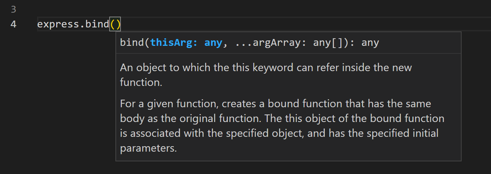
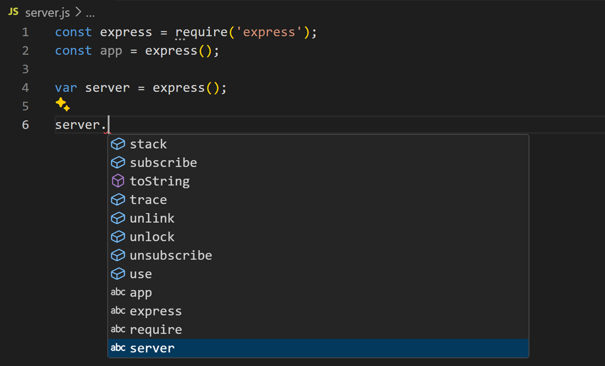
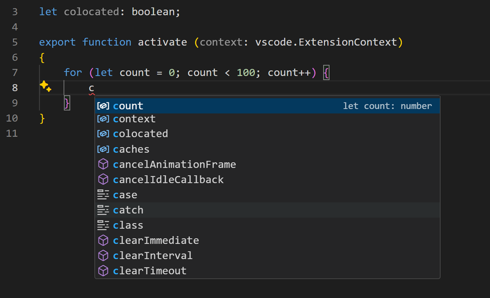
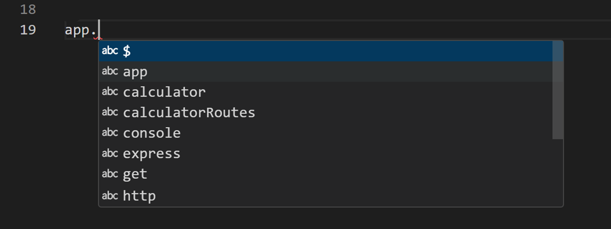

# IntelliSense {#intellisense}

IntelliSense는 코드 완성, 매개변수 정보, 빠른 정보 및 멤버 목록을 포함한 다양한 코드 편집 기능을 위한 일반적인 용어입니다. IntelliSense 기능은 때때로 "코드 완성", "콘텐츠 보조" 및 "코드 힌트"와 같은 다른 이름으로 불리기도 합니다.

<video src="https://code.visualstudio.com/assets/docs/editor/intellisense/intellisense.mp4" title="IntelliSense가 작동하는 모습을 보여주는 비디오입니다. Express 앱에 'app'을 입력할 때 '_router'와 같은 자동 완성이 표시됩니다." autoPlay loop controls muted width="100%"></video>

## 프로그래밍 언어에 대한 IntelliSense {#intellisense-for-your-programming-language}

Visual Studio Code의 IntelliSense는 JavaScript, TypeScript, JSON, HTML, CSS, SCSS 및 Less에 대해 기본적으로 제공됩니다. VS Code는 모든 프로그래밍 언어에 대해 단어 기반 완성을 지원하지만, 언어 확장 프로그램을 설치하여 더 풍부한 IntelliSense를 구성할 수도 있습니다.

아래는 [Visual Studio Marketplace](https://marketplace.visualstudio.com/vscode)에서 가장 인기 있는 언어 확장 프로그램입니다. 아래의 링크를 선택하여 설명과 리뷰를 읽고 어떤 확장이 가장 적합한지 결정하세요.

- [Python](https://marketplace.visualstudio.com/items?itemName=ms-python.python)
- [C/C++](https://marketplace.visualstudio.com/items?itemName=ms-vscode.cpptools)
- [Extension Pack for Java](https://marketplace.visualstudio.com/items?itemName=vscjava.vscode-java-pack)
- [C#](https://marketplace.visualstudio.com/items?itemName=ms-dotnettools.csharp)
- [Go](https://marketplace.visualstudio.com/items?itemName=golang.Go)
- [Dart](https://marketplace.visualstudio.com/items?itemName=Dart-Code.dart-code)
- [PHP Extension Pack](https://marketplace.visualstudio.com/items?itemName=xdebug.php-pack)
- [Ruby LSP](https://marketplace.visualstudio.com/items?itemName=Shopify.ruby-lsp)

## IntelliSense 기능 {#intellisense-features}

VS Code의 IntelliSense 기능은 언어 서비스에 의해 제공됩니다. 언어 서비스는 프로그래밍 언어의 문법과 소스 코드를 분석하여, 지능형 코드 완성을 제공합니다. 언어 서비스가 가능한 완성을 알고 있다면, 입력하는 즉시 IntelliSense 추천 목록이 나타납니다. 문자를 계속 입력하면 멤버 목록(변수, 메서드 등)이 입력한 문자를 포함하는 멤버만 포함하도록 필터링됩니다. 선택한 항목을 삽입하려면 `kbstyle(Tab)` 또는 `kbstyle(Enter)`를 누릅니다.

편집기 창에서 `kb(editor.action.triggerSuggest)`를 입력하거나 트리거 문자(예: JavaScript에서 점 문자(`kbstyle(.)`))를 입력하여 IntelliSense를 트리거할 수 있습니다.

<video src="https://code.visualstudio.com//assets/docs/editor/intellisense/intellisense.mp4" title="'package.json' 파일에서 'Ctrl+Space'로 IntelliSense가 트리거되는 모습을 보여주는 비디오입니다." autoPlay loop controls muted width="100%"></video>

:::tip
자동 완성 항목은 CamelCase 필터링을 지원하므로, 메서드 이름에서 대문자로 된 문자를 입력하여 자동 완성을 제한할 수 있습니다. 예를 들어, "cra"를 입력하면 "createApplication"이 나타납니다.
:::

원하는 경우 입력하는 동안 IntelliSense를 끌 수 있습니다. VS Code의 IntelliSense 기능을 비활성화하거나 사용자 지정하는 방법은 [IntelliSense 사용자 지정](#customizing-intellisense)을 참조하세요.

언어 서비스에서 제공하는 대로, `kb(toggleSuggestionDetails)`를 누르거나 `>` 아이콘을 선택하여 각 메서드에 대한 **빠른 정보**를 볼 수 있습니다. 메서드에 대한 문서가 옆으로 확장됩니다. 확장된 문서는 목록을 탐색할 때 업데이트되며 계속 사용할 수 있습니다. `kb(toggleSuggestionDetails)`를 다시 누르거나 닫기 아이콘을 선택하여 이를 닫을 수 있습니다.

<video src="https://code.visualstudio.com/assets/docs/editor/intellisense/intellisense_docs.mp4" title="자동 완성에 대한 빠른 정보를 보여주는 비디오입니다." autoPlay loop controls muted width="100%"></video>

메서드를 선택한 후에는 **매개변수 정보**가 제공됩니다.



적용 가능한 경우, 언어 서비스는 빠른 정보 및 함수 시그니처에서 기본 타입을 표시합니다. 이전 스크린샷에서 여러 `any` 타입을 볼 수 있습니다. JavaScript는 동적이며 타입을 필요로 하거나 강제하지 않기 때문에 `any`는 해당 변수가 어떤 타입이든 될 수 있음을 의미합니다.

## 타입 완성 {#types-of-completions}

다음 스크린샷의 JavaScript 코드는 IntelliSense 완성을 보여줍니다. IntelliSense는 추론된 자동 완성과 프로젝트의 전역 식별자를 제공합니다. 추론된 기호가 먼저 제시되고, 그 다음에 전역 식별자(‘abc’ 단어 아이콘으로 표시됨)가 나타납니다.



VS Code의 IntelliSense는 언어 서버 추천, 스니펫 및 단순한 단어 기반 텍스트 완성을 포함한 다양한 타입의 완성을 제공합니다.

| 아이콘 | 이름 | 기호 타입 |
| ---- | ---- | ----------- |
| <i className="codicon codicon-symbol-method" style={{"color": "#b180d7"}}></i> | 메서드 및 함수 | `method`, `function`, `constructor`  |
| <i className="codicon codicon-symbol-variable" style={{"color": "#75beff"}}></i> | 변수 | `variable` |
| <i className="codicon codicon-symbol-field" style={{"color": "#75beff"}}></i> | 필드 | `field` |
| <i className="codicon codicon-symbol-parameter"></i> | 타입 매개변수 | `typeParameter` |
| <i className="codicon codicon-symbol-constant"></i> | 상수 | `constant` |
| <i className="codicon codicon-symbol-class" style={{"color": "#ee9d28"}}></i> | 클래스 | `class` |
| <i className="codicon codicon-symbol-interface" style={{"color": "#75beff"}}></i> | 인터페이스 | `interface` |
| <i className="codicon codicon-symbol-structure"></i> | 구조체 | `struct` |
| <i className="codicon codicon-symbol-event" style={{"color": "#ee9d28"}}></i> | 이벤트 | `event` |
| <i className="codicon codicon-symbol-operator"></i> | 연산자 | `operator` |
| <i className="codicon codicon-symbol-namespace"></i> | 모듈 | `module` |
| <i className="codicon codicon-symbol-property"></i> | 속성 및 특성 | `property` |
| <i className="codicon codicon-symbol-enum" style={{"color": "#ee9d28"}}></i> | 열거형 | `enum` |
| <i className="codicon codicon-symbol-enum-member" style={{"color": "#75beff"}}></i> | 열거형 멤버 | `enumMember` |
| <i className="codicon codicon-symbol-reference"></i> | 참조 | `reference` |
| <i className="codicon codicon-symbol-keyword"></i> | 키워드 | `keyword` |
| <i className="codicon codicon-symbol-file"></i> | 파일 | `file` |
| <i className="codicon codicon-symbol-folder"></i> | 폴더 | `folder` |
| <i className="codicon codicon-symbol-color"></i> | 색상 | `color` |
| <i className="codicon codicon-symbol-ruler"></i> | 단위 | `unit` |
| <i className="codicon codicon-symbol-snippet"></i> | 스니펫 접두사 | `snippet` |
| <i className="codicon codicon-symbol-text"></i> | 단어 | `text` |

## IntelliSense 사용자 지정 {#customizing-intellisense}

설정 및 키보드 단축키에서 IntelliSense 경험을 사용자 지정할 수 있습니다.

### 설정 {#settings}

아래에 표시된 설정은 기본 설정입니다. [설정 편집기](/docs/editor/settings.md#settings-editor)(`kb(workbench.action.openSettings)`)에서 이러한 설정을 변경할 수 있습니다.

```javascript
{
    // 입력하는 동안 자동 완성 자동 완성을 표시할지 설정합니다.
    "editor.quickSuggestions": {
        "other": true,
        "comments": false,
        "strings": false
    },

    // 특정 문자(예: JavaScript에서 세미콜론 `;`)를 입력했을 때 자동 완성을 확정할지 설정합니다.
    "editor.acceptSuggestionOnCommitCharacter": true,

    // 'Enter' 키로 자동 완성을 확정할지 설정합니다.
    // 'smart'를 선택하면 입력한 내용이 변경될 때만 'Enter'로 확정됩니다.
    "editor.acceptSuggestionOnEnter": "on",

    // 자동 완성 자동 완성이 표시되기까지의 지연 시간을 밀리초 단위로 설정합니다.
    "editor.quickSuggestionsDelay": 10,

    // 특정 문자를 입력했을 때 자동으로 자동 완성 목록을 표시할지 설정합니다.
    "editor.suggestOnTriggerCharacters": true,

    // 'Tab' 키를 눌렀을 때 최적의 자동 완성 항목을 삽입하고, 
    // 다른 항목을 순환할 수 있도록 할지 설정합니다.
    "editor.tabCompletion": "off",

    // 커서 위치와 가까운 단어를 우선적으로 자동 완성 목록에 표시할지 설정합니다.
    "editor.suggest.localityBonus": true,

    // 자동 완성 목록이 표시될 때, 기본 선택 항목을 결정하는 방식을 설정합니다.
    "editor.suggestSelection": "first",
 
    // 코드에서 기존 단어를 기반으로 자동 완성할지 설정합니다.
    "editor.wordBasedSuggestions": "matchingDocuments", // 현재 문서와 일치하는 단어를 기반으로 자동 완성

    // 함수나 메서드를 입력할 때 매개변수 힌트를 표시할지 설정합니다.
    "editor.parameterHints.enabled": true,
}
```

### 탭 완성 {#tab-completion}

편집기는 _탭 완성_ 을 지원하며, `kb(insertBestCompletion)`를 눌러 가장 잘 일치하는 완성을 삽입합니다. 이는 자동 완성 목록이 표시되든 그렇지 않든 작동합니다. 또한, 자동 완성을 삽입한 후 `kb(insertNextSuggestion)`를 누르면 다음으로 좋은 자동 완성 항목이 삽입됩니다.

<video src="https://code.visualstudio.com/assets/docs/editor/intellisense/tabCompletion.mp4" title="탭 키로 자동 완성 사이를 전환하는 모습을 보여주는 비디오입니다." autoPlay loop controls muted width="100%"></video>

기본적으로 탭 완성은 비활성화되어 있습니다. `setting(editor.tabCompletion)` 설정을 사용하여 이를 활성화할 수 있습니다. 다음 값이 존재합니다:

* `off` - (기본값) 탭 완성이 비활성화됩니다.
* `on` - 탭 완성이 모든 자동 완성에 대해 활성화되며, 반복 호출 시 다음으로 좋은 자동 완성을 삽입합니다.
* `onlySnippets` - 탭 완성은 현재 줄 접두사와 접두사가 일치하는 정적 스니펫만 삽입합니다.

### 위치 기반 추천 {#locality-bonus}

자동 완성 항목의 정렬은 확장 정보와 현재 입력 중인 단어와 얼마나 잘 일치하는지에 따라 달라집니다. 또한, `setting(editor.suggest.localityBonus)` 설정을 사용하여 커서 위치에 더 가까운 자동 완성을 우선시하도록 편집기에 요청할 수 있습니다.



이전 스크린샷에서 `count`, `context`, 및 `colocated`가 나타나는 범위(루프, 함수, 파일)에 따라 정렬된 것을 볼 수 있습니다.

### 자동 완성 선택 {#suggestion-selection}

기본적으로 VS Code는 자동 완성 목록에서 첫 번째 자동 완성을 미리 선택합니다. 예를 들어, 자동 완성 목록에서 가장 최근에 사용된 항목을 항상 선택하도록 다른 동작을 원한다면 `setting(editor.suggestSelection)` 설정을 사용할 수 있습니다.

사용 가능한 `setting(editor.suggestSelection)` 값은 다음과 같습니다:

* `first` - (기본값) 항상 목록의 첫 번째 항목을 선택합니다.
* `recentlyUsed` - 이전에 사용된 항목이 선택되며, 접두사(선택할 텍스트)를 입력하면 다른 항목이 선택됩니다.
* `recentlyUsedByPrefix` - 이전 접두사에 따라 자동 완성이 완료된 항목을 선택합니다.

가장 최근에 사용된 항목을 선택하는 것은 동일한 완성을 여러 번 빠르게 삽입할 수 있어 매우 유용합니다.

"선택할 텍스트 입력"은 현재 접두사(대략 커서 왼쪽의 텍스트)가 자동 완성을 필터링하고 정렬하는 데 사용된다는 것을 의미합니다. 이 경우 결과가 `recentlyUsed`의 결과와 다르면 우선권이 부여됩니다.

마지막 옵션인 `recentlyUsedByPrefix`를 사용할 때, VS Code는 특정 접두사(부분 텍스트)에 대해 어떤 항목이 선택되었는지 기억합니다. 예를 들어, `co`를 입력한 후 `console`을 선택하면, 다음에 `co`를 입력할 때 자동 완성 `console`이 미리 선택됩니다. 이를 통해 다양한 접두사를 서로 다른 자동 완성에 빠르게 매핑할 수 있습니다. 예를 들어 `co` -> `console` 및 `con` -> `const`와 같이요.

### 자동 완성의 스니펫 {#snippets-in-suggestions}

기본적으로 VS Code는 스니펫과 코드 자동 완성 제안을 같은 목록에서 함께 표시합니다.  `setting(editor.snippetSuggestions)` 설정을 사용하여 동작을 수정할 수 있습니다. 자동 완성 목록에서 스니펫을 제거하려면 값을 `"none"`으로 설정하세요. 스니펫을 보고 싶다면 자동 완성에 대한 상대적인 순서를 지정할 수 있습니다. 맨 위(`"top"`), 맨 아래(`"bottom"`), 또는 알파벳 순서로 인라인(`"inline"`)으로 정렬합니다. 기본값은 `"inline"`입니다.

### 키보드 단축키 {#keyboard-shortcuts}

여기 표시된 키보드 단축키는 기본 키보드 단축키입니다. 다른 키보드 단축키를 할당하려면 [키보드 단축키 편집기](/docs/editor/keybindings.md)(`kb(workbench.action.openGlobalKeybindings)`)를 사용하세요.

| 명령 | 키 바인딩 |
| --- | --- |
| `editor.action.triggerSuggest` | `kb(editor.action.triggerSuggest)` |
| `toggleSuggestionDetails` | `kb(toggleSuggestionDetails)` |
| `toggleSuggestionFocus` | `kb(toggleSuggestionFocus)` |

:::tip
> IntelliSense와 관련된 더 많은 키보드 단축키가 있습니다. **Default Keyboard Shortcuts**(**File** > **환Preferences** > **Keyboard Shortcuts**)를 열고 "suggest"를 검색하세요.
:::

## AI로 완성 향상하기 {#enhance-completions-with-ai}

GitHub Copilot은 편집기에서 입력하는 동안 코딩 자동 완성을 제공합니다. 또한 Copilot에게 코드를 작성하는 최선의 방법, 버그 수정 방법 또는 다른 사람의 코드 작동 방식과 같은 코딩 관련 질문을 할 수 있습니다.

시작하려면:

1. [GitHub Copilot 확장](https://marketplace.visualstudio.com/items?itemName=GitHub.copilot)을 설치하세요.

1. [Copilot 빠른 시작](/docs/copilot/getting-started.md)에서 주요 기능을 알아보세요.

:::tip
아직 Copilot 구독이 없다면, [Copilot 무료 요금제](https://github.com/github-copilot/signup)에 가입하여 무료로 Copilot을 사용할 수 있으며, 월별 완성과 채팅 상호작용 한도가 제공됩니다.
:::

## 문제 해결 {#troubleshooting}

IntelliSense가 작동하지 않는 경우 언어 서비스가 실행되고 있지 않을 수 있습니다. VS Code를 재시작해 보세요. 이로 인해 문제가 해결될 수 있습니다. 언어 확장을 설치한 후에도 여전히 IntelliSense 기능이 누락된 경우, 언어 확장 저장소에 문제를 열어보세요.

:::tip
JavaScript IntelliSense 구성 및 문제 해결에 대한 내용은 [JavaScript 문서](/docs/languages/javascript.md#intellisense)를 참조하세요.
:::

특정 언어 확장 프로그램이 모든 VS Code IntelliSense 기능을 지원하지 않을 수 있습니다. 지원되는 내용을 확인하려면 확장의 README를 검토하세요. 언어 확장에 문제가 있다고 생각되면, 일반적으로 [VS Code Marketplace](https://marketplace.visualstudio.com/vscode)를 통해 확장 프로그램의 문제 저장소를 찾을 수 있습니다. 확장의 세부정보 페이지로 이동하여 **Support** 링크를 선택하세요.

## 다음 단계 {#next-steps}

IntelliSense는 VS Code의 강력한 기능 중 하나일 뿐입니다. 더 알아보려면 계속 읽어보세요:

* [디버깅](/docs/editor/debugging.md) - 애플리케이션의 디버깅을 설정하는 방법을 알아보세요.
* [언어 확장 프로그램 만들기](/api/language-extensions/programmatic-language-features.md) - 새로운 프로그래밍 언어에 대한 IntelliSense를 추가하는 확장을 만드는 방법을 알아보세요.
* [VS Code의 GitHub Copilot](/docs/copilot/overview.md) - GitHub Copilot과 함께 AI를 사용하여 코딩을 향상시키는 방법을 알아보세요.

## 자주 묻는 질문 {#common-questions}

### 왜 자동 완성이 나타나지 않나요? {#why-am-i-not-getting-any-suggestions}

이는 다양한 이유로 발생할 수 있습니다. 먼저, VS Code를 재시작해 보세요. 문제가 지속되면 언어 확장의 문서를 참조하세요. JavaScript 관련 문제 해결에 대해서는 [JavaScript 언어 주제](/docs/languages/javascript.md#intellisense)를 참조하세요.

### 왜 메서드 및 변수 자동 완성이 나타나지 않나요? {#why-am-i-not-seeing-method-and-variable-suggestions}



이 문제는 JavaScript에서 타입 선언(타이핑) 파일이 누락되어 발생합니다. 대부분의 일반 JavaScript 라이브러리는 선언 파일과 함께 제공되거나 타입 선언 파일을 사용할 수 있습니다.

사용 중인 라이브러리에 해당하는 npm 또는 yarn 패키지를 설치했는지 확인하세요. [JavaScript 작업하기](/docs/nodejs/working-with-javascript.md#intellisense) 기사에서 IntelliSense에 대해 더 알아보세요. 다른 언어에 대해서는 확장의 문서를 참조하세요.
