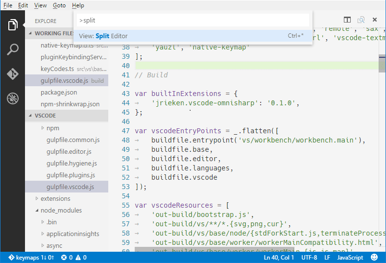
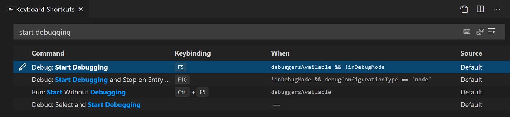

# Visual Studio Code의 키보드 단축키 {#keyboard-shortcuts-for-visual-studio-code}

Visual Studio Code는 대부분의 작업을 키보드에서 직접 수행할 수 있도록 해줍니다. 이 문서에서는 VS Code와 함께 제공되는 기본 키보드 단축키를 수정하는 방법을 설명합니다.

> [!NOTE]
> Mac에서 이 페이지를 방문하면 Mac용 키보드 단축키가 표시됩니다. Windows 또는 Linux를 사용하여 방문하면 해당 플랫폼의 키가 표시됩니다. 다른 플랫폼의 키보드 단축키가 필요하면 관심 있는 키 위에 마우스를 올려놓으세요.

## 키보드 단축키 편집기 {#keyboard-shortcuts-editor}

VS Code는 키보드 단축키 편집기를 통해 풍부한 키보드 단축키 편집 경험을 제공합니다. 편집기에는 키보드 단축키가 있는 모든 명령과 없는 명령이 나열되며, 사용 가능한 작업을 통해 키보드 단축키를 변경, 제거 또는 재설정할 수 있습니다. 명령이나 키보드 단축키를 찾으려면 검색 상자를 사용하여 명령이나 단축키를 입력하여 목록을 필터링하세요.

키보드 단축키 편집기를 열려면 **파일** > **환경 설정** > **키보드 단축키** 메뉴를 선택하거나 명령 팔레트에서 **환경 설정: 키보드 단축키 열기** 명령(`kb(workbench.action.openGlobalKeybindings)`)을 사용하세요.


> [!NOTE]
> 키보드 단축키는 현재 키보드 레이아웃에 맞춰져 있습니다. 예를 들어, 미국 키보드 레이아웃에서의 키보드 단축키 `kbstyle(Cmd+\)`는 레이아웃이 독일어로 변경되면 `kbstyle(Ctrl+Shift+Alt+Cmd+7)`로 표시됩니다. 키보드 단축키를 변경하는 대화 상자는 키보드 레이아웃에 따라 올바르고 원하는 키보드 단축키를 할당합니다.

## UI 작업을 위한 단축키 사용자 정의 {#customize-shortcuts-for-ui-actions}

UI 작업에 대한 키보드 단축키를 사용자 정의하려면 작업 공간의 작업 항목을 마우스 오른쪽 버튼으로 클릭하고 **키 바인딩 구성**을 선택하세요. 그러면 해당 명령으로 필터링된 키보드 단축키 편집기가 열립니다. 작업에 `when` 절이 있는 경우 자동으로 포함되어, 필요한 대로 키보드 단축키를 설정하는 것이 더 쉬워집니다.

<video src="images/keybinding/customize-keybinding.mp4" title="분할 편집기 작업에 대한 키보드 단축키를 사용자 정의하는 방법을 보여주는 비디오." autoplay loop controls muted></video>

## 키맵 확장 {#keymap-extensions}

키맵 확장은 VS Code의 단축키를 다른 편집기의 단축키와 일치하도록 수정하므로 새로운 키보드 단축키를 배울 필요가 없습니다.

**파일** > **환경 설정** > **키보드 단축키 마이그레이션...** 메뉴를 선택하여 인기 있는 키맵 확장 목록을 가져올 수 있습니다. 또한 마켓플레이스에는 [키맵 카테고리](https://marketplace.visualstudio.com/search?target=VSCode&category=Keymaps&sortBy=Installs) 확장이 있습니다.

<div class="marketplace-extensions-curated-keymaps"></div>

## 키보드 단축키 참조 {#keyboard-shortcuts-reference}

기본 키보드 단축키의 인쇄 가능한 버전이 있습니다. **도움말** > **키보드 단축키 참조**를 선택하여 인쇄하기에 적합한 압축 PDF 버전을 표시합니다.

다음 링크를 통해 세 가지 플랫폼별 버전(미국 영어 키보드)에 접근할 수 있습니다:

- [Windows](https://go.microsoft.com/fwlink/?linkid=832145)
- [macOS](https://go.microsoft.com/fwlink/?linkid=832143)
- [Linux](https://go.microsoft.com/fwlink/?linkid=832144)

## 키보드 단축키 충돌 감지 {#detecting-keyboard-shortcut-conflicts}

많은 확장을 설치했거나 키보드 단축키를 수정한 경우, 동일한 키보드 단축키가 여러 명령에 매핑되는 키보드 단축키 충돌이 발생할 수 있습니다. 이는 편집기에서 이동할 때 서로 다른 키보드 단축키가 범위에 들어가고 나가는 경우 혼란스러운 동작을 초래할 수 있습니다.

키보드 단축키 목록에서 항목을 마우스 오른쪽 버튼으로 클릭하고 **동일한 키 바인딩 표시**를 선택하여 동일한 키보드 단축키를 가진 모든 항목을 볼 수 있습니다.


## 키보드 단축키 문제 해결 {#troubleshooting-keyboard-shortcuts}

키보드 단축키 문제를 해결하려면 **개발자: 키보드 단축키 문제 해결 전환** 명령을 실행할 수 있습니다. 이 명령은 전송된 키보드 단축키의 로깅을 활성화하고 해당 로그 파일이 있는 출력 패널을 엽니다.

그런 다음 원하는 키보드 단축키를 눌러 VS Code가 감지하는 키보드 단축키와 호출되는 명령을 확인할 수 있습니다.

예를 들어, macOS의 코드 편집기에서 `cmd+/`를 누르면 로깅 출력은 다음과 같습니다:

```
[KeybindingService]: / Received  keydown event - modifiers: [meta], code: MetaLeft, keyCode: 91, key: Meta
[KeybindingService]: | Converted keydown event - modifiers: [meta], code: MetaLeft, keyCode: 57 ('Meta')
[KeybindingService]: \ Keyboard event cannot be dispatched.
[KeybindingService]: / Received  keydown event - modifiers: [meta], code: Slash, keyCode: 191, key: /
[KeybindingService]: | Converted keydown event - modifiers: [meta], code: Slash, keyCode: 85 ('/')
[KeybindingService]: | Resolving meta+[Slash]
[KeybindingService]: \ From 2 keybinding entries, matched editor.action.commentLine, when: editorTextFocus && !editorReadonly, source: built-in.
```

예제 로그에서 첫 번째 keydown 이벤트는 `MetaLeft` 키(`cmd`)에 대한 것이며 전송할 수 없습니다. 두 번째 keydown 이벤트는 `Slash` 키(`/`)에 대한 것이며 `meta+[Slash]`로 전송됩니다. `meta+[Slash]`에서 매핑된 두 개의 키보드 단축키 항목이 있었고, 일치한 것은 `editor.action.commentLine` 명령에 대한 것으로, `when` 조건은 `editorTextFocus && !editorReadonly`이며 기본 제공 키보드 단축키 항목입니다.

## 수정된 키보드 단축키 보기 {#viewing-modified-keyboard-shortcuts}

수정한 단축키만 표시하도록 목록을 필터링하려면 **더 많은 작업**(**...**) 메뉴에서 **사용자 키 바인딩 표시** 명령을 선택하세요. 이렇게 하면 **키보드 단축키** 편집기에서 `@source:user` 필터가 적용됩니다 (**소스**는 '사용자'입니다).


## 고급 사용자 정의 {#advanced-customization}

VS Code는 `keybindings.json` 파일에서 사용자 정의한 키보드 단축키를 추적합니다. 고급 사용자 정의를 위해 `keybindings.json` 파일을 직접 수정할 수도 있습니다.

`keybindings.json` 파일을 열려면:

- **키보드 단축키** 편집기를 열고, 편집기 제목 표시줄 오른쪽에 있는 **키보드 단축키 열기 (JSON)** 버튼을 선택하세요.

  

- 또는 명령 팔레트에서 **기본 키보드 단축키 열기 (JSON)** 명령을 사용하세요 (`kb(workbench.action.showCommands)`).

## 키보드 규칙 {#keyboard-rules}

VS Code의 키보드 단축키 구성은 _키보드 규칙_이라고도 합니다. 각 규칙은 다음 속성으로 구성됩니다:

- `key`: 눌린 키를 설명합니다. 예: `kb(actions.find)`.
- `command`: 실행할 VS Code 명령의 식별자입니다. 예: 탐색기 보기를 열기 위한 `workbench.view.explorer`.
- `when`: (선택 사항) 현재 [컨텍스트](#when-clause-contexts)에 따라 평가되는 부울 표현식을 포함하는 절입니다.

코드(두 개의 개별 키 입력 동작)는 두 키 입력을 공백으로 구분하여 설명합니다. 예: `kbstyle(Ctrl+K Ctrl+C)`.

키가 눌리면 다음 평가 규칙이 적용됩니다:

- 규칙은 **아래에서 위로** 평가됩니다.
- `key`와 `when` 절 모두에 일치하는 첫 번째 규칙이 수용됩니다.
- 규칙이 발견되면 더 이상 규칙이 처리되지 않습니다.
- 규칙이 발견되고 `command`가 설정된 경우 해당 `command`가 실행됩니다.

추가 `keybindings.json` 규칙은 런타임에 기본 규칙의 하단에 추가되어 기본 규칙을 덮어쓸 수 있습니다. VS Code는 `keybindings.json` 파일을 감시하므로 VS Code가 실행 중일 때 이를 편집하면 런타임에 규칙이 업데이트됩니다.

키보드 단축키 전송은 JSON으로 표현된 규칙 목록을 분석하여 수행됩니다. 다음은 몇 가지 예입니다:

```json
// 편집기에 포커스가 있을 때 활성화되는 키보드 단축키
{ "key": "home",            "command": "cursorHome",                  "when": "editorTextFocus" },
{ "key": "shift+home",      "command": "cursorHomeSelect",            "when": "editorTextFocus" },

// 상호 보완적인 키보드 단축키
{ "key": "f5",              "command": "workbench.action.debug.continue", "when": "inDebugMode" },
{ "key": "f5",              "command": "workbench.action.debug.start",    "when": "!inDebugMode" },

// 전역 키보드 단축키
{ "key": "ctrl+f",          "command": "actions.find" },
{ "key": "alt+left",        "command": "workbench.action.navigateBack" },
{ "key": "alt+right",       "command": "workbench.action.navigateForward" },

// 코드(두 개의 개별 키 입력 동작)를 사용하는 전역 키보드 단축키
{ "key": "ctrl+k enter",    "command": "workbench.action.keepEditor" },
{ "key": "ctrl+k ctrl+w",   "command": "workbench.action.closeAllEditors" },
```

## 허용된 키 {#accepted-keys}

`key`는 수정자와 키 자체로 구성됩니다.

다음 수정자가 허용됩니다:

| 플랫폼   | 수정자                                                              |
| -------- | ---------------------------------------------------------------------- |
| macOS    | `kbstyle(Ctrl+)`, `kbstyle(Shift+)`, `kbstyle(Alt+)`, `kbstyle(Cmd+)`  |
| Windows  | `kbstyle(Ctrl+)`, `kbstyle(Shift+)`, `kbstyle(Alt+)`, `kbstyle(Win+)`  |
| Linux    | `kbstyle(Ctrl+)`, `kbstyle(Shift+)`, `kbstyle(Alt+)`, `kbstyle(Meta+)` |

다음 키가 허용됩니다:

- `kbstyle(f1-f19)`, `kbstyle(a-z)`, `kbstyle(0-9)`
- `` kbstyle(`) ``, `kbstyle(-)`, `kbstyle(=)`, `kbstyle([)`, `kbstyle(])`, `kbstyle(\)`, `kbstyle(;)`, `kbstyle(')`, `kbstyle(,)`, `kbstyle(.)`, `kbstyle(/)`
- `kbstyle(left)`, `kbstyle(up)`, `kbstyle(right)`, `kbstyle(down)`, `kbstyle(pageup)`, `kbstyle(pagedown)`, `kbstyle(end)`, `kbstyle(home)`
- `kbstyle(tab)`, `kbstyle(enter)`, `kbstyle(escape)`, `kbstyle(space)`, `kbstyle(backspace)`, `kbstyle(delete)`
- `kbstyle(pausebreak)`, `kbstyle(capslock)`, `kbstyle(insert)`
- `kbstyle(numpad0-numpad9)`, `kbstyle(numpad_multiply)`, `kbstyle(numpad_add)`, `kbstyle(numpad_separator)`
- `kbstyle(numpad_subtract)`, `kbstyle(numpad_decimal)`, `kbstyle(numpad_divide)`

## 명령 인수 {#command-arguments}

인수와 함께 명령을 호출할 수 있습니다. 이는 특정 파일이나 폴더에서 동일한 작업을 자주 수행하는 경우 유용합니다. 원하는 작업을 정확히 수행하는 사용자 정의 키보드 단축키를 추가할 수 있습니다.

다음은 `kbstyle(Enter)` 키를 재정의하여 텍스트를 인쇄하는 예입니다:

```json
{
  "key": "enter",
  "command": "type",
  "args": { "text": "Hello World" },
  "when": "editorTextFocus"
}
```

`type` 명령은 `{"text": "Hello World"}`를 첫 번째 인수로 받아들이고, 기본 명령을 생성하는 대신 파일에 "Hello World"를 추가합니다.

인수를 받는 명령에 대한 자세한 내용은 [내장 명령](/api/references/commands.md)을 참조하세요.

## 여러 명령 실행 {#running-multiple-commands}

키보드 단축키는 `runCommands` 명령을 사용하여 여러 명령을 순차적으로 실행하도록 구성할 수 있습니다.

- 인수 없이 여러 명령 실행:

  다음 예제는 현재 줄을 아래로 복사하고, 현재 줄을 주석으로 표시하며, 커서를 복사한 줄로 이동합니다.

  ```json
  {
    "key": "ctrl+alt+c",
    "command": "runCommands",
    "args": {
      "commands": [
        "editor.action.copyLinesDownAction",
        "cursorUp",
        "editor.action.addCommentLine",
        "cursorDown"
      ]
    }
  },
  ```

- 명령에 인수 전달:

  이 예제는 새로운 제목 없는 TypeScript 파일을 만들고 사용자 정의 스니펫을 삽입합니다.

  ```json
  {
    "key": "ctrl+n",
    "command": "runCommands",
    "args": {
      "commands": [
        {
          "command": "workbench.action.files.newUntitledFile",
          "args": {
            "languageId": "typescript"
          }
        },
        {
          "command": "editor.action.insertSnippet",
          "args": {
            "langId": "typescript",
            "snippet": "class $\{1:ClassName\}
  {\n\tconstructor() {\n\t\t$0\n\t}\n}"
          }
        }
      ]
    }
  },
  ```

`runCommands`에 의해 실행되는 명령은 `"args"`의 값을 첫 번째 인수로 받습니다. 이전 예제에서 `workbench.action.files.newUntitledFile`은 `{"languageId": "typescript" }`를 첫 번째이자 유일한 인수로 받습니다.

여러 인수를 전달하려면 `"args"`를 배열로 만들어야 합니다:

```json
{
  "key": "ctrl+shift+e",
  "command": "runCommands",
  "args": {
    "commands": [
      {
        // 2개의 인수로 호출된 명령: vscode.executeCommand("myCommand", "arg1", "arg2")
        "command": "myCommand",
        "args": ["arg1", "arg2"]
      }
    ]
  }
}
```

첫 번째 인수로 배열을 전달하려면 배열을 다른 배열로 감싸야 합니다: `"args": [ [1, 2, 3] ]`.

## 키보드 단축키 제거 {#removing-a-keyboard-shortcut}

키보드 단축키를 제거하려면 키보드 단축키 편집기에서 항목을 마우스 오른쪽 버튼으로 클릭하고 **키 바인딩 제거**를 선택하세요.

`keybindings.json` 파일을 사용하여 키보드 단축키를 제거하려면 `command` 앞에 `-`를 추가하면 해당 규칙이 제거 규칙이 됩니다.

다음은 예제입니다:

```json
// 기본 키보드 단축키에서
...
{ "key": "tab", "command": "tab", "when": ... },
{ "key": "tab", "command": "jumpToNextSnippetPlaceholder", "when": ... },
{ "key": "tab", "command": "acceptSelectedSuggestion", "when": ... },
...

// 예를 들어 두 번째 규칙을 제거하려면 keybindings.json에 추가합니다:
{ "key": "tab", "command": "-jumpToNextSnippetPlaceholder" }

```

특정 키보드 단축키 규칙을 빈 작업으로 재정의하려면 빈 명령을 지정할 수 있습니다:

```json
// 예를 들어 모든 `tab` 키보드 단축키를 재정의하고 비활성화하려면 keybindings.json에 추가합니다:
{ "key": "tab", "command": "" }
```

## 키보드 레이아웃 {#keyboard-layouts}

> [!NOTE]
> 이 섹션은 키보드 단축키와 관련이 있으며, 편집기에서의 입력과는 관련이 없습니다.

키는 가상 키에 대한 문자열 표현이며 눌렸을 때 생성되는 문자와 반드시 관련이 있는 것은 아닙니다. 보다 정확하게 말하면:

- 참조: [가상 키 코드 (Windows)](https://msdn.microsoft.com/library/windows/desktop/dd375731)
- `kbstyle(tab)`는 `VK_TAB` (`0x09`)
- `kbstyle(;)`는 `VK_OEM_1` (`0xBA`)
- `kbstyle(=)`는 `VK_OEM_PLUS` (`0xBB`)
- `kbstyle(,)`는 `VK_OEM_COMMA` (`0xBC`)
- `kbstyle(-)`는 `VK_OEM_MINUS` (`0xBD`)
- `kbstyle(.)`는 `VK_OEM_PERIOD` (`0xBE`)
- `kbstyle(/)`는 `VK_OEM_2` (`0xBF`)
- `` kbstyle(`) ``는 `VK_OEM_3` (`0xC0`)
- `kbstyle([)`는 `VK_OEM_4` (`0xDB`)
- `kbstyle(\)`는 `VK_OEM_5` (`0xDC`)
- `kbstyle(])`는 `VK_OEM_6` (`0xDD`)
- `kbstyle(')`는 `VK_OEM_7` (`0xDE`)
- 기타.

다양한 키보드 레이아웃은 일반적으로 이러한 가상 키의 위치를 변경하거나 눌렸을 때 생성되는 문자를 변경합니다. 표준 미국 키보드 레이아웃과 다른 키보드 레이아웃을 사용할 때 Visual Studio Code는 다음과 같이 처리합니다:

모든 키보드 단축키는 현재 시스템의 키보드 레이아웃을 사용하여 UI에 표시됩니다. 예를 들어, 프랑스(프랑스) 키보드 레이아웃을 사용할 때 `Split Editor`는 이제 `kbstyle(Ctrl+*)`로 표시됩니다:



`keybindings.json`을 편집할 때 VS Code는 잘못된 키보드 단축키를 강조 표시합니다. 이는 파일에 표준 미국 키보드 레이아웃에서 생성된 문자로 표현되지만 현재 시스템의 키보드 레이아웃에서 다른 레이블이 있는 키를 눌러야 하는 경우입니다. 예를 들어, 프랑스(프랑스) 키보드 레이아웃을 사용할 때 기본 키보드 단축키 규칙은 다음과 같이 보입니다:


`keybindings.json`을 편집할 때 키보드 단축키 규칙을 입력하는 데 도움이 되는 UI 컨트롤도 있습니다. **키 바인딩 정의** 컨트롤을 시작하려면 `kb(editor.action.defineKeybinding)`를 누르세요. 이 컨트롤은 키 입력을 수신하고 텍스트 상자에 직렬화된 JSON 표현을 렌더링하며, 아래에는 현재 키보드 레이아웃에서 VS Code가 감지한 키가 표시됩니다. 원하는 키 조합을 입력한 후 `kbstyle(Enter)`를 누르면 규칙 스니펫이 삽입됩니다.


> [!NOTE]
> Linux에서는 VS Code가 시작 시 현재 키보드 레이아웃을 감지하고 이 정보를 캐시합니다. 키보드 레이아웃을 변경할 때 VS Code를 다시 시작하는 것이 좋습니다.

## 키보드 레이아웃 독립적인 바인딩 {#keyboard-layout-independent-bindings}

스캔 코드를 사용하면 키보드 레이아웃 변경에 따라 변경되지 않는 키보드 단축키를 정의할 수 있습니다. 예를 들어:

```json
{
  "key": "cmd+[Slash]",
  "command": "editor.action.commentLine",
  "when": "editorTextFocus"
}
```

허용된 스캔 코드는 다음과 같습니다:

- `kbstyle([F1]-[F19])`, `kbstyle([KeyA]-[KeyZ])`, `kbstyle([Digit0]-[Digit9])`
- `kbstyle([Backquote])`, `kbstyle([Minus])`, `kbstyle([Equal])`, `kbstyle([BracketLeft])`, `kbstyle([BracketRight])`, `kbstyle([Backslash])`, `kbstyle([Semicolon])`, `kbstyle([Quote])`, `kbstyle([Comma])`, `kbstyle([Period])`, `kbstyle([Slash])`
- `kbstyle([ArrowLeft])`, `kbstyle([ArrowUp])`, `kbstyle([ArrowRight])`, `kbstyle([ArrowDown])`, `kbstyle([PageUp])`, `kbstyle([PageDown])`, `kbstyle([End])`, `kbstyle([Home])`
- `kbstyle([Tab])`, `kbstyle([Enter])`, `kbstyle([Escape])`, `kbstyle([Space])`, `kbstyle([Backspace])`, `kbstyle([Delete])`
- `kbstyle([Pause])`, `kbstyle([CapsLock])`, `kbstyle([Insert])`
- `kbstyle([Numpad0]-[Numpad9])`, `kbstyle([NumpadMultiply])`, `kbstyle([NumpadAdd])`, `kbstyle([NumpadComma])`
- `kbstyle([NumpadSubtract])`, `kbstyle([NumpadDecimal])`, `kbstyle([NumpadDivide])`

## when 절 컨텍스트 {#when-clause-contexts}

VS Code는 선택적 `when` 절을 통해 키보드 단축키가 활성화되는 정확한 제어를 제공합니다. 키보드 단축키에 `when` 절이 없으면 키보드 단축키는 항상 전역적으로 사용 가능합니다. `when` 절은 키보드 단축키를 활성화하기 위해 true 또는 false로 평가됩니다.

VS Code는 UI에서 어떤 요소가 보이고 활성화되어 있는지에 따라 다양한 컨텍스트 키와 특정 값을 설정합니다. 예를 들어, 내장된 **디버깅 시작** 명령은 키보드 단축키 `kb(workbench.action.debug.start)`를 가지며, 이는 적절한 디버거가 사용 가능할 때만 활성화됩니다(컨텍스트 `debuggersAvailable`가 true) 및 편집기가 디버그 모드에 있지 않을 때(컨텍스트 `inDebugMode`가 false):



기본 `keybinding.json`에서 키보드 단축키의 when 절을 직접 볼 수도 있습니다 (**환경 설정: 기본 키보드 단축키 열기 (JSON)**):

```json
{ "key": "f5",  "command": "workbench.action.debug.start",
                   "when": "debuggersAvailable && !inDebugMode" },
```

### 조건부 연산자 {#conditional-operators}

`when` 절 조건 표현식에 대해 다음 조건부 연산자가 키보드 단축키에 유용합니다:

| 연산자   | 기호              | 예시                                        |
| -------- | ----------------- | ------------------------------------------ |
| 동등성   | `==`              | `"editorLangId == typescript"`             |
| 부등호   | `!=`              | `"resourceExtname != .js"`                 |
| 또는      | <code>\|\|</code> | `"isLinux`<code>\|\|</code>`isWindows"`    |
| 그리고    | `&&`              | `"textInputFocus && !editorReadonly"`      |
| 일치      | `=~`              | `"resourceScheme =~ /^untitled$\|^file$/"` |

`when` 절 조건부 연산자의 전체 목록은 [when 절 컨텍스트](/api/references/when-clause-contexts.md#conditional-operators) 참조에서 확인할 수 있습니다.

### 사용 가능한 컨텍스트 {#available-contexts}

사용 가능한 `when` 절 컨텍스트의 일부는 [when 절 컨텍스트 참조](/api/references/when-clause-contexts.md)에서 확인할 수 있습니다.

거기 목록은 포괄적이지 않으며, 키보드 단축키 편집기에서 검색하고 필터링하거나 기본 `keybindings.json` 파일을 검토하여 다른 `when` 절 컨텍스트를 찾을 수 있습니다 (**환경 설정: 기본 키보드 단축키 열기 (JSON)**).

## 리팩토링을 위한 사용자 정의 키보드 단축키 {#custom-keyboard-shortcuts-for-refactorings}

`editor.action.codeAction` 명령을 사용하면 특정 [리팩토링](/docs/editor/refactoring.md) (코드 작업)에 대한 키보드 단축키를 구성할 수 있습니다. 예를 들어, 아래의 키보드 단축키는 **함수 추출** 리팩토링 코드 작업을 트리거합니다:

```json
{
  "key": "ctrl+shift+r ctrl+e",
  "command": "editor.action.codeAction",
  "args": {
    "kind": "refactor.extract.function"
  }
}
```

이 내용은 [리팩토링](/docs/editor/refactoring.md#keyboard-shortcuts-for-code-actions) 문서에서 자세히 다루고 있으며, 다양한 종류의 코드 작업과 여러 가능한 리팩토링의 경우 우선 순위를 정하는 방법에 대해 배울 수 있습니다.

## 관련 리소스 {#related-resources}

- [VS Code 기본 키보드 단축키 참조](/docs/reference/default-keybindings.md)

## 자주 묻는 질문 {#common-questions}

### 특정 키에 바인딩된 명령을 어떻게 확인할 수 있나요? {#how-can-i-find-out-what-command-is-bound-to-a-specific-key}

키보드 단축키 편집기에서 특정 키 입력으로 필터링하여 어떤 명령이 어떤 키에 바인딩되어 있는지 확인할 수 있습니다. 다음 스크린샷에서 `kbstyle(Ctrl+Shift+P)`가 **모든 명령 표시**에 바인딩되어 명령 팔레트를 호출하는 것을 볼 수 있습니다.


### 작업에 키보드 단축키를 추가하려면 어떻게 하나요? 예를 들어, Ctrl+D를 줄 삭제에 추가하려면 {#how-to-add-a-keyboard-shortcut-to-an-action-for-example-add-ctrld-to-delete-lines}

**기본 키보드 단축키**에서 작업을 트리거하는 규칙을 찾아 `keybindings.json` 파일에 수정된 버전을 작성하세요:

```json
// 기본 키보드 단축키에서
{ "key": "ctrl+shift+k",          "command": "editor.action.deleteLines",
                                     "when": "editorTextFocus" },
// 수정된 버전, 사용자/keybindings.json에서, 이제 Ctrl+D도 이 작업을 트리거합니다
{ "key": "ctrl+d",                "command": "editor.action.deleteLines",
                                     "when": "editorTextFocus" },
```

### 특정 파일 유형에 대해서만 키보드 단축키를 추가하려면 어떻게 하나요? {#how-can-i-add-a-keyboard-shortcut-for-only-certain-file-types}

`when` 절에서 `editorLangId` 컨텍스트 키를 사용하세요:

```json
{ "key": "shift+alt+a",           "command": "editor.action.blockComment",
                                     "when": "editorTextFocus && editorLangId == csharp" },
```

### `keybindings.json`에서 키보드 단축키를 수정했는데 왜 작동하지 않나요? {#i-have-modified-my-keyboard-shortcuts-in-keybindingsjson-why-dont-they-work}

가장 일반적인 문제는 파일의 구문 오류입니다. 그렇지 않으면 `when` 절을 제거하거나 다른 `key`를 선택해 보세요. 불행히도 이 시점에서는 시행착오 과정이 필요합니다.
---