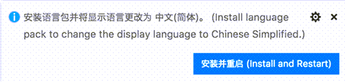
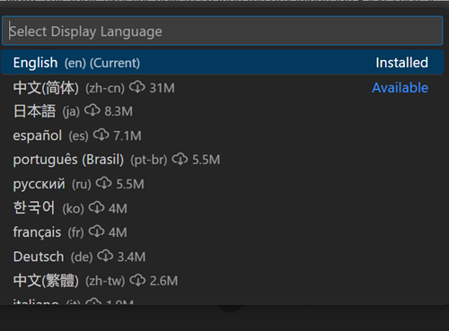

# UI 언어 {#display-language}

Visual Studio Code는 기본적으로 영어를 UI 언어로 제공하며, 다른 [언어](#available-locales)는 [마켓플레이스](https://marketplace.visualstudio.com/search?target=VSCode&category=Language%20Packs&sortBy=Installs)에서 제공되는 언어 팩 [확장 프로그램](docs/editor/extension-marketplace.md)에 의존합니다.

VS Code는 운영 체제의 UI 언어를 감지하고, 마켓플레이스에서 사용할 수 있는 경우 적절한 언어 팩을 설치하라는 메시지를 표시합니다. 아래는 간체 중국어 언어 팩을 추천하는 예시입니다:



언어 팩 확장을 설치하고 재시작하라는 메시지를 따르면, VS Code는 운영 체제의 UI 언어와 일치하는 언어 팩을 사용합니다.

:::note
이 문서에서는 프랑스어 또는 중국어와 같은 언어 팩을 통해 VS Code UI의 UI 언어를 변경하는 방법을 설명합니다. C++ 또는 Java와 같은 프로그래밍 언어 지원을 추가하려면 문서의 [프로그래밍 언어](/docs/languages/overview.md) 섹션을 참조하세요.
:::

## UI 언어 변경 {#changing-the-display-language}

VS Code의 UI 언어를 명시적으로 설정하여 기본 UI 언어를 재정의할 수도 있습니다. 이를 위해 **Configure Display Language** 명령을 사용합니다.

`kb(workbench.action.showCommands)`를 눌러 **Command Palette**를 열고 "display"를 입력하여 **Configure Display Language** 명령을 필터링하고 표시합니다.


`kbstyle(Enter)`를 누르면 [로케일](#available-locales)별로 사용 가능한 언어 목록이 표시되며, 현재 활성 언어가 강조 표시됩니다.



다른 언어를 선택하여 UI 언어를 변경합니다. 언어 팩이 아직 설치되지 않은 경우, VS Code가 이를 설치합니다. 다른 UI 언어를 선택하면 재시작하라는 메시지가 표시됩니다.

**Configure Display Language** 명령은 사용자 VS Code 폴더(`.vscode`)의 런타임 구성 인수 파일 `argv.json`에 기록됩니다.

UI 언어는 `argv.json` 파일을 직접 편집하여 변경할 수도 있으며 (**Preferences: Configure Runtime Arguments**) VS Code를 재시작해야 합니다.

## 사용 가능한 로케일 {#available-locales}

UI 언어 | 로케일
-----------------|-------
영어 (미국) | `en`
간체 중국어 | `zh-cn`
번체 중국어 | `zh-tw`
프랑스어 | `fr`
독일어 | `de`
이탈리아어 | `it`
스페인어 | `es`
일본어 | `ja`
한국어 | `ko`
러시아어 | `ru`
포르투갈어 (브라질) | `pt-br`
터키어 | `tr`
폴란드어 | `pl`
체코어 | `cs`
헝가리어 | `hu`

## 마켓플레이스 언어 팩 {#marketplace-language-packs}

위에서 설명한 바와 같이, VS Code는 기본 UI 언어로 영어를 제공하지만, 다른 언어는 [마켓플레이스 언어 팩](https://marketplace.visualstudio.com/search?target=VSCode&category=Language%20Packs&sortBy=Installs)을 통해 사용할 수 있습니다.

확장 보기(`kb(workbench.view.extensions)`)에서 원하는 언어와 함께 `category:"Language Packs"`를 입력하여 언어 팩을 검색할 수도 있습니다.


여러 언어 팩을 설치하고 **UI 언어 구성** 명령을 사용하여 현재 UI 언어를 선택할 수 있습니다.

## 언어 설정 {#setting-the-language}

특정 언어를 VS Code 세션에 사용하려면, VS Code를 실행할 때 `--locale` 명령줄 스위치를 사용하여 로케일을 지정할 수 있습니다.

아래는 `--locale` 명령줄 스위치를 사용하여 VS Code의 UI 언어를 프랑스어로 설정하는 예시입니다:

```bash
code . --locale=fr
```

:::note
명령줄 스위치로 지정한 언어에 대해 적절한 언어 팩이 설치되어 있어야 합니다. 일치하는 언어 팩이 설치되지 않은 경우, VS Code는 영어로 표시됩니다.
:::

## 자주 묻는 질문 {#common-questions}

### 파일이 변경된 상태여서 저장할 수 없습니다{#unable-to-write-to-file-because-the-file-is-dirty}

이 알림은 이전 변경 사항이 저장되지 않아 `argv.json` 파일이 수정된 상태로 남아 있음을 의미할 수 있습니다. 파일에 오류가 있는지 확인하고 (**Preferences: Configure Runtime Arguments**), 파일을 저장한 후 다시 언어 팩을 설치해 보세요.

### 언어 팩의 번역에 기여할 수 있나요? {#can-i-contribute-to-a-language-packs-translations}

네, [Visual Studio Code 커뮤니티 로컬라이제이션 프로젝트](https://aka.ms/vscodeloc)는 누구나 참여할 수 있으며, 기여자는 새로운 번역을 제공하거나 기존 번역에 투표하거나 프로세스 개선을 제안할 수 있습니다.

### Python과 같은 프로그래밍 언어를 어떻게 활성화할 수 있나요? {#how-can-i-enable-a-programming-language-like-python}

PHP, Python, Java와 같은 프로그래밍 언어 지원을 설치하는 방법은 [프로그래밍 언어](/docs/languages/overview.md) 섹션을 참조하세요.
