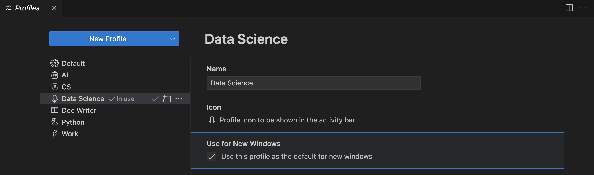
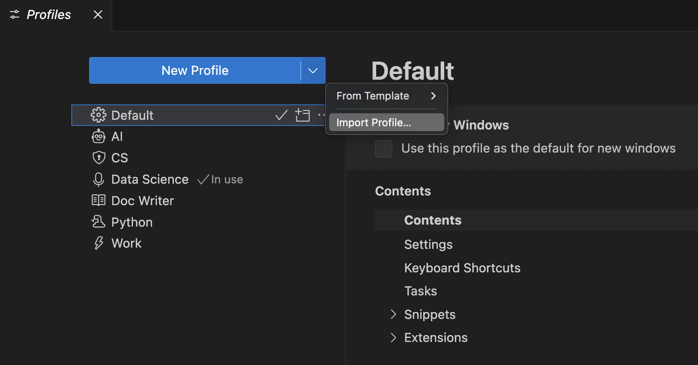

# Visual Studio Code의 프로필 {#profiles-in-visual-studio-code}

Visual Studio Code는 수백 개의 [설정](/docs/editor/settings.md), 수천 개의 [확장](/docs/editor/extension-marketplace.md), 그리고 편집기를 사용자 정의하기 위한 UI 레이아웃 조정 방법이 무수히 많습니다. VS Code **프로필**을 사용하면 사용자 정의 세트를 생성하고 이들 간에 빠르게 전환하거나 다른 사람과 공유할 수 있습니다. 이 주제에서는 **프로필 편집기**를 사용하여 프로필을 생성, 수정, 내보내기 및 가져오는 방법을 설명합니다.

## 프로필 편집기 접근 {#access-the-profiles-editor}

**프로필 편집기**를 사용하면 단일 장소에서 VS Code의 프로필을 생성하고 관리할 수 있습니다.


다음 방법 중 하나로 프로필 편집기에 접근할 수 있습니다:

- **파일** > **환경 설정** > **프로필** 메뉴 항목에서

    

- 활동 바 하단의 **관리** 기어 버튼에서.

    

## 프로필 생성 {#create-a-profile}

VS Code는 현재 구성을 **기본 프로필**로 취급합니다. 설정을 수정하거나, 확장을 설치하거나, 뷰를 이동하여 UI 레이아웃을 변경하면 이러한 사용자 정의가 기본 프로필에 기록됩니다.

새 프로필을 생성하려면 프로필 편집기를 열고 **새 프로필** 버튼을 선택합니다. 그러면 프로필 이름을 입력하고 아이콘을 선택하며 새 프로필에 포함할 내용을 구성할 수 있는 새 프로필 양식이 열립니다.


프로필 템플릿이나 기존 프로필의 내용을 복사하여 새 프로필을 생성하거나 **빈 프로필**을 생성할 수 있습니다. 빈 프로필에는 설정, 확장, 스니펫 등과 같은 사용자 정의가 포함되지 않습니다.


새 프로필을 기본 프로필의 나머지 구성에서 설정할 수 있으며, 설정(설정, 키보드 단축키, 스니펫, 작업 및 확장) 중 일부만 포함하도록 제한할 수 있습니다. 예를 들어, 모든 구성을 포함하되 키보드 단축키를 제외한 프로필을 생성하면, 이 프로필이 활성화될 때 VS Code는 기본 프로필의 키보드 단축키를 적용합니다.

복사할 템플릿이나 프로필의 내용을 **내용** 섹션에서 탐색할 수 있습니다. 각 섹션 옆에는 내용을 확인할 수 있는 **열기** 버튼이 있습니다.


**미리보기** 버튼을 선택하여 새 프로필을 생성하기 전에 미리 볼 수 있습니다. 그러면 새 프로필이 적용된 새로운 VS Code 창이 열립니다. 미리 보기가 만족스러우면 **생성** 버튼을 선택하여 새 프로필을 생성할 수 있습니다.

### 현재 프로필 확인 {#check-the-current-profile}

현재 VS Code 창에서 사용 중인 프로필은 VS Code UI의 여러 곳에서 확인할 수 있습니다:

* VS Code 제목 표시줄에서

* 활동 바의 **관리** 버튼 위에 마우스를 올릴 때 나타나는 텍스트에서

    프로필에 대한 아이콘을 구성한 경우, 이 아이콘이 활동 바의 **관리** 버튼으로 사용됩니다. 다음 스크린샷에서 관리 버튼에 마이크 아이콘이 표시되어 프로필이 활성화되어 있음을 나타냅니다.

    

    아이콘을 구성하지 않은 경우, **관리** 기어 버튼은 활성 프로필의 첫 두 글자를 배지로 표시하여 현재 실행 중인 프로필을 빠르게 확인할 수 있습니다.

    

* 프로필 편집기에서

    

> **참고**: 기본 프로필을 사용 중인 경우 프로필 이름이 표시되지 않습니다.

### 프로필 구성 {#configure-a-profile}

프로필은 VS Code 구성 변경과 동일하게 구성할 수 있습니다. 확장을 설치/제거/비활성화하고, 설정을 변경하며, 편집기의 UI 레이아웃을 조정할 수 있습니다(예: 뷰 이동 및 숨기기). 이러한 변경 사항을 적용하면 현재 활성 프로필에 저장됩니다.

### 폴더 및 작업 공간 연결 {#folder-workspace-associations}

프로필을 생성하거나 선택하면 현재 폴더 또는 작업 공간과 연결됩니다. 해당 폴더를 열 때마다 작업 공간의 프로필이 활성화됩니다. 다른 폴더를 열면, 이미 설정된 경우 다른 폴더의 프로필로 변경됩니다.

프로필과 연결된 폴더 목록은 **프로필 편집기**의 **폴더 및 작업 공간** 섹션에서 확인할 수 있습니다.


## 프로필 관리 {#manage-profiles}

### 프로필 전환 {#switch-profiles}

**명령 팔레트**에서 **프로필: 프로필 전환** 명령을 사용하여 프로필 간에 빠르게 전환할 수 있으며, 사용 가능한 프로필 목록이 드롭다운으로 표시됩니다.

프로필 편집기에서 전환하려는 프로필 옆의 **현재 창에 이 프로필 사용** 버튼을 선택하여 프로필을 전환할 수도 있습니다.


### 프로필 편집 {#edit-a-profile}

프로필 편집기에서 기존 프로필의 이름, 아이콘 및 기타 구성을 편집할 수 있습니다.

### 프로필 삭제 {#delete-a-profile}

프로필 편집기에서 삭제하려는 프로필의 오버플로우 작업에서 **프로필 삭제** 버튼을 선택하여 프로필을 삭제할 수 있습니다.


**프로필 삭제** 명령을 통해서도 프로필을 삭제할 수 있습니다. **프로필 삭제** 드롭다운을 사용하여 삭제할 프로필을 선택할 수 있습니다.

### 프로필로 새 창 열기 {#open-a-new-window-with-a-profile}

프로필 편집기에서 프로필 콘텐츠 보기의 **새 창에 사용** 옵션을 사용하여 새 VS Code 창을 열 때 사용할 프로필을 선택할 수 있습니다.



**파일** > **프로필로 새 창 열기** 메뉴를 사용하여 특정 프로필을 위한 새 VS Code 창을 직접 열 수 있으며, 사용하려는 프로필을 선택합니다.

### 모든 프로필에 설정 적용 {#apply-a-setting-to-all-profiles}

모든 프로필에 설정을 적용하려면 설정 편집기에서 **모든 프로필에 설정 적용** 작업을 사용합니다.


프로필 내에서 이 설정에 대한 업데이트는 다른 모든 프로필에도 적용됩니다. **모든 프로필에 설정 적용** 작업의 체크를 해제하면 이 동작을 언제든지 되돌릴 수 있습니다.

### 모든 프로필에 확장 적용 {#apply-an-extension-to-all-profiles}

모든 프로필에 확장을 적용하려면 확장 보기에서 **모든 프로필에 확장 적용** 작업을 선택합니다.


이렇게 하면 이 확장이 모든 프로필에서 사용 가능해집니다. **모든 프로필에 확장 적용** 작업의 체크를 해제하면 이 동작을 언제든지 되돌릴 수 있습니다.

## 기계 간 프로필 동기화 {#synchronize-profiles-across-machines}

[설정 동기화](/docs/editor/settings-sync.md)를 사용하여 다양한 기계 간에 프로필을 이동할 수 있습니다. 설정 동기화가 활성화되고 **설정 동기화: 구성** 드롭다운에서 **프로필**이 체크된 경우, 모든 프로필이 동기화된 기계에서 사용 가능합니다.


> **참고**: VS Code는 [원격](/docs/remote/remote-overview.md) 창으로부터 확장을 동기화하지 않습니다. 예를 들어 SSH, 개발 컨테이너(devcontainer) 또는 WSL에 연결된 경우입니다.

## 프로필 공유 {#share-profiles}

### 내보내기 {#export}

프로필을 저장하거나 다른 사람과 공유하기 위해 내보내려면 내보내려는 프로필의 오버플로우 작업에서 **내보내기...** 버튼을 사용합니다.


**내보내기...**를 선택하면 프로필 이름과 [GitHub gist](https://docs.github.com/get-started/writing-on-github/editing-and-sharing-content-with-gists/creating-gists) 또는 로컬 파일 시스템에 내보낼 것인지 여부를 묻는 메시지가 표시됩니다.

#### GitHub gist로 저장 {#save-as-a-github-gist}

프로필을 GitHub에 저장하면(로그인하라는 메시지가 표시됨) 대화 상자가 열리고, 프로필 gist URL을 다른 사람과 공유하기 위해 **링크 복사** 옵션이 제공됩니다. URL에는 자동 생성된 GUID가 포함되며 형식은 `https://vscode.dev/editor/profile/github/{GUID}`입니다. GitHub gist는 **비밀**로 표시되므로 링크가 있는 사람만 gist를 볼 수 있습니다.

프로필 URL을 열면 [VS Code for the Web](https://vscode.dev)에서 프로필 편집기가 열리고 가져온 프로필 내용이 표시됩니다. 원하시면 프로필 요소의 선택을 해제할 수 있으며, [VS Code for the Web](https://vscode.dev)에서 해당 프로필을 계속 사용하려면 수동으로 **확장 설치**(다운로드 클라우드 버튼을 통해)해야 합니다.

또한 **Visual Studio Code에서 프로필 가져오기** 옵션이 제공되며, 이 옵션을 선택하면 VS Code Desktop이 열리고 프로필 내용이 표시되며 **프로필 가져오기** 버튼이 나타납니다.

귀하의 gist는 `https://gist.github.com/{username}`에서 확인할 수 있습니다. GitHub gist 페이지에서 gist의 이름을 바꾸거나 삭제하거나 GUID를 복사할 수 있습니다.

#### 로컬 파일로 저장 {#save-as-a-local-file}

프로필을 로컬 파일로 저장하기로 선택한 경우, **프로필 저장** 대화 상자가 열리고 로컬 머신에 파일을 배치할 수 있습니다. 프로필은 `.code-profile` 확장자를 가진 파일에 저장됩니다.

### 가져오기 {#import}

프로필 편집기에서 **새 프로필** 버튼의 드롭다운 작업에서 **프로필 가져오기...** 버튼을 선택하여 기존 프로필을 가져올 수 있습니다.



**프로필 가져오기...**를 선택하면 GitHub gist의 URL 또는 프로필의 파일 위치를 묻는 **프로필 가져오기** 대화 상자가 표시됩니다. 프로필을 선택하면 [프로필 생성 양식](#create-a-profile)이 열리고 가져올 프로필이 미리 선택됩니다. 프로필을 계속 수정하고 **생성**을 선택하여 프로필을 가져올 수 있습니다.

## 프로필 사용 사례 {#uses-for-profiles}

프로필은 VS Code를 사용자에게 더 잘 맞도록 사용자 정의하는 훌륭한 방법입니다. 이 섹션에서는 프로필의 몇 가지 일반적인 사용 사례를 살펴봅니다.

프로필은 작업 공간별로 기억되므로 특정 프로그래밍 언어에 맞게 VS Code를 사용자 정의하는 데 유용합니다. 예를 들어, JavaScript 개발에 필요한 확장, 설정 및 사용자 정의를 포함하는 JavaScript 프론트엔드 프로필을 하나의 작업 공간에 만들고, Python 개발에 필요한 확장, 설정 및 사용자 정의를 포함하는 Python 백엔드 프로필을 다른 작업 공간에 만들 수 있습니다. 이러한 접근 방식을 사용하면 작업 공간 간에 쉽게 전환하고 항상 올바르게 구성된 VS Code를 사용할 수 있습니다.

### 데모 {#demos}

데모를 수행할 때 특정 구성을 설정하기 위해 프로필을 사용할 수 있습니다. 예를 들어, 특정 확장 및 설정(줌 수준, 글꼴 크기, 색상 테마 등)을 포함하는 프로필을 생성할 수 있습니다. 이렇게 하면 데모가 일반 VS Code 설정을 망치지 않으며, 발표 중 가시성을 높이기 위해 VS Code를 사용자 정의할 수 있습니다.

### 교육 {#education}

프로필은 학생들이 교실 환경에서 사용하기 쉽게 VS Code를 사용자 정의하는 데 사용할 수 있습니다. 프로필을 사용하면 교육자가 학생들과 사용자 정의된 VS Code 설정을 빠르게 공유할 수 있습니다. 예를 들어, 교육자는 컴퓨터 과학 수업에 필요한 특정 확장 및 설정을 포함하는 프로필을 생성한 후 이를 학생들과 공유할 수 있습니다.

### VS Code 문제 보고 {#report-vs-code-issues}

빈 프로필의 한 가지 용도는 VS Code의 문제를 보고할 때 편집기를 재설정하는 것입니다. 빈 프로필은 모든 확장 및 수정된 설정을 비활성화하므로 문제가 확장, 설정 또는 VS Code 핵심에 있는지 빠르게 확인할 수 있습니다.

## 프로필 템플릿 {#profile-templates}

VS Code는 특정 워크플로우에 맞게 VS Code를 사용자 정의하는 데 사용할 수 있는 미리 정의된 프로필 템플릿 세트를 제공합니다. 템플릿을 기반으로 새 프로필을 생성하려면 **프로필 생성** 흐름을 진행할 때 프로필 템플릿을 선택합니다.

### Python 프로필 템플릿 {#python-profile-template}

Python 프로필은 Python 개발을 위한 좋은 출발점입니다. Python 전용 스니펫이 포함되어 있으며 다음과 같은 확장이 있습니다:

* [autoDocstring](https://marketplace.visualstudio.com/items?itemName=njpwerner.autodocstring) - Python docstring을 자동으로 생성합니다.
* [Docker](https://marketplace.visualstudio.com/items?itemName=ms-azuretools.vscode-docker) - 컨테이너화된 애플리케이션을 생성, 관리 및 디버깅합니다.
* [Even Better TOML](https://marketplace.visualstudio.com/items?itemName=tamasfe.even-better-toml) - `pyproject.toml` 파일에 대한 완전한 TOML 지원.
* [Python](https://marketplace.visualstudio.com/items?itemName=ms-python.python) - IntelliSense, 환경 관리, 디버깅, 리팩토링.
* [Python 환경 관리자](https://marketplace.visualstudio.com/items?itemName=donjayamanne.python-environment-manager) - Python 환경 및 패키지를 관리합니다.
* [원격 개발](https://marketplace.visualstudio.com/items?itemName=ms-vscode-remote.vscode-remote-extensionpack) 확장 팩 - SSH, WSL 및 개발 컨테이너를 지원합니다.
* [Ruff](https://marketplace.visualstudio.com/items?itemName=charliermarsh.ruff) - [Ruff](https://github.com/charliermarsh/ruff) Python 린터 및 포매터를 통합합니다.

이 프로필은 다음과 같은 설정도 설정합니다:

```json
    "python.analysis.autoImportCompletions": true,
    "python.analysis.fixAll": ["source.unusedImports"],
    "editor.defaultFormatter": "charliermarsh.ruff"
```

### 데이터 과학 프로필 템플릿 {#data-science-profile-template}

데이터 과학 프로필은 모든 데이터 및 노트북 작업을 위한 좋은 출발점입니다. 특정 스니펫이 포함되어 있으며 다음과 같은 확장이 있습니다:

* [Data Wrangler](https://marketplace.visualstudio.com/items?itemName=ms-toolsai.datawrangler) - 표 형식 데이터 세트 및 Excel/CSV/Parquet 파일을 위한 데이터 보기, 정리 및 준비.
* [GitHub Copilot](https://marketplace.visualstudio.com/items?itemName=GitHub.copilot) - 당신의 AI 페어 프로그래머.
* [Jupyter](https://marketplace.visualstudio.com/items?itemName=ms-toolsai.jupyter) - VS Code 내에서 Jupyter 노트북 사용.
* [Python](https://marketplace.visualstudio.com/items?itemName=ms-python.python) - IntelliSense, 환경 관리, 디버깅, 리팩토링.
* [원격 개발](https://marketplace.visualstudio.com/items?itemName=ms-vscode-remote.vscode-remote-extensionpack) 확장 팩 - SSH, WSL 및 개발 컨테이너를 지원합니다.
* [Ruff](https://marketplace.visualstudio.com/items?itemName=charliermarsh.ruff) - [Ruff](https://github.com/charliermarsh/ruff) Python 린터 및 포매터를 통합합니다.

이 프로필은 다음과 같은 설정도 설정합니다:

```json
    "[python]": {
        "editor.defaultFormatter": "charliermarsh.ruff",
        "editor.formatOnType": true,
        "editor.formatOnSave": true
    },
    "editor.inlineSuggest.enabled": true,
    "editor.lineHeight": 17,
    "breadcrumbs.enabled": false,
    "files.autoSave": "afterDelay",
    "notebook.output.scrolling": true,
    "jupyter.themeMatplotlibPlots": true,
    "jupyter.widgetScriptSources": [
        "unpkg.com",
        "jsdelivr.com"
    ],
    "files.exclude": {
        "**/.csv": true,
        "**/.parquet": true,
        "**/.pkl": true,
        "**/.xls": true
    }
```

### 문서 작성자 프로필 템플릿 {#doc-writer-profile-template}

문서 작성자 프로필은 문서 작성을 위한 좋은 경량 설정입니다. 다음과 같은 확장이 포함되어 있습니다:

* [Code Spell Checker](https://marketplace.visualstudio.com/items?itemName=streetsidesoftware.code-spell-checker) - 소스 코드의 맞춤법 검사기.
* [Markdown Checkboxes](https://marketplace.visualstudio.com/items?itemName=bierner.markdown-checkbox) - VS Code 내장 Markdown 미리보기에 체크박스 지원 추가.
* [Markdown Emoji](https://marketplace.visualstudio.com/items?itemName=bierner.markdown-emoji) - Markdown 미리보기 및 노트북 Markdown 셀에 이모지 구문 지원 추가.
* [Markdown Footnotes](https://marketplace.visualstudio.com/items?itemName=bierner.markdown-footnotes) - Markdown 미리보기에 ^각주 구문 지원 추가.
* [Markdown Preview GitHub Styling](https://marketplace.visualstudio.com/items?itemName=bierner.markdown-preview-github-styles) - Markdown 미리보기에서 GitHub 스타일 사용.
* [Markdown Preview Mermaid Support](https://marketplace.visualstudio.com/items?itemName=bierner.markdown-mermaid) - Mermaid 다이어그램 및 흐름도.
* [Markdown yaml Preamble](https://marketplace.visualstudio.com/items?itemName=bierner.markdown-yaml-preamble) - YAML 전처리를 테이블로 렌더링합니다.
* [markdownlint](https://marketplace.visualstudio.com/items?itemName=DavidAnson.vscode-markdownlint) - Visual Studio Code의 Markdown 린팅 및 스타일 검사.
* [Word Count](https://marketplace.visualstudio.com/items?itemName=ms-vscode.wordcount) - 상태 표시줄에서 Markdown 문서의 단어 수 보기.
* [Read Time](https://marketplace.visualstudio.com/items?itemName=johnpapa.read-time) - Markdown을 읽는 데 걸리는 시간 추정.

이 프로필은 다음과 같은 설정도 설정합니다:

```json
    "workbench.colorTheme": "Default Light Modern",
    "editor.minimap.enabled": false,
    "breadcrumbs.enabled": false,
    "editor.glyphMargin": false,
    "explorer.decorations.badges": false,
    "explorer.decorations.colors": false,
    "editor.fontLigatures": true,
    "files.autoSave": "afterDelay",
    "git.enableSmartCommit": true,
    "window.commandCenter": true,
    "editor.renderWhitespace": "none",
    "workbench.editor.untitled.hint": "hidden",
    "markdown.validate.enabled": true,
    "markdown.updateLinksOnFileMove.enabled": "prompt",
    "workbench.startupEditor": "none"
```

### Node.js 프로필 템플릿 {#nodejs-profile-template}

Node.js 프로필은 모든 Node.js 작업을 위한 좋은 출발점입니다. 다음과 같은 확장이 포함되어 있습니다:

* [ESLint](https://marketplace.visualstudio.com/items?itemName=dbaeumer.vscode-eslint) - VS Code에 ESLint JavaScript 통합.
* [Dev Containers](https://marketplace.visualstudio.com/items?itemName=ms-vscode-remote.remote-containers) - Docker 컨테이너 내에서 사용자 정의 개발 환경 생성.
* [Docker](https://marketplace.visualstudio.com/items?itemName=ms-azuretools.vscode-docker) - 컨테이너화된 애플리케이션을 생성, 관리 및 디버깅합니다.
* [DotENV](https://marketplace.visualstudio.com/items?itemName=mikestead.dotenv) - dotenv 파일 구문 지원.
* [EditorConfig for VS Code](https://marketplace.visualstudio.com/items?itemName=EditorConfig.EditorConfig) - Visual Studio Code에 대한 EditorConfig 지원.
* [JavaScript (ES6) 코드 스니펫](https://marketplace.visualstudio.com/items?itemName=xabikos.JavaScriptSnippets) - ES6 구문으로 JavaScript에 대한 코드 스니펫.
* [Jest](https://marketplace.visualstudio.com/items?itemName=Orta.vscode-jest) - Facebook의 [jest](https://jestjs.io) 테스트 프레임워크 사용.
* [Microsoft Edge Tools for VS Code](https://marketplace.visualstudio.com/items?itemName=ms-edgedevtools.vscode-edge-devtools) - VS Code 내에서 Microsoft Edge 도구 사용.
* [npm Intellisense](https://marketplace.visualstudio.com/items?itemName=christian-kohler.npm-intellisense) - import 문에서 npm 모듈 자동 완성.
* [Prettier - 코드 포매터](https://marketplace.visualstudio.com/items?itemName=esbenp.prettier-vscode) - [Prettier](https://prettier.io)를 사용하는 코드 포매터.
* [Rest Client](https://marketplace.visualstudio.com/items?itemName=humao.rest-client) - Visual Studio Code용 REST 클라이언트.
* [YAML](https://marketplace.visualstudio.com/items?itemName=redhat.vscode-yaml) - 내장 Kubernetes 구문을 가진 YAML 언어 지원.

이 프로필은 다음과 같은 설정을 포함합니다:

```json
    "editor.formatOnPaste": true,
    "git.autofetch": true,
    "[markdown]":  {
        "editor.wordWrap": "on"
    },
    "[json]": {
        "editor.defaultFormatter": "esbenp.prettier-vscode"
    },
    "[jsonc]": {
        "editor.defaultFormatter": "vscode.json-language-features"
    },
    "[html]": {
        "editor.defaultFormatter": "esbenp.prettier-vscode"
    },
    "[javascript]": {
        "editor.defaultFormatter": "esbenp.prettier-vscode"
    },
    "[typescript]": {
        "editor.defaultFormatter": "esbenp.prettier-vscode"
    }
```

### Angular 프로필 템플릿 {#angular-profile-template}

Angular 프로필은 모든 Angular 작업을 위한 좋은 출발점입니다. 다음과 같은 확장이 포함되어 있습니다:

* [Angular Language Service](https://marketplace.visualstudio.com/items?itemName=Angular.ng-template) - Angular 템플릿을 위한 편집기 서비스.
* [Angular Schematics](https://marketplace.visualstudio.com/items?itemName=cyrilletuzi.angular-schematics) - Angular 스키매틱(CLI 명령) 통합.
* [angular2-switcher](https://marketplace.visualstudio.com/items?itemName=infinity1207.angular2-switcher) - angular2 프로젝트에서 `typescript`|`template`|`style`로 쉽게 탐색.
* [Dev Containers](https://marketplace.visualstudio.com/items?itemName=ms-vscode-remote.remote-containers) - Docker 컨테이너 내에서 사용자 정의 개발 환경 생성.
* [EditorConfig for VS Code](https://marketplace.visualstudio.com/items?itemName=EditorConfig.EditorConfig) - Visual Studio Code에 대한 EditorConfig 지원.
* [ESLint](https://marketplace.visualstudio.com/items?itemName=dbaeumer.vscode-eslint) - VS Code에 ESLint JavaScript 통합.
* [JavaScript (ES6) 코드 스니펫](https://marketplace.visualstudio.com/items?itemName=xabikos.JavaScriptSnippets) - ES6 구문으로 JavaScript에 대한 코드 스니펫.
* [Jest](https://marketplace.visualstudio.com/items?itemName=Orta.vscode-jest) - Facebook의 [jest](https://jestjs.io) 테스트 프레임워크 사용.
* [Material Icon Theme](https://marketplace.visualstudio.com/items?itemName=PKief.material-icon-theme) - Visual Studio Code를 위한 머티리얼 디자인 아이콘.
* [Microsoft Edge Tools for VS Code](https://marketplace.visualstudio.com/items?itemName=ms-edgedevtools.vscode-edge-devtools) - VS Code 내에서 Microsoft Edge 도구 사용.
* [Playwright Test for VSCode](https://marketplace.visualstudio.com/items?itemName=ms-playwright.playwright) - Visual Studio Code에서 [Playwright](https://playwright.dev) 테스트 실행.
* [Prettier - 코드 포매터](https://marketplace.visualstudio.com/items?itemName=esbenp.prettier-vscode) - [Prettier](https://prettier.io)를 사용하는 코드 포매터.
* [Rest Client](https://marketplace.visualstudio.com/items?itemName=humao.rest-client) - Visual Studio Code용 REST 클라이언트.
* [YAML](https://marketplace.visualstudio.com/items?itemName=redhat.vscode-yaml) - 내장 Kubernetes 구문을 가진 YAML 언어 지원.

이 프로필은 다음과 같은 설정을 설정합니다:

```json
    "editor.formatOnPaste": true,
    "git.autofetch": true,
    "[markdown]":  {
        "editor.wordWrap": "on"
    },
    "[json]": {
        "editor.defaultFormatter": "esbenp.prettier-vscode"
    },
    "[jsonc]": {
        "editor.defaultFormatter": "vscode.json-language-features"
    },
    "[html]": {
        "editor.defaultFormatter": "esbenp.prettier-vscode"
    },
    "[javascript]": {
        "editor.defaultFormatter": "esbenp.prettier-vscode"
    },
    "[typescript]": {
        "editor.defaultFormatter": "esbenp.prettier-vscode"
    },
    "workbench.iconTheme": "material-icon-theme"
```

### Java 일반 프로필 템플릿 {#java-general-profile-template}

Java 일반 프로필은 모든 Java 작업을 위한 좋은 출발점입니다. Java 경험을 개선하기 위해 레이아웃을 사용자 정의하며, [Java 확장 팩](https://marketplace.visualstudio.com/items?itemName=vscjava.vscode-java-pack)에서 다음과 같은 확장을 포함합니다:

* [Java 디버거](https://marketplace.visualstudio.com/items?itemName=vscjava.vscode-java-debug) - 경량 Java 디버거.
* [IntelliCode](https://marketplace.visualstudio.com/items?itemName=VisualStudioExptTeam.vscodeintellicode) - AI 지원 개발.
* [IntelliCode API 사용 예제](https://marketplace.visualstudio.com/items?itemName=VisualStudioExptTeam.intellicode-api-usage-examples) - 10만 개 이상의 다양한 API에 대한 코드 예제 제공.
* [Red Hat의 Java(TM) 언어 지원](https://marketplace.visualstudio.com/items?itemName=redhat.java) - 기본 Java 언어 지원, 린팅, IntelliSense, 포매팅, 리팩토링.
* [Java용 Maven](https://marketplace.visualstudio.com/items?itemName=vscjava.vscode-maven) - [Maven](https://maven.apache.org) 프로젝트 및 빌드 관리.
* [Java용 프로젝트 관리자](https://marketplace.visualstudio.com/items?itemName=vscjava.vscode-java-dependency) - VS Code 내에서 Java 프로젝트 관리.
* [Java용 테스트 러너](https://marketplace.visualstudio.com/items?itemName=vscjava.vscode-java-test) - JUnit 또는 TestNG 테스트 케이스 실행 및 디버깅.

### Java Spring 프로필 템플릿 {#java-spring-profile-template}

Java Spring 프로필은 모든 Java 및 Spring 개발자를 위한 좋은 출발점입니다. Java 일반 프로필을 기반으로 하며 [Spring Boot 확장 팩](https://marketplace.visualstudio.com/items?itemName=vmware.vscode-boot-dev-pack)에서 다음과 같은 확장을 추가합니다:

* [Spring Boot 대시보드](https://marketplace.visualstudio.com/items?itemName=vscjava.vscode-spring-boot-dashboard) - 실행 중인 Spring 애플리케이션에서 Spring Boot 실시간 데이터 시각화 및 관찰 제공.
* [Spring Boot 도구](https://marketplace.visualstudio.com/items?itemName=vmware.vscode-spring-boot) - Spring Boot 파일에 대한 풍부한 언어 지원.
* [Spring Initializr Java 지원](https://marketplace.visualstudio.com/items?itemName=vscjava.vscode-spring-initializr) - Spring Boot Java 프로젝트 스캐폴딩 및 생성.

이 프로필은 다음과 같은 설정을 설정합니다:

```json
    "[java]": {
        "editor.defaultFormatter": "redhat.java"
    },
    "boot-java.rewrite.reconcile": true
```

## 명령줄 {#command-line}

특정 프로필로 VS Code를 실행하려면 `--profile` 명령줄 인터페이스 옵션을 사용합니다. `--profile` 인수 뒤에 프로필 이름을 전달하고 해당 프로필을 사용하여 폴더나 작업 공간을 엽니다. 아래 명령은 "웹 개발" 프로필로 `web-sample` 폴더를 엽니다:

`code ~/projects/web-sample --profile "Web Development"`

지정된 프로필이 존재하지 않으면 주어진 이름의 새 빈 프로필이 생성됩니다.

## 자주 묻는 질문 {#common-questions}

### 프로필은 어디에 저장되나요? {#where-are-profiles-kept}

프로필은 사용자 설정 및 키보드 단축키와 유사하게 사용자 구성 아래에 저장됩니다.

* **Windows** `%APPDATA%\Code\User\profiles`
* **macOS** `$HOME/Library/Application\ Support/Code/User/profiles`
* **Linux** `$HOME/.config/Code/User/profiles`

[Insiders](/insiders) 버전을 사용하는 경우 중간 폴더 이름은 `Code - Insiders`입니다.

### 임시 프로필이란 무엇인가요? {#what-is-a-temporary-profile}

임시 프로필은 VS Code 세션 간에 저장되지 않는 프로필입니다. 명령 팔레트에서 **프로필: 임시 프로필 생성** 명령을 통해 임시 프로필을 생성합니다. 임시 프로필은 빈 프로필로 시작하며 자동 생성된 이름(예: **Temp 1**)을 가집니다. 프로필 설정 및 확장을 수정하고 VS Code 세션 동안 프로필을 사용할 수 있지만, VS Code를 닫으면 삭제됩니다.

임시 프로필은 기본 또는 기존 프로필을 수정하지 않고 새로운 구성을 시도하거나 확장을 테스트하려는 경우 유용합니다. VS Code를 재시작하면 작업 공간에 대한 현재 프로필이 다시 활성화됩니다.

### 다른 프로필에서 설정을 상속할 수 있나요? {#can-i-inherit-settings-from-another-profile}

현재로서는 특정 설정을 재정의하고 나머지 설정은 다른 프로필에서 유지하는 방식으로 다른 프로필에서 설정을 상속하는 것이 불가능합니다. 이 [기능 요청을 vscode 레포에서 추적하고 있습니다](https://github.com/microsoft/vscode/issues/188612).

새 프로필을 생성할 때 다른 프로필이나 기본 프로필의 설정을 복사할 수 있습니다. 이렇게 하면 새 프로필에 설정의 복사본이 생성되지만, 소스 프로필과의 링크는 유지되지 않습니다.

### 프로젝트에서 프로필을 제거하려면 어떻게 하나요? {#how-can-i-remove-the-profile-from-my-project}

프로젝트를 기본 프로필로 되돌릴 수 있습니다. 모든 프로필 작업 공간 연결을 제거하려면 **개발자: 작업 공간 프로필 연결 재설정**을 사용할 수 있으며, 이 작업은 현재 프로필이 할당된 모든 로컬 폴더를 기본 프로필로 되돌립니다. **작업 공간 프로필 연결 재설정**은 기존 프로필을 삭제하지 않습니다.

### 프로필을 내보낼 때 일부 설정이 내보내지지 않는 이유는 무엇인가요? {#why-are-some-settings-not-exported-when-exporting-a-profile}

프로필을 내보낼 때 기계 특정 설정은 포함되지 않습니다. 이러한 설정은 다른 기계에서 적용되지 않기 때문입니다. 예를 들어, 로컬 경로를 가리키는 설정은 포함되지 않습니다.

### 새 프로필을 생성할 때 템플릿이 사용 가능하지 않은 이유는 무엇인가요? {#why-are-templates-not-available-when-creating-a-new-profile}

프로필 템플릿은 VS Code에서 외부로 호스팅되며, 인터넷에 연결되어 있을 때만 템플릿을 다운로드하고 적용할 수 있습니다. 프로필 템플릿이 사용 가능하지 않은 경우 인터넷 연결을 확인하세요.