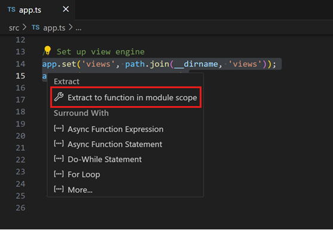
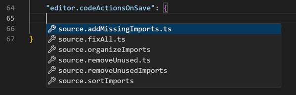
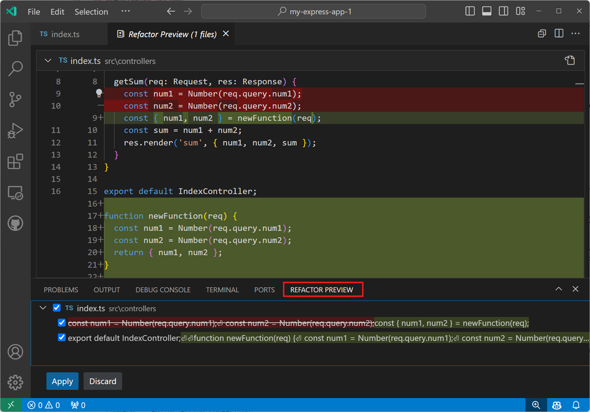
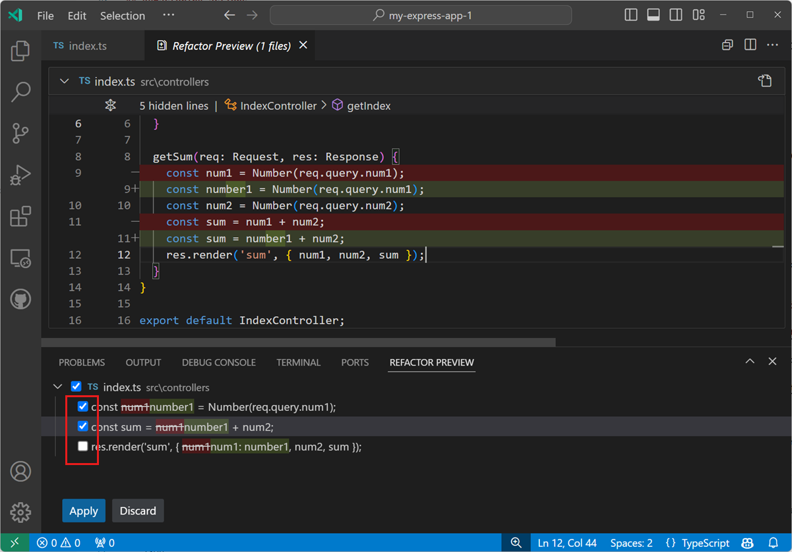

# 리팩토링 {#refactoring}

[소스 코드 리팩토링](https://en.wikipedia.org/wiki/Code_refactoring)은 코드를 재구성하여 프로젝트의 품질과 유지 관리를 개선할 수 있으며, 런타임 동작은 수정하지 않습니다. Visual Studio Code는 편집기 내에서 코드베이스를 개선하기 위해 [메서드 추출](https://refactoring.com/catalog/extractMethod.html) 및 [변수 추출](https://refactoring.com/catalog/extractVariable.html)과 같은 리팩토링 작업(*refactorings*)을 지원합니다.



예를 들어, 유지 관리의 골칫거리인 코드 중복을 피하기 위해 사용되는 일반적인 리팩토링은 [메서드 추출](https://refactoring.com/catalog/extractMethod.html) 리팩토링입니다. 이 리팩토링에서는 소스 코드를 선택하고 이를 자체 공유 메서드로 추출하여 다른 곳에서 코드를 재사용할 수 있습니다.

리팩토링은 언어 서비스에 의해 제공됩니다. VS Code는 [TypeScript](https://www.typescriptlang.org/) 언어 서비스를 통해 TypeScript 및 JavaScript 리팩토링에 대한 기본 지원을 제공합니다. 다른 프로그래밍 언어에 대한 리팩토링 지원은 언어 서비스를 제공하는 VS Code [확장 프로그램](/docs/editor/extension-marketplace.md)을 통해 활성화됩니다.

리팩토링을 위한 UI 요소와 VS Code 명령은 다양한 언어에서 동일합니다. 이 문서에서는 TypeScript 언어 서비스와 함께 VS Code의 리팩토링 지원을 보여줍니다.

## 코드 작업 = 빠른 수정 및 리팩토링 {#code-actions-quick-fixes-and-refactorings}

VS Code에서 코드 작업은 감지된 문제(빨간 물결선으로 강조 표시됨)에 대해 리팩토링과 빠른 수정을 모두 제공할 수 있습니다. 커서가 물결선 위에 있거나 선택된 텍스트 영역에 있을 때, VS Code는 편집기에서 코드 작업이 가능하다는 것을 나타내기 위해 전구 아이콘을 표시합니다. 코드 작업 전구를 선택하거나 **Quick Fix** 명령 `kb(editor.action.quickFix)`를 사용하면 빠른 수정 및 리팩토링 제어가 표시됩니다.

빠른 수정 없이 리팩토링만 보고 싶다면 **Refactor** 명령(`kb(editor.action.refactor)`)을 사용할 수 있습니다.

:::tip
`editor.lightbulb.enable` [설정](/docs/editor/settings.md)을 사용하여 편집기에서 코드 작업 전구를 완전히 비활성화할 수 있습니다. 여전히 **Quick Fix** 명령 및 `kb(editor.action.quickFix)` 키보드 단축키를 통해 빠른 수정을 열 수 있습니다.
:::

### 저장 시 코드 작업 {#code-actions-on-save}

`setting(editor.codeActionsOnSave)` 설정을 통해 파일을 저장할 때 자동으로 적용되는 코드 작업 집합을 구성할 수 있습니다. 예를 들어, 가져오기를 정리하는 작업입니다. 작업 공간 파일 및 활성 확장 프로그램에 따라 IntelliSense는 사용 가능한 코드 작업 목록을 제공합니다.



하나 이상의 코드 작업을 `setting(editor.codeActionsOnSave)`에 대해 구성할 수 있습니다. 그런 다음 코드 작업은 나열된 순서대로 실행됩니다.

다음 예제는 저장 시 여러 코드 작업을 구성하는 방법을 보여줍니다:

```json
// 명시적 저장 시, sortImports 소스 작업을 실행합니다. 자동 저장(창 또는 포커스 변경) 시, organizeImports 소스 작업을 실행합니다.
"editor.codeActionsOnSave": {
    "source.organizeImports": "always",
    "source.sortImports": "explicit",
},
```

각 코드 작업에 대해 지원되는 값은 다음과 같습니다:

* `explicit` (기본값): 명시적으로 저장할 때 코드 작업을 트리거합니다.
* `always`: 명시적으로 저장할 때와 창 또는 포커스 변경으로 인한 자동 저장 시 코드 작업을 트리거합니다.
* `never`: 저장 시 코드 작업을 트리거하지 않습니다.

:::note
현재 `true` 및 `false`는 여전히 유효한 구성 값이지만, `explicit`, `always`, `never`로 대체될 예정입니다.
:::

## 리팩토링 작업 {#refactoring-actions}

### 메서드 추출 {#extract-method}

추출할 소스 코드를 선택한 다음, 여백의 전구를 선택하거나 (`kb(editor.action.quickFix)`)를 눌러 사용 가능한 리팩토링을 확인합니다. 소스 코드 조각은 새로운 메서드로 추출하거나 다양한 범위에서 새로운 함수로 추출할 수 있습니다. 추출 리팩토링 중에는 의미 있는 이름을 제공하라는 메시지가 표시됩니다.

### 변수 추출 {#extract-variable}

TypeScript 언어 서비스는 현재 선택된 표현식에 대해 새로운 로컬 변수를 생성하는 **Extract to const** 리팩토링을 제공합니다:


클래스 작업 시, 값을 새로운 속성으로 추출할 수도 있습니다.

### 기호 이름 바꾸기 {#rename-symbol}

이름 바꾸기는 소스 코드 리팩토링과 관련된 일반적인 작업이며, VS Code에는 별도의 **Rename Symbol** 명령(`kb(editor.action.rename)`)이 있습니다. 일부 언어는 파일 간에 기호 이름 바꾸기를 지원합니다. `kb(editor.action.rename)`를 누르고, 새로 원하는 이름을 입력한 다음 `kbstyle(Enter)`를 누릅니다. 모든 파일에서 기호의 모든 인스턴스가 이름이 바뀝니다.


## 리팩토링 미리보기 {#refactor-preview}

리팩토링을 적용하면 변경 사항이 코드에 직접 구현됩니다. **Refactor Preview** 패널에서 리팩토링 작업에 의해 적용될 변경 사항을 미리 볼 수 있습니다.

**Refactor Preview** 패널을 열려면 코드 작업 제어를 열고, 리팩토링 위에 마우스를 올린 다음 `kb(previewSelectedCodeAction)`를 누릅니다.


**Refactor Preview** 패널에서 변경 사항 중 하나를 선택하여 리팩토링 작업의 결과로 발생한 변경 사항의 차이 보기(diff view)를 확인할 수 있습니다.



**Accept** 또는 **Discard** 제어를 사용하여 제안된 리팩토링 변경 사항을 적용하거나 취소할 수 있습니다.

선택적으로, 리팩토링 미리보기 패널에서 제안된 변경 사항 중 일부를 선택 해제하여 리팩토링 변경 사항을 부분적으로 적용할 수 있습니다.



## 코드 작업에 대한 키보드 단축키 {#keyboard-shortcuts-for-code-actions}

`editor.action.codeAction` 명령을 사용하면 특정 코드 작업에 대한 키보드 단축키를 구성할 수 있습니다. 이 키보드 단축키는 예를 들어 **함수 추출** 리팩토링 코드 작업을 트리거합니다:

```json
{
  "key": "ctrl+shift+r ctrl+e",
  "command": "editor.action.codeAction",
  "args": {
    "kind": "refactor.extract.function"
  }
}
```

코드 작업 종류는 확장이 향상된 `CodeActionProvider` API를 사용하여 지정합니다. 종류는 계층적이므로 `"kind": "refactor"`는 모든 리팩토링 코드 작업을 표시하고, `"kind": "refactor.extract.function"`은 **함수 추출** 리팩토링만 표시합니다.

위의 키보드 단축키를 사용하면, 만약 단일 `"refactor.extract.function"` 코드 작업만 사용 가능한 경우 자동으로 적용됩니다. 여러 개의 **함수 추출** 코드 작업이 사용 가능한 경우, VS Code는 이를 선택할 수 있는 컨텍스트 메뉴를 표시합니다:


`apply` 인수를 사용하여 코드 작업이 자동으로 적용되는 방법과 시기를 제어할 수도 있습니다:

```json
{
  "key": "ctrl+shift+r ctrl+e",
  "command": "editor.action.codeAction",
  "args": {
    "kind": "refactor.extract.function",
    "apply": "first"
  }
}
```

`apply`에 대한 유효한 값:

* `first` - 항상 첫 번째 사용 가능한 코드 작업을 자동으로 적용합니다.
* `ifSingle` - (기본값) 하나만 사용 가능한 경우 코드 작업을 자동으로 적용합니다. 그렇지 않으면 컨텍스트 메뉴를 표시합니다.
* `never` - 단일 코드 작업만 사용 가능한 경우에도 항상 코드 작업 컨텍스트 메뉴를 표시합니다.

코드 작업 키보드 단축키가 `"preferred": true`로 구성된 경우, 선호하는 빠른 수정 및 리팩토링만 표시됩니다. 선호하는 빠른 수정은 기본 오류를 해결하고, 선호하는 리팩토링은 가장 일반적인 리팩토링 선택입니다. 예를 들어, 여러 개의 `refactor.extract.constant` 리팩토링이 존재할 수 있지만, 각기 다른 범위에서 추출하는 경우, 선호하는 `refactor.extract.constant` 리팩토링은 로컬 변수로 추출하는 것입니다.

이 키보드 단축키는 `"preferred": true`를 사용하여 선택된 소스 코드를 항상 로컬 범위의 상수로 추출하려고 시도하는 리팩토링을 생성합니다:

```json
{
  "key": "shift+ctrl+e",
  "command": "editor.action.codeAction",
  "args": {
    "kind": "refactor.extract.constant",
    "preferred": true,
    "apply": "ifSingle"
  }
}
```

## 리팩토링을 지원하는 확장 프로그램 {#extensions-with-refactorings}

리팩토링을 지원하는 확장은 VS Code [마켓플레이스](https://marketplace.visualstudio.com/vscode)에서 찾을 수 있습니다. 확장 프로그램 보기(`kb(workbench.view.extensions)`)로 이동하여 검색 상자에 'refactor'를 입력하면 됩니다. 그런 다음 설치 수나 평가로 정렬하여 어떤 확장이 인기 있는지 확인할 수 있습니다.

- [Python](https://marketplace.visualstudio.com/items?itemName=ms-python.python)
- [Language Support for Java(TM) by Red Hat](https://marketplace.visualstudio.com/items?itemName=redhat.java)
- [GitHub Copilot](https://marketplace.visualstudio.com/items?itemName=GitHub.copilot)
- [GitHub Copilot Chat](https://marketplace.visualstudio.com/items?itemName=GitHub.copilot-chat)

:::tip
위에 표시된 확장 프로그램 목록은 실시간으로 업데이트됩니다. 원하는 확장 프로그램 타일을 선택하면 설명과 리뷰를 확인할 수 있으며, 가장 적합한 확장을 선택하는 데 도움이 됩니다.
:::

## 다음 단계 {#next-steps}

* [소개 비디오 - 코드 편집](/docs/introvideos/codeediting.md) - 코드 편집 기능에 대한 소개 비디오를 시청하세요.
* [코드 탐색](/docs/editor/editingevolved) - VS Code를 사용하여 소스 코드를 빠르게 탐색할 수 있습니다.
* [디버깅](/docs/editor/debugging.md) - VS Code에서 디버깅하는 방법을 알아보세요.

## 자주 묻는 질문 {#common-questions}

### 코드에 오류가 있을 때 왜 전구가 보이지 않나요? {#why-dont-i-see-any-light-bulbs-when-there-are-errors-in-my-code}

전구(코드 작업)는 커서가 오류를 표시하는 텍스트 위에 있을 때만 표시됩니다. 텍스트 위에 마우스를 올리면 오류 설명이 표시되지만, 빠른 수정 및 리팩토링을 위한 전구를 보려면 커서를 이동하거나 텍스트를 선택해야 합니다.
