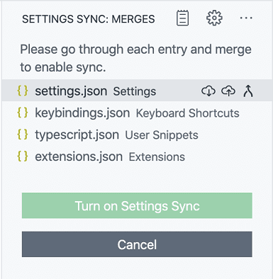
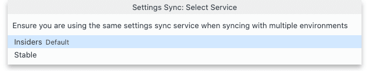
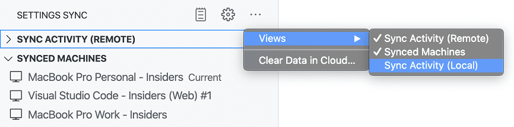

# 설정 동기화 {#settings-sync}

설정 동기화를 통해 Visual Studio Code의 설정, 키보드 단축키, 설치된 확장 프로그램과 같은 구성을 여러 기기에서 공유할 수 있어 항상 좋아하는 설정으로 작업할 수 있습니다.

:::note
VS Code는 SSH, 개발 컨테이너(devcontainer) 또는 WSL에 연결할 때와 같은 [원격](/docs/remote/remote-overview.md) 창으로 확장을 동기화하지 않습니다.
:::

## 설정 동기화 켜기 {#turning-on-settings-sync}

**Manage** 기어 메뉴 또는 활동 표시줄 하단의 **Accounts** 메뉴에서 **Backup and Sync Settings...** 항목을 사용하여 설정 동기화를 켤 수 있습니다.


동기화 설정을 사용하려면 로그인하고 동기화할 설정을 선택해야 합니다. 현재 설정 동기화는 다음 설정을 지원합니다:

* 설정
* 키보드 단축키
* 사용자 스니펫
* 사용자 작업
* UI 상태
* 확장 프로그램
* 프로필


**Sign in** 버튼을 선택하면 Microsoft 또는 GitHub 계정으로 로그인할 수 있습니다.


이 선택을 한 후 브라우저가 열리며 Microsoft 또는 GitHub 계정으로 로그인할 수 있습니다. Microsoft 계정을 선택하면 Outlook 계정과 같은 개인 계정이나 Azure 계정을 사용할 수 있으며, GitHub 계정을 새 Microsoft 계정이나 기존 Microsoft 계정에 연결할 수도 있습니다.

로그인 후 설정 동기화가 켜지고 기본적으로 선호도를 자동으로 동기화합니다.

## 병합 또는 교체 {#merge-or-replace}

기기에서 이미 동기화한 경우 다른 기기에서 동기화를 켜면 다음 **Merge or Replace** 대화 상자가 표시됩니다.


* **Merge**: 이 옵션을 선택하면 **로컬** 설정과 클라우드의 **원격** 설정이 병합됩니다.
* **Replace Local**: 이 옵션을 선택하면 **로컬** 설정이 클라우드의 원격 설정으로 덮어씌워집니다.
* **erge Manually...**: 이 옵션을 선택하면 기본 설정을 하나씩 병합할 수 있는 **병합** 보기가 열립니다.



## 동기화된 데이터 구성 {#configuring-synced-data}

기기 설정(`machine` 또는 `machine-overridable` [범위](/updates/v1_34.md#machinespecific-settings))은 기본적으로 동기화되지 않습니다. 그 값이 특정 기기에 국한되기 때문입니다. 설정 편집기에서 이 목록에 추가하거나 제거할 설정을 `setting(settingsSync.ignoredSettings)` 설정을 사용하여 조정할 수 있습니다.


키보드 단축키는 기본적으로 플랫폼별로 동기화됩니다. 키보드 단축키가 플랫폼에 구애받지 않는 경우 `setting(settingsSync.keybindingsPerPlatform)` 설정을 비활성화하여 플랫폼 간에 동기화할 수 있습니다.

모든 내장 및 설치된 확장은 전역 활성화 상태와 함께 동기화됩니다. 확장을 동기화하지 않으려면 확장 보기(`kb(workbench.view.extensions)`)에서 또는 `setting(settingsSync.ignoredExtensions)` 설정을 사용하여 건너뛸 수 있습니다.


현재 동기화되는 UI 상태는 다음과 같습니다:

* 표시 언어
* 활동 표시줄 항목
* 패널 항목
* 보기 레이아웃 및 가시성
* 최근 사용한 명령
* 다시 표시하지 않기 알림

**Settings Sync: Configure** 명령을 사용하거나 **Manage** 기어 메뉴를 열고 **Settings Sync is On**을 선택한 후 **Settings Sync: Configure**을 선택하여 동기화되는 내용을 언제든지 변경할 수 있습니다.

## 충돌 {#conflicts}

여러 기기 간에 설정을 동기화할 때 가끔 충돌이 발생할 수 있습니다. 충돌은 기기 간 동기화를 처음 설정할 때나 기기가 오프라인 상태일 때 설정이 변경될 때 발생할 수 있습니다. 충돌이 발생하면 다음 옵션이 표시됩니다:

* **Accept Local**: 이 옵션을 선택하면 클라우드의 **원격** 설정이 로컬 설정으로 덮어씌워집니다.
* **Accept Remote**: 이 옵션을 선택하면 **로컬** 설정이 클라우드의 원격 설정으로 덮어씌워집니다.
* **Show Conflicts**: 이 옵션을 선택하면 소스 제어 차이 편집기와 유사한 차이 편집기가 표시되어 로컬 및 원격 설정을 미리 보고 로컬 또는 원격을 수용하거나 로컬 설정 파일에서 수동으로 변경을 해결한 후 로컬 파일을 수용할 수 있습니다.

## 계정 전환 {#switching-accounts}

언제든지 데이터를 다른 계정으로 동기화하려면 설정 동기화를 끄고 다른 계정으로 다시 켤 수 있습니다.

## 안정 버전과 인사이더 동기화 {#syncing-stable-versus-insiders}

기본적으로 VS Code 안정 버전과 [인사이더](/insiders) 빌드는 서로 다른 설정 동기화 서비스를 사용하므로 설정을 공유하지 않습니다. 설정 동기화를 켤 때 안정 동기화 서비스를 선택하여 인사이더와 동기화할 수 있습니다. 이 옵션은 VS Code 인사이더에서만 사용할 수 있습니다.



:::note
인사이더 빌드는 안정 빌드보다 최신이므로 동기화할 경우 데이터 호환성 문제가 발생할 수 있습니다. 이러한 경우 데이터 불일치를 방지하기 위해 안정 버전에서 설정 동기화가 자동으로 비활성화됩니다. 안정 버전의 최신 버전이 출시되면 안정 클라이언트를 업그레이드하고 동기화를 켜서 계속 동기화할 수 있습니다.
:::

## 데이터 복원 {#restoring-data}

VS Code는 항상 동기화 중에 기본 설정의 로컬 및 원격 백업을 저장하고 이를 접근할 수 있는 보기를 제공합니다. 문제가 발생할 경우 이러한 보기에서 데이터를 복원할 수 있습니다.


**Settings Sync: Show Synced Data** 명령을 사용하여 이러한 보기를 열 수 있습니다. 로컬 동기화 활동 보기는 기본적으로 숨겨져 있으며 **Settings Sync** 보기의 오버플로우 작업 아래 **Views** 하위 메뉴를 사용하여 활성화할 수 있습니다.



디스크의 로컬 백업 폴더는 **Settings Sync: Open Local Backups Folder** 명령을 통해 접근할 수 있습니다. 이 폴더는 기본 설정 유형에 따라 구성되어 있으며 백업이 발생한 시점의 타임스탬프가 붙은 JSON 파일 버전을 포함합니다.

:::note
로컬 백업은 30일 후에 자동으로 삭제됩니다. 원격 백업의 경우 각 개별 리소스(설정, 확장 프로그램 등)의 최신 20버전이 유지됩니다.
:::

## 동기화된 기기 {#synced-machines}

VS Code는 기본 설정을 동기화하는 기기를 추적하고 이를 접근할 수 있는 보기를 제공합니다. 각 기기는 VS Code의 유형(인사이더 또는 안정)과 플랫폼에 따라 기본 이름이 지정됩니다. 이 보기에서 기기 항목의 편집 작업을 사용하여 기기 이름을 언제든지 업데이트할 수 있습니다. 또한 이 보기에서 기기 항목의 **Turn off Settings Sync** 컨텍스트 메뉴 작업을 사용하여 다른 기기에서 동기화를 비활성화할 수 있습니다.


**Settings Sync: Show Synced Data** 명령을 사용하여 이 보기를 열 수 있습니다.

## 확장 프로그램 개발자 {#extension-authors}

확장 프로그램 개발자인 경우 사용자가 설정 동기화를 활성화할 때 확장 프로그램이 적절하게 작동하는지 확인해야 합니다. 예를 들어, 여러 기기에서 동일한 알림이나 환영 페이지가 표시되지 않도록 하는 것이 좋습니다.

### 기기 간 사용자 전역 상태 동기화 {#sync-user-global-state-between-machines}

확장 프로그램이 서로 다른 기기 간에 일부 사용자 상태를 유지해야 하는 경우 `vscode.ExtensionContext.globalState.setKeysForSync`를 사용하여 상태를 설정 동기화에 제공해야 합니다. UI에서 해제되거나 본 플래그와 같은 상태를 기기 간에 공유하면 더 나은 사용자 경험을 제공할 수 있습니다.

`setKeysforSync`를 사용하는 예시는 [확장 프로그램 기능](/api/extension-capabilities/common-capabilities.md#data-storage) 주제에서 확인할 수 있습니다.

## 문제 보고 {#reporting-issues}

설정 동기화 활동은 **Log (Settings Sync)** 출력 보기에서 모니터링할 수 있습니다. 설정 동기화에 문제가 발생하면 이 로그를 포함하여 문제를 생성하십시오. 문제가 인증과 관련된 경우 **Account** 출력 보기의 로그도 포함하십시오.

## 내 데이터를 삭제하려면 어떻게 하나요? {#how-do-i-delete-my-data}

서버에서 모든 데이터를 제거하려면 **Manage** 기어 메뉴 아래 **Settings Sync is On** 메뉴를 통해 동기화를 끄고 모든 클라우드 데이터를 지우기 위한 체크박스를 선택하면 됩니다. 동기화를 다시 활성화하면 처음 로그인하는 것처럼 됩니다.

## 다음 단계 {#next-steps}

* [사용자 및 작업 공간 설정](/docs/editor/settings.md) - 사용자 및 작업 공간 설정을 통해 VS Code를 선호하는 대로 구성하는 방법을 알아보세요.

## 자주 묻는 질문 {#common-questions}

### VS Code 설정 동기화는 설정 동기화 확장 프로그램과 동일한가요? {#is-vs-code-settings-sync-the-same-as-the-settings-sync-extension}

아니요, [설정 동기화](https://marketplace.visualstudio.com/items?itemName=Shan.code-settings-sync) 확장은 [Shan Khan](https://marketplace.visualstudio.com/publishers/Shan)이 만든 것으로, GitHub의 개인 Gist를 사용하여 서로 다른 기기 간에 VS Code 설정을 공유하며 VS Code 설정 동기화와는 관련이 없습니다.

### 설정 동기화 로그인에 사용할 수 있는 계정 유형은 무엇인가요? {#what-types-of-accounts-can-i-use-for-settings-sync-sign-in}

VS Code 설정 동기화는 Microsoft 계정(예: Outlook 또는 Azure 계정) 또는 GitHub 계정으로 로그인하는 것을 지원합니다. GitHub Enterprise 계정으로의 로그인은 지원되지 않습니다. 향후 다른 인증 제공자가 지원될 수 있으며, 제안된 인증 제공자 API는 [이슈 #88309](https://github.com/microsoft/vscode/issues/88309)에서 검토할 수 있습니다.

:::note
현재 VS Code 설정 동기화는 [Microsoft Sovereign Cloud](https://www.microsoft.com/en-us/industry/sovereignty/cloud) 계정을 지원하지 않습니다. 이를 원하신다면 어떤 종류의 Microsoft Sovereign Cloud를 사용하고 싶은지 [이 GitHub 이슈](https://github.com/microsoft/vscode/issues/196509)에서 알려주세요.
:::

### 설정 동기화에 다른 백엔드나 서비스를 사용할 수 있나요? {#can-i-use-a-different-backend-or-service-for-settings-sync}

설정 동기화는 설정을 저장하고 업데이트를 조정하기 위해 전용 서비스를 사용합니다. 향후 사용자 지정 설정 동기화 백엔드를 허용하기 위해 서비스 제공자 API가 노출될 수 있습니다.

## 키체인 문제 해결 {#troubleshooting-keychain-issues}

:::note
이 섹션은 VS Code 버전 **1.80 이상**에 적용됩니다. 1.80에서는 [keytar](https://github.com/atom/node-keytar)에서 Electron의 [safeStorage API](https://www.electronjs.org/docs/latest/api/safe-storage)로 전환했습니다.
:::

:::note
이 문서에서 키체인, 키링, 지갑, 자격 증명 저장소는 동의어입니다.
:::

설정 동기화는 OS 키체인을 사용하여 인증 정보를 암호화하여 데스크톱에 지속합니다. 키체인을 사용하는 경우 키체인이 잘못 구성되었거나 환경이 인식되지 않는 경우 실패할 수 있습니다.

문제를 진단하기 위해 다음 플래그를 사용하여 VS Code를 재시작하여 자세한 로그를 생성할 수 있습니다:

```bash
code --verbose --vmodule="*/components/os_crypt/*=1"
```

### Windows 및 macOS {#windows-macos}

현재 Windows 또는 macOS에서 알려진 구성 문제는 없지만, 문제가 있다고 의심되는 경우 위의 자세한 로그와 함께 [VS Code에 이슈를 열 수 있습니다](https://github.com/microsoft/vscode/issues/new/choose). 이는 추가 데스크톱 구성을 지원하는 데 중요합니다.

### Linux {#linux}

이전 명령의 로그 상단에서 다음과 유사한 내용을 볼 수 있습니다:

```bash
[9699:0626/093542.027629:VERBOSE1:key_storage_util_linux.cc(54)] Password storage detected desktop environment: GNOME
[9699:0626/093542.027660:VERBOSE1:key_storage_linux.cc(122)] Selected backend for OSCrypt: GNOME_LIBSECRET
```

우리는 Chromium의 oscrypt 모듈에 의존하여 키링에 암호화 키 정보를 발견하고 저장합니다. Chromium은 [여러 가지 데스크톱 환경](https://source.chromium.org/chromium/chromium/src/+/main:base/nix/xdg_util.cc;l=146-169)을 지원합니다. 아래는 일부 인기 있는 데스크톱 환경과 키링이 잘못 구성된 경우 도움이 될 수 있는 문제 해결 단계입니다.

#### GNOME 또는 UNITY (비슷한 프로그램 포함) {#gnome-or-unity-or-similar}

"잠긴 컬렉션에 항목을 생성할 수 없습니다"라는 오류가 표시되는 경우, 키링의 `Login` 키링이 잠겨 있을 가능성이 높습니다. OS의 키링을 실행하고([Seahorse](https://wiki.gnome.org/Apps/Seahorse)는 키링을 확인하는 데 일반적으로 사용되는 GUI입니다) 기본 키링(일반적으로 `Login` 키링이라고 함)이 잠금 해제되어 있는지 확인해야 합니다. 이 키링은 시스템에 로그인할 때 잠금 해제되어야 합니다.

#### KDE {#kde}

> KDE 6은 Visual Studio Code에서 아직 완전히 지원되지 않습니다. 우회 방법: 최신 kwallet6는 kwallet5로도 접근할 수 있으므로 아래 [VS Code와 함께 사용할 키링 구성](#other-linux-desktop-environments)에서 설명한 대로 비밀번호 저장소를 `kwallet5`로 설정하여 사용할 수 있습니다.

지갑(즉, 키링)이 닫혀 있을 수 있습니다. [KWalletManager](https://apps.kde.org/kwalletmanager5)를 열면 기본 `kdewallet`가 닫혀 있는지 확인할 수 있으며, 닫혀 있다면 열어야 합니다.

KDE5 이상을 사용하고 `kwallet5`에 연결하는 데 문제가 있는 경우(비공식 VS Code Flatpak 사용자와 같은 [이슈 #189672](https://github.com/microsoft/vscode/issues/189672)), 키링을 `gnome-libsecret`로 [구성](#other-linux-desktop-environments)하여 이 방법으로 [Secret Service API](https://www.gnu.org/software/emacs/manual/html_node/auth/Secret-Service-API.html)와 통신할 수 있습니다. `kwallet5`는 Secret Service API를 구현하며 이 방법으로 접근할 수 있습니다.

`kwallet5`에 연결하는 데 여전히 문제가 발생하는 경우, 특정 D-Bus 서비스 권한을 부여하는 것이 유효한 수정 사항으로 보고되었습니다:

```sh
flatpak override --user --talk-name=org.kde.kwalletd5 --talk-name=org.freedesktop.secrets com.visualstudio.code
```

#### 기타 Linux 데스크톱 환경 {#other-linux-desktop-environments}

우선, 데스크톱 환경이 감지되지 않은 경우 위의 자세한 로그와 함께 [VS Code에 이슈를 열 수 있습니다](https://github.com/microsoft/vscode/issues/new/choose). 이는 추가 데스크톱 구성을 지원하는 데 중요합니다.

#### (권장) VS Code와 함께 사용할 키링 구성 {#recommended-configure-the-keyring-to-use-with-vs-code}

`password-store` 플래그를 전달하여 VS Code에 사용할 키링을 수동으로 지정할 수 있습니다. 권장 구성은 먼저 [gnome-keyring](https://wiki.gnome.org/Projects/GnomeKeyring)을 설치한 후 `code --password-store="gnome-libsecret"`로 VS Code를 실행하는 것입니다.

이 솔루션이 작동하면 명령 팔레트를 열고(`kb(workbench.action.showCommands)`) **Preferences: Configure Runtime Arguments** 명령을 실행하여 `password-store` 값을 지속할 수 있습니다. 이렇게 하면 설정 `"password-store":"gnome-libsecret"`을 추가할 수 있는 `argv.json` 파일이 열립니다.

다음은 `gnome-keyring` 외에 다른 키링을 사용해보고 싶을 경우 가능한 모든 `password-store` 값입니다:

* `kwallet5`: [kwalletmanager5](https://apps.kde.org/kwalletmanager5/)와 함께 사용합니다.
* `gnome-libsecret`: [Secret Service API](https://www.gnu.org/software/emacs/manual/html_node/auth/Secret-Service-API.html)를 구현하는 모든 패키지와 함께 사용합니다(예: `gnome-keyring`, `kwallet5`, `KeepassXC`).
* _(권장하지 않음)_ `kwallet`: 이전 버전의 `kwallet`와 함께 사용합니다.
* _(권장하지 않음)_ `basic`: 기본 텍스트에 대한 [아래 섹션](#not-recommended-configure-basic-text-encryption)을 참조하여 자세한 내용을 확인하십시오.

문제가 발생하면 주저하지 말고 [VS Code에 이슈를 열 수 있습니다](https://github.com/microsoft/vscode/issues/new/choose)와 함께 자세한 로그를 포함하십시오.

#### (권장하지 않음) 기본 텍스트 암호화 구성 {#not-recommended-configure-basic-text-encryption}

우리는 Chromium의 oscrypt 모듈에 의존하여 키링에 암호화 키 정보를 발견하고 저장합니다. Chromium은 하드코딩된 문자열을 기반으로 메모리 내 키를 사용하는 선택적 암호화 전략을 제공합니다. 이로 인해 이 대체 전략은 최악의 경우 난독화에 불과하며, 시스템의 어떤 프로세스도 이론적으로 저장된 비밀을 복호화할 수 있다는 위험을 감수해야 합니다.

이 위험을 감수할 수 있다면 명령 팔레트를 열고(`kb(workbench.action.showCommands)`) **Preferences: Configure Runtime Arguments** 명령을 실행하여 `password-store`를 `basic`으로 설정할 수 있습니다. 이렇게 하면 설정 `"password-store":"basic"`을 추가할 수 있는 `argv.json` 파일이 열립니다.

## VS Code 안정 버전과 인사이더 간에 설정을 공유할 수 있나요? {#can-i-share-settings-between-vs-code-stable-and-insiders}

네. 자세한 내용은 [안정 버전과 인사이더 동기화](#syncing-stable-versus-insiders) 섹션을 참조하십시오.

이로 인해 데이터 호환성 문제가 발생할 수 있으며, 인사이더 빌드는 안정 빌드보다 최신이기 때문입니다. 이러한 경우 안정 버전에서 데이터 불일치를 방지하기 위해 설정 동기화가 자동으로 비활성화됩니다. 안정 버전의 최신 버전이 출시되면 클라이언트를 업그레이드하고 설정 동기화를 켜서 계속 동기화할 수 있습니다.
