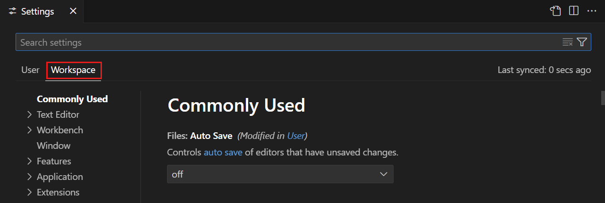
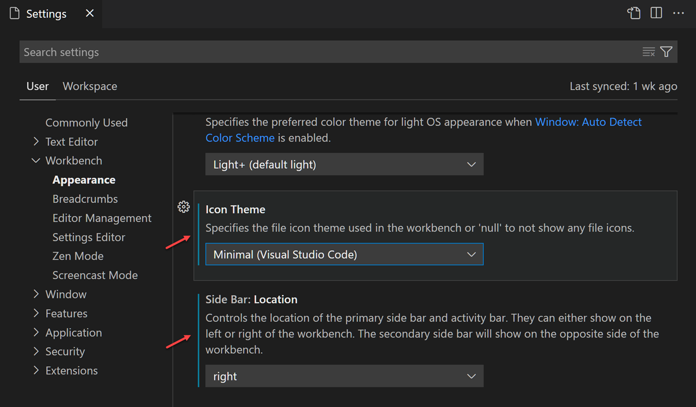
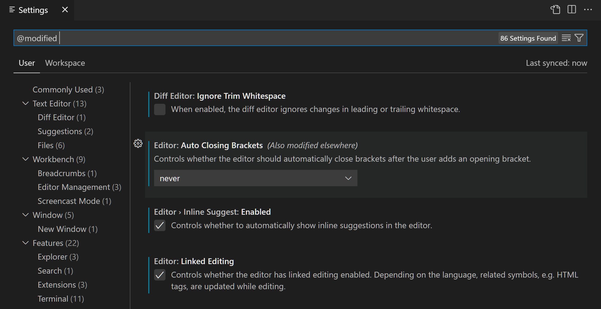
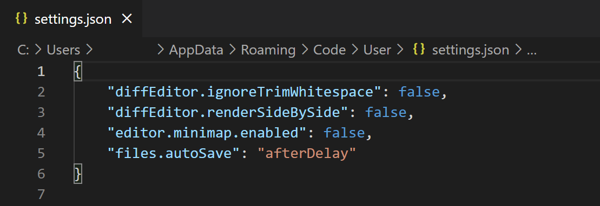

# 사용자 및 작업 공간 설정 {#user-and-workspace-settings}

Visual Studio Code는 다양한 설정을 통해 원하는 대로 구성할 수 있습니다. VS Code의 편집기, 사용자 인터페이스 및 기능 동작의 거의 모든 부분에는 수정할 수 있는 옵션이 있습니다.

VS Code는 설정에 대해 다양한 범위를 제공합니다:

* **사용자 설정** - 열어본 모든 VS Code 인스턴스에 전역적으로 적용되는 설정입니다.
* **작업 공간 설정** - 작업 공간 내에 저장되며, 작업 공간이 열릴 때만 적용되는 설정입니다.

VS Code는 설정 값을 설정 JSON 파일에 저장합니다. 설정 값을 변경하려면 설정 JSON 파일을 편집하거나 [설정 편집기](#settings-editor)를 사용하여 설정을 관리할 수 있습니다.

## 사용자 설정 {#user-settings}

사용자 설정은 VS Code를 사용자 맞춤형으로 구성하기 위한 개인 설정입니다. 이러한 설정은 열어본 모든 VS Code 인스턴스에 전역적으로 적용됩니다. 예를 들어, 사용자 설정에서 편집기 글꼴 크기를 14로 설정하면, 컴퓨터의 모든 VS Code 인스턴스에서 글꼴 크기가 14로 설정됩니다.

사용자 설정에 접근하는 방법은 여러 가지가 있습니다:

* 명령 팔레트에서 **Preferences: Open User Settings** 명령을 선택합니다 (`kb(workbench.action.showCommands)`)
* [설정 편집기](#settings-editor)에서 **User** 탭을 선택합니다 (`kb(workbench.action.openSettings)`)
* 명령 팔레트에서 **Preferences: Open User Settings (JSON)** 명령을 선택합니다 (`kb(workbench.action.showCommands)`)


## 작업 공간 설정 {#workspace-settings}

작업 공간 설정은 특정 프로젝트에만 적용되며 사용자 설정을 덮어씁니다. 특정 프로젝트에 적용할 특정 설정이 있는 경우 작업 공간 설정을 사용할 수 있습니다. 예를 들어, 백엔드 서버 프로젝트의 경우 `files.exclude` 설정을 사용하여 파일 탐색기에서 `node_modules` 폴더를 제외할 수 있습니다.

> [!NOTE]
> VS Code의 "작업 공간"은 일반적으로 프로젝트 루트 폴더입니다. [다중 루트 작업 공간](/docs/editor/workspaces/multi-root-workspaces.md)이라는 기능을 통해 VS Code 작업 공간에 여러 개의 루트 폴더를 가질 수도 있습니다. [VS Code 작업 공간](/docs/editor/workspaces/workspaces.md)에 대한 자세한 정보를 확인하세요.

VS Code는 작업 공간 설정을 프로젝트의 루트에 있는 `.vscode` 폴더에 저장합니다. 이를 통해 버전 관리된 프로젝트(예: Git)에서 다른 사람과 설정을 쉽게 공유할 수 있습니다.

작업 공간 설정에 접근하는 방법은 여러 가지가 있습니다:

* 명령 팔레트에서 **Preferences: Open Workspace Settings** 명령을 선택합니다 (`kb(workbench.action.showCommands)`)
* [설정 편집기](#settings-editor)에서 **Workspace** 탭을 선택합니다 (`kb(workbench.action.openSettings)`)
* 명령 팔레트에서 **Preferences: Open Workspace Settings (JSON)** 명령을 선택합니다 (`kb(workbench.action.showCommands)`)



모든 사용자 설정이 작업 공간 설정으로 사용 가능한 것은 아닙니다. 예를 들어, 업데이트 및 보안과 관련된 애플리케이션 전역 설정은 작업 공간 설정으로 덮어쓸 수 없습니다.

## 설정 편집기 {#settings-editor}

설정 편집기는 사용자 및 작업 공간 설정을 관리하기 위한 그래픽 인터페이스를 제공합니다. 설정 편집기를 열려면 **파일** > **환경 설정** > **설정**으로 이동합니다. 또는 **명령 팔레트**(`kb(workbench.action.showCommands)`)에서 **Preferences: Open Settings**를 선택하거나 키보드 단축키(`kb(workbench.action.openSettings)`)를 사용할 수 있습니다.

설정 편집기를 열면 원하는 설정을 검색하고 발견할 수 있습니다. 검색창을 사용하여 검색할 때, 설정 편집기는 조건에 맞는 설정만 표시하도록 필터링합니다. 이를 통해 설정을 빠르고 쉽게 찾을 수 있습니다.


VS Code는 설정을 변경할 때마다 즉시 변경 사항을 적용합니다. 수정한 설정은 설정의 왼쪽에 있는 색상 막대로 식별할 수 있으며, 이는 편집기에서 수정된 줄과 유사합니다.

아래 예제에서는 사이드 바 위치와 파일 아이콘 테마가 변경되었습니다.



설정 옆의 기어 아이콘(`kb(settings.action.showContextMenu)`)을 클릭하면 설정을 기본값으로 재설정하거나 설정 ID를 복사하고 JSON 이름-값 쌍을 복사하거나 설정 URL을 복사하는 옵션이 있는 컨텍스트 메뉴가 열립니다.


> [!TIP]
> 설정 URL을 사용하면 브라우저에서 설정 편집기로 직접 이동할 수 있습니다. URL 형식은 `vscode://settings/<settingName>`이며, 여기서 `<settingName>`은 이동하려는 설정의 ID입니다. 예를 들어, `workbench.colorTheme` 설정으로 이동하려면 URL `vscode://settings/workbench.colorTheme`를 사용합니다.

### 설정 그룹 {#settings-groups}

설정은 그룹으로 표시되어 관련 설정으로 빠르게 이동할 수 있습니다. 상단에는 인기 있는 사용자 정의 설정을 보여주는 **일반적으로 사용됨** 그룹이 있습니다.

다음 예제에서는 트리 뷰에서 **소스 제어**를 선택하여 소스 제어 설정에 집중합니다.


> [!NOTE]
> VS Code 확장 프로그램은 자체 사용자 정의 설정을 추가할 수 있으며, 이러한 설정은 **확장 프로그램** 섹션 아래에서 볼 수 있습니다.

### 설정 편집기 필터 {#settings-editor-filters}

설정 편집기 검색창에는 설정 관리를 더 쉽게 하기 위한 여러 필터가 있습니다. 검색창 오른쪽에 있는 깔때기 아이콘이 있는 필터 버튼을 클릭하면 검색창에 필터를 쉽게 추가할 수 있는 옵션이 제공됩니다.

#### 수정된 설정 {#modified-settings}

구성한 설정을 확인하려면 검색창에 `@modified` 필터가 있습니다. 설정의 값이 기본값과 다르거나 해당 설정 JSON 파일에서 명시적으로 설정된 경우 이 필터 아래에 표시됩니다.

이 필터는 설정을 구성했는지 잊어버렸거나, 설정을 실수로 구성하여 편집기가 예상대로 작동하지 않을 때 유용할 수 있습니다.



#### 기타 필터 {#other-filters}

설정을 검색하는 데 유용한 여러 가지 편리한 필터가 있습니다. 검색창에 `@` 기호를 입력하여 다양한 필터를 확인할 수 있습니다.


다음은 사용 가능한 필터 중 일부입니다:

* `@ext` - 특정 확장 프로그램에 대한 설정입니다. `@ext:ms-python.python`과 같이 확장 프로그램 ID를 제공합니다.
* `@feature` - **기능** 하위 그룹에 대한 설정입니다. 예를 들어, `@feature:explorer`는 파일 탐색기의 설정을 보여줍니다.
* `@id` - 설정 ID를 기반으로 설정을 찾습니다. 예를 들어, `@id:workbench.activityBar.visible`.
* `@lang` - 언어 ID를 기반으로 언어 필터를 적용합니다. 예를 들어, `@lang:typescript`. 자세한 내용은 [언어별 편집기 설정](#language-specific-editor-settings)을 참조하십시오.
* `@tag` - VS Code 시스템에 특정한 설정입니다. 예를 들어, [작업 공간 신뢰](/docs/editor/workspaces/workspace-trust.md)와 관련된 설정은 `@tag:workspaceTrust`, 접근성과 관련된 설정은 `@tag:accessibility`입니다.

검색창은 설정 검색 쿼리를 기억하며, 실행 취소/다시 실행(`kb(undo)`/`kb(redo)`)을 지원합니다. 검색어 또는 필터를 빠르게 지우려면 검색창 오른쪽에 있는 **설정 검색 입력 지우기** 버튼을 클릭합니다.


## 확장 프로그램 설정 {#extension-settings}

설치된 VS Code 확장 프로그램은 **확장 프로그램** 섹션에서 검토할 수 있는 자체 설정을 추가할 수 있습니다.


확장 프로그램 뷰(`kb(workbench.view.extensions)`)에서 확장 프로그램을 선택하고 **기능 기여** 탭을 검토하여 확장 프로그램의 설정을 확인할 수도 있습니다.


확장 프로그램 작성자는 [구성 기여 포인트 문서](/api/references/contribution-points.md#contributes.configuration)에서 사용자 정의 설정 추가에 대한 자세한 내용을 확인할 수 있습니다.

## 설정 JSON 파일 {#settings-json-file}

VS Code는 설정 값을 `settings.json` 파일에 저장합니다. 설정 편집기는 `settings.json` 파일에 저장된 설정 값을 검토하고 수정할 수 있는 사용자 인터페이스입니다.

명령 팔레트(`kb(workbench.action.showCommands)`)에서 **Preferences: Open User Settings (JSON)** 또는 **Preferences: Open Workspace Settings (JSON)** 명령을 사용하여 `settings.json` 파일을 직접 검토하고 편집할 수도 있습니다.

설정은 설정 ID와 값을 지정하여 JSON 형식으로 작성됩니다. 설정 편집기에서 설정의 기어 아이콘을 선택한 후 **JSON으로 설정 복사** 작업을 선택하여 해당 JSON 이름-값 쌍을 빠르게 복사할 수 있습니다.



`settings.json` 파일은 설정 및 값에 대한 스마트 완성과 설명 호버가 있는 완전한 IntelliSense를 제공합니다. 잘못된 설정 이름이나 JSON 형식으로 인한 오류도 강조 표시됩니다.


일부 설정은 **Workbench: Color Customizations**와 같이 `settings.json`에서만 편집할 수 있으며, 설정 편집기에서 **settings.json에서 편집** 링크가 표시됩니다.


> [!TIP]
> `settings.json`에서 직접 작업하는 것을 선호하는 경우, `setting(workbench.settings.editor)`를 `json`으로 설정할 수 있습니다. 그러면 **파일** > **환경 설정** > **설정** 및 키 바인딩 `kb(workbench.action.openSettings)`가 항상 `settings.json` 파일을 열고 설정 편집기 UI를 열지 않습니다.

### 설정 파일 위치 {#settings-file-locations}

#### 사용자 settings.json 위치 {#user-settingsjson-location}

플랫폼에 따라 사용자 설정 파일은 다음 위치에 있습니다:

* **Windows** `%APPDATA%\Code\User\settings.json`
* **macOS** `$HOME/Library/Application\ Support/Code/User/settings.json`
* **Linux** `$HOME/.config/Code/User/settings.json`

#### 작업 공간 settings.json 위치 {#workspace-settingsjson-location}

작업 공간 설정 파일은 루트 폴더의 `.vscode` 폴더 아래에 있습니다. 프로젝트 또는 소스 제어에 작업 공간 설정 `settings.json` 파일을 추가하면 해당 프로젝트의 설정이 모든 사용자와 공유됩니다.


> [!NOTE]
> [다중 루트 작업 공간](/docs/editor/workspaces/multi-root-workspaces.md#settings)의 경우, 작업 공간 설정은 작업 공간 구성 파일 내에 위치합니다.

## 설정 재설정 {#reset-settings}

설정을 기본값으로 재설정하려면 설정 위에 마우스를 올려 기어 아이콘을 표시하고, 기어 아이콘을 클릭한 다음 **설정 재설정** 작업을 선택하면 됩니다.

설정 편집기를 통해 개별적으로 설정을 재설정할 수 있지만, `settings.json`을 열고 중괄호 `{}` 사이의 항목을 삭제하여 모든 변경된 설정을 재설정할 수 있습니다. 이전 설정 값을 복구할 방법이 없으므로 주의하십시오.

## 언어별 편집기 설정 {#language-specific-editor-settings}

언어별 설정을 사용자 정의하는 한 가지 방법은 설정 편집기를 열고 필터 버튼을 눌러 언어 옵션을 선택하여 언어 필터를 추가하는 것입니다. 또는 검색 위젯에 `@lang:languageId` 형식의 언어 필터를 직접 입력할 수 있습니다. 표시되는 설정은 해당 특정 언어에 대해 구성할 수 있으며, 해당 언어에 특정한 설정 값이 표시됩니다.

언어 필터가 적용된 상태에서 설정을 수정하면 해당 언어에 대한 주어진 범위에서 설정이 구성됩니다. 예를 들어, 검색 위젯에 `@lang:css` 필터가 있을 때 사용자 범위의 `setting(diffEditor.codeLens)` 설정을 수정하면 설정 편집기는 새 값을 사용자 설정 파일의 CSS 특정 섹션에 저장합니다.


> [!NOTE]
> 검색 위젯에 언어 필터를 여러 개 입력하면 현재 동작은 첫 번째 언어 필터만 사용됩니다.

언어별로 편집기를 사용자 정의하는 또 다른 방법은 **Preferences: Configure Language Specific Settings**(명령 ID: `workbench.action.configureLanguageBasedSettings`)라는 전역 명령을 **명령 팔레트**(`kb(workbench.action.showCommands)`)에서 실행하여 언어 선택기를 여는 것입니다. 원하는 언어를 선택하면 설정 편집기가 선택한 언어에 대한 언어 필터와 함께 열리며, 해당 언어에 대한 언어별 설정을 수정할 수 있습니다. 그러나 `setting(workbench.settings.editor)` 설정이 `json`으로 설정되어 있으면 `settings.json` 파일이 열리고 새로운 언어 항목이 추가되어 적용 가능한 설정을 추가할 수 있습니다.


드롭다운에서 언어를 선택합니다:


이제 해당 언어에 대해 특정한 설정을 편집할 수 있습니다:


또는 `setting(workbench.settings.editor)`가 `json`으로 설정되어 있으면 이제 사용자 설정에 언어별 설정을 추가할 수 있습니다:


파일이 열려 있고 이 파일 유형에 대한 편집기를 사용자 정의하려면 VS Code 창의 오른쪽 하단 상태 표시줄에서 언어 모드를 선택합니다. 그러면 **'language_name' 언어 기반 설정 구성** 옵션이 있는 언어 모드 선택기가 열립니다. 이를 선택하면 언어 항목이 있는 사용자 `settings.json`이 열리고 적용 가능한 설정을 추가할 수 있습니다.

언어별 편집기 설정은 항상 비언어별 편집기 설정을 덮어씁니다. 비언어별 설정이 더 좁은 범위를 가지더라도 마찬가지입니다. 예를 들어, 언어별 사용자 설정은 비언어별 작업 공간 설정을 덮어씁니다.

언어별 설정을 작업 공간에 범위 지정하려면 다른 설정과 마찬가지로 작업 공간 설정에 배치하면 됩니다. 사용자 및 작업 공간 범위 모두에 대해 동일한 언어에 대한 설정이 정의된 경우, 작업 공간에 정의된 설정이 우선하여 병합됩니다.

다음 예제는 `typescript` 및 `markdown` 언어 모드에 대한 편집기 설정을 사용자 정의하기 위해 설정 JSON 파일에 붙여넣을 수 있습니다.

```json
{
  "[typescript]": {
    "editor.formatOnSave": true,
    "editor.formatOnPaste": true
  },
  "[markdown]": {
    "editor.formatOnSave": true,
    "editor.wordWrap": "on",
    "editor.renderWhitespace": "all",
    "editor.acceptSuggestionOnEnter": "off"
  }
}
```

`settings.json`에서 언어별 설정을 찾는 데 도움이 되는 IntelliSense를 사용할 수 있습니다. 모든 편집기 설정과 일부 비편집기 설정이 지원됩니다. 일부 언어는 기본 언어별 설정이 이미 설정되어 있으며, **Preferences: Open Default Settings** 명령을 실행하여 `defaultSettings.json`에서 검토할 수 있습니다.

### 다중 언어별 편집기 설정 {#multiple-language-specific-editor-settings}

여러 언어에 대한 언어별 편집기 설정을 한 번에 구성할 수 있습니다. 다음 예제는 `javascript` 및 `typescript` 언어에 대한 설정을 함께 사용자 정의하는 방법을 보여줍니다.

```json
"[javascript][typescript]": {
  "editor.maxTokenizationLineLength": 2500
}
```

## 프로필 설정 {#profile-settings}

[VS Code의 프로필](/docs/editor/profiles.md)을 사용하여 사용자 정의 세트를 만들고 빠르게 전환할 수 있습니다. 예를 들어, 특정 프로그래밍 언어에 맞게 VS Code를 사용자 정의하는 좋은 방법입니다.

프로필로 전환하면 사용자 설정이 해당 프로필에만 범위가 지정됩니다. 다른 프로필로 전환하면 해당 프로필의 사용자 설정이 적용됩니다. 이를 통해 서로 다른 프로필에 대해 서로 다른 설정을 가질 수 있습니다.

프로필의 사용자 설정 JSON 파일은 다음 디렉터리에 위치합니다:

* **Windows** `%APPDATA%\Code\User\profiles\<profile ID>\settings.json`
* **macOS** `$HOME/Library/Application\ Support/Code/User/profiles/<profile ID>/settings.json`
* **Linux** `$HOME/.config/Code/User/profiles/<profile ID>/settings.json`

`<profile ID>`는 프로필의 고유 식별자입니다. 설정을 덮어쓰는 각 프로필에 대해 해당 프로필 설정 파일이 있습니다.

> [!NOTE]
> 프로필에 대한 `settings.json` 파일은 해당 프로필의 설정을 수정할 때만 생성됩니다.

기본 프로필과 연결된 `settings.json` 파일에 접근하려면 비기본 프로필을 사용할 때 **Preferences: Open Application Settings (JSON)** 명령을 명령 팔레트에서 사용할 수 있습니다 (`kb(workbench.action.showCommands)`).

## 설정 우선 순위 {#settings-precedence}

구성은 다양한 설정 범위에 따라 여러 수준에서 덮어쓸 수 있습니다. 다음 목록에서 **나중의 범위가 이전의 범위를 덮어씁니다**:

* 기본 설정 - 이 범위는 기본적으로 구성되지 않은 설정 값을 나타냅니다.
* 사용자 설정 - 모든 VS Code 인스턴스에 전역적으로 적용됩니다.
* 원격 설정 - 사용자가 연 원격 머신에 적용됩니다.
* 작업 공간 설정 - 열린 폴더 또는 작업 공간에 적용됩니다.
* 작업 공간 폴더 설정 - [다중 루트 작업 공간](/docs/editor/workspaces/multi-root-workspaces.md)의 특정 폴더에 적용됩니다.
* 언어별 기본 설정 - 확장 프로그램에서 기여할 수 있는 언어별 기본값입니다.
* 언어별 사용자 설정 - 사용자 설정과 동일하지만 특정 언어에 해당합니다.
* 언어별 원격 설정 - 원격 설정과 동일하지만 특정 언어에 해당합니다.
* 언어별 작업 공간 설정 - 작업 공간 설정과 동일하지만 특정 언어에 해당합니다.
* 언어별 작업 공간 폴더 설정 - 작업 공간 폴더 설정과 동일하지만 특정 언어에 해당합니다.
* 정책 설정 - 시스템 관리자가 설정한 값으로, 이러한 값은 항상 다른 설정 값을 덮어씁니다.

설정 값은 다양한 유형일 수 있습니다:

* 문자열 - `"files.autoSave": "afterDelay"`
* 불리언 - `"editor.minimap.enabled": true`
* 숫자 - `"files.autoSaveDelay": 1000`
* 배열 - `"editor.rulers": []`
* 객체 - `"search.exclude": { "**/node_modules": true, "**/bower_components": true }`

원시 유형 및 배열 유형의 값은 덮어쓰기가 가능하며, 우선 순위가 높은 범위에서 구성된 값이 다른 범위의 값 대신 사용됩니다. 그러나 객체 유형의 값은 병합됩니다.

예를 들어, `setting(workbench.colorCustomizations)`는 UI 요소 그룹과 원하는 색상을 지정하는 객체를 사용합니다. 사용자 설정에서 편집기 배경을 파란색과 녹색으로 설정한 경우:

```json
  "workbench.colorCustomizations": {
    "editor.background": "#000088",
    "editor.selectionBackground": "#008800"
  }
```

열려 있는 작업 공간 설정에서 편집기 전경을 빨간색으로 설정한 경우:

```json
  "workbench.colorCustomizations": {
    "editor.foreground": "#880000",
    "editor.selectionBackground": "#00FF00"
  }
```

작업 공간이 열려 있을 때 결과는 두 가지 색상 사용자 정의의 조합으로, 마치 다음과 같이 지정한 것처럼 됩니다:

```json
  "workbench.colorCustomizations": {
    "editor.background": "#000088",
    "editor.selectionBackground": "#00FF00",
    "editor.foreground": "#880000"
  }
```

충돌하는 값이 있는 경우, 예를 들어 위의 예제에서 `editor.selectionBackground`와 같은 경우, 일반적인 덮어쓰기 동작이 발생하며, 작업 공간 값이 사용자 값을 우선하고 언어별 값이 비언어별 값보다 우선합니다.

### 다중 언어별 설정에 대한 주의 사항 {#note-about-multiple-language-specific-settings}

[multiple language-specific settings](#multiple-language-specific-editor-settings)를 사용하는 경우, 언어별 설정은 병합되며 우선 순위는 전체 언어 문자열(예: `"[typescript][javascript]"`)을 기준으로 설정되고 개별 언어 ID(`typescript` 및 `javascript`)에 따라 설정되지 않음을 유의하십시오. 이는 예를 들어, `"[typescript][javascript]"` 작업 공간 설정이 `"[javascript]"` 사용자 설정을 덮어쓰지 않는다는 것을 의미합니다.

## 설정 및 보안 {#settings-and-security}

일부 설정은 VS Code가 특정 작업을 수행하기 위해 실행할 수 있는 실행 파일을 지정할 수 있습니다. 예를 들어, 통합 터미널이 사용할 셸을 선택할 수 있습니다. 보안을 강화하기 위해 이러한 설정은 사용자 설정에서만 정의할 수 있으며 작업 공간 범위에서는 정의할 수 없습니다.

작업 공간 설정에서 지원되지 않는 설정 목록은 다음과 같습니다:

* `setting(git.path)`
* `setting(terminal.external.windowsExec)`
* `setting(terminal.external.osxExec)`
* `setting(terminal.external.linuxExec)`

이러한 설정을 정의하는 작업 공간을 처음 열면 VS Code가 경고하고 이후에는 항상 해당 값을 무시합니다.

## 설정 동기화 {#settings-sync}

[설정 동기화](/docs/editor/settings-sync.md) 기능을 통해 여러 VS Code 인스턴스에서 사용자 설정을 공유할 수 있습니다. 이 기능을 사용하면 다양한 머신에서 설치된 VS Code 간에 설정, 키보드 단축키 및 설치된 확장 프로그램을 공유할 수 있습니다. 설정 편집기 오른쪽의 **백업 및 설정 동기화** 명령이나 **계정** 활동 표시줄 컨텍스트 메뉴에서 설정 동기화를 활성화할 수 있습니다.


설정 동기화를 켜고 구성하는 방법에 대한 자세한 내용은 [설정 동기화](/docs/editor/settings-sync.md) 사용자 가이드를 참조하십시오.

> [!NOTE]
> VS Code는 SSH, 개발 컨테이너(devcontainer) 또는 WSL에 연결할 때와 같은 [원격](/docs/remote/remote-overview.md) 창으로부터 확장을 동기화하지 않습니다.

## 기능 수명 주기 {#feature-lifecycle}

기능과 해당 설정은 다음 상태 중 하나에 있을 수 있습니다. 상태에 따라 워크플로우에서 기능이나 설정을 사용하는 데 주의해야 할 수 있습니다.

* **실험적** - 초기 사용자를 위한 탐색적 기능입니다. 이러한 기능은 향후 변경되거나 제거될 수 있습니다. 설정 편집기에서 이러한 설정은 `Experimental` 레이블이 붙습니다. 검색창에 `@tag:experimental`을 입력하여 실험적 설정을 검색할 수도 있습니다.

    

* **미리 보기** - 미리 보기 기능 및 설정은 최종 기능을 가지고 있지만 안정성과 다듬기를 위해 여전히 반복될 수 있습니다. 일반적으로 미리 보기 기능은 기본적으로 비활성화되어 있습니다. 설정 편집기에서 이러한 설정은 `Preview` 레이블이 붙습니다. 검색창에 `@tag:preview`를 입력하여 미리 보기 설정을 검색할 수도 있습니다.

    

* **안정적** - 기능이 안정적이며 VS Code에서 완전히 지원됩니다.

실험적 및 미리 보기 기능을 통해 새로운 기능을 시도하고 피드백을 제공할 수 있습니다. [VS Code 문제](https://github.com/microsoft/vscode/issues)에서 피드백을 공유하세요.

## 관련 자료 {#related-resources}

* [VS Code 기본 설정 참조](/docs/reference/default-settings.md)
* [기계 간 설정 동기화](/docs/editor/settings-sync.md)

## 자주 묻는 질문 {#common-questions}

### VS Code에서 "설정을 쓸 수 없습니다."라고 표시됩니다. {#vs-code-says-unable-to-write-settings}

설정을 변경하려고 할 때(예: 자동 저장을 켜거나 새 색상 테마를 선택할 때) "사용자 설정에 쓸 수 없습니다. 사용자 설정을 열어 오류/경고를 수정한 후 다시 시도하십시오."라는 메시지가 표시되면, `settings.json` 파일이 잘못 형성되었거나 오류가 있음을 의미합니다. 오류는 누락된 쉼표나 잘못된 설정 값과 같이 간단할 수 있습니다. **Preferences: Open User Settings (JSON)** 명령을 사용하여 `settings.json` 파일을 열면 오류가 빨간 물결선으로 강조 표시됩니다.

### 사용자 설정을 재설정하려면 어떻게 해야 합니까? {#how-can-i-reset-my-user-settings}

VS Code를 기본 설정으로 되돌리는 가장 쉬운 방법은 사용자 `settings.json` 파일을 지우는 것입니다. **Preferences: Open User Settings (JSON)** 명령을 사용하여 `settings.json` 파일을 열 수 있습니다. 파일이 편집기에서 열리면 중괄호 `{}` 사이의 모든 내용을 삭제하고 파일을 저장하면 VS Code가 기본값으로 돌아갑니다.

### 작업 공간 설정을 사용하는 것이 의미가 있는 경우는 언제입니까? {#when-does-it-make-sense-to-use-workspace-settings}

사용자 정의 설정이 필요한 작업 공간을 사용하고 있지만 다른 VS Code 프로젝트에 적용하고 싶지 않을 때입니다. 좋은 예로는 언어별 린트 규칙이 있습니다.

### 확장 프로그램 설정은 어디에서 찾을 수 있습니까? {#where-can-i-find-extension-settings}

일반적으로 VS Code 확장 프로그램은 사용자 또는 작업 공간 설정 파일에 설정을 저장하며, 설정 편집기 UI(**Preferences: Open Settings (UI)** 명령) 또는 `settings.json` 파일의 IntelliSense(**Preferences: Open User Settings (JSON)** 명령)를 통해 사용할 수 있습니다. 확장 프로그램 이름(예: `gitlens` 또는 `python`)으로 검색하면 확장 프로그램에서 기여한 설정으로 필터링하는 데 도움이 됩니다.