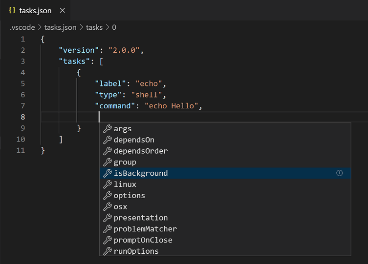
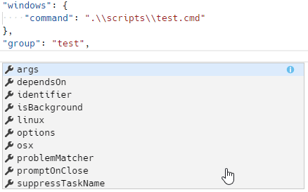
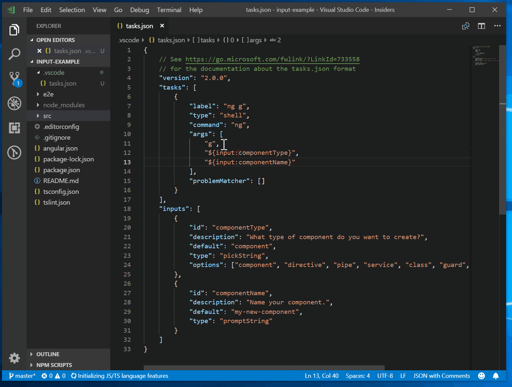

# 외부 도구와 작업을 통한 통합 {#integrate-with-external-tools-via-tasks}

린팅, 빌드, 패키징, 테스트 또는 소프트웨어 시스템 배포와 같은 작업을 자동화하기 위한 많은 도구가 존재합니다. 예를 들어, [TypeScript Compiler](https://www.typescriptlang.org/), [ESLint](https://eslint.org/) 및 [TSLint](https://palantir.github.io/tslint/)와 같은 린터, [Make](https://en.wikipedia.org/wiki/Make_software), [Ant](https://ant.apache.org/), [Gulp](https://gulpjs.com/), [Jake](https://jakejs.com/), [Rake](https://ruby.github.io/rake/) 및 [MSBuild](https://github.com/microsoft/msbuild)와 같은 빌드 시스템이 있습니다.


이 도구들은 대부분 CLI에서 실행되며 소프트웨어 개발 과정(편집, 컴파일, 테스트 및 디버그) 내부 및 외부의 작업을 자동화합니다. 개발 생명 주기에서 이들의 중요성을 고려할 때, VS Code 내에서 도구를 실행하고 그 결과를 분석할 수 있는 것이 유용합니다. VS Code의 작업은 스크립트를 실행하고 프로세스를 시작하도록 구성할 수 있어, 많은 기존 도구를 CLI에 입력하거나 새로운 코드를 작성하지 않고도 VS Code 내에서 사용할 수 있습니다. 작업 공간 또는 폴더 특정 작업은 작업 공간의 `.vscode` 폴더에 있는 `tasks.json` 파일에서 구성됩니다.

확장 프로그램은 [Task Provider](/api/extension-guides/task-provider.md)를 사용하여 작업을 추가할 수도 있으며, 이러한 추가된 작업은 `tasks.json` 파일에 정의된 작업 공간 특정 구성을 추가할 수 있습니다.

:::note
작업 지원은 작업 공간 폴더에서 작업할 때만 사용할 수 있습니다. 단일 파일을 편집할 때는 사용할 수 없습니다.
:::

## TypeScript Hello World {#typescript-hello-world}

JavaScript로 컴파일하고자 하는 간단한 "Hello World" TypeScript 프로그램부터 시작해 보겠습니다.

빈 폴더 "mytask"를 만들고, `tsconfig.json` 파일을 생성한 후 해당 폴더에서 VS Code를 시작합니다.

```bash
mkdir mytask
cd mytask
tsc --init
code .
```

이제 다음 내용을 가진 `HelloWorld.ts` 파일을 생성합니다.

```ts
function sayHello(name: string): void {
  console.log(`Hello $\{name\}
!`);
}

sayHello("Dave");
```

`kb(workbench.action.tasks.build)`를 누르거나 전역 **Terminal** 메뉴에서 **Run Build Task**를 실행하면 다음과 같은 선택기가 나타납니다:


첫 번째 항목은 TypeScript 컴파일러를 실행하고 TypeScript 파일을 JavaScript 파일로 변환합니다. 컴파일러가 완료되면 `HelloWorld.js` 파일이 생성되어야 합니다. 두 번째 항목은 TypeScript 컴파일러를 감시 모드로 시작합니다. `HelloWorld.ts` 파일을 저장할 때마다 `HelloWorld.js` 파일이 재생성됩니다.

TypeScript 빌드 또는 감시 작업을 기본 빌드 작업으로 정의하여 **Run Build Task**(`kb(workbench.action.tasks.build)`)를 트리거할 때 직접 실행되도록 할 수 있습니다. 이를 위해 전역 **Terminal** 메뉴에서 **Configure Default Build Task**를 선택합니다. 그러면 사용 가능한 빌드 작업 목록이 표시됩니다. **tsc: build** 또는 **tsc: watch**를 선택하면 VS Code가 `tasks.json` 파일을 생성합니다. 아래에 표시된 내용은 **tsc: build** 작업을 기본 빌드 작업으로 설정합니다:

```json
{
  // https://go.microsoft.com/fwlink/?LinkId=733558를 참조하세요.
  // tasks.json 형식에 대한 문서입니다.
  "version": "2.0.0",
  "tasks": [
    {
      "type": "typescript",
      "tsconfig": "tsconfig.json",
      "problemMatcher": ["$tsc"],
      "group": {
        "kind": "build",
        "isDefault": true
      }
    }
  ]
}
```

위의 `tasks.json` 예제는 새로운 작업을 정의하지 않습니다. VS Code의 TypeScript 확장에서 제공하는 **tsc: build** 작업을 기본 빌드 작업으로 주석 처리합니다. 이제 `kb(workbench.action.tasks.build)`를 눌러 TypeScript 컴파일러를 실행할 수 있습니다.

## 작업 자동 감지 {#task-auto-detection}

VS Code는 현재 Gulp, Grunt, Jake 및 npm에 대한 작업을 자동으로 감지합니다. Maven 및 C# `dotnet` 명령에 대한 지원을 추가하기 위해 해당 확장 프로그램 개발자와 협력하고 있습니다. Node.js를 런타임으로 사용하는 JavaScript 애플리케이션을 개발하는 경우, 일반적으로 의존성과 실행할 스크립트를 설명하는 `package.json` 파일이 있습니다. [eslint-starter](https://github.com/spicydonuts/eslint-starter) 예제를 클론한 경우, 전역 메뉴에서 **Run Tasks**를 실행하면 다음 목록이 표시됩니다:


아직 설치하지 않았다면 `npm install`을 실행하여 필요한 npm 모듈을 설치합니다. 이제 `server.js` 파일을 열고 문장의 끝에 세미콜론을 추가합니다(ESLint 스타터는 세미콜론이 없는 문장을 가정합니다). 다시 **Run Tasks**를 실행합니다. 이번에는 **npm: lint** 작업을 선택합니다. 사용할 문제 매처를 선택하라는 메시지가 표시되면 **ESLint stylish**를 선택합니다.


작업을 실행하면 **Problems** 뷰에 하나의 오류가 표시됩니다:


또한 VS Code는 다음 내용을 가진 `tasks.json` 파일을 생성했습니다:

```json
{
  // https://go.microsoft.com/fwlink/?LinkId=733558를 참조하세요.
  // tasks.json 형식에 대한 문서입니다.
  "version": "2.0.0",
  "tasks": [
    {
      "type": "npm",
      "script": "lint",
      "problemMatcher": ["$eslint-stylish"]
    }
  ]
}
```

이것은 VS Code에 **npm lint** 스크립트의 출력을 스캔하여 문제를 찾도록 지시합니다. ESLint의 경우, Gulp, Grunt 및 Jake에 대해서도 작업 자동 감지는 동일하게 작동합니다. 아래는 [vscode-node-debug](https://github.com/microsoft/vscode-node-debug) 확장에서 감지된 작업의 예입니다.


:::tip
**Quick Open**(`kb(workbench.action.quickOpen)`)을 통해 작업을 실행할 수 있으며, 'task', `kbstyle(Space)` 및 명령 이름을 입력하면 됩니다. 이 경우 'task lint'입니다.
:::

작업 자동 감지는 다음 설정을 사용하여 비활성화할 수 있습니다:

```json
{
  "typescript.tsc.autoDetect": "off",
  "grunt.autoDetect": "off",
  "jake.autoDetect": "off",
  "gulp.autoDetect": "off",
  "npm.autoDetect": "off"
}
```

## 사용자 정의 작업 {#custom-tasks}

작업 공간에서 모든 작업이나 스크립트를 자동으로 감지할 수 있는 것은 아닙니다. 때때로 사용자 정의 작업을 정의해야 할 필요가 있습니다. 테스트를 실행하여 환경을 올바르게 설정하는 스크립트가 있다고 가정해 보겠습니다. 이 스크립트는 작업 공간 내의 스크립트 폴더에 저장되어 있으며 Linux 및 macOS의 경우 `test.sh`, Windows의 경우 `test.cmd`라는 이름을 가집니다. 전역 **Terminal** 메뉴에서 **Configure Tasks**를 실행하고 **Create tasks.json file from template** 항목을 선택합니다. 그러면 다음과 같은 선택기가 열립니다:


:::note
작업 실행기 템플릿 목록이 보이지 않는 경우, 이미 폴더에 `tasks.json` 파일이 있을 수 있으며 그 내용이 편집기에 열려 있을 수 있습니다. 파일을 닫고 이 예제를 위해 삭제하거나 이름을 바꾸세요.
:::

자동 감지 지원을 더 많이 추가하고 있으므로, 이 목록은 앞으로 점점 작아질 것입니다. 사용자 정의 작업을 작성하려고 하므로 목록에서 **Others**를 선택합니다. 그러면 작업 스켈레톤이 있는 `tasks.json` 파일이 열립니다. 내용을 다음으로 교체합니다:

```json
{
  // https://go.microsoft.com/fwlink/?LinkId=733558를 참조하세요.
  // tasks.json 형식에 대한 문서입니다.
  "version": "2.0.0",
  "tasks": [
    {
      "label": "Run tests",
      "type": "shell",
      "command": "./scripts/test.sh",
      "windows": {
        "command": ".\\scripts\\test.cmd"
      },
      "group": "test",
      "presentation": {
        "reveal": "always",
        "panel": "new"
      }
    }
  ]
}
```

작업의 속성은 다음과 같은 의미를 가집니다:

- **label**: 사용자 인터페이스에서 사용되는 작업의 이름입니다.
- **type**: 작업의 유형입니다. 사용자 정의 작업의 경우 `shell` 또는 `process`일 수 있습니다. `shell`이 지정되면 명령이 셸 명령으로 해석됩니다(예: bash, cmd, 또는 PowerShell). `process`가 지정되면 명령이 실행할 프로세스로 해석됩니다.
- **command**: 실제로 실행할 명령입니다.
- **windows**: Windows 전용 속성입니다. Windows 운영 체제에서 명령이 실행될 때 기본 속성 대신 사용됩니다.
- **group**: 작업이 속하는 그룹을 정의합니다. 예제에서는 `test` 그룹에 속합니다. 테스트 그룹에 속하는 작업은 **Command Palette**에서 **Run Test Task**를 실행하여 실행할 수 있습니다.
- **presentation**: 사용자 인터페이스에서 작업 출력을 처리하는 방법을 정의합니다. 이 예제에서는 출력이 항상 표시되고 매 작업 실행 시 새로운 터미널이 생성됩니다.
- **options**: `cwd`(현재 작업 디렉터리), `env`(환경 변수) 또는 `shell`(기본 셸)의 기본값을 재정의합니다. 옵션은 작업별로 설정할 수 있지만 전역적으로 또는 플랫폼별로도 설정할 수 있습니다. 여기에서 구성된 환경 변수는 작업 스크립트나 프로세스 내에서만 참조할 수 있으며, args, command 또는 다른 작업 속성의 일부인 경우에는 해결되지 않습니다.
- **runOptions**: 작업이 실행되는 시기와 방법을 정의합니다.
- **hide**: 작업을 Run Task Quick Pick에서 숨깁니다. 이는 독립적으로 실행할 수 없는 복합 작업의 요소에 유용할 수 있습니다.

`tasks.json` 파일에서 IntelliSense를 사용하여 전체 작업 속성과 값을 확인할 수 있습니다. **Trigger Suggest**(`kb(editor.action.triggerSuggest)`)를 사용하여 제안을 표시하고, 마우스를 올려 설명을 읽거나 **Read More...** ('i') 버튼을 클릭해 추가 정보를 볼 수 있습니다.



또한 [tasks.json 스키마](/docs/reference/tasks-appendix.md)를 검토할 수 있습니다.

셸 명령은 공백이나 `$`와 같은 다른 특수 문자가 포함된 명령 및 인수에 대해 특별한 처리가 필요합니다. 기본적으로 작업 시스템은 다음과 같은 동작을 지원합니다:

- 단일 명령이 제공되면, 작업 시스템은 명령을 있는 그대로 기본 셸에 전달합니다. 명령이 제대로 작동하려면 인용 또는 이스케이프가 필요할 경우, 명령은 적절한 인용 또는 이스케이프 문자를 포함해야 합니다. 예를 들어, 이름에 공백이 포함된 폴더의 디렉터리를 나열하려면 bash에서 실행되는 명령은 다음과 같아야 합니다: `ls 'folder with spaces'`.

```json
{
  "label": "dir",
  "type": "shell",
  "command": "dir 'folder with spaces'"
}
```

- 명령과 인수가 제공되면, 작업 시스템은 명령이나 인수에 공백이 포함된 경우 단일 인용을 사용합니다. `cmd.exe`의 경우는 이중 인용이 사용됩니다. 아래와 같은 셸 명령은 PowerShell에서 `dir 'folder with spaces'`로 실행됩니다.

```json
{
  "label": "dir",
  "type": "shell",
  "command": "dir",
  "args": ["folder with spaces"]
}
```

- 인용 방식을 제어하려면, 인수는 값을 지정하는 리터럴과 인용 스타일이 될 수 있습니다. 아래 예제는 공백이 있는 인수에 대해 인용 대신 이스케이프를 사용합니다.

```json
{
  "label": "dir",
  "type": "shell",
  "command": "dir",
  "args": [
    {
      "value": "folder with spaces",
      "quoting": "escape"
    }
  ]
}
```

이스케이프 외에도 다음 값이 지원됩니다:

- **strong**: 셸의 강한 인용 메커니즘을 사용하여 문자열 내부의 모든 평가를 억제합니다. PowerShell 및 Linux와 macOS의 셸에서는 단일 인용(`'`)이 사용됩니다. `cmd.exe`에서는 `"`가 사용됩니다.
- **weak**: 셸의 약한 인용 메커니즘을 사용하여 문자열 내부의 표현식을 여전히 평가합니다(예: 환경 변수). PowerShell 및 Linux와 macOS의 셸에서는 이중 인용(`"`)이 사용됩니다. `cmd.exe`는 약한 인용을 지원하지 않으므로 VS Code는 `"`를 사용합니다.

명령 자체에 공백이 포함된 경우, VS Code는 기본적으로 명령도 강하게 인용합니다. 인수와 마찬가지로 사용자는 동일한 리터럴 스타일을 사용하여 명령의 인용을 제어할 수 있습니다.

워크플로우를 구성하기 위한 더 많은 작업 속성이 있습니다. `kb(editor.action.triggerSuggest)`를 사용하여 유효한 속성에 대한 개요를 얻을 수 있습니다.



전역 메뉴 바 외에도 작업 명령은 **Command Palette**(`kb(workbench.action.showCommands)`)를 사용하여 접근할 수 있습니다. 'task'로 필터링하면 다양한 작업 관련 명령을 볼 수 있습니다.


### 복합 작업 {#compound-tasks}

`dependsOn` 속성을 사용하여 더 간단한 작업으로 작업을 구성할 수도 있습니다. 예를 들어, 클라이언트와 서버 폴더가 있는 작업 공간이 있고 두 폴더 모두 빌드 스크립트를 포함하는 경우, 두 개의 빌드 스크립트를 별도의 터미널에서 시작하는 작업을 생성할 수 있습니다. `dependsOn` 속성에 여러 작업을 나열하면 기본적으로 병렬로 실행됩니다.

`tasks.json` 파일은 다음과 같습니다:

```json
{
    "version": "2.0.0",
    "tasks": [
        {
            "label": "Client Build",
            "command": "gulp",
            "args": ["build"],
            "options": {
                "cwd": "$\{workspaceFolder\}
/client"
            }
        },
        {
            "label": "Server Build",
            "command": "gulp",
            "args": ["build"],
            "options": {
                "cwd": "$\{workspaceFolder\}
/server"
            }
        },
        {
            "label": "Build",
            "dependsOn": ["Client Build", "Server Build"]
        }
    ]
}
```

`"dependsOrder": "sequence"`를 지정하면 작업 종속성이 `dependsOn`에 나열된 순서대로 실행됩니다. `"dependsOrder": "sequence"`와 함께 사용되는 백그라운드/감시 작업은 "완료"되었을 때를 추적하는 문제 매처가 있어야 합니다. 다음 작업은 작업 Two, 작업 Three, 그리고 작업 One을 실행합니다.

```json
{
  "label": "One",
  "type": "shell",
  "command": "echo Hello ",
  "dependsOrder": "sequence",
  "dependsOn": ["Two", "Three"]
}
```

### 사용자 수준 작업 {#user-level-tasks}

**Tasks: Open User Tasks** 명령을 사용하여 특정 작업 공간이나 폴더에 묶이지 않은 사용자 수준 작업을 생성할 수 있습니다. 여기서는 `shell` 및 `process` 작업만 사용할 수 있으며, 다른 작업 유형은 작업 공간 정보가 필요합니다.

## 출력 동작 {#output-behavior}

때때로 작업을 실행할 때 통합 터미널 패널의 동작을 제어하고 싶을 수 있습니다. 예를 들어, 편집기 공간을 최대화하고 문제가 있을 때만 작업 출력을 보고 싶을 수 있습니다. 터미널의 동작은 작업의 `presentation` 속성을 사용하여 제어할 수 있습니다. 다음과 같은 속성을 제공합니다:

- **reveal**: 통합 터미널 패널이 전면으로 가져오는지 여부를 제어합니다. 유효한 값은 다음과 같습니다:
  - `always` - 패널이 항상 전면으로 가져옵니다. 기본값입니다.
  - `never` - 사용자가 **View** > **Terminal** 명령(`kb(workbench.action.terminal.toggleTerminal)`)을 사용하여 터미널 패널을 전면으로 가져와야 합니다.
  - `silent` - 출력이 오류 및 경고를 스캔하지 않을 경우에만 터미널 패널이 전면으로 가져옵니다.
- **revealProblems**: 이 작업을 실행할 때 문제 패널이 표시되는지 여부를 제어합니다. 옵션 `reveal`보다 우선합니다. 기본값은 `never`입니다.
  - `always` - 이 작업이 실행될 때 항상 문제 패널을 표시합니다.
  - `onProblem` - 문제가 발견될 경우에만 문제 패널을 표시합니다.
  - `never` - 이 작업이 실행될 때 문제 패널을 표시하지 않습니다.
- **focus**: 터미널이 입력 포커스를 받는지 여부를 제어합니다. 기본값은 `false`입니다.
- **echo**: 실행된 명령이 터미널에 에코되는지 여부를 제어합니다. 기본값은 `true`입니다.
- **showReuseMessage**: "Terminal will be reused by tasks, press any key to close it" 메시지를 표시할지 여부를 제어합니다.
- **panel**: 작업 실행 간 터미널 인스턴스가 공유되는지 여부를 제어합니다. 가능한 값은 다음과 같습니다:
  - `shared` - 터미널이 공유되며 다른 작업 실행의 출력이 동일한 터미널에 추가됩니다.
  - `dedicated` - 터미널이 특정 작업에 전용입니다. 해당 작업이 다시 실행되면 터미널이 재사용됩니다. 그러나 다른 작업의 출력은 다른 터미널에 표시됩니다.
  - `new` - 해당 작업의 모든 실행이 새로운 깨끗한 터미널을 사용합니다.
- **clear**: 이 작업이 실행되기 전에 터미널이 지워지는지 여부를 제어합니다. 기본값은 `false`입니다.
- **close**: 작업이 종료될 때 작업이 실행되는 터미널이 닫히는지 여부를 제어합니다. 기본값은 `false`입니다.
- **group**: 작업이 분할 창을 사용하여 특정 터미널 그룹에서 실행되는지 여부를 제어합니다. 동일한 그룹에 속하는 작업(문자열 값으로 지정됨)은 새로운 터미널 패널 대신 분할 터미널을 사용하여 표시됩니다.

자동 감지된 작업에 대해서도 터미널 패널 동작을 수정할 수 있습니다. 예를 들어, 위의 ESLint 예제에서 **npm: run lint**의 출력 동작을 변경하려면, 다음과 같이 `presentation` 속성을 추가합니다:

```json
{
  // https://go.microsoft.com/fwlink/?LinkId=733558를 참조하세요.
  // tasks.json 형식에 대한 문서입니다.
  "version": "2.0.0",
  "tasks": [
    {
      "type": "npm",
      "script": "lint",
      "problemMatcher": ["$eslint-stylish"],
      "presentation": {
        "reveal": "never"
      }
    }
  ]
}
```

사용자 정의 작업과 감지된 작업에 대한 구성을 같이 사용할 수도 있습니다. **npm: run lint** 작업을 구성하고 사용자 정의 **Run Test** 작업을 추가하는 `tasks.json`은 다음과 같습니다:

```json
{
  // https://go.microsoft.com/fwlink/?LinkId=733558를 참조하세요.
  // tasks.json 형식에 대한 문서입니다.
  "version": "2.0.0",
  "tasks": [
    {
      "type": "npm",
      "script": "lint",
      "problemMatcher": ["$eslint-stylish"],
      "presentation": {
        "reveal": "never"
      }
    },
    {
      "label": "Run tests",
      "type": "shell",
      "command": "./scripts/test.sh",
      "windows": {
        "command": ".\\scripts\\test.cmd"
      },
      "group": "test",
      "presentation": {
        "reveal": "always",
        "panel": "new"
      }
    }
  ]
}
```

## 실행 동작 {#run-behavior}

작업의 실행 동작은 `runOptions` 속성을 사용하여 지정할 수 있습니다:

- **reevaluateOnRerun**: 작업이 **Rerun Last Task** 명령을 통해 실행될 때 변수가 어떻게 평가되는지를 제어합니다. 기본값은 `true`로, 작업이 다시 실행될 때 변수가 재평가됩니다. `false`로 설정하면 작업의 이전 실행에서 해결된 변수 값이 사용됩니다.
- **runOn**: 작업이 실행되는 시기를 지정합니다.
  - `default` - 작업은 **Run Task** 명령을 통해 실행될 때만 실행됩니다.
  - `folderOpen` - 작업이 포함된 폴더가 열릴 때 실행됩니다. `folderOpen`이 있는 작업을 포함하는 폴더를 처음 열 때, 해당 폴더에서 작업이 자동으로 실행되도록 허용할 것인지 묻는 메시지가 표시됩니다. 나중에 **Manage Automatic Tasks** 명령을 사용하여 **Allow Automatic Tasks**와 **Disallow Automatic Tasks** 중에서 선택하여 결정을 변경할 수 있습니다.
- **instanceLimit** - 동시에 실행할 수 있는 작업 인스턴스의 수입니다. 기본값은 `1`입니다.

## 자동 감지된 작업 사용자 정의 {#customizing-auto-detected-tasks}

앞서 언급했듯이, `tasks.json` 파일에서 자동 감지된 작업을 사용자 정의할 수 있습니다. 일반적으로 프레젠테이션 속성을 수정하거나 문제 매처를 연결하여 작업의 출력을 오류 및 경고를 스캔하도록 하기 위해 수행합니다. **Run Task** 목록에서 톱니바퀴 아이콘을 눌러 `tasks.json` 파일에 해당 작업 참조를 삽입하여 작업을 직접 사용자 정의할 수 있습니다. 다음은 ESLint를 사용하여 JavaScript 파일을 린트하는 Gulp 파일의 예입니다(파일은 [https://github.com/adametry/gulp-eslint](https://github.com/adametry/gulp-eslint)에서 가져옴):

```js
const gulp = require("gulp");
const eslint = require("gulp-eslint");

gulp.task("lint", () => {
  // ESLint는 "node_modules" 경로가 포함된 파일을 무시합니다.
  // 따라서 gulp도 해당 디렉터리를 무시하는 것이 가장 좋습니다.
  // 또한, 작업에서 스트림을 반환해야 합니다;
  // 그렇지 않으면 작업이 스트림이 완료되기 전에 종료될 수 있습니다.
  return (
    gulp
      .src(["**/*.js", "!node_modules/**"])
      // eslint()는 린트 출력을 파일 객체의 "eslint" 속성에 첨부합니다.
      // 이를 다른 모듈에서 사용할 수 있습니다.
      .pipe(eslint())
      // eslint.format()은 린트 결과를 콘솔에 출력합니다.
      // 또는 eslint.formatEach()를 사용할 수 있습니다(문서 참조).
      .pipe(eslint.format())
      // 린트 오류가 있는 경우 프로세스가 오류 코드(1)로 종료되도록
      // 스트림을 반환하고 failAfterError로 파이프합니다.
      .pipe(eslint.failAfterError())
  );
});

gulp.task("default", ["lint"], function () {
  // 린트 작업이 성공적일 경우에만 실행됩니다...
});
```

전역 **Terminal** 메뉴에서 **Run Task**를 실행하면 다음과 같은 선택기가 표시됩니다:


톱니바퀴 아이콘을 누릅니다. 그러면 다음과 같은 `tasks.json` 파일이 생성됩니다:

```json
{
  // https://go.microsoft.com/fwlink/?LinkId=733558를 참조하세요.
  // tasks.json 형식에 대한 문서입니다.
  "version": "2.0.0",
  "tasks": [
    {
      "type": "gulp",
      "task": "default",
      "problemMatcher": []
    }
  ]
}
```

일반적으로 이제 문제 매처(이 경우 `$eslint-stylish`)를 추가하거나 프레젠테이션 설정을 수정합니다.

## 문제 매처로 작업 출력 처리 {#processing-task-output-with-problem-matchers}

VS Code는 문제 매처로 작업 출력을 처리할 수 있습니다. 문제 매처는 작업 출력 텍스트를 스캔하여 알려진 경고 또는 오류 문자열을 찾아내고, 이를 편집기와 문제 패널에 인라인으로 보고합니다. VS Code는 여러 문제 매처를 기본 제공하고 있습니다:

- **TypeScript**: `$tsc`는 출력의 파일 이름이 열린 폴더에 상대적이라고 가정합니다.
- **TypeScript Watch**: `$tsc-watch`는 감시 모드에서 실행될 때 `tsc` 컴파일러에서 보고된 문제와 일치합니다.
- **JSHint**: `$jshint`는 파일 이름이 절대 경로로 보고된다고 가정합니다.
- **JSHint Stylish**: `$jshint-stylish`는 파일 이름이 절대 경로로 보고된다고 가정합니다.
- **ESLint Compact**: `$eslint-compact`는 출력의 파일 이름이 열린 폴더에 상대적이라고 가정합니다.
- **ESLint Stylish**: `$eslint-stylish`는 출력의 파일 이름이 열린 폴더에 상대적이라고 가정합니다.
- **Go**: `$go`는 `go` 컴파일러에서 보고된 문제와 일치합니다. 파일 이름이 열린 폴더에 상대적이라고 가정합니다.
- **CSharp 및 VB 컴파일러**: `$mscompile`은 파일 이름이 절대 경로로 보고된다고 가정합니다.
- **Lessc 컴파일러**: `$lessc`는 파일 이름이 절대 경로로 보고된다고 가정합니다.
- **Node Sass 컴파일러**: `$node-sass`는 파일 이름이 절대 경로로 보고된다고 가정합니다.

자신만의 문제 매처를 만들 수도 있으며, 이는 [나중 섹션](/docs/editor/tasks.md#defining-a-problem-matcher)에서 논의할 것입니다.

## 작업에 단축키 바인딩 {#binding-keyboard-shortcuts-to-tasks}

작업을 자주 실행해야 하는 경우, 작업에 대한 단축키를 정의할 수 있습니다.

예를 들어, 위의 **Run tests** 작업에 `Ctrl+H`를 바인딩하려면, `keybindings.json` 파일에 다음을 추가합니다:

```json
{
  "key": "ctrl+h",
  "command": "workbench.action.tasks.runTask",
  "args": "Run tests"
}
```

## 변수 치환 {#variable-substitution}

작업 구성 작성 시, 활성 파일(`$\{file\}`)이나 작업 공간 루트 폴더(`$\{workspaceFolder\}`)와 같은 미리 정의된 공통 변수를 갖는 것이 유용합니다. VS Code는 `tasks.json` 파일의 문자열 내에서 변수 치환을 지원하며, 미리 정의된 변수의 전체 목록은 [Variables Reference](https://code.visualstudio.com/docs/reference/variables-reference)에서 확인할 수 있습니다.

:::note
모든 속성이 변수 치환을 허용하는 것은 아닙니다. 특히, `command`, `args`, 및 `options`만 변수 치환을 지원합니다.
:::

다음은 현재 열린 파일을 TypeScript 컴파일러에 전달하는 사용자 정의 작업 구성의 예입니다.

```json
{
    "label": "TypeScript compile",
    "type": "shell",
    "command": "tsc $\{file\}
",
    "problemMatcher": [
        "$tsc"
    ]
}
```

유사하게, 프로젝트의 구성 설정을 참조하려면 이름 앞에 **$\{config:** 를 붙이면 됩니다. 예를 들어, ``${config:python.formatting.autopep8Path}``는 Python 확장 설정 `formatting.autopep8Path`를 반환합니다.

다음은 `python.formatting.autopep8Path` 설정에 의해 정의된 autopep8 실행 파일을 사용하여 현재 파일에서 autopep8을 실행하는 사용자 정의 작업 구성의 예입니다:

```json
{
    "label": "autopep8 current file",
    "type": "process",
    "command": "${config:python.formatting.autopep8Path}
",
    "args": [
        "--in-place",
        "${file}
"
    ]
}
```

`tasks.json` 또는 `launch.json`에서 Python 확장에 의해 사용되는 선택된 Python 인터프리터를 지정하려면, `$\{command:python.interpreterPath\}` 명령을 사용할 수 있습니다.

단순한 변수 치환이 충분하지 않은 경우, `tasks.json` 파일에 `inputs` 섹션을 추가하여 작업 사용자로부터 입력을 받을 수도 있습니다.



`inputs`에 대한 더 많은 정보는 [변수 참조](/docs/reference/variables-reference.md)를 참조하십시오.

## 운영 체제 특정 속성 {#operating-system-specific-properties}

작업 시스템은 운영 체제에 특정한 값(예: 실행할 명령)을 정의하는 것을 지원합니다. 이를 위해 운영 체제 특정 리터럴을 `tasks.json` 파일에 넣고 해당 리터럴 내부에 해당 속성을 지정합니다.

아래는 Node.js 실행 파일을 명령으로 사용하고 Windows와 Linux에서 다르게 처리되는 예시입니다:

```json
{
  "label": "Run Node",
  "type": "process",
  "windows": {
    "command": "C:\\Program Files\\nodejs\\node.exe"
  },
  "linux": {
    "command": "/usr/bin/node"
  }
}
```

유효한 운영 체제 속성은 Windows의 경우 `windows`, Linux의 경우 `linux`, macOS의 경우 `osx`입니다. 운영 체제 특정 범위에서 정의된 속성은 작업 또는 전역 범위에서 정의된 속성을 덮어씁니다.

## 전역 작업 {#global-tasks}

작업 속성은 전역 범위에서도 정의할 수 있습니다. 존재하는 경우, 특정 작업에 사용되며, 다른 값으로 동일한 속성을 정의하지 않는 한 사용됩니다. 아래 예시에서는 모든 작업이 새 패널에서 실행되어야 함을 정의하는 전역 `presentation` 속성이 있습니다:

```json
{
    // https://go.microsoft.com/fwlink/?LinkId=733558를 참조하여 tasks.json 형식에 대한 문서를 확인하십시오.
    "version": "2.0.0",
    "presentation": {
        "panel": "new"
    },
    "tasks": [
        {
            "label": "TS - Compile current file",
            "type": "shell",
            "command": "tsc $\{file\}
",
            "problemMatcher": [
                "$tsc"
            ]
        }
    ]
}
```

:::tip
전역 범위의 `tasks.json` 파일에 접근하려면 명령 팔레트(`kb(workbench.action.showCommands)`)를 열고 **Tasks: Open User Tasks** 명령을 실행하십시오.
:::

### PowerShell에서의 문자 이스케이프 {#character-escaping-in-powershell}

기본 셸이 PowerShell이거나 작업이 PowerShell을 사용하도록 구성된 경우, 예상치 못한 공백 및 따옴표 이스케이프가 발생할 수 있습니다. 예상치 못한 이스케이프는 cmdlet에서만 발생하며, VS Code는 명령에 cmdlet이 포함되어 있는지 알 수 없습니다. 아래 예시 1은 PowerShell에서 작동하지 않는 이스케이프가 발생하는 경우를 보여줍니다. 예시 2는 좋은 이스케이프를 얻기 위한 최선의 크로스 플랫폼 방법을 보여줍니다. 경우에 따라 예시 2를 따를 수 없고 예시 3에 표시된 수동 이스케이프를 수행해야 할 수도 있습니다.

```json
"tasks": [
    {
        "label": "PowerShell example 1 (unexpected escaping)",
        "type": "shell",
        "command": "Get-ChildItem \"Folder With Spaces\""
    },
    {
        "label": "PowerShell example 2 (expected escaping)",
        "type": "shell",
        "command": "Get-ChildItem",
        "args": ["Folder With Spaces"]
    },
    {
        "label": "PowerShell example 3 (manual escaping)",
        "type": "shell",
        "command": "& Get-ChildItem \\\"Folder With Spaces\\\""
    }
]
```

## 작업 출력의 인코딩 변경 {#changing-the-encoding-for-a-task-output}

작업은 종종 디스크의 파일과 상호작용합니다. 이러한 파일이 시스템 인코딩과 다른 인코딩으로 디스크에 저장된 경우, 작업으로 실행되는 명령이 사용할 인코딩을 알려야 합니다. 이는 운영 체제와 사용된 셸에 따라 다르므로 이를 제어하는 일반적인 솔루션은 없습니다. 아래는 이를 작동시키는 방법에 대한 조언과 예시입니다.

인코딩을 조정해야 하는 경우, 운영 체제가 사용하는 기본 인코딩을 변경하는 것이 의미가 있는지 확인하거나 적어도 사용하는 셸의 프로필 파일을 조정하여 변경해야 합니다.

특정 작업에 대해서만 조정해야 하는 경우, 인코딩을 변경하는 데 필요한 OS 특정 명령을 작업 CLI에 추가하십시오. 다음 예시는 기본적으로 코드 페이지 437을 사용하는 Windows의 경우입니다. 이 작업은 키릴 문자가 포함된 파일의 출력을 보여주며, 따라서 코드 페이지 866이 필요합니다. 기본 셸이 `cmd.exe`로 설정되어 있다고 가정할 때 파일을 나열하는 작업은 다음과 같습니다:

```json
{
  // https://go.microsoft.com/fwlink/?LinkId=733558를 참조하여 tasks.json 형식에 대한 문서를 확인하십시오.
  "version": "2.0.0",
  "tasks": [
    {
      "label": "more",
      "type": "shell",
      "command": "chcp 866 && more russian.txt",
      "problemMatcher": []
    }
  ]
}
```

작업이 `PowerShell`에서 실행되는 경우, 명령은 `chcp 866; more russian.txt`와 같아야 합니다. Linux 및 macOS에서는 `locale` 명령을 사용하여 로케일을 검사하고 필요한 환경 변수를 조정할 수 있습니다.

## 작업 실행 예시 {#examples-of-tasks-in-action}

작업의 강력함을 강조하기 위해, VS Code가 작업을 사용하여 린터 및 컴파일러와 같은 외부 도구를 통합하는 몇 가지 예시를 소개합니다.

### TypeScript를 JavaScript로 변환 {#transpiling-typescript-to-javascript}

[TypeScript 주제](/docs/typescript/typescript-compiling.md)에는 TypeScript를 JavaScript로 변환하고 VS Code 내에서 관련 오류를 관찰하는 작업을 생성하는 예시가 포함되어 있습니다.

### Less 및 SCSS를 CSS로 변환 {#transpiling-less-and-scss-into-css}

CSS 주제는 작업을 사용하여 CSS 파일을 생성하는 방법에 대한 예시를 제공합니다.

1. [빌드 작업으로 수동 변환](/docs/languages/css.md#transpiling-sass-and-less-into-css)
2. [파일 감시자를 통한 컴파일 단계 자동화](/docs/languages/css.md#automating-sassless-compilation)

## 문제 매처 정의 {#defining-a-problem-matcher}

VS Code는 '상자 안'에 몇 가지 일반적인 문제 매처를 제공합니다. 그러나 많은 컴파일러와 린팅 도구가 있으며, 이들은 각각 고유한 스타일의 오류 및 경고를 생성하므로, 자신만의 문제 매처를 만들고 싶을 수 있습니다.

개발자가 **printf**를 **prinft**로 잘못 입력한 `helloWorld.c` 프로그램이 있습니다. [gcc](https://gcc.gnu.org/)로 컴파일하면 다음과 같은 경고가 발생합니다:

```bash
helloWorld.c:5:3: warning: implicit declaration of function ‘prinft’
```

우리는 출력에서 메시지를 캡처하고 VS Code에 해당 문제를 표시할 수 있는 문제 매처를 만들고자 합니다. 문제 매처는 [정규 표현식](https://en.wikipedia.org/wiki/Regular_expression)에 크게 의존합니다. 아래 섹션은 정규 표현식에 익숙하다고 가정합니다.

:::tip
우리는 [RegEx101 플레이그라운드](https://regex101.com/)를 발견했으며, 이는 ECMAScript (JavaScript) 맛이 있어 정규 표현식을 개발하고 테스트하는 데 훌륭한 방법입니다.
:::

위 경고(및 오류)를 캡처하는 매처는 다음과 같습니다:

```json
{
    // 문제는 cpp 언어 서비스에 의해 소유됩니다.
    "owner": "cpp",
    // 보고된 문제의 파일 이름은 열린 폴더에 상대적입니다.
    "fileLocation": ["relative", "$\{workspaceFolder\}
"],
    // 문제의 출처로 표시될 이름입니다.
    "source": "gcc",
    // 출력에서 문제를 일치시키기 위한 실제 패턴입니다.
    "pattern": {
        // 정규 표현식. 예시: helloWorld.c:5:3: warning: implicit declaration of function ‘printf’ [-Wimplicit-function-declaration]
        "regexp": "^(.*):(\\d+):(\\d+):\\s+(warning|error):\\s+(.*)$",
        // 첫 번째 매치 그룹은 상대적인 파일 이름을 일치시킵니다.
        "file": 1,
        // 두 번째 매치 그룹은 문제가 발생한 줄을 일치시킵니다.
        "line": 2,
        // 세 번째 매치 그룹은 문제가 발생한 열을 일치시킵니다.
        "column": 3,
        // 네 번째 매치 그룹은 문제의 심각도를 일치시킵니다. 무시할 수 있습니다. 그러면 모든 문제는 오류로 캡처됩니다.
        "severity": 4,
        // 다섯 번째 매치 그룹은 메시지를 일치시킵니다.
        "message": 5
    }
}
```

파일, 줄 및 메시지 속성은 필수입니다. `fileLocation`은 작업 출력에서 생성된 파일 경로가 `absolute`인지 `relative`인지 지정합니다. 작업이 절대 경로와 상대 경로를 모두 생성하는 경우, `autoDetect` 파일 위치를 사용할 수 있습니다. `autoDetect`를 사용하면 경로가 먼저 절대 경로로 테스트되고, 파일이 존재하지 않으면 경로가 상대적이라고 가정합니다.

`severity`는 패턴에 포함되지 않은 경우 사용할 문제 심각도를 지정합니다. `severity`의 가능한 값은 `error`, `warning` 또는 `info`입니다.

다음은 위 코드를 포함한 완성된 `tasks.json` 파일입니다(주석 제거됨):

```json
{
    "version": "2.0.0",
    "tasks": [
        {
            "label": "build",
            "command": "gcc",
            "args": ["-Wall", "helloWorld.c", "-o", "helloWorld"],
            "problemMatcher": {
                "owner": "cpp",
                "fileLocation": ["relative", "$\{workspaceFolder\}
"],
                "source": "gcc",
                "pattern": {
                    "regexp": "^(.*):(\\d+):(\\d+):\\s+(warning|error):\\s+(.*)$",
                    "file": 1,
                    "line": 2,
                    "column": 3,
                    "severity": 4,
                    "message": 5
                }
            }
        }
    ]
}
```

VS Code 내에서 이를 실행하고 `kb(workbench.actions.view.problems)`를 눌러 문제 목록을 가져오면 다음과 같은 출력이 나타납니다:


:::tip
[C/C++ 확장](https://marketplace.visualstudio.com/items?itemName=ms-vscode.cpptools)에는 GCC에 대한 문제 매처가 포함되어 있으므로, 우리만의 매처를 정의할 필요가 없습니다.
:::

패턴 내부에서 사용할 수 있는 몇 가지 추가 속성이 있습니다. 이들은 다음과 같습니다:

- **location** - 문제가 줄 또는 줄, 열 또는 시작 줄, 시작 열, 종료 줄, 종료 열에 있는 경우, 일반적인 위치 매치 그룹을 사용할 수 있습니다.
- **endLine** - 문제의 종료 줄에 대한 매치 그룹 인덱스입니다. 컴파일러가 종료 줄 값을 제공하지 않으면 생략할 수 있습니다.
- **endColumn** - 문제의 종료 열에 대한 매치 그룹 인덱스입니다. 컴파일러가 종료 열 값을 제공하지 않으면 생략할 수 있습니다.
- **code** - 문제의 코드에 대한 매치 그룹 인덱스입니다. 컴파일러가 코드 값을 제공하지 않으면 생략할 수 있습니다.

파일만 캡처하는 문제 매처를 정의할 수도 있습니다. 이를 위해 `kind` 속성을 `file`로 설정한 `pattern`을 정의하십시오. 이 경우 `line` 또는 `location` 속성을 제공할 필요가 없습니다.

:::note
기능적 패턴은 `kind` 속성이 `file`로 설정된 경우 `file` 및 `message`에 대한 매치 그룹을 최소한 제공해야 합니다. `kind` 속성이 제공되지 않거나 `kind` 속성이 `location`으로 설정된 경우, 기능 패턴은 `line` 또는 `location` 속성을 제공해야 합니다.
:::

:::note
문제 매처는 주어진 명령의 출력만 구문 분석합니다. 별도의 파일(예: 로그 파일)에 기록된 출력을 구문 분석하려면, 실행하는 명령이 실행을 마치기 전에 별도의 파일에서 줄을 출력하도록 해야 합니다.
:::

## 다중 행 문제 매처 정의 {#defining-a-multiline-problem-matcher}

일부 도구는 소스 파일에서 발견된 문제를 여러 줄에 걸쳐 분산시킵니다. 특히 스타일리시 리포터가 사용되는 경우에 그렇습니다. 예를 들어 [ESLint](https://eslint.org/)는 스타일리시 모드에서 다음과 같은 출력을 생성합니다:

```bash
test.js
  1:0   error  Missing "use strict" statement                 strict
✖ 1 problems (1 errors, 0 warnings)
```

우리의 문제 매처는 줄 기반이므로 파일 이름(test.js)을 캡처하기 위해 실제 문제 위치 및 메시지(1:0 error Missing "use strict" statement)와는 다른 정규 표현식을 사용해야 합니다.

이를 위해 `pattern` 속성에 문제 패턴 배열을 사용하십시오. 이렇게 하면 일치시키고자 하는 각 줄에 대해 패턴을 정의할 수 있습니다.

다음 문제 패턴은 스타일리시 모드에서 ESLint의 출력을 일치시킵니다. 그러나 여전히 해결해야 할 작은 문제가 하나 있습니다. 아래 코드는 파일 이름을 캡처하기 위한 첫 번째 정규 표현식과 줄, 열, 심각도, 메시지 및 오류 코드를 캡처하기 위한 두 번째 정규 표현식을 가지고 있습니다:

```json
{
    "owner": "javascript",
    "fileLocation": ["relative", "$\{workspaceFolder\}
"],
    "pattern": [
        {
            "regexp": "^([^\\s].*)$",
            "file": 1
        },
        {
            "regexp": "^\\s+(\\d+):(\\d+)\\s+(error|warning|info)\\s+(.*)\\s\\s+(.*)$",
            "line": 1,
            "column": 2,
            "severity": 3,
            "message": 4,
            "code": 5
        }
    ]
}
```

그러나 이 패턴은 리소스에서 문제가 두 개 이상 발생하는 경우 작동하지 않습니다. 예를 들어 ESLint의 다음 출력을 상상해 보십시오:

```bash
test.js
  1:0   error  Missing "use strict" statement                 strict
  1:9   error  foo is defined but never used                  no-unused-vars
  2:5   error  x is defined but never used                    no-unused-vars
  2:11  error  Missing semicolon                              semi
  3:1   error  "bar" is not defined                           no-undef
  4:1   error  Newline required at end of file but not found  eol-last
✖ 6 problems (6 errors, 0 warnings)
```

패턴의 첫 번째 정규 표현식은 "test.js"를 일치시키고, 두 번째는 "1:0 error ..."를 일치시킵니다. 다음 줄 "1:9 error ..."는 처리되지만 첫 번째 정규 표현식과 일치하지 않으므로 문제를 캡처하지 않습니다.

이 작업을 수행하려면 다중 행 패턴의 마지막 정규 표현식이 `loop` 속성을 지정할 수 있습니다. `loop` 속성이 true로 설정되면, 작업 시스템에 정규 표현식이 일치하는 한 다중 매처의 마지막 패턴을 출력의 줄에 적용하도록 지시합니다.

이 경우 `test.js`와 일치하는 첫 번째 패턴이 캡처한 정보는 `loop` 패턴과 일치하는 각 후속 줄과 결합되어 여러 문제를 생성합니다. 이 예에서는 여섯 개의 문제가 생성됩니다.

다음은 ESLint 스타일 문제를 완전히 캡처하는 문제 매처입니다:

```json
{
    "owner": "javascript",
    "fileLocation": ["relative", "$\{workspaceFolder\}
"],
    "pattern": [
        {
            "regexp": "^([^\\s].*)$",
            "file": 1
        },
        {
            "regexp": "^\\s+(\\d+):(\\d+)\\s+(error|warning|info)\\s+(.*)\\s\\s+(.*)$",
            "line": 1,
            "column": 2,
            "severity": 3,
            "message": 4,
            "code": 5,
            "loop": true
        }
    ]
}
```

:::note
동일한 줄과 열에서 정확히 동일한 문제 여러 개가 발생하는 경우, 하나의 문제만 표시됩니다. 이는 모든 문제 매처에 적용되며, 다중 행 문제 매처에만 국한되지 않습니다.
:::

## 기존 문제 매처 수정 {#modifying-an-existing-problem-matcher}

기존 문제 매처가 필요에 가까운 경우, `tasks.json` 작업에서 수정할 수 있습니다. 예를 들어, `$tsc-watch` 문제 매처는 닫힌 문서에만 적용됩니다. 모든 문서에 적용되도록 하려면 다음과 같이 수정할 수 있습니다:

```json
{
  "type": "npm",
  "script": "watch",
  "problemMatcher": {
    "base": "$tsc-watch",
    "applyTo": "allDocuments"
  },
  "isBackground": true
}
```

수정 가능한 다른 문제 매처 속성으로는 `background`, `fileLocation`, `owner`, `pattern`, `severity`, `source`가 있습니다.

## 백그라운드 / 감시 작업 {#background-watching-tasks}

일부 도구는 백그라운드에서 실행되면서 파일 시스템의 변경 사항을 감시하고, 디스크에서 파일이 변경될 때 작업을 트리거하는 기능을 지원합니다. `Gulp`와 같은 경우, 이러한 기능은 npm 모듈 [gulp-watch](https://www.npmjs.com/package/gulp-watch)를 통해 제공됩니다. TypeScript 컴파일러 `tsc`는 `--watch` CLI 옵션을 통해 이를 지원합니다.

VS Code에서 백그라운드 작업이 활성화되어 문제 결과를 생성하고 있다는 피드백을 제공하려면, 문제 매처가 출력에서 이러한 `state` 변경 사항을 감지하기 위해 추가 정보를 사용해야 합니다. `tsc` 컴파일러를 예로 들어 보겠습니다. 컴파일러가 감시 모드에서 시작되면, 다음과 같은 추가 정보를 콘솔에 출력합니다:

```bash
> tsc --watch
12:30:36 PM - Compilation complete. Watching for file changes.
```

문제가 포함된 파일이 디스크에서 변경되면 다음과 같은 출력이 나타납니다:

```bash
12:32:35 PM - File change detected. Starting incremental compilation...
src/messages.ts(276,9): error TS2304: Cannot find name 'candidate'.
12:32:35 PM - Compilation complete. Watching for file changes.
```

출력을 살펴보면 다음과 같은 패턴이 나타납니다:

- `File change detected. Starting incremental compilation...`이 콘솔에 출력될 때 컴파일러가 실행됩니다.
- `Compilation complete. Watching for file changes.`가 콘솔에 출력될 때 컴파일러가 중지됩니다.
- 두 문자열 사이에서 문제가 보고됩니다.
- 컴파일러는 초기 시작 후에도 한 번 실행됩니다(콘솔에 `File change detected. Starting incremental compilation...`을 출력하지 않음).

이 정보를 캡처하기 위해 문제 매처는 `background` 속성을 제공할 수 있습니다.

`tsc` 컴파일러의 경우 적절한 `background` 속성은 다음과 같습니다:

```json
"background": {
    "activeOnStart": true,
    "beginsPattern": "^\\s*\\d{1,2}:\\d{1,2}:\\d{1,2}(?: AM| PM)? - File change detected\\. Starting incremental compilation\\.\\.\\.",
    "endsPattern": "^\\s*\\d{1,2}:\\d{1,2}:\\d{1,2}(?: AM| PM)? - Compilation complete\\. Watching for file changes\\."
}
```

문제 매처의 `background` 속성 외에도 작업 자체가 백그라운드에서 실행되도록 `isBackground`로 표시되어야 합니다.

감시 모드에서 실행되는 `tsc` 작업을 위한 전체 수작업 `tasks.json`은 다음과 같습니다:

```json
{
  "version": "2.0.0",
  "tasks": [
    {
      "label": "watch",
      "command": "tsc",
      "args": ["--watch"],
      "isBackground": true,
      "problemMatcher": {
        "owner": "typescript",
        "fileLocation": "relative",
        "pattern": {
          "regexp": "^([^\\s].*)\\((\\d+|\\d+,\\d+|\\d+,\\d+,\\d+,\\d+)\\):\\s+(error|warning|info)\\s+(TS\\d+)\\s*:\\s*(.*)$",
          "file": 1,
          "location": 2,
          "severity": 3,
          "code": 4,
          "message": 5
        },
        "background": {
          "activeOnStart": true,
          "beginsPattern": "^\\s*\\d{1,2}:\\d{1,2}:\\d{1,2}(?: AM| PM)? - File change detected\\. Starting incremental compilation\\.\\.\\.",
          "endsPattern": "^\\s*\\d{1,2}:\\d{1,2}:\\d{1,2}(?: AM| PM)? - Compilation complete\\. Watching for file changes\\."
        }
      }
    }
  ]
}
```

## 다음 단계 {#next-steps}

작업에 대한 내용은 여기까지입니다 - 계속 진행해 봅시다...

- [tasks.json 구조](/docs/reference/tasks-appendix.md) - `tasks.json`의 전체 구조와 설명을 확인할 수 있습니다.
- [기본 편집](/docs/editor/codebasics.md) - 강력한 VS Code 편집기에 대해 알아보십시오.
- [코드 탐색](/docs/editor/editingevolved.md) - 소스 코드를 빠르게 이동하십시오.
- [언어 지원](/docs/languages/overview.md) - VS Code와 커뮤니티 확장에서 제공하는 지원 프로그래밍 언어에 대해 알아보십시오.
- [디버깅](/docs/editor/debugging.md) - VS Code 편집기에서 직접 소스 코드를 디버깅하십시오.

## 자주 묻는 질문 {#common-questions}

### 작업이 통합 터미널에 지정된 것과 다른 셸을 사용할 수 있나요? {#can-a-task-use-a-different-shell-than-the-one-specified-for-the-integrated-terminal}

네. `"terminal.integrated.automationProfile.*"` 설정을 사용하여 VS Code에서 모든 자동화에 사용할 셸을 설정할 수 있습니다. 여기에는 작업이 포함됩니다.

```json
    "terminal.integrated.automationProfile.windows": {
        "path": "cmd.exe"
    }
```

또는 작업의 셸을 `options.shell` 속성으로 재정의할 수 있습니다. 이는 작업별, 전역적으로 또는 플랫폼별로 설정할 수 있습니다. 예를 들어, Windows에서 cmd.exe를 사용하려면 `tasks.json`에 다음을 포함해야 합니다:

```json
{
    "version": "2.0.0",
    "windows": {
        "options": {
            "shell": {
                "executable": "cmd.exe",
                "args": [
                    "/d", "/c"
                ]
            }
        }
    },
    ...
```

### 백그라운드 작업을 launch.json의 `prelaunchTask`로 사용할 수 있나요? {#can-a-background-task-be-used-as-a-prelaunchtask-in-launchjson}

네. 백그라운드 작업은 종료될 때까지 실행되므로, 백그라운드 작업 자체에는 "완료" 신호가 없습니다. 백그라운드 작업을 `prelaunchTask`로 사용하려면, 작업 시스템과 디버그 시스템이 작업이 "완료"되었다고 알 수 있는 적절한 백그라운드 `problemMatcher`를 백그라운드 작업에 추가해야 합니다.

작업은 다음과 같을 수 있습니다:

```json
{
  "type": "npm",
  "script": "watch",
  "problemMatcher": "$tsc-watch",
  "isBackground": true
}
```

:::note
`$tsc-watch`는 백그라운드 작업에 필요한 **백그라운드** 문제 매처입니다.
:::

그런 다음 `launch.json` 파일에서 작업을 `prelaunchTask`로 사용할 수 있습니다:

```json
{
    "name": "Launch Extension",
    "type": "extensionHost",
    "request": "launch",
    "runtimeExecutable": "$\{execPath\}
",
    "args": [
        "--extensionDevelopmentPath=$\{workspaceRoot\}
"
    ],
    "stopOnEntry": false,
    "sourceMaps": true,
    "outFiles": [
        "$\{workspaceRoot\}
/out/src/**/*.js"
    ],
    "preLaunchTask": "npm: watch"
}
```

백그라운드 작업에 대한 자세한 내용은 [백그라운드 / 감시 작업](/docs/editor/tasks.md#background-watching-tasks)로 이동하십시오.

### 작업을 실행할 때 "command not found"라는 메시지가 표시되는 이유는 무엇인가요? {#why-do-i-get-command-not-found-when-running-a-task}

"command not found" 메시지는 실행하려는 작업 명령이 터미널에서 실행 가능한 것으로 인식되지 않을 때 발생합니다. 대부분의 경우, 이는 명령이 셸의 시작 스크립트의 일부로 구성되어 있기 때문에 발생합니다. 작업은 비로그인 및 비대화형으로 실행되므로, 셸의 시작 스크립트가 실행되지 않습니다. 특히 `nvm`은 구성의 일부로 시작 스크립트를 사용하는 것으로 알려져 있습니다.

이 문제를 해결하는 방법은 여러 가지가 있습니다:

1. 명령이 경로에 있고 경로에 추가하기 위해 시작 스크립트가 필요하지 않은지 확인하십시오. 이는 문제를 해결하는 가장 철저한 방법이며, 권장되는 솔루션입니다.
2. 작업이 로그인 또는 대화형으로 실행되도록 일회성 수정을 할 수 있습니다. 이는 권장되지 않지만, 단일 작업에 대해 빠르고 쉽게 수정할 수 있습니다. 아래는 셸로 `bash`를 사용하는 작업의 예입니다:

```json
{
  "type": "npm",
  "script": "watch",
  "options": {
    "shell": {
      "args": ["-c", "-l"]
    }
  }
}
```

위의 `npm` 작업은 기본적으로 작업 시스템이 수행하는 것처럼 `bash`를 명령(`-c`)으로 실행합니다. 그러나 이 작업은 또한 `bash`를 로그인 셸(`-l`)로 실행합니다.
