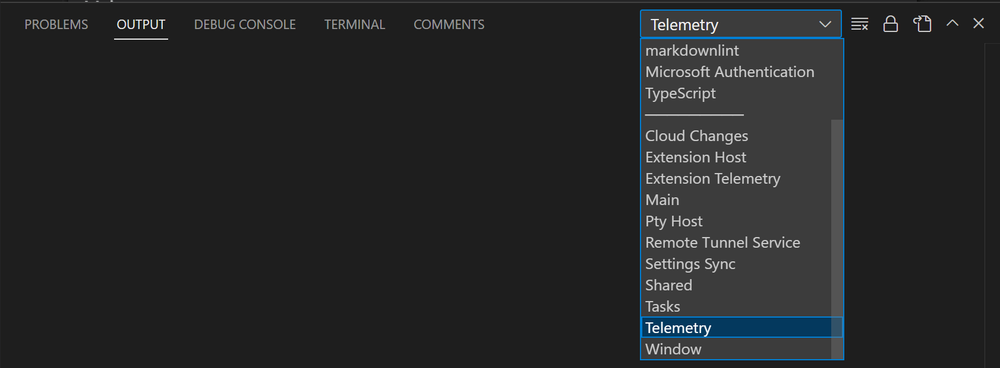

# 원격 측정 {#telemetry}

Visual Studio Code는 원격 측정 데이터를 수집하여 제품 개선을 위한 이해를 돕습니다. 예를 들어, 이 사용 데이터는 느린 시작 시간과 같은 문제를 디버깅하고 새로운 기능의 우선 순위를 정하는 데 도움이 됩니다. 이 데이터가 제공하는 통찰력에 감사하지만, 모든 사용자가 사용 데이터를 전송하고 싶어하지는 않다는 것도 알고 있습니다. 원격 측정을 비활성화할 수 있는 방법은 [원격 측정 보고 비활성화](#disable-telemetry-reporting)에서 설명합니다. 또한, [개인정보 보호 성명서](https://go.microsoft.com/fwlink/?LinkID=528096&clcid=0x409)를 읽어보면 더 많은 정보를 얻을 수 있습니다.

## 원격 측정 데이터의 유형 {#types-of-telemetry-data}

VS Code와 이 페이지는 원격 측정과 관련하여 세 가지 유형의 데이터를 언급합니다.

**충돌 보고서** - 충돌 보고서는 VS Code가 충돌할 때 진단 정보를 수집하고 이를 Microsoft에 전송하여 충돌이 발생한 이유와 향후 충돌을 방지하기 위해 필요한 변경 사항을 이해하는 데 도움을 줍니다.

**오류 원격 측정** - 오류 원격 측정은 애플리케이션을 충돌시키지 않지만 예상치 못한 오류에 대한 정보를 수집합니다.

**사용 데이터** - 사용 데이터는 VS Code에서 기능이 어떻게 사용되고 수행되는지에 대한 정보를 수집하여 향후 제품 개선의 우선 순위를 정하는 데 도움을 줍니다.

## 원격 측정 보고 비활성화 {#disable-telemetry-reporting}

`setting(telemetry.telemetryLevel)` 사용자 [설정](/docs/editor/settings.md)을 사용하여 단일 설정으로 전송하는 다양한 유형의 원격 측정을 제어할 수 있습니다. 다음은 `setting(telemetry.telemetryLevel)`의 각 값에 따라 전송되는 데이터 유형의 표입니다:

|       | 충돌 보고서         | 오류 원격 측정 | 사용 데이터     |
|:------|:---------------------:|:---------------:|:--------------:|
| all   |            ✓          |        ✓        |        ✓       |
| error |            ✓          |        ✓        |        -       |
| crash |            ✓          |        -        |        -       |
| off   |            -          |        -        |        -       |

예를 들어, Microsoft에 원격 측정 데이터를 전송하고 싶지 않다면 `setting(telemetry.telemetryLevel)` 사용자 [설정](/docs/editor/settings.md)을 `off`로 설정할 수 있습니다.

**파일** > **환경 설정** > **설정**에서 `telemetry`를 검색하고 **Telemetry: Telemetry Level** 설정을 `off`로 설정하세요. 이렇게 하면 앞으로 VS Code에서 발생하는 모든 원격 측정 이벤트가 무시됩니다. 설정을 비활성화할 때까지 원격 측정 정보가 수집되고 전송되었을 수 있습니다.


설정을 위해 JSON 편집기를 사용하는 경우 다음 줄을 추가하세요:

```json
    "telemetry.telemetryLevel": "off"
```

## 확장 프로그램과 원격 측정 {#extensions-and-telemetry}

VS Code는 Microsoft 및 타사 확장을 설치하여 제품에 기능을 추가할 수 있습니다. 이러한 확장은 자체 사용 데이터를 수집할 수 있으며 `setting(telemetry.telemetryLevel)` 설정으로 제어되지 않습니다. 특정 확장의 문서를 참조하여 해당 원격 측정 보고 및 비활성화 가능 여부를 확인하세요.

확장 프로그램 저자는 자신의 확장에서 원격 측정 모범 사례를 구현하는 방법에 대한 안내를 위해 ["확장 프로그램 저자를 위한"](#for-extension-authors) 섹션을 참조할 수 있습니다.

## 원격 측정 이벤트를 위한 출력 채널 {#output-channel-for-telemetry-events}

VS Code에서 전송되는 원격 측정 이벤트를 검토하고 싶다면 추적 기능을 활성화하면 원격 측정 이벤트가 기록됩니다. **개발자: 로그 수준 설정...** 명령을 사용하고 로그 수준 **Trace**를 선택하세요. 로그 출력을 보려면 출력 패널(`kb(workbench.action.output.toggleOutput)`)로 이동하여 드롭다운에서 **Telemetry**를 선택하세요.



원격 측정 이벤트를 추적할 때, 이벤트는 로컬 파일 `telemetry.log`에도 기록되며, **개발자: 로그 파일 열기...** 명령을 사용하고 드롭다운에서 **Telemetry**를 선택하여 볼 수 있습니다.


## 모든 원격 측정 이벤트 보기 {#viewing-all-telemetry-events}

VS Code가 전송할 수 있는 모든 가능한 원격 측정 이벤트를 보려면 CLI에서 `--telemetry` 플래그를 사용할 수 있습니다. 이렇게 하면 JSON 보고서가 생성되어 VS Code 내에서 볼 수 있습니다. 이러한 보고서는 빌드별로 생성되며, 확장 프로그램 저자가 루트 빌드 디렉터리에 `telemetry.json` 파일을 추가하지 않는 한 확장 원격 측정을 포함하지 않습니다.

예를 들어, `code --telemetry > telemetry.json && code telemetry.json`를 실행하면 현재 작업 디렉터리에 `telemetry.json` 파일이 생성되고 VS Code에서 열립니다. 원격 측정 보고서의 길이 때문에 이렇게 출력할 수는 없습니다: `code --telemetry | code -`.

아래 섹션에서는 원격 측정을 분류하는 데 사용되는 이벤트 메타데이터를 자세히 설명하고, 그 목적을 설명하며, 특별한 처리가 필요한 경우를 나타냅니다.

### 이벤트 분류 {#event-classification}

`classification` 필드는 데이터 유형을 설명합니다.

* `SystemMetaData` - 개인 식별이 불가능한 VS Code에서 생성한 값입니다.
* `CallstackOrException` - 프로그램 실행 실패로 인해 발생한 오류입니다. 여기에는 사용자 경로가 제거된 스택 추적이 포함됩니다.
* `PublicNonPersonalData` - 공개적으로 사용 가능한 사용자 생성 데이터, 예를 들어 게시된 확장 ID입니다.
* `EndUserPseudonymizedInformation` - 특정 사용자를 식별할 수 없도록 해시된 값입니다. 예를 들어, 해시된 MAC 주소입니다.

### 이벤트 목적 {#event-purpose}

`purpose` 필드는 데이터 수집의 이유를 설명합니다.

* `PerformanceAndHealth` - VS Code 제품 및 서비스가 건강하고 빠른지 확인하기 위해.
* `FeatureInsight` - 기능 사용을 이해하고 개발 투자를 계속할 곳을 파악하기 위해.
* `BusinessInsight` - VS Code, Microsoft 및 GitHub의 비즈니스와 관련된 결정을 내리기 위해.

### 이벤트 엔드포인트 {#event-endpoint}

`endpoint` 필드는 데이터가 전송되는 데이터 처리기를 설명합니다. 이는 일반적으로 사용자 개인 정보를 보호하기 위해 추가적인 정리 및 보안이 필요한 특수 데이터에 적용됩니다.

* `GoogleAnalyticsId` - Google Analytics 및 페이지 조회수를 추적하기 위해 웹사이트에서 사용됩니다. 이는 일반 데이터보다 더 민감하게 처리됩니다.
* `MacAddressHash` - VS Code 사용자를 식별하는 데 사용됩니다. 이는 클라이언트 측에서 한 번 해시되고, 파이프라인 측에서 다시 해시되어 특정 사용자를 식별할 수 없도록 합니다. [VS Code for the Web](/docs/editor/vscode-web.md)에서는 이 경우 UUID가 생성됩니다.
* `none` - 데이터는 특별한 처리가 필요하지 않습니다.

## GDPR 및 VS Code {#gdpr-and-vs-code}

일반 데이터 보호 규정(GDPR)을 지원하는 것 외에도, VS Code 팀은 개인 정보를 매우 중요하게 생각합니다. 이는 Microsoft라는 회사와 VS Code 팀 내에서 모두 해당됩니다.

GDPR 준수를 보장하기 위해, 우리는 VS Code에 몇 가지 업데이트를 진행했습니다. 여기에는 다음이 포함됩니다:

* 모든 기존 및 신규 사용자를 위해 제품 내에 원격 측정 수집을 비활성화하는 알림을 배치하여 이를 더 쉽게 만들었습니다.
* 우리가 전송하는 원격 측정을 검토하고 분류했습니다(자세한 내용은 [우리의 OSS 코드베이스](https://github.com/microsoft/vscode/pull/34997)에서 문서화됨).
* 우리가 수집하는 데이터에 대해 유효한 데이터 보존 정책을 마련했습니다. 예를 들어, 충돌 덤프에 대한 정책입니다.

간단히 말해, 우리는 모든 사용자에게 올바른 일을 하기 위해 열심히 노력했습니다. 이러한 관행은 유럽뿐만 아니라 모든 지역에 적용됩니다.

우리가 사람들이 물어볼 것으로 예상하는 질문 중 하나는 우리가 수집하는 데이터를 보는 것입니다. 그러나 VS Code는 사용자를 고유하게 식별할 수 있는 '로그인' 경험이 없기 때문에 이를 신뢰할 수 있는 방법으로 제공할 수 없습니다. 우리는 진단 목적으로 단일 사용자를 근사화하는 데 도움이 되는 정보를 전송하지만(이는 데스크탑의 네트워크 어댑터 NIC 해시와 웹의 무작위로 할당된 UUID를 기반으로 합니다) 이는 고유하다고 보장할 수 없습니다. 예를 들어, 가상 머신(VM)은 종종 NIC ID를 회전시키거나 풀에서 할당합니다. 이 기술은 문제를 해결하는 데 충분하지만, '당신의 데이터를 제공하는' 데는 신뢰할 수 없습니다.

우리는 GDPR 및 사용자 기대에 대해 더 많이 배우면서 우리의 접근 방식이 발전할 것으로 기대합니다. 사용자가 보내는 데이터는 매우 귀중하며, 이 덕분에 VS Code는 모든 사용자에게 더 나은 제품이 됩니다. 다시 말하지만, 개인 정보 보호가 걱정된다면, [원격 측정 보고 비활성화](#disable-telemetry-reporting)에서 설명한 대로 원격 측정 전송을 비활성화할 수 있는 기능을 제공합니다.

Visual Studio 가족이 GDPR에 접근하는 방법에 대한 더 많은 정보는 [Visual Studio Family Data Subject Requests for the GDPR](https://learn.microsoft.com/compliance/regulatory/gdpr-dsr-visual-studio-family)에서 확인할 수 있습니다.

## 온라인 서비스 관리 {#managing-online-services}

충돌 보고 및 원격 측정 외에도, VS Code는 제품 업데이트 다운로드, 확장 검색, 설치 및 업데이트, 설정 동기화 또는 설정 편집기 내 자연어 검색과 같은 다양한 다른 목적으로 온라인 서비스를 사용합니다. 이러한 서비스를 사용하는 기능을 켜거나 끌 수 있습니다.

이러한 기능을 끄는 것이 VS Code를 오프라인 모드로 전환하지는 않는다는 점에 유의하세요. 예를 들어, **확장 프로그램** 보기에서 확장을 검색하면 VS Code는 여전히 온라인 VS Code 마켓플레이스를 검색합니다. 설정은 사용자가 요청하지 않는 한 VS Code가 온라인 서비스와 통신하지 않도록 보장합니다.

**파일** > **환경 설정** > **설정**에서 태그 `@tag:usesOnlineServices`를 입력하세요. 그러면 온라인 서비스 사용을 제어하는 모든 설정이 표시되며, 개별적으로 켜거나 끌 수 있습니다.


> **참고**: VS Code 확장 프로그램도 온라인 서비스를 사용할 수 있으며, 이러한 온라인 서비스 사용을 구성하는 설정을 제공하지 않거나 `@tag:usesOnlineServices`를 검색할 때 표시되지 않을 수 있습니다. 특정 확장의 문서를 참조하여 온라인 서비스 사용에 대해 알아보세요.

### VS Code에서 사용하는 비Microsoft 온라인 서비스 {#non-microsoft-online-services-used-by-vs-code}

내장된 **VS Code용 npm 지원** 확장은 `https://registry.npmjs.org` 및 `https://registry.bower.io`에 요청을 보냅니다.

내장된 **TypeScript 및 JavaScript 언어 기능** 확장은 `https://registry.npmjs.org`의 `@types` 도메인을 쿼리합니다.

**개발자: 개발자 도구 전환** 또는 **개발자: 웹뷰 개발자 도구 열기**를 사용할 때, VS Code는 개발자 도구를 실행하는 데 필요한 데이터를 가져오기 위해 Google 서버와 통신할 수 있습니다.

## 확장 프로그램 추천 {#extension-recommendations}

VS Code는 파일 유형, 작업 공간 및 환경에 따라 확장 프로그램 추천을 제공합니다. 파일 유형 추천은 미리 계산된 것 또는 동적일 수 있습니다. 작업 공간 및 환경 추천은 항상 미리 계산됩니다.

확장 프로그램이 추천되는 이유를 알고 싶다면 확장 프로그램의 세부 정보 페이지를 열어보세요. 페이지 헤더에서 추천 이유를 찾을 수 있습니다.


### 미리 계산된 추천 {#precomputed-recommendations}

VS Code는 어떤 파일 유형 및 어떤 작업 공간/폴더에 대해 어떤 확장 프로그램이 활성화되었는지에 대한 원격 측정을 수집합니다. 특정 폴더는 각 폴더의 Git 원격을 해시하여 식별됩니다.

우리는 이 정보를 사용하여 익명 추천을 미리 계산합니다. 미리 계산된 추천은 특정 조건에서 확장을 추천해야 하는 지침입니다. 예를 들어, 두 개의 확장 A와 B 간의 흥미로운 상관관계를 발견하면, 한 지침은 "사용자가 확장 A를 설치했지만 B를 설치하지 않은 경우 확장 B를 추천하라"일 수 있습니다.

일부 미리 계산된 추천은 제품의 일부로 제공되며, 추가 미리 계산된 추천은 런타임에 온라인 Microsoft 서비스에서 가져옵니다. VS Code는 사용자 정보를 온라인 서비스에 전송하지 않고 독립적으로 미리 계산된 추천을 평가하고 실행합니다.

### 동적 추천 {#dynamic-recommendations}

VS Code에 미리 계산된 추천이 없는 파일 유형을 열면, 해당 파일 유형을 지원한다고 선언한 확장 프로그램을 위해 확장 프로그램 마켓플레이스에 요청합니다. 쿼리 결과로 설치되지 않은 확장 프로그램이 반환되면, VS Code는 알림을 제공합니다.

## 확장 프로그램 저자를 위한 {#for-extension-authors}

[확장 프로그램 가이드 원격 측정 문서](/api/extension-guides/telemetry.md)를 읽어주세요.

## 다음 단계 {#next-steps}

* [Visual Studio Code FAQ](/docs/supporting/faq.md) - 자주 묻는 질문을 참조하여 더 알아보세요.
* [사용자 및 작업 공간 설정](/docs/editor/settings.md) - VS Code를 사용자 정의할 수 있는 옵션에 대해 읽어보세요.
* [키 바인딩](/docs/editor/keybindings.md) - 자주 사용하는 키보드 단축키를 쉽게 수정할 수 있습니다.