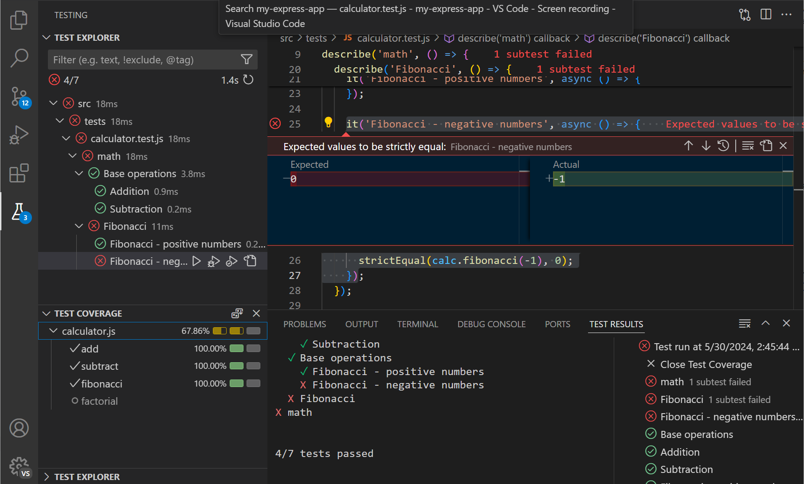

# 테스트 {#testing}

Visual Studio Code는 코드 테스트를 위한 풍부한 기능 세트를 제공합니다. 프로젝트에서 테스트를 자동으로 발견하고, 테스트를 실행 및 디버그하며, 테스트 커버리지 결과를 확인할 수 있습니다. VS Code의 GitHub Copilot은 프로젝트의 테스트 프레임워크 설정을 도와주고, 테스트 코드를 생성하며, 실패한 테스트를 수정하는 데 도움을 줄 수 있습니다.

이 기사에서는 VS Code에서 테스트를 시작하는 방법, 인기 있는 테스트 확장을 찾는 방법, 테스트 기능을 탐색하는 방법을 배울 것입니다. 또한 VS Code의 Copilot이 테스트를 더 빠르게 작성하는 데 어떻게 도움을 줄 수 있는지, 실패한 테스트를 수정하는 데 어떻게 도움을 줄 수 있는지도 배울 것입니다.

> [!TIP]
> 아직 Copilot 구독이 없다면, [Copilot 무료 플랜](https://github.com/github-copilot/signup)에 가입하여 무료로 Copilot을 사용해 보세요. 매달 완료 및 채팅 상호작용의 한도가 제공됩니다.

<!--  -->

## VS Code에서의 테스트에 대하여 {#about-testing-in-vs-code}

VS Code의 테스트 지원은 언어별이며, 설치된 [테스트 확장](#extensions-for-testing)에 따라 다릅니다. 언어 확장 또는 독립 실행형 확장은 특정 언어 또는 테스트 프레임워크에 대한 테스트 기능을 구현할 수 있습니다.

VS Code는 코드 테스트를 위한 다음과 같은 기능을 제공합니다:

* **다양한 테스트 프레임워크 지원**: 언어 [확장](#extensions-for-testing) 및 독립 실행형 테스트 확장은 Jest, Mocha, Pytest, JUnit 등 다양한 언어와 테스트 러너를 지원합니다.

* **중앙 집중식 테스트 관리**: [테스트 탐색기](#automatic-test-discovery-in-testing-view)는 프로젝트 내의 테스트를 관리하고 실행할 수 있는 중앙 집중식 장소를 제공합니다. 테스트 확장에 따라 테스트 탐색기가 프로젝트 내의 테스트를 자동으로 발견할 수 있습니다.

* **통합된 테스트 결과**: 테스트 코드 옆에 인라인으로 테스트 상태를 보거나, 테스트 탐색기에서 모든 테스트를 볼 수 있습니다. 자세한 테스트 결과는 테스트 결과 패널에서 확인할 수 있습니다.

* **디버깅**: [테스트 디버깅](#run-and-debug-tests)을 통해 테스트 실패를 진단합니다. VS Code의 풍부한 [디버깅 지원](/docs/editor/debugging.md)을 활용하여 중단점, 변수 감시 등을 사용할 수 있습니다.

* **테스트 커버리지**: [커버리지와 함께 테스트 실행](#test-coverage)하여 코드의 얼마나 많은 부분이 테스트로 커버되는지 확인합니다.

* **AI 지원 테스트**: VS Code에서 GitHub Copilot을 사용하여 테스트 프레임워크 설정, 테스트 코드 생성 및 실패한 테스트 수정에 도움을 받을 수 있습니다.

* **작업 통합**: [테스트 실행을 위한 작업 생성](#task-integration)으로 테스트 작업을 더 쉽게 만듭니다. 코드 변경 시 백그라운드에서 테스트를 실행할 수도 있습니다.

## VS Code에서 테스트 시작하기 {#get-started-with-testing-in-vs-code}

VS Code에서 테스트를 시작하려면 다음 단계를 따르세요:

1. 확장 보기에서 프로젝트에 대한 테스트 확장을 설치합니다. **테스트** 카테고리로 확장을 필터링합니다 (_@category:"testing"_).

1. 활동 표시줄에서 비커 아이콘(<i class="codicon codicon-beaker"></i>)을 선택하여 테스트 탐색기를 열고 프로젝트 내의 테스트를 발견합니다.

1. 테스트 탐색기 또는 편집기에서 직접 테스트를 실행하고 디버그합니다.

## 테스트를 위한 확장 {#extensions-for-testing}

테스트를 지원하는 확장은 [Visual Studio Marketplace](https://marketplace.visualstudio.com/search?target=VSCode&category=Testing&sortBy=Installs)에서 찾을 수 있습니다. 또한 확장 보기(`kb(workbench.view.extensions)`)로 이동하여 **테스트** 카테고리로 필터링할 수 있습니다.

<div class="marketplace-extensions-testing-tools-curated"></div>

> [!TIP]
> Copilot은 테스트 프레임워크 설정 및 관련 테스트 확장 제안에 도움을 줄 수 있습니다. 채팅 보기(`kb(workbench.action.chat.open)`)를 열고 `/setupTests` 명령을 입력하면 Copilot이 프로젝트 구성 과정을 안내합니다.

## 테스트 보기에서의 자동 테스트 발견 {#automatic-test-discovery-in-testing-view}

테스트 보기는 테스트를 관리하고 실행할 수 있는 중앙 집중식 장소를 제공합니다. 활동 표시줄에서 비커 아이콘(<i class="codicon codicon-beaker"></i>)을 선택하여 테스트 보기로 이동할 수 있습니다. 또한 명령 팔레트(`kb(workbench.action.showCommands)`)에서 **테스트: 테스트 탐색기 보기 집중** 명령을 사용할 수 있습니다.

테스트가 있는 프로젝트가 있는 경우, 테스트 탐색기 보기는 작업 공간 내의 테스트를 발견하고 나열합니다. 기본적으로 발견된 테스트는 테스트 탐색기에서 트리 보기로 표시됩니다. 트리 보기는 테스트의 계층 구조와 일치하여 테스트를 쉽게 탐색하고 실행할 수 있습니다.


테스트 탐색기에서 재생 버튼을 선택하여 테스트를 실행할 수 있습니다. [테스트 실행 및 디버깅](#run-and-debug-tests) 섹션에서 테스트 실행 및 디버깅에 대해 더 알아보세요.

> [!TIP]
> 테스트 탐색기 보기에서 테스트를 더블 클릭하여 테스트 코드로 이동합니다. 실패한 테스트를 선택하면 편집기가 테스트 파일을 열고, 실패한 테스트를 강조 표시하며, 오류 메시지를 보여줍니다.

테스트가 많을 경우 필터링 옵션을 사용하여 관심 있는 테스트를 빠르게 찾을 수 있습니다. **필터** 버튼을 사용하여 상태별로 테스트를 필터링하거나 현재 파일의 테스트만 표시할 수 있습니다. 특정 테스트 이름으로 검색하거나 `@` 기호를 사용하여 상태별로 검색할 수도 있습니다.


**더 많은 작업** 메뉴에서 정렬 및 표시 옵션과 같은 추가 기능에 접근할 수 있습니다.

새로운 테스트를 추가하거나 테스트를 변경한 경우, **테스트 새로 고침** 버튼을 사용하여 테스트 탐색기에서 테스트 목록을 새로 고칩니다. 또한 명령 팔레트(`kb(workbench.action.showCommands)`)에서 **테스트 탐색기: 테스트 새로 고침** 명령을 사용할 수 있습니다.

> [!NOTE]
> 테스트 확장에 따라, 프로젝트 내의 테스트를 발견하기 위해 먼저 테스트 프레임워크 또는 테스트 러너를 구성해야 할 수 있습니다. 자세한 내용은 테스트 확장의 문서를 참조하세요. Copilot 채팅 보기에서 `setupTests` 명령을 사용하여 프로젝트의 테스트 프레임워크 설정에 대한 도움을 받을 수 있습니다.

## AI로 테스트 작성하기 {#write-tests-with-ai}

테스트 작성은 시간이 많이 소요될 수 있으며 종종 간과됩니다. Copilot은 애플리케이션의 테스트 코드를 생성하여 테스트 작성 과정을 가속화할 수 있습니다. 이를 통해 단위 테스트, 통합 테스트, 엔드 투 엔드 테스트 등을 작성할 수 있습니다.

VS Code에서 Copilot을 사용하여 테스트를 작성하려면 다음 방법 중 하나를 사용할 수 있습니다:

* 편집기 스마트 작업

	1. 선택적으로 애플리케이션 코드 블록을 선택합니다.

	1. 편집기에서 마우스 오른쪽 버튼을 클릭한 후 **Copilot** > **테스트 생성**을 선택합니다.

* 채팅 프롬프트

	1. 테스트를 생성할 애플리케이션 코드 파일을 엽니다.

	1. Copilot Edits(`kb(workbench.action.chat.openEditSession)`), 채팅 보기(`kb(workbench.action.chat.open)`), 또는 편집기 인라인 채팅(`kb(inlineChat.start)`)을 엽니다.

	1. _이 코드에 대한 테스트를 생성합니다. 엣지 케이스에 대한 테스트도 포함합니다._와 같은 테스트 생성을 위한 프롬프트를 입력합니다.

		프롬프트에 `#file`을 입력하여 추가 컨텍스트를 제공할 수 있습니다. 예를 들어, _이 코드에 대한 테스트 생성 #file:calculator.js_와 같이 입력합니다.

		> [!TIP]
		> [단위 테스트 생성](https://docs.github.com/en/copilot/example-prompts-for-github-copilot-chat/testing-code/generate-unit-tests), [모의 객체](https://docs.github.com/en/copilot/example-prompts-for-github-copilot-chat/testing-code/create-mock-objects-to-abstract-layers), 또는 [엔드 투 엔드 테스트](https://docs.github.com/en/copilot/example-prompts-for-github-copilot-chat/testing-code/create-end-to-end-tests-for-a-webpage)에 대한 더 많은 예제 프롬프트를 GitHub Copilot 문서에서 확인하세요.

Copilot은 애플리케이션 코드에 대한 테스트 케이스 코드를 생성합니다. 이미 테스트 파일이 있는 경우, Copilot은 그곳에 테스트를 추가하거나 필요에 따라 새 파일을 생성합니다. 생성된 테스트는 Copilot에 추가 프롬프트를 제공하여 더 사용자 정의할 수 있습니다. 예를 들어, 다른 테스트 프레임워크를 사용하도록 Copilot에 요청할 수 있습니다.

> [!TIP]
> Copilot에 대한 [특별 지침을 제공하여 코드 생성을 할 수 있습니다](/docs/copilot/copilot-customization.md). 예를 들어, 특정 테스트 프레임워크, 명명 규칙 또는 코드 구조를 사용하도록 Copilot에 지시할 수 있습니다.

[VS Code에서 Copilot 사용하기](/docs/copilot/overview.md)에 대해 더 알아보세요.

## 테스트 실행 및 디버깅 {#run-and-debug-tests}

프로젝트 내의 테스트가 발견된 후, VS Code 내에서 테스트를 실행하고 디버그하며 테스트 결과를 직접 확인할 수 있습니다.

테스트 탐색기에서 섹션 제목의 컨트롤을 사용하여 모든 테스트를 실행하거나 디버그합니다. 특정 노드에서 실행/디버그 아이콘을 선택하여 트리 보기에서 특정 테스트를 실행하거나 디버그할 수도 있습니다.


편집기에서 테스트 코드를 보고 있을 때, 편집기 여백의 재생 컨트롤을 사용하여 해당 위치에서 테스트를 실행합니다.


여백 컨트롤을 마우스 오른쪽 버튼으로 클릭하여 테스트 디버깅과 같은 다른 작업을 볼 수 있습니다.

> [!TIP]
> 여백 컨트롤의 기본 테스트 작업을 구성하려면 `setting(testing.defaultGutterClickAction)` 설정을 사용하세요.

하나 이상의 테스트를 실행한 후, 편집기 여백과 테스트 탐색기의 트리 보기는 해당 테스트 상태(통과/실패)를 표시합니다. 테스트가 실패하면, 테스트 오류 메시지가 편집기에서 오버레이로 표시됩니다.


테스트 탐색기에서 **출력 표시** 버튼을 사용하여 **테스트 결과** 패널에서 테스트 출력을 확인합니다.


> [!TIP]
> Copilot은 실패한 테스트를 수정하는 데 도움을 줄 수 있습니다. 테스트 탐색기에서 트리 보기를 마우스 오버하고 **테스트 실패 수정** 버튼(_sparkle_)을 선택하면 Copilot이 실패한 테스트에 대한 수정 제안을 합니다. 또는 Copilot 채팅에서 `/fixTestFailure` 명령을 입력할 수 있습니다.


## 테스트 커버리지 {#test-coverage}

테스트 커버리지는 코드의 얼마나 많은 부분이 테스트로 커버되는지를 측정하는 것입니다. 이는 테스트되지 않은 코드 영역을 식별하는 데 도움이 됩니다. VS Code는 커버리지와 함께 테스트를 실행하고, 해당 테스트 확장이 테스트 커버리지를 지원하는 경우 커버리지 결과를 볼 수 있습니다.

테스트를 커버리지와 함께 실행할 수 있으며, 테스트를 실행하고 디버깅하는 것과 동일한 방식으로 수행할 수 있습니다. 테스트 탐색기 보기, 편집기 여백 또는 명령 팔레트(`kb(workbench.action.showCommands)`)의 해당 작업을 사용하세요.


커버리지와 함께 테스트를 실행한 후, 다양한 위치에서 커버리지 결과를 확인할 수 있습니다:

* 테스트 커버리지 보기

    트리 보기가 테스트와 그 커버리지 비율을 보여줍니다. 색상 지표는 커버리지 비율에 대한 시각적 신호를 제공합니다. 각 줄 위에 마우스를 올리면 커버리지 결과에 대한 자세한 정보를 확인할 수 있습니다.

    

* 편집기에서 오버레이로

    테스트 커버리가 있는 코드 파일의 경우, 편집기는 여백에 색상 오버레이를 표시하여 어떤 줄이 테스트로 커버되었는지 또는 그렇지 않은지를 나타냅니다. 여백 위에 마우스를 올리면 커버된 줄에 대해 해당 줄이 실행된 횟수에 대한 지표도 표시됩니다. 편집기 제목 표시줄에서 **인라인 커버리지 표시** 버튼을 선택하거나 **테스트: 인라인 커버리지 표시** 명령(`kb(testing.toggleInlineCoverage)`)을 사용하여 커버리지 오버레이를 전환할 수 있습니다.

    

* 탐색기 보기에서, 코드 파일의 커버리지 비율을 표시합니다.

    탐색기 보기는 코드 파일의 커버리지 비율을 보여줍니다. 탐색기에서 파일이나 노드 위에 마우스를 올리면 커버리지 결과에 대한 자세한 정보를 확인할 수 있습니다.

    

* 차이점 편집기에서

    차이점 편집기가 열려 있는 경우, 커버리지 결과는 편집기에서 표시되는 방식과 유사하게 차이점 편집기에서도 표시됩니다.

## 작업 통합 {#task-integration}

VS Code의 작업은 스크립트를 실행하고 VS Code 내에서 프로세스를 시작하도록 구성할 수 있으며, 명령줄에 입력하거나 새 코드를 작성할 필요가 없습니다. VS Code에서는 테스트를 실행하는 기본 테스트 작업을 정의하고, 선택적으로 테스트를 실행하기 위한 키보드 단축키를 만들 수 있습니다.

**작업: 기본 테스트 작업 구성** 명령을 사용하여 기본 테스트 작업을 구성합니다. VS Code는 `package.json` 파일을 기반으로 테스트 작업을 자동으로 감지하려고 시도합니다. 기본 테스트 작업을 선택한 후, `tasks.json` 파일이 열려 작업을 사용자 정의할 수 있습니다.

다음 코드 조각은 `node --test` 명령을 기본 테스트 작업으로 지정하는 `tasks.json` 파일을 보여줍니다.

```json
{
	"version": "2.0.0",
	"tasks": [
		{
			"type": "npm",
			"script": "test",
			"group": {
				"kind": "test",
				"isDefault": true
			},
			"problemMatcher": [],
			"label": "npm: test",
			"detail": "node --test src/tests/**.js"
		}
	]
}
```

테스트 작업을 실행하려면 **작업: 테스트 작업 실행** 명령을 사용하거나 [명령에 대한 키보드 단축키 만들기](/docs/editor/keybindings.md)를 사용할 수 있습니다.

[작업 사용 및 구성하기](/docs/editor/tasks.md)에 대해 더 알아보세요.

> [!NOTE]
> 현재 작업은 VS Code의 테스트 기능과 특별한 통합이 없으므로, 작업 내에서 테스트를 실행하면 사용자 인터페이스가 업데이트되지 않습니다. 개별 테스트 확장은 UI에 통합된 특정 테스트 자동화 기능을 제공할 수 있습니다.

## 테스트 구성 설정 {#test-configuration-settings}

VS Code에서 테스트 경험을 사용자 정의하기 위해 구성할 수 있는 여러 설정이 있습니다. 각 언어 확장은 해당 언어의 테스트에 특정한 추가 설정을 제공할 수 있습니다. 다음은 구성할 수 있는 일반적인 설정입니다:

| 설정 ID | 세부 사항 |
|-|-|
| `setting(testing.countBadge)` | 활동 표시줄의 테스트 아이콘에 대한 카운트 배지를 제어합니다. |
| `setting(testing.gutterEnabled)` | 편집기 여백에 테스트 컨트롤을 표시할지 여부를 구성합니다. |
| `setting(testing.defaultGutterClickAction)` | 여백 테스트 컨트롤을 선택할 때의 기본 동작을 구성합니다. |
| `setting(testing.coverageBarThresholds)` | 테스트 커버리지 보기의 커버리지 바 임계값에 대한 색상을 구성합니다. |
| `setting(testing.displayedCoveragePercent)` | 테스트 커버리지 보기에서 표시되는 비율 값을 구성합니다 (총, 문장, 또는 최소). |
| `setting(testing.showCoverageInExplorer)` | 탐색기 보기에서 커버리지 비율을 표시할지 여부를 구성합니다. |

모든 테스트 관련 설정은 설정 편집기(`kb(workbench.action.openSettings)`)에서 찾을 수 있습니다.

## 다음 단계 {#next-steps}

* [Python](/docs/python/testing.md), [Java](/docs/java/java-testing.md), 또는 [C#](/docs/csharp/testing.md)에서 테스트 시작하기

* [VS Code에서 Copilot 및 AI 지원 테스트에 대해 더 알아보기](/docs/copilot/overview.md)

* [작업 사용 및 구성하기](/docs/editor/tasks.md)에 대해 더 알아보기
---