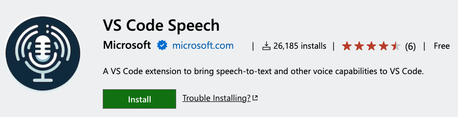
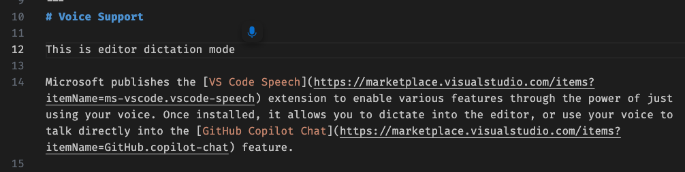
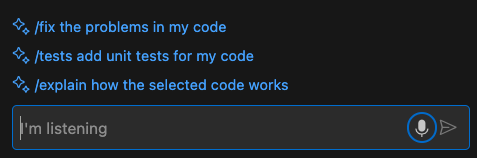
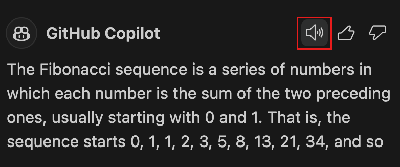
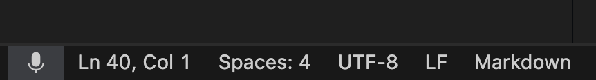

# 음성 지원 {#voice-support}

[VS Code Speech](https://marketplace.visualstudio.com/items?itemName=ms-vscode.vscode-speech) 확장 프로그램은 음성을 사용하여 다양한 기능을 활성화합니다. 설치 후, 이 확장 프로그램을 통해 편집기에 음성을 입력하거나 [Copilot Chat](https://marketplace.visualstudio.com/items?itemName=GitHub.copilot-chat)와 음성으로 상호작용할 수 있습니다.

**참고:** VS Code의 음성 지원은 온라인 상태일 필요가 없습니다. 녹음은 온라인 서비스로 전송되지 않고, 귀하의 기기에서 로컬로 처리됩니다.

## 편집기 음성 입력 {#editor-dictation}

다음 명령어를 통해 편집기에 음성을 입력할 수 있습니다: **Voice: Start Dictation in Editor** (`kb(workbench.action.editorDictation.start)`) 및 **Voice: Stop Dictation in Editor** (`kb(workbench.action.editorDictation.stop)`). 시작하면 커서 위치에 작은 마이크 아이콘이 나타나며, 음성 입력을 기다립니다:

음성 시작 명령어의 키보드 단축키 (`kb(workbench.action.editorDictation.start)`)를 누르고 있으면 **워키토키 모드**가 활성화됩니다. 키를 놓을 때까지 음성 인식이 활성화되며, 그 후 요청이 자동으로 제출됩니다.

**참고:** 음성 입력은 SCM 커밋 입력 상자 및 풀 리퀘스트 검토 시 주석 입력 필드와 같이 리치 편집기가 사용되는 다른 곳에서도 작동합니다.

## Copilot Chat에서의 음성 사용 {#voice-in-copilot-chat}

음성을 사용하여 [Copilot Chat](https://marketplace.visualstudio.com/items?itemName=GitHub.copilot-chat)와 쉽게 대화할 수 있습니다. **Voice: Start Voice Chat** (`kb(workbench.action.chat.startVoiceChat)`) 명령어를 사용하면 현재 포커스가 어디에 있든 음성 채팅이 시작됩니다. 포커스가 편집기에 있을 경우 인라인 채팅이 시작되고, 그렇지 않으면 채팅 뷰가 열립니다.

**참고:** Copilot Chat에서 음성을 사용할 때, 잠시 멈추면 채팅 프롬프트가 자동으로 제출됩니다. 제출하기 전에 대기할 시간을 `setting(accessibility.voice.speechTimeout)` 설정을 통해 구성할 수 있으며, 이 기능을 비활성화하려면 설정을 `0`으로 구성하면 됩니다.

Copilot Chat은 텍스트 음성 변환 기능도 지원합니다. `setting(accessibility.voice.autoSynthesize)` 설정을 활성화하면, 음성을 입력으로 사용했을 때 Copilot Chat의 응답이 자동으로 읽어집니다. 합성을 중단하려면 아이콘을 선택하거나 `kb(workbench.action.speech.stopReadAloud)`를 누르십시오.

각 채팅 응답에는 새로운 스피커 아이콘이 표시되어 응답을 선택적으로 소리 내어 읽을 수 있습니다.

## 워키토키 모드 {#walky-talky-mode}

편집기나 채팅에서 음성을 시작하기 위해 키보드 단축키 (`kb(workbench.action.editorDictation.start)` 또는 `kb(workbench.action.chat.startVoiceChat)`)를 사용할 때, 키보드 단축키를 누르고 있으면 음성 인식이 시작됩니다. 키보드 단축키를 놓으면 음성 인식이 중지됩니다. 또한 채팅에서 사용될 경우, 프롬프트가 제출됩니다.

## "헤이 코드" {#hey-code}

VS Code가 항상 "헤이 코드"라는 구문을 듣고 음성 채팅 세션을 시작할 수 있는 모드를 활성화할 수 있습니다. 이를 활성화하려면 `setting(accessibility.voice.keywordActivation)` 설정을 적절히 구성하십시오. VS Code가 "헤이 코드"를 듣고 있을 때, 상태 표시줄에 마이크 아이콘이 나타납니다:

## 여러 언어 지원 {#support-for-multiple-languages}

`setting(accessibility.voice.speechLanguage)` 설정을 사용하여 26개 지원 언어 중 하나를 선택할 수 있습니다. 값을 `auto`(기본값)로 설정하면, VS Code Speech 확장 프로그램은 사용 가능한 경우 [VS Code 표시 언어](/docs/editor/locales.md)를 사용합니다.

음성 확장 프로그램의 각 언어는 자체 확장 프로그램으로 제공됩니다. 처음 음성 인식을 시작할 때 선택한 각 언어에 대한 확장 프로그램 설치가 표시됩니다.

## 다음 단계 {#next-steps}

다음 내용을 읽어보세요:

* [기타 VS Code 접근성 기능](/docs/editor/accessibility.md).
* [Visual Studio Code 사용자 인터페이스](/docs/getstarted/userinterface.md) - VS Code에 대한 간단한 안내.
* [기본 편집](/docs/editor/codebasics.md) - 강력한 VS Code 편집기에 대해 알아보세요.
* [코드 탐색](/docs/editor/editingevolved.md) - 소스 코드를 빠르게 이동하세요.