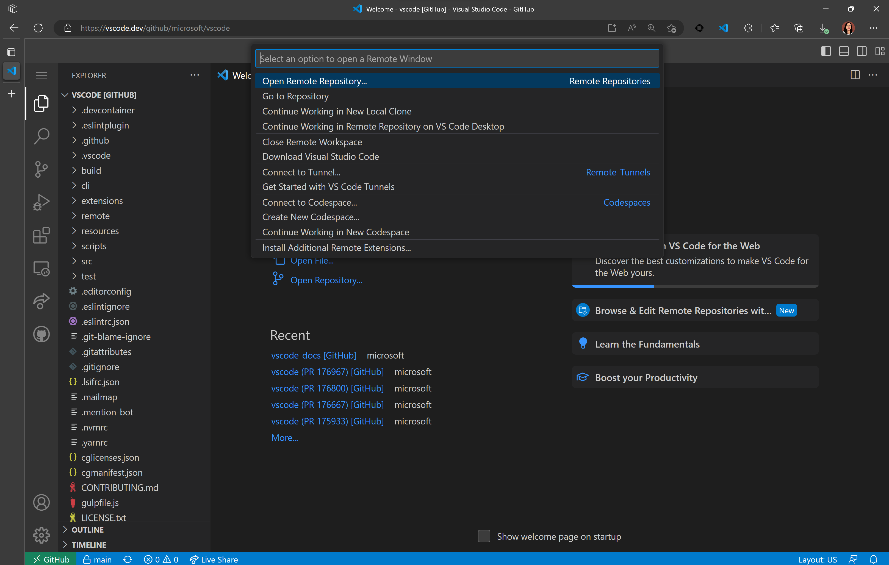
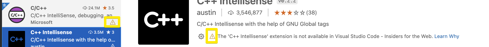

# 웹을 위한 Visual Studio Code {#visual-studio-code-for-the-web}

웹을 위한 Visual Studio Code는 브라우저에서 완전히 실행되는 무료, 무설치 Microsoft Visual Studio Code 경험을 제공하여 소스 코드 Repository를 빠르고 안전하게 탐색하고 가벼운 코드 변경을 할 수 있게 해줍니다. 시작하려면 브라우저에서 [https://vscode.dev](https://vscode.dev)로 이동하세요.

웹을 위한 VS Code는 검색 및 구문 강조와 같은 VS Code 데스크톱의 많은 기능을 포함하고 있으며, 코드베이스에서 작업하고 간단한 수정을 할 수 있도록 확장 지원도 제공합니다. Repository, Fork 및 GitHub 및 Azure Repos와 같은 소스 관리 서비스의 Pull Request를 열 수 있을 뿐만 아니라, 로컬 머신에 저장된 코드로 작업할 수도 있습니다.

웹을 위한 VS Code는 완전히 웹 브라우저에서 실행되므로 데스크톱 버전에 비해 특정 제한이 있습니다. 이에 대한 자세한 내용은 [아래](#limitations)에서 확인할 수 있습니다.

다음 비디오는 웹을 위한 Visual Studio Code에 대한 간략한 개요를 제공합니다.

<iframe width="560" height="315" src="https://www.youtube-nocookie.com/embed/2sdXMJZKLJE" title="웹을 위한 Visual Studio Code 소개" frameborder="0" allow="accelerometer; autoplay; clipboard-write; encrypted-media; gyroscope; picture-in-picture" allowfullscreen></iframe>

## VS Code 데스크톱과의 관계 {#relationship-to-vs-code-desktop}

웹을 위한 VS Code는 파일 및 Repository를 탐색하고 가벼운 코드 변경을 커밋하는 브라우저 기반 경험을 제공합니다. 그러나 코드를 실행, 빌드 또는 디버그할 수 있는 런타임에 접근해야 하거나, 터미널과 같은 플랫폼 기능을 사용해야 하거나, 웹에서 지원되지 않는 확장을 실행해야 하는 경우, 작업을 데스크톱 애플리케이션, [GitHub Codespaces](https://github.com/features/codespaces)로 이동하거나 [Remote - Tunnels](#use-your-own-compute-instance-with-remote-tunnels)를 사용하여 VS Code의 전체 기능을 활용하는 것을 권장합니다. 또한, VS Code 데스크톱에서는 브라우저에 의해 제한되지 않는 전체 키보드 단축키 세트를 사용할 수 있습니다.

전환할 준비가 되면 몇 번의 클릭으로 전체 VS Code 경험으로 ["업그레이드"]( #continue-working-in-a-different-environment)할 수 있습니다.

또한 기어 아이콘을 선택한 후 **Switch to Insiders Version...** 을 선택하거나 [https://insiders.vscode.dev](https://insiders.vscode.dev)로 직접 이동하여 웹을 위한 VS Code의 안정적인 버전과 인사이더 버전 간에 전환할 수 있습니다.

## 프로젝트 열기 {#opening-a-project}

[https://vscode.dev](https://vscode.dev)로 이동하여 새로운 로컬 파일이나 프로젝트를 생성하거나 기존 로컬 프로젝트에서 작업하거나 GitHub 및 Azure Repos( Azure DevOps의 일부)와 같은 다른 곳에 호스팅된 소스 코드 Repository에 접근할 수 있습니다.

웹에서 VS Code 데스크톱 환경과 마찬가지로 **File** > **New File**을 사용하여 새로운 로컬 파일을 생성할 수 있습니다(명령 팔레트에서 `kbstyle(F1)` 사용).

## GitHub Repository {#github-repos}

URL에서 직접 웹을 위한 VS Code에서 GitHub Repository를 열 수 있으며, URL 형식은 다음과 같습니다: `https://vscode.dev/github/<organization>/<repo>`. [VS Code Repository](https://github.com/microsoft/vscode)를 예로 들면, 다음과 같이 됩니다: `https://vscode.dev/github/microsoft/vscode`.

이 경험은 [GitHub Repositories](https://marketplace.visualstudio.com/items?itemName=GitHub.remotehub) 확장(더 넓은 [Remote Repositories](https://marketplace.visualstudio.com/items?itemName=ms-vscode.remote-repositories) 확장의 일부)에 의해 제공되는 사용자 지정 `vscode.dev/github` URL에서 제공됩니다.

GitHub Repositories를 사용하면 코드가 로컬 머신에 풀리지 않고도 편집기 내에서 원격으로 Repository를 탐색하고 수정할 수 있습니다. 확장 및 작동 방식에 대한 자세한 내용은 [GitHub Repositories](/docs/sourcecontrol/github.md#github-repositories-extension) 가이드를 참조하세요.

:::note
[GitHub Repositories](https://marketplace.visualstudio.com/items?itemName=GitHub.remotehub) 확장은 VS Code 데스크톱에서도 빠른 Repository 탐색 및 편집을 제공하기 위해 작동합니다. 확장을 설치한 후에는 **GitHub Repositories: Open Repository...** 명령을 사용하여 Repository를 열 수 있습니다.
:::

브라우저의 검색창(즉, 옴니박스)을 통해 `vscode.dev`에서 GitHub Repository를 열 수도 있습니다. Chrome 및 Edge용 `vscode.dev` [확장](https://chrome.google.com/webstore/detail/vs-code/kobakmhnkfaghloikphojodjebdelppk)을 설치한 후, `code`를 입력하여 옴니박스를 활성화하고 Repository 이름을 입력합니다. 제안은 브라우저 검색 기록에 의해 제공되므로, 원하는 Repository가 나타나지 않으면 전체 자격이 있는 `<owner>/<repo>` 이름을 입력하여 열 수 있습니다. 예를 들어 `microsoft/vscode`와 같이 입력합니다.


이미 [https://vscode.dev](https://vscode.dev)에서 웹을 위한 VS Code에 있는 경우, [Remote Repositories](https://marketplace.visualstudio.com/items?itemName=ms-vscode.remote-repositories) 확장 명령을 통해 다른 Repository로 탐색할 수 있습니다. 상태 표시줄의 왼쪽 하단에 있는 원격 표시기를 선택하면 **Open Remote Repository...** 명령이 표시됩니다.



## Azure Repos {#azure-repos}

웹을 위한 VS Code에서 GitHub Repository와 마찬가지로 Azure Repos를 열 수 있습니다.

`https://vscode.dev/azurerepos/<organization>/<project>/<repo>` URL 형식이 있는 URL로 이동하면 Repository의 파일을 읽고 검색하며 Azure Repos에 변경 사항을 커밋할 수 있습니다. 변경 사항을 가져오고, 풀하고, 동기화하며, Branch를 볼 수 있습니다.

Azure Repos의 모든 Repository, Branch 또는 Tag를 VS Code for the Web에서 열려면 Azure Repos URL 앞에 `vscode.dev`를 추가하면 됩니다.

Azure DevOps Repository 또는 Pull Request에 있는 경우, (`kbstyle(.)`)를 눌러 웹을 위한 VS Code에서 열 수 있습니다.

## 더 많은 사용자 지정 URL {#more-custom-urls}

데스크톱과 마찬가지로, 웹을 위한 VS Code는 거의 모든 백엔드, 언어 및 서비스를 지원하는 풍부한 확장 생태계를 통해 사용자 지정할 수 있습니다. `vscode.dev`는 일반적인 경험에 대한 바로 가기를 제공하는 URL을 포함합니다.

우리는 이미 몇 가지 URL(`vscode.dev/github` 및 `vscode.dev/azurerepos`)를 살펴보았습니다. 다음은 보다 완전한 목록입니다:

| 서비스 | URL 구조 | 문서 |
| --- | --- | --- |
| GitHub | `/github/<org>/<repo>` | [위에서 참고하기](#github-repos) |
| Azure Repos | `/azurerepos/<org>/<project>/<repo>` | [위에서 참고하기](#azure-repos) |
| Visual Studio Live Share | `/editor/liveshare/<sessionId>` | [아래에서 참고하기](#visual-studio-live-share) |
| Visual Studio Marketplace | `/editor/marketplace/<marketplacePublisher>`<br />`/<extensionId>/<extensionVersion>` | [이 확장 프로그램을 편집하기 위한 예시 경로](https://insiders.vscode.dev/editor/marketplace/Brigit/devcontainer-image-convert/0.0.1) |
| Power Pages | `/power/pages` | [Power Pages 문서](https://learn.microsoft.com/power-pages/configure/visual-studio-code-editor) |
| 프로필 | `/editor/profile/github/<GUID>` | [프로필 문서](/docs/editor/profiles.md#save-as-a-github-gist) |
| 테마 | `/editor/theme/<extensionId>` | [아래에서 참고하기](#themes) |
| MakeCode | `/edu/makecode` | [MakeCode 문서](https://arcade.makecode.com/vscode) |
| 교육을 위한 VS Code | `/edu` | [교육을 위한 VS Code 랜딩 페이지](https://vscodeedu.com/) |
| Azure Machine Learning (AML) | `/+ms-toolsai.vscode-ai-remote-web` | [AML 문서](https://learn.microsoft.com/azure/machine-learning/how-to-launch-vs-code-remote?view=azureml-api-2&tabs=vscode-web) |

일부 URL은 특정 방식으로 입력해야 합니다(예: `vscode.dev/editor/liveshare`는 활성 Live Share 세션이 필요합니다). 각 서비스의 문서를 검토하여 특정 접근 및 사용 정보를 확인하세요.

이러한 URL 중 일부에 대한 추가 정보는 아래에서 확인할 수 있습니다.

### 테마 {#themes}

URL URL 형식 `https://vscode.dev/editor/theme/<extensionId>`를 통해 웹을 위한 VS Code에서 색상 테마를 공유하고 경험할 수 있습니다.

예를 들어, [https://vscode.dev/editor/theme/sdras.night-owl](https://vscode.dev/editor/theme/sdras.night-owl)로 이동하여 [Night Owl 테마](https://marketplace.visualstudio.com/items?itemName=sdras.night-owl)를 다운로드 및 설치 과정 없이 경험할 수 있습니다.

:::note
색상 테마 URL 형식은 완전히 선언적인 테마(코드 없음)에 대해 작동합니다.
:::

확장 프로그램은 여러 테마를 정의할 수 있습니다. `/editor/theme/<extensionId>/<themeName>` URL 형식을 사용할 수 있습니다. `themeName`이 지정되지 않으면, 웹을 위한 VS Code는 첫 번째 테마를 사용합니다.

테마 작성자는 사용자가 웹을 위한 VS Code에서 쉽게 테마를 시도할 수 있도록 확장 README에 다음 배지를 추가할 수 있습니다(여기서 `<extensionId>`는 테마 확장의 고유 식별자로 교체):

```markdown
[](https://vscode.dev/editor/theme/<extensionId>)
```

### Visual Studio Live Share {#visual-studio-live-share}

[Live Share](https://marketplace.visualstudio.com/items?itemName=MS-vsliveshare.vsliveshare) 게스트 세션은 `https://vscode.dev/editor/liveshare` URL을 통해 브라우저에서 사용할 수 있습니다. `sessionId`는 확장에 전달되어 원활한 경험을 제공합니다.

## 다른 환경에서 계속 작업하기 {#continue-working-in-a-different-environment}

경우에 따라 코드를 실행할 수 있는 다른 환경에 접근해야 할 수 있습니다. 로컬 파일 시스템과 전체 언어 및 개발 도구를 지원하는 개발 환경에서 Repository 작업으로 전환할 수 있습니다.

GitHub Repositories 확장은 Repository를 로컬로 Clone하고, 데스크톱에서 다시 열거나 현재 Repository에 대한 GitHub codespace를 생성하는 것을 쉽게 만들어 줍니다( [GitHub Codespaces](https://marketplace.visualstudio.com/items?itemName=GitHub.codespaces) 확장을 설치하고 GitHub codespaces를 생성할 수 있는 접근 권한이 있는 경우). 이를 위해 명령 팔레트(`kbstyle(F1)`)에서 사용할 수 있는 **Continue Working On...** 명령을 사용하거나 상태 표시줄의 원격 표시기를 클릭하세요.

## 작업 저장 및 공유 {#saving-and-sharing-work}

웹에서 로컬 파일 작업 시, [Auto Save](/docs/editor/codebasics.md#save--auto-save)가 활성화되어 있으면 작업이 자동으로 저장됩니다. 데스크톱 VS Code에서 작업할 때와 마찬가지로 수동으로 저장할 수도 있습니다(예: **File** > **Save**).

원격 Repository에서 작업할 때, 작업은 커밋할 때까지 브라우저의 로컬 저장소에 저장됩니다. GitHub Repositories를 사용하여 Repository 또는 Pull Request을 열면, 소스 제어 보기에서 변경 사항을 푸시하여 새로운 작업을 지속할 수 있습니다.

또한 [다른 환경에서 계속 작업하기](#continue-working-in-a-different-environment)를 통해 다른 환경에서 계속 작업할 수 있습니다.

커밋되지 않은 변경 사항으로 **Continue Working On**을 처음 사용할 때, **Cloud Changes**를 사용하여 선택한 개발 환경으로 편집을 가져올 수 있는 옵션이 제공됩니다. 이는 보류 중인 변경 사항을 저장하기 위해 VS Code 서비스를 사용하는 것입니다. 이에 대한 자세한 내용은 [GitHub Repositories](/docs/sourcecontrol/github.md#continue-working-on) 문서에서 확인할 수 있습니다.

## Remote Tunnels로 자신의 컴퓨팅 인스턴스 사용하기 {#use-your-own-compute-instance-with-remote-tunnels}

[Remote - Tunnels](https://marketplace.visualstudio.com/items?itemName=ms-vscode.remote-server) 확장을 사용하여 웹을 위한 VS Code에서 다른 머신에 대해 개발할 수 있습니다.

Remote - Tunnels 확장은 안전한 터널을 통해 데스크톱 PC 또는 가상 머신(VM)과 같은 원격 머신에 연결할 수 있게 해줍니다. 그러면 SSH 없이도 어디에서나 해당 머신에 안전하게 연결할 수 있습니다. 이를 통해 "자신의 컴퓨팅"을 vscode.dev로 가져와 브라우저에서 코드를 실행하는 등의 추가 시나리오를 가능하게 합니다.

Remote - Tunnels에 대한 자세한 내용은 [문서](/docs/remote/tunnels.md)를 참조하세요.

## 안전한 탐색 {#safe-exploration}

웹을 위한 VS Code는 완전히 웹 브라우저의 샌드박스 내에서 실행되며 매우 제한된 실행 환경을 제공합니다.

원격 Repository의 코드에 접근할 때, 웹 편집기는 Repository를 "Clone"하지 않고, 대신 브라우저에서 서비스의 API를 직접 호출하여 코드를 로드합니다. 이는 신뢰할 수 없는 Repository를 Clone할 때 공격 표면을 더욱 줄여줍니다.

로컬 파일로 작업할 때, 웹을 위한 VS Code는 브라우저의 파일 시스템 접근 API를 통해 파일을 로드하며, 이는 브라우저가 접근할 수 있는 범위를 제한합니다.

## 어디서나 실행 {#run-anywhere}

[GitHub Codespaces](/docs/remote/codespaces.md)와 유사하게, 웹을 위한 VS Code는 iPad와 같은 태블릿에서도 실행할 수 있습니다.

## 언어 지원 {#language-support}

언어 지원은 웹에서 조금 더 미묘하며, 코드 편집, 탐색 및 탐색을 포함합니다. 데스크톱 경험은 일반적으로 파일 시스템, 런타임 및 컴퓨팅 환경을 기대하는 언어 서비스 및 컴파일러에 의해 지원됩니다. 브라우저에서는 이러한 경험이 브라우저에서 실행되는 언어 서비스에 의해 제공되어 소스 코드 토큰화 및 구문 색상화, 완성 및 많은 단일 파일 작업을 제공합니다.

일반적으로 경험은 다음과 같은 범주로 나뉩니다:

- **좋음:** 대부분의 프로그래밍 언어에 대해, 웹을 위한 VS Code는 코드 구문 색상화, 텍스트 기반 완성 및 괄호 쌍 색상화를 제공합니다. [Tree-sitter](https://tree-sitter.github.io/tree-sitter) 구문 트리를 [anycode 확장](https://marketplace.visualstudio.com/items?itemName=ms-vscode.anycode)을 통해 사용하여 C/C++, C#, Java, PHP, Rust 및 Go와 같은 인기 있는 언어에 대해 **개요/기호로 이동** 및 **기호 검색**과 같은 추가 경험을 제공할 수 있습니다.
- **더 좋음:** TypeScript, JavaScript 및 Python 경험은 모두 브라우저에서 네이티브로 실행되는 언어 서비스에 의해 지원됩니다. 이러한 프로그래밍 언어를 사용하면 "**좋음**" 경험에 풍부한 단일 파일 완성, 의미론적 강조, 구문 오류 등이 추가됩니다.
- **최고:** JSON, HTML, CSS 및 LESS와 같은 많은 "웹 관련" 언어의 경우, vscode.dev에서의 코딩 경험은 데스크톱과 거의 동일합니다(마크다운 미리보기를 포함하여!).

현재 파일에서 언어 지원 수준은 상태 표시줄의 언어 상태 표시기를 통해 확인할 수 있습니다:


## 제한 사항 {#limitations}

웹을 위한 VS Code는 브라우저 내에서 완전히 실행되므로, 데스크톱 앱에서 할 수 있는 것과 비교할 때 일부 경험은 자연스럽게 더 제한적입니다. 예를 들어, 터미널과 디버거는 사용할 수 없으며, 이는 브라우저 샌드박스 내에서 Rust 또는 Go 애플리케이션을 컴파일, 실행 및 디버그할 수 없기 때문에 이해할 수 있습니다.

### 확장 프로그램 {#extensions}

브라우저에서 실행할 수 있는 확장 프로그램은 일부만 가능합니다. 웹에서 확장 프로그램을 설치하려면 확장 보기에서 사용할 수 있으며, 설치할 수 없는 확장 프로그램은 경고 아이콘과 **Learn Why** 링크가 표시됩니다. 시간이 지남에 따라 더 많은 확장이 활성화될 것으로 예상합니다.



확장 프로그램을 설치하면 브라우저의 로컬 저장소에 저장됩니다. [설정 동기화](/docs/editor/settings-sync)를 활성화하면 VS Code 인스턴스 간에 확장 프로그램이 동기화되며, 여기에는 다른 브라우저 및 데스크톱도 포함됩니다.

확장 프로그램 팩에 브라우저 샌드박스에서 실행되지 않는 확장 프로그램이 포함된 경우, 패키지에 포함된 확장 프로그램을 볼 수 있는 옵션과 함께 정보 메시지가 표시됩니다.


브라우저 샌드박스에서 실행되는 확장 프로그램은 더 제한적입니다. 대부분의 테마, 스니펫 또는 문법과 같은 순수하게 선언적인 확장 프로그램은 수정 없이 실행될 수 있으며, 확장 프로그램 작성자의 수정 없이 웹을 위한 VS Code에서 사용할 수 있습니다. 코드를 실행하는 확장 프로그램은 브라우저 샌드박스에서 실행을 지원하도록 업데이트되어야 합니다. 브라우저에서 확장 프로그램을 지원하는 데 필요한 사항에 대한 자세한 내용은 [웹 확장 프로그램 작성자 가이드](/api/extension-guides/web-extensions.md)를 참조하세요.

브라우저에서 부분적으로만 지원되는 확장 프로그램도 있습니다. 좋은 예는 [부분적인 인텔리센스 모드](/docs/nodejs/working-with-javascript.md#partial-intellisense-mode)로 지원을 제한하는 언어 확장 프로그램입니다.

### 파일 시스템 API {#file-system-api}

현재 Edge와 Chrome은 [파일 시스템 API](https://developer.mozilla.org/docs/Web/API/File_System_Access_API)를 지원하여 웹 페이지가 로컬 파일 시스템에 접근할 수 있도록 합니다. 브라우저가 파일 시스템 API를 지원하지 않는 경우, 로컬 폴더를 열 수는 없지만 파일을 열 수는 있습니다.

### 브라우저 지원 {#browser-support}

웹을 위한 VS Code는 최신 버전의 Chrome, Edge, Firefox 및 Safari에서 사용할 수 있습니다. 각 브라우저의 이전 버전은 작동하지 않을 수 있으며, 최신 버전에 대한 지원만 보장합니다.

:::tip
호환되는 브라우저 버전을 확인하는 한 가지 방법은 VS Code 테스트에 현재 사용되는 [Playwright](https://playwright.dev/) 버전을 확인하고 지원되는 브라우저 버전을 검토하는 것입니다. 현재 사용 중인 Playwright 버전은 VS Code Repository의 [package.json](https://github.com/microsoft/vscode/blob/main/package.json) 파일의 `devDependencies/@playwright/test`에서 확인할 수 있습니다. Playwright 버전을 알게 되면, 예를 들어 `1.37`, 해당 버전의 **Browser Versions** 섹션을 [릴리스 노트](https://playwright.dev/docs/release-notes)에서 검토할 수 있습니다.
:::

웹 화면은 Firefox 및 Safari에서 다르게 나타나거나 예상치 못한 동작을 할 수 있습니다. 특정 브라우저와 관련된 문제를 추적하기 위해 VS Code GitHub Repository에서 문제 쿼리를 확인할 수 있습니다. 예를 들어 [Safari 레이블](https://github.com/microsoft/vscode/labels/safari) 및 [Firefox 레이블](https://github.com/microsoft/vscode/labels/firefox)과 관련된 문제를 확인할 수 있습니다.

웹을 위한 VS Code를 사용할 때 브라우저 경험을 개선하기 위해 취할 수 있는 추가 단계가 있습니다. 추가 브라우저 설정 섹션에서 자세한 정보를 확인하세요.

### 모바일 지원 {#mobile-support}

모바일 장치에서 웹을 위한 VS Code를 사용할 수 있지만, 작은 화면에서는 특정 제한이 있을 수 있습니다.

### 키보드 단축키 {#keyboard-shortcuts}

일부 키보드 단축키는 웹에서 다르게 작동할 수 있습니다.

| 문제                                                                                                                              | 이유                                                                                                                                                                              |
| ---------------------------------------------------------------------------------------------------------------------------------- | ----------------------------------------------------------------------------------------------------------------------------------------------------------------------------------- |
| `kb(workbench.action.showCommands)`는 Firefox에서 명령 팔레트를 실행하지 않습니다.                                                   | `kb(workbench.action.showCommands)`는 Firefox에서 예약되어 있습니다. <br /> 해결 방법으로, `kbstyle(F1)`을 사용하여 명령 팔레트를 실행하세요.                                                |
| 웹에서 새 파일을 위한 `kb(workbench.action.files.newUntitledFile)`가 작동하지 않습니다.                                                     | `kb(workbench.action.files.newUntitledFile)`는 대신 새 창을 엽니다. <br /> 해결 방법으로, `kbstyle(Ctrl+Alt+N)`(`kbstyle(Cmd+Alt+N)`는 macOS에서)을 사용할 수 있습니다.                 |
| 편집기를 닫기 위한 `kb(workbench.action.closeActiveEditor)`가 웹에서 작동하지 않습니다.                                                | `kb(workbench.action.closeActiveEditor)`는 브라우저에서 현재 탭을 닫습니다. <br /> 해결 방법으로, `kbstyle(Ctrl+Shift+Alt+N)`(`kbstyle(Cmd+Shift+Alt+N)`는 macOS에서)을 사용할 수 있습니다. |
| `kb(workbench.action.tasks.build)`는 브라우저에서 즐겨찾기 바를 전환하지 않습니다.                                               | 웹을 위한 VS Code는 이를 재정의하고 명령 팔레트의 "Build" 메뉴로 리디렉션합니다.                                                                                        |
| `kbstyle(Alt+Left)` 및 `kbstyle(Alt+Right)`는 편집기 내에서 탐색해야 하지만 탭 기록 탐색을 잘못 트리거할 수 있습니다. | 포커스가 편집기 외부에 있을 경우, 이러한 단축키는 대신 탭 기록 탐색을 트리거합니다.                                                                                             |

## 추가 브라우저 설정 {#additional-browser-setup}

웹에서 VS Code로 작업할 때 추가 브라우저 구성 단계를 수행할 수 있습니다.

### 새 탭 및 창 열기 {#opening-new-tabs-and-windows}

특정 경우에 웹을 위한 VS Code에서 작업하는 동안 새 탭이나 창을 열어야 할 수 있습니다. VS Code는 클립보드에서 읽을 때 클립보드 접근 권한을 요청할 수 있습니다. 브라우저에 따라 클립보드 접근을 허용하거나 팝업 창을 허용하는 방법은 다음과 같습니다:

- Chrome, Edge, Firefox: 브라우저 설정에서 "사이트 권한"을 검색하거나 주소 표시줄 오른쪽에서 다음 옵션을 찾습니다:


- Safari: Safari 브라우저에서 **Preferences...** > **Websites** > **Pop-up Windows** > 접근 중인 도메인(예: `vscode.dev`)으로 이동하여 드롭다운에서 **Allow**을 선택합니다.
