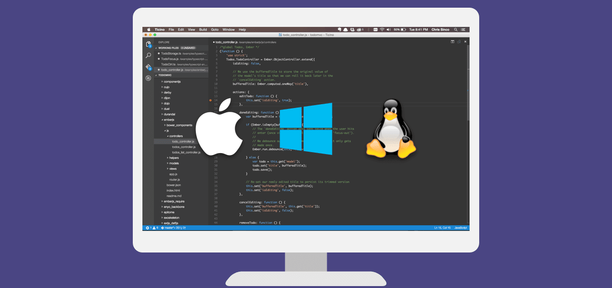

# 왜 Visual Studio Code를 만들었나요? {#why-did-we-build-visual-studio-code}

Visual Studio Code는 소스 코드 편집기의 단순함과 IntelliSense 코드 완성 및 디버깅과 같은 강력한 개발자 도구를 결합합니다.

무엇보다도, 이 편집기는 여러분의 작업을 방해하지 않습니다. 즐겁고 마찰 없는 편집-빌드-디버그 사이클은 환경을 조정하는 데 소요되는 시간을 줄이고, 아이디어를 실행하는 데 더 많은 시간을 할애할 수 있게 합니다.

## macOS, Linux 및 Windows에서 사용 가능 {#available-for-macos-linux-and-windows}

Visual Studio Code는 macOS, Linux 및 Windows를 지원하므로, 어떤 플랫폼에서든 즉시 작업을 시작할 수 있습니다.

## 손쉽게 편집, 빌드 및 디버깅 {#edit-build-and-debug-with-ease}

Visual Studio Code의 핵심은 일상적인 사용에 적합한 번개처럼 빠른 소스 코드 편집기입니다. 수백 가지 언어를 지원하는 VS Code는 구문 강조, 괄호 일치, 자동 들여쓰기, 박스 선택, 스니펫 등으로 즉시 생산성을 높여줍니다. 직관적인 키보드 단축키, 쉬운 사용자 정의 및 커뮤니티에서 기여한 키보드 단축키 매핑을 통해 코드를 쉽게 탐색할 수 있습니다.

진지한 코딩을 위해서는 단순한 텍스트 블록 이상의 코드 이해가 가능한 도구가 필요합니다. Visual Studio Code는 IntelliSense 코드 완성, 풍부한 의미론적 코드 이해 및 탐색, 코드 리팩토링을 위한 내장 지원을 포함합니다.

코딩이 어려워질 때, 강력한 디버깅 기능이 필요합니다. 디버깅은 종종 개발자들이 더 간소화된 코딩 경험에서 가장 그리워하는 기능 중 하나이므로, 이를 구현했습니다. Visual Studio Code에는 인터랙티브 디버거가 포함되어 있어 소스 코드를 단계별로 실행하고, 변수를 검사하며, 호출 스택을 보고, 콘솔에서 명령을 실행할 수 있습니다.

VS Code는 또한 빌드 및 스크립팅 도구와 통합되어 일반 작업을 수행하여 일상적인 워크플로우를 더 빠르게 만듭니다. VS Code는 Git을 지원하므로 편집기를 떠나지 않고도 소스 제어 작업을 수행할 수 있으며, 보류 중인 변경 사항의 차이를 확인할 수 있습니다.

## 나만의 스타일로 꾸미기 {#make-it-your-own}

모든 기능을 원하는 대로 사용자 정의하고, 수많은 서드파티 확장을 설치할 수 있습니다. 대부분의 시나리오는 별도의 구성 없이 "즉시 사용 가능"하지만, VS Code는 여러분과 함께 성장하며, 여러분의 고유한 요구에 맞게 경험을 최적화하도록 권장합니다. VS Code는 오픈 소스 프로젝트이므로 GitHub에서 성장하고 활기찬 커뮤니티에 기여할 수도 있습니다.

## 웹을 위한 사랑으로 만들어짐 {#built-with-love-for-the-web}

VS Code는 JavaScript 및 TypeScript로 Node.js 개발을 위한 풍부한 내장 지원을 포함하고 있으며, 이는 Visual Studio를 구동하는 동일한 기본 기술에 의해 지원됩니다. VS Code는 JSX/React, HTML, CSS, SCSS, Less 및 JSON과 같은 웹 기술을 위한 훌륭한 도구도 포함하고 있습니다.

## 강력하고 확장 가능한 아키텍처 {#robust-and-extensible-architecture}

아키텍처적으로 Visual Studio Code는 웹, 네이티브 및 언어별 기술의 장점을 결합합니다. [Electron](https://github.com/electron/electron)을 사용하여 VS Code는 JavaScript 및 Node.js와 같은 웹 기술을 네이티브 앱의 속도와 유연성과 결합합니다. VS Code는 "Monaco" 클라우드 편집기, Internet Explorer의 F12 도구 및 기타 프로젝트를 지원하는 산업 강도의 HTML 기반 편집기의 최신 버전을 사용합니다. 또한, VS Code는 Visual Studio를 구동하는 많은 동일한 기술과 통합할 수 있는 도구 서비스 아키텍처를 사용하며, 여기에는 .NET, TypeScript, Visual Studio 디버깅 엔진 등을 위한 Roslyn이 포함됩니다.

Visual Studio Code는 개발자가 확장을 구축하고 사용할 수 있도록 하는 공개 확장성 모델을 포함하고 있으며, 편집-빌드-디버그 경험을 풍부하게 사용자 정의할 수 있습니다.

## 준비, 시작, 코드 작성! {#ready-set-code}

코드 편집기 중심의 개발 도구를 선호하거나 크로스 플랫폼 웹 및 클라우드 애플리케이션을 구축하고 있다면, Visual Studio Code를 사용해 보시고 여러분의 의견을 알려주십시오!

## 다음 단계 {#next-steps}

다음 내용을 읽어보세요:

* [Visual Studio Code 사용자 인터페이스](/docs/getstarted/userinterface.md) - VS Code에 대한 간단한 안내입니다.
* [소개 비디오](/docs/getstarted/introvideos.md) - VS Code 편집기 기능에 대해 알아보세요.
* [디버깅](/docs/editor/debugging.md) - 이제 정말 재미있는 부분입니다 - 중단, 단계별 실행, 감시.