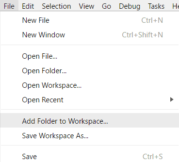
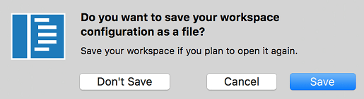
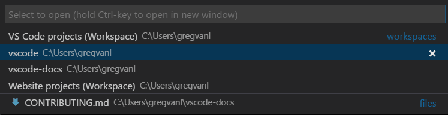
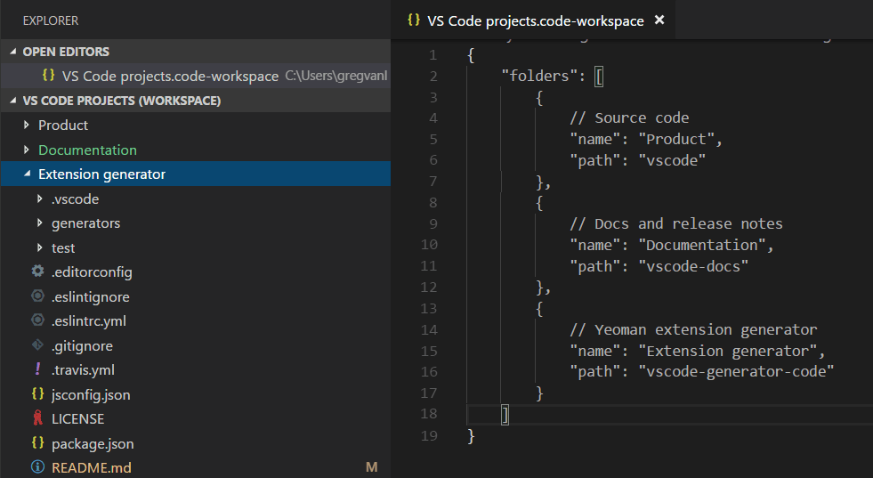
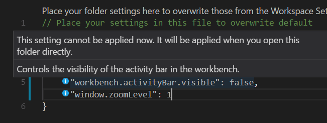
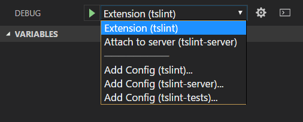
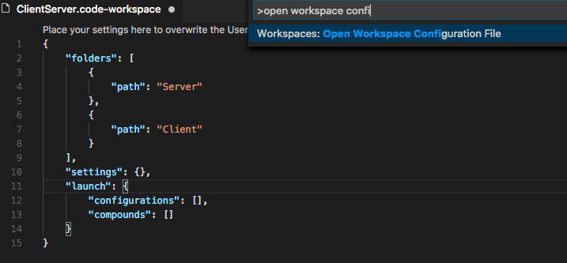
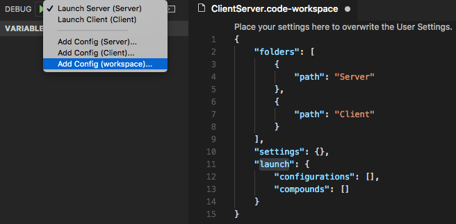
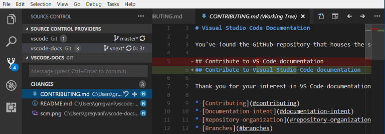

# 다중 루트 작업 공간 {#multi-root-workspaces}

Visual Studio Code에서 다중 루트 작업 공간을 사용하여 여러 프로젝트 폴더로 작업할 수 있습니다. 이는 여러 관련 프로젝트를 동시에 작업할 때 유용합니다. 예를 들어, 제품 소스 코드를 업데이트할 때 최신 상태로 유지하고 싶은 제품 문서가 포함된 리포지토리가 있을 수 있습니다.


> **참고**: VS Code의 "작업 공간" 개념에 대해 더 알고 싶다면 [VS Code "작업 공간"이란?](/docs/editor/workspaces/workspaces.md)를 검토할 수 있습니다. 다중 루트 작업 공간을 명시적으로 생성하지 않는 한, "작업 공간"은 단지 프로젝트의 단일 루트 폴더입니다.

## 폴더 추가하기 {#adding-folders}

기존 작업 공간에 다른 폴더를 추가하는 것은 쉽습니다. 폴더를 추가하는 여러 방법이 있습니다:

### 작업 공간에 폴더 추가하기 {#add-folder-to-workspace}

**파일** > **작업 공간에 폴더 추가** 명령을 사용하면 새 폴더를 선택할 수 있는 폴더 열기 대화 상자가 나타납니다.



루트 폴더가 추가되면 탐색기에서 파일 탐색기의 루트로 새 폴더가 표시됩니다. 루트 폴더 중 하나를 마우스 오른쪽 버튼으로 클릭하고 컨텍스트 메뉴를 사용하여 폴더를 추가하거나 제거할 수 있습니다.


파일 탐색기는 이전과 같이 작동하고 동작해야 합니다. 루트 폴더 간에 파일을 이동할 수 있으며, 컨텍스트 메뉴와 탐색기 보기에서 제공되는 일반적인 파일 작업을 사용할 수 있습니다.

`setting(files.exclude)`와 같은 설정은 구성된 경우 각 루트 폴더에 대해 지원되며, 전역 사용자 설정으로 구성된 경우 모든 폴더에 걸쳐 지원됩니다.

### 드래그 앤 드롭 {#drag-and-drop}

드래그 앤 드롭을 사용하여 작업 공간에 폴더를 추가할 수 있습니다. 폴더를 파일 탐색기로 드래그하여 현재 작업 공간에 추가합니다. 여러 폴더를 선택하고 드래그할 수도 있습니다.

> **참고**: VS Code의 편집기 영역에 단일 폴더를 드롭하면 여전히 단일 폴더 모드로 폴더가 열립니다. 여러 폴더를 편집기 영역에 드래그 앤 드롭하면 새로운 다중 루트 작업 공간이 생성됩니다.

드래그 앤 드롭을 사용하여 작업 공간에서 폴더의 순서를 변경할 수도 있습니다.

### 다중 선택 네이티브 파일 열기 대화 상자 {#multiple-selection-native-file-open-dialogs}

플랫폼의 네이티브 파일 열기 대화 상자를 사용하여 여러 폴더를 열면 다중 루트 작업 공간이 생성됩니다.

### 명령줄 --add {#command-line---add}

다중 루트 작업 공간을 위해 마지막으로 활성화된 VS Code 인스턴스에 폴더 또는 여러 폴더를 추가합니다.

```bash
  code --add vscode vscode-docs
```

### 폴더 제거하기 {#removing-folders}

**작업 공간에서 폴더 제거** 컨텍스트 메뉴 명령을 사용하여 작업 공간에서 폴더를 제거할 수 있습니다.

## 작업 공간 파일 {#workspace-file}

여러 폴더를 추가하면 처음에는 **제목 없음 작업 공간**이라는 제목의 작업 공간에 배치되며, 이 이름은 작업 공간을 저장할 때까지 유지됩니다. 작업 공간을 영구 위치에 두고 싶을 때까지 저장할 필요는 없습니다. 예를 들어, 바탕 화면에 저장할 수 있습니다. 제목이 없는 작업 공간은 사용 중인 VS Code 인스턴스가 열려 있는 한 존재합니다. 제목이 없는 작업 공간이 있는 인스턴스를 완전히 닫으면, 나중에 다시 열 계획이 있다면 저장하라는 메시지가 표시됩니다:



작업 공간을 저장하면 `.code-workspace` 파일이 생성되며, 파일 이름은 파일 탐색기에 표시됩니다.

### 작업 공간으로 저장... {#save-workspace-as}

작업 공간 파일을 새 위치로 이동하려면 **파일** > **작업 공간으로 저장** 명령을 사용하면, 새 작업 공간 파일 위치에 상대적인 올바른 폴더 경로가 자동으로 설정됩니다.

### 작업 공간 파일 열기 {#opening-workspace-files}

작업 공간을 다시 열려면 다음 방법을 사용할 수 있습니다:

- 플랫폼의 탐색기에서 `.code-workspace` 파일을 두 번 클릭합니다.
- **파일** > **작업 공간 열기** 명령을 사용하고 작업 공간 파일을 선택합니다.
- **파일** > **최근 열기** (`kb(workbench.action.openRecent)`) 목록에서 작업 공간을 선택합니다.
  - 작업 공간은 폴더와 구별하기 위해 **(작업 공간)** 접미사가 붙습니다.



VS Code에서 단일 폴더가 열려 있을 때 **폴더 닫기**와 유사하게, 활성 작업 공간을 닫기 위한 **작업 공간 닫기** (`kb(workbench.action.closeFolder)`) 명령이 있습니다.

### 작업 공간 파일 스키마 {#workspace-file-schema}

`.code-workspace`의 스키마는 상당히 간단합니다. 절대 경로 또는 상대 경로로 폴더 배열이 있습니다. 상대 경로는 작업 공간 파일을 공유할 때 더 좋습니다.

탐색기에서 폴더에 더 의미 있는 이름을 부여하기 위해 `name` 속성으로 폴더의 표시 이름을 재정의할 수 있습니다. 예를 들어, 프로젝트 폴더의 이름을 '제품'과 '문서'로 지정하여 폴더 이름으로 콘텐츠를 쉽게 식별할 수 있습니다:

```json
{
  "folders": [
    {
      // 소스 코드
      "name": "Product",
      "path": "vscode"
    },
    {
      // 문서 및 릴리스 노트
      "name": "Documentation",
      "path": "vscode-docs"
    },
    {
      // Yeoman 확장 생성기
      "name": "Extension generator",
      "path": "vscode-generator-code"
    }
  ]
}
```

이렇게 하면 탐색기에서 다음과 같이 표시됩니다:



위의 예에서 볼 수 있듯이, 작업 공간 파일에 주석을 추가할 수 있습니다.

작업 공간 파일은 `settings` 아래에 작업 공간 [전역 설정](#settings)을 포함할 수 있으며, `extensions` 아래에 [확장 추천](#extensions)을 포함할 수 있습니다. 이에 대해서는 아래에서 논의하겠습니다.


## 일반 UI {#general-ui}

### 편집기 {#editor}

다중 루트 작업 공간을 사용할 때 VS Code UI에는 몇 가지 변경 사항이 있으며, 주로 폴더 간 파일을 구별하기 위한 것입니다. 예를 들어, 여러 폴더의 파일 간에 이름 충돌이 발생하면 VS Code는 탭 헤더에 폴더 이름을 포함합니다.


탭 헤더에 항상 폴더가 표시되도록 하려면 `setting(workbench.editor.labelFormat)` [설정](/docs/editor/settings.md)에서 "medium" 또는 "long" 값을 사용하여 폴더 또는 전체 경로를 표시할 수 있습니다.

```json
"workbench.editor.labelFormat": "medium"
```

VS Code UI의 **열린 편집기** 및 **빠른 열기** (`kb(workbench.action.quickOpen)`) 목록에는 폴더 이름이 포함됩니다.


[파일 아이콘 테마](/docs/editor/themes.md#file-icon-themes)를 사용하고 활성 테마가 이를 지원하는 경우, 특별한 작업 공간 아이콘을 볼 수 있습니다.

아래는 내장된 **Minimal (Visual Studio Code)** 파일 아이콘 테마의 작업 공간 아이콘입니다:


### 검색 {#search}

VS Code의 전역 검색과 같은 기능은 모든 폴더에서 작동하며 검색 결과를 폴더별로 그룹화합니다.


다중 루트 작업 공간이 열려 있을 때, **포함할 파일** 상자에 `./` 구문을 사용하여 단일 루트 폴더에서 검색할 수 있습니다. 예를 들어, `./project1/**/*.txt`를 입력하면 `project1/` 루트 폴더 아래의 모든 `.txt` 파일을 검색합니다.

## 설정 {#settings}

하나의 작업 공간에 여러 루트 폴더가 있는 경우, 각 루트 폴더에 대해 해당 폴더에 적용될 설정을 정의하는 `.vscode` 폴더를 가질 수 있습니다. 설정 충돌을 피하기 위해, 다중 루트 작업 공간을 사용할 때는 리소스(파일, 폴더) 설정만 적용됩니다. 전체 편집기에 영향을 미치는 설정(예: UI 레이아웃)은 무시됩니다. 예를 들어, 두 프로젝트가 모두 확대/축소 수준을 설정할 수는 없습니다.

사용자 설정은 단일 폴더 프로젝트와 마찬가지로 지원되며, 다중 루트 작업 공간의 모든 폴더에 적용될 전역 작업 공간 설정도 설정할 수 있습니다. 전역 작업 공간 설정은 `.code-workspace` 파일에 저장됩니다.

```json
{
  "folders": [
    {
      "path": "vscode"
    },
    {
      "path": "vscode-docs"
    },
    {
      "path": "vscode-generator-code"
    }
  ],
  "settings": {
    "window.zoomLevel": 1,
    "files.autoSave": "afterDelay"
  }
}
```

단일 폴더 인스턴스에서 여러 폴더로 이동할 때, VS Code는 첫 번째 폴더에서 적절한 편집기 전역 설정을 새로운 전역 작업 공간 설정에 추가합니다.

설정 편집기를 통해 다양한 설정 파일을 쉽게 검토하고 수정할 수 있습니다. 설정 편집기 탭을 사용하여 사용자 설정, 전역 작업 공간 설정 및 개별 폴더 설정을 선택할 수 있습니다.


다음 명령을 사용하여 특정 설정 파일을 열 수도 있습니다:

- **환경 설정: 사용자 설정 열기** - 전역 사용자 설정을 엽니다.
- **환경 설정: 작업 공간 설정 열기** - 작업 공간 파일의 설정 섹션을 엽니다.
- **환경 설정: 폴더 설정 열기** - 활성 폴더의 설정을 엽니다.

전역 작업 공간 설정은 사용자 설정을 덮어쓰며, 폴더 설정은 작업 공간 또는 사용자 설정을 덮어쓸 수 있습니다.

### 지원되지 않는 폴더 설정 {#unsupported-folder-settings}

지원되지 않는 편집기 전역 폴더 설정은 폴더 설정에서 회색으로 표시되며 **기본 폴더 설정** 목록에서 필터링됩니다. 설정 앞에는 정보 아이콘도 표시됩니다.



## 디버깅 {#debugging}

다중 루트 작업 공간을 사용하면 VS Code는 모든 폴더에서 `launch.json` 디버그 구성 파일을 검색하고 폴더 이름을 접미사로 표시합니다. 또한 VS Code는 작업 공간 구성 파일에 정의된 실행 구성도 표시합니다.



위의 예는 [TSLint 확장](https://marketplace.visualstudio.com/items?itemName=eg2.tslint)의 디버깅 구성을 보여줍니다. `tslint` 확장 폴더에서 VS Code 확장 호스트에서 확장을 실행하기 위한 `setting(launch)` 구성과 `tslint-server` 폴더에서 실행 중인 TSLint 서버에 디버거를 연결하기 위한 `attach` 구성이 있습니다.

또한 `tslint`, `tslint-server`, `tslint-tests` 폴더에 대한 세 개의 **구성 추가** 명령을 vscode-tslint [작업 공간](https://github.com/microsoft/vscode-tslint/blob/main/vscode-tslint.code-workspace)에서 볼 수 있습니다. **구성 추가** 명령은 폴더의 `.vscode` 하위 폴더에 있는 기존 `launch.json` 파일을 열거나 새 파일을 생성하고 디버깅 구성 템플릿 드롭다운을 표시합니다.


구성에서 사용되는 [변수](/docs/reference/variables-reference.md) (예: `$\{workspaceFolder\}` 또는 이제 더 이상 사용되지 않는 `$\{workspaceRoot\}`)는 해당 폴더에 상대적으로 해결됩니다. 변수에 루트 폴더의 이름을 추가하여 작업 공간 폴더별로 변수를 범위 지정할 수 있습니다(콜론으로 구분).

### 작업 공간 실행 구성 {#workspace-launch-configurations}

작업 공간 범위의 실행 구성은 작업 공간 구성 파일의 `"launch"` 섹션에 존재합니다 (**작업 공간: 작업 공간 구성 파일 열기** 명령 팔레트에서):



또는 실행 구성 드롭다운 메뉴의 "구성 추가(작업 공간)" 항목을 통해 새로운 실행 구성을 추가할 수 있습니다:



복합 실행 구성은 이름이 작업 공간 내에서 고유한 한 개별 실행 구성을 참조할 수 있습니다. 예를 들어:

```json
  "compounds": [{
      "name": "서버 및 클라이언트 실행",
      "configurations": [
        "서버 실행",
        "클라이언트 실행"
      ]
  }]
```

개별 실행 구성 이름이 고유하지 않은 경우, 자격이 있는 폴더를 더 자세한 "폴더" 구문으로 지정할 수 있습니다:

```json
  "compounds": [{
      "name": "서버 및 클라이언트 실행",
      "configurations": [
        "서버 실행",
        {
          "folder": "웹 클라이언트",
          "name": "클라이언트 실행"
        },
        {
          "folder": "데스크톱 클라이언트",
          "name": "클라이언트 실행"
        }
      ]
  }]
```

`compounds` 외에도 작업 공간 구성 파일의 `setting(launch)` 섹션에는 일반 실행 구성도 포함될 수 있습니다. 사용되는 모든 변수가 특정 폴더에 명시적으로 범위 지정되어 있는지 확인해야 합니다. 그렇지 않으면 작업 공간에 대해 유효하지 않습니다. 명시적으로 범위 지정된 변수에 대한 자세한 내용은 [변수 참조](/docs/reference/variables-reference.md#variables-scoped-per-workspace-folder)에서 확인할 수 있습니다.

프로그램이 "Program" 폴더에 있고 "Library" 폴더의 모든 파일을 스텝할 때 건너뛰어야 하는 실행 구성의 예는 다음과 같습니다:

```json
"launch": {
  "configurations": [{
      "type": "node",
      "request": "launch",
      "name": "테스트 실행",
      "program": "$\{workspaceFolder:Program\}
/test.js",
      "skipFiles": [
        "$\{workspaceFolder:Library\}
/out/**/*.js"
      ]
  }]
}
```

## 작업 {#tasks}

VS Code가 디버깅 구성을 검색하는 방식과 유사하게, VS Code는 작업 공간의 모든 폴더에서 gulp, grunt, npm 및 TypeScript 프로젝트 파일에서 작업을 자동으로 감지하려고 시도하며, `tasks.json` 파일에 정의된 작업도 검색합니다. 작업의 위치는 폴더 이름 접미사로 표시됩니다. `tasks.json`에 정의된 작업은 버전 2.0.0이어야 합니다.


위의 TSLint 확장 [작업 공간](https://github.com/microsoft/vscode-tslint/blob/main/vscode-tslint.code-workspace) 예에서 볼 수 있듯이, `tslint` 및 `tslint-tests` 폴더의 `tasks.json` 파일에서 두 개의 **구성된 작업**과 여러 개의 자동 감지된 npm 및 TypeScript 컴파일러 **감지된 작업**이 있습니다.

### 작업 공간 작업 구성 {#workspace-task-configuration}

작업 공간 범위의 작업은 작업 공간 구성 파일의 `"tasks"` 섹션에 존재합니다 (**작업 공간: 작업 공간 구성 파일 열기** 명령 팔레트에서). 오직 `"shell"` 및 `"process"` 유형의 작업만 작업 공간 구성 파일에 정의될 수 있습니다.

## 소스 제어 {#source-control}

다중 루트 작업 공간에서는 여러 활성 리포지토리가 있을 때 개요를 제공하는 **소스 제어 제공자** 섹션이 있습니다. 이는 여러 SCM 제공자가 기여할 수 있습니다. 예를 들어, Git 리포지토리를 Azure DevOps Server 작업 공간과 나란히 가질 수 있습니다. 이 뷰에서 리포지토리를 선택하면 아래에 소스 제어 세부정보가 표시됩니다.



`kbstyle(Ctrl+Click)` 또는 `kbstyle(Shift+Click)`를 사용하여 여러 리포지토리를 선택할 수 있습니다. 그들의 세부정보는 아래에 별도의 영역으로 나타납니다.

## 확장 {#extensions}

확장 작성자라면, VS Code 다중 루트 작업 공간 API에 대해 배우고 확장이 여러 폴더에서 잘 작동하도록 만드는 방법을 알아보려면 [다중 루트 작업 공간 API 채택](https://github.com/microsoft/vscode/wiki/Adopting-Multi-Root-Workspace-APIs) 가이드를 검토할 수 있습니다.

다음은 다중 루트 작업 공간 API를 채택한 인기 있는 확장 중 일부입니다.

<div class="marketplace-extensions-multi-root-ready"></div>

**참고**: 확장이 아직 여러 폴더를 지원하지 않는 경우, 다중 루트 작업 공간의 첫 번째 폴더에서 여전히 작동합니다.

### 확장 추천 {#extension-recommendations}

VS Code는 폴더의 `.vscode` 하위 폴더에 있는 `extensions.json` 파일을 통해 폴더 수준의 확장 추천을 지원합니다. `.code-workspace` 파일에 추가하여 전역 작업 공간 확장 추천을 제공할 수도 있습니다. **확장: 추천 확장 구성(작업 공간 폴더)** 명령을 사용하여 작업 공간 파일을 열고 `extensions.recommendations` 배열에 확장 식별자(\{publisherName\}.\{extensionName\})를 추가할 수 있습니다.

```json
{
  "folders": [
    {
      "path": "vscode"
    },
    {
      "path": "vscode-docs"
    }
  ],
  "extensions": {
    "recommendations": [
      "eg2.tslint",
      "dbaeumer.vscode-eslint",
      "esbenp.prettier-vscode"
    ]
  }
}
```

## 다음 단계 {#next-steps}

- [VS Code "작업 공간"이란?](/docs/editor/workspaces/workspaces.md) - 단일 폴더 및 다중 루트 작업 공간에 대한 자세한 내용.
- [디버깅](/docs/editor/debugging.md) - 애플리케이션의 디버깅을 설정하는 방법을 알아보세요.
- [작업](/docs/editor/tasks.md) - 작업을 통해 VS Code 내에서 컴파일러와 같은 외부 도구를 실행할 수 있습니다.

## 자주 묻는 질문 {#common-questions}

### 단일 프로젝트 폴더로 돌아가려면 어떻게 해야 하나요? {#how-can-i-go-back-to-working-with-a-single-project-folder}

작업 공간을 닫고 폴더를 직접 열거나 작업 공간에서 폴더를 제거할 수 있습니다.

### 확장 작성자로서 무엇을 해야 하나요? {#as-an-extension-author-what-do-i-need-to-do}

[다중 루트 작업 공간 API 채택](https://github.com/microsoft/vscode/wiki/Adopting-Multi-Root-Workspace-APIs) 가이드를 참조하세요. 대부분의 확장은 다중 루트 작업 공간을 쉽게 지원할 수 있습니다.