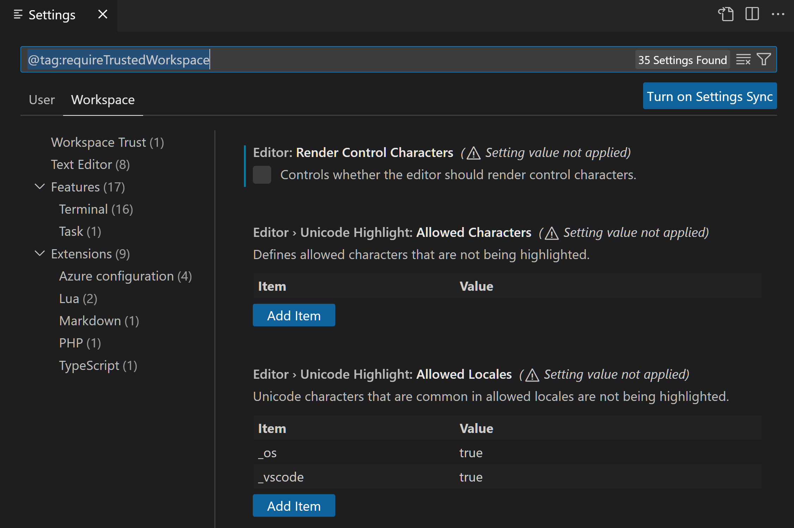
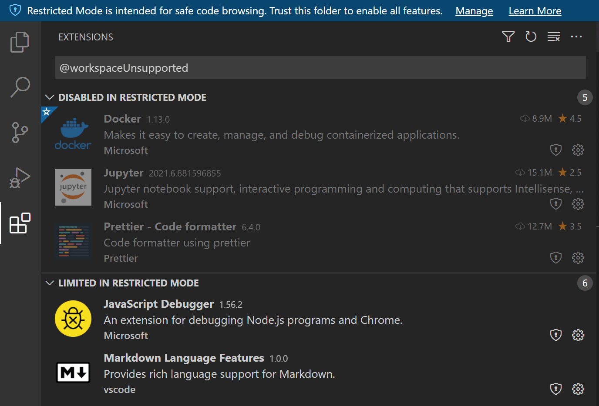
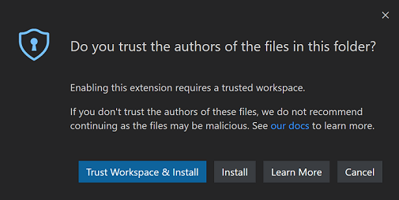

# 작업 공간 신뢰 {#workspace-trust}

Visual Studio Code는 보안을 중요하게 생각하며, 소스나 원래 저자에 관계없이 안전하게 코드를 탐색하고 편집할 수 있도록 도와주고자 합니다. 작업 공간 신뢰 기능을 통해 프로젝트 폴더의 코드가 VS Code와 확장 프로그램에 의해 명시적인 승인 없이 실행될 수 있는지를 결정할 수 있습니다.


>**참고**: 의심스러운 경우, 폴더를 [제한 모드](#restricted-mode)로 두십시오. 나중에 항상 [신뢰를 활성화](#trusting-a-workspace)할 수 있습니다.

## 안전한 코드 탐색 {#safe-code-browsing}

공개 저장소와 파일 공유에서 많은 소스 코드가 제공되는 것은 훌륭한 일입니다. 코딩 작업이나 문제에 관계없이, 아마도 이미 좋은 해결책이 어딘가에 있을 것입니다. 또한, 코드를 이해하고 디버깅하며 최적화하는 데 도움을 주는 강력한 코딩 도구가 많이 있다는 것도 좋습니다. 그러나 오픈 소스 코드와 도구를 사용하는 데는 위험이 있으며, 악성 코드 실행 및 악용에 노출될 수 있습니다.

작업 공간 신뢰는 익숙하지 않은 코드로 작업할 때 추가적인 보안 계층을 제공하여, 작업 공간이 "제한 모드"로 열려 있을 경우 작업 공간의 코드가 자동으로 실행되는 것을 방지합니다.

> **참고**: "작업 공간"과 "폴더"라는 용어는 VS Code UI 및 문서에서 널리 사용됩니다. ["작업 공간"](/docs/editor/workspaces/workspaces.md)를 VS Code에서 생성하고 사용하는 추가 메타데이터가 있는 폴더로 생각할 수 있습니다.

## 제한 모드 {#restricted-mode}

작업 공간 신뢰 대화상자에서 **아니요, 저자는 신뢰하지 않습니다**를 선택하면, VS Code는 코드 실행을 방지하기 위해 제한 모드로 전환됩니다.

작업대는 상단에 배너를 표시하며, 작업 공간 신뢰 편집기를 통해 폴더를 **관리**하는 링크가 포함되어 있습니다. 상태 표시줄에서는 작업 공간이 제한 모드에 있음을 나타내는 배지를 볼 수 있습니다.


제한 모드는 여러 VS Code 기능(작업, 디버깅, 작업 공간 설정 및 확장 프로그램)의 작동을 비활성화하거나 제한하여 자동 코드 실행을 방지하려고 합니다.

제한 모드에서 비활성화된 기능의 전체 목록을 보려면, 배너의 **관리** 링크를 통해 작업 공간 신뢰 편집기를 열거나 상태 표시줄에서 제한 모드 배지를 선택할 수 있습니다.


> **중요**: 작업 공간 신뢰는 악성 확장이 코드를 실행하고 **제한 모드**를 무시하는 것을 방지할 수 없습니다. 신뢰할 수 있는 잘 알려진 출처의 확장만 설치하고 실행해야 합니다.

### 작업 {#tasks}

VS Code [작업](/docs/editor/tasks.md)은 스크립트 및 도구 바이너리를 실행할 수 있습니다. 작업 정의는 작업 공간의 `.vscode` 폴더에 정의되므로, 이는 리포지토리의 커밋된 소스 코드의 일부이며, 해당 리포지토리의 모든 사용자와 공유됩니다. 누군가 악성 작업을 생성하면, 해당 리포지토리를 클론한 누구든지 무의식적으로 실행할 수 있습니다.

제한 모드에서 작업을 실행하거나 나열하려고 하면 (**작업** > **작업 실행**), VS Code는 폴더를 신뢰하고 작업을 계속 실행할 수 있는지 확인하는 프롬프트를 표시합니다. 대화상자를 취소하면 VS Code는 제한 모드에 남아 있습니다.


### 디버깅 {#debugging}

VS Code 작업을 실행하는 것과 유사하게, 디버그 확장은 디버그 세션을 시작할 때 디버거 바이너리를 실행할 수 있습니다. 이러한 이유로, 폴더가 제한 모드로 열려 있을 때 [디버깅](/docs/editor/debugging.md)도 비활성화됩니다.

제한 모드에서 디버그 세션을 시작하려고 하면 (**디버그** > **디버깅 시작**), VS Code는 폴더를 신뢰하고 디버거를 계속 시작할 수 있는지 확인하는 프롬프트를 표시합니다. 대화상자를 취소하면 VS Code는 제한 모드에 남아 있으며, 디버그 세션을 시작하지 않습니다.


### 작업 공간 설정 {#workspace-settings}

작업 공간 [설정](/docs/editor/settings.md)은 작업 공간의 루트에 있는 `.vscode` 폴더에 저장되며, 따라서 작업 공간 리포지토리를 클론하는 모든 사용자와 공유됩니다. 일부 설정은 실행 파일(예: 린터 바이너리)에 대한 경로를 포함하고 있으며, 악성 코드로 설정될 경우 손상을 초래할 수 있습니다. 이러한 이유로, VS Code는 제한 모드에서 실행될 때 일련의 작업 공간 설정을 비활성화합니다.


작업 공간 신뢰 편집기에서 적용되지 않는 작업 공간 설정 링크를 선택하면 `@tag:requireTrustedWorkspace` 태그로 범위가 지정된 설정 편집기가 열립니다.



### 확장 프로그램 {#extensions}

VS Code [확장 프로그램](/docs/editor/extension-marketplace.md) 생태계는 매우 풍부하고 다양합니다. 사람들은 거의 모든 프로그래밍 작업이나 편집기 사용자 지정을 돕기 위해 확장 프로그램을 만들었습니다. 일부 확장 프로그램은 전체 프로그래밍 언어 지원(인텔리센스, 디버깅, 코드 분석)을 제공하며, 다른 확장 프로그램은 음악을 재생하거나 가상 [애완동물](https://marketplace.visualstudio.com/items?itemName=tonybaloney.vscode-pets)을 제공합니다.

대부분의 확장 프로그램은 사용자를 대신하여 코드를 실행하며, 잠재적으로 해를 끼칠 수 있습니다. 일부 확장 프로그램은 예상치 못한 실행 파일을 실행하도록 구성될 경우 악의적으로 작동할 수 있는 설정을 가지고 있습니다. 이러한 이유로, 작업 공간 신뢰에 명시적으로 동의하지 않은 확장 프로그램은 기본적으로 제한 모드에서 비활성화됩니다.


설치된 확장 프로그램의 상태를 검토하려면 작업 공간 신뢰 편집기에서 **확장 프로그램이 비활성화되었거나 기능이 제한됨** 링크를 선택하면 `@workspaceUnsupported` 필터로 범위가 지정된 확장 프로그램 뷰가 표시됩니다.



작업 공간 신뢰에 동의하지 않은 확장 프로그램은 제한 모드에서 비활성화되거나 제한될 수 있습니다.

**제한 모드에서 비활성화됨**

제한 모드에서 실행을 지원한다고 명시적으로 표시하지 않은 확장 프로그램은 **제한 모드에서 비활성화됨** 섹션에 표시됩니다. 확장 프로그램 저자는 자신의 확장이 작업 공간의 수정(설정 또는 파일)에 의해 악용될 수 있다고 판단할 경우, 제한 모드에서 활성화되지 않기를 원한다고 표시할 수 있습니다.

**제한 모드에서 제한됨**

확장 프로그램 저자는 자신의 확장 프로그램을 보안 취약점에 대해 평가하고 제한 모드에서 실행할 때 **제한된** 지원을 선언할 수 있습니다. 이 모드는 확장 프로그램이 가능한 악용을 방지하기 위해 일부 기능이나 기능을 비활성화할 수 있음을 의미합니다.

확장 프로그램은 확장 프로그램 뷰에서 작업 공간 신뢰 배지에 사용자 정의 텍스트를 추가하여 신뢰할 수 없는 폴더에서 실행할 때의 제한 사항을 설명할 수 있습니다. 예를 들어, VS Code 내장 PHP 확장은 이 설정을 재정의하면 악성 프로그램을 실행할 수 있으므로 `setting(php.validate.executablePath)` 설정의 사용을 신뢰할 수 있는 폴더로 제한합니다.


확장 프로그램의 작업 공간 신뢰 지원 수준을 `setting(extensions.supportUntrustedWorkspaces)` 설정을 사용하여 재정의할 수 있으며, 이는 아래 [확장 프로그램 활성화](#enabling-extensions) 섹션에 설명되어 있습니다.

제한 모드에서 확장 프로그램을 설치하려고 하면 작업 공간을 신뢰하거나 확장 프로그램만 설치하라는 프롬프트가 표시됩니다. 확장 프로그램이 작업 공간 신뢰를 지원하지 않으면 설치되지만 비활성화되거나 기능이 제한된 상태로 실행됩니다.



> **참고**: 확장 프로그램 저자는 [작업 공간 신뢰 확장 프로그램 가이드](/api/extension-guides/workspace-trust.md)를 읽어 확장 프로그램을 업데이트하여 작업 공간 신뢰를 지원하는 방법을 배울 수 있습니다.

## 작업 공간 신뢰 {#trusting-a-workspace}

프로젝트의 저자와 유지 관리자를 신뢰하는 경우, 로컬 머신의 프로젝트 폴더를 신뢰할 수 있습니다. 예를 들어, github.com/microsoft 또는 github.com/docker와 같은 잘 알려진 GitHub 조직의 리포지토리를 신뢰하는 것은 일반적으로 안전합니다.

새 폴더를 열면 초기 작업 공간 신뢰 프롬프트가 해당 폴더와 하위 폴더를 신뢰할 수 있도록 해줍니다.


또한 작업 공간 편집기를 열고 **신뢰** 또는 **부모 신뢰** 버튼을 선택하여 폴더의 신뢰 상태를 빠르게 전환할 수 있습니다.


작업 공간 신뢰 편집기 대화상자를 여는 방법은 여러 가지가 있습니다.

제한 모드에서:

* 제한 모드 배너의 **관리** 링크
* 제한 모드 상태 표시줄 항목

언제든지 다음을 사용할 수 있습니다:

* 명령 팔레트에서 **작업 공간: 작업 공간 신뢰 관리** 명령 (`kb(workbench.action.showCommands)`)

## 폴더 선택 {#selecting-folders}

폴더를 신뢰하면 작업 공간 신뢰 편집기에 표시되는 **신뢰된 폴더 및 작업 공간** 목록에 추가됩니다.


이 목록에서 폴더를 수동으로 추가, 편집 및 제거하여 작업 공간 신뢰를 활성화하거나 비활성화할 수 있습니다. 활성 폴더는 이 목록에서 굵게 강조 표시됩니다.

### 부모 폴더 선택 {#selecting-a-parent-folder}

작업 공간 신뢰 편집기를 통해 폴더를 신뢰할 때, 부모 폴더도 신뢰할 수 있는 옵션이 있습니다. 이는 부모 폴더와 모든 하위 폴더에 신뢰를 적용합니다.


부모 폴더를 신뢰하는 것은 신뢰할 수 있는 콘텐츠가 많은 여러 폴더가 하나의 폴더 아래에 위치할 경우 유용할 수 있습니다.

신뢰된 부모 아래의 하위 폴더를 열면 일반적인 **신뢰하지 않음** 버튼이 표시되지 않습니다. 대신, 다른 폴더 덕분에 폴더가 신뢰된다는 텍스트가 표시됩니다.

**신뢰된 폴더 및 작업 공간** 목록에서 부모 폴더 항목을 추가, 수정 및 제거할 수 있습니다.

### 폴더 구성 {#folder-configurations}

부모 폴더를 신뢰하면 모든 하위 폴더가 신뢰되며, 이를 통해 리포지토리의 디스크 위치를 통해 작업 공간 신뢰를 제어할 수 있습니다.

예를 들어, 모든 신뢰된 리포지토리를 "TrustedRepos" 부모 폴더 아래에 두고, 익숙하지 않은 리포지토리는 "ForEvaluation"과 같은 다른 부모 폴더 아래에 둘 수 있습니다. "TrustedRepos" 폴더를 신뢰하고, "ForEvaluation" 아래의 폴더를 선택적으로 신뢰할 수 있습니다.

```text
├── TrustedRepos - 이 부모 폴더 아래에 신뢰된 리포지토리 클론
└── ForEvaluation - 이 부모 폴더 아래에 실험적이거나 익숙하지 않은 리포지토리 클론
```

조직별 부모 폴더 아래에 리포지토리를 그룹화하고 신뢰를 설정할 수도 있습니다.

```text
├── github/microsoft - 이 부모 폴더 아래에 특정 조직의 리포지토리 클론
├── github/{myforks} - 이 부모 폴더 아래에 포크한 리포지토리 배치
└── local - 로컬 비공식 리포지토리
```

## 확장 프로그램 활성화 {#enabling-extensions}

제한 모드를 사용하고 싶지만 좋아하는 확장 프로그램이 작업 공간 신뢰를 지원하지 않는 경우 어떻게 됩니까? 유용하고 기능적이지만 적극적으로 유지 관리되지 않거나 작업 공간 신뢰 지원을 선언하지 않은 확장 프로그램이 있을 수 있습니다. 이 시나리오를 처리하기 위해, `setting(extensions.supportUntrustedWorkspaces)` 설정을 사용하여 확장 프로그램의 신뢰 상태를 재정의할 수 있습니다.

> **중요**: 확장 프로그램의 작업 공간 신뢰 지원을 재정의할 때 주의하십시오. 확장 프로그램 저자가 제한 모드에서 확장을 비활성화하는 데 좋은 이유가 있을 수 있습니다. 의심스러운 경우, 확장 프로그램 저자에게 연락하거나 최근 변경 로그를 검토하여 더 많은 맥락을 얻으십시오.

설정 편집기(`kb(workbench.action.openSettings)`)에서 **확장 프로그램: 신뢰할 수 없는 작업 공간 지원** 설정(`setting(extensions.supportUntrustedWorkspaces)`)을 통해 개별 확장 프로그램의 작업 공간 신뢰를 재정의할 수 있습니다.


**settings.json**에서 확장 프로그램 ID 및 지원 상태와 버전을 관리하기 위해 **settings.json에서 편집** 링크를 선택할 수 있습니다. IntelliSense 제안을 통해 설치된 확장 프로그램 중에서 선택할 수 있습니다.

아래는 Prettier 확장 프로그램에 대한 `settings.json` 항목입니다.

```json
  "extensions.supportUntrustedWorkspaces": {
    "esbenp.prettier-vscode": {
      "supported": true,
      "version": "6.4.0"
    },
  },
```

`supported` 속성을 사용하여 작업 공간 신뢰 지원을 활성화하거나 비활성화할 수 있습니다. `version` 속성은 적용 가능한 정확한 확장 프로그램 버전을 지정하며, 모든 버전에 대한 상태를 설정하려면 버전 필드를 제거할 수 있습니다.

확장 프로그램 저자가 제한 모드에서 어떤 기능을 제한할지를 평가하고 결정하는 방법에 대해 더 알고 싶다면, [작업 공간 신뢰 확장 프로그램 가이드](/api/extension-guides/workspace-trust.md)를 읽을 수 있습니다.

## 신뢰할 수 없는 파일 열기 {#opening-untrusted-files}

신뢰할 수 없는 폴더 외부에 위치한 파일을 열면, VS Code는 해당 파일이 폴더 루트 외부에서 왔음을 감지하고 파일을 계속 열거나 제한 모드에서 새 창으로 열 수 있는 옵션을 제공합니다. 제한 모드에서 여는 것이 가장 안전한 옵션이며, 파일이 신뢰할 수 있는지 확인한 후 원래 VS Code 창에서 파일을 다시 열 수 있습니다.


신뢰할 수 없는 작업 공간 외부에서 파일을 열 때 프롬프트를 표시하지 않으려면 `setting(security.workspace.trust.untrustedFiles)`를 `open`으로 설정할 수 있습니다. 또한 `setting(security.workspace.trust.untrustedFiles)`를 `newWindow`로 설정하여 항상 제한 모드에서 새 창을 생성할 수 있습니다. 신뢰할 수 없는 파일 대화상자에서 **모든 작업 공간에 대한 내 결정을 기억** 옵션을 선택하면 `setting(security.workspace.trust.untrustedFiles)` 사용자 설정에 선택 사항이 적용됩니다.

### 신뢰할 수 없는 폴더 열기 {#opening-untrusted-folders}

여러 폴더가 있는 [다중 루트 작업 공간](/docs/editor/workspaces/multi-root-workspaces.md)에서 작업할 때, 신뢰된 다중 루트 작업 공간에 새 폴더를 추가하려고 하면 해당 폴더의 파일을 신뢰할 것인지 여부를 결정하라는 프롬프트가 표시되며, 그렇지 않으면 전체 작업 공간이 제한 모드로 전환됩니다.


### 빈 창(열려 있는 폴더 없음) {#empty-windows-no-open-folder}

기본적으로, 폴더나 작업 공간을 열지 않고 새 VS Code 창(인스턴스)을 열면 VS Code는 전체 신뢰로 창을 실행합니다. 모든 설치된 확장 프로그램이 활성화되며, 제한 없이 빈 창을 사용할 수 있습니다.

파일을 열면 [신뢰할 수 없는 파일](#opening-untrusted-files)을 열 것인지 여부를 묻는 프롬프트가 표시됩니다. 부모 폴더가 없기 때문입니다.

빈 창을 제한 모드로 전환하려면 작업 공간 신뢰 편집기를 사용하여 (**작업 공간: 작업 공간 신뢰 관리**를 명령 팔레트에서 선택) **신뢰하지 않음**을 선택하면 됩니다. 빈 창은 현재 세션 동안 제한 모드에 남아 있지만, 다시 시작하거나 새 창을 만들면 신뢰된 상태로 돌아갑니다.

모든 빈 창을 제한 모드로 설정하려면 `setting(security.workspace.trust.emptyWindow)`를 `false`로 설정할 수 있습니다.

## 설정 {#settings}

다음은 사용 가능한 작업 공간 신뢰 설정입니다:

* `setting(security.workspace.trust.enabled)` - 작업 공간 신뢰 기능 활성화. 기본값은 true입니다.
* `setting(security.workspace.trust.startupPrompt)` - 시작 시 작업 공간 신뢰 대화상자를 표시할지 여부. 기본값은 각 고유한 폴더 또는 작업 공간당 한 번만 표시합니다.
* `setting(security.workspace.trust.emptyWindow)` - 빈 창(열려 있는 폴더 없음)을 항상 신뢰할지 여부. 기본값은 true입니다.
* `setting(security.workspace.trust.untrustedFiles)` - 작업 공간에서 느슨한 파일을 처리하는 방법을 제어합니다. 기본값은 프롬프트입니다.
* `setting(extensions.supportUntrustedWorkspaces)` - 확장 프로그램 작업 공간 신뢰 선언 재정의. true 또는 false입니다.
* `setting(security.workspace.trust.banner)` - 제한 모드 배너가 표시되는 시점을 제어합니다. 기본값은 `untilDismissed`입니다.

## 명령줄 스위치 {#command-line-switch}

VS Code 명령줄을 통해 `--disable-workspace-trust`를 전달하여 작업 공간 신뢰를 비활성화할 수 있습니다. 이 스위치는 현재 세션에만 영향을 미칩니다.

<!-- ## 특별 구성

### 원격 확장 프로그램 {#remote-extensions}

SSH - 경로는 원격 머신에 상대적입니다.

WSL - 경로는 WSL 인스턴스에 상대적입니다 (/mnt/) (이미 신뢰된 로컬 경로에 매핑될 수 있음)

컨테이너

### 코드 스페이스 (docs/remote/codespaces로 이동?) {#codespaces-move-to-docsremotecodespaces}

경로가 조금 이상함

-->

## 다음 단계 {#next-steps}

자세히 알아보려면:

* [작업 공간 신뢰 확장 프로그램 가이드](/api/extension-guides/workspace-trust.md) - 확장 프로그램 저자가 작업 공간 신뢰를 지원하는 방법을 알아보세요.
* [VS Code "작업 공간"이란?](/docs/editor/workspaces/workspaces.md) - VS Code "작업 공간" 개념에 대한 자세한 내용을 알아보세요.
* [GitHub 리포지토리 확장 프로그램](/docs/sourcecontrol/github.md#github-repositories-extension) - 소스 코드를 로컬 머신에 클론하지 않고 리포지토리에서 직접 작업하세요.

## 자주 묻는 질문 {#common-questions}

### 제한 모드에서 여전히 소스 코드를 편집할 수 있나요? {#can-i-still-edit-my-source-code-in-restricted-mode}

네, 제한 모드에서도 소스 코드를 탐색하고 편집할 수 있습니다. 일부 언어 기능이 비활성화될 수 있지만, 텍스트 편집은 항상 지원됩니다.

### 설치된 확장 프로그램이 어디로 갔나요? {#where-did-my-installed-extensions-go}

제한 모드에서는 작업 공간 신뢰를 지원하지 않는 모든 확장 프로그램이 비활성화되며, 활동 표시줄 아이콘 및 명령과 같은 모든 UI 요소가 표시되지 않습니다.

확장 프로그램의 작업 공간 신뢰 지원 수준을 `setting(extensions.supportUntrustedWorkspaces)` 설정으로 재정의할 수 있지만 주의해서 진행해야 합니다. [확장 프로그램 활성화](#enabling-extensions)에서 더 많은 세부정보를 확인할 수 있습니다.

<!-- 현재 이 재정의가 필요한 인기 있는 확장 프로그램 목록. -->

### 작업 공간 신뢰 기능을 비활성화할 수 있나요? {#can-i-disable-the-workspace-trust-feature}

비활성화할 수는 있지만 권장하지 않습니다. 새 폴더나 리포지토리를 열 때 VS Code가 작업 공간 신뢰를 확인하지 않도록 하려면 `setting(security.workspace.trust.enabled)`를 false로 설정할 수 있습니다. 그러면 VS Code는 1.57 릴리스 이전처럼 동작합니다.

### 폴더/작업 공간의 신뢰를 해제하려면 어떻게 하나요? {#how-do-i-untrust-a-folderworkspace}

작업 공간 신뢰 편집기를 열고 (**작업 공간: 작업 공간 신뢰 관리**를 명령 팔레트에서 선택) **신뢰하지 않음** 버튼을 선택합니다. 또한 **신뢰된 폴더 및 작업 공간** 목록에서 폴더를 제거할 수 있습니다.

### "신뢰하지 않음" 버튼이 보이지 않는 이유는 무엇인가요? {#why-dont-i-see-the-dont-trust-button}

작업 공간 신뢰 대화상자에서 **신뢰하지 않음** 버튼이 보이지 않는 경우, 폴더의 신뢰 수준이 부모 폴더에서 상속되었을 수 있습니다. **신뢰된 폴더 및 작업 공간** 목록을 검토하여 부모 폴더가 작업 공간 신뢰를 활성화했는지 확인하십시오.

[GitHub Codespace](/docs/remote/codespaces.md) 또는 실행 중인 Docker 컨테이너에 [연결](/docs/remote/attach-container.md)하는 것과 같은 일부 워크플로우는 자동으로 신뢰되며, 이는 이미 높은 수준의 신뢰를 가져야 하는 관리되는 환경입니다.

### 작업 공간 신뢰는 무엇으로부터 보호하나요? {#what-does-workspace-trust-protect-against}

VS Code의 많은 기능은 린팅이나 저장 시 포맷과 같은 자동 실행을 허용하며, 코드 컴파일이나 디버깅과 같은 특정 작업을 수행할 때도 마찬가지입니다. 비윤리적인 사람은 악성 코드를 실행하여 귀하의 로컬 머신에 해를 끼칠 수 있는 무해해 보이는 프로젝트를 만들 수 있습니다. 작업 공간 신뢰는 익숙하지 않은 소스 코드의 안전성과 무결성을 평가하는 동안 코드 실행을 방지하려고 시도하여 추가적인 보안 계층을 제공합니다.
