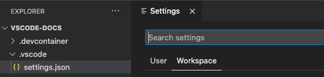

# VS Code 작업 공간이란 무엇인가요? {#what-is-a-vs-code-workspace}

Visual Studio Code의 *작업 공간*은 VS Code 창(인스턴스)에서 열려 있는 하나 이상의 폴더의 모음입니다. 대부분의 경우, 단일 폴더가 작업 공간으로 열리게 됩니다. 그러나 개발 워크플로우우에 따라 [다중 루트 작업 공간](#multiroot-workspaces)이라는 고급 구성을 사용하여 여러 폴더를 포함할 수 있습니다.

작업 공간의 개념은 VS Code가 다음을 가능하게 합니다:

* 특정 폴더 또는 폴더에만 적용되는 설정을 구성할 수 있습니다.
* 해당 작업 공간의 맥락에서만 유효한 [작업](/docs/editor/tasks.md) 및 [디버거 실행](/docs/editor/debugging.md) 구성을 유지할 수 있습니다.
* 해당 작업 공간과 관련된 UI 상태를 저장하고 복원할 수 있습니다(예: 열린 파일).
* 해당 작업 공간에 대해서만 선택적으로 확장을 활성화하거나 비활성화할 수 있습니다.

VS Code 문서, 이슈 및 커뮤니티 토론에서 "폴더"와 "작업 공간"이라는 용어가 서로 바꿔 사용되는 것을 볼 수 있습니다. 작업 공간을 프로젝트의 루트로 생각하되, 추가적인 VS Code 지식과 기능이 포함되어 있다고 이해하면 됩니다.

> **참고:** 작업 공간 없이 VS Code를 여는 것도 가능합니다. 예를 들어, 플랫폼의 **파일** 메뉴에서 파일을 선택하여 새 VS Code 창을 열면 작업 공간 안에 있지 않게 됩니다. 이 모드에서는 VS Code의 일부 기능이 제한되지만, 여전히 텍스트 파일을 열고 편집할 수 있습니다.

## VS Code "작업 공간"을 여는 방법은 무엇인가요? {#how-do-i-open-a-vs-code-workspace}

**파일** > **폴더 열기...** 메뉴를 사용하여 작업 공간을 열 수 있으며, 그런 다음 폴더를 선택합니다.

또는 터미널에서 VS Code를 실행하는 경우, `code` 명령의 첫 번째 인수로 폴더의 경로를 전달하여 열 수 있습니다. 예를 들어, 현재 폴더(`.`)를 VS Code로 열려면 다음 명령을 사용하세요:

```bash
code .
```

## 단일 폴더 작업 공간 {#single-folder-workspaces}

폴더를 VS Code 작업 공간으로 만들기 위해서는 VS Code로 폴더를 여는 것 외에는 아무것도 할 필요가 없습니다. 폴더를 열면 VS Code가 자동으로 열린 파일이나 편집기 레이아웃과 같은 구성을 추적합니다. 이후 VS Code에서 해당 폴더를 다시 열면, 편집기는 이전에 남겨둔 상태로 열립니다.

또한 작업 공간 특정 [설정](/docs/editor/settings.md) (전역 사용자 설정과 대조되는) 및 [작업 정의](/docs/editor/tasks.md), [디버깅 실행](/docs/editor/debugging.md) 파일과 같은 다른 폴더 특정 구성을 추가할 수 있습니다(아래 [작업 공간 설정](#workspace-settings) 섹션 참조).


*VS Code 내에서 열린 단일 폴더 작업 공간*

## 다중 루트 작업 공간 {#multi-root-workspaces}

[다중 루트 작업 공간](/docs/editor/workspaces/multi-root-workspaces.md)은 여러 개의 개별 폴더를 동일한 작업 공간의 일부로 구성할 수 있는 VS Code의 고급 기능입니다. 폴더를 작업 공간으로 여는 대신, 작업 공간의 모든 폴더를 나열하는 `<name>.code-workspace` JSON 파일을 엽니다. 예를 들어:

```json
{
    "folders": [
        {
            "path": "my-folder-a"
        },
        {
            "path": "my-folder-b"
        }
    ]
}
```


*VS Code에서 열린 다중 루트 작업 공간*

> **참고:** 폴더를 열 때와 `.code-workspace` 파일을 열 때의 시각적 차이는 미세할 수 있습니다. `.code-workspace` 파일이 열렸다는 힌트를 주기 위해, 사용자 인터페이스의 일부 영역(예: 파일 탐색기의 루트)에서는 이름 옆에 추가적인 **(작업 공간)** 접미사가 표시됩니다.

### 제목 없는 다중 루트 작업 공간 {#untitled-multi-root-workspaces}

작업 공간에서 폴더를 유연하게 추가하거나 제거할 수 있습니다. 먼저 VS Code에서 폴더를 열고, 이후 필요에 따라 더 많은 폴더를 추가하면 됩니다.


*작업 공간에 폴더를 추가하거나 제거하기 위한 파일 탐색기 컨텍스트 메뉴*

`.code-workspace` 파일을 이미 열지 않았다면, 작업 공간에 두 번째 폴더를 추가하는 첫 번째 시도에서 VS Code는 자동으로 *제목 없음* 작업 공간을 생성합니다. 백그라운드에서 VS Code는 현재 세션의 모든 폴더와 작업 공간 설정을 포함하는 `untitled.code-workspace` 파일을 자동으로 유지합니다. 사용자가 디스크에 저장하기로 결정할 때까지 작업 공간은 *제목 없음* 상태로 남아 있습니다.


*VS Code에서 열린 제목 없는 다중 루트 작업 공간*

> **참고:** 제목 없는 작업 공간과 저장된 작업 공간 간에는 차이가 없습니다. 제목 없는 작업 공간은 편의를 위해 자동으로 생성되며, 저장할 때까지 항상 복원됩니다. VS Code는 제목 없는 작업 공간이 열린 창을 닫을 때(확인 요청 후) 제목 없는 작업 공간을 자동으로 삭제합니다.

## 작업 공간 설정 {#workspace-settings}

작업 공간 설정은 열린 작업 공간의 맥락에서 설정을 구성할 수 있게 해줍니다. 작업 공간 설정은 항상 전역 사용자 설정을 덮어씁니다. 이들은 JSON 파일에 물리적으로 저장되며, 폴더를 작업 공간으로 열었는지, 아니면 `.code-workspace` 파일을 열었는지에 따라 위치가 달라집니다.

설정 범위 및 파일 위치에 대한 포괄적인 설명은 [설정](/docs/editor/settings.md) 문서를 참조하세요.

### 단일 폴더 작업 공간 설정 {#single-folder-workspace-settings}

작업 공간 설정은 폴더를 작업 공간으로 열 때 `.vscode/settings.json`에 저장됩니다.



*폴더가 작업 공간으로 열릴 때의 설정 편집기*

### 다중 루트 작업 공간 설정 {#multi-root-workspace-settings}

`.code-workspace` 파일을 작업 공간으로 열면 모든 작업 공간 설정이 `.code-workspace` 파일에 추가됩니다.

여전히 루트 폴더별로 설정을 구성할 수 있으며, 설정 편집기에서는 **폴더 설정**이라는 세 번째 설정 범위를 제공합니다:


*다중 루트 작업 공간이 열릴 때의 설정 편집기*

폴더별로 구성된 설정은 `.code-workspace`에 정의된 설정을 덮어씁니다.

## 작업 공간 작업 및 실행 구성 {#workspace-tasks-and-launch-configurations}

[작업 공간 설정](#workspace-settings)과 유사하게, 작업 및 실행 구성도 작업 공간에 특정할 수 있습니다.

폴더를 작업 공간으로 열었는지, 아니면 `.code-workspace` 파일을 열었는지에 따라 작업 공간 작업 및 실행 구성의 위치는 `.vscode` 폴더 내에 있거나 `.code-workspace` 파일 내에 있습니다. 또한, 작업 및 실행 구성은 `.code-workspace` 파일을 열었을 때도 폴더 수준에서 정의할 수 있습니다.

VS Code에서 작업 및 실행 구성을 사용하는 방법에 대한 보다 포괄적인 개요는 [작업](/docs/editor/tasks.md) 및 [디버깅](/docs/editor/debugging.md) 장을 참조하세요.

## 자주 묻는 질문 {#common-questions}

### 다중 루트 작업 공간의 장점은 무엇인가요? {#what-is-the-benefit-of-multi-root-workspace-over-a-folder}

가장 명백한 장점은 다중 루트 작업 공간을 사용하면 디스크의 동일한 상위 폴더에 저장되지 않은 여러 프로젝트를 동시에 작업할 수 있다는 점입니다. 작업 공간에 추가할 폴더를 어디서든 선택할 수 있습니다.

주로 단일 폴더 기반 프로젝트에서 작업하더라도 `.code-workspace` 파일을 사용하면 이점을 누릴 수 있습니다. 특정 시나리오에 따라 프로젝트의 특정 측면에 대한 범위가 지정된 폴더 뷰를 제공하기 위해 폴더 내에 여러 `.code-workspace` 파일을 저장할 수 있습니다(예: `client.code-workspace`, `server.code-workspace`는 파일 탐색기에서 관련 없는 폴더를 필터링합니다). `.code-workspace` 파일은 `folders` 섹션에 대한 상대 경로를 지원하므로, 이러한 작업 공간 파일은 폴더가 저장된 위치와 관계없이 모든 사용자에게 작동합니다.

마지막으로, 특정 프로젝트에 대해 동일한 작업 공간 설정이나 작업/실행 구성을 적용하려는 경우, 이를 `.code-workspace` 파일에 추가하고 해당 작업 공간에서 폴더를 추가하거나 제거하는 것을 고려해 보세요.

### VS Code가 재시작 시 모든 제목 없는 작업 공간을 복원하는 이유는 무엇인가요? {#why-is-vs-code-restoring-all-untitled-workspaces-on-a-restart}

제목 없는 작업 공간은 사용자가 명시적으로 유지할지 여부를 결정해야 하는 것으로 설계되었습니다. 제목 없는 작업 공간이 처음 생성될 때, VS Code는 지정된 폴더를 작업 공간 파일에 추가하고 모든 기존 작업 공간 설정도 추가합니다. 이 사용자 데이터는 제목 없는 작업 공간이 저장되거나 삭제될 때까지 항상 복원되어 VS Code 창에 표시됩니다.

### 제목 없는 작업 공간을 삭제하는 방법은 무엇인가요? {#how-do-i-delete-an-untitled-workspace}

제목 없는 작업 공간의 창을 닫고 제목 없는 작업 공간을 저장하라는 프롬프트를 무시하면 제목 없는 작업 공간을 삭제할 수 있습니다.

### 폴더 없이 다중 루트 작업 공간을 사용할 수 있나요? {#can-i-use-a-multi-root-workspace-without-folders}

`.code-workspace` 파일의 `folders` 섹션을 비워 두면 루트 폴더가 표시되지 않는 VS Code 인스턴스를 만들 수 있습니다. 이 경우에도 작업 공간 설정 및 작업 또는 실행 구성을 저장할 수 있습니다.

### VS Code는 프로젝트나 솔루션을 지원하나요? {#does-vs-code-support-projects-or-solutions}

VS Code는 Visual Studio IDE와 같은 다른 개발 도구에서 정의되는 "프로젝트"나 "솔루션"의 개념이 없습니다. VS Code 문서에서 "프로젝트"라는 용어를 볼 수 있지만, 일반적으로 "당신이 작업하고 있는 것"을 의미합니다. 프로그래밍 언어나 프레임워크에 따라 도구 세트 자체가 빌드 구성을 정의하거나 포함된 파일을 나열하는 데 도움이 되는 "프로젝트"라는 것을 지원할 수 있습니다.
---