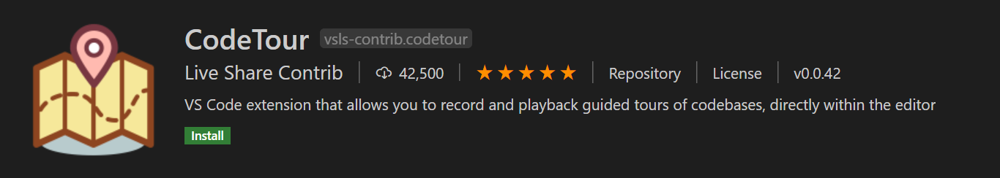
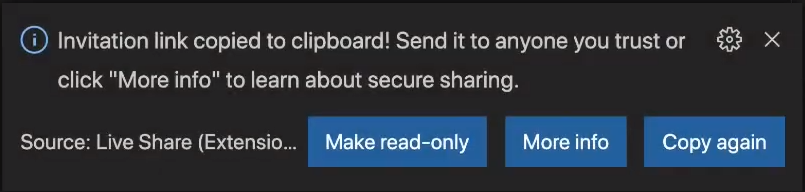
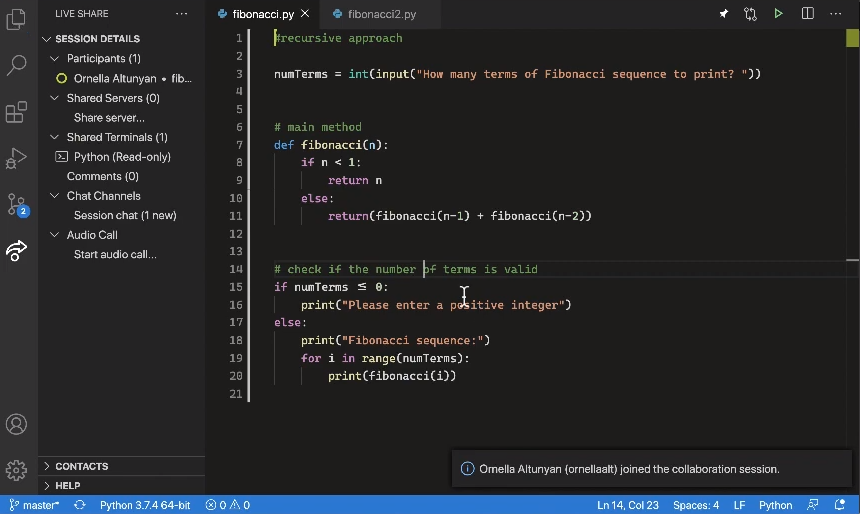

# VS Code for Educators and Students {#vs-code-for-educators-and-students}

Visual Studio Code를 교육자 또는 학생으로서 사용하는 세계에 오신 것을 환영합니다! 이 기사에서는 Visual Studio Code에서 코딩을 시작하는 데 도움이 되는 다양한 도구, 확장 팩 및 학습 경로를 소개합니다. 교실 경험을 향상시키기 위한 자료를 찾고 있는 교육자이든, 코딩을 배우고 탐구하고자 하는 학생이든, 이 가이드는 여러분이 시작하는 데 도움을 줄 것입니다.

## Educator resources {#educator-resources}

다음 자료는 교실에서 Visual Studio Code를 시작하는 데 도움이 될 수 있습니다:

### Coding and extension packs {#coding-and-extension-packs}

코딩을 준비하기 위해 다양한 소프트웨어 구성 요소를 설치하는 것은 매우 번거로울 수 있습니다. 편집기/IDE, 런타임 및 컴파일러, 패키지 또는 라이브러리, 그리고 각 버전이 필요합니다. 여러분의 설정을 가속화할 수 있는 코딩 및 확장 팩이 준비되어 있습니다.

- Java용 코딩 팩: [Windows](https://aka.ms/vscode-java-installer-win) / [macOS](https://aka.ms/vscode-java-installer-mac)
- [Node.js 및 JavaScript 교육 확장 팩](https://marketplace.visualstudio.com/items?itemName=tanhakabir.node-js-education-extension-pack)
- [Python 교육 확장 팩](https://marketplace.visualstudio.com/items?itemName=tanhakabir.python-education-extension-pack)

### CodeTour {#codetour}

학생들이 새로운 코드베이스를 이해하는 것은 도전적이고 시간이 많이 걸릴 수 있습니다. 충분히 설명적인 지침을 만드는 것은 번거롭고 학생들이 따르기에는 여전히 쉽지 않을 수 있습니다. CodeTour는 학생들에게 과제와 프로젝트를 간편하고 상호작용적인 방식으로 소개하는 데 도움을 줄 수 있습니다.

[CodeTour](https://marketplace.visualstudio.com/items?itemName=vsls-contrib.codetour)는 코드베이스를 단계별로 안내하는 가이드를 만들 수 있게 해주는 Visual Studio Code 확장입니다. 이 기능은 교실에서 과제를 학생들이 따를 수 있는 단계로 나누거나 과제 내의 관련 부분을 가리켜 학생들이 과제의 모든 부분에 익숙해지도록 하는 데 유용합니다.

다음 짧은 클립은 학생이 CodeTour를 사용하여 앱 작업을 시작하는 모습을 보여줍니다:

본질적으로 "코드 투어"는 각 단계가 특정 디렉토리 또는 파일/라인과 연결되어 있으며 해당 코드에 대한 설명이 포함된 일련의 상호작용 단계입니다. 투어는 소스 제어와 공유하기 위해 리포지토리에 체크인할 수 있거나 "투어 파일"로 내보내어 누구나 코드를 복제하지 않고도 동일한 투어를 재생할 수 있게 합니다!

다음 비디오에서는 강사가 소스 코드에 내장된 기존 지침을 제거하고 CodeTour 단계로 교체하는 모습을 보여줍니다. 학생들은 이후 대규모 게임 개발 프로젝트에서 단계별로 이동할 수 있습니다.

#### Getting started with CodeTour {#getting-started-with-codetour}

CodeTour를 사용하려면 VS Code [Marketplace](https://marketplace.visualstudio.com/vscode)에서 CodeTour 확장을 다운로드해야 합니다.

교실에서 CodeTour를 효과적으로 사용하려면 [CodeTour 리포지토리](https://github.com/microsoft/codetour#getting-started)의 지침을 따르는 것을 권장합니다.

## Student resources {#student-resources}

### Lessons for getting started with VS Code {#lessons-for-getting-started-with-vs-code}

| 제목 | 설명 |
|-------|-------------|
| [Python 초급 개발 환경 설정](https://learn.microsoft.com/training/modules/python-install-vscode/) | 실제 애플리케이션을 구축하는 데 필요한 도구를 설치하고 구성하여 Python 학습을 시작하세요. |
| [Git 버전 관리 도구 사용](https://learn.microsoft.com/training/modules/use-git-from-vs-code/) | Visual Studio Code와 Git 소스 제어 관리 시스템의 긴밀한 통합을 활용하세요. |
| [노트북에서 기본 Python 작성](https://learn.microsoft.com/training/modules/basic-python-nasa/) | Visual Studio Code의 노트북을 사용하여 Python의 기초를 배우세요. |
| [Azure Cosmos DB용 Node.js 앱 구축](https://learn.microsoft.com/training/modules/build-node-cosmos-app-vscode/) | Visual Studio Code와 Node.js를 사용하여 Azure Cosmos DB에 데이터를 저장하고 쿼리하는 데이터베이스 앱을 구축하세요. |

### Learn Python with NASA inspired lessons {#learn-python-with-nasa-inspired-lessons}

이 학습 경로는 NASA 과학자들이 영감을 준 모듈을 통해 Python의 세계를 소개하여 우주 탐사 분야에서의 경력을 준비하는 데 도움을 줍니다. 전체 모듈 목록은 [Microsoft Learn 교육](https://learn.microsoft.com/training/topics/nasa)에서 확인하세요.

이 모듈을 통해 여러분은:

- 프로그래밍 학습에 필요한 도구를 이해하고 설치합니다.
- 핵심 프로그래밍 개념을 배우고 이를 실제 NASA 문제에 적용합니다.
- 머신 러닝 및 인공지능과 같은 최첨단 기술에 대한 지식을 얻습니다.
- 실제 NASA 직원들이 자신의 직업에 대해 이야기하고 조언하는 모습을 볼 수 있습니다.

| 제목 | 설명 |
|-------|-------------|
| [우주 탐사에서 Python의 역할 알아보기](https://learn.microsoft.com/training/paths/introduction-python-space-exploration-nasa/?WT.mc_id=python-0000-cxa) | Python과 데이터 과학이 NASA가 만드는 혁신적인 솔루션에서 어떤 역할을 하는지 배워보세요. |
| [인공지능을 사용하여 우주 암석 분류하기](https://learn.microsoft.com/training/paths/classify-space-rocks-artificial-intelligence-nasa/?WT.mc_id=python-0000-cxa) | 사진에 있는 우주 암석의 종류를 분류할 수 있는 AI 모델을 만드세요. |
| [머신 러닝을 사용하여 로켓 발사 예측하기](https://learn.microsoft.com/training/paths/machine-learning-predict-launch-delay-nasa/?WT.mc_id=python-0000-cxa) | 이 모듈은 머신 러닝의 세계를 소개하고 기본 ML 모델을 구축하는 데 도움을 줍니다. |

### Learn Python with Over the Moon {#learn-python-with-over-the-moon}

Python, Visual Studio Code 및 Azure와 같은 도구를 사용하여 데이터 과학, 머신 러닝 및 인공지능을 소개하는 우주 여행 테마의 도전 과제를 시도해 보세요.

| 제목 | 설명 |
|-------|-------------|
| [Python 및 Visual Studio Code로 우주 탐험하기](https://learn.microsoft.com/training/paths/explore-space-using-python/?WT.mc_id=python-0000-cxa) | Netflix 영화 "Over the Moon"에서 영감을 받은 이 학습 경로에서 달 임무를 계획하고, 유성우를 예측하며, 인공지능을 사용하여 물체를 인식하세요. |

### Learn Python with Wonder Woman {#learn-python-with-wonder-woman}

여러분이 Python 코드를 처음 작성하는 데 도움을 주기 위해 제작된 WONDER WOMAN 1984에서 영감을 받은 수업을 확인해 보세요. 첫 번째 모듈에서는 비밀 메시지를 드러내는 Caesar Cipher 코드를 해독하는 방법을 배우고, 두 번째 모듈에서는 여러분이 가장 비슷한 캐릭터를 결정하는 성격 테스트를 만들어 보세요!

첫 번째 수업의 [비디오 워크스루](https://www.youtube-nocookie.com/embed/VH_mU42lQkQ)를 따라 해보세요.

| 제목 | 설명 |
|-------|-------------|
| [원더우먼과 함께 Python 배우기](https://learn.microsoft.com/training/paths/python-partnership/?WT.mc_id=python-0000-cxa) | WONDER WOMAN 1984 영화에서 영감을 받은 이 수업에서 메시지 디코더 프로그램과 성격 퀴즈를 만드세요. |

### Learn Python with Space Jam {#learn-python-with-space-jam}

영화 "Space Jam: A New Legacy"에서 영감을 받은 이 학습 경로는 농구 팬들에게 데이터 과학과 코딩에 대한 이해가 어떻게 그들의 열정을 지원하고 기회를 창출하며 잠재적인 경로를 열 수 있는지를 보여줍니다. Visual Studio Code, Azure, GitHub, JavaScript 및 Python의 기술을 개발하여 선수의 역사 속 개별 순간들이 결승전의 중요한 게임 결정으로 이어질 수 있는 방법에 대한 통찰력을 얻으세요. [소개 비디오](https://www.youtube-nocookie.com/embed/pXkIIzihEYM)를 시청하세요.

| 제목 | 설명 |
|-------|-------------|
| [농구 통계를 사용하여 Visual Studio Code로 게임 플레이 최적화하기](https://learn.microsoft.com/training/paths/optimize-basketball-games-with-machine-learning/?WT.mc_id=LearnDrG-c9-niner&WT.mc_id=SpaceJam_Learn_-all-cxa) | 영화 "Space Jam: A New Legacy"에서 영감을 받은 이 학습 경로에서 농구 통계를 분석하고 앱을 만드세요. |

## Tools for both educators and students {#tools-for-both-educators-and-students}

### Collaborate with Live Share {#collaborate-with-live-share}

[Live Share](https://learn.microsoft.com/visualstudio/liveshare)는 친구, 동급생 또는 교수와 같은 코드에서 실시간으로 신속하게 협업할 수 있게 해줍니다. 코드 동기화나 동일한 개발 도구, 설정 또는 환경을 구성할 필요가 없습니다.

<iframe src="https://www.youtube-nocookie.com/embed/A2ceblXTBBc?rel=0&amp;disablekb=0&amp;modestbranding=1&amp;showinfo=0" frameborder="0" allowfullscreen title="Collaborate with Live Share"></iframe>

>**참고**: 이 비디오에서는 더 이상 지원되지 않는 Live Share Extension Pack 및 Live Share Audio 확장에 대해 언급합니다. 비디오를 따라 하려면 [Live Share](https://marketplace.visualstudio.com/items?itemName=MS-vsliveshare.vsliveshare) 확장만 설치하면 됩니다.

협업 세션을 공유하면 함께 작업하는 사람이 자신의 편집기에서 작업 공간 파일을 보고 언어 서비스나 디버깅 구성과 같은 편집기 컨텍스트도 받습니다. 즉, 동급생은 리포지토리를 복제하거나 코드가 의존하는 종속성을 설치하지 않고도 공유한 코드를 읽을 수 있습니다. 그들은 자신에게 익숙한 Visual Studio Code 환경에서 여러분의 코드에 도움을 줄 수 있습니다.

각각 파일을 열고 탐색하며 코드를 편집하거나 강조 표시할 수 있으며, 변경 사항은 즉시 반영됩니다. 편집하는 동안 동급생의 커서를 보고 같은 위치로 이동하며 그들의 행동을 따를 수 있습니다.

VS Code의 디버깅 기능을 사용하여 함께 디버깅할 수도 있습니다. 예를 들어, 호버, 로컬 및 감시, 스택 추적 또는 디버그 콘솔을 사용할 수 있습니다. 두 사람 모두 중단점을 설정하고 디버그 커서를 진행하여 세션을 단계별로 진행할 수 있습니다.

Live Share로 할 수 있는 일에 대한 자세한 내용은 [사용 방법 가이드](https://learn.microsoft.com/visualstudio/liveshare/use/install-live-share-visual-studio-code)를 방문하세요.

#### Get started with Live Share {#get-started-with-live-share}

VS Code에서 Live Share를 사용하려면 VS Code Marketplace에서 [Live Share](https://marketplace.visualstudio.com/items?itemName=MS-vsliveshare.vsliveshare) 확장을 다운로드하세요.

> <a class="install-extension-btn" href="vscode:extension/MS-vsliveshare.vsliveshare">Live Share 확장 설치하기</a>

GitHub 계정에 로그인하면 활동 표시줄에서 Live Share 아이콘을 볼 수 있습니다.

#### Starting a Live Share session {#starting-a-live-share-session}

세션 세부 정보 메뉴에서 **협업 세션 시작**을 선택하면 세션에 대한 초대 링크가 자동으로 클립보드에 복사됩니다. 이 링크를 협업하고 싶은 누구와도 공유할 수 있으며, 그들도 VS Code와 Live Share 확장을 설치해야 합니다.

동급생이 세션에 참여하면 알림을 받고 참가자 목록에 그들의 이름이 나타납니다.

#### Joining a Live Share session {#joining-a-live-share-session}

세션 세부 정보 메뉴에서 **협업 세션 참여**를 선택하면 받은 URL을 입력할 수 있습니다.

화면에서 동급생의 코드를 보고 상호작용할 수 있어야 합니다!

#### Joining a Live Share session from the browser {#joining-a-live-share-session-from-the-browser}

Live Share 세션에 참여하고 싶지만 컴퓨터에 Visual Studio Code가 설치되어 있지 않은 경우 [Visual Studio Code for the Web](/docs/editor/vscode-web.md)를 사용하여 세션에 참여할 수 있습니다. VS Code for the Web은 브라우저에서 완전히 실행되는 제로 설치 Visual Studio Code 경험을 제공합니다. 시작하려면 브라우저에서 [https://vscode.dev](https://vscode.dev)로 이동하세요.

VS Code for the Web으로 이동한 후 [Live Share](https://marketplace.visualstudio.com/items?itemName=MS-vsliveshare.vsliveshare) 확장을 설치하고 [Live Share 세션에 참여하세요](#joining-a-live-share-session).

## Next steps {#next-steps}

- [VS Code 소개 비디오](/docs/getstarted/introvideos.md) 시청하기
- [VS Code 팁과 요령](/docs/getstarted/tips-and-tricks.md) 확인하기