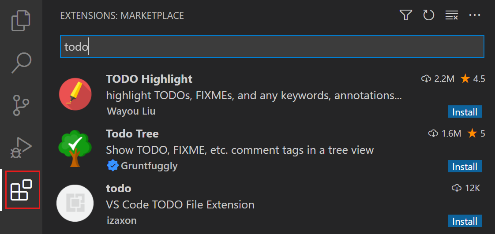

# Visual Studio Code에서 확장 사용하기 {#use-extensions-in-visual-studio-code}

Visual Studio Code 확장을 사용하면 개발 워크플로우를 지원하기 위해 언어, 디버거 및 도구를 설치에 추가할 수 있습니다. VS Code를 사용할 때 [Visual Studio Marketplace](https://marketplace.visualstudio.com/vscode)에서 직접 확장을 설치하고 자동 업데이트를 통해 항상 최신 기능을 이용할 수 있습니다. 이 문서에서는 VS Code에서 확장을 탐색하고 설치하는 방법을 배웁니다.

Visual Studio Marketplace는 다양한 카테고리의 수천 개의 확장을 호스팅합니다. 악성 확장으로부터 보호하기 위해, 게시자 신뢰, 악성 코드 스캔 등 여러 가지 메커니즘을 사용합니다. [확장 런타임 보안](/docs/editor/extension-runtime-security.md)에 대해 더 알아보세요.

## 확장 탐색하기 {#browse-extensions}

VS Code의 확장 보기에서는 [Visual Studio Marketplace](https://marketplace.visualstudio.com/vscode)에서 확장을 탐색하고 설치할 수 있습니다.

VS Code 내에서 확장 마켓플레이스를 탐색하려면:

1. 활동 표시줄에서 확장 아이콘을 선택하거나 `kb(workbench.view.extensions)` 키보드 단축키를 사용하여 확장 보기를 엽니다.

    

1. 선택적으로 검색 상자를 사용하여 확장을 검색하거나 필터 중 하나를 사용할 수 있습니다. 예를 들어, 확장 카테고리로 필터링할 수 있습니다.

1. 확장을 선택하여 설명, 게시자, 설치 수, 사용자 평가 등 세부 정보를 확인합니다.

## VS Code 확장 설치하기 {#install-a-vs-code-extension}

VS Code의 확장 보기에서 직접 확장을 설치할 수 있습니다. 또는 [Visual Studio Marketplace](https://marketplace.visualstudio.com/vscode) 웹사이트에서 확장을 설치할 수도 있습니다.

1. 확장 보기(`kb(workbench.view.extensions)`)를 엽니다.
1. 확장 타일에서 **설치** 버튼을 선택합니다.

    

1. 확장 세부 정보 보기에서도 **설치** 버튼을 선택할 수 있습니다.

> [!TIP]
> 다양한 기술 스택 간에 전환해야 하는 경우, [VS Code 프로필](/docs/editor/profiles.md)을 사용하여 특정 작업에 필요한 확장만 설치하세요. 예를 들어, 하나의 프로필에는 웹 개발을 위한 확장을 설치하고, 다른 프로필에는 데이터 과학을 위한 확장을 설치할 수 있습니다.

## 확장 설정 열기 {#open-extension-settings}

확장은 VS Code에 설정을 추가할 수도 있습니다. [설정 편집기](/docs/getstarted/personalize-vscode.md#configure-settings)를 사용하여 VS Code의 다른 설정과 마찬가지로 이러한 설정을 보고 수정할 수 있습니다.

1. **파일** > **환경 설정** > **설정** 메뉴를 통해 설정 편집기를 열거나 `kb(workbench.action.openSettings)` 키보드 단축키를 사용합니다.
1. 설정 트리 보기에서 **확장**을 선택한 다음, 특정 확장을 선택하여 해당 설정을 확인합니다.

    

## VS Code 확장 제거하기 {#uninstall-a-vs-code-extension}

VS Code의 확장 보기에서 확장을 제거할 수 있습니다. 확장을 일시적으로 비활성화하려는 경우, 확장을 제거하는 대신 비활성화할 수 있습니다.

1. 확장 보기(`kb(workbench.view.extensions)`)를 엽니다.
1. 기어 아이콘을 선택하거나 확장 타일을 마우스 오른쪽 버튼으로 클릭한 다음 **제거**를 선택합니다.

## 다음 단계 {#next-steps}

* [확장 마켓플레이스](/docs/editor/extension-marketplace.md): 추천 확장, 사전 출시 확장 또는 명령줄에서 확장을 설치하는 방법에 대해 더 알아보세요.
* [확장 런타임 보안](/docs/editor/extension-runtime-security.md): VS Code가 악성 확장으로부터 당신을 어떻게 보호하는지에 대해 더 알아보세요.
* [VS Code 확장 개발](/api/get-started/your-first-extension.md): VS Code용 자신의 확장을 만들고 게시하세요.
* [VS Code 빠른 시작](/docs/getstarted/getting-started.md): 단계별 가이드를 통해 VS Code의 주요 기능을 알아보세요.
* [버전 관리](/docs/sourcecontrol/overview.md): VS Code에서 Git으로 버전 관리를 설정하는 방법을 알아보세요.
* [디버깅](/docs/editor/debugging.md): 프로젝트에 대한 디버깅을 구성하세요.
---