# 튜토리얼: Visual Studio Code 시작하기 {#tutorial-get-started-with-visual-studio-code}

이 튜토리얼에서는 코딩을 빠르게 시작할 수 있도록 Visual Studio Code의 주요 기능에 대해 배웁니다. 사용자 인터페이스의 다양한 구성 요소와 이를 원하는 대로 사용자화하는 방법을 배우게 됩니다. 그런 다음 코드를 작성하고 IntelliSense 및 코드 작업과 같은 내장 코드 편집 기능을 사용하며, 코드를 실행하고 디버깅하는 방법에 대해 배웁니다. 언어 확장을 설치하여 다른 프로그래밍 언어에 대한 지원을 추가합니다.

> [!TIP]
> 비디오를 따라하는 것을 선호하신다면, 이 튜토리얼과 동일한 단계를 다루는 [시작하기 비디오](https://www.youtube.com/watch?v=B-s71n0dHUk)를 시청할 수 있습니다.

## 사전 요구 사항 {#prerequisites}

- [컴퓨터에 Visual Studio Code 다운로드 및 설치하기](https://code.visualstudio.com/download)

## VS Code에서 폴더 열기 {#open-a-folder-in-vs-code}

VS Code를 사용하여 개별 파일에서 빠른 수정을 하거나, _작업 공간_이라고도 하는 폴더를 열 수 있습니다.

폴더를 생성하고 VS Code에서 여는 것으로 시작하겠습니다. 이 폴더는 튜토리얼 전반에 걸쳐 사용됩니다.

1. Visual Studio Code를 엽니다.

   VS Code를 처음 열면 시작할 수 있는 다양한 작업이 있는 **환영** 페이지가 표시됩니다.

1. 메뉴에서 **파일** > **폴더 열기...**를 선택하여 폴더를 엽니다.

   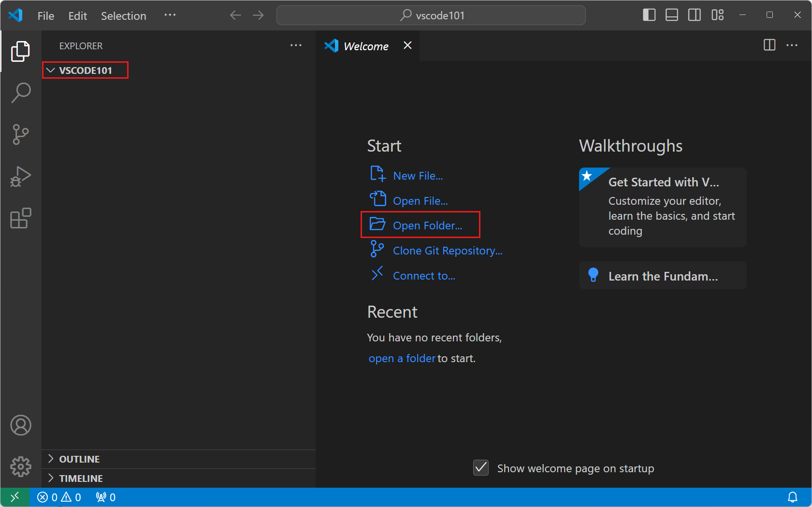

1. **새 폴더**를 선택하고 `vscode101`이라는 새 폴더를 만든 다음 **폴더 선택**(**macOS에서는 열기**)를 선택합니다.

   생성한 폴더는 작업 공간의 루트입니다.

1. 작업 공간 신뢰 대화 상자에서 **예, 저자는 신뢰합니다**를 선택하여 작업 공간의 모든 기능을 활성화합니다.

   

   컴퓨터에 폴더를 생성했기 때문에 폴더의 코드를 신뢰할 수 있습니다.

   > [!IMPORTANT]
   > 작업 공간 신뢰는 프로젝트 폴더의 코드가 VS Code에 의해 실행될 수 있는지 여부를 결정할 수 있게 해줍니다. 인터넷에서 코드를 다운로드할 때는 먼저 안전하게 실행할 수 있는지 검토해야 합니다. [작업 공간 신뢰](/docs/editor/workspaces/workspace-trust.md)에 대한 자세한 정보를 확인하세요.

1. 이제 왼쪽에 **탐색기** 뷰가 표시되며 폴더의 이름이 나타납니다.

   탐색기 뷰를 사용하여 작업 공간의 파일과 폴더를 보고 관리합니다.

> [!TIP]
> VS Code에서 폴더를 열면 VS Code가 해당 폴더의 UI 상태를 복원할 수 있습니다. 열린 파일, 활성 뷰 및 편집기 레이아웃과 같은 상태를 복원합니다. 해당 폴더에만 적용되는 설정을 구성하거나 디버그 구성을 정의할 수도 있습니다. [작업 공간](/docs/editor/workspaces/workspaces.md)에 대한 자세한 정보를 확인하세요.

## 사용자 인터페이스 탐색하기 {#explore-the-user-interface}

이제 VS Code에서 폴더를 열었으므로 사용자 인터페이스를 간단히 둘러보겠습니다.

### 활동 표시줄로 뷰 전환하기 {#switch-between-views-with-the-activity-bar}

1. 활동 표시줄을 사용하여 다양한 뷰 간에 전환합니다.

   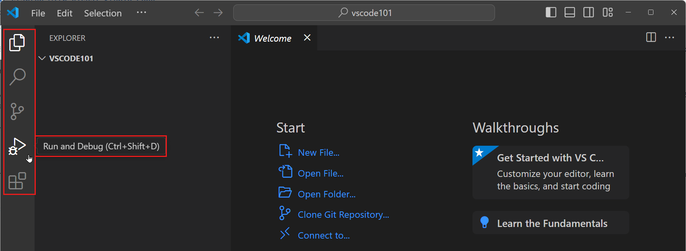

   > [!TIP]
   > 활동 표시줄 위에 마우스를 올리면 각 뷰의 이름과 해당 키보드 단축키를 확인할 수 있습니다. 뷰를 다시 선택하거나 키보드 단축키를 눌러 뷰를 열고 닫을 수 있습니다.

1. 활동 표시줄에서 뷰를 선택하면 **기본 사이드 바**가 열려 뷰에 특정한 정보를 표시합니다.

   예를 들어, 실행 및 디버그 뷰를 사용하면 디버깅 세션을 구성하고 시작할 수 있습니다.

   

### 편집기로 파일 보기 및 편집하기 {#view-and-edit-files-with-the-editor}

1. 활동 표시줄에서 탐색기 뷰를 선택하고 **새 파일...** 버튼을 선택하여 작업 공간에 새 파일을 만듭니다.

   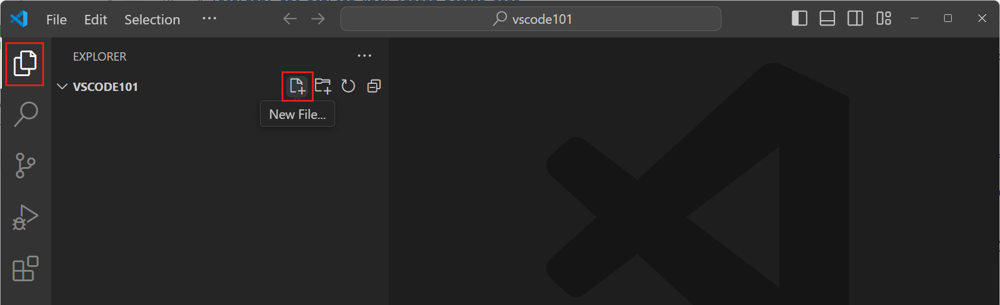

1. `index.html`이라는 이름을 입력하고 `kbstyle(Enter)`를 누릅니다.

   파일이 작업 공간에 추가되고 편집기가 창의 주요 영역에 열립니다.

   

1. `index.html` 파일에 HTML 코드를 입력하기 시작합니다.

   입력하는 동안 코드 완성을 돕는 제안이 나타나는 것을 볼 수 있습니다 (_IntelliSense_). 제안 사이를 탐색하려면 `kbstyle(Up)` 및 `kbstyle(Down)` 키를 사용하고, 선택한 제안을 삽입하려면 `kbstyle(Tab)`을 사용합니다.

1. 작업 공간에 더 많은 파일을 추가하고 각 파일이 새 편집기 탭을 여는 것을 확인합니다.

   원하는 만큼 편집기를 열 수 있으며, 수직 또는 수평으로 나란히 볼 수 있습니다. [나란히 편집하기](/docs/getstarted/userinterface.md#side-by-side-editing)에 대한 자세한 정보를 확인하세요.

   

### 패널 영역에서 터미널 접근하기 {#access-the-terminal-from-the-panel-area}

1. VS Code에는 통합 터미널이 있습니다. `kb(workbench.action.terminal.toggleTerminal)`를 눌러 엽니다.

   운영 체제 구성에 따라 PowerShell, 명령 프롬프트 또는 Bash와 같은 다양한 셸 중에서 선택할 수 있습니다.

   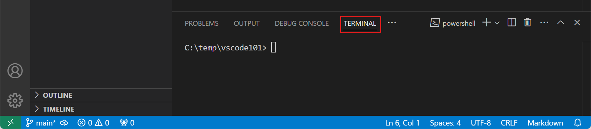

1. 터미널에서 다음 명령을 입력하여 작업 공간에 새 파일을 만듭니다.

   ```bash
   echo "Hello, VS Code" > greetings.txt
   ```

   기본 작업 폴더는 작업 공간의 루트입니다. 탐색기 뷰가 자동으로 새 파일을 감지하고 표시하는 것을 확인하세요.

   

1. 여러 개의 터미널을 동시에 열 수 있습니다. **시작 프로필** 드롭다운을 선택하여 사용 가능한 셸을 보고 선택합니다.

   

### 명령 팔레트로 명령 접근하기 {#access-commands-with-the-command-palette}

1. `kb(workbench.action.showCommands)`를 눌러 **명령 팔레트**를 엽니다. 또는 **보기** > **명령 팔레트...** 메뉴 항목을 사용할 수 있습니다.

   VS Code의 많은 명령은 명령 팔레트를 통해 사용할 수 있습니다. 확장을 설치하면 명령 팔레트에 명령을 추가할 수도 있습니다.

   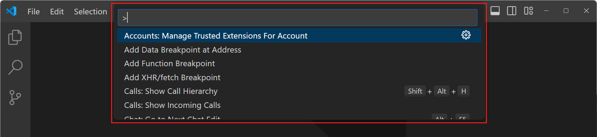

   > [!TIP]
   > 명령 팔레트는 해당 명령에 기본 키보드 단축키가 있는 경우 기본 키보드 단축키를 표시합니다. 키보드 단축키를 사용하여 명령을 직접 실행할 수 있습니다.

1. 명령 팔레트는 다양한 작동 모드를 지원합니다:

   1. `>` 기호 뒤에 입력하여 명령 목록을 필터링합니다. 예를 들어, `move terminal`을 입력하여 터미널을 새 창으로 이동하는 명령을 찾습니다.

      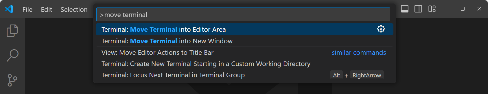

   1. `>` 문자를 제거하고 입력하여 작업 공간의 파일을 검색합니다. `kb(workbench.action.quickOpen)` 키보드 단축키를 사용하여 명령 팔레트를 열고 파일을 직접 검색할 수 있습니다.

      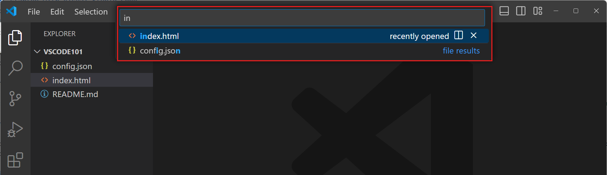

> [!TIP]
> VS Code는 퍼지 매칭을 사용하여 파일이나 명령을 찾습니다. 예를 들어, `odks`를 입력하면 `Open Default Keyboard Shortcuts` 명령이 반환됩니다.

## VS Code 설정 구성하기 {#configure-vs-code-settings}

VS Code의 거의 모든 부분을 설정을 구성하여 사용자화할 수 있습니다. **설정 편집기**를 사용하여 VS Code의 설정을 수정하거나 `settings.json` 파일을 직접 수정할 수 있습니다.

1. `kb(workbench.action.openSettings)`를 눌러 설정 편집기를 엽니다 (또는 **파일** > **환경 설정** > **설정** 메뉴 항목을 선택합니다).

   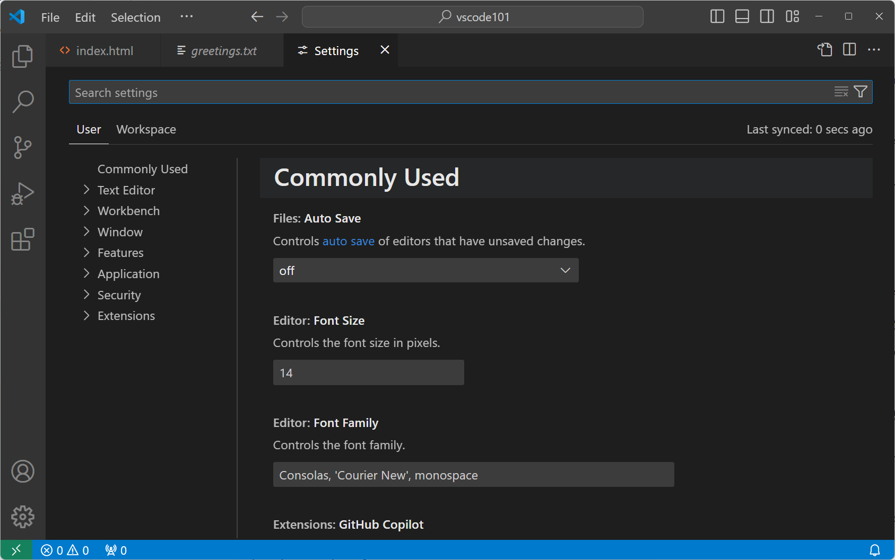

   > [!TIP]
   > 검색 상자를 사용하여 표시되는 설정 목록을 필터링합니다.

1. 기본적으로 VS Code는 수정된 파일을 자동으로 저장하지 않습니다. 자동 저장 드롭다운에서 값을 선택하여 이 동작을 변경합니다.

   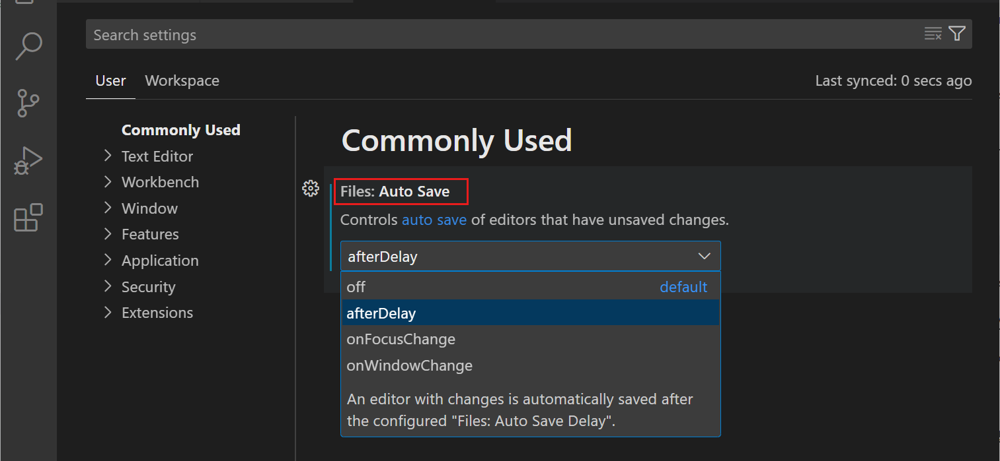

   VS Code는 설정 변경 사항을 자동으로 적용합니다. 작업 공간에서 파일을 수정하면 이제 자동으로 저장됩니다.

1. 설정을 기본값으로 되돌리려면 설정 옆의 기어 아이콘을 선택하고 **설정 재설정**을 선택합니다.

   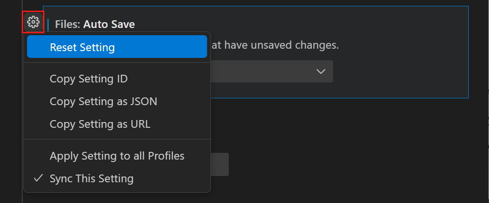

   > [!TIP]
   > 검색 상자에 `@modified`를 입력하거나 **수정됨** 필터를 선택하여 모든 수정된 설정을 빠르게 찾을 수 있습니다.

1. 설정 편집기에서 **사용자** 설정과 **작업 공간** 설정 간에 전환할 수 있습니다.

   사용자 설정은 모든 작업 공간에 적용됩니다. 작업 공간 설정은 현재 작업 공간에만 적용됩니다. 작업 공간 설정은 사용자 설정을 덮어씁니다. [VS Code의 설정](/docs/editor/settings.md)에 대한 자세한 정보를 확인하세요.

## 코드 작성하기 {#write-some-code}

VS Code는 JavaScript, TypeScript, HTML, CSS 등 다양한 언어에 대한 기본 지원을 제공합니다. 이 튜토리얼에서는 샘플 JavaScript 파일을 생성하고 VS Code가 제공하는 일부 코드 편집 기능을 사용합니다.

VS Code는 많은 프로그래밍 언어를 지원하며, 다음 단계에서는 다른 언어인 Python에 대한 지원을 추가하기 위해 [언어 확장을 설치합니다](#step-6-install-a-language-extension).

1. 탐색기 뷰에서 새 파일 `app.js`를 만들고 다음 JavaScript 코드를 입력하기 시작합니다:

    ```javascript
    function sayHello(name) {
      console.log("Hello, " + name);
    }

    sayHello("VS Code");
    ```

    입력하는 동안 코드 완성을 돕는 제안이 나타나는 것을 볼 수 있습니다 (_IntelliSense_). 제안 사이를 탐색하려면 `kbstyle(Up)` 및 `kbstyle(Down)` 키를 사용하고, 선택한 제안을 삽입하려면 `kbstyle(Tab)`을 사용합니다.

    코드의 형식 (_구문 강조_)도 확인하여 코드의 다양한 부분을 구분할 수 있도록 돕습니다.

    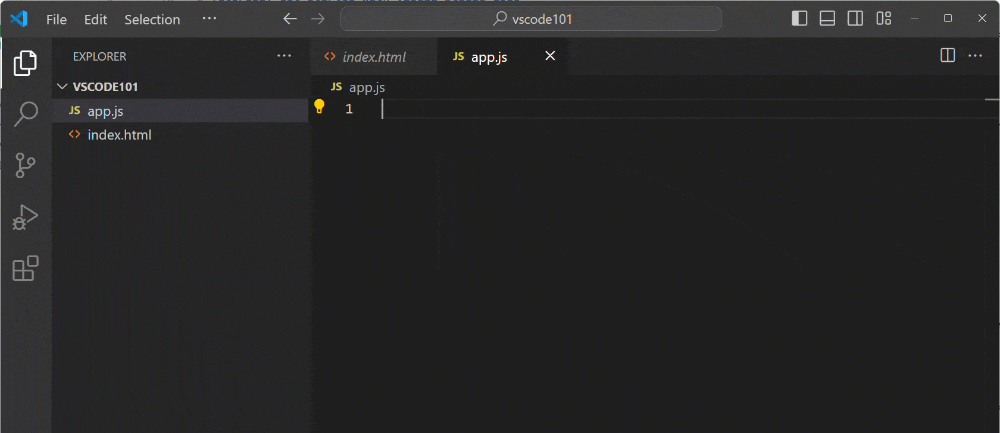

1. 문자열 `Hello,` 위에 커서를 두면 코드 작업을 나타내는 전구 아이콘이 나타납니다.

    `kb(editor.action.triggerSuggest)` 키보드 단축키를 사용하여 전구 메뉴를 열 수도 있습니다.

1. 전구 아이콘을 선택한 다음 **템플릿 문자열로 변환**을 선택합니다.

        

        코드 작업은 코드에 대한 빠른 수정 적용을 위한 제안입니다. 이 경우 코드 작업은 `""Hello, " + name`을 [템플릿 문자열](https://developer.mozilla.org/en-US/docs/Web/JavaScript/Reference/Template_literals) `` `Hello, $\{name\}` ``으로 변환합니다. 이는 문자열에 표현식을 삽입하기 위한 특별한 JavaScript 구성입니다.

코드 [편집 기능](/docs/editor/codebasics.md), [IntelliSense](/docs/editor/intellisense.md), [코드 탐색](/docs/editor/editingevolved.md), 및 [리팩토링](/docs/editor/refactoring.md)에 대한 자세한 정보를 확인하세요.

## 소스 제어 사용하기 {#use-source-control}

Visual Studio Code는 통합 소스 제어 관리(SCM)를 제공하며, 기본적으로 [Git](https://git-scm.com/) 지원이 포함되어 있습니다.

이제 이전에 만든 변경 사항을 커밋하기 위해 내장 Git 지원을 사용해 보겠습니다.

1. 활동 표시줄에서 **소스 제어** 뷰를 선택하여 소스 제어 뷰를 엽니다.

   

1. 컴퓨터에 [Git](https://git-scm.com/)이 설치되어 있는지 확인합니다. Git이 설치되어 있지 않으면 소스 제어 뷰에 컴퓨터에 설치할 수 있는 버튼이 표시됩니다.

1. **저장소 초기화**를 선택하여 작업 공간에 대한 새 Git 저장소를 만듭니다.

   

   저장소를 초기화한 후 소스 제어 뷰는 작업 공간에서 변경한 사항을 보여줍니다.

1. 파일 위에 마우스를 올리고 파일 옆의 `+`를 선택하여 개별 변경 사항을 스테이징할 수 있습니다.

   

   > [!TIP]
   > 모든 변경 사항을 스테이징하려면 **변경 사항** 위에 마우스를 올리고 **모든 변경 사항 스테이징** 버튼을 선택합니다.

1. 커밋 메시지를 입력합니다. 예를 들어 `Add hello function`이라고 입력한 다음 **커밋**을 선택하여 변경 사항을 Git 저장소에 커밋합니다.

   

   > [!TIP]
   > 소스 제어 뷰에서 **그래프**를 선택하여 Git 저장소의 커밋 기록을 시각적으로 표시합니다.

VS Code에서 소스 제어에 대해 더 많은 것을 발견할 수 있습니다. [VS Code의 소스 제어](/docs/sourcecontrol/overview.md)에 대한 자세한 정보를 확인하세요.

## 언어 확장 설치하기 {#install-a-language-extension}

VS Code는 특정 개발 워크플로우를 지원하기 위해 언어, 디버거 및 도구를 설치에 추가할 수 있는 풍부한 확장 생태계를 가지고 있습니다. [Visual Studio Marketplace](https://marketplace.visualstudio.com/vscode)에는 수천 개의 확장이 있습니다.

Python 또는 관심 있는 다른 프로그래밍 언어에 대한 지원을 추가하기 위해 언어 확장을 설치해 보겠습니다.

1. 활동 표시줄에서 **확장** 뷰를 선택합니다.

   확장 뷰를 사용하면 VS Code 내에서 확장을 탐색하고 설치할 수 있습니다.

   

1. 확장 뷰 검색 상자에 _Python_을 입력하여 Python 관련 확장을 탐색합니다. Microsoft에서 게시한 **Python** 확장을 선택한 다음 **설치** 버튼을 선택합니다.

   

1. 이제 작업 공간에 새 Python 파일 `hello.py`를 만들고 다음 Python 코드를 입력하기 시작합니다:

   ```python
   def say_hello(name):
       print("Hello, " + name)

   say_hello("VS Code")
   ```

   이제 Python 코드에 대한 제안 및 IntelliSense도 제공되는 것을 확인하세요.

   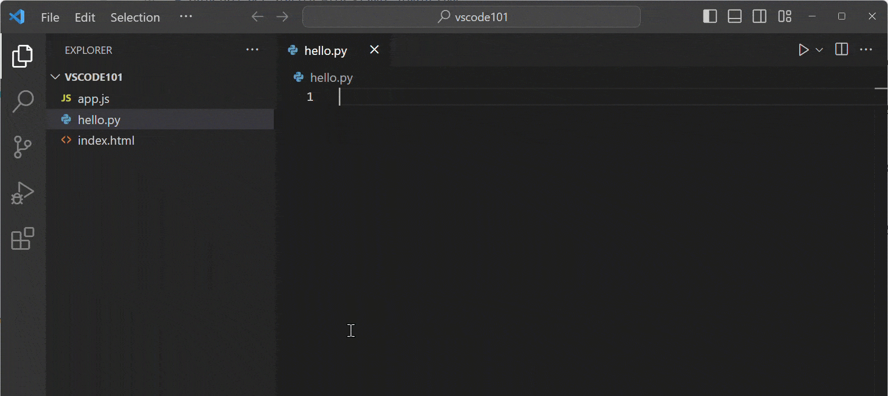

## 코드 실행 및 디버깅하기 {#run-and-debug-your-code}

VS Code는 Node.js 애플리케이션을 실행하고 디버깅하는 기본 지원을 제공합니다. 이 튜토리얼에서는 이전 단계에서 설치한 Python 확장을 사용하여 Python 프로그램을 디버깅합니다.

이제 이전 단계에서 만든 `hello.py` 프로그램을 디버깅해 보겠습니다.

1. 컴퓨터에 [Python 3](https://www.python.org/downloads/)가 설치되어 있는지 확인합니다.

   컴퓨터에 Python 인터프리터가 설치되어 있지 않으면 창의 오른쪽 하단에 알림이 표시됩니다. **인터프리터 선택**을 선택하여 **명령 팔레트**를 열고 사용하려는 Python 인터프리터를 선택하거나 설치합니다.

1. `hello.py` 파일에서 `print` 줄에 커서를 두고 `kbstyle(F9)`를 눌러 중단점을 설정합니다.

   편집기의 왼쪽 여백에 빨간 점이 나타나 중단점이 설정되었음을 나타냅니다. 중단점을 사용하면 특정 코드 줄에서 프로그램 실행을 일시 중지할 수 있습니다.

   

1. `kbstyle(F5)`를 눌러 디버깅 세션을 시작합니다.

   1. Python 디버거를 선택합니다:

      

   1. 현재 Python 파일을 실행하도록 선택합니다:

      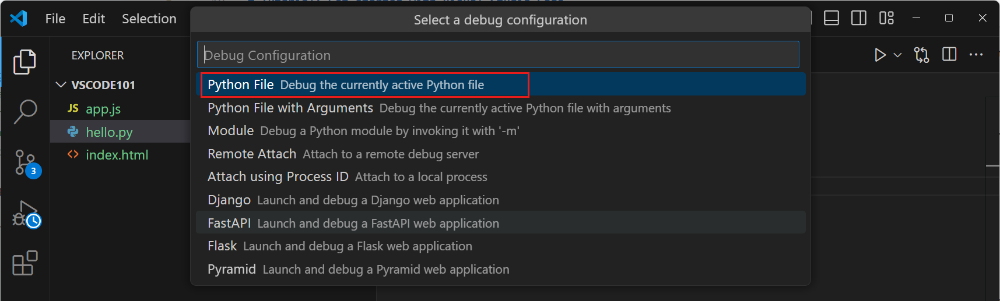

1. 프로그램이 시작되고 설정한 중단점에서 실행이 중지되는 것을 확인합니다.

   

   > [!TIP]
   > 실행이 일시 중지된 동안 편집기에서 `name` 변수 위에 마우스를 올려 변수의 값을 검사할 수 있습니다. **실행 및 디버그** 뷰의 **변수** 뷰에서 언제든지 변수의 값을 볼 수 있습니다.

1. 디버그 도구 모음에서 **계속** 버튼을 누르거나 `kbstyle(F5)`를 눌러 실행을 계속합니다.

   

VS Code에는 감시 변수, 조건부 중단점 및 시작 구성과 같은 더 많은 디버깅 기능이 있습니다. [VS Code에서 디버깅](/docs/editor/debugging.md)의 세부 정보를 확인하세요.

## AI 및 GitHub Copilot으로 코딩 향상하기 {#enhance-your-coding-with-ai-and-github-copilot}

GitHub Copilot은 코드를 더 빠르게 작성할 수 있도록 도와주는 AI 기반 도우미로, 코드 완성, 코드 리팩토링 및 오류 수정과 같은 다양한 작업을 도와줍니다.

Copilot에서 코드 제안을 받는 것으로 시작해 보겠습니다.

1. VS Code에서 Copilot을 설정했는지 확인합니다. [Copilot 설정](/docs/copilot/setup.md) 가이드를 따라 설정하세요.

   > [!TIP]
   > Copilot 구독이 아직 없다면, [Copilot 무료 요금제](https://github.com/github-copilot/signup)에 가입하여 무료로 Copilot을 사용할 수 있으며, 월간 완료 및 채팅 상호작용 한도가 제공됩니다.

1. `hello.py` 파일에서 파일 끝에 커서를 두고 다음 함수 헤더를 입력합니다.

   ```python
   def say_day_of_week(date)
   ```

   GitHub Copilot이 자동으로 함수의 나머지 부분을 제안합니다. 제안된 코드를 수락하려면 `kbstyle(Tab)`을 누릅니다.

1. 이제 새 함수를 호출해 보겠습니다.

   ```python
   say_day_of_week(date.today())
   ```

   `date` 키워드에 물결표가 표시되어 오류가 있음을 나타냅니다.

1. `date` 키워드 위에 커서를 두고 전구 아이콘을 선택한 다음 **Copilot으로 수정**을 선택합니다.

   

   GitHub Copilot이 오류 수정을 제안합니다. 제안이 마음에 들면 **수락**을 선택합니다.

   > [!TIP]
   > `kb(editor.action.quickFix)` 키보드 단축키를 사용하여 수동으로 빠른 수정을 트리거할 수도 있습니다.

VS Code에서 Copilot으로 할 수 있는 일이 더 많습니다. [VS Code에서 GitHub Copilot](/docs/copilot/getting-started.md)에 대한 자세한 정보를 확인하세요.

## 다음 단계 {#next-steps}

축하합니다! 튜토리얼을 완료하고 Visual Studio Code의 주요 기능을 탐색했습니다. 이제 Visual Studio Code의 기본 사항을 배웠으므로 다음에 대한 자세한 정보를 확인하세요:

- [코드에 대한 단위 테스트 발견 및 실행하기](/docs/editor/testing.md)

- [통합 터미널 사용하기](/docs/terminal/getting-started.md)

- [원격 개발 환경 설정하기](/docs/remote/remote-overview.md)