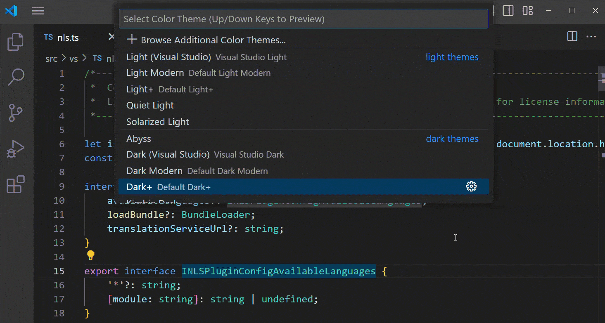

# VS Code 커스터마이징 {#personalize-vs-code}

VS Code는 매우 사용자 정의가 가능합니다. 색상 및 아이콘 테마로 편집기의 모양을 변경하고, 가장 익숙한 키보드 단축키를 지정할 수 있습니다. 설정을 통해 VS Code의 편집기, 사용자 인터페이스 및 기능 동작의 거의 모든 부분을 구성할 수 있습니다.

이 문서에서는 다음 주제를 다룹니다:

* [설정 구성하기](#configure-settings)
* [기본 키보드 단축키 변경하기](#change-default-keyboard-shortcuts)
* [테마로 VS Code의 모양 변경하기](#change-the-look-of-vs-code-with-themes)
* [표시 언어 변경하기](#change-the-display-language)

## 설정 구성하기 {#configure-settings}

VS Code의 거의 모든 측면은 설정을 통해 사용자 정의할 수 있습니다. 설정을 통해 단어 줄 바꿈을 활성화하거나 미니맵을 표시하는 등의 편집기 옵션을 구성하고, 언어별 디버거 설정을 설정하며, 작업 공간 신뢰를 활성화하는 등의 작업을 할 수 있습니다. Visual Studio Marketplace에서 확장을 설치하면 해당 확장이 자체 [확장 설정](/docs/getstarted/extensions.md#open-extension-settings)을 추가할 수 있습니다.

설정 편집기(`kb(workbench.action.openSettings)`)는 설정을 수정하기 위한 그래픽 인터페이스를 제공합니다. 설정을 수정하면 VS Code는 이를 `settings.json` 파일에 저장합니다. 선택적으로 `settings.json` 파일을 직접 편집할 수도 있습니다.

VS Code는 두 가지 유형의 설정을 제공합니다. _사용자 설정_은 모든 VS Code 인스턴스에 전역적으로 적용되며, _작업 공간 설정_은 프로젝트와 함께 저장되어 해당 프로젝트에만 적용됩니다. 설정 편집기에서 해당 탭을 사용하여 사용자 설정과 작업 공간 설정 간에 전환할 수 있습니다.

설정 편집기를 사용하여 VS Code에서 설정을 수정하려면:

1. **파일** > **환경 설정** > **설정** 메뉴를 통해 설정 편집기를 열거나 `kb(workbench.action.openSettings)`를 누릅니다.

1. 트리 뷰를 사용하거나 검색창에 입력하여 변경하려는 설정을 검색합니다.

1. 설정 편집기에서 설정을 수정합니다.

    > [!TIP]
    > 수정한 설정을 표시하려면 설정 편집기 검색창에서 **수정됨** 필터 값을 선택합니다.

VS Code에서 [설정 구성하기](/docs/editor/settings.md)에 대한 자세한 내용을 확인하고, 언어별 설정 구성이나 여러 기기 간 설정 동기화 방법을 알아보세요.

## 기본 키보드 단축키 변경하기 {#change-default-keyboard-shortcuts}

VS Code는 대부분의 작업을 키보드에서 직접 수행할 수 있도록 합니다. VS Code를 설치하면 [기본 키보드 단축키](/docs/reference/default-keybindings.md) 세트가 제공됩니다. VS Code 인터페이스의 UI 요소 위에 마우스를 올리면 사용 가능한 경우 해당 키보드 단축키를 확인할 수 있습니다. 명령 팔레트에서도 단축키가 있는 명령의 키보드 단축키를 표시합니다.

이 기본 단축키를 사용자 정의하거나 좋아하는 명령 및 작업에 대한 새로운 단축키를 추가하려면 키보드 단축키 편집기(`kb(workbench.action.openGlobalKeybindings)`)를 사용하세요.

키보드 단축키 편집기를 사용하여 VS Code에서 키보드 단축키를 변경하려면:

1. **파일** > **환경 설정** > **키보드 단축키**를 선택하거나 `kb(workbench.action.openGlobalKeybindings)` 단축키를 사용하여 키보드 단축키 편집기를 엽니다.
1. 변경하려는 명령 옆의 연필 아이콘을 선택합니다.
1. 해당 명령의 단축키로 지정할 키를 누릅니다.

_키맵 확장_을 사용하면 VS Code의 단축키를 선호하는 편집기의 단축키와 일치하도록 수정할 수 있습니다. 명령 팔레트에서 **환경 설정: 키맵** 명령을 선택하여 키맵 확장 목록을 확인하세요.

VS Code에서 [키보드 단축키 구성하기](/docs/editor/keybindings.md)에 대한 자세한 내용을 확인하고, 키보드 규칙 지정이나 여러 명령 실행 방법을 알아보세요.

## 테마로 VS Code의 모양 변경하기 {#change-the-look-of-vs-code-with-themes}

테마를 사용하면 VS Code의 외관을 개인의 취향에 맞게 수정할 수 있습니다. VS Code에는 여러 개의 기본 제공 테마가 포함되어 있습니다. [Visual Studio Marketplace](https://marketplace.visualstudio.com/vscode)에서 더 많은 테마를 설치할 수 있습니다.

_색상 테마_는 Visual Studio Code 사용자 인터페이스의 색상을 개인의 취향과 작업 환경에 맞게 수정할 수 있게 해줍니다. 테마는 VS Code 사용자 인터페이스 요소와 편집기 하이라이팅 색상 모두에 영향을 미칩니다. VS Code는 다양한 조명 환경과 개인 취향에 맞는 밝은 색상 테마와 어두운 색상 테마를 모두 지원합니다.

VS Code에서 색상 테마를 변경하려면:

1. 명령 팔레트를 엽니다(`kb(workbench.action.showCommands)`).
1. _color_를 입력한 후 **환경 설정: 색상 테마**를 선택합니다.
1. `kbstyle(Up)` 및 `kbstyle(Down)` 키를 사용하여 색상 테마를 미리 보고, `kbstyle(Enter)`를 사용하여 선택합니다.
1. 선택적으로 **추가 색상 테마 찾아보기**를 선택하여 [Visual Studio Marketplace](https://marketplace.visualstudio.com/vscode)에서 더 많은 색상 테마를 찾아볼 수 있습니다.

VS Code에는 파일 아이콘 테마나 자신만의 테마를 만드는 등 더 많은 테마 옵션이 제공됩니다. VS Code에서 [테마에 대한 자세한 내용](/docs/editor/themes.md)을 확인하세요.

## 표시 언어 변경하기 {#change-the-display-language}

Visual Studio Code는 기본적으로 영어를 표시 언어로 제공합니다. [Visual Studio Marketplace](https://marketplace.visualstudio.com/search?target=VSCode&category=Language%20Packs&sortBy=Installs)에서 언어 팩 확장을 설치하여 표시 언어를 변경할 수 있습니다.

VS Code는 운영 체제의 UI 언어를 감지하고, Marketplace에서 사용할 수 있는 경우 적절한 언어 팩을 설치하라는 메시지를 표시합니다.

현재 표시 언어를 변경하려면:

1. 명령 팔레트를 엽니다(`kb(workbench.action.showCommands)`).
1. **표시 언어 구성** 명령을 선택합니다.
1. 목록에서 선호하는 언어를 선택합니다.
1. 메시지가 표시되면 VS Code를 재시작합니다.

VS Code에서 [표시 언어 변경하기](/docs/editor/locales.md)에 대한 자세한 내용을 확인하세요.

## 다음 단계 {#next-steps}

VS Code를 개인화한 후에는 다음을 수행할 수 있습니다:

* [빠른 시작을 통해 주요 VS Code 기능 탐색하기](/docs/getstarted/getting-started.md)
* [프로그래밍 언어에 기능을 추가하는 확장 설치하기](/docs/getstarted/extensions.md)
* [Git으로 버전 관리 설정하기](/docs/sourcecontrol/overview.md)
* [프로젝트에 대한 디버깅 구성하기](/docs/editor/debugging.md)