# Visual Studio Code 팁과 요령 {#visual-studio-code-tips-and-tricks}

이 문서의 팁과 요령을 사용하여 Visual Studio Code를 효과적으로 활용하는 방법을 배우세요. 강력한 편집, 코드 인텔리전스 및 소스 코드 제어 기능에 익숙해지고 유용한 키보드 단축키를 배워보세요. [시작하기](/docs/getstarted/userinterface.md)와 [사용자 가이드](/docs/editor/codebasics.md)에서 다른 심층 주제를 탐색하여 더 많은 정보를 얻는 것을 잊지 마세요.

시작하는 단계라면, [VS Code 튜토리얼](/docs/getstarted/getting-started.md)을 확인하여 주요 기능을 단계별로 알아보세요.

> Visual Studio Code가 설치되어 있지 않다면, [다운로드](/download) 페이지로 가세요. [Linux에서 VS Code 실행하기](/docs/setup/linux.md), [macOS](/docs/setup/mac.md), [Windows](/docs/setup/windows.md)에서 플랫폼별 설치 지침을 찾을 수 있습니다.

비디오를 선호하시나요? VS Code Day 강연인 [Visual Studio Code 팁과 요령](https://learn.microsoft.com/en-us/events/visual-studio-code-vs-code-day-2021/vs-code-tips-and-tricks) 또는 [VS Code 경험 향상하기](https://learn.microsoft.com/en-us/shows/vs-code-day-2023/elevate-your-vs-code-experience)를 시청할 수 있습니다.

## 기본 사항 {#basics}

### 시작하기 {#getting-started}

VS Code를 직접 탐색하는 가장 좋은 방법은 **환영** 페이지를 열고 **워크스루**를 선택하여 설정 단계, 기능 및 VS Code가 제공하는 깊이 있는 사용자 정의를 자율적으로 탐색하는 것입니다. 탐색하고 배우는 동안 워크스루는 진행 상황을 추적합니다.

**도움말** > **환영** 메뉴에서 환영 페이지를 열거나 명령 팔레트에서 **Help: Welcome** 명령을 사용하세요 (`kb(workbench.action.showCommands)`).


확장 프로그램도 워크스루에 기여할 수 있습니다. 명령 팔레트에서 **Help: Open Walkthrough...** 명령을 사용하여 직접 워크스루를 열 수도 있습니다 (`kb(workbench.action.showCommands)`).

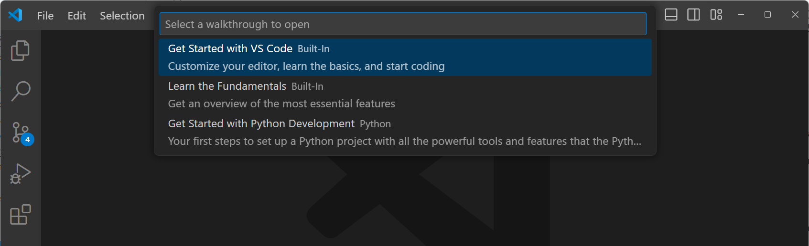

코드 편집 기술을 향상시키고 싶다면 **인터랙티브 에디터 놀이터**를 열어보세요. VS Code의 [코드 편집 기능](/docs/editor/codebasics.md), 다중 커서 편집, [IntelliSense](/docs/editor/intellisense.md), 스니펫, [Emmet](/docs/editor/emmet.md) 등을 시도해 보세요.

**도움말** > **에디터 놀이터** 메뉴에서 환영 페이지를 열거나 명령 팔레트에서 **Help: Interactive Editor Playground** 명령을 사용하세요 (`kb(workbench.action.showCommands)`).


### 명령 팔레트 {#command-palette}

현재 컨텍스트에 따라 사용 가능한 모든 명령에 접근하세요.

키보드 단축키: `kb(workbench.action.showCommands)`


> [!TIP]
> 마우스 커서를 사용하여 명령 팔레트의 상단 모서리를 잡고 다른 위치로 드래그하여 명령 팔레트를 이동할 수 있습니다. 제목 표시줄에서 **레이아웃 사용자 정의** 제어를 선택한 다음 미리 구성된 **빠른 입력 위치** 중 하나를 선택할 수도 있습니다.

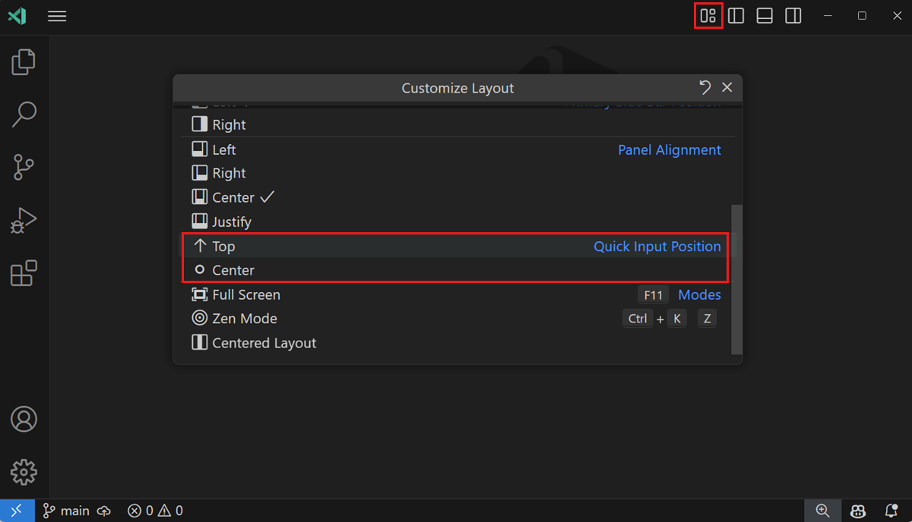

### 기본 키보드 단축키 {#default-keyboard-shortcuts}

명령 팔레트의 많은 명령에는 기본 키보드 단축키가 연결되어 있습니다. **명령 팔레트** (`kb(workbench.action.showCommands)`)에서 명령 옆에 기본 키보드 단축키를 확인할 수 있습니다.


### 키보드 참조 시트 {#keyboard-reference-sheets}

플랫폼에 맞는 키보드 단축키 참조 시트를 다운로드하세요 ([macOS](https://go.microsoft.com/fwlink/?linkid=832143), [Windows](https://go.microsoft.com/fwlink/?linkid=832145), [Linux](https://go.microsoft.com/fwlink/?linkid=832144)).


### 플로팅 창 {#floating-windows}

편집기를 플로팅 창에서 열 수 있습니다. 예를 들어, 편집기를 모니터의 다른 위치로 이동하거나 다른 모니터로 이동할 수 있습니다.

편집기를 플로팅 창에서 열려면, 주 창에서 편집기를 드래그하여 현재 VS Code 창 외부의 아무 곳에나 놓으세요. 편집기를 분리하는 또 다른 방법은 편집기 탭을 마우스 오른쪽 버튼으로 클릭하고 **새 창으로 이동** (`workbench.action.moveEditorToNewWindow`) 또는 **새 창으로 복사** (`kb(workbench.action.copyEditorToNewWindow)`) 옵션을 선택하는 것입니다.

<video src="images/tips-and-tricks/floating-windows.mp4" autoplay loop controls muted></video>

### 통합 터미널 {#integrated-terminal}

키보드 단축키: `kb(workbench.action.terminal.toggleTerminal)`


드롭다운에서 다른 터미널 셸을 선택할 수 있습니다. 운영 체제 및 시스템 구성에 따라 서로 다른 셸이 나열될 수 있습니다.

추가 읽기:

* [통합 터미널](/docs/terminal/basics.md) 문서
* [VS Code의 터미널 마스터하기](https://www.growingwiththeweb.com/2017/03/mastering-vscodes-terminal.html) 기사

### 사이드바 토글 {#toggle-sidebar}

키보드 단축키: `kb(workbench.action.toggleSidebarVisibility)`


### 패널 토글 {#toggle-panel}

키보드 단축키: `kb(workbench.action.togglePanel)`

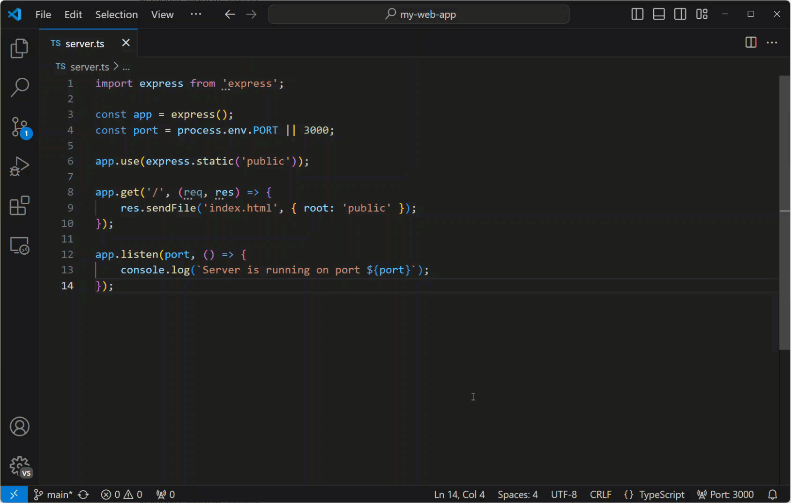

### 젠 모드 {#zen-mode}

방해 없는 젠 모드로 들어가세요.

키보드 단축키: `kb(workbench.action.toggleZenMode)`

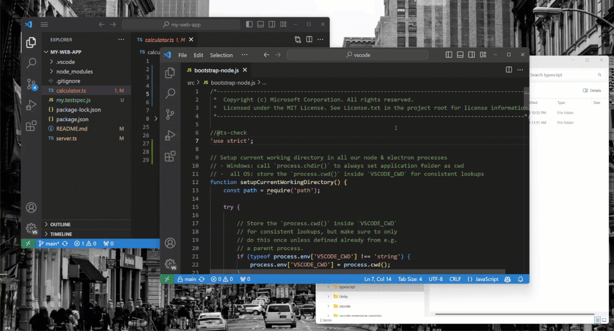

젠 모드에서 나가려면 `kbstyle(Esc)`를 두 번 누르세요.

## 명령줄 {#command-line}

VS Code는 강력한 명령줄 인터페이스(CLI)를 제공하여 편집기가 다양한 시나리오를 지원하도록 사용자 정의할 수 있습니다. 예를 들어, 두 파일을 비교하기 위해 차이 편집기를 열기 위해 명령줄에서 VS Code를 시작할 수 있습니다.

> VS Code 바이너리가 경로에 포함되어 있어야 'code'를 입력하여 VS Code를 실행할 수 있습니다. 설치 중에 VS Code가 환경 경로에 추가된 경우 플랫폼별 설정 주제를 참조하세요 ([Linux에서 VS Code 실행하기](/docs/setup/linux.md), [macOS](/docs/setup/mac.md), [Windows](/docs/setup/windows.md)).

```bash
# 현재 디렉토리에서 코드 열기 {#open-code-with-current-directory}
code .

# 가장 최근에 사용한 코드 창에서 현재 디렉토리 열기 {#open-the-current-directory-in-the-most-recently-used-code-window}
code -r .

# 새 창 만들기 {#create-a-new-window}
code -n

# 언어 변경 {#change-the-language}
code --locale=es

# 차이 편집기 열기 {#open-diff-editor}
code --diff <file1> <file2>

# 특정 줄 및 열에서 파일 열기 <file:line[:character]> {#open-file-at-specific-line-and-column-filelinecharacter}
code --goto package.json:10:5

# 도움말 옵션 보기 {#see-help-options}
code --help

# 모든 확장 비활성화 {#disable-all-extensions}
code --disable-extensions .
```

### .vscode 폴더 {#vscode-folder}

작업 공간별 구성 파일은 작업 공간의 루트에 있는 `.vscode` 폴더에 있습니다. 예를 들어, [작업 실행기](/docs/editor/tasks.md)를 위한 `tasks.json`과 [디버거](/docs/editor/debugging.md)를 위한 `launch.json`이 있습니다.

## 상태 표시줄 {#status-bar}

### 오류 및 경고 {#errors-and-warnings}

키보드 단축키: `kb(workbench.actions.view.problems)`

프로젝트의 오류 및 경고로 빠르게 이동하세요.

`kb(editor.action.marker.nextInFiles)` 또는 `kb(editor.action.marker.prevInFiles)`를 사용하여 오류를 순환할 수 있습니다.


문제 목록은 유형('정보', '오류', '경고') 또는 일치하는 텍스트로 필터링할 수 있습니다.

### 언어 모드 변경 {#change-language-mode}

상태 표시줄의 언어 모드는 활성 편집기와 연결된 언어(예: Markdown, Python 등)를 나타냅니다. 상태 표시줄의 언어 모드 표시기를 선택하거나 키보드 단축키를 사용하여 현재 편집기의 언어 모드를 변경할 수 있습니다.

키보드 단축키: `kb(workbench.action.editor.changeLanguageMode)`


파일 유형에 대해 새 언어 모드를 유지하려면 **파일 연결 구성** 명령을 사용하여 현재 파일 확장자를 설치된 언어와 연결하세요.

## 사용자 정의 {#customization}

VS Code를 개인의 취향에 맞게 사용자 정의할 수 있는 많은 옵션이 있습니다:

* 테마 변경
* 키보드 단축키 변경
* 설정 조정
* JSON 유효성 검사 추가
* 스니펫 생성
* 확장 프로그램 설치

### 테마 변경 {#change-your-theme}

VS Code에는 여러 가지 기본 제공 [색상 테마](/docs/editor/themes.md)가 포함되어 있습니다. **환경 설정: 색상 테마** 명령을 사용하거나 키보드 단축키를 사용하세요.

키보드 단축키: `kb(workbench.action.selectTheme)`

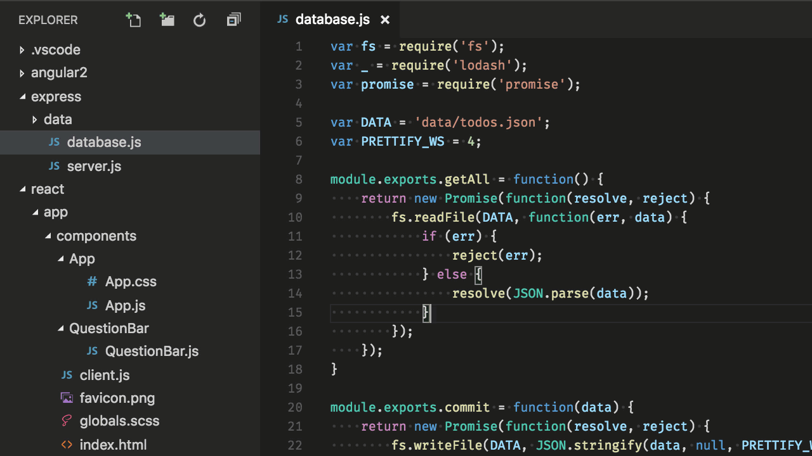

VS Code 확장 프로그램 [마켓플레이스](https://marketplace.visualstudio.com/search?target=VSCode&category=Themes&sortBy=Installs)에서 더 많은 테마를 설치할 수 있습니다. **환경 설정: 색상 테마** > **+ 추가 색상 테마 찾아보기...** 명령을 선택하여 마켓플레이스에서 테마를 검색하세요.

또한 파일 아이콘 테마를 설치하고 변경할 수 있습니다.


### 키맵 {#keymaps}

다른 편집기에서 키보드 단축키에 익숙하신가요? 좋아하는 편집기의 키보드 단축키를 VS Code로 가져오는 키맵 확장 프로그램을 설치할 수 있습니다. **환경 설정: 키맵** 명령을 사용하여 [Visual Studio Marketplace](https://marketplace.visualstudio.com/search?target=VSCode&category=Keymaps&sortBy=Installs)에서 현재 목록을 확인하세요.

더 인기 있는 키맵은 다음과 같습니다:

* [Vim](https://marketplace.visualstudio.com/items?itemName=vscodevim.vim)
* [Sublime Text 키맵](https://marketplace.visualstudio.com/items?itemName=ms-vscode.sublime-keybindings)
* [Emacs 키맵](https://marketplace.visualstudio.com/items?itemName=hiro-sun.vscode-emacs)
* [Atom 키맵](https://marketplace.visualstudio.com/items?itemName=ms-vscode.atom-keybindings)
* [Brackets 키맵](https://marketplace.visualstudio.com/items?itemName=ms-vscode.brackets-keybindings)
* [Eclipse 키맵](https://marketplace.visualstudio.com/items?itemName=alphabotsec.vscode-eclipse-keybindings)
* [Visual Studio 키맵](https://marketplace.visualstudio.com/items?itemName=ms-vscode.vs-keybindings)

### 키보드 단축키 사용자 정의 {#customize-your-keyboard-shortcuts}

**키보드 단축키** 편집기에서 키보드 단축키를 보고 사용자 정의할 수 있습니다. **환경 설정: 키보드 단축키 열기** 명령을 사용하거나 단축키를 사용하여 편집기를 여세요.

키보드 단축키: `kb(workbench.action.openGlobalKeybindings)`

특정 항목에서 연필 아이콘을 선택하거나 `kbstyle(Enter)`를 사용하여 키보드 단축키를 편집하세요. 검색 필드를 사용하여 목록을 필터링할 수 있습니다.


단축키를 검색하고 `keybindings.json` 파일에 자신의 키보드 단축키를 추가할 수도 있습니다.


[Visual Studio Code의 키 바인딩](/docs/editor/keybindings.md)에서 더 많은 정보를 확인하세요.

### 설정 조정 {#tune-your-settings}

기본적으로 VS Code는 설정을 보고 편집할 수 있는 설정 편집기를 표시합니다. **사용자 설정 열기 (JSON)** 명령을 사용하거나 `setting(workbench.settings.editor)` 설정으로 기본 설정 편집기를 변경하여 기본 `settings.json` 파일을 편집할 수 있습니다.

사용자 설정 `settings.json` 열기

키보드 단축키: `kb(workbench.action.openSettings)`

다양한 UI 요소의 글꼴 크기 변경

```json
// 메인 편집기
"editor.fontSize": 18,
// 터미널 패널
"terminal.integrated.fontSize": 14,
// 출력 패널
"[Log]": {
    "editor.fontSize": 15
}
```

줌 수준 변경

```json
"window.zoomLevel": 5
```

글꼴 리가처

```json
"editor.fontFamily": "Fira Code",
"editor.fontLigatures": true
```

> **팁:** 글꼴 리가처를 지원하는 글꼴이 설치되어 있어야 합니다. [FiraCode](https://github.com/tonsky/FiraCode)는 VS Code 팀에서 인기 있는 글꼴입니다.


자동 저장

```json
"files.autoSave": "afterDelay"
```

상위 메뉴에서 **파일** > **자동 저장**으로 자동 저장을 토글할 수도 있습니다.

저장 시 포맷

```json
"editor.formatOnSave": true
```

붙여넣기 시 포맷

```json
"editor.formatOnPaste": true
```

탭 문자 크기 변경

```json
"editor.tabSize": 4
```

공백 또는 탭

```json
"editor.insertSpaces": true
```

공백 표시

```json
"editor.renderWhitespace": "all"
```

공백 문자는 기본적으로 텍스트 선택에서 렌더링됩니다.

파일/폴더 무시

편집기 창에서 이러한 파일/폴더를 제거합니다.

```json
"files.exclude": {
    "somefolder/": true,
    "somefile": true
}
```

검색 결과에서 이러한 파일/폴더를 제거합니다.

```json
"search.exclude": {
    "someFolder/": true,
    "somefile": true
}
```

다양한 [기타 사용자 정의](/docs/editor/settings.md)에 대해 알아보세요.

### 언어별 설정 {#language-specific-settings}

특정 언어에 대한 설정 범위를 지정할 수 있습니다. 언어 식별자를 사용하여 설정할 수 있습니다. 일반적으로 사용되는 언어 ID 목록은 [언어 식별자](/docs/languages/identifiers.md) 참조에서 확인할 수 있습니다.

```json
"[languageid]": {

}
```

> **팁:** **언어별 설정 구성** 명령을 사용하여 언어별 설정을 만들 수도 있습니다.
>
> 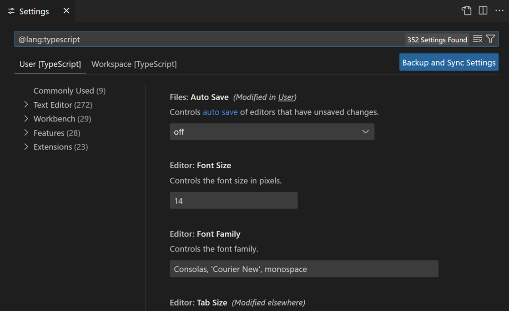

### JSON 유효성 검사 추가 {#add-json-validation}

JSON 유효성 검사는 많은 파일 유형에 대해 기본적으로 활성화되어 있습니다. `settings.json`에서 자신의 스키마와 유효성 검사를 생성하세요:

```json
"json.schemas": [
    {
        "fileMatch": [
            "bower.json"
        ],
        "url": "https://json.schemastore.org/bower"
    }
]
```

작업 공간에 정의된 스키마의 경우:

```json
"json.schemas": [
    {
        "fileMatch": [
            "**/foo.json"
        ],
        "url": "./myschema.json"
    }
]
```

사용자 정의 스키마를 사용하려면:

```json
"json.schemas": [
    {
        "fileMatch": [
            "/.myconfig"
        ],
        "schema": {
            "type": "object",
            "properties": {
                "name" : {
                    "type": "string",
                    "description": "항목의 이름"
                }
            }
        }
    }
]
```

[JSON](/docs/languages/json.md) 문서에서 더 많은 정보를 확인하세요.

### 기본 브라우저 구성 {#configure-the-default-browser}

VS Code에서는 링크를 `kbstyle(Ctrl+click)` (`kbstyle(Cmd+click)` macOS에서)하여 기본 브라우저에서 열 수 있습니다. 기본 브라우저는 `setting(workbench.externalBrowser)` [설정](/docs/editor/settings.md)을 설정하여 구성할 수 있습니다.

설정 값으로 브라우저 실행 파일의 전체 경로를 지정하세요. 또는 장치 간의 올바른 작동을 보장하기 위해 `edge`, `chrome`, `firefox`와 같은 브라우저 별칭을 사용할 수도 있습니다.

```json
"workbench.externalBrowser": "edge"
```

### 여러 로그를 단일 보기로 결합 {#combine-multiple-logs-into-a-single-view}

출력 패널은 다양한 서비스의 출력을 표시합니다. 각 서비스는 일반적으로 자체 로그를 가지고 있습니다. 여러 서비스의 관련 로그 정보를 분석하기 위해 여러 로그를 단일 _복합 로그_로 결합할 수 있습니다.

출력 패널의 오버플로우 메뉴에서 **복합 로그 만들기...**를 선택하세요.

<video src="images/tips-and-tricks/compound-log.mp4" title="두 개의 다른 로그에서 로그 메시지를 결합하는 복합 로그를 만드는 방법을 보여주는 비디오." autoplay loop controls muted></video>

## 확장 프로그램 {#extensions}

키보드 단축키: `kb(workbench.view.extensions)`

### 확장 프로그램 찾기 {#find-extensions}

여러 출처를 사용하여 확장 프로그램을 찾을 수 있습니다:

* VS Code [마켓플레이스](https://marketplace.visualstudio.com/vscode).
* VS Code 내에서 **확장 프로그램** 보기에서 검색.
* 확장 프로그램 추천 보기
* [awesome-vscode](https://github.com/viatsko/awesome-vscode)와 같은 커뮤니티 큐레이션 확장 프로그램 목록.

### 인기 있는 확장 프로그램 찾기 {#find-popular-extensions}

**확장 프로그램** 보기에서 **필터** 제어를 선택한 다음 **가장 인기 있는** 또는 **정렬 기준** > **설치 수**를 선택하세요.


### 확장 프로그램 추천 {#extension-recommendations}

**확장 프로그램** 보기에서 **필터** 제어를 선택한 다음 **추천**을 선택하여 추천 확장 프로그램 목록을 확인하세요.

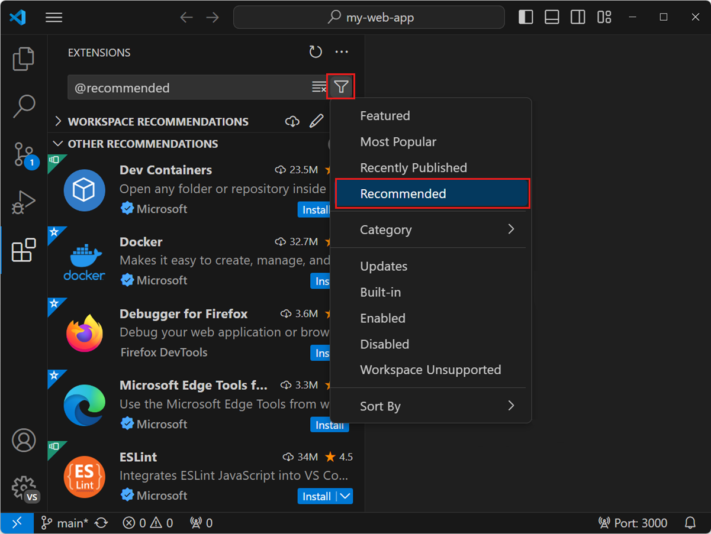

### 나만의 확장 프로그램 만들기 {#create-your-own-extension}

자신만의 확장 프로그램을 만드는 데 관심이 있으신가요? [확장 API 문서](/api)에서 이를 배우고, 특히 [기여 포인트에 대한 문서](/api/references/contribution-points.md)를 확인하세요.

* 구성
* 명령
* 키보드 단축키
* 언어
* 디버거
* 문법
* 테마
* 스니펫
* jsonValidation

## 파일 및 폴더 {#files-and-folders}

### 간단한 파일 대화 상자 {#simple-file-dialog}

간단한 파일 대화 상자를 사용하면 VS Code 내에서 파일 및 폴더를 열고 저장하기 위해 시스템의 기본 파일 대화 상자를 더 간단한 빠른 선택 대화 상자로 대체할 수 있습니다.

설정: `setting(files.simpleDialog)`

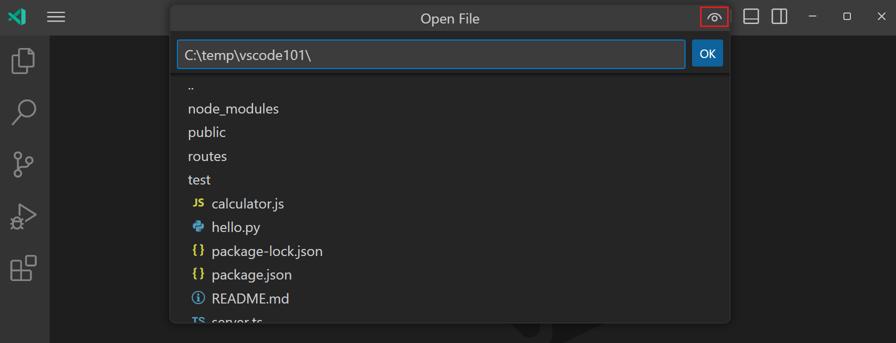

> [!TIP]
> 오른쪽 상단의 눈 아이콘을 사용하여 점으로 시작하는 파일 및 폴더를 표시하거나 숨길 수 있습니다.

### 탐색기 보기 표시 {#show-explorer-view}

키보드 단축키: `kb(workbench.view.explorer)`

### 빠른 열기 {#quick-open}

파일을 빠르게 검색하고 엽니다.

키보드 단축키: `kb(workbench.action.quickOpen)`


**팁:** `kbstyle(?)`를 입력하여 명령 제안을 확인하세요.


`edt` 또는 `term`과 같은 명령을 입력한 후 공백을 입력하면 드롭다운 목록이 나타납니다.


#### 최근에 열린 파일 간 탐색 {#navigate-between-recently-opened-files}

**빠른 열기** 키보드 단축키를 반복해서 눌러 최근에 열린 파일 간에 빠르게 순환할 수 있습니다.

#### 빠른 열기에서 여러 파일 열기 {#open-multiple-files-from-quick-open}

`kbstyle(Right Arrow)`를 눌러 **빠른 열기**에서 여러 파일을 열 수 있습니다. 이렇게 하면 현재 선택된 파일이 백그라운드에서 열리고, **빠른 열기**에서 계속 파일을 선택할 수 있습니다.

### 최근에 열린 폴더 및 작업 공간 간 탐색 {#navigate-between-recently-opened-folders-and-workspaces}

최근 폴더 또는 작업 공간을 엽니다.

키보드 단축키: `kb(workbench.action.openRecent)`

최근에 열린 폴더와 작업 공간, 그 뒤에 파일이 나열된 **파일** > **최근 열기** 목록의 빠른 선택 드롭다운이 표시됩니다.

### 링크에서 파일 만들기 또는 열기 {#create-or-open-a-file-from-a-link}

키보드 단축키: `kbstyle(Ctrl+click)` (`kbstyle(Cmd+click)` macOS에서)

파일 링크로 커서를 이동한 후 `kbstyle(Ctrl+click)`를 눌러 파일이나 이미지를 빠르게 열거나 새 파일을 만들 수 있습니다.


### 현재 열린 폴더 닫기 {#close-the-currently-opened-folder}

키보드 단축키: `kb(workbench.action.closeFolder)`

### 탐색 기록 {#navigation-history}

전체 기록 탐색: `kb(workbench.action.quickOpenPreviousRecentlyUsedEditorInGroup)`

뒤로 탐색: `kb(workbench.action.navigateBack)`

앞으로 탐색: `kb(workbench.action.navigateForward)`


### 파일 연결 {#file-associations}

정확하게 감지되지 않는 파일에 대한 언어 연결을 생성합니다. 예를 들어, 많은 구성 파일이 사용자 정의 파일 확장자를 가지고 있지만 실제로는 JSON입니다.

```json
"files.associations": {
    ".database": "json"
}
```

### 더러운 쓰기 방지 {#preventing-dirty-writes}

VS Code는 디스크에서 변경된 파일을 저장하려고 할 때 오류 메시지를 표시합니다. VS Code는 편집기 외부에서 변경된 내용을 덮어쓰지 않도록 파일 저장을 차단합니다.

저장 충돌을 해결하려면 알림 팝업에서 **비교** 작업을 선택하여 디스크의 파일 내용(왼쪽)과 VS Code의 내용(오른쪽)을 보여주는 차이 편집기를 엽니다:


편집기 도구 모음의 작업을 사용하여 저장 충돌을 해결할 수 있습니다. 변경 사항을 **수락**하여 디스크의 변경 사항을 덮어쓰거나, 디스크의 버전으로 **되돌리기**를 선택할 수 있습니다. 되돌리기는 변경 사항이 손실됨을 의미합니다.

**참고:** 충돌을 해결하기 위해 두 가지 작업 중 하나를 선택할 때까지 파일은 더러운 상태로 남아 있으며 저장할 수 없습니다.

## 편집 해킹 {#editing-hacks}

코드를 편집하기 위한 일반적인 기능을 선택했습니다. 다른 편집기의 키보드 단축키에 더 익숙하다면 [키맵 확장](https://marketplace.visualstudio.com/search?target=VSCode&category=Keymaps&sortBy=Installs)을 설치하는 것을 고려해 보세요.

**팁**: **확장** 뷰에서 `@recommended:keymaps`로 검색을 필터링하여 추천 키맵 확장을 확인할 수 있습니다.

### 나란히 편집 {#side-by-side-editing}

키보드 단축키: `kb(workbench.action.splitEditor)`

편집기를 드래그 앤 드롭하여 새로운 편집기 그룹을 만들고 편집기를 그룹 간에 이동할 수도 있습니다.


### 편집기 간 전환 {#switch-between-editors}

키보드 단축키: `kb(workbench.action.focusFirstEditorGroup)`, `kb(workbench.action.focusSecondEditorGroup)`, `kb(workbench.action.focusThirdEditorGroup)`

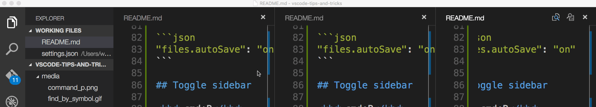

### 다중 커서 선택 {#multi-cursor-selection}

임의의 위치에 커서를 추가하려면 마우스로 위치를 선택하고 `kbstyle(Alt+Click)` (`kbstyle(Option+Click)` macOS에서)를 사용합니다.

현재 위치 위 또는 아래에 커서를 설정하려면 다음을 사용하세요:

키보드 단축키: `kb(editor.action.insertCursorAbove)` 또는 `kb(editor.action.insertCursorBelow)`


현재 선택의 모든 발생에 추가 커서를 추가하려면 `kb(editor.action.selectHighlights)`를 사용할 수 있습니다.


> 참고: 현재 선택의 모든 발생을 추가하고 싶지 않다면 대신 `kb(editor.action.addSelectionToNextFindMatch)`를 사용할 수 있습니다. 이는 선택한 다음 발생만 선택하므로 선택을 하나씩 추가할 수 있습니다.


### 열(상자) 선택 {#column-box-selection}

마우스를 드래그하는 동안 `kbstyle(Shift+Alt)` (`kbstyle(Shift+Option)` macOS에서)를 누르고 있으면 텍스트 블록을 선택할 수 있습니다. 선택한 각 줄의 끝에 별도의 커서가 추가됩니다.


열 선택을 트리거하기 위해 [키보드 단축키](/docs/editor/codebasics.md#column-box-selection)를 사용할 수도 있습니다.

### 수직 눈금자 {#vertical-rulers}

`setting(editor.rulers)` 설정을 사용하여 편집기에 수직 열 눈금을 추가할 수 있으며, 이는 수직 눈금을 추가하고자 하는 열 문자 위치의 배열을 사용합니다.

```json
{
    "editor.rulers": [
        20, 40, 60
    ]
}
```


### 빠른 스크롤 {#fast-scrolling}

`kbstyle(Alt)` 키를 누르면 편집기와 탐색기에서 빠른 스크롤이 활성화됩니다. 기본적으로 빠른 스크롤은 5배 속도 배수를 사용하지만 **편집기: 빠른 스크롤 감도** (`setting(editor.fastScrollSensitivity)`) 설정으로 배수를 조절할 수 있습니다.

### 고정 스크롤 {#locked-scrolling}

**보기: 편집기 간 고정 스크롤 전환** 명령을 사용하여 모든 표시된 편집기에서 스크롤을 동기화할 수 있습니다. 즉, 한 편집기에서 스크롤할 때 모든 다른 편집기도 같은 양만큼 스크롤되어 모든 것이 정렬됩니다.

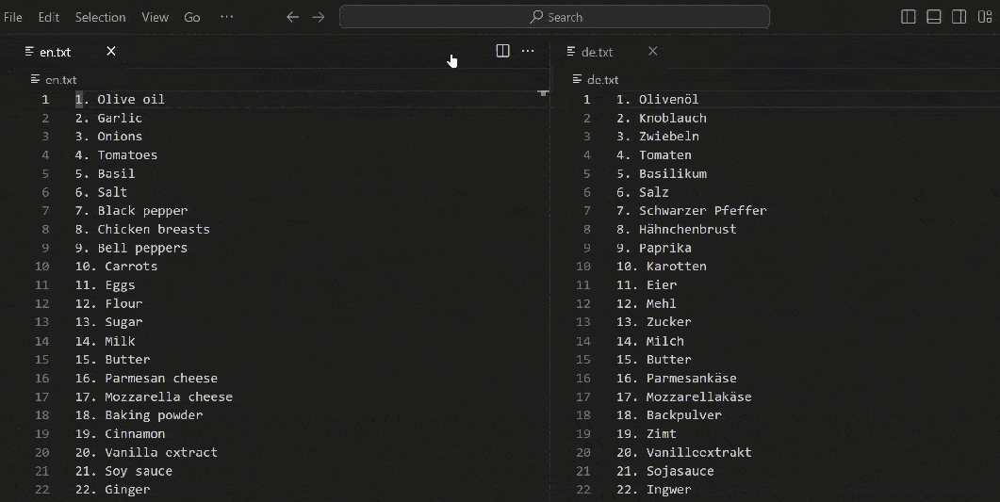

특정 키보드 단축키를 누르고 있을 때만 스크롤 동기화를 활성화하도록 선택할 수 있습니다. `workbench.action.holdLockedScrolling` 명령에 대한 키보드 단축키를 설정하여 편집기 간의 스크롤을 일시적으로 고정할 수 있습니다.

### 줄 복사 위/아래 {#copy-line-up-down}

키보드 단축키: `kb(editor.action.copyLinesUpAction)` 또는 `kb(editor.action.copyLinesDownAction)`

> **줄 복사 위/아래** 명령은 리눅스에서 바인딩되지 않았습니다. VS Code 기본 키보드 단축키가 우분투 키보드 단축키와 충돌하기 때문입니다. [문제 #509](https://github.com/microsoft/vscode/issues/509)를 참조하세요. 여전히 `editor.action.copyLinesUpAction` 및 `editor.action.copyLinesDownAction` 명령을 원하는 키보드 단축키로 설정할 수 있습니다.

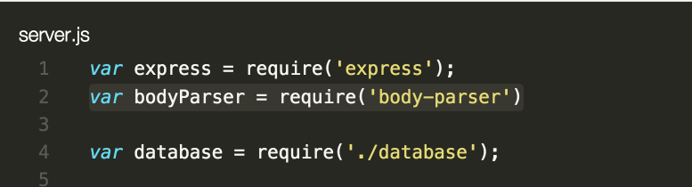

### 줄 위/아래 이동 {#move-line-up-and-down}

키보드 단축키: `kb(editor.action.moveLinesUpAction)` 또는 `kb(editor.action.moveLinesDownAction)`


### 선택 축소/확장 {#shrink-expand-selection}

키보드 단축키: `kb(editor.action.smartSelect.shrink)` 또는 `kb(editor.action.smartSelect.expand)`


자세한 내용은 [기본 편집](/docs/editor/codebasics.md#shrinkexpand-selection) 문서를 참조하세요.

### 파일 내 기호로 이동 {#go-to-symbol-in-file}

키보드 단축키: `kb(workbench.action.gotoSymbol)`

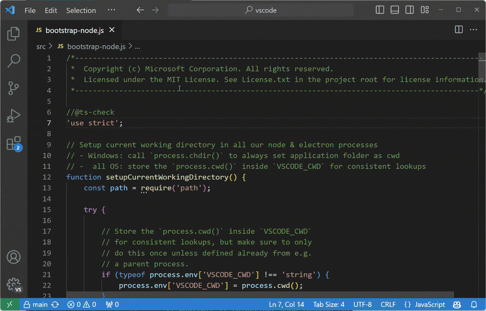

기호를 종류별로 그룹화하려면 콜론을 추가하세요, `@:`.


### 작업 공간 내 기호로 이동 {#go-to-symbol-in-workspace}

키보드 단축키: `kb(workbench.action.showAllSymbols)`


### 개요 보기 {#outline-view}

파일 탐색기의 개요 보기(기본적으로 하단에 축소됨)는 현재 열려 있는 파일의 기호를 보여줍니다.


기호 이름, 카테고리 및 파일 내 위치별로 정렬할 수 있으며 기호 위치로의 빠른 탐색을 허용합니다.

### 특정 줄로 이동 {#navigate-to-a-specific-line}

키보드 단축키: `kb(workbench.action.gotoLine)`

### 커서 위치 되돌리기 {#undo-cursor-position}

키보드 단축키: `kb(cursorUndo)`

### 후행 공백 제거 {#trim-trailing-whitespace}

키보드 단축키: `kb(editor.action.trimTrailingWhitespace)`


### 텍스트 변환 명령 {#transform-text-commands}

선택한 텍스트를 대문자, 소문자 및 제목 대문자로 변경할 수 있습니다. **변환** 명령은 명령 팔레트에서 사용할 수 있습니다.


### 코드 포맷팅 {#code-formatting}

현재 선택된 소스 코드: `kb(editor.action.formatSelection)`

전체 문서 포맷: `kb(editor.action.formatDocument)`


### 코드 접기 {#code-folding}

키보드 단축키: `kb(editor.fold)`, `kb(editor.unfold)` 및 `kb(editor.toggleFold)`


**모두 접기** (`kb(editor.foldAll)`) 및 **모두 펼치기** (`kb(editor.unfoldAll)`)를 사용하여 편집기에서 모든 영역을 접거나 펼칠 수 있습니다.

**모든 블록 주석 접기** (`kb(editor.foldAllBlockComments)`)를 사용하여 모든 블록 주석을 접을 수 있습니다.

### 현재 줄 선택 {#select-current-line}

키보드 단축키: `kb(expandLineSelection)`

### 파일의 시작과 끝으로 이동 {#navigate-to-beginning-and-end-of-file}

키보드 단축키: `kb(cursorTop)` 및 `kb(cursorBottom)`

### Markdown 미리보기 열기 {#open-markdown-preview}

Markdown 파일에서 사용

키보드 단축키: `kb(markdown.showPreview)`


### 나란히 Markdown 편집 및 미리보기 {#side-by-side-markdown-edit-and-preview}

Markdown 파일에서 사용

키보드 단축키: `kb(markdown.showPreviewToSide)`

미리보기와 편집기는 두 보기에서 스크롤을 동기화합니다.

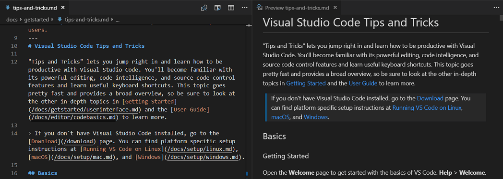

## IntelliSense {#intellisense}

`kb(editor.action.triggerSuggest)`를 사용하여 제안 위젯을 트리거합니다.


사용 가능한 메서드, 매개변수 힌트, 짧은 문서 등을 볼 수 있습니다.

### 미리 보기 {#peek}

기호를 선택한 다음 `kb(editor.action.peekDefinition)`을 입력합니다. 또는 컨텍스트 메뉴를 사용할 수 있습니다.


### 정의로 이동 {#go-to-definition}

기호를 선택한 다음 `kb(editor.action.revealDefinition)`을 입력합니다. 또는 컨텍스트 메뉴를 사용하거나 `kbstyle(Ctrl+click)` (`kbstyle(Cmd+click)` macOS에서)을 사용할 수 있습니다.


**이동** > **뒤로** 명령 또는 `kb(workbench.action.navigateBack)`를 사용하여 이전 위치로 돌아갈 수 있습니다.

타입 위에 마우스를 올릴 때 `kbstyle(Ctrl)` (`kbstyle(Cmd)` macOS에서)을 누르면 타입 정의도 볼 수 있습니다.

### 참조로 이동 {#go-to-references}

기호를 선택한 다음 `kb(editor.action.goToReferences)`를 입력합니다. 또는 컨텍스트 메뉴를 사용할 수 있습니다.


### 모든 참조 보기 {#find-all-references-view}

기호를 선택한 다음 `kb(references-view.findReferences)`를 입력하여 파일의 모든 기호를 보여주는 참조 보기를 엽니다.

### 기호 이름 바꾸기 {#rename-symbol}

기호를 선택한 다음 `kb(editor.action.rename)`을 입력합니다. 또는 컨텍스트 메뉴를 사용할 수 있습니다.

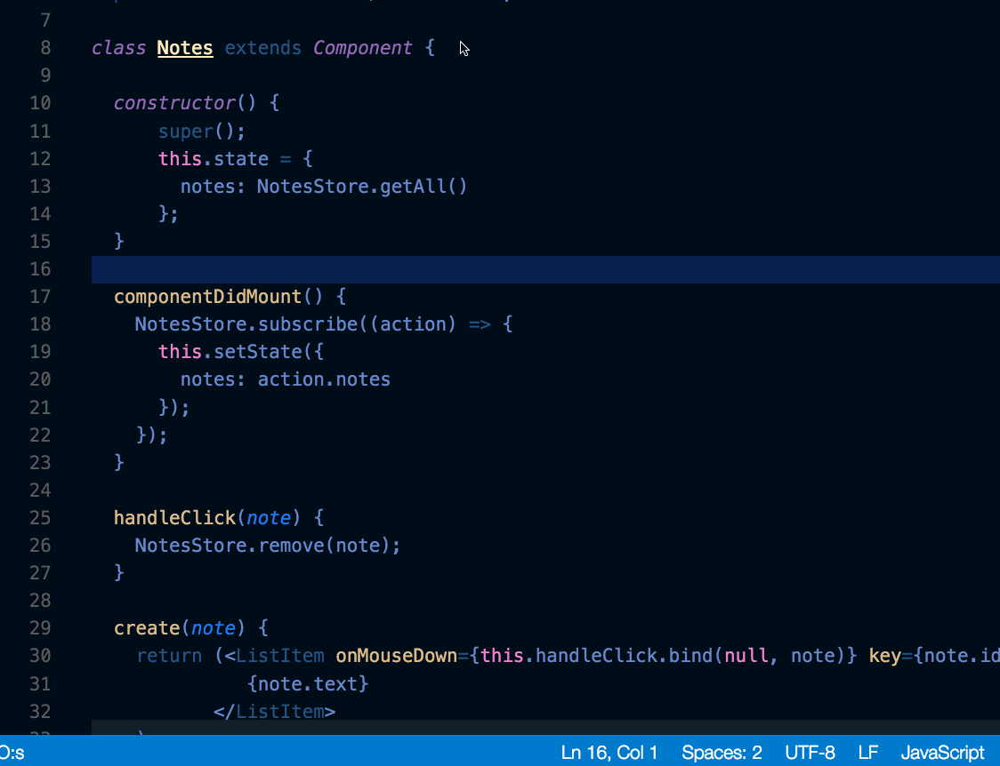

### 검색 및 수정 {#search-and-modify}

표현식을 검색하고 바꾸는 것 외에도 정규 표현식을 사용하여 일치한 부분의 일부를 검색하고 재사용할 수 있습니다. **정규 표현식 사용** `.*` 버튼 (`kb(toggleSearchRegex)`)을 클릭하여 검색 상자에서 정규 표현식을 활성화한 다음 정규 표현식을 작성하고 괄호를 사용하여 그룹을 정의합니다. 그런 다음 교체 필드에서 `$1`, `$2` 등을 사용하여 각 그룹에서 일치한 내용을 재사용할 수 있습니다.

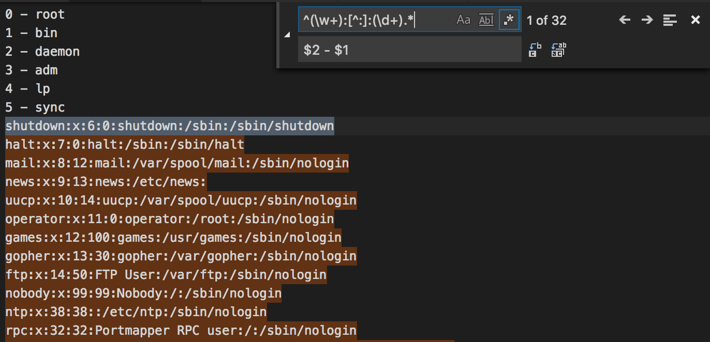

### .eslintrc.json {#eslintrcjson}

[ESLint 확장](https://marketplace.visualstudio.com/items?itemName=dbaeumer.vscode-eslint)을 설치합니다. 원하는 대로 린터를 구성하세요. 린팅 규칙 및 옵션에 대한 자세한 내용은 [ESLint 사양](https://eslint.org/docs/user-guide/configuring)을 참조하세요.

ES6를 사용하기 위한 구성입니다.

```json
{
    "env": {
        "browser": true,
        "commonjs": true,
        "es6": true,
        "node": true
    },
    "parserOptions": {
        "ecmaVersion": 6,
        "sourceType": "module",
        "ecmaFeatures": {
            "jsx": true,
            "classes": true,
            "defaultParams": true
        }
    },
    "rules": {
        "no-const-assign": 1,
        "no-extra-semi": 0,
        "semi": 0,
        "no-fallthrough": 0,
        "no-empty": 0,
        "no-mixed-spaces-and-tabs": 0,
        "no-redeclare": 0,
        "no-this-before-super": 1,
        "no-undef": 1,
        "no-unreachable": 1,
        "no-use-before-define": 0,
        "constructor-super": 1,
        "curly": 0,
        "eqeqeq": 0,
        "func-names": 0,
        "valid-typeof": 1
    }
}
```

### package.json {#packagejson}

`package.json` 파일에 대한 IntelliSense를 확인하세요.


### Emmet 구문 {#emmet-syntax}

[Emmet 구문 지원](/docs/editor/emmet.md).


## 스니펫 {#snippets}

### 사용자 정의 스니펫 만들기 {#create-custom-snippets}

**파일** > **환경 설정** > **스니펫 구성**을 선택하고 언어를 선택한 후 스니펫을 만듭니다.

```json
"create component": {
    "prefix": "component",
    "body": [
        "class $1 extends React.Component {",
        "",
        "\trender() {",
        "\t\treturn ($2);",
        "\t}",
        "",
        "}"
    ]
},
```

자세한 내용은 [자신의 스니펫 만들기](/docs/editor/userdefinedsnippets.md)를 참조하세요.

## Git 통합 {#git-integration}

키보드 단축키: `kb(workbench.view.scm)`

Git 통합은 VS Code에서 "즉시 사용 가능"으로 제공됩니다. VS Code [확장 마켓플레이스](/docs/editor/extension-marketplace.md)에서 다른 소스 제어 관리(SCM) 제공자를 설치할 수 있습니다. 이 섹션에서는 Git 통합을 설명하지만 UI 및 제스처의 대부분은 다른 SCM 제공자와 공통적입니다.

## Git 블레임 {#git-blame}

VS Code는 편집기와 상태 표시줄에 Git 블레임 정보를 인라인으로 표시합니다. 상태 표시줄 항목이나 인라인 힌트 위에 마우스를 올려 자세한 Git 블레임 정보를 확인할 수 있습니다.


Git 블레임 정보를 활성화하거나 비활성화하려면 **Git: Git 블레임 편집기 장식 전환** 및 **Git: Git 블레임 상태 표시줄 항목 전환** 명령을 사용하거나 다음 설정을 구성하세요:

* `setting(git.blame.statusBarItem.enabled)` (기본적으로 활성화됨)
* `setting(git.blame.editorDecoration.enabled)`

VS Code에서 [Git 블레임 지원](/docs/sourcecontrol/overview.md#git-blame-information) 및 레이아웃 사용자 정의 방법에 대해 자세히 알아보세요.

### 차이점 {#diffs}

**소스 제어** 뷰에서 파일을 선택하여 차이 편집기를 엽니다. 또는 오른쪽 상단의 **변경 사항 열기** 버튼을 선택하여 현재 열려 있는 파일의 차이를 확인할 수 있습니다.


#### 보기 {#views}

차이의 기본 보기 형식은 **나란히 보기**입니다.

오른쪽 상단의 **추가 작업** (...) 버튼을 선택한 다음 **인라인 보기**를 선택하여 **인라인 보기**로 전환합니다.


인라인 보기를 기본값으로 설정하려면 `"diffEditor.renderSideBySide": false` 설정을 구성하세요.

#### 접근 가능한 차이 뷰어 {#accessible-diff-viewer}

`kb(editor.action.accessibleDiffViewer.next)` 및 `kb(editor.action.accessibleDiffViewer.prev)`를 사용하여 차이를 탐색합니다. 이는 통합 패치 형식으로 변경 사항을 표시합니다. 화살표 키로 줄을 탐색할 수 있으며 `kbstyle(Enter)`를 누르면 차이 편집기로 돌아가 선택한 줄로 이동합니다.


#### 보류 중인 변경 사항 편집 {#edit-pending-changes}

차이 편집기에서 변경 사항을 보는 동안 보류 중인 변경 사항 쪽에서 직접 편집할 수 있습니다.

### 브랜치 {#branches}

상태 표시줄을 통해 Git 브랜치 간에 쉽게 전환할 수 있습니다.

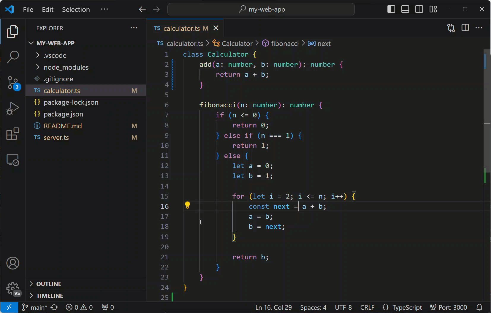

### 스테이징 {#staging}

#### 파일 변경 사항 스테이징 {#stage-file-changes}

파일 수 위에 마우스를 올리고 더하기 버튼을 선택하여 파일을 스테이징합니다.

빼기 버튼을 선택하여 변경 사항의 스테이징을 해제합니다.


#### 선택한 부분 스테이징 {#stage-selected}

파일에서 텍스트 선택을 한 다음 **선택한 범위 스테이징**을 선택하여 파일의 일부를 스테이징할 수 있습니다. 이는 명령 팔레트 또는 차이 편집기 컨텍스트 메뉴(오른쪽 클릭)에서 선택할 수 있습니다.

### 마지막 커밋 되돌리기 {#undo-last-commit}

(...) 버튼을 선택한 다음 **커밋** > **마지막 커밋 되돌리기**를 선택하여 이전 커밋을 되돌립니다. 변경 사항은 스테이징된 변경 사항 섹션에 추가됩니다.


### Git 출력 보기 {#see-git-output}

VS Code는 실제로 실행되고 있는 Git 명령을 쉽게 볼 수 있도록 합니다. 이는 Git을 배우고 있거나 어려운 소스 제어 문제를 디버깅할 때 유용할 수 있습니다.

Git 출력을 보려면 소스 제어 뷰에서 (...) 버튼을 선택한 다음 **Git 출력 보기**를 선택하거나 **Git: Git 출력 보기** 명령을 사용하거나 **출력 전환** 명령(`kb(workbench.action.output.toggleOutput)`)을 사용한 다음 드롭다운에서 **Git**을 선택합니다.

### 여백 표시기 {#gutter-indicators}

편집기는 여백에서 변경 사항(추가, 변경 또는 제거된 줄)이 어디에서 발생했는지에 대한 시각적 단서를 제공합니다. 자세한 내용은 [소스 제어 문서](/docs/sourcecontrol/overview.md#gutter-indicators)를 참조하세요.

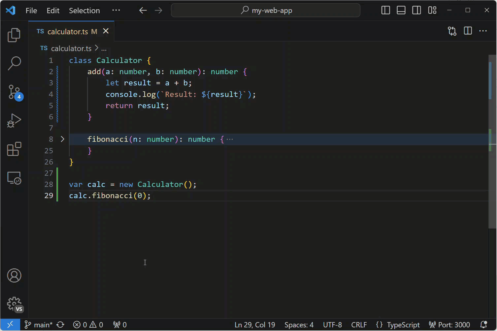

### 병합 충돌 해결 {#resolve-merge-conflicts}

병합 중 **소스 제어** 뷰(`kb(workbench.view.scm)`)로 이동하여 차이 보기에서 변경합니다.

인라인 CodeLens를 사용하여 병합 충돌을 해결할 수 있으며, 이를 통해 **현재 변경 수락**, **들어오는 변경 수락**, **두 변경 모두 수락**, **변경 비교**를 선택할 수 있습니다.


소스 제어 문서에서 [병합 충돌 해결](/docs/sourcecontrol/overview.md#merge-conflicts)에 대해 자세히 알아보세요.

### VS Code를 기본 병합 도구로 설정 {#set-vs-code-as-default-merge-tool}

```bash
git config --global merge.tool vscode
git config --global mergetool.vscode.cmd 'code --wait $MERGED'
```

### VS Code를 기본 차이 도구로 설정 {#set-vs-code-as-default-diff-tool}

```bash
git config --global diff.tool vscode
git config --global difftool.vscode.cmd 'code --wait --diff $LOCAL $REMOTE'
```

## 클립보드와 파일 비교 {#compare-file-with-the-clipboard}

키보드 단축키: `kb(workbench.files.action.compareWithClipboard)`

명령 팔레트에서 **파일: 클립보드와 현재 파일 비교** 명령을 사용하여 활성 파일과 클립보드의 내용을 빠르게 비교할 수 있습니다 (`kb(workbench.action.showCommands)`).

## 디버깅 {#debugging}

### 디버거 구성 {#configure-debugger}

실행 및 디버그 뷰(`kb(workbench.view.debug)`)에서 **launch.json 파일 생성**을 선택하면 프로젝트에 맞는 환경(Node.js, Python, C++ 등)을 선택하라는 메시지가 표시됩니다. 이는 디버거 구성이 포함된 `launch.json` 파일을 작업 공간에 생성합니다.

Node.js 지원은 내장되어 있으며 다른 환경은 적절한 언어 확장을 설치해야 합니다. 자세한 내용은 [디버깅 문서](/docs/editor/debugging.md)를 참조하세요.

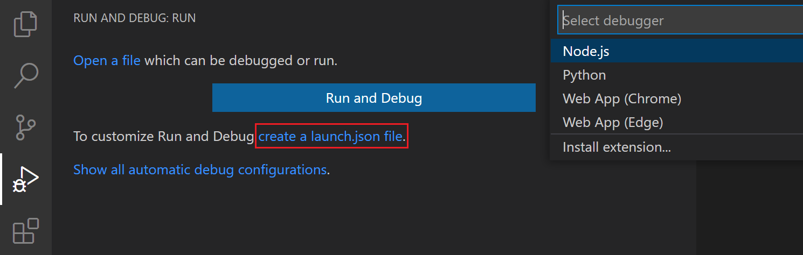

### 중단점 및 코드 단계 실행 {#breakpoints-and-stepping-through}

현재 줄에서 **편집기 여백**을 선택하거나 `kb(editor.debug.action.toggleBreakpoint)`를 사용하여 중단점을 전환합니다. 편집기 여백의 중단점은 일반적으로 빨간색 채워진 원으로 표시됩니다.

디버그 세션이 시작되면 **디버그 도구 모음**이 편집기 상단에 나타나며 디버깅 중 코드를 단계별로 실행할 수 있습니다. 디버깅 문서에서 [디버그 작업](/docs/editor/debugging.md#debug-actions)에 대해 자세히 알아보세요.


### 데이터 검사 {#data-inspection}

변수는 **실행 및 디버그** 뷰의 **변수** 섹션에서, 편집기에서 소스 위에 마우스를 올리거나 디버그 콘솔을 사용하여 검사할 수 있습니다.


### 로그 포인트 {#logpoints}

로그 포인트는 중단점처럼 작동하지만 중단점이 발생할 때 디버거를 중단하는 대신 콘솔에 메시지를 기록합니다. 로그 포인트는 수정할 수 없거나 일시 중지할 수 없는 프로덕션 서버를 디버깅할 때 로깅을 주입하는 데 특히 유용합니다.

왼쪽 편집기 여백에서 **로그 포인트 추가** 명령을 사용하여 로그 포인트를 추가하면 "다이아몬드" 모양의 아이콘으로 표시됩니다. 로그 메시지는 일반 텍스트이지만 중괄호('{}') 내에서 평가할 표현식을 포함할 수 있습니다.


### 트리거된 중단점 {#triggered-breakpoints}

트리거된 중단점은 다른 중단점이 발생할 때 자동으로 활성화되는 중단점입니다. 이는 특정 전제 조건 후에만 발생하는 코드의 실패 사례를 진단할 때 매우 유용할 수 있습니다.

트리거된 중단점은 기호 여백에서 마우스 오른쪽 버튼을 클릭하고 **트리거된 중단점 추가**를 선택한 다음 어떤 다른 중단점이 이 중단점을 활성화하는지 선택하여 설정할 수 있습니다.

<video src="../editor/images/debugging/debug-triggered-breakpoint.mp4" autoplay loop controls muted></video>

## 작업 실행기 {#task-runner}

VS Code의 작업은 스크립트를 실행하고 프로세스를 시작하도록 구성할 수 있으며, 이를 통해 이러한 도구를 VS Code 내에서 명령 줄에 입력하거나 새로운 코드를 작성하지 않고도 사용할 수 있습니다.

### 자동 감지 작업 {#auto-detect-tasks}

상위 메뉴에서 **터미널**을 선택하고, **작업 구성** 명령을 실행한 다음 실행할 작업 유형을 선택합니다. 그러면 다음과 같은 내용의 `tasks.json` 파일이 생성됩니다. 더 자세한 내용은 [작업](/docs/editor/tasks.md) 문서를 참조하세요.

```json
{
    // https://go.microsoft.com/fwlink/?LinkId=733558를 참조하세요.
    // tasks.json 형식에 대한 문서입니다.
    "version": "2.0.0",
    "tasks": [
        {
            "type": "npm",
            "script": "install",
            "group": {
                "kind": "build",
                "isDefault": true
            }
        }
    ]
}
```

자동 생성 시 가끔 문제가 발생할 수 있습니다. 제대로 작동하도록 하는 방법에 대한 문서를 확인하세요.

### 터미널 메뉴에서 작업 실행 {#run-tasks-from-the-terminal-menu}

상위 메뉴에서 **터미널**을 선택하고, **작업 실행** 명령을 실행한 다음 실행할 작업을 선택합니다. 실행 중인 작업을 종료하려면 **작업 종료** 명령을 실행하세요.

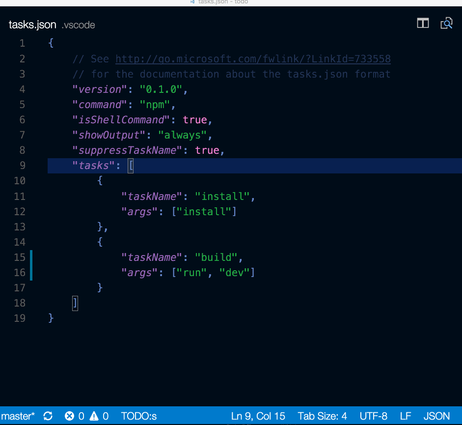

### 작업에 대한 키보드 단축키 정의 {#define-keyboard-shortcuts-for-tasks}

모든 작업에 대해 키보드 단축키를 정의할 수 있습니다. **명령 팔레트**(`kb(workbench.action.showCommands)`)에서 **환경 설정: 키보드 단축키 파일 열기**를 선택하고, 원하는 단축키를 `workbench.action.tasks.runTask` 명령에 바인딩한 후 **작업**을 `args`로 정의합니다.

예를 들어, `Run tests` 작업에 `kbstyle(Ctrl+H)`를 바인딩하려면 다음을 추가하세요:

```json
{
    "key": "ctrl+h",
    "command": "workbench.action.tasks.runTask",
    "args": "Run tests"
}
```

### 탐색기에서 npm 스크립트를 작업으로 실행 {#run-npm-scripts-as-tasks-from-the-explorer}

탐색기 보기에서 스크립트를 편집기에서 열고, 작업으로 실행하며, 노드 디버거로 실행할 수 있습니다(스크립트가 `--inspect-brk`와 같은 디버그 옵션을 정의할 때). 클릭 시 기본 동작은 스크립트를 여는 것입니다. 단일 클릭으로 스크립트를 실행하려면 `setting(npm.scriptExplorerAction)`을 `run`으로 설정하세요. 특정 폴더에 포함된 `package.json` 파일의 스크립트를 제외하려면 `setting(npm.exclude)` 설정을 사용하세요.

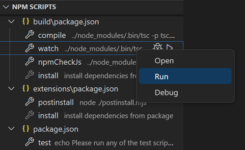

`setting(npm.enableRunFromFolder)` 설정을 사용하면 폴더의 탐색기 보기 컨텍스트 메뉴에서 npm 스크립트를 실행할 수 있습니다. 이 설정은 폴더가 선택될 때 **폴더에서 NPM 스크립트 실행...** 명령을 활성화합니다. 이 명령은 해당 폴더에 포함된 npm 스크립트의 빠른 선택 목록을 표시하며, 작업으로 실행할 스크립트를 선택할 수 있습니다.

## 휴대용 모드 {#portable-mode}

VS Code에는 [휴대용 모드](/docs/editor/portable.md)가 있어 설정과 데이터를 설치 위치와 동일한 장소에 유지할 수 있습니다. 예를 들어 USB 드라이브에 저장할 수 있습니다.

## 인사이더 빌드 {#insiders-builds}

Visual Studio Code 팀은 인사이더 버전을 사용하여 VS Code의 최신 기능과 버그 수정을 테스트합니다. [여기에서 다운로드하여](https://insiders) 인사이더 버전을 사용할 수도 있습니다.

* 초기 사용자 - 인사이더는 사용자와 확장 작성자가 시도할 수 있는 최신 코드 변경 사항을 포함합니다.
* 빈번한 빌드 - 매일 새로운 빌드가 제공되며 최신 버그 수정 및 기능이 포함됩니다.
* 병행 설치 - 인사이더는 안정적인 빌드 옆에 설치되어 독립적으로 사용할 수 있습니다.