# 사용자 인터페이스 {#user-interface}

Visual Studio Code의 핵심은 코드 편집기입니다. 다른 많은 코드 편집기와 마찬가지로 VS Code는 왼쪽에 탐색기가 있고, 사용자가 접근할 수 있는 모든 파일과 폴더를 보여주며, 오른쪽에는 사용자가 열어본 파일의 내용을 표시하는 일반적인 사용자 인터페이스와 레이아웃을 채택하고 있습니다.

<iframe width="560" height="315" src="https://www.youtube-nocookie.com/embed/nORT3-kONgA" title="VS Code 사용자 인터페이스 변환" frameborder="0" allow="accelerometer; autoplay; clipboard-write; encrypted-media; gyroscope; picture-in-picture" allowfullscreen></iframe>

## 기본 레이아웃 {#basic-layout}

VS Code는 편집기를 위한 공간을 극대화하면서 폴더나 프로젝트의 전체 컨텍스트를 탐색하고 접근할 수 있는 충분한 공간을 남기는 간단하고 직관적인 레이아웃을 제공합니다. 사용자 인터페이스는 다섯 개의 주요 영역으로 나뉩니다:

- **편집기** - 파일을 편집하는 주요 영역입니다. 원하는 만큼의 편집기를 수직 및 수평으로 나란히 열 수 있습니다.
- **주 사이드 바** - 프로젝트 작업을 도와주는 탐색기와 같은 다양한 뷰를 포함합니다.
- **상태 표시줄** - 열린 프로젝트 및 편집 중인 파일에 대한 정보입니다.
- **활동 표시줄** - 가장 왼쪽에 위치합니다. 뷰 간 전환을 가능하게 하고 Git이 활성화된 경우 발신 변경 사항 수와 같은 추가적인 컨텍스트별 지표를 제공합니다. 활동 표시줄의 위치를 변경할 수 있습니다.
- **패널** - 편집기 영역 아래에 있는 추가 뷰 공간입니다. 기본적으로 출력, 디버그 정보, 오류 및 경고, 통합 터미널을 포함합니다. 패널은 더 많은 수직 공간을 위해 왼쪽이나 오른쪽으로 이동할 수도 있습니다.


> [!TIP]
> 보조 사이드 바도 사용 가능하여 주 사이드 바의 반대쪽에 뷰를 표시합니다. `kb(workbench.action.toggleAuxiliaryBar)`로 표시할 수 있으며, 주 사이드 바에서 보기를 보조 사이드 바로 드래그할 수 있습니다.

VS Code를 시작할 때마다 마지막으로 닫았던 상태로 열립니다. 폴더, 레이아웃 및 열린 파일이 유지됩니다.

각 편집기에서 열린 파일은 편집기 영역 상단의 탭 헤더(탭)로 표시됩니다. 탭 헤더에 대한 자세한 내용은 [탭](/docs/getstarted/userinterface.md#tabs) 섹션을 참조하세요.

> [!TIP]
> 활동 표시줄을 마우스 오른쪽 버튼으로 클릭하고 **주 사이드 바 오른쪽으로 이동**을 선택하거나 가시성을 전환(`kb(workbench.action.toggleSidebarVisibility)`)하여 주 사이드 바를 오른쪽으로 이동할 수 있습니다.

## 나란히 편집하기 {#side-by-side-editing}

원하는 만큼의 편집기를 수직 및 수평으로 나란히 열 수 있습니다. 이미 편집기가 열려 있는 경우, 옆에 다른 편집기를 여는 여러 방법이 있습니다:

- `kbstyle(Alt)`를 누르고 탐색기 뷰에서 파일을 선택합니다.
- `kb(workbench.action.splitEditor)`를 사용하여 활성 편집기를 두 개로 나눕니다.
- 탐색기 컨텍스트 메뉴에서 파일에 대해 **옆에 열기**(`kb(explorer.openToSide)`)를 선택합니다.
- 편집기 오른쪽 상단의 **편집기 나누기** 버튼을 선택합니다.
- 파일을 편집기 영역의 어느 쪽으로든 드래그 앤 드롭합니다.
- **빠른 열기**(`kb(workbench.action.quickOpen)`) 파일 목록에서 `kb(explorer.openToSide)`를 누릅니다.


다른 파일을 열면 활성 편집기가 해당 파일의 내용을 표시합니다. 두 개의 편집기가 나란히 있을 때 오른쪽 편집기에 'foo.cs' 파일을 열고 싶다면, 파일을 열기 전에 해당 편집기가 활성 상태인지 확인해야 합니다(편집기 안을 클릭하여 활성화).

기본적으로 편집기는 활성 편집기의 오른쪽에 열립니다. 이 동작은 `setting(workbench.editor.openSideBySideDirection)` 설정을 통해 활성 편집기 아래에 새 편집기를 열도록 변경할 수 있습니다.

여러 편집기가 열려 있을 때는 `kbstyle(Ctrl)` 키(`macOS에서는 `kbstyle(Cmd)`)를 누르고 `kbstyle(1)`, `kbstyle(2)`, 또는 `kbstyle(3)`을 눌러 빠르게 전환할 수 있습니다.

> [!TIP]
> 편집기의 크기를 조정하고 순서를 변경할 수 있습니다. 편집기 제목 영역을 드래그 앤 드롭하여 위치를 변경하거나 크기를 조정합니다.

### 편집기 그룹 {#editor-groups}

편집기를 나누면( **편집기 나누기** 또는 **옆에 열기** 명령 사용) 새로운 편집기 영역(편집 그룹)이 생성되어 항목 그룹을 보유할 수 있습니다. 원하는 만큼의 편집기 그룹을 수직 및 수평으로 나란히 열 수 있습니다.

이들은 탐색기 뷰의 상단에 있는 **열린 편집기** 섹션에서 명확하게 볼 수 있습니다(탐색기 뷰에서 **...** > **열린 편집기**를 전환).

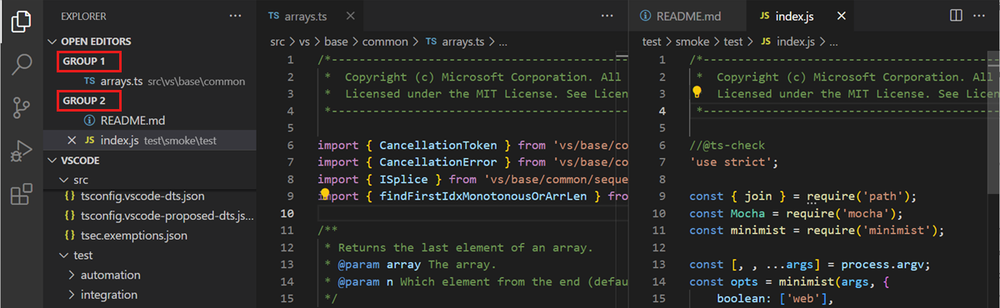

편집기 그룹을 작업대에서 드래그 앤 드롭하여 이동하고, 그룹 간에 개별 탭을 이동하며, 전체 그룹을 빠르게 닫을 수 있습니다(**모두 닫기**).

> [!NOTE]
> VS Code는 탭을 활성화했는지 여부에 관계없이 편집기 그룹을 사용합니다. 탭이 없으면 편집기 그룹은 열린 항목의 스택으로, 가장 최근에 선택된 항목이 편집기 창에 표시됩니다.

### 그룹 내 나누기 {#split-in-group}

현재 편집기를 새로운 편집기 그룹을 만들지 않고 나눌 수 있습니다. **보기: 그룹 내 편집기 나누기** 명령(`kb(workbench.action.splitEditorInGroup)`)을 사용하세요. 이 편집 모드 및 두 쪽 사이를 탐색하는 특정 명령에 대한 자세한 내용은 [사용자 정의 레이아웃](/docs/editor/custom-layout.md#split-in-group) 문서의 섹션을 읽어보세요.

### 플로팅 창 {#floating-windows}

편집기를 **새 창으로 이동** 또는 **새 창으로 복사**(`kb(workbench.action.copyEditorToNewWindow)`) 명령을 사용하여 자체 플로팅 창으로 이동할 수 있습니다. 플로팅 편집기 창에 대한 자세한 내용은 [사용자 정의 레이아웃](/docs/editor/custom-layout.md#floating-editor-windows) 문서의 섹션을 읽어보세요.

## 미니맵 {#minimap}

미니맵(코드 개요)은 소스 코드의 높은 수준의 개요를 제공하여 빠른 탐색 및 코드 이해에 유용합니다. 파일의 미니맵은 편집기 오른쪽에 표시됩니다. 음영이 있는 영역을 선택하거나 드래그하여 파일의 다른 섹션으로 빠르게 이동할 수 있습니다.

편집기에 `//#region` 또는 `MARK:` 주석과 같은 [접기 마커](/docs/editor/codebasics.md#folding)가 있는 경우, 미니맵은 접기 마커 이름을 표시합니다.

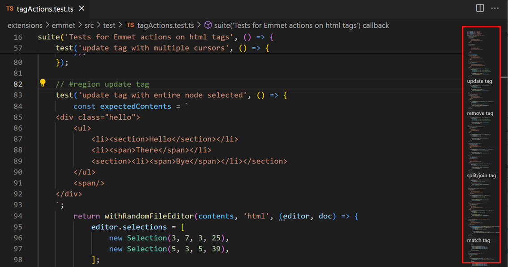

> [!TIP]
> 미니맵을 왼쪽으로 이동하거나 완전히 비활성화하려면 사용자 또는 작업 공간 [설정](/docs/editor/settings.md)에서 각각 `"editor.minimap.side": "left"` 또는 `"editor.minimap.enabled": false`로 설정할 수 있습니다.

## 스티키 스크롤 {#sticky-scroll}

스티키 스크롤은 현재 보이는 중첩 범위의 시작 줄을 편집기 상단에 표시합니다. 파일 내에서 현재 위치를 나타내어 탐색을 용이하게 하며, 현재 범위의 맨 위로 빠르게 이동할 수 있게 해줍니다.

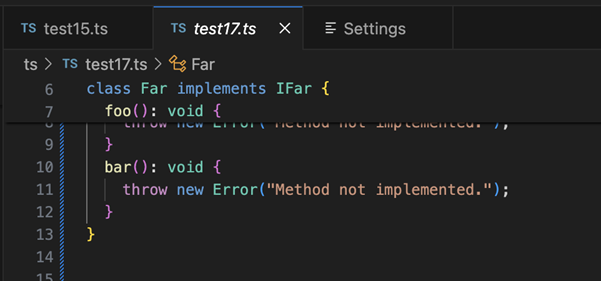

> [!TIP]
> `setting(editor.stickyScroll.enabled)` 설정으로 스티키 스크롤을 활성화/비활성화할 수 있습니다.

스티키 스크롤은 여러 가지 콘텐츠 모델을 사용하여 제목을 생성합니다. 스티키 스크롤 영역에 표시할 줄을 결정하기 위해 개요 제공자 모델, 접기 제공자 모델 및 들여쓰기 모델 중에서 선택할 수 있습니다. 현재 언어에 대해 모델이 사용 가능하지 않으면 VS Code는 위에서 제시된 순서로 다음 모델로 대체합니다. 기본적으로 사용되는 모델은 `setting(editor.stickyScroll.defaultModel)` 설정에서 가져옵니다.

### 들여쓰기 가이드 {#indent-guides}

편집기는 일치하는 들여쓰기 수준을 빠르게 볼 수 있도록 도와주는 들여쓰기 가이드(수직선)를 표시합니다. 들여쓰기 가이드를 비활성화하려면 사용자 또는 작업 공간 [설정](/docs/editor/settings.md)에서 `setting(editor.guides.indentation)`을 `false`로 설정할 수 있습니다.

## 빵 부스러기 {#breadcrumbs}

편집기 상단에는 [빵 부스러기](<https://en.wikipedia.org/wiki/Breadcrumb_(navigation)>)라고도 불리는 탐색 바가 있습니다. 빵 부스러기는 항상 파일 경로를 표시하며, 현재 파일 유형이 기호에 대한 언어 지원이 있는 경우 커서 위치까지의 기호 경로를 표시합니다. 빵 부스러기를 통해 폴더, 파일 및 기호 간에 빠르게 탐색할 수 있습니다.


빵 부스러기를 비활성화하려면 **보기** > **모양** > **빵 부스러기 전환** 메뉴 항목 또는 **보기: 빵 부스러기 전환** 명령을 사용할 수 있습니다. 빵 부스러기 기능에 대한 자세한 정보는 [빵 부스러기](/docs/editor/editingevolved.md#breadcrumbs) 섹션을 참조하세요.

## 탐색기 뷰 {#explorer-view}

탐색기 뷰는 프로젝트의 파일과 폴더를 탐색하고 열고 관리하는 데 사용됩니다. VS Code는 파일 및 폴더 기반이며, 파일이나 폴더를 열어 즉시 시작할 수 있습니다.

VS Code에서 폴더를 열면 탐색기 뷰에 폴더의 내용이 표시됩니다. 여기에서 여러 작업을 수행할 수 있습니다:

- 파일 및 폴더 생성, 삭제 및 이름 변경.
- 드래그 앤 드롭으로 파일 및 폴더 이동.
- 컨텍스트 메뉴를 사용하여 모든 옵션 탐색.

> [!TIP]
> VS Code 외부에서 탐색기 뷰로 파일을 드래그 앤 드롭하여 복사할 수 있습니다. 탐색기가 비어 있으면 VS Code가 파일을 대신 엽니다. 또한 VS Code 외부에서 파일을 복사하여 탐색기 뷰에 붙여넣을 수 있습니다. `setting(explorer.autoOpenDroppedFile)` 설정을 사용하여 파일을 자동으로 열지 여부를 구성할 수 있습니다.

VS Code는 사용 중인 다른 도구, 특히 명령줄 도구와 잘 작동합니다. 현재 VS Code에서 열려 있는 폴더의 컨텍스트에서 명령줄 도구를 실행하려면 폴더를 마우스 오른쪽 버튼으로 클릭하고 **통합 터미널에서 열기**를 선택합니다.

파일이나 폴더의 위치로 이동하려면 파일이나 폴더를 마우스 오른쪽 버튼으로 클릭하고 Windows에서는 **파일 탐색기에서 표시**, macOS에서는 **파인더에서 표시**, Linux에서는 **포함된 폴더 열기**를 선택합니다.

> [!TIP]
> `kb(workbench.action.quickOpen)` (**빠른 열기**)를 입력하여 파일 이름으로 빠르게 검색하고 열 수 있습니다.

기본적으로 VS Code는 탐색기 뷰에 `.git`과 같은 일부 폴더를 표시하지 않습니다. `setting(files.exclude)` 설정을 사용하여 탐색기 뷰에서 파일 및 폴더를 숨기기 위한 규칙을 구성할 수 있습니다.

> [!TIP]
> Unity의 `*.meta` 파일이나 TypeScript 프로젝트의 `*.js`와 같은 파생 리소스 파일을 숨길 수 있습니다. Unity에서 `*.cs.meta` 파일을 제외하려면 선택할 패턴은 `"**/*.cs.meta": true`가 됩니다. TypeScript의 경우 TypeScript 파일에 대해 생성된 JavaScript를 제외할 수 있습니다: `"**/*.js": {"when": "$(basename).ts"}`.

### 다중 선택 {#multi-selection}

탐색기 뷰 및 열린 편집기 섹션에서 여러 파일을 선택하여 여러 항목에 대해 작업(삭제, 드래그 앤 드롭 또는 옆에 열기)을 수행할 수 있습니다. `kbstyle(Ctrl)`(`macOS에서는 `kbstyle(Cmd)`)를 누르고 개별 파일을 선택하거나 `kbstyle(Shift)`를 눌러 파일 범위를 선택합니다. 두 개의 항목을 선택하면 이제 컨텍스트 메뉴의 **선택 비교** 명령을 사용하여 두 파일을 빠르게 비교할 수 있습니다.

> [!NOTE]
> 이전 VS Code 릴리스에서는 `kbstyle(Ctrl)`(`macOS에서는 `kbstyle(Cmd)`) 키를 누른 상태에서 클릭하면 파일이 새로운 편집기 그룹의 옆에 열렸습니다. 여전히 이 동작을 원한다면 `setting(workbench.list.multiSelectModifier)` 설정을 사용하여 다중 선택을 `kbstyle(Alt)` 키를 사용하도록 변경할 수 있습니다.

```json
"workbench.list.multiSelectModifier": "alt"
```

### 고급 트리 탐색 {#advanced-tree-navigation}

탐색기 뷰에서 파일 및 폴더를 필터링할 수 있습니다. 탐색기 뷰에 포커스를 맞춘 상태에서 `kb(list.find)`를 눌러 찾기 컨트롤을 열고 일치시키고자 하는 파일 또는 폴더 이름의 일부를 입력합니다. 이 탐색 기능은 VS Code의 모든 트리 뷰에서 사용할 수 있습니다.

**필터** 버튼을 누르면 두 모드 간 전환이 가능합니다: 강조 및 필터링. `kbstyle(Down)`을 누르면 첫 번째 일치 항목에 포커스를 맞추고 이후의 일치 항목으로 탐색할 수 있습니다. 강조 모드에서는 일치하는 파일이 포함된 폴더에 배지가 표시됩니다.

**퍼지 일치** 버튼을 누르면 정확한 일치와 퍼지 일치 간 전환이 가능하며, 파일 또는 폴더 이름의 어느 부분과도 일치하는 문자 시퀀스를 입력할 수 있습니다.

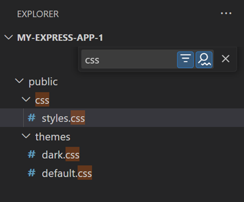

### 개요 뷰 {#outline-view}

개요 뷰는 탐색기 뷰 하단의 별도 섹션입니다. 확장되면 현재 활성 편집기의 기호 트리를 표시합니다.

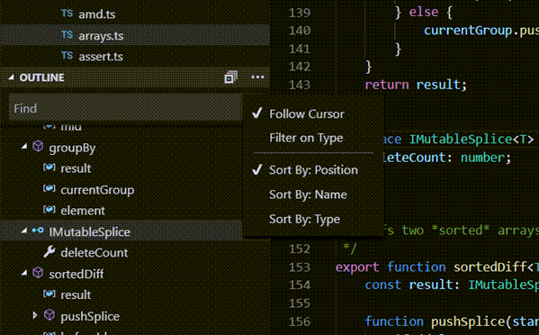

개요 뷰에는 다양한 **정렬 기준** 모드, 선택적 커서 추적 및 일반적인 열기 제스처가 지원됩니다. 또한 찾기 또는 필터링을 위한 입력 상자가 포함되어 있습니다. 오류 및 경고도 개요 뷰에 표시되어 문제의 위치를 한눈에 확인할 수 있습니다.

기호에 대해서는 설치된 확장 프로그램에서 계산된 정보를 기반으로 합니다. 예를 들어, 내장된 Markdown 지원은 Markdown 파일의 기호에 대한 Markdown 헤더 계층 구조를 반환합니다.


개요 뷰에 대한 여러 [설정](/docs/editor/settings.md)이 있습니다. `outline.`으로 시작하는 설정을 검색하여 개요 뷰에 표시할 정보를 구성하세요.

### 타임라인 뷰 {#timeline-view}

파일 탐색기 하단에서 접근할 수 있는 타임라인 뷰는 파일의 이벤트 이력을 시각화하는 통합 뷰입니다. 예를 들어, Git 커밋이나 로컬 파일 저장을 타임라인 뷰에서 볼 수 있습니다.


타임라인 뷰 도구 모음의 필터 작업을 통해 소스 제어 이벤트와 로컬 파일 이벤트 간에 필터링할 수 있습니다:


#### 로컬 파일 이력 {#local-file-history}

설정에 따라 편집기를 저장할 때마다 목록에 새 항목이 추가됩니다. 각 로컬 이력 항목은 항목이 생성된 시점의 파일 전체 내용을 포함하며, 특정 경우에는 더 많은 의미 정보를 제공할 수 있습니다(예: 리팩토링을 나타냄).

항목에서 다음을 수행할 수 있습니다:

- 로컬 파일 또는 이전 항목과의 변경 사항 비교.
- 내용을 복원합니다.
- 항목 삭제 또는 이름 변경.

> [!TIP]
> 파일을 실수로 삭제한 경우, 타임라인 뷰에서 **...** > **로컬 이력: 복원할 항목 찾기** 작업을 사용하여 로컬 이력에서 복원할 수 있으며, 그 후 빠른 선택에서 파일을 선택합니다.

로컬 이력 작업을 위한 설정을 구성할 수 있습니다:

- `setting(workbench.localHistory.enabled)` - 로컬 이력 활성화 또는 비활성화(기본값: true)
- `setting(workbench.localHistory.maxFileSize)` - 로컬 이력 항목 생성 시 파일 크기 제한(기본값: 256 KB)
- `setting(workbench.localHistory.maxFileEntries)` - 파일당 로컬 이력 항목 제한(기본값: 50)
- `setting(workbench.localHistory.exclude)` - 특정 파일을 로컬 이력에서 제외하기 위한 글로브 패턴
- `setting(workbench.localHistory.mergeWindow)` - 로컬 파일 이력의 마지막 항목에 추가 변경 사항이 추가되는 간격(기본값 10초)

#### 커밋 이력 {#commit-history}

VS Code의 내장 Git 지원은 지정된 파일의 Git 커밋 이력을 제공합니다. 커밋을 선택하면 해당 커밋에서 도입된 변경 사항의 차이 보기(diff view)가 열립니다. 커밋을 마우스 오른쪽 버튼으로 클릭하면 **커밋 ID 복사** 및 **커밋 메시지 복사** 옵션이 표시됩니다.

이력에서 커밋을 마우스 오른쪽 버튼으로 클릭하면 다음을 수행할 수 있습니다:

- **변경 사항 열기** - 파일의 변경 사항에 대한 차이 보기를 엽니다.
- **커밋 보기** - 커밋의 모든 파일에 대한 변경 사항을 보기 위한 다중 파일 차이 보기를 엽니다.
- **비교를 위한 선택** - 다른 항목과 비교할 항목을 선택합니다.
- **커밋 ID 복사** - 커밋 ID를 클립보드에 복사합니다.
- **커밋 메시지 복사** - 커밋 메시지를 클립보드에 복사합니다.

Git 이력 작업을 위한 설정을 구성할 수 있습니다:

- `setting(git.timeline.date)` - 파일 커밋의 커밋 날짜 또는 작성 날짜 표시

## 뷰 {#views}

탐색기 뷰는 VS Code에서 사용할 수 있는 여러 뷰 중 하나입니다. 다음과 같은 뷰도 있습니다:

- **검색** - 열린 폴더에서 전역 검색 및 바꾸기를 제공합니다.
- **소스 제어** - VS Code는 기본적으로 Git 소스 제어를 포함합니다.
- **실행** - VS Code의 실행 및 디버그 뷰는 변수, 호출 스택 및 중단점을 표시합니다.
- **확장** - VS Code 내에서 확장을 설치하고 관리합니다.
- **사용자 정의 뷰** - 확장에서 제공하는 뷰입니다.

> [!TIP]
> **보기: 뷰 열기** 명령을 사용하여 모든 뷰를 열 수 있습니다.

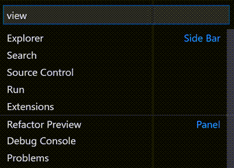

활동 표시줄을 마우스 오른쪽 버튼으로 클릭하여 뷰를 표시하거나 숨길 수 있으며, 드래그 앤 드롭을 사용하여 순서를 변경할 수 있습니다. 탐색기 뷰 내에서 '...' 메뉴를 통해 섹션을 표시하거나 숨기거나 섹션을 드래그 앤 드롭하여 순서를 변경할 수 있습니다.

<video src="images/userinterface/view-management.mp4" autoplay loop controls muted title="뷰 관리"></video>

## 명령 팔레트 {#command-palette}

VS Code는 키보드에서도 쉽게 접근할 수 있습니다. 가장 중요한 키 조합은 `kb(workbench.action.showCommands)`로, **명령 팔레트**를 열 수 있습니다. 여기에서 VS Code 내의 모든 기능에 접근할 수 있으며, 가장 일반적인 작업에 대한 키보드 단축키도 포함되어 있습니다.


**명령 팔레트**는 많은 명령에 접근할 수 있습니다. 편집기 명령을 실행하고, 파일을 열고, 기호를 검색하고, 파일의 간단한 개요를 볼 수 있습니다. 몇 가지 팁은 다음과 같습니다:

- `kb(workbench.action.quickOpen)`를 사용하여 파일이나 기호로 이동할 수 있습니다.
- `kb(workbench.action.quickOpenPreviousRecentlyUsedEditorInGroup)`를 사용하여 최근에 열린 파일 세트를 순환합니다.
- `kb(workbench.action.showCommands)`를 사용하여 편집기 명령으로 직접 이동합니다.
- `kb(workbench.action.gotoSymbol)`를 사용하여 파일 내의 특정 기호로 이동합니다.
- `kb(workbench.action.gotoLine)`를 사용하여 파일 내의 특정 줄로 이동합니다.

입력 필드에 `?`를 입력하면 명령 팔레트에서 실행할 수 있는 사용 가능한 명령 목록을 확인할 수 있습니다.


> [!TIP]
> 마우스 커서를 사용하여 명령 팔레트를 다른 위치로 이동할 수 있습니다. 상단 모서리를 잡고 다른 곳으로 드래그하면 됩니다. 제목 표시줄에서 **레이아웃 사용자 정의** 컨트롤을 선택한 다음 미리 구성된 **빠른 입력 위치** 중 하나를 선택할 수도 있습니다.


## 편집기 구성 {#configure-the-editor}

VS Code는 편집기를 구성할 수 있는 많은 옵션을 제공합니다. **보기** > **모양** 메뉴에서 **사이드 바**, **상태 표시줄**, **활동 표시줄**과 같은 사용자 인터페이스의 다양한 부분을 숨기거나 전환할 수 있습니다.

### 메뉴 바 숨기기 (Windows, Linux) {#hide-the-menu-bar-windows-linux}

Windows 및 Linux에서 `setting(window.menuBarVisibility)` 설정을 `classic`에서 `toggle` 또는 `hidden`으로 변경하여 메뉴 바를 숨길 수 있습니다. `toggle` 설정은 `kbstyle(Alt)` 키를 한 번 누르면 메뉴 바가 다시 표시됩니다.

Windows 및 Linux에서 **보기: 메뉴 바 전환** 명령을 사용하여 메뉴 바를 숨길 수도 있습니다. 이 명령은 `setting(window.menuBarVisibility)`를 `classic`에서 `compact`로 설정하여 메뉴 바가 활동 표시줄로 이동하게 합니다. 메뉴 바를 `classic` 위치로 되돌리려면 **보기: 메뉴 바 전환** 명령을 다시 실행하면 됩니다.

### 설정 {#settings}

대부분의 편집기 구성은 설정에서 관리되며, 이를 직접 수정할 수 있습니다. 옵션은 사용자 설정을 통해 전역적으로 설정하거나 작업 공간 설정을 통해 프로젝트/폴더별로 설정할 수 있습니다. 설정 값은 [`settings.json` 파일](/docs/editor/settings.md#settings-json-file)에 저장됩니다.

설정 편집기에서 설정을 보고 편집할 수 있습니다( **파일** > **기본 설정** > **설정** 선택 또는 `kb(workbench.action.openSettings)`를 누름). **사용자** 및 **작업 공간** 탭을 사용하여 사용자 및 작업 공간 설정 간에 전환할 수 있습니다. 상단의 검색 상자를 사용하여 설정을 필터링할 수 있습니다.

또는 `settings.json` 파일에서 사용자 설정을 직접 수정할 수 있습니다. **기본 설정: 사용자 설정 열기 (JSON)** 명령을 사용하여 `settings.json` 파일을 열 수 있습니다. 작업 공간 설정의 경우 작업 공간의 `.vscode` 폴더에 있는 `settings.json` 파일을 열면 됩니다.


> [!NOTE]
> 작업 공간 설정은 사용자 설정을 재정의하며, 팀 간에 프로젝트별 설정을 공유하는 데 유용합니다.

### 젠 모드 {#zen-mode}

젠 모드는 모든 UI 요소를 숨기고 편집기만 표시하여 코드에 집중할 수 있도록 합니다. VS Code를 전체 화면으로 전환하고 편집기를 중앙에 배치합니다. 젠 모드는 **보기** > **모양** > **젠 모드** 메뉴, **명령 팔레트**에서 **보기: 젠 모드 전환** 또는 단축키 `kb(workbench.action.toggleZenMode)`로 전환할 수 있습니다. 젠 모드를 종료하려면 `kbstyle(Esc)`를 두 번 누릅니다. 전체 화면으로의 전환은 `setting(zenMode.fullScreen)`을 통해 비활성화할 수 있습니다.

젠 모드는 다음 설정으로 추가 조정할 수 있습니다:

- `setting(zenMode.hideActivityBar)` - 활동 표시줄 숨기기. 기본값 `true`.
- `setting(zenMode.hideStatusBar)` - 상태 표시줄 숨기기. 기본값 `true`.
- `setting(zenMode.hideLineNumbers)` - 줄 번호 숨기기. 기본값 `true`.
- `setting(zenMode.showTabs)` - 여러 개, 단일 또는 탭을 표시할지 여부를 제어합니다. 기본값 `multiple`.
- `setting(zenMode.fullScreen)` - 작업대를 전체 화면으로 표시합니다. 기본값 `true`.
- `setting(zenMode.restore)` - 재시작 시 젠 모드 복원. 기본값 `true`.
- `setting(zenMode.centerLayout)` - [중앙 편집기 레이아웃](#centered-editor-layout) 사용. 기본값 `true`.
- `setting(zenMode.silentNotifications)` - 알림 표시 안 함. 기본값 `true`.

### 방해 금지 모드로 알림 줄이기 {#reduce-notifications-with-do-not-disturb-mode}

알림이 너무 많이 뜨는 경우, 모든 알림 또는 특정 확장에서 오는 알림을 줄이는 방법이 있습니다.

상태 표시줄에서 종 모양 아이콘을 선택하여 알림 영역을 엽니다. 이는 방해 금지 모드가 활성화되어 있어도 언제든지 모든 알림에 접근할 수 있는 곳입니다.

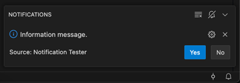

종 모양 아이콘을 클릭하여 확장에서 오는 알림을 선택적으로 비활성화하거나 전역 방해 금지 모드를 활성화하여 모든 알림을 비활성화할 수 있는 메뉴에 접근할 수 있습니다.

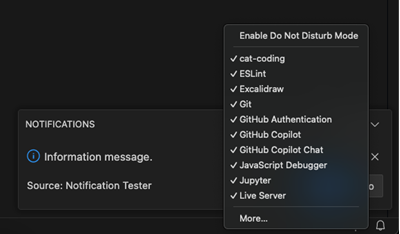

> [!NOTE]
> 전역 방해 금지 모드는 오류 알림도 숨기지만, 확장별 필터는 여전히 오류 알림을 표시할 수 있습니다.

### 중앙 편집기 레이아웃 {#centered-editor-layout}

중앙 편집기 레이아웃은 편집기 영역을 중앙 정렬할 수 있게 해줍니다. 이는 큰 모니터에서 단일 편집기로 작업할 때 유용합니다. 측면 경계를 사용하여 뷰 크기를 조정할 수 있습니다(측면을 독립적으로 이동하려면 `Alt` 키를 누르고 있어야 합니다).

## 탭 {#tabs}

VS Code는 열린 항목을 편집기 위의 제목 영역에 탭(탭 헤더)으로 표시합니다. 파일을 열면 해당 파일에 대한 새 탭이 추가됩니다. 탭을 사용하면 항목 간에 빠르게 탐색할 수 있습니다.


탭을 드래그 앤 드롭하여 순서를 변경할 수 있습니다. 여러 탭에 대해 동시에 작업을 수행하려면 `kbstyle(Ctrl)` 키(`macOS에서는 `kbstyle(Cmd)`)를 누르고 작업할 탭을 선택합니다. 탭 범위를 선택하려면 `kbstyle(Shift)` 키를 누르고 범위의 첫 번째 및 마지막 탭을 선택합니다.

제목 영역에 맞지 않는 열린 항목이 더 많을 경우, 탐색기 뷰의 **열린 편집기** 섹션(`...` 버튼을 통해 사용 가능)을 사용하여 탭 항목의 드롭다운 목록을 표시할 수 있습니다.

탭과 편집기 영역 사이에는 편집기를 드래그하여 볼 수 있는 스크롤 바가 있습니다. 스크롤 바의 높이를 늘려 드래그하기 쉽게 하려면 **작업대 > 편집기: 제목 스크롤바 크기**(`setting(workbench.editor.titleScrollbarSizing)`)를 `large`로 설정합니다.

탭을 사용하고 싶지 않다면 `setting(workbench.editor.showTabs)` 설정을 `single`로 설정하여 기능을 비활성화할 수 있습니다:

```json
"workbench.editor.showTabs": "single"
```

탭 없이 작업하기 위해 VS Code를 최적화하는 방법에 대한 내용은 [탭 없이 작업하기](/docs/getstarted/userinterface.md#working-without-tabs) 섹션을 참조하세요.

> [!TIP]
> 편집기 제목 영역에서 더블 클릭하여 빠르게 새 탭을 생성할 수 있습니다.

### 탭 순서 {#tab-ordering}

기본적으로 새 탭은 기존 탭의 오른쪽에 추가됩니다. 새 탭이 나타날 위치를 `setting(workbench.editor.openPositioning)` 설정으로 제어할 수 있습니다.

예를 들어, 새 탭 항목이 왼쪽에 나타나기를 원할 수 있습니다:

```json
"workbench.editor.openPositioning": "left"
```

탭을 드래그 앤 드롭하여 순서를 변경할 수 있습니다.

편집기 탭을 항상 표시하려면 편집기 탭 바에 고정할 수 있습니다. 탭 고정에 대한 자세한 내용은 [사용자 정의 레이아웃](/docs/editor/custom-layout.md#pinned-tabs) 문서를 참조하세요.

### 미리보기 모드 {#preview-mode}

탐색기 뷰에서 파일을 단일 클릭하거나 선택하면 미리보기 모드로 표시되며 기존 탭(미리보기 탭)을 재사용합니다. 이는 파일을 빠르게 탐색하고 모든 방문한 파일에 대해 고유한 탭을 원하지 않을 때 유용합니다. 파일을 편집하기 시작하거나 탐색기에서 파일을 더블 클릭하여 열면 해당 파일 전용의 새 탭이 생성됩니다.

미리보기 모드는 탭 헤더에서 이탤릭체로 표시됩니다:


미리보기 모드를 사용하지 않고 항상 새 탭을 생성하려면 다음 설정으로 동작을 제어할 수 있습니다:

- `setting(workbench.editor.enablePreview)` - 미리보기 편집기를 전역적으로 활성화 또는 비활성화
- `setting(workbench.editor.enablePreviewFromQuickOpen)` - **빠른 열기**에서 열 때 미리보기 편집기를 활성화 또는 비활성화

### 래핑된 탭 {#wrapped-tabs}

더 많은 편집기 탭을 보려면 편집기 탭이 편집기 영역 위에 여러 행으로 래핑되는 **래핑된 탭** 레이아웃을 사용할 수 있습니다. **작업대 > 편집기: 탭 래핑**(`setting(workbench.editor.wrapTabs)`) 설정으로 래핑된 탭을 활성화합니다.

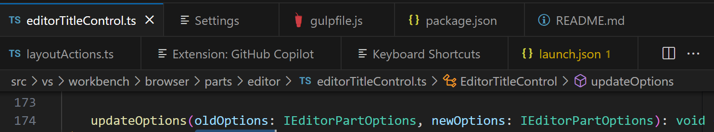

### 탭 레이블 사용자 정의 {#customize-tab-labels}

동일한 이름의 여러 파일을 동시에 열면 서로 다른 탭을 구별하기 어려울 수 있습니다. 이를 돕기 위해 탭에 사용자 정의 표시 레이블을 적용할 수 있습니다. 작업 공간의 어떤 파일에 대해 탭에 사용자 정의 레이블을 적용할지 선택할 수 있습니다.

탭에 대한 사용자 정의 표시 레이블을 활성화하려면 `setting(workbench.editor.customLabels.enabled)` 설정을 다음과 같이 설정합니다:

```json
"workbench.editor.customLabels.enabled": true
```

탭 표시 레이블에 대한 하나 이상의 이름 패턴을 `setting(workbench.editor.customLabels.patterns)` 설정으로 지정할 수 있습니다. 이름 패턴은 두 가지 구성 요소로 구성됩니다:

- **항목** - 사용자 정의 레이블을 적용할 파일 경로와 일치하는 [글로브 패턴](/docs/editor/glob-patterns.md). 예: `**/static/**/*.html`.
- **값** - 사용자 정의 레이블의 템플릿. 템플릿은 `$\{filename\}`, `$\{extname\}`, `$\{extname(N)\}`, `$\{dirname\}`, `$\{dirname(N)\}`와 같은 변수를 사용할 수 있으며, 이는 파일 경로의 값으로 동적으로 대체됩니다.

다음 샘플은 `/src/orders/index.html` 파일을 `orders/index`라는 탭 레이블로 표시합니다.

```json
"workbench.editor.customLabels.patterns": {
    "**/src/**/index.html": "$\{dirname\}/$\{filename\}"
}
```

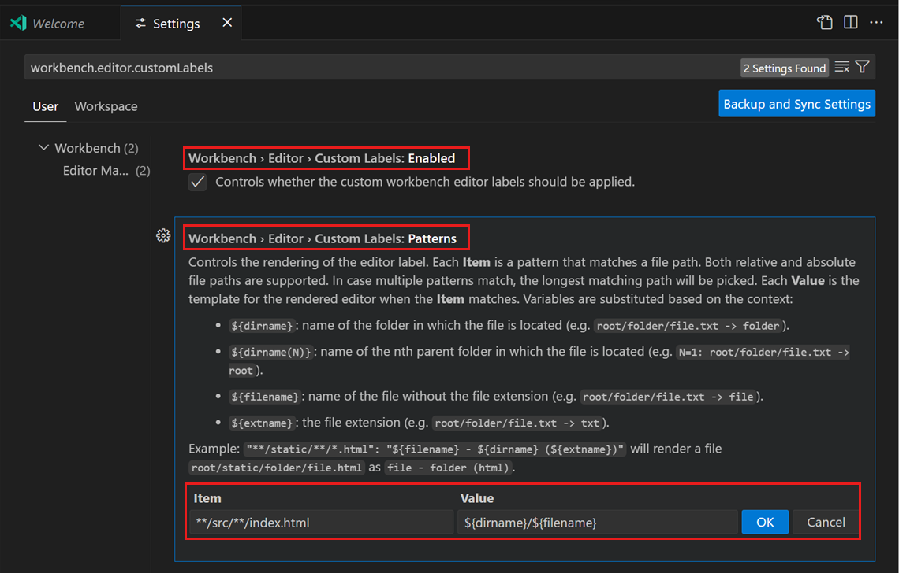

다음 예시는 파일 `tests/editor.test.ts`에 대해 `$\{extname\}` 변수를 사용합니다:

- `$\{filename\}` => editor
- `$\{extname\}` => test.ts
- `$\{extname(0)\}` => ts
- `$\{extname(1)\}` => test
- `$\{extname(-1)\}` => test
- `$\{extname(-2)\}` => ts

> [!NOTE]
> 사용자 정의 탭 레이블은 열린 편집기 뷰 및 [빠른 열기](/docs/getstarted/tips-and-tricks.md#quick-open)(`kb(workbench.action.quickOpen)`)에서도 적용됩니다.

## 그리드 편집기 레이아웃 {#grid-editor-layout}

기본적으로 편집기 그룹은 수직 열로 배치됩니다. 예를 들어, 편집기를 나누면 편집기가 옆으로 열립니다. 편집기 그룹을 수직 및 수평으로 원하는 레이아웃으로 배열할 수 있습니다:

<video src="images/userinterface/grid-layout.mp4" autoplay loop controls muted title="그리드 편집기 레이아웃"></video>

유연한 레이아웃을 지원하기 위해 빈 편집기 그룹을 생성할 수 있습니다. 기본적으로 편집기 그룹의 마지막 편집기를 닫으면 그룹 자체도 닫히지만, `workbench.editor.closeEmptyGroups: false`라는 새로운 설정으로 이 동작을 변경할 수 있습니다:

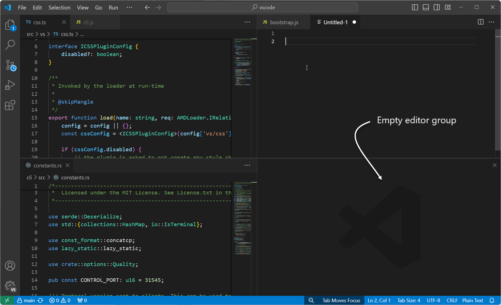

**보기** > **편집기 레이아웃** 메뉴에는 미리 정의된 편집기 레이아웃 세트가 있습니다:


기본적으로 옆으로 열리는 편집기(예: 편집기 도구 모음의 **편집기 나누기** 작업을 선택하여 열리는 경우)는 활성 편집기의 오른쪽에 열립니다. 활성 편집기 아래에 편집기를 열고 싶다면 `setting(workbench.editor.openSideBySideDirection)`을 `down`으로 설정하세요.

키보드를 사용하여 편집기 레이아웃을 조정하기 위한 많은 키보드 명령이 있습니다. 마우스를 사용하고 싶다면 드래그 앤 드롭을 사용하여 편집기를 원하는 방향으로 나눌 수 있습니다:

<video src="images/userinterface/grid-dnd.mp4" autoplay loop controls muted title="그리드 편집기 드래그 앤 드롭"></video>

> [!TIP]
> 편집기를 나누기 위해 도구 모음 작업 위에 마우스를 올리고 `kbstyle(Alt)` 키를 누르고 있으면 다른 방향으로 나누기를 제안합니다. 이는 오른쪽이나 아래로 빠르게 나누는 방법입니다.


### 키보드 단축키 {#keyboard-shortcuts}

편집기 및 편집기 그룹 간에 빠르게 탐색하기 위한 유용한 키보드 단축키는 다음과 같습니다.

- `kb(workbench.action.nextEditor)` - 오른쪽 편집기로 이동합니다.
- `kb(workbench.action.previousEditor)` - 왼쪽 편집기로 이동합니다.
- `kb(workbench.action.quickOpenPreviousRecentlyUsedEditorInGroup)` - 편집기 그룹의 최근 사용 목록에서 이전 편집기를 엽니다.
- `kb(workbench.action.focusFirstEditorGroup)` - 가장 왼쪽 편집기 그룹으로 이동합니다.
- `kb(workbench.action.focusSecondEditorGroup)` - 중앙 편집기 그룹으로 이동합니다.
- `kb(workbench.action.focusThirdEditorGroup)` - 가장 오른쪽 편집기 그룹으로 이동합니다.
- `kb(workbench.action.closeActiveEditor)` - 활성 편집기를 닫습니다.
- `kb(workbench.action.closeEditorsInGroup)` - 편집기 그룹의 모든 편집기를 닫습니다.
- `kb(workbench.action.closeAllEditors)` - 모든 편집기를 닫습니다.

> 기본 키보드 단축키를 수정하려면 [키 바인딩](/docs/editor/keybindings.md)을 참조하세요.

## 탭 없이 작업하기 {#working-without-tabs}

탭(탭 헤더)을 사용하지 않으려면 `setting(workbench.editor.showTabs)`를 `single` 또는 `none`으로 설정하여 탭을 완전히 비활성화할 수 있습니다.

### 미리보기 모드 비활성화 {#disable-preview-mode}

탭 없이 탐색기 뷰의 **열린 편집기** 섹션은 파일 탐색을 위한 빠른 방법입니다. 그러나 [미리보기 편집기 모드](/docs/getstarted/userinterface.md#preview-mode)가 활성화된 경우 파일이 열린 편집기 섹션에 추가되지 않습니다. 이 기능은 `setting(workbench.editor.enablePreview)` 및 `setting(workbench.editor.enablePreviewFromQuickOpen)` 설정을 통해 비활성화할 수 있습니다.

### 편집기 이력 탐색을 위한 키보드 단축키 사용 {#use-keyboard-shortcuts-to-navigate-the-editor-history}

`kbstyle(Ctrl+Tab)`을 변경하여 활성 편집기 그룹과 관계없이 열린 모든 편집기의 목록을 표시할 수 있습니다.

[키보드 단축키](/docs/editor/keybindings.md)를 편집하고 다음을 추가하세요:

```json
{ "key": "ctrl+tab", "command": "workbench.action.openPreviousEditorFromHistory" },
{ "key": "ctrl+tab", "command": "workbench.action.quickOpenNavigateNext", "when": "inQuickOpen" },
```

### 단일 편집기 대신 전체 그룹 닫기 {#close-an-entire-group-instead-of-a-single-editor}

하나의 편집기를 닫을 때 전체 그룹이 닫히는 VS Code의 동작을 좋아했다면, [키 바인딩](/docs/editor/keybindings.md)에서 다음을 바인딩할 수 있습니다.

macOS:

```json
{ "key": "cmd+w", "command": "workbench.action.closeEditorsInGroup" }
```

Windows/Linux:

```json
{ "key": "ctrl+w", "command": "workbench.action.closeEditorsInGroup" }
```

## 창 관리 {#window-management}

VS Code는 VS Code 창(인스턴스)을 세션 간에 어떻게 열거나 복원할지를 제어할 수 있는 다양한 옵션을 제공합니다.

설정 `setting(window.openFoldersInNewWindow)`와 `setting(window.openFilesInNewWindow)`는 파일이나 폴더를 위해 새 창을 열거나 마지막으로 활성화된 창을 재사용하도록 구성하는 데 제공되며, 가능한 값은 `default`, `on`, `off`입니다.

`default`로 설정하면, VS Code는 열기 요청이 이루어진 컨텍스트에 따라 새 창을 열거나 재사용할지를 결정합니다. 이를 `on` 또는 `off`로 변경하면 항상 동일하게 동작합니다. 예를 들어, **파일** 메뉴에서 파일이나 폴더를 선택할 때 항상 새 창에서 열리기를 원한다면, 이를 `on`으로 설정하세요.

> [!NOTE]
> 이 설정이 무시되는 경우도 있습니다. 예를 들어 `-new-window` 또는 `-reuse-window` 명령줄 옵션을 사용할 때입니다.

`setting(window.restoreWindows)` 설정은 VS Code에 이전 세션에서 열린 창을 어떻게 복원할지를 알려줍니다. 기본적으로 VS Code는 이전 세션에서 작업한 모든 창을 복원합니다(설정: `all`). 이 설정을 `none`으로 변경하면 어떤 창도 다시 열지 않고 항상 빈 VS Code 인스턴스에서 시작합니다. `one`으로 변경하면 마지막으로 열린 창을 다시 열고, `folders`로 변경하면 폴더가 열린 창만 복원합니다.

## 다음 단계 {#next-steps}

VS Code의 전체 레이아웃을 알게 되었으니, 다음 기사를 참고하여 작업하는 방식에 맞게 편집기를 사용자화해 보세요:

- [테마 변경하기](/docs/editor/themes.md) - 원하는 색상 및/또는 파일 아이콘 테마를 설정하세요.
- [사용자 정의 레이아웃 사용하기](/docs/editor/custom-layout.md) - VS Code의 작업대 및 편집기 레이아웃 사용자화에 대해 더 알아보세요.

## 자주 묻는 질문 {#common-questions}

### 들여쓰기 가이드의 색상을 어떻게 변경할 수 있나요? {#how-can-i-change-the-color-of-the-indent-guides}

들여쓰기 가이드 색상은 대부분의 VS Code 사용자 인터페이스 요소처럼 사용자화할 수 있습니다. 활성 색상 테마에 대한 들여쓰기 가이드 색상을 [사용자화](/api/references/theme-color.md)하려면 `setting(workbench.colorCustomizations)` 설정을 사용하고 `editorIndentGuide.background` 값을 수정하세요.

예를 들어, 들여쓰기 가이드를 밝은 파란색으로 만들려면 `settings.json`에 다음을 추가하세요:

```json
"workbench.colorCustomizations": {
    "editorIndentGuide.background": "#0000ff"
}
```

### 탐색기 보기에서 열린 편집기 섹션을 숨길 수 있나요? {#can-i-hide-the-open-editors-section-in-the-explorer-view}

네, 탐색기에서 보기 메뉴를 사용하여 열린 편집기 섹션을 표시하거나 숨길 수 있으며, **열린 편집기** 메뉴 항목을 전환하면 됩니다.

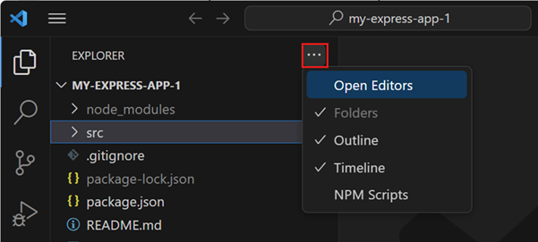