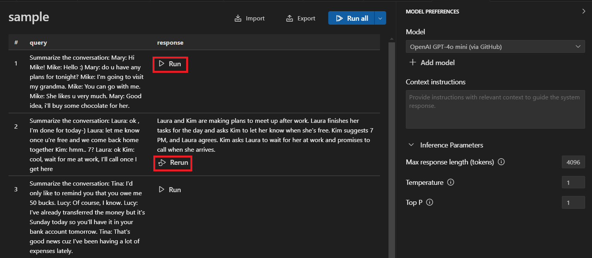
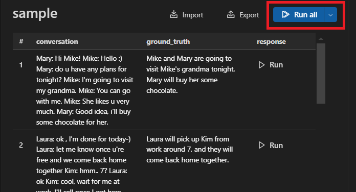

# 여러 프롬프트를 한 번에 실행하기 {#run-multiple-prompts-in-bulk}

AI Toolkit의 일괄 실행 기능을 사용하면 여러 프롬프트를 배치로 실행할 수 있습니다. 플레이그라운드를 사용할 때는 나열된 순서대로 한 번에 하나의 프롬프트만 수동으로 실행할 수 있습니다.

일괄 실행은 데이터 세트를 입력으로 사용하며, 데이터 세트의 각 행에는 최소한 하나의 프롬프트가 포함되어 있습니다. 일반적으로 데이터 세트는 여러 행으로 구성됩니다. 데이터 세트를 가져온 후, 선택한 모델에서 실행할 하나 이상의 프롬프트를 선택할 수 있습니다. 그런 다음 응답은 동일한 데이터 세트 보기에서 표시됩니다. 데이터 세트를 실행한 결과는 내보낼 수 있습니다.

## 일괄 실행 시작하기 {#start-a-bulk-run}

1. AI Toolkit 보기에서 **TOOLS** > **Bulk Run**을 선택하여 일괄 실행 보기를 엽니다.

1. 샘플 데이터 세트를 선택하거나 채팅 프롬프트가 포함된 로컬 [JSONL](https://jsonlines.org/) 파일을 가져옵니다.

    JSONL 파일에는 프롬프트를 나타내는 `query` 필드가 필요합니다.

1. 데이터 세트가 로드되면, 실행할 프롬프트에서 **Run** 또는 **Rerun**을 선택하여 단일 프롬프트를 실행합니다.

    플레이그라운드에서 모델을 테스트하는 것과 유사하게, 모델을 선택하고 프롬프트에 대한 컨텍스트를 추가하며 추론 매개변수를 변경합니다.

    

1. **Run all**을 선택하여 모든 요청을 자동으로 실행합니다.

    모델 응답은 **response** 열에 표시됩니다.

    

    :::tip
    아직 실행되지 않은 나머지 요청만 실행하는 옵션이 있습니다.
    :::

1. **Export** 버튼을 선택하여 결과를 JSONL 형식으로 내보냅니다.

1. **Import**를 선택하여 일괄 실행을 위한 다른 JSONL 형식의 데이터 세트를 가져옵니다.
