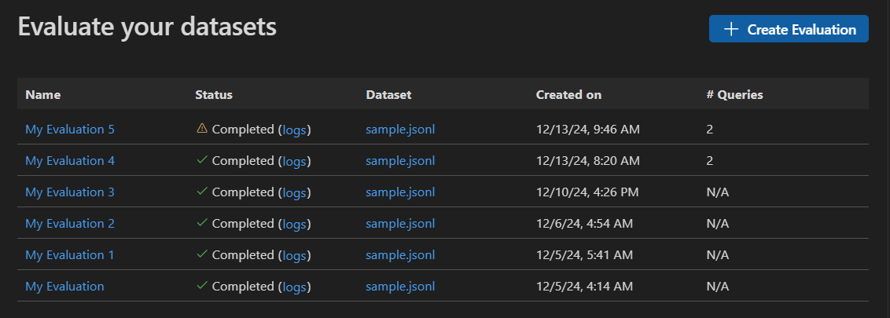
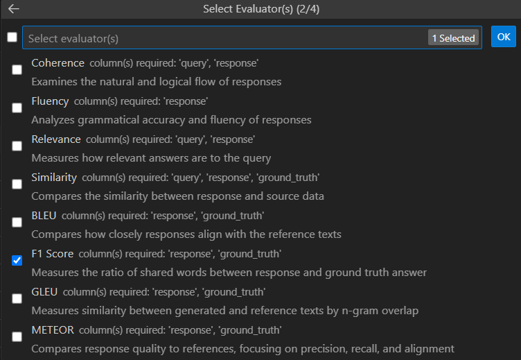
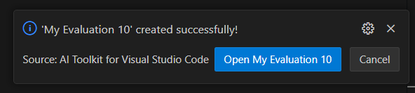
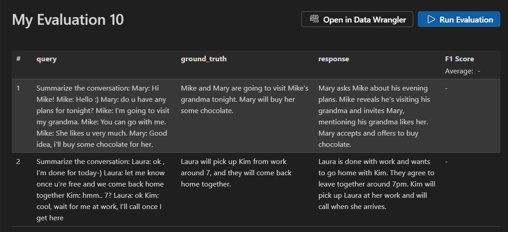
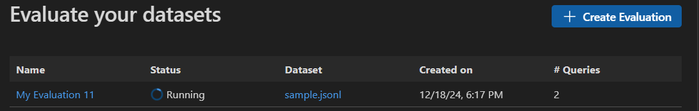
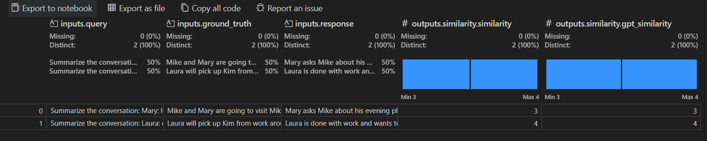

# 모델 평가 {#model-evaluation}

AI 엔지니어는 종종 모델을 다양한 매개변수나 프롬프트로 평가하여 실제 값과 비교하고 비교에서 평가자 값을 계산해야 합니다. AI Toolkit을 사용하면 프롬프트 데이터 세트를 업로드하여 최소한의 노력으로 평가를 수행할 수 있습니다.

## 평가 작업 시작 {#start-an-evaluation-job}

1. AI Toolkit 뷰에서 **TOOLS** > **Evaluation**을 선택하여 평가 뷰를 엽니다.

1. **Create Evaluation**을 선택한 후 다음 정보를 제공합니다:

    - **Evaluation job name:** 기본값 또는 지정할 수 있는 이름

    - **Evaluator:** 현재는 내장된 평가자만 선택할 수 있습니다.

        

    - **Judging model:** 일부 평가자를 평가하기 위해 선택할 수 있는 목록의 모델.

    - **Dataset:** 학습 목적으로 샘플 데이터셋을 선택하거나 `query`, `response`, `ground truth` 필드가 포함된 JSONL 파일을 가져옵니다.

1. 새로운 평가 작업이 생성되며, 새 평가 작업 세부정보를 열라는 메시지가 표시됩니다.

    

1. 데이터셋을 확인하고 **Run Evaluation**을 선택하여 평가를 시작합니다.

    

## 평가 작업 모니터링 {#monitor-the-evaluation-job}

평가 작업이 시작되면 평가 작업 뷰에서 상태를 확인할 수 있습니다.

각 평가 작업에는 사용된 데이터셋에 대한 링크, 평가 프로세스의 로그, 타임스탬프 및 평가 세부정보에 대한 링크가 포함되어 있습니다.

## 평가 결과 찾기 {#find-results-of-evaluation}

평가 작업 세부정보 뷰에는 선택된 각 평가자에 대한 결과 테이블이 표시됩니다. 일부 결과는 집계 값이 있을 수 있습니다.

또한 **Open In Data Wrangler**를 선택하여 [Data Wrangler 확장](vscode:extension/ms-toolsai.datawrangler)으로 데이터를 열 수 있습니다.

