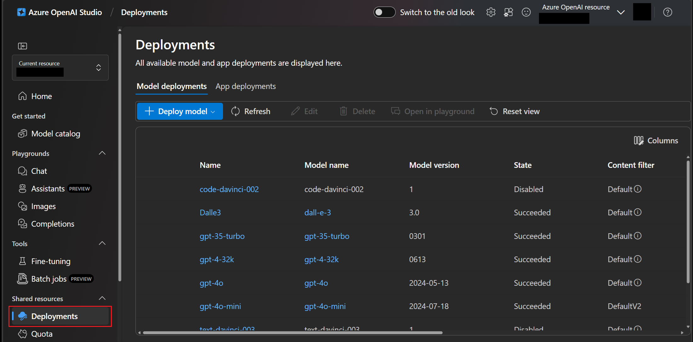
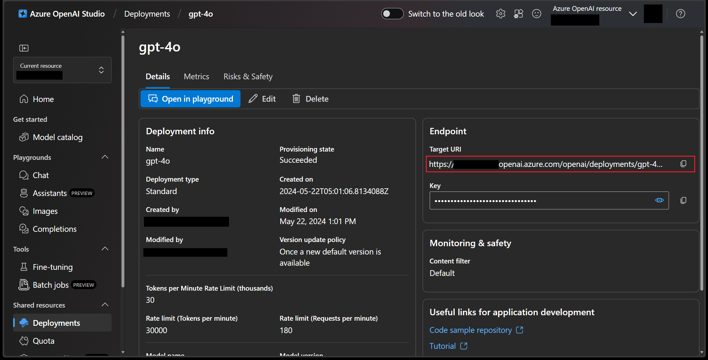
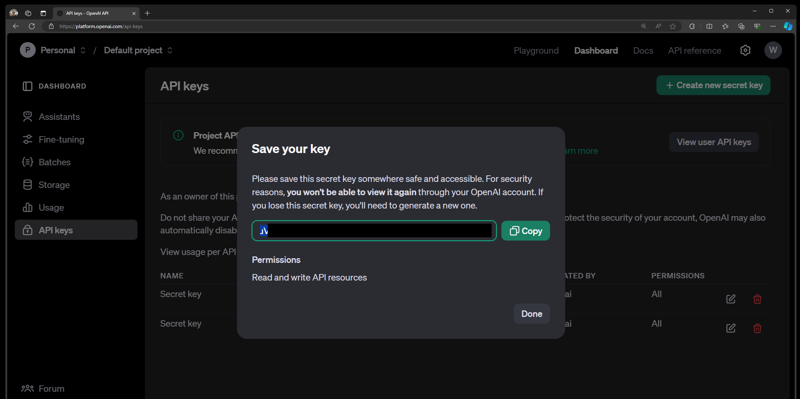
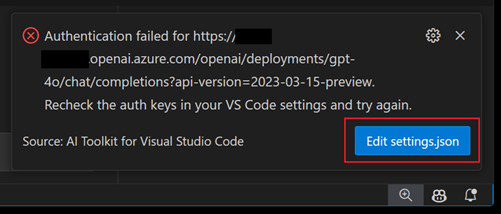
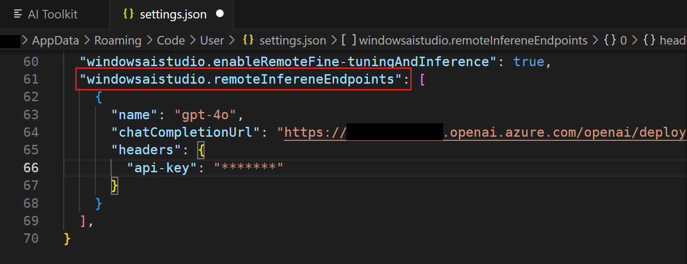
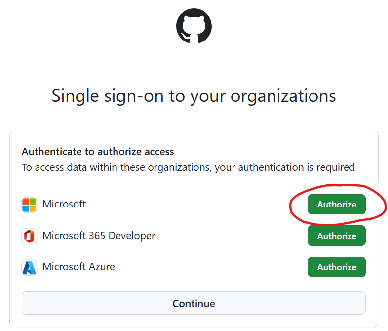

# AI Toolkit FAQ {#ai-toolkit-faq}

## 모델 {#models}

### 원격 모델 엔드포인트와 인증 헤더를 어떻게 찾을 수 있나요? {#how-can-i-find-my-remote-model-endpoint-and-authentication-header}

다음은 일반적인 OpenAI 서비스 제공업체에서 엔드포인트와 인증 헤더를 찾는 방법에 대한 몇 가지 예입니다. 다른 제공업체에 대해서는 채팅 완료 엔드포인트 및 인증 헤더에 대한 문서를 확인하세요.

#### 예제 1: Azure OpenAI {#example-1-azure-openai}

1. [Azure OpenAI Studio](https://oai.azure.com/)의 **Deployments** 탭으로 이동하여 `gpt-4o`와 같은 배포를 선택합니다. 배포가 아직 없다면, 배포를 생성하는 방법에 대한 [Azure OpenAI 문서](https://learn.microsoft.com/en-us/azure/ai-services/openai/how-to/create-resource?pivots=web-portal)를 확인하세요.

    

1. **Endpoint** 섹션의 **Target URI** 필드에서 채팅 완료 엔드포인트를 검색합니다.

    

1. **Endpoint** 섹션의 **Key** 속성에서 API 키를 가져옵니다.

    API 키를 복사한 후, AI Toolkit의 인증 헤더에 `api-key: <YOUR_API_KEY>` 형식으로 추가하세요. 인증 헤더에 대한 자세한 내용은 [Azure OpenAI 서비스 문서](https://learn.microsoft.com/en-us/azure/ai-services/openai/reference#request-header-2)를 참조하세요.

#### 예제 2: OpenAI {#example-2-openai}

1. 현재 채팅 완료 엔드포인트는 `https://api.openai.com/v1/chat/completions`로 고정되어 있습니다. 이에 대한 자세한 내용은 [OpenAI 문서](https://platform.openai.com/docs/api-reference/chat/create)를 확인하세요.

1. [OpenAI 문서](https://platform.openai.com/docs/api-reference/authentication)로 이동하여 `API 키` 또는 `프로젝트 API 키`를 선택하여 API 키를 생성하거나 검색합니다.

    API 키를 복사한 후, AI Toolkit의 인증 헤더에 `Authorization: Bearer <YOUR_API_KEY>` 형식으로 입력하세요. 추가 정보는 OpenAI 문서를 참조하세요.

    

### 엔드포인트 URL 또는 인증 헤더를 어떻게 수정하나요? {#how-to-edit-endpoint-url-or-authentication-header}

잘못된 엔드포인트나 인증 헤더를 입력하면 추론 시 오류가 발생할 수 있습니다.

1. VS Code의 `setting.json` 파일을 엽니다:

    - 인증 실패 알림에서 `Edit settings.json`을 선택합니다.

        

    - 또는 명령 팔레트에서 `Open User Settings (JSON)`을 입력합니다 (`kb(workbench.action.showCommands)`).

1. `windowsaistudio.remoteInfereneEndpoints` 설정을 검색합니다.

1. 기존 엔드포인트 URL 또는 인증 헤더를 수정하거나 제거합니다.

    

    설정을 저장하면 트리 뷰 또는 플레이그라운드의 모델 목록이 자동으로 새로 고쳐집니다.

### OpenAI o1-mini 또는 OpenAI o1-preview 대기자 명단에 어떻게 가입하나요? {#how-can-i-join-the-waitlist-for-openai-o1-mini-or-openai-o1-preview}

OpenAI o1 시리즈 모델은 추론 및 문제 해결 작업을 보다 집중적이고 능력 있게 처리하도록 특별히 설계되었습니다. 이러한 모델은 사용자의 요청을 처리하고 이해하는 데 더 많은 시간을 할애하여 과학, 코딩, 수학 및 유사한 분야에서 특히 강력합니다. 예를 들어, o1은 의료 연구자가 세포 염기서열 데이터를 분석하고 주석을 다는데, 물리학자가 양자 광학에 필요한 복잡한 수학 공식을 생성하는 데, 그리고 모든 분야의 개발자가 다단계 워크플로우를 구축하고 실행하는 데 사용할 수 있습니다.

:::important
o1-preview 모델은 제한된 접근이 가능합니다. 플레이그라운드에서 모델을 사용해 보려면 등록이 필요하며, 접근은 Microsoft의 적격 기준에 따라 부여됩니다.
:::

[GitHub 모델 마켓](https://aka.ms/github-model-marketplace)을 방문하여 OpenAI o1-mini 또는 OpenAI o1-preview를 찾아 대기자 명단에 가입하세요.

### 내 모델이나 Hugging Face의 다른 모델을 사용할 수 있나요? {#can-i-use-my-own-models-or-other-models-from-hugging-face}

자신의 모델이 OpenAI API 계약을 지원하는 경우, 클라우드에 호스팅하고 [AI Toolkit에 모델 추가하기](/docs/intelligentapps/models.md)로 사용자 정의 모델로 추가할 수 있습니다. 모델 엔드포인트 URL, 접근 키 및 모델 이름과 같은 주요 정보를 제공해야 합니다.

## 미세 조정 {#fine-tuning}

### 미세 조정 설정이 많습니다. 모든 설정에 대해 신경써야 하나요? {#there-are-many-fine-tuning-settings-do-i-need-to-worry-about-all-of-them}

아니요, 기본 설정과 샘플 데이터 세트를 사용하여 테스트를 실행할 수 있습니다. 자신만의 데이터 세트를 선택할 수도 있지만, 일부 설정을 조정해야 합니다. 자세한 내용은 [미세 조정 튜토리얼](https://github.com/AI-Mou/windows-ai-studio/blob/main/walkthrough-hf-dataset.md)을 참조하세요.

### AI Toolkit이 미세 조정 프로젝트를 생성하지 않습니다 {#ai-toolkit-does-not-scaffold-the-fine-tuning-project}

확장 프로그램을 설치하기 전에 [확장 프로그램 필수 조건](https://github.com/AI-Mou/windows-ai-studio/blob/main/README.md#prerequisites)을 확인하세요.

### NVIDIA GPU 장치가 있지만 필수 조건 검사가 실패합니다 {#i-have-the-nvidia-gpu-device-but-the-prerequisites-check-fails}

NVIDIA GPU 장치가 있지만 "GPU가 감지되지 않음"이라는 메시지와 함께 필수 조건 검사가 실패하는 경우, 최신 드라이버가 설치되어 있는지 확인하세요. 드라이버는 [NVIDIA 사이트](https://www.nvidia.com/Download/index.aspx?lang=en-us)에서 확인하고 다운로드할 수 있습니다.

또한, 드라이버가 경로에 설치되어 있는지 확인하세요. 확인하려면 명령줄에서 `nvidia-smi`를 실행하세요.

### 프로젝트를 생성했지만 Conda 활성화가 환경을 찾지 못합니다 {#i-generated-the-project-but-conda-activate-fails-to-find-the-environment}

환경 설정에 문제가 있었을 수 있습니다. 작업 공간 내에서 `bash /mnt/[PROJECT_PATH]/setup/first_time_setup.sh`를 사용하여 수동으로 환경을 초기화할 수 있습니다.

### Hugging Face 데이터 세트를 사용할 때, 어떻게 가져오나요? {#when-using-a-hugging-face-dataset-how-do-i-get-it}

`python finetuning/invoke_olive.py` 명령을 시작하기 전에 `huggingface-cli login` 명령을 실행해야 합니다. 이렇게 하면 데이터 세트를 대신 다운로드할 수 있습니다.

## 환경 {#environment}

### 이 확장은 Linux 또는 다른 시스템에서 작동하나요? {#does-the-extension-work-in-linux-or-other-systems}

네, AI Toolkit은 Windows, Mac 및 Linux에서 실행됩니다.

### WSL에서 Conda 자동 활성화를 비활성화하려면 어떻게 하나요? {#how-can-i-disable-the-conda-auto-activation-from-my-wsl}

WSL에서 Conda 설치를 비활성화하려면 `conda config --set auto_activate_base false`를 실행하세요. 이렇게 하면 기본 환경이 비활성화됩니다.

### 오늘날 컨테이너를 지원하나요? {#do-you-support-containers-today}

현재 컨테이너 지원을 위해 작업 중이며, 향후 릴리스에서 활성화될 예정입니다.

### GitHub 및 Hugging Face 자격 증명이 필요한 이유는 무엇인가요? {#why-do-you-need-github-and-hugging-face-credentials}

우리는 모든 프로젝트 템플릿을 GitHub에 호스팅하고 있으며, 기본 모델은 Azure 또는 Hugging Face에 호스팅되고 있습니다. 이러한 환경은 API를 통해 접근하기 위해 계정이 필요합니다.

### Llama2 다운로드 중 오류가 발생합니다 {#i-am-getting-an-error-downloading-llama2}

[Llama 2 가입 페이지](https://github.com/llama2-onnx/signup)를 통해 Llama에 대한 접근을 요청하세요. 이는 Meta의 무역 준수를 준수하기 위해 필요합니다.

### WSL 인스턴스 내에서 프로젝트를 저장할 수 없습니다 {#i-cant-save-project-inside-wsl-instance}

AI Toolkit 작업을 실행할 때 원격 세션이 현재 지원되지 않으므로 WSL에 연결된 상태에서 프로젝트를 저장할 수 없습니다. 원격 연결을 종료하려면 화면 왼쪽 하단에서 "WSL"을 선택하고 "Close Remote Connections"를 선택하세요.

### 오류: GitHub API 금지됨 {#error-github-api-forbidden}

우리는 `microsoft/windows-ai-studio-templates` GitHub 리포지토리에 프로젝트 템플릿을 호스팅하고 있으며, 확장은 GitHub API를 사용하여 리포지토리 내용을 로드합니다. Microsoft에 소속되어 있는 경우, 이러한 금지 문제를 피하기 위해 Microsoft 조직에 대한 권한을 부여해야 할 수 있습니다.

[이 문제](https://github.com/microsoft/vscode-ai-toolkit/issues/70#issuecomment-2126089884)를 참조하여 우회 방법을 확인하세요. 자세한 단계는 다음과 같습니다:

1. VS Code에서 GitHub 계정 로그아웃
1. VS Code와 AI Toolkit을 다시 로드하면 GitHub에 다시 로그인하라는 메시지가 표시됩니다.
1. **중요:** 브라우저의 권한 부여 페이지에서 Microsoft 조직에 대한 앱 접근을 허용하세요.

    

### ONNX 모델을 나열, 로드 또는 다운로드할 수 없습니다 {#cannot-list-load-or-download-onnx-model}

VS Code 출력 패널에서 AI Toolkit 로그를 확인하세요. *Agent* 오류나 *다운로드된 모델을 가져오는 데 실패했습니다*라는 메시지가 표시되면 모든 VS Code 인스턴스를 닫고 VS Code를 다시 엽니다.

(*이 문제는 기본 ONNX 에이전트가 예기치 않게 종료되어 발생하며, 위의 단계는 에이전트를 재시작하기 위한 것입니다.*)