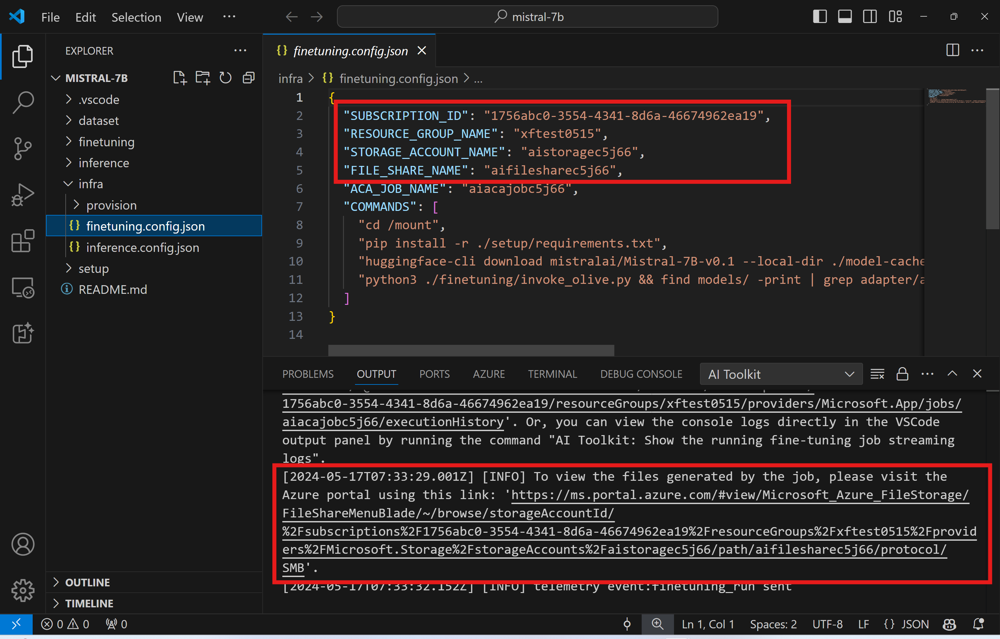
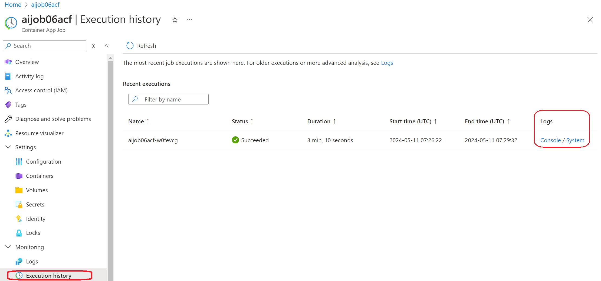
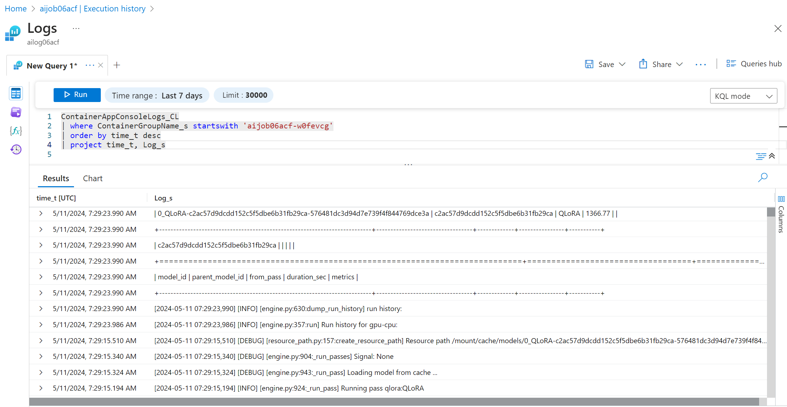
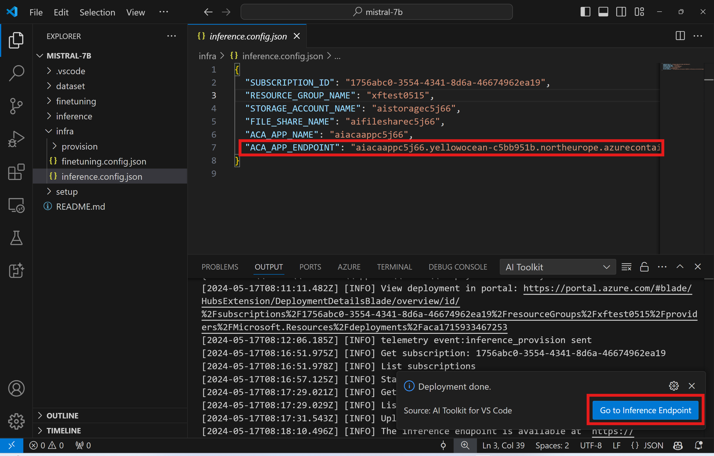
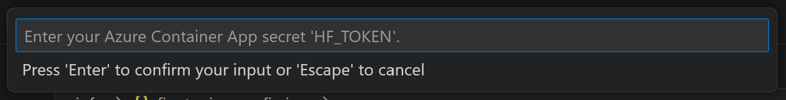

# 미세 조정 모델 {#fine-tune-models}

미세 조정 AI 모델은 사용자 정의 데이터 세트를 사용하여 GPU가 있는 컴퓨팅 환경에서 사전 훈련된 모델에 대해 **미세 조정** 작업을 실행할 수 있게 해주는 일반적인 방법입니다. AI Toolkit은 현재 GPU가 있는 로컬 머신 또는 클라우드(Azure Container App)에서 SLM의 미세 조정을 지원합니다.

미세 조정된 모델은 로컬로 다운로드하여 GPU로 추론 테스트를 수행하거나, CPU에서 로컬로 실행할 수 있도록 양자화할 수 있습니다. 미세 조정된 모델은 원격 모델로 클라우드 환경에 배포할 수도 있습니다.

## AI Toolkit을 사용하여 Azure에서 AI 모델 미세 조정하기 (미리 보기) {#fine-tune-ai-models-on-azure-with-ai-toolkit-for-vs-code-preview}

AI Toolkit for VS Code는 이제 모델 미세 조정을 실행하고 클라우드에서 추론 엔드포인트를 호스팅하기 위해 Azure Container App을 프로비저닝하는 것을 지원합니다.

### 클라우드 환경 설정 {#set-up-your-cloud-environment}

1. 원격 Azure Container Apps 환경에서 모델 미세 조정 및 추론을 실행하려면, 구독에 충분한 GPU 용량이 있는지 확인하십시오. 애플리케이션에 필요한 용량을 요청하려면 [지원 티켓](https://azure.microsoft.com/support/create-ticket/)을 제출하십시오. [GPU 용량에 대한 자세한 정보 얻기](https://learn.microsoft.com/en-us/azure/container-apps/workload-profiles-overview)

1. [HuggingFace 계정](https://huggingface.co/)을 가지고 있는지 확인하고, HuggingFace에서 개인 데이터 세트를 사용하거나 기본 모델에 대한 액세스 제어가 필요한 경우 [액세스 토큰을 생성](https://huggingface.co/docs/hub/security-tokens)하십시오.

1. Mistral 또는 Llama를 미세 조정하는 경우 HuggingFace의 라이센스를 수락하십시오.

1. AI Toolkit for VS Code에서 원격 미세 조정 및 추론 기능 플래그를 활성화하십시오.
    1. *파일 -> 기본 설정 -> 설정*을 선택하여 VS Code 설정을 엽니다.
    1. *확장*으로 이동하여 *AI Toolkit*을 선택합니다.
    1. *"Azure Container Apps에서 미세 조정 및 추론 실행 활성화"* 옵션을 선택합니다.

      

    1. 변경 사항을 적용하려면 VS Code를 다시 로드하십시오.

### 미세 조정 프로젝트 스캐폴드 {#scaffold-a-fine-tune-project}

1. 명령 팔레트에서 `AI Toolkit: Focus on Tools View`를 실행합니다 (`kb(workbench.action.showCommands)`)
1. `Fine-tuning`으로 이동하여 모델 카탈로그에 접근합니다. 미세 조정을 위한 모델을 선택합니다. 프로젝트 이름을 지정하고 머신의 위치를 선택합니다. 그런 다음 *"프로젝트 구성"* 버튼을 클릭합니다.
    
1. 프로젝트 구성
    1. *"로컬에서 미세 조정"* 옵션을 활성화하지 마십시오.
    1. 올리브 구성 설정이 미리 설정된 기본값으로 나타납니다. 필요에 따라 이러한 구성을 조정하고 입력하십시오.
    1. *프로젝트 생성*으로 진행합니다. 이 단계에서는 WSL을 활용하며, 새로운 Conda 환경을 설정하고 Dev Containers를 포함한 향후 업데이트를 준비합니다.
      
    1. *"작업 공간에서 창 다시 시작"*을 선택하여 미세 조정 프로젝트를 엽니다.
      

> [!NOTE]
> 현재 프로젝트는 AI Toolkit for VS Code 내에서 로컬 또는 원격으로 작동합니다. 프로젝트 생성 중 *"로컬에서 미세 조정"*을 선택하면 클라우드 리소스 없이 WSL에서만 실행됩니다. 그렇지 않으면 프로젝트는 원격 Azure Container App 환경에서 실행되도록 제한됩니다.

### Azure 리소스 프로비저닝 {#provision-azure-resources}

시작하려면 원격 미세 조정을 위한 Azure 리소스를 프로비저닝해야 합니다. 명령 팔레트에서 `AI Toolkit: Provision Azure Container Apps job for fine-tuning`을 찾아 실행합니다. 이 과정에서 Azure 구독 및 리소스 그룹을 선택하라는 메시지가 표시됩니다.


출력 채널에 표시된 링크를 통해 프로비저닝 진행 상황을 모니터링합니다.


### 미세 조정 실행 {#run-fine-tuning}

원격 미세 조정 작업을 시작하려면 명령 팔레트에서 `AI Toolkit: Run fine-tuning` 명령을 실행합니다.


확장 프로그램은 다음 작업을 수행합니다:

1. Azure Files와 작업 공간을 동기화합니다.

1. `./infra/fintuning.config.json`에 지정된 명령을 사용하여 Azure Container App 작업을 트리거합니다.

QLoRA가 미세 조정에 사용되며, 미세 조정 과정에서 모델이 추론 중 사용할 LoRA 어댑터를 생성합니다.

미세 조정 결과는 Azure Files에 저장됩니다.
Azure 파일 공유에서 출력 파일을 탐색하려면 출력 패널에 제공된 링크를 사용하여 Azure 포털로 이동할 수 있습니다. 또는 Azure 포털에 직접 접근하여 `./infra/fintuning.config.json`에 정의된 `STORAGE_ACCOUNT_NAME`이라는 이름의 스토리지 계정과 `FILE_SHARE_NAME`이라는 이름의 파일 공유를 찾을 수 있습니다.



### 로그 보기 {#view-logs}

미세 조정 작업이 시작되면 [Azure 포털](https://portal.azure.com)을 방문하여 시스템 및 콘솔 로그에 접근할 수 있습니다.

또는 VSCode 출력 패널에서 콘솔 로그를 직접 볼 수 있습니다.


> [!NOTE]
> 작업이 시작되는 데 몇 분이 걸릴 수 있습니다. 이미 실행 중인 작업이 있는 경우 현재 작업은 나중에 시작되도록 대기열에 추가될 수 있습니다.

#### Azure에서 로그 보기 및 쿼리 {#view-and-query-logs-on-azure}

미세 조정 작업이 트리거된 후, VSCode 알림에서 "*Azure 포털에서 로그 열기*" 버튼을 선택하여 Azure에서 로그를 볼 수 있습니다.

또는 Azure 포털을 이미 열어 두었다면, Azure Container Apps 작업의 "*실행 기록*" 패널에서 작업 기록을 찾을 수 있습니다.



로그에는 "*콘솔*"과 "*시스템*"의 두 가지 유형이 있습니다.

- 콘솔 로그는 `stderr` 및 `stdout` 메시지를 포함하여 앱의 메시지입니다. 이는 스트리밍 로그 섹션에서 이미 보았던 내용입니다.
- 시스템 로그는 Azure Container Apps 서비스의 메시지로, 서비스 수준 이벤트의 상태를 포함합니다.

로그를 보고 쿼리하려면 "*콘솔*" 버튼을 선택하고 모든 로그를 보고 쿼리를 작성할 수 있는 로그 분석 페이지로 이동합니다.



> Azure Container Apps 로그에 대한 자세한 내용은 [Azure Container Apps의 애플리케이션 로깅](https://learn.microsoft.com/azure/container-apps/logging)을 참조하십시오.

#### VSCode에서 스트리밍 로그 보기 {#view-streaming-logs-in-vscode}

미세 조정 작업을 시작한 후, VSCode 알림에서 "*VS Code에서 스트리밍 로그 표시*" 버튼을 선택하여 Azure에서 로그를 볼 수 있습니다.

또는 명령 팔레트에서 `AI Toolkit: Show the running fine-tuning job streaming logs` 명령을 실행할 수 있습니다.


실행 중인 미세 조정 작업의 스트리밍 로그가 출력 패널에 표시됩니다.


> [!NOTE]
> 작업이 리소스 부족으로 인해 대기열에 추가될 수 있습니다. 로그가 표시되지 않으면 잠시 기다린 후 명령을 실행하여 스트리밍 로그에 다시 연결하십시오.
> 스트리밍 로그는 타임아웃되어 연결이 끊길 수 있습니다. 그러나 명령을 다시 실행하여 재연결할 수 있습니다.

## 미세 조정된 모델로 추론하기 {#inferencing-with-the-fine-tuned-model}

어댑터가 원격 환경에서 훈련된 후, 간단한 Gradio 애플리케이션을 사용하여 모델과 상호작용합니다.


### Azure 리소스 프로비저닝 {#provision-azure-resources}

미세 조정 과정과 유사하게, 원격 추론을 위한 Azure 리소스를 설정하려면 명령 팔레트에서 `AI Toolkit: Provision Azure Container Apps for inference`를 실행하십시오. 이 설정 중에 Azure 구독 및 리소스 그룹을 선택하라는 메시지가 표시됩니다.


기본적으로 추론을 위한 구독 및 리소스 그룹은 미세 조정에 사용된 것과 일치해야 합니다. 추론은 동일한 Azure Container App 환경을 사용하고, 미세 조정 단계에서 생성된 Azure Files에 저장된 모델 및 모델 어댑터에 접근합니다.

### 추론을 위한 배포 {#deployment-for-inference}

추론 코드를 수정하거나 추론 모델을 다시 로드하려면 `AI Toolkit: Deploy for inference` 명령을 실행하십시오. 이렇게 하면 최신 코드가 ACA와 동기화되고 복제본이 재시작됩니다.


배포가 성공적으로 완료되면 이제 이 엔드포인트를 사용하여 모델을 평가할 준비가 완료됩니다.
VSCode 알림에 표시된 "*추론 엔드포인트로 이동*" 버튼을 선택하여 추론 API에 접근할 수 있습니다. 또는 웹 API 엔드포인트는 `./infra/inference.config.json`의 `ACA_APP_ENDPOINT` 아래에서 찾을 수 있으며, 출력 패널에서도 확인할 수 있습니다.



> [!NOTE]
> 추론 엔드포인트가 완전히 작동하려면 몇 분이 걸릴 수 있습니다.

## 고급 사용법 {#advanced-usage}

### 미세 조정 프로젝트 구성 요소 {#fine-tune-project-components}

| 폴더 | 내용 |
| ------ |--------- |
| `infra` | 원격 작업에 필요한 모든 구성을 포함합니다. |
| `infra/provision/finetuning.parameters.json` | 미세 조정을 위한 Azure 리소스 프로비저닝에 사용되는 bicep 템플릿의 매개변수를 보유합니다. |
| `infra/provision/finetuning.bicep` | 미세 조정을 위한 Azure 리소스 프로비저닝에 사용되는 템플릿을 포함합니다. |
| `infra/finetuning.config.json` | `AI Toolkit: Provision Azure Container Apps job for fine-tuning` 명령에 의해 생성된 구성 파일입니다. 다른 원격 명령 팔레트의 입력으로 사용됩니다. |

### Azure Container Apps에서 미세 조정을 위한 비밀 구성 {#configuring-secrets-for-fine-tuning-in-azure-container-apps}

Azure Container App 비밀은 HuggingFace 토큰 및 Weights & Biases API 키와 같은 민감한 데이터를 Azure Container Apps 내에서 안전하게 저장하고 관리하는 방법을 제공합니다. AI Toolkit의 명령 팔레트를 사용하여 비밀을 프로비저닝된 Azure 컨테이너 앱 작업에 입력할 수 있습니다( `./finetuning.config.json`에 저장됨). 이러한 비밀은 모든 컨테이너의 **환경 변수**로 설정됩니다.

#### 단계 {#steps}

1. 명령 팔레트에서 `AI Toolkit: Add Azure Container Apps Job secret for fine-tuning`을 입력하고 선택합니다.

    

1. 비밀 이름 및 값을 입력합니다: 비밀의 이름과 값을 입력하라는 메시지가 표시됩니다.
    
    
    예를 들어, 개인 HuggingFace 데이터 세트 또는 Hugging Face 액세스 제어가 필요한 모델을 사용하는 경우, HuggingFace 토큰을 환경 변수 [`HF_TOKEN`](https://huggingface.co/docs/huggingface_hub/package_reference/environment_variables#hftoken)로 설정하여 Hugging Face Hub에서 수동 로그인을 피할 수 있습니다.

비밀을 설정한 후, 이제 Azure Container App에서 사용할 수 있습니다. 비밀은 컨테이너 앱의 환경 변수에 설정됩니다.

### 미세 조정을 위한 Azure 리소스 프로비저닝 구성 {#configuring-azure-resource-provision-for-fine-tune}

이 가이드는 `AI Toolkit: Provision Azure Container Apps job for fine-tuning` 명령을 구성하는 데 도움이 됩니다.

구성 매개변수는 `./infra/provision/finetuning.parameters.json` 파일에서 찾을 수 있습니다. 세부 사항은 다음과 같습니다:

| 매개변수 | 설명 |
| --------- |------------ |
| `defaultCommands` | 미세 조정 작업을 시작하는 기본 명령입니다. `./infra/finetuning.config.json`에서 덮어쓸 수 있습니다. |
| `maximumInstanceCount` | 이 매개변수는 GPU 인스턴스의 최대 용량을 설정합니다. |
| `timeout` | 이 매개변수는 Azure Container App 미세 조정 작업의 타임아웃을 초 단위로 설정합니다. 기본값은 10800으로, 3시간에 해당합니다. Azure Container App 작업이 이 타임아웃에 도달하면 미세 조정 과정이 중단됩니다. 그러나 기본적으로 체크포인트가 저장되어, 다시 실행할 경우 마지막 체크포인트에서 미세 조정 과정을 재개할 수 있습니다. |
| `location` | Azure 리소스가 프로비저닝되는 위치입니다. 기본값은 선택한 리소스 그룹의 위치와 동일합니다. |
| `storageAccountName`, `fileShareName`, `acaEnvironmentName`, `acaEnvironmentStorageName`, `acaJobName`, `acaLogAnalyticsName` | 이 매개변수들은 프로비저닝할 Azure 리소스의 이름을 지정하는 데 사용됩니다. 새로 사용되지 않는 리소스 이름을 입력하여 사용자 정의 이름의 리소스를 생성하거나, 이미 존재하는 Azure 리소스의 이름을 입력하여 사용할 수 있습니다. 자세한 내용은 [기존 Azure 리소스 사용](#using-existing-azure-resources) 섹션을 참조하십시오. |

### 기존 Azure 리소스 사용 {#using-existing-azure-resources}

미세 조정을 위해 구성해야 할 기존 Azure 리소스가 있는 경우, `./infra/provision/finetuning.parameters.json` 파일에 이름을 지정하고 명령 팔레트에서 `AI Toolkit: Provision Azure Container Apps job for fine-tuning`을 실행하십시오. 이렇게 하면 지정한 리소스가 업데이트되고 누락된 리소스가 생성됩니다.

예를 들어, 기존 Azure 컨테이너 환경이 있는 경우 `./infra/finetuning.parameters.json`은 다음과 같아야 합니다:

```json
{
    "$schema": "https://schema.management.azure.com/schemas/2019-04-01/deploymentParameters.json#",
    "contentVersion": "1.0.0.0",
    "parameters": {
      ...
      "acaEnvironmentName": {
        "value": "<your-aca-env-name>"
      },
      "acaEnvironmentStorageName": {
        "value": null
      },
      ...
    }
  }
```

### 수동 프로비저닝 {#manual-provisioning}

Azure 리소스를 수동으로 설정하려는 경우, `./infra/provision` 폴더에 제공된 bicep 파일을 사용할 수 있습니다. AI Toolkit 명령 팔레트를 사용하지 않고 모든 Azure 리소스를 이미 설정하고 구성한 경우, `finetune.config.json` 파일에 리소스 이름을 입력하면 됩니다.

예를 들어:

```json
{
  "SUBSCRIPTION_ID": "<your-subscription-id>",
  "RESOURCE_GROUP_NAME": "<your-resource-group-name>",
  "STORAGE_ACCOUNT_NAME": "<your-storage-account-name>",
  "FILE_SHARE_NAME": "<your-file-share-name>",
  "ACA_JOB_NAME": "<your-aca-job-name>",
  "COMMANDS": [
    "cd /mount",
    "pip install huggingface-hub==0.22.2",
    "huggingface-cli download <your-model-name> --local-dir ./model-cache/<your-model-name> --local-dir-use-symlinks False",
    "pip install -r ./setup/requirements.txt",
    "python3 ./finetuning/invoke_olive.py && find models/ -print | grep adapter/adapter"
  ]
}
```

### 템플릿에 포함된 추론 구성 요소 {#inference-components-included-in-the-template}

| 폴더 | 내용 |
| ------ |--------- |
| `infra` | 원격 작업에 필요한 모든 구성을 포함합니다. |
| `infra/provision/inference.parameters.json` | 추론을 위한 Azure 리소스 프로비저닝에 사용되는 bicep 템플릿의 매개변수를 보유합니다. |
| `infra/provision/inference.bicep` | 추론을 위한 Azure 리소스 프로비저닝에 사용되는 템플릿을 포함합니다. |
| `infra/inference.config.json` | `AI Toolkit: Provision Azure Container Apps for inference` 명령에 의해 생성된 구성 파일입니다. 다른 원격 명령 팔레트의 입력으로 사용됩니다. |

### Azure 리소스 프로비저닝 구성 {#configuring-azure-resource-provisioning}

이 가이드는 `AI Toolkit: Provision Azure Container Apps for inference` 명령을 구성하는 데 도움이 됩니다.

구성 매개변수는 `./infra/provision/inference.parameters.json` 파일에서 찾을 수 있습니다. 세부 사항은 다음과 같습니다:

| 매개변수 | 설명 |
| --------- |------------ |
| `defaultCommands` | 웹 API를 시작하는 명령입니다. |
| `maximumInstanceCount` | 이 매개변수는 GPU 인스턴스의 최대 용량을 설정합니다. |
| `location` | Azure 리소스가 프로비저닝되는 위치입니다. 기본값은 선택한 리소스 그룹의 위치와 동일합니다. |
| `storageAccountName`, `fileShareName`, `acaEnvironmentName`, `acaEnvironmentStorageName`, `acaAppName`, `acaLogAnalyticsName` | 이 매개변수들은 프로비저닝할 Azure 리소스의 이름을 지정하는 데 사용됩니다. 기본적으로 미세 조정 리소스 이름과 동일하게 설정됩니다. 새로 사용되지 않는 리소스 이름을 입력하여 사용자 정의 이름의 리소스를 생성하거나, 이미 존재하는 Azure 리소스의 이름을 입력하여 사용할 수 있습니다. 자세한 내용은 [기존 Azure 리소스 사용](#using-existing-azure-resources) 섹션을 참조하십시오. |

### 기존 Azure 리소스 사용 {#using-existing-azure-resources}

기본적으로 추론 프로비저닝은 미세 조정에 사용된 동일한 Azure Container App 환경, 스토리지 계정, Azure 파일 공유 및 Azure 로그 분석을 사용합니다. 추론 API를 위해 별도의 Azure Container App이 생성됩니다.

미세 조정 단계에서 Azure 리소스를 사용자 정의했거나 추론을 위해 자신의 기존 Azure 리소스를 사용하려는 경우, `./infra/inference.parameters.json` 파일에 이름을 지정하십시오. 그런 다음 명령 팔레트에서 `AI Toolkit: Provision Azure Container Apps for inference` 명령을 실행하십시오. 이렇게 하면 지정된 리소스가 업데이트되고 누락된 리소스가 생성됩니다.

예를 들어, 기존 Azure 컨테이너 환경이 있는 경우 `./infra/finetuning.parameters.json`은 다음과 같아야 합니다:

```json
{
    "$schema": "https://schema.management.azure.com/schemas/2019-04-01/deploymentParameters.json#",
    "contentVersion": "1.0.0.0",
    "parameters": {
      ...
      "acaEnvironmentName": {
        "value": "<your-aca-env-name>"
      },
      "acaEnvironmentStorageName": {
        "value": null
      },
      ...
    }
  }
```

### 수동 프로비저닝 {#manual-provisioning}

Azure 리소스를 수동으로 구성하려는 경우, `./infra/provision` 폴더에 제공된 bicep 파일을 사용할 수 있습니다. AI Toolkit 명령 팔레트를 사용하지 않고 모든 Azure 리소스를 이미 설정하고 구성한 경우, `inference.config.json` 파일에 리소스 이름을 입력하면 됩니다.

예를 들어:

```json
{
  "SUBSCRIPTION_ID": "<your-subscription-id>",
  "RESOURCE_GROUP_NAME": "<your-resource-group-name>",
  "STORAGE_ACCOUNT_NAME": "<your-storage-account-name>",
  "FILE_SHARE_NAME": "<your-file-share-name>",
  "ACA_APP_NAME": "<your-aca-name>",
  "ACA_APP_ENDPOINT": "<your-aca-endpoint>"
}
```
