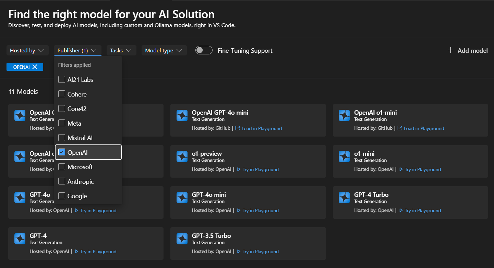
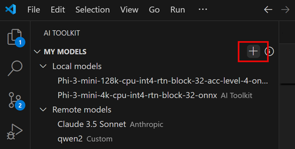
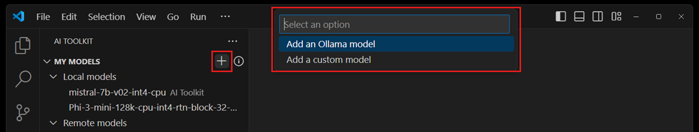

# AI Toolkit의 모델 {#models-in-ai-toolkit}

AI Toolkit은 다양한 생성 AI 모델을 지원합니다. 소형 언어 모델(SLM)과 대형 언어 모델(LLM) 모두 지원됩니다.

모델 카탈로그에서 다양한 출처의 모델에 접근할 수 있습니다:

- GitHub에 호스팅된 모델 (Llama3, Phi-3, Mistral 모델)
- 퍼블리셔가 호스팅하는 모델 (OpenAI ChatGPT 모델, Anthropic Claude, Google Gemini)
- HuggingFace와 같은 곳에서 로컬로 다운로드한 모델
- 로컬에서 실행 중인 Ollama 모델
- Bring-Your-Own-Models에 연결

## 모델 찾기 {#find-a-model}

모델 카탈로그에서 모델을 찾으려면:

1. 활동 표시줄에서 AI Toolkit 보기를 선택합니다.

1. **CATALOG** > **Models**를 선택하여 모델 카탈로그를 엽니다.

    

    모델 카탈로그에서 모델 카드를 선택하여 선택한 모델의 자세한 정보를 확인합니다.

1. 필터를 사용하여 사용 가능한 모델 목록을 줄입니다.

    - **osted by**: AI Toolkit은 GitHub, ONNX, OpenAI, Anthropic, Google을 모델 호스팅 출처로 지원합니다.

    - **Publisher**: Microsoft, Meta, Google, OpenAI, Anthropic, Mistral AI 등 AI 모델의 퍼블리셔입니다.

    - **Tasks**: 현재는 `Text Generation`만 지원됩니다.

    - **Model type**: 원격 또는 로컬에서 CPU, GPU 또는 NPU에서 실행할 수 있는 모델을 필터링합니다. 이 필터는 로컬 가용성에 따라 다릅니다.

    - **Fine-tuning Support**: 미세 조정을 실행할 수 있는 모델을 표시합니다.

자체 호스팅된 모델이나 로컬에서 실행 중인 Ollama 모델을 참조하려면:

1. 모델 카탈로그에서 **+ Add model**를 선택합니다.

1. Ollama 또는 사용자 정의 모델 중에서 선택합니다.

1. 모델을 추가하기 위한 세부 정보를 제공합니다.

## 라이선스 및 로그인 {#license-and-sign-in}

일부 모델은 퍼블리셔 또는 호스팅 서비스 라이선스와 계정 로그인이 필요합니다. 이 경우, [모델 플레이그라운드](/docs/intelligentapps/playground.md)에서 모델을 실행하기 전에 이 정보를 제공하라는 메시지가 표시됩니다.

## 테스트할 모델 선택 {#select-a-model-for-testing}

AI Toolkit은 모델 플레이그라운드에서 채팅 완성을 위해 모델을 테스트 실행할 수 있도록 합니다. 모델 카탈로그의 모델 카드에서 사용할 수 있는 다양한 옵션이 있습니다.

- **Try in Playground**: 다운로드 없이 선택한 모델을 플레이그라운드에서 테스트하기 위해 로드합니다.
- **Download**: Hugging Face와 같은 출처에서 모델을 다운로드합니다.
- **Load in Playground**: 다운로드한 모델을 플레이그라운드에 로드하여 채팅에 사용합니다.

## 나만의 모델 가져오기 {#bring-your-own-models}

AI Toolkit의 플레이그라운드는 원격 모델도 지원합니다. 인터넷에서 접근 가능한 자체 호스팅된 모델이나 배포된 모델이 있는 경우, 이를 AI Toolkit에 추가하고 플레이그라운드에서 사용할 수 있습니다.

1. 트리 뷰에서 **MY MODELS** 위에 마우스를 올리고 `+` 아이콘을 선택하여 원격 모델을 AI Toolkit에 추가합니다.
1. 모델 이름, 표시 이름, 모델 호스팅 URL 및 선택적 인증 문자열과 같은 요청된 정보를 입력합니다.

## Ollama 모델 추가 {#add-ollama-models}

Ollama는 많은 인기 있는 생성 AI 모델을 CPU를 통해 로컬에서 실행할 수 있도록 GGUF 양자화를 지원합니다. 로컬 머신에 Ollama가 설치되어 있고 다운로드한 Ollama 모델이 있는 경우, 이를 AI Toolkit에 추가하여 모델 플레이그라운드에서 사용할 수 있습니다.

### 필수 조건 {#prerequisites}

- AI Toolkit v0.6.2 이상.
- [Ollama](https://ollama.com/download) (Ollama v0.4.1에서 테스트됨)

### 로컬 Ollama를 AI Toolkit에 추가하기 {#add-local-ollama-into-ai-toolkit}

1. 트리 뷰에서 **MY MODELS** 위에 마우스를 올리고 "+" 아이콘을 선택하여 모델을 추가합니다.

    또는 모델 카탈로그나 플레이그라운드에서 **+ Add model** 버튼을 선택합니다.

1. **Ollama 모델 추가**를 선택합니다.

    

1. 다음으로 **Select models from Ollama library**을 선택합니다.

    Ollama 런타임을 다른 엔드포인트에서 시작하는 경우, **Provide custom Ollama endpoint**을 선택하여 Ollama 엔드포인트를 지정합니다.

1. AI Toolkit에 추가할 모델을 선택한 후 **OK**을 선택합니다.

    :::note
    AI Toolkit은 이미 Ollama에 다운로드되었지만 아직 AI Toolkit에 추가되지 않은 모델만 표시합니다. Ollama에서 모델을 다운로드하려면 `ollama pull <모델 이름>`을 실행할 수 있습니다. Ollama에서 지원하는 모델 목록을 보려면 [Ollama 라이브러리](https://ollama.com/library)를 참조하거나 [Ollama 문서](https://github.com/ollama/ollama)를 참조하세요.
    :::

1. 이제 트리 뷰의 모델 목록에서 선택한 Ollama 모델을 확인할 수 있습니다.

    :::note
    Ollama 모델에 대한 첨부는 아직 지원되지 않습니다. Ollama에 연결할 때 [OpenAI 호환 엔드포인트](https://github.com/ollama/ollama/blob/main/docs/openai.md)를 사용하며, 현재 첨부를 지원하지 않습니다.
    :::
