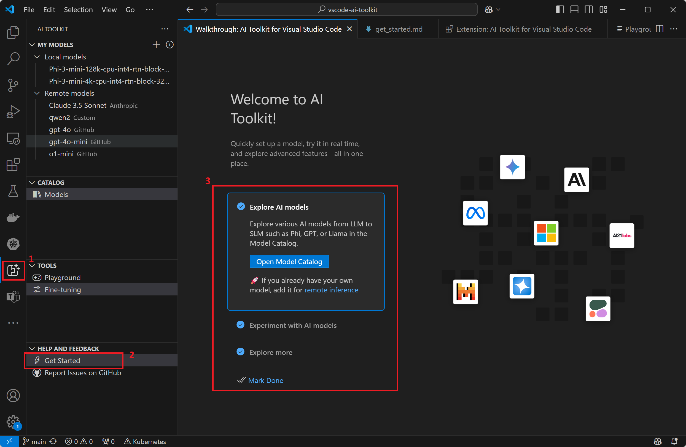

# Visual Studio Code용 AI Toolkit {#ai-toolkit-for-visual-studio-code}

Visual Studio Code용 AI 툴킷은 개발자와 AI 엔지니어가 생성 AI 모델을 사용하여 로컬 또는 클라우드에서 AI 앱을 쉽게 구축하고 테스트할 수 있도록 돕는 확장 프로그램입니다. AI 툴킷은 시장에 있는 대부분의 생성 AI 모델을 지원합니다.

AI 엔지니어는 AI 툴킷을 사용하여 첨부 파일 지원이 있는 플레이그라운드에서 인기 있는 AI 모델을 쉽게 발견하고 시도하며, 배치 모드에서 여러 프롬프트를 실행하고, 데이터셋에서 AI 모델에 대한 프롬프트를 평가하고, AI 모델을 미세 조정/배포할 수 있습니다.

## 주요 기능 {#key-features}

- [모델 카탈로그](/docs/intelligentapps/models.md) - 풍부한 생성 AI 모델 소스(GitHub, ONNX, OpenAI, Anthropic, Google 등)
- [자체 모델 가져오기](/docs/intelligentapps/models.md#bring-your-own-models) - 원격 호스팅된 모델 또는 로컬에서 실행 중인 Ollama 모델
- [플레이그라운드](/docs/intelligentapps/playground.md) - 모델 추론 또는 채팅을 통한 테스트
- [첨부 파일 지원](/docs/intelligentapps/playground.md#add-attachments-for-multi-modal-models) - 다중 모달 언어 모델을 위한
- [선택한 AI 모델에 대한 배치 실행 프롬프트](/docs/intelligentapps/bulkrun.md)
- [데이터셋으로 AI 모델 평가하기](/docs/intelligentapps/evaluation.md) - F1 점수, 관련성, 유사성, 일관성 등과 같은 지원되는 인기 평가자들

## AI 툴킷은 누구를 위한 것인가요? {#who-is-ai-toolkit-for}

AI 앱을 구축할 때 생성 AI 모델을 탐색하고, 테스트하고, 평가하고, 미세 조정하고자 하는 모든 개발자.

## 설치 및 설정 {#install-and-setup}

VS Code의 확장 보기에서 AI 툴킷을 설치할 수 있습니다:

> <a class="install-extension-btn" href="vscode:extension/ms-windows-ai-studio.windows-ai-studio">VS Code용 AI 툴킷 설치하기</a>

안정적인 기능을 위한 정식 출시 버전과 새로운 기능의 조기 액세스를 위한 사전 출시 버전 간에 설치를 전환할 수 있습니다. 각 버전의 자세한 기능 목록은 설치 중에 '새로운 기능'을 확인하세요.

## AI 툴킷 시작하기 {#get-started-with-ai-toolkit}

AI 툴킷에는 AI 툴킷의 기본을 배우는 데 사용할 수 있는 가이드가 있습니다. 이 가이드는 플레이그라운드를 안내하며, 여기서 채팅을 통해 AI 모델과 상호작용할 수 있습니다.

1. 활동 표시줄에서 AI 툴킷 보기를 선택합니다.

1. **Help and Feedback** 섹션에서 **Get Started**를 선택하여 안내서를 엽니다.

    

## 다음 단계 {#next-steps}

- AI 툴킷에서 [생성 AI 모델 추가하기](/docs/intelligentapps/models.md)에 대한 자세한 정보 얻기
- [모델 플레이그라운드](/docs/intelligentapps/playground.md)를 사용하여 모델과 상호작용하기
