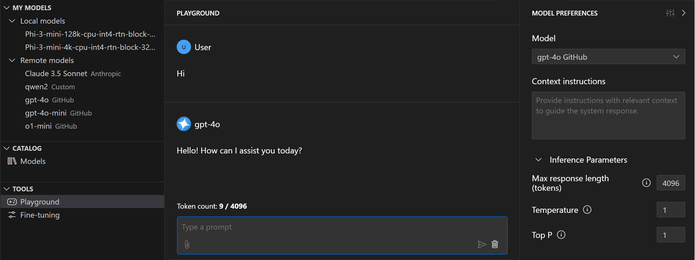
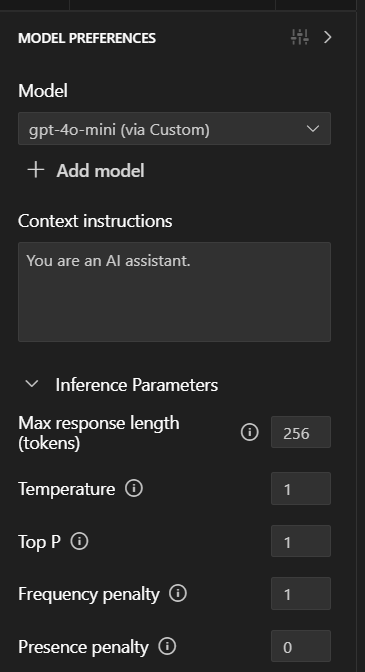
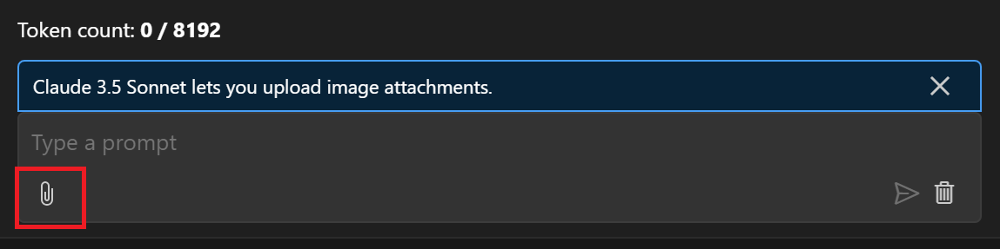

# AI Toolkit 플레이그라운드 {#ai-toolkit-playground}

AI Tooklit 플레이그라운드는 AI 모델과 상호작용하고 다양한 모델 매개변수 설정으로 다양한 프롬프트를 시도할 수 있게 해줍니다. 또한, 다양한 입력 형식의 첨부를 지원하는 다중 모달 모델과 상호작용하는 데에도 플레이그라운드를 사용할 수 있습니다.

## 플레이그라운드에서 모델 테스트하기 {#test-a-model-in-the-playground}

플레이그라운드에 접근하려면:

- AI Tooklit 뷰에서 **Playground**를 선택합니다.

- 모델 카탈로그에서 모델 카드의 **Load in Playground** 또는 **Try in Playground**를 선택합니다.

플레이그라운드에서 모델을 테스트하려면 다음 단계를 따르세요:

1. **Model Preferences**에서 드롭다운 목록에서 모델을 선택합니다.

    

1. 선택적으로, 모델의 응답을 조정할 수 있도록 추가 지침을 제공할 수 있습니다.

1. 선택적으로, 모델 매개변수를 구성합니다.

1. 채팅 입력 상자에 채팅 프롬프트를 입력합니다.

    채팅 입력 상자에서 채팅 기록을 지우거나 프롬프트에 대한 첨부 파일을 추가할 수도 있습니다.

## 다중 모달 모델을 위한 첨부 파일 추가하기 {#add-attachments-for-multi-modal-models}

다중 모달 모델은 텍스트, 이미지, 오디오 또는 비디오와 같은 여러 유형의 입력을 처리할 수 있는 모델입니다. 채팅 프롬프트에 파일을 첨부함으로써 이러한 파일의 내용에 대해 질문할 수 있습니다.

첨부 파일을 지원하는 모델의 경우, 채팅 입력 상자에 첨부 아이콘(종이 클립)이 표시됩니다. 아이콘을 선택하고 지침에 따라 하나 이상의 로컬 파일을 첨부하여 프롬프트와 함께 사용하세요.

