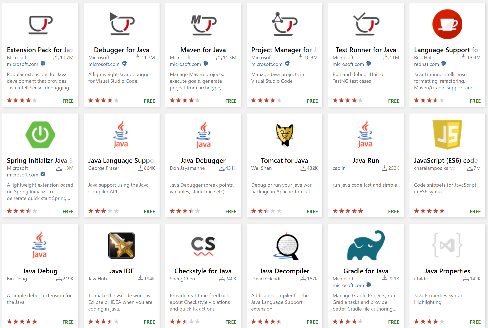

# Visual Studio Code를 위한 Java 확장 프로그램 {#java-extensions-for-visual-studio-code}

Visual Studio Code 주변의 훌륭한 Java 커뮤니티 덕분에 Java 개발 경험을 향상시키기 위해 다양한 확장 프로그램을 사용할 수 있습니다.

> **팁:** 확장 프로그램을 설치하고 관리하는 방법에 대해서는 일반 [VS Code 확장 문서](/docs/editor/extension-marketplace.md)를 참조하세요.

이 주제에서는 다양한 Java 개발 시나리오에 유용한 인기 확장 프로그램 목록을 추천합니다.

## 기본 Java 개발 {#fundamental-java-development}

Visual Studio Code에서 핵심 Java 개발 경험(자동 완성, Java 애플리케이션 실행/디버깅/테스트, Java 프로젝트 관리 등)을 찾고 있다면, [Java용 확장 팩](https://marketplace.visualstudio.com/items?itemName=vscjava.vscode-java-pack)을 추천합니다. 이 확장 팩에는 기본 Java 개발을 위한 인기 Java 확장 프로그램 목록이 포함되어 있습니다:

1. [Red Hat의 Java™ 언어 지원](https://marketplace.visualstudio.com/items?itemName=redhat.java)
2. [Java 디버거](https://marketplace.visualstudio.com/items?itemName=vscjava.vscode-java-debug)
3. [Java 테스트 러너](https://marketplace.visualstudio.com/items?itemName=vscjava.vscode-java-test)
4. [Java용 Maven](https://marketplace.visualstudio.com/items?itemName=vscjava.vscode-maven)
5. [Java 프로젝트 관리자](https://marketplace.visualstudio.com/items?itemName=vscjava.vscode-java-dependency)
6. [Visual Studio IntelliCode](https://marketplace.visualstudio.com/items?itemName=VisualStudioExptTeam.vscodeintellicode)

<a class="install-extension-btn" href="vscode:extension/vscjava.vscode-java-pack">Java용 확장 팩 설치</a>

이 확장 팩을 시작하려면 [Java 시작하기](/docs/java/java-tutorial.md) 튜토리얼을 방문하세요.

또한 코드의 품질 및 보안 문제를 감지하는 [SonarLint](https://marketplace.visualstudio.com/items?itemName=SonarSource.sonarlint-vscode) 확장 프로그램을 설치할 수 있습니다.

## Spring Boot 확장 프로그램 {#spring-boot-extensions}

Spring Boot는 Java 개발자들 사이에서 매우 인기 있는 오픈 소스 마이크로서비스 기반 Java 웹 프레임워크입니다. VMware와 Microsoft에서 제공하는 훌륭한 Spring Boot 개발용 확장 프로그램이 있습니다.

다음 확장 프로그램이 포함된 [Spring Boot 확장 팩](https://marketplace.visualstudio.com/items?itemName=vvmware.vscode-boot-dev-pack)을 설치하는 것을 추천합니다:

1. [Spring Boot 도구](https://marketplace.visualstudio.com/items?itemName=vmware.vscode-spring-boot)
2. [Spring Initializr Java 지원](https://marketplace.visualstudio.com/items?itemName=vscjava.vscode-spring-initializr)
3. [Spring Boot 대시보드](https://marketplace.visualstudio.com/items?itemName=vscjava.vscode-spring-boot-dashboard)

<a class="install-extension-btn" href="vscode:extension/vmware.vscode-boot-dev-pack">Spring Boot 확장 팩 설치</a>

Spring Boot 관련 정보는 [Spring Boot](/docs/java/java-spring-boot.md) 페이지에서 확인할 수 있습니다.

## Java용 Gradle {#gradle-for-java}

Visual Studio Code는 [Java용 Gradle](https://marketplace.visualstudio.com/items?itemName=vscjava.vscode-gradle) 확장을 통해 Gradle을 지원합니다. 이 확장을 사용하는 방법에 대한 자세한 내용은 빌드 도구 페이지의 [Gradle 섹션](/docs/java/java-build.md#gradle)을 방문하세요.

## 애플리케이션 서버 (Tomcat / Jetty / 등) {#application-servers-tomcat-jetty-etc}

[커뮤니티 서버 커넥터](https://marketplace.visualstudio.com/items?itemName=redhat.vscode-community-server-connector)는 Tomcat 및 Jetty와 같은 애플리케이션 서버에 대한 훌륭한 확장 프로그램입니다.

Visual Studio Code에서 Java 애플리케이션 서버와 작업하는 방법에 대한 자세한 내용은 [애플리케이션 서버](/docs/java/java-tomcat-jetty.md) 페이지를 참조하세요.

## MicroProfile / Quarkus {#microprofile-quarkus}

Eclipse MicroProfile 및 Quarkus에 대한 지원은 다음 확장을 통해 제공됩니다:

* [MicroProfile용 확장 팩](https://marketplace.visualstudio.com/items?itemName=MicroProfile-Community.vscode-microprofile-pack)
* [Quarkus](https://marketplace.visualstudio.com/items?itemName=redhat.vscode-quarkus)

## 다른 Java IDE를 위한 키맵 {#keymaps-for-other-java-ides}

다른 Java IDE의 키보드 단축키에 익숙한 개발자를 위한 커뮤니티 확장 프로그램이 있습니다.

* [Eclipse 키맵](https://marketplace.visualstudio.com/items?itemName=alphabotsec.vscode-eclipse-keybindings)
* [IntelliJ IDEA 키보드 단축키](https://marketplace.visualstudio.com/items?itemName=k--kato.intellij-idea-keybindings)

키맵 확장은 다른 IDE나 편집기의 키보드 단축키를 VS Code에 적용하여 새로운 키보드 단축키에 다시 적응할 필요가 없습니다.

## 원격 개발 및 컨테이너 지원 {#remote-development-and-container-support}

원격 및 컨테이너 개발 시나리오에 유용한 몇 가지 다른 확장 프로그램도 추천합니다.

* [원격 개발](/docs/remote/remote-overview.md) 확장을 사용하면 VS Code를 통해 컨테이너, 원격 머신 또는 Windows Subsystem for Linux에 접근할 수 있습니다.
* [Docker](https://marketplace.visualstudio.com/items?itemName=ms-azuretools.vscode-docker) 확장을 사용하여 Docker 이미지를 빌드하고 이미지 레지스트리와 작업할 수 있습니다.
* [Kubernetes](https://marketplace.visualstudio.com/items?itemName=ms-kubernetes-tools.vscode-kubernetes-tools) 확장은 클러스터와 내부 노드를 관리할 수 있는 탐색기 뷰를 제공합니다. 또한 Kubernetes 매니페스트 파일 편집을 위한 고급 구문 지원을 제공합니다.
* [Live Share](https://marketplace.visualstudio.com/items?itemName=MS-vsliveshare.vsliveshare)는 동일한 코드베이스에서 다른 사람과 협업할 때 유용한 도구입니다.

## Visual Studio Code의 Azure {#azure-on-visual-studio-code}

Visual Studio Code의 Azure 확장은 Azure 및 클라우드와의 원활한 통합을 제공합니다. 추천할 몇 가지 Azure 확장이 있습니다.

### 팀 개발 {#team-development}

* [Azure Repos](https://marketplace.visualstudio.com/items?itemName=ms-vsts.team) 확장은 Azure DevOps 서버에 쉽게 연결할 수 있게 해주며, TFVC 또는 Git 소스 리포지토리에 대한 빌드, 풀 요청 및 작업 항목을 쉽게 모니터링할 수 있습니다.

### 사물인터넷 {#internet-of-things}

* [Azure IoT 툴킷](https://marketplace.visualstudio.com/items?itemName=vsciot-vscode.azure-iot-toolkit)은 VS Code에서 IoT 애플리케이션을 Azure에 개발하고 연결하는 것을 쉽게 해줍니다. 이 확장을 사용하면 Azure IoT Hub와 상호작용하고, Azure IoT Hub에 연결된 장치를 관리하며, Azure IoT Hub를 위한 코드 스니펫으로 개발할 수 있습니다.

### 일반 도구 {#general-tools}

* [Azure 도구 확장 팩](https://marketplace.visualstudio.com/items?itemName=ms-vscode.vscode-node-azure-pack)은 애플리케이션에 전력을 공급하기 위해 Azure 서비스와 상호작용하고 발견하는 것을 쉽게 해주는 다양한 확장 프로그램을 제공합니다.
* [Azure Resource Manager 도구](https://marketplace.visualstudio.com/items?itemName=msazurermtools.azurerm-vscode-tools)는 Azure Resource Manager 배포 템플릿 및 템플릿 언어 표현을 위한 풍부한 편집 경험을 제공합니다. 예를 들어, TLE 함수 이름, 매개변수 참조, 서명 도움말, 정의로 이동, 정의 미리 보기 및 참조 미리 보기, 오류 및 경고에 대한 IntelliSense를 제공하여 VS Code에서 Azure Resource Manager 템플릿을 신속하고 쉽게 작성할 수 있습니다.

더 많은 Azure 확장을 찾으려면 [Azure 확장](/docs/azure/extensions.md)을 방문하세요.

## 다른 Java 확장 프로그램 검색 {#search-for-other-java-extensions}

위의 확장 프로그램이 요구 사항을 충족하지 않는 경우, Visual Studio Code 내에서 다른 Java 관련 확장을 검색할 수도 있습니다. 다음은 단계입니다:

1. **확장 프로그램** 뷰로 이동합니다 (`kb(workbench.view.extensions)`).
2. "java"를 입력하여 확장 프로그램 목록을 필터링합니다.

기존 확장 프로그램에 대한 기여도 감사하며, 마켓플레이스에서 원하는 것을 찾지 못한 경우 새로운 Java 확장 프로그램을 만들어 주시기 바랍니다.
---