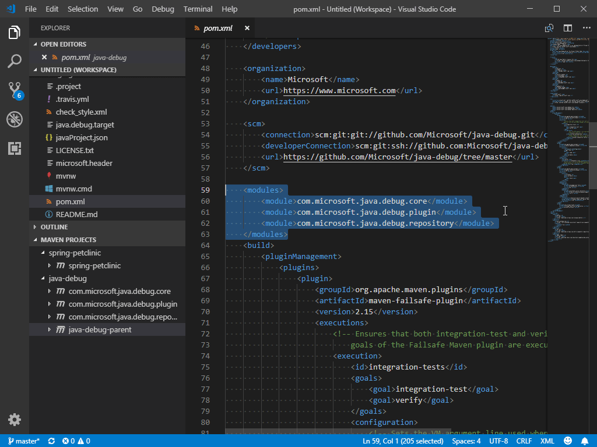
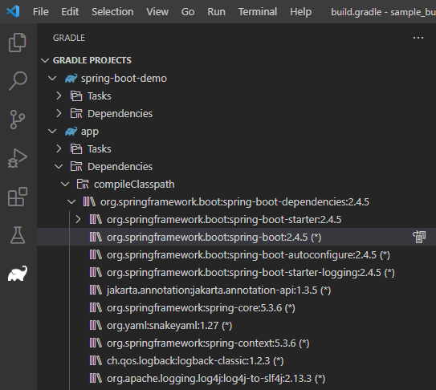

# VS Code에서의 Java 빌드 도구 {#java-build-tools-in-vs-code}

이 문서는 Visual Studio Code에서 Java 빌드 도구를 사용하는 방법에 대한 개요입니다. [Maven for Java](https://marketplace.visualstudio.com/items?itemName=vscjava.vscode-maven) 및 [Gradle for Java](https://marketplace.visualstudio.com/items?itemName=vscjava.vscode-gradle) 확장과 기타 도구를 다룹니다.

아래 기능을 사용할 때 문제가 발생하면, [이슈](https://github.com/microsoft/vscode-java-pack/issues)를 입력하여 저희에게 연락할 수 있습니다.

## Maven {#maven}

[Maven](https://maven.apache.org/)은 Java 프로젝트를 관리하고 애플리케이션 빌드를 자동화하는 데 도움을 주는 소프트웨어 도구입니다. Visual Studio Code용 [Maven for Java](https://marketplace.visualstudio.com/items?itemName=vscjava.vscode-maven) 확장은 완전 통합된 Maven 지원을 제공하여 Maven 프로젝트를 탐색하고, Maven 명령을 실행하며, 빌드 생명 주기 및 플러그인의 목표를 수행할 수 있게 합니다. Maven 지원 및 기타 중요한 Java 개발 기능이 포함된 [Extension Pack for Java](https://marketplace.visualstudio.com/items?itemName=vscjava.vscode-java-pack) 설치를 권장합니다.

<a class="install-extension-btn" href="vscode:extension/vscjava.vscode-java-pack">Java용 Extension Pack 설치</a>

### Maven 프로젝트 탐색 {#exploring-maven-project}

Maven 프로젝트가 로드되면 확장이 활성화되고, 작업 공간에서 `pom.xml` 파일을 자동으로 스캔하여 모든 Maven 프로젝트와 그 모듈을 사이드 바에 표시합니다.

### 알 수 없는 유형 해결 {#resolve-unknown-type}

Maven 확장은 소스 코드에서 알 수 없는 유형을 해결하기 위해 Maven Central을 검색하는 것도 지원합니다. 마우스를 올렸을 때 표시되는 **알 수 없는 유형 해결** 링크를 선택하여 이 작업을 수행할 수 있습니다.

<video src="images/java-build/maven-resolve-unknown-type.mp4" autoplay loop muted playsinline controls title="알 수 없는 유형 해결">
</video>

### POM.xml 작업하기 {#working-with-pomxml}

이 확장은 로컬 Maven 리포지토리를 기반으로 Maven 종속성을 추가하기 위한 코드 조각 및 자동 완성을 제공합니다. 이러한 편리한 기능을 통해 `pom.xml`에 새로운 종속성을 추가하는 것이 얼마나 쉬운지 확인해 보세요.

<video src="images/java-build/maven-pom-editing.mp4" autoplay loop muted playsinline controls title="POM 파일에 새로운 종속성 추가">
</video>

이 확장은 또한 효과적인 POM을 생성할 수 있게 해줍니다.

<video src="images/java-build/maven-effective-pom.mp4" autoplay loop muted playsinline controls title="효과적인 POM 생성">
</video>

**Maven: 종속성 추가**(또는 `maven.project.addDependency`) 명령을 사용하여 `pom.xml`에 새로운 종속성을 추가할 수 있습니다. 이 과정은 대화식입니다.

<video src="images/java-build/maven-add-dependency.mp4" autoplay loop muted playsinline controls title="종속성 추가">
</video>

프로젝트 뷰를 통해서도 종속성을 추가할 수 있으며, 이는 동일한 Maven 명령을 호출합니다.

<video src="images/java-build/maven-add-dependency-2.mp4" autoplay loop muted playsinline controls title="프로젝트 뷰를 통한 종속성 추가">
</video>

또한, VS Code는 종속성을 트리 뷰로 표시하는 것도 지원하여, 프로젝트의 모든 종속성을 한 곳에서 검사하고 잠재적인 문제를 확인할 수 있습니다.

<video src="images/java-build/maven-dependency-tree.mp4" autoplay loop muted playsinline controls title="Maven 종속성 트리 검사">
</video>

### Maven 명령 및 목표 실행 {#execute-maven-commands-and-goals}

탐색기에서 각 Maven 프로젝트를 마우스 오른쪽 버튼으로 클릭하면 Maven 목표를 편리하게 실행할 수 있습니다.

<video src="images/java-build/maven-run.mp4" autoplay loop muted playsinline controls title="Maven 목표 실행">
</video>

이 확장은 각 프로젝트의 목표 이력을 보존하므로, 이전 명령을 빠르게 다시 실행할 수 있습니다. 이는 긴 사용자 정의 목표를 실행할 때 유용합니다.

목표를 다시 실행하는 방법은 두 가지가 있습니다:

1. 명령 팔레트에서 **Maven: 이력**을 실행한 후, 프로젝트와 이력에서 명령을 선택합니다.
2. 프로젝트를 마우스 오른쪽 버튼으로 클릭하고 **이력**을 선택합니다. 그러면 이력에서 이전 명령을 선택할 수 있습니다.

<video src="images/java-build/maven-history.mp4" autoplay loop muted playsinline controls title="Maven 이력에서 목표 실행">
</video>

향후 실행을 위해 설정에서 즐겨찾는 명령을 지정할 수도 있습니다.

<video src="images/java-build/maven-favorite-command.mp4" autoplay loop muted playsinline controls title="즐겨찾는 명령 지정">
</video>

프로젝트와 함께 사용하는 각 플러그인에 대해, 이 확장은 각 플러그인 내의 목표에 쉽게 접근할 수 있는 방법을 제공합니다.

<video src="images/java-build/maven-plugin-goal.mp4" autoplay loop muted playsinline controls title="각 플러그인 내의 목표에 쉽게 접근하는 방법">
</video>

Maven 목표를 디버깅하려면 목표를 마우스 오른쪽 버튼으로 클릭하고 디버깅을 시작합니다. Maven 확장은 올바른 매개변수로 Java 디버거를 호출합니다. 이는 유용하고 시간을 절약할 수 있는 기능입니다.

<video src="images/java-build/debug-maven-plugin-goals.mp4" autoplay loop muted playsinline controls title="Maven 목표 디버깅">
</video>

### Maven 아키타입에서 프로젝트 생성 {#generate-project-from-maven-archetype}

이 확장에서 제공하는 또 다른 유용한 기능은 [아키타입](https://maven.apache.org/guides/introduction/introduction-to-archetypes.html)에서 Maven 프로젝트를 생성하는 것입니다. 이 확장은 로컬/원격 카탈로그에 나열된 아키타입을 로드합니다. 선택 후, 확장은 터미널에 `mvn archetype:generate -D...`를 전송합니다.

Maven 프로젝트를 생성하는 방법은 여러 가지가 있습니다:

1. Maven 탐색기에서 **+** **Maven 프로젝트 생성** 버튼을 선택합니다.

   

2. **명령 팔레트**(`kb(workbench.action.showCommands)`)를 열고 **Java 프로젝트 생성** 명령을 검색합니다.

   <video src="images/java-build/maven-archetype-command.mp4" autoplay loop muted playsinline controls title="Java 프로젝트 생성 명령">
   </video>

3. 대상 폴더를 마우스 오른쪽 버튼으로 클릭하고 **Maven 프로젝트 생성**을 선택합니다.

   <video src="images/java-build/maven-archetype-folder.mp4" autoplay loop muted playsinline controls title="Maven 프로젝트 생성 명령">
   </video>

## Gradle {#gradle}

VS Code는 [Gradle for Java](https://marketplace.visualstudio.com/items?itemName=vscjava.vscode-gradle) 확장을 통해 Gradle Java 프로젝트(안드로이드 제외)를 지원합니다. 이 확장은 Gradle Java 프로젝트 경험을 향상시키기 위한 여러 구성 요소를 제공합니다:
- **Gradle 빌드 서버:** [Gradle 빌드 서버](https://github.com/microsoft/build-server-for-gradle)는 Gradle 프로젝트를 가져오고 빌드 작업을 Gradle 데몬에 위임하여, 명령줄에서 Gradle 작업을 실행하는 것처럼 일관된 프로젝트 출력을 보장합니다.
- **시각적 인터페이스:** Gradle 작업 및 프로젝트 종속성을 보고 관리할 수 있으며, VS Code 내에서 직접 Gradle 작업을 실행할 수 있습니다.
- **Gradle 언어 서버:** Gradle 빌드 파일에 대한 향상된 작성 경험을 제공하며, 구문 강조, 오류 보고 및 자동 완성을 포함합니다.

### Gradle 빌드 서버 {#gradle-build-server}
기본적으로 Gradle for Java 확장을 설치하면 Gradle 빌드 서버가 Gradle 프로젝트를 가져오는 데 사용됩니다. `java.gradle.buildServer.enabled`를 설정하여 Gradle 빌드 서버를 켜거나 끌 수 있습니다.

Gradle 빌드 출력은 Gradle(빌드) 출력 채널에서 확인할 수 있으며, VS Code와 Gradle 빌드 서버 간의 상호 작용을 Gradle(로그) 출력 채널에서 추적할 수 있습니다.

### 테스트를 Gradle에 위임 {#delegate-tests-to-gradle}
이 확장은 테스트 실행을 Gradle에 위임하는 것을 지원합니다. 테스트 탐색기에서 사용하려는 테스트 프로필을 구성할 수 있습니다.

<video src="images/java-build/delegate-test-to-gradle.mp4" autoplay loop muted playsinline controls title="테스트를 Gradle에 위임">
</video>

> 참고: 이 기능을 사용하려면 [Java용 테스트 러너](https://marketplace.visualstudio.com/items?itemName=vscjava.vscode-java-test) 확장을 설치해야 합니다.

### Gradle 작업과 함께 작업하기 {#working-with-gradle-tasks}

VSCode에서 Gradle 프로젝트를 열면 Gradle 사이드 바 항목을 클릭하여 유용한 Gradle 뷰를 찾을 수 있습니다. **Gradle 프로젝트** 뷰는 작업 공간에서 발견된 모든 Gradle 프로젝트를 나열합니다. 여기에서 Gradle 작업을 보고, 실행하거나 디버깅할 수 있습니다.

<video src="images/java-build/gradle-tasks.mp4" autoplay loop muted playsinline controls title="Gradle 작업 뷰">
</video>

작업 공간에 많은 Gradle 작업이 있을 경우 특정 작업을 찾기 어려울 수 있습니다. 이 확장은 즐겨찾는 작업을 고정할 수 있는 **고정 작업** 뷰를 제공하여, 별도의 뷰에서 쉽게 찾을 수 있도록 도와줍니다. 최근에 실행된 작업은 **최근 작업** 뷰에서 확인할 수 있습니다.

<video src="images/java-build/gradle-pinned-recent-tasks.mp4" autoplay loop muted playsinline controls title="Gradle 작업 고정">
</video>

### Gradle 종속성 보기 {#viewing-gradle-dependencies}

**Gradle 프로젝트** 뷰에서 각 Gradle 프로젝트 항목 아래에 **종속성** 항목을 찾을 수 있습니다. 이는 지정된 구성의 모든 종속성을 포함하며, 프로젝트의 종속성 상태를 쉽게 확인할 수 있습니다.

### Gradle 데몬 관리 {#managing-gradle-daemons}

**Gradle 데몬** 뷰는 현재 작업 공간의 데몬 상태를 보여줍니다. 동일한 버전의 모든 실행 중인 Gradle 데몬을 나열합니다. 이 뷰에서 특정 데몬 또는 모든 데몬을 중지할 수 있습니다.

<video src="images/java-build/gradle-daemons.mp4" autoplay loop muted playsinline controls title="Gradle 데몬 관리">
</video>

### 빌드 파일 작성 {#authoring-build-files}

이 확장은 Gradle 빌드 파일에 대한 유용한 작성 기능을 제공합니다.

Groovy Gradle 파일을 열면, 확장은 Gradle 파일을 분석하고 의미론적 토큰 정보를 제공하여 더 정확한 강조 결과를 제공합니다.

**개요** 뷰에서, 확장은 열린 Gradle 파일의 문서 기호를 제공하여 파일의 어느 부분으로든 쉽게 탐색할 수 있도록 도와줍니다.

열린 Gradle 파일에 구문 오류(누락된 문자, 유형을 찾을 수 없음 등)가 있는 경우, **문제** 뷰에서 확인할 수 있습니다.

이 확장은 Gradle 파일에 대한 기본 자동 완성을 지원합니다. Gradle 스크립트에서 Gradle 클로저나 속성을 입력하려고 할 때, 확장은 사용 가능한 클로저나 속성을 제안합니다.

<video src="images/java-build/gradle-auto-completion.mp4" autoplay loop muted playsinline controls title="Gradle 파일에 대한 자동 완성">
</video>

새로운 종속성을 선언하려고 할 때, 확장은 종속성 후보 목록을 제공합니다.

<video src="images/java-build/gradle-dependency-completion.mp4" autoplay loop muted playsinline controls title="Gradle에 대한 새로운 종속성 자동 완성">
</video>

## 추가 리소스 {#additional-resources}

Maven 확장의 [GitHub 리포지토리](https://github.com/microsoft/vscode-maven)를 방문하여 추가 [구성](https://github.com/microsoft/vscode-maven/tree/main#additional-configurations) 및 [문제 해결 가이드](https://github.com/microsoft/vscode-maven/blob/main/Troubleshooting.md)를 확인하세요.

Maven 외에도 프로젝트를 빌드하고 테스트하는 데 Bazel을 사용하는 경우 [Bazel 확장](https://marketplace.visualstudio.com/items?itemName=BazelBuild.vscode-bazel)도 있습니다.

## 다음 단계 {#next-steps}

다음에 대해 더 알아보세요:

* [Java 편집](/docs/java/java-editing.md) - VS Code에서 Java의 편집 기능을 탐색합니다.
* [Java 디버깅](/docs/java/java-debugging.md) - VS Code로 Java 프로젝트를 디버깅하는 방법을 알아봅니다.
* [Java 테스트](/docs/java/java-testing.md) - JUnit 및 TestNG 케이스에 VS Code를 사용합니다.
* [Java 확장](/docs/java/extensions.md) - VS Code에 유용한 Java 확장에 대해 알아봅니다.