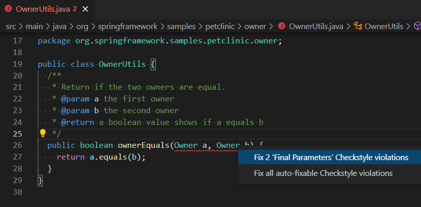

# Java 포맷팅 및 린팅 {#java-formatting-and-linting}

[Red Hat의 Java™에 대한 언어 지원](https://marketplace.visualstudio.com/items?itemName=redhat.java)에서는 [포맷팅 설정](https://github.com/redhat-developer/vscode-java/wiki/Formatter-settings)도 제공합니다. Eclipse 포맷터 파일을 내보낸 다음 VS Code 프로젝트에 사용할 수 있습니다.

또한, [Java용 Checkstyle](https://marketplace.visualstudio.com/items?itemName=shengchen.vscode-checkstyle) 및 [SonarLint](https://marketplace.visualstudio.com/items?itemName=SonarSource.sonarlint-vscode) 확장 프로그램도 있어 실시간 린팅 및 코드 분석 기능을 제공합니다.

## 포맷터 {#formatter}

**문서 포맷** 명령을 사용하여 Java 파일을 포맷할 수 있습니다. 이전에 포맷터 프로필을 지정하지 않았다면, Java 파일은 기본 설정을 사용하여 포맷됩니다.

<video src="images/java-linting/formatting.mp4" autoplay loop muted playsinline controls title="문서 포맷">
</video>

### 포맷터 설정 적용하기 {#applying-formatter-settings}

기존의 Eclipse 스킴에서 포맷터 설정을 쉽게 적용할 수 있습니다. 예를 들어, Java 프로젝트에 [Google 스타일](https://raw.githubusercontent.com/google/styleguide/gh-pages/eclipse-java-google-style.xml)을 적용하려면 `settings.json`에 다음 속성을 설정할 수 있습니다:

```json
"java.format.settings.url": "https://raw.githubusercontent.com/google/styleguide/gh-pages/eclipse-java-google-style.xml",
```

속성은 URL 또는 로컬 파일 경로로 설정할 수 있습니다. 포맷터 XML 파일에 여러 프로필이 포함되어 있는 경우 프로필 이름을 지정할 수 있습니다:

```json
"java.format.settings.profile": "GoogleStyle",
```

포맷터 프로필을 설정한 후, **문서 포맷** 명령은 특정 프로필을 사용하여 Java 파일을 포맷합니다.

### 포맷터 설정 편집하기 {#editing-formatter-settings}

[Java용 확장 팩](https://marketplace.visualstudio.com/items?itemName=vscjava.vscode-java-pack)은 사용자가 기존 포맷터 프로필을 편집할 수 있도록 도와주는 편집기를 제공합니다. **Java: 미리보기와 함께 Java 포맷터 설정 열기** 명령으로 편집기를 열 수 있습니다. 편집기에서 포맷터 설정을 변경하고 효과를 미리 볼 수 있습니다. 현재 편집기를 저장하면 변경 사항이 포맷터 프로필에 저장됩니다.

<video src="images/java-linting/formatting-editing.mp4" autoplay loop muted playsinline controls title="포맷터 설정 편집하기">
</video>

> 주의: 포맷터 설정 편집기는 로컬 포맷터 프로필만 지원합니다. 작업 공간에 원격 포맷터 프로필이 포함되어 있는 경우, `.vscode` 폴더에 다운로드하라는 안내가 표시됩니다.

편집기에서 설정을 편집할 때 오른쪽 **미리보기** 패널에서 변경 사항의 효과를 미리 볼 수 있습니다.

<video src="images/java-linting/formatting-preview.mp4" autoplay loop muted playsinline controls title="포맷 효과 미리보기">
</video>

변경 사항을 실행 취소하고 다시 실행할 수도 있습니다.

<video src="images/java-linting/formatting-undoredo.mp4" autoplay loop muted playsinline controls title="포맷 효과에 대한 변경 사항 실행 취소 및 다시 실행">
</video>

## SonarLint {#sonarlint}

[SonarLint](https://marketplace.visualstudio.com/items?itemName=SonarSource.sonarlint-vscode)는 코딩 중 버그와 보안 문제를 찾고 수정하는 데 도움을 주는 사용하기 쉬운 확장 프로그램입니다. 이 확장 프로그램은 백그라운드에서 실행되며, 맞춤법 검사기처럼 품질 또는 보안 문제를 나타내는 소스 코드 문제를 강조 표시합니다. 이 확장 프로그램은 문제의 내용을 알려줄 뿐만 아니라, 왜 해로운지와 어떻게 수정할 수 있는지에 대한 맥락 내 지침과 예시를 제공합니다. 이 확장 프로그램은 [500개 이상의 Java 규칙](https://rules.sonarsource.com/java)을 지원하며, 특정 품질 문제를 자동으로 수정하는 여러 [빠른 수정](https://rules.sonarsource.com/java/quickfix)을 포함합니다.

### 실시간 코드 분석 {#code-analysis-on-the-fly}

문제는 편집기에서 직접 강조 표시되며, 자세한 설명을 제공하는 호버가 나타납니다.

<video src="images/java-linting/sonarlint.mp4" autoplay loop muted playsinline controls title="실시간 코드 분석">
</video>

열린 파일에서 발견된 문제는 VS Code의 문제 패널을 통해 검토할 수 있습니다. 해당되는 경우, 문제의 출처를 이해할 수 있도록 보조 코드 위치가 언급됩니다(예: 버그로 이어진 코드 경로).

### 규칙 문서화 및 수정 지침 {#rule-documentation-and-remediation-guidance}

감지된 모든 문제에 대해 SonarLint는 위반된 규칙에 대한 전체 문서와 관련된 최상의 코딩 관행을 제공합니다. 이를 통해 문제의 발생 이유와 수정 방법을 이해할 수 있습니다.

<video src="images/java-linting/sonarlint-description.mp4" autoplay loop muted playsinline controls title="규칙 문서화 및 수정 지침">
</video>

### 더 많은 품질 및 보안 규칙 활성화 {#enabling-more-quality-and-security-rules}

기본적으로 SonarLint는 버그와 취약성을 감지하기 위한 다양한 규칙을 제공합니다. 더 많은 검사를 **SonarLint 규칙** 보기에서 활성화할 수 있습니다.

<video src="images/java-linting/sonarlint-rules.mp4" autoplay loop muted playsinline controls title="더 많은 품질 및 보안 규칙 활성화">
</video>

[VS Code용 SonarLint 확장 프로그램](https://marketplace.visualstudio.com/items?itemName=SonarSource.sonarlint-vscode)에 대한 자세한 내용은 [SonarLint 웹사이트](https://www.sonarlint.org/vscode/)를 방문하세요.

## Checkstyle {#checkstyle}

[Java용 Checkstyle](https://marketplace.visualstudio.com/items?itemName=shengchen.vscode-checkstyle) 확장 프로그램을 사용하면 기존의 `checkstyle` 구성(구글 또는 썬 체크) 또는 프로젝트에 대한 사용자 지정 파일을 사용할 수 있습니다. Java 파일을 편집할 때, 이 확장 프로그램은 파일 형식을 검사하고 가능한 경우 실시간으로 빠른 수정을 제공합니다.

**Checkstyle: Checkstyle 구성 파일 설정** 명령을 사용하여 Checkstyle 구성 파일을 설정하고 드롭다운에서 Checkstyle 파일을 선택합니다.

<video src="images/java-linting/checkstyle.mp4" autoplay loop muted playsinline controls title="Checkstyle 구성 파일 설정 명령">
</video>

[Java용 Checkstyle](https://marketplace.visualstudio.com/items?itemName=shengchen.vscode-checkstyle) 확장 프로그램은 실시간 린팅을 지원합니다.

<video src="images/java-linting/checkstyle-live-linting.mp4" autoplay loop muted playsinline controls title="실시간 린팅">
</video>

그리고 배치 검사도 지원합니다.

<video src="images/java-linting/checkstyle-batch.mp4" autoplay loop muted playsinline controls title="배치 검사">
</video>

상태 표시줄의 Checkstyle 상태 아이콘을 클릭하면 문제 패널이 열립니다.

### Checkstyle 구성 파일 설정 {#set-checkstyle-configuration-file}

구성 파일을 설정하려면 `.xml` 파일을 마우스 오른쪽 버튼으로 클릭하고 **Checkstyle 구성 파일 설정**을 선택합니다.


또한 **Checkstyle: Checkstyle 구성 파일 설정** 명령을 트리거하여 파일 탐색기에서 구성 파일을 선택할 수 있습니다. 이 확장 프로그램은 작업 공간에서 `checkstyle.xml` 파일을 찾아 Checkstyle 구성을 쉽게 합니다. 두 가지 내장 구성을 볼 수 있습니다:

* **구글 체크**
* **썬 체크**

**Checkstyle: Checkstyle 구성 설정** 명령은 잠재적인 **Checkstyle** 구성 파일을 감지하고 목록화합니다. 입력 상자에 URL을 직접 작성하여 구성 파일을 제공할 수도 있습니다.

<video src="images/java-linting/checkstyle-configuration.mp4" autoplay loop muted playsinline controls title="Checkstyle 구성 설정">
</video>

**Checkstyle: Checkstyle 버전 설정** 명령을 사용하여 Checkstyle 버전을 설정할 수도 있습니다.

이 명령은:

* 주요 저장소에서 최신 Checkstyle 버전을 나열합니다.
* 다운로드된 모든 버전을 나열합니다.
* 지원되는 모든 버전을 나열합니다.
* 현재 사용 중인 버전을 체크 기호로 표시합니다.

또한, Checkstyle의 경로를 구성하여 3rd-party 모듈을 가져올 수도 있습니다. 예를 들어, 아래 구성을 사용한 후 `checkstyle.xml`에 `<module name="SingleBreakOrContinueCheck"/>` 또는 `<module name="com.github.sevntu.checkstyle.checks.naming.SingleBreakOrContinueCheck"/>`를 추가하여 해당 검사를 사용할 수 있습니다.

```json
"java.checkstyle.modules": [ "$\{workspaceFolder\}
/src/main/resources/sevntu-checks-1.35.0.jar" ]
```

### 스타일 확인 및 위반 사항 수정 {#check-the-style-and-fix-the-violations}

Java 파일을 편집할 때, 이 확장 프로그램은 파일 형식을 검사하고 가능한 경우 빠른 수정을 제공합니다. 편집기에서 제공되는 빠른 수정을 보려면 전구 버튼을 클릭할 수 있습니다.



[Java용 Checkstyle](https://marketplace.visualstudio.com/items?itemName=shengchen.vscode-checkstyle)에 대한 자세한 내용은 [GitHub 리포지토리](https://github.com/jdneo/vscode-checkstyle)를 방문하세요.