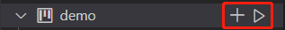
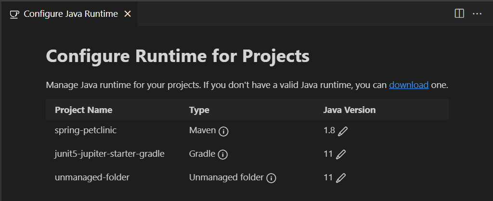
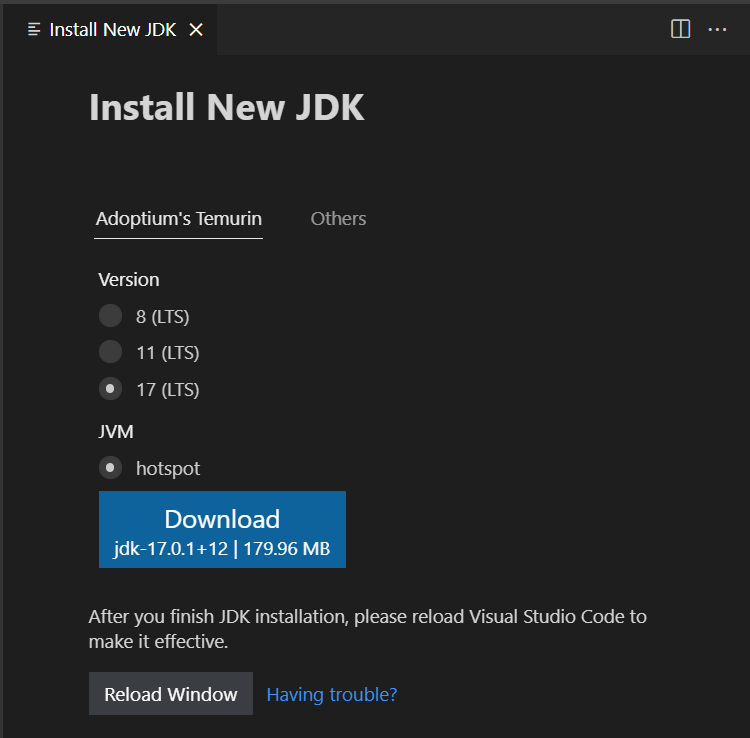
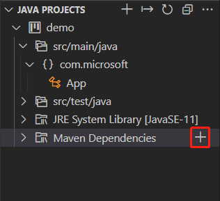
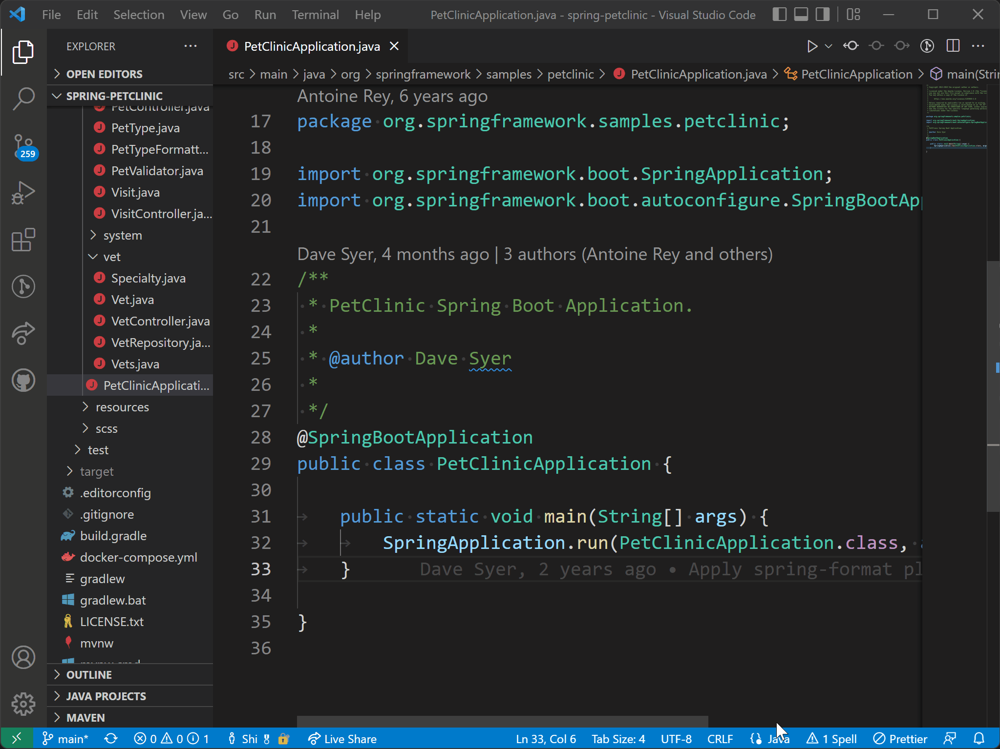

# VS Code에서 Java 프로젝트 관리하기 {#managing-java-projects-in-vs-code}

[Project Manager for Java](https://marketplace.visualstudio.com/items?itemName=vscjava.vscode-java-dependency) 확장은 Java 프로젝트와 그 종속성을 관리하는 데 도움을 줍니다. 또한 새로운 Java 프로젝트, 패키지 및 클래스를 생성하는 데 도움을 줍니다. Visual Studio Code에서 완전한 Java 언어 지원을 받으려면 [Extension Pack for Java](https://marketplace.visualstudio.com/items?itemName=vscjava.vscode-java-pack)를 설치할 수 있으며, 이 패키지에는 Java 확장 관리자가 포함되어 있습니다.

<a class="install-extension-btn" href="vscode:extension/vscjava.vscode-java-pack">Java용 확장 팩 설치하기</a>

> 확장 팩을 시작하는 방법에 대한 자세한 내용은 [Java 시작하기](/docs/java/java-tutorial.md) 튜토리얼을 참조하세요.

## 프로젝트 보기 {#projects-view}

**Java Projects** 뷰는 Java 프로젝트와 그 종속성을 볼 수 있도록 도와주며, 프로젝트 관리 작업을 위한 진입점을 제공합니다.


> 기본적으로 Java Projects 뷰는 **Explorer** 뷰 아래에 표시됩니다. 보이지 않는 경우, **EXPLORER** 제목 표시줄의 `...` 버튼을 클릭하고 **Java Projects**를 선택해 보세요.

탐색기 바의 오버플로우 버튼에는 사용할 수 있는 더 많은 옵션이 있습니다. 예를 들어, 계층적 보기와 평면 보기 간에 전환할 수 있습니다.


탐색기에서 노드 옆에 있는 버튼은 몇 가지 작업에 대한 유용한 단축키를 제공합니다.



각 노드의 컨텍스트 메뉴에도 많은 유용한 기능이 있으며, 탐색기에서 노드를 마우스 오른쪽 버튼으로 클릭하여 토글할 수 있습니다.


### 새로운 Java 프로젝트 만들기 {#create-a-new-java-project}

탐색기 바의 **+** 버튼을 클릭하거나 명령 팔레트에서 **Java: Create Java Project...** 명령을 통해 새로운 Java 프로젝트를 만들 수 있습니다 (`kb(workbench.action.showCommands)`). 생성하는 동안, VS Code는 프로젝트 유형에 따라 필요한 확장을 설치하는 데 도움을 줍니다. (해당 확장이 이미 설치되어 있지 않은 경우)


### Java 프로젝트 가져오기 {#import-java-projects}

기존 Java 프로젝트와 모듈을 **파일** > **폴더 열기...**를 통해 직접 작업 공간으로 가져올 수 있습니다. (열린 폴더에 빌드 도구 스크립트가 포함되어 있는지 확인하세요. 예: `pom.xml` 또는 `build.gradle`). VS Code for Java는 프로젝트를 감지하고 자동으로 가져옵니다.

새 모듈을 프로젝트에 추가할 때, **Java: Import Java projects in workspace** 명령을 트리거하여 작업 공간으로 가져올 수 있습니다. 이 명령은 VS Code 창을 다시 로드할 필요 없이 새로운 프로젝트를 작업 공간으로 가져오는 데 도움을 줍니다.

### JAR로 내보내기 {#export-to-jar}

프로젝트 보기에서 JAR로 빌드를 내보내거나 **Java: Export Jar...** 명령을 실행하여 내보낼 수 있습니다.


## 프로젝트의 런타임 구성 {#configure-runtime-for-projects}

Java가 발전함에 따라, 개발자들이 여러 버전의 JDK로 작업하는 것은 일반적입니다. 이를 설정을 통해 로컬 설치 경로에 매핑할 수 있습니다: `java.configuration.runtimes`. 설정의 형식은 다음과 같습니다:

```json
"java.configuration.runtimes": [
  {
    "name": "JavaSE-1.8",
    "path": "/usr/local/jdk1.8.0_201"
  },
  {
    "name": "JavaSE-11",
    "path": "/usr/local/jdk-11.0.3",
    "sources" : "/usr/local/jdk-11.0.3/lib/src.zip",
    "javadoc" : "https://docs.oracle.com/en/java/javase/11/docs/api",
    "default":  true
   },
   {
    "name": "JavaSE-12",
    "path": "/usr/local/jdk-12.0.2"
   },
   {
    "name": "JavaSE-13",
    "path": "/usr/local/jdk-13"
   }
]
```

> **참고**: 항목에 `"default":  true`를 추가하여 기본값으로 설정할 수 있습니다. 기본 JDK는 관리되지 않는 폴더(빌드 도구가 없는)에서 사용됩니다.

프로젝트에 사용되는 JDK를 보려면 **Command Palette**에서 **Java: Configure Java Runtime** 명령을 트리거할 수 있습니다 (`kb(workbench.action.showCommands)`). 이 명령은 프로젝트의 런타임 정보를 표시하는 뷰를 엽니다:



### Maven 및 Gradle 프로젝트의 JDK 변경 {#change-jdk-for-maven-and-gradle-projects}

Maven 또는 Gradle 프로젝트의 JDK 버전을 변경하려면 빌드 스크립트(`pom.xml` 또는 `build.gradle`)에서 업데이트해야 합니다. <span class="codicon codicon-info"></span>를 클릭하면 이러한 변경을 만드는 방법을 볼 수 있습니다. <span class="codicon codicon-edit"></span>를 클릭하면 프로젝트의 빌드 스크립트 파일로 이동합니다.

### 관리되지 않는 폴더의 JDK 변경 {#change-jdk-for-unmanaged-folders}

관리되지 않는 폴더(빌드 도구가 없는)의 JDK를 변경하려면 <span class="codicon codicon-edit"></span> 버튼을 클릭하면 됩니다. 그러면 모든 JDK가 나열되며, 관리되지 않는 폴더에 사용할 JDK를 선택할 수 있습니다.

### JDK 다운로드 {#download-jdks}

새로운 JDK를 다운로드하려면 `download` 링크를 클릭하거나 **Command Palette**에서 **Java: Install New JDK** 명령을 트리거할 수 있습니다 (`kb(workbench.action.showCommands)`). 그러면 JDK 다운로드를 안내하는 새로운 뷰가 열립니다.



> **참고**: Java 미리보기 기능을 활성화하려면 [새 Java 버전으로 VS Code를 사용하는 방법](/docs/java/java-faq.md#how-can-i-use-visual-studio-code-with-new-java-versions)을 참조하세요.

## 관리되지 않는 폴더의 클래스 경로 구성 {#configure-classpath-for-unmanaged-folders}

Java용 프로젝트 관리 확장은 관리되지 않는 폴더의 클래스 경로를 구성하기 위한 사용자 인터페이스를 제공합니다. 클래스 경로는 클래스 경로 구성 페이지에서 수동으로 설정할 수 있습니다. 이 페이지는 **Java: Configure Classpath** 명령을 실행하여 열 수 있습니다 (`kb(workbench.action.showCommands)`).


드물게, **Java: Clean Java Language Server Workspace** 명령을 실행하여 Java 작업 공간을 정리해야 할 수도 있습니다. 이를 통해 언어 서버가 종속성을 다시 빌드할 수 있습니다.

## 종속성 관리 {#dependency-management}

### Maven 종속성 추가 {#add-a-maven-dependency}

Maven 프로젝트의 경우, 프로젝트 보기에서 **Maven Dependencies** 노드 옆의 **+** 아이콘을 클릭하여 종속성을 추가할 수 있습니다.



### 관리되지 않는 폴더의 종속성 관리 {#manage-dependencies-for-unmanaged-folder}

프로젝트가 빌드 도구가 없는 관리되지 않는 폴더인 경우, **Referenced Libraries** 노드 또는 그 아래 항목에서 **+** 아이콘 또는 **-** 아이콘을 클릭하여 종속성을 관리할 수 있습니다. 또는 JAR 라이브러리를 `Referenced Libraries` 노드로 직접 드래그할 수도 있습니다.


> 클래스 경로 구성 페이지에서도 종속성을 관리할 수 있습니다. 참조: [관리되지 않는 폴더의 클래스 경로 구성](#configure-classpath-for-unmanaged-folders)

백그라운드에서는 `settings.json`에 `java.project.referencedLibraries` 설정이 있습니다. 이 설정을 사용자 정의하는 방법에 대한 세부 정보는 아래에 나와 있습니다.

**라이브러리 포함**

참조할 라이브러리는 일련의 glob 패턴을 사용하여 설명됩니다.

예를 들어:

```json
"java.project.referencedLibraries": [
    "library/**/*.jar",
    "/home/username/lib/foo.jar"
]
```

위 설정은 작업 공간의 라이브러리 폴더에 있는 모든 `.jar` 파일과 지정된 절대 경로의 `foo.jar`를 프로젝트의 외부 종속성에 추가합니다.

참조된 라이브러리는 VS Code에서 감시하며, 이러한 종속 파일 중 하나에 변경 사항이 있을 경우 프로젝트가 새로 고쳐집니다.

기본적으로 VS Code는 glob 패턴 `lib/**/*.jar`를 사용하여 작업 공간의 `lib` 디렉토리에 있는 모든 JAR 파일을 참조합니다.

**일부 라이브러리 제외**

프로젝트에서 일부 라이브러리를 제외하려면 `java.project.referencedLibraries`를 확장하여 `include/exclude` 필드를 사용하고 `exclude` glob 패턴을 추가할 수 있습니다:

```json
"java.project.referencedLibraries": {
    "include": [
        "library/**/*.jar",
        "/home/username/lib/foo.jar"
    ],
    "exclude": [
        "library/sources/**"
    ]
}
```

위 예제에서는 `library/sources` 폴더에 있는 모든 바이너리 JAR 파일이 프로젝트의 외부 종속성으로 무시됩니다.

**소스 JAR 첨부**

기본적으로 참조된 `{binary}.jar`는 동일한 디렉토리에서 `{binary}-sources.jar`를 검색하려고 시도하며, 일치하는 파일이 발견되면 소스로 첨부합니다.

소스 첨부로 JAR 파일을 수동으로 지정하려면 `sources` 필드에 키-값 맵을 제공할 수 있습니다:

```json
"java.project.referencedLibraries": {
    "include": [
        "library/**/*.jar",
        "/home/username/lib/foo.jar"
    ],
    "exclude": [
        "library/sources/**"
    ],
    "sources": {
        "library/bar.jar": "library/sources/bar-src.jar"
    }
}
```

이렇게 하면 `bar.jar`에 `bar-src.jar`가 소스로 첨부됩니다.

## 경량 모드 {#lightweight-mode}

VS Code for Java는 경량 모드와 표준 모드 두 가지 모드를 지원합니다. 경량 모드에서는 언어 서버가 소스 파일과 JDK만 해결하며, 표준 모드에서는 가져온 종속성이 해결되고 프로젝트가 언어 서버에 의해 빌드됩니다. 경량 모드는 소스 파일로 작업할 때 빠르게 시작하고 가벼운 환경이 필요할 때 가장 잘 작동합니다. 예를 들어, 소스 코드를 읽거나, 소스 코드와 JDK 간에 탐색하고, 개요 및 Javadoc을 보고, 구문 오류를 감지하고 수정하는 데 유용합니다. 또한 소스 파일과 JDK의 범위 내에서 코드 완성이 지원됩니다.

경량 모드는 가져온 종속성을 해결하지 않으며 프로젝트를 빌드하지 않으므로 실행, 디버깅, 리팩토링, 린팅 또는 의미적 오류 감지를 지원하지 않습니다. 이러한 기능을 사용하려면 작업 공간을 경량 모드에서 표준 모드로 전환해야 합니다.

어떤 모드로 시작할지를 제어하려면 `java.server.launchMode`를 아래의 옵션으로 구성하면 됩니다:

- `Hybrid` (기본값) - 먼저 경량 모드로 작업 공간이 열립니다. 작업 공간에 해결되지 않은 Java 프로젝트가 포함되어 있으면 표준 모드로 전환할 것인지 묻는 메시지가 표시됩니다. **나중에**를 선택하면 경량 모드로 유지됩니다. 상태 표시줄의 언어 상태 항목을 클릭하여 수동으로 표준 모드로 전환할 수 있습니다.
- `Standard` - 표준 모드로 작업 공간이 열립니다.
- `LightWeight` - 경량 모드로 작업 공간이 열립니다. 상태 표시줄의 언어 상태 항목을 클릭하여 수동으로 표준 모드로 전환할 수 있습니다.

언어 상태 항목은 현재 작업 공간이 어떤 모드에 있는지를 다른 아이콘으로 표시합니다.

<div id="codicon-listing">

- <i class="codicon codicon-bracket-dot"></i> - 경량 모드로 열린 작업 공간.
- <i class="codicon codicon-sync"></i> - 표준 모드로 열리는 중인 작업 공간.
- <i class="codicon codicon-symbol-namespace"></i> - 표준 모드로 열린 작업 공간.

</div>

언어 상태 항목을 클릭하면 표준 모드로 전환됩니다.



## 빌드 상태 {#build-status}

Visual Studio Code에서 Java 소스 코드를 편집할 때, Java 언어 서버는 필요한 언어 기능을 제공하기 위해 작업 공간을 빌드하고 있습니다. 상태 표시줄의 언어 상태 항목을 클릭하면 자세한 빌드 작업 상태를 확인하고 백그라운드에서 무슨 일이 일어나고 있는지 볼 수 있습니다. 언어 서버가 Java 프로젝트를 여는 중이라는 알림이 표시될 때 **세부정보 확인** 링크를 선택하면 빌드 작업 상태를 확인할 수 있습니다.

<video src="images/java-project/java.build.status.mp4" autoplay loop muted playsinline controls title="Java 프로젝트의 빌드 상태">
</video>

### 추가 자료 {#additional-resources}

Java의 다양한 빌드 시스템을 지원하는 여러 Visual Studio Code 확장이 있습니다. 아래는 여러 인기 있는 빌드 시스템을 위한 확장입니다.

- [Maven for Java](https://marketplace.visualstudio.com/items?itemName=vscjava.vscode-maven)
- [Gradle for Java](https://marketplace.visualstudio.com/items?itemName=vscjava.vscode-gradle)
- [Bazel for Java](https://marketplace.visualstudio.com/items?itemName=sfdc.bazel-vscode-java) ([Bazel](https://marketplace.visualstudio.com/items?itemName=BazelBuild.vscode-bazel)는 Java 통합 없이 `BUILD` 파일을 위한 것입니다)

위의 기능을 사용할 때 문제가 발생하면 [문제](https://github.com/microsoft/vscode-java-pack/issues)를 제출하여 저희에게 연락할 수 있습니다.

## 다음 단계 {#next-steps}

다음에 대해 더 알아보세요:

- [Java 편집](/docs/java/java-editing.md) - VS Code에서 Java의 편집 기능을 탐색하세요.
- [Java 디버깅](/docs/java/java-debugging.md) - VS Code로 Java 프로젝트를 디버깅하는 방법을 알아보세요.
- [Java 테스트](/docs/java/java-testing.md) - JUnit 및 TestNG 케이스에 VS Code를 사용하세요.
- [Java 확장](/docs/java/extensions.md) - VS Code에 유용한 Java 확장에 대해 알아보세요.
---