# Azure Spring Apps에서의 Java {#java-on-azure-spring-apps}

> **참고**: Azure Spring Apps는 Azure Spring Cloud 서비스의 새로운 이름입니다.

이 튜토리얼에서는 Visual Studio Code를 사용하여 Java 웹 애플리케이션을 만드는 방법을 보여줍니다. 로컬에서 Java 웹 앱을 실행하고 디버깅하며 편집하는 방법을 배우고, Java 작업 부하를 위해 구축된 완전 관리형 마이크로서비스 플랫폼인 [Azure Spring Apps](https://azure.microsoft.com/services/spring-cloud/)에서 실행하는 방법을 배웁니다.

## 시나리오 {#scenario}

간단한 Spring Boot 시작하기 웹 앱을 Azure Spring Apps에 배포할 것입니다.

Azure Spring Apps는 코드 변경 없이 Spring Boot 마이크로서비스 애플리케이션을 Azure에 쉽게 배포할 수 있게 해줍니다. 이 서비스는 Spring Apps 애플리케이션의 인프라를 관리하여 개발자가 코드에 집중할 수 있도록 합니다. 다른 이점으로는:

* 기존 Spring 앱을 효율적으로 마이그레이션하고 클라우드 확장 및 비용을 관리할 수 있습니다.
* Spring Apps 패턴으로 앱을 현대화하여 민첩성과 배포 속도를 향상시킬 수 있습니다.
* 복잡한 인프라 없이 클라우드 규모에서 Java를 실행하고 더 높은 사용량을 유도할 수 있습니다.
* 컨테이너화 의존성 없이 신속하게 개발 및 배포할 수 있습니다.
* 생산 워크로드를 효율적이고 수월하게 모니터링할 수 있습니다.

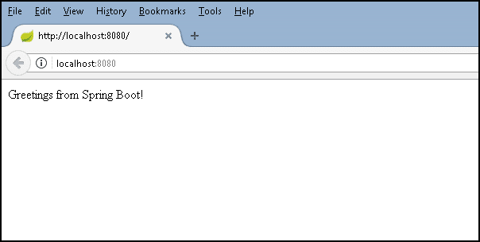

## 시작하기 전에 {#before-you-begin}

이 샘플을 실행하고 배포하기 전에 로컬 개발 환경에 Java SE Development Kit (JDK) 버전 11 이상과 Apache Maven 빌드 도구가 설치되어 있어야 합니다. 아직 설치하지 않았다면 먼저 이 도구들을 설치하세요.

[Java용 확장 팩](https://marketplace.visualstudio.com/items?itemName=vscjava.vscode-java-pack)을 다운로드하여 설치하세요.

>**참고**: 이 튜토리얼을 완료하려면 `JAVA_HOME` 환경 변수가 JDK의 설치 위치로 설정되어 있어야 합니다.

Apache Maven 버전 3 이상을 다운로드하세요:

<a className="install-extension-btn" href="https://maven.apache.org/download.cgi" target="_blank" style={{ backgroundColor: "#68217A" }}>Apache Maven 다운로드</a>

로컬 개발 환경에 Apache Maven을 설치하세요:

<a className="install-extension-btn" href="https://maven.apache.org/install" target="_blank" style={{ backgroundColor: "#68217A"}}>Apache Maven 설치</a>

## Spring Boot 앱 다운로드 및 테스트 {#download-and-test-the-spring-boot-app}

[Spring Boot 시작하기](https://github.com/spring-guides/gs-spring-boot) 샘플 프로젝트를 로컬 머신에 클론하세요. **명령 팔레트**(`kb(workbench.action.showCommands)`)에서 **Git: Clone** 명령을 사용하여 Git 리포지토리를 클론할 수 있습니다. 원격 리포지토리의 URL로 `https://github.com/spring-guides/gs-spring-boot.git`를 붙여넣고 로컬 리포지토리를 둘 부모 디렉토리를 결정하세요. 그 후, 클론한 리포지토리 내의 `complete` 폴더를 VS Code에서 열려면 해당 폴더로 이동하여 `code .`을 입력하세요.

>**참고**: Visual Studio Code는 [https://code.visualstudio.com](https://code.visualstudio.com/)에서, Git은 [https://git-scm.com](https://git-scm.com/)에서 설치할 수 있습니다.


VS Code 내에서 `complete` 폴더 내의 Java 파일 중 하나를 열어보세요 (예: `src\main\java\hello\Application.java`). VS Code에 Java 언어 확장이 설치되어 있지 않다면 Microsoft의 [Java용 확장 팩](https://marketplace.visualstudio.com/items?itemName=vscjava.vscode-java-pack)을 설치하라는 메시지가 표시됩니다. 지침을 따르고 설치 후 VS Code를 다시 로드하세요.


Java용 확장 팩을 설치하면 프로젝트가 자동으로 빌드됩니다 (빌드에는 몇 분이 걸릴 수 있습니다). VS Code 내에서 `kb(workbench.action.debug.start)`를 눌러 애플리케이션을 실행하고 **Java** 환경을 선택하세요. Java Debug 확장은 프로젝트의 `.vscode` 폴더 아래에 디버깅 구성 파일 `launch.json`을 생성합니다. VS Code 상태 표시줄에서 빌드 진행 상황을 확인할 수 있으며, 모든 작업이 완료되면 최종 활성 디버그 구성이 표시됩니다.

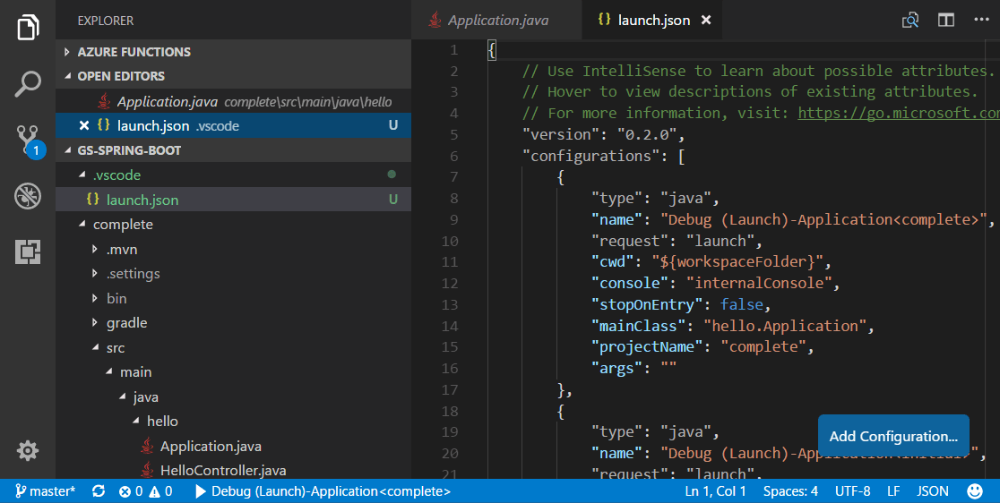

VS Code가 애플리케이션을 시작하는 방법에 대한 자세한 내용은 디버깅 [Launch Configurations](/docs/editor/debugging-configuration.md#launch-configurations)를 참조하세요. 다시 `kb(workbench.action.debug.start)`를 눌러 디버거를 시작하세요.


웹 브라우저를 사용하여 [http://localhost:8080](http://localhost:8080)으로 이동하여 웹 앱을 테스트하세요. "Spring Boot에서 인사드립니다!"라는 메시지가 표시되어야 합니다.


## 변경하기 {#make-a-change}

이제 `HelloController.java`를 편집하여 "Spring Boot에서 인사드립니다!"를 "Hello World"와 같은 다른 내용으로 변경해 보겠습니다. VS Code는 Java에 대한 훌륭한 편집 경험을 제공하므로 [코드 편집 및 탐색](/docs/languages/java.md#editing)을 확인하여 VS Code의 편집 및 코드 탐색 기능에 대해 알아보세요.

편집기 상단의 **재시작** 버튼을 선택하여 앱을 다시 시작하고 브라우저를 새로 고침하여 결과를 확인하세요.

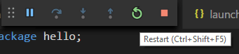

## 애플리케이션 디버깅 {#debug-the-application}

애플리케이션 소스 코드에 중단점(`kb(editor.debug.action.toggleBreakpoint)`)을 설정하고 브라우저를 새로 고침하여 중단점에 도달하세요.

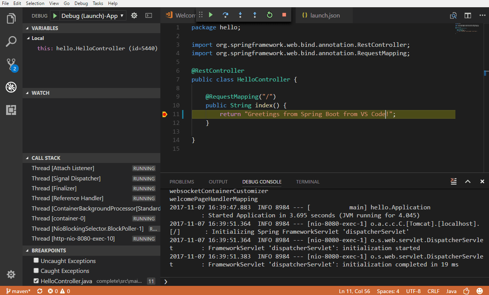

VS Code로 Java 디버깅에 대해 더 알고 싶다면 [Java 디버깅](/docs/java/java-debugging.md)을 읽어보세요.

축하합니다! 이제 로컬에서 첫 번째 Spring Boot 웹 앱이 실행되고 있습니다! 클라우드에서 호스팅하는 방법을 알아보세요.

## Azure Spring Apps에 배포하기 {#deploy-to-azure-spring-apps}

우리는 방금 Java 웹 애플리케이션을 빌드하고 로컬에서 실행했습니다. 이제 Visual Studio Code에서 배포하고 [Azure Spring Apps](https://azure.microsoft.com/services/spring-cloud/)에서 실행하는 방법을 배울 것입니다.

### Azure Spring Apps 확장 설치 {#install-the-azure-spring-apps-extension}

[Azure Spring Apps](https://marketplace.visualstudio.com/items?itemName=vscjava.vscode-azurespringcloud) 확장은 Azure Spring Apps에 생성, 관리 및 배포하는 데 사용되며 주요 기능은 다음과 같습니다:

* Azure Spring Apps에서 앱 생성/보기/삭제
* 앱에 Jar 배포
* 공용/비공식 엔드포인트로 앱에 접근
* 앱 시작, 중지 및 재시작
* 앱 확장 및 축소
* 환경 변수 및 JVM 옵션과 같은 애플리케이션 설정 구성
* 앱에서 로그 스트리밍

Azure Spring Apps 확장을 설치하려면 확장 보기(`kb(workbench.view.extensions)`)를 열고 `azure spring apps`를 검색하여 결과를 필터링하세요. Microsoft의 [Azure Spring Apps](https://marketplace.visualstudio.com/items?itemName=vscjava.vscode-azurespringcloud) 확장을 선택하세요. 명령줄 경험을 원하시면 [Azure CLI를 사용한 Azure Spring Apps 빠른 시작](https://learn.microsoft.com/azure/spring-apps/quickstart)을 확인할 수도 있습니다.

### Azure 구독에 로그인 {#sign-in-to-your-azure-subscription}

배포 과정에서는 [Azure Account](https://marketplace.visualstudio.com/items?itemName=ms-vscode.azure-account) 확장(스프링 클라우드 확장과 함께 의존성으로 설치됨)을 사용하며, Azure 구독으로 로그인해야 합니다.

Azure 구독이 없는 경우 [무료 Azure 계정](https://azure.microsoft.com/pricing/free-trial/)에 가입할 수 있습니다.

<a className="install-extension-btn" href="https://azure.microsoft.com/pricing/free-trial/" target="_blank" style={{ backgroundColor : "#68217A"}}>무료 Azure 계정 만들기</a>

Azure에 로그인하려면 **명령 팔레트**(`kb(workbench.action.showCommands)`)에서 **Azure: 로그인**을 실행하세요. 또는 **SPRING APPS** 탐색기에서 **Azure에 로그인...**를 클릭하여 Azure 계정에 로그인할 수 있습니다.

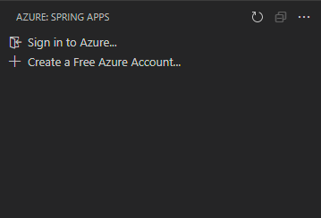

### Azure Spring Apps에서 앱 만들기 {#create-an-app-on-azure-spring-apps}

Azure 계정에 로그인하고 Visual Studio Code에서 앱을 열면 활동 표시줄에서 Azure 아이콘을 선택하여 Azure 탐색기를 열고 Azure Spring Apps 패널을 확인하세요.

1. 구독을 마우스 오른쪽 버튼으로 클릭하고 **포털에서 서비스 생성**을 선택하세요. Azure 포털에서 Azure Spring Apps 서비스 인스턴스를 생성하기 위한 다음 단계를 완료하세요.

    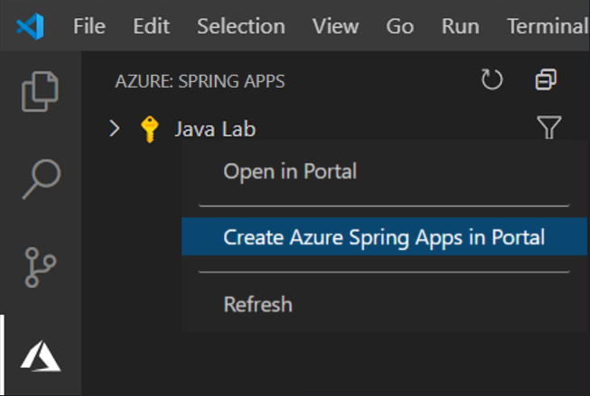

1. 서비스 인스턴스가 생성된 후 Azure 탐색기를 새로 고쳐 새 서비스 인스턴스를 표시합니다. 서비스 인스턴스를 마우스 오른쪽 버튼으로 클릭하고 **앱 생성**을 선택하세요. 앱 이름을 입력하고 Java 버전을 선택한 후 `kbstyle(Enter)`를 눌러 생성을 시작하세요. 앱은 몇 분 내에 준비됩니다.

    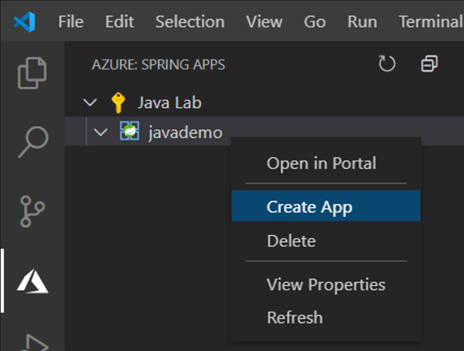

### 앱 빌드 및 배포 {#build-and-deploy-the-app}

명령 프롬프트 또는 터미널 창을 열고 Maven 명령을 사용하여 프로젝트를 빌드할 수 있습니다. 빌드는 `target` 디렉토리에 새로운 `war` 또는 `jar` 아티팩트를 생성합니다.

```bash
mvn clean package
```

1. Azure 탐색기에서 앱을 마우스 오른쪽 버튼으로 클릭하고 **배포**를 선택한 후 프롬프트가 표시되면 빌드된 Jar 파일을 선택하세요.

    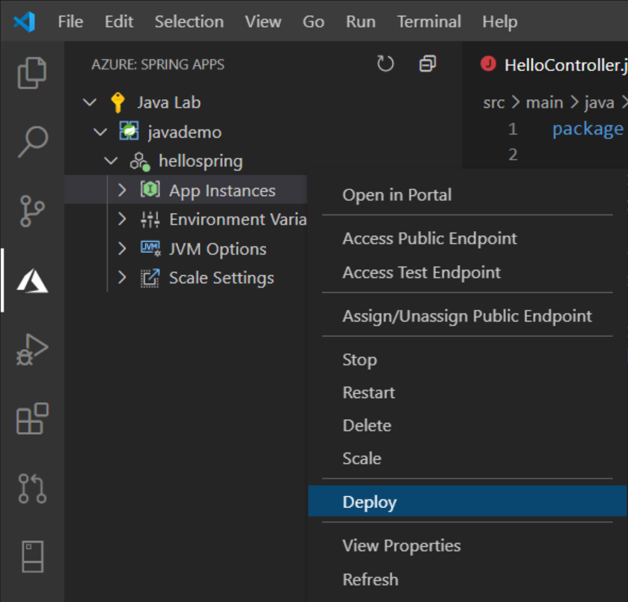

2. 오른쪽 하단에서 배포 상태를 확인할 수 있습니다. 완료되면 **공용 엔드포인트 접근**을 선택하여 Azure에서 실행 중인 앱을 테스트하고, 프롬프트가 표시되면 **예**를 선택하여 공용 엔드포인트를 할당하세요. Spring Boot fat Jar만 지원되므로, [Azure Spring Apps에서 앱에 대해 더 알아보세요](https://learn.microsoft.com/azure/spring-apps/how-to-prepare-app-deployment?pivots=programming-language-java&tabs=basic-standard-tier).

    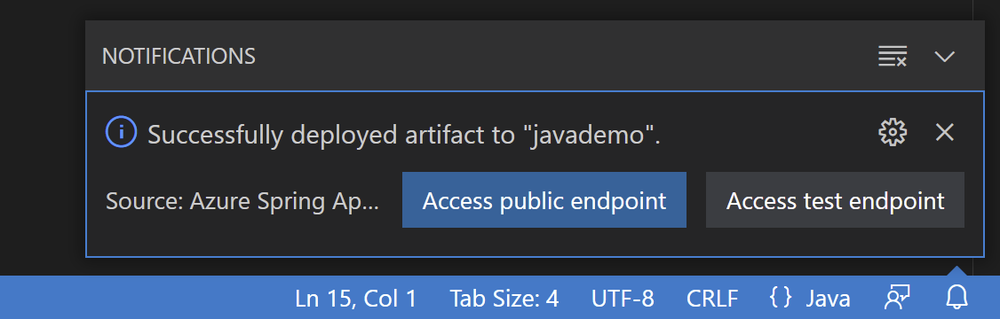

### 앱 확장 {#scale-the-app}

1. **Scale Settings** 아래의 **Instance count**를 마우스 오른쪽 버튼으로 클릭하고 **Edit**를 선택하여 앱을 쉽게 확장할 수 있습니다. "2"를 입력하고 `kbstyle(Enter)`를 눌러 앱을 확장하세요.

    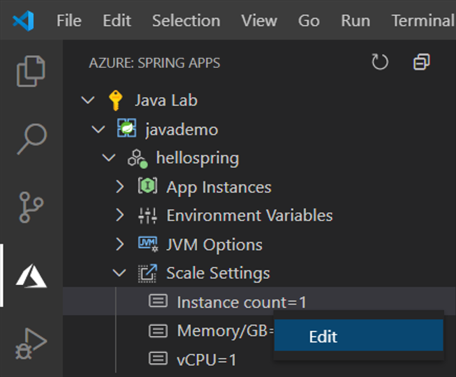

### 애플리케이션 로그 스트리밍 {#stream-your-application-logs}

1. **App Instances** 노드를 확장하고 로그를 보고 싶은 인스턴스를 마우스 오른쪽 버튼으로 클릭한 후 **Start Streaming Logs**를 선택하세요.

    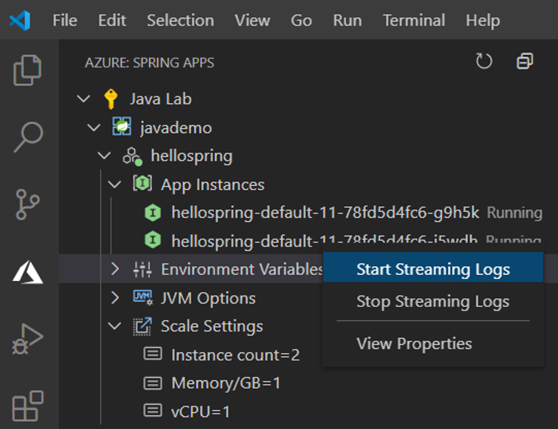

1. Visual Studio Code 출력 창이 열리며 로그 스트림에 연결됩니다.

    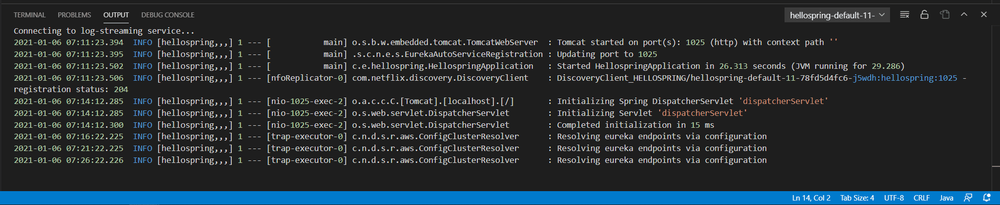

## 다음 단계 {#next-steps}

* [마이크로서비스와 함께하는 Azure Spring Apps의 더 강력한 기능](https://learn.microsoft.com/azure/spring-apps/quickstart-sample-app-introduction?pivots=programming-language-java&tabs=basic-standard-tier)을 탐색하세요.
* Java 디버깅 기능에 대해 더 알고 싶다면 [Java 디버깅 튜토리얼](/docs/java/java-debugging.md)을 읽어보세요.