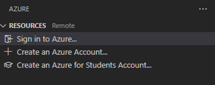

# Visual Studio Code로 Java 웹 앱 만들기 {#java-web-apps-with-visual-studio-code}

이 튜토리얼에서는 Visual Studio Code를 사용하여 Java 웹 애플리케이션을 만드는 방법을 보여줍니다. Azure App Service의 Linux Tomcat 서버에 Java 웹 애플리케이션을 배포하는 방법도 배울 수 있습니다.

## 시나리오 {#scenario}

간단한 Hello World 웹 앱입니다.


## 시작하기 전에 {#before-you-begin}

이 샘플을 실행하고 배포하기 전에 로컬 개발 환경에 Java SE Development Kit (JDK)와 Apache Maven 빌드 도구가 설치되어 있어야 합니다. 설치되어 있지 않다면, 설치해 주세요.

JDK 11이 포함된 [Java용 확장 팩](https://marketplace.visualstudio.com/items?itemName=vscjava.vscode-java-pack)을 다운로드하여 설치하세요.

>**참고**: 이 튜토리얼을 완료하려면 `JAVA_HOME` 환경 변수가 JDK의 설치 위치로 설정되어 있어야 합니다.

Apache Maven 버전 3 이상을 다운로드하세요:

<a className="install-extension-btn" href="https://maven.apache.org/download.cgi" target="_blank" style={{ backgroundColor: "#68217A" }}>
  Apache Maven 다운로드
</a>

로컬 개발 환경에 Apache Maven을 설치하세요:

<a className="install-extension-btn" href="https://maven.apache.org/install" target="_blank" style={{ backgroundColor: "#68217A" }}>
  Apache Maven 설치
</a>

## Maven 웹 앱 프로젝트 만들기 {#create-a-maven-web-app-project}

`maven-archetype-webapp`는 Maven 웹 앱 프로젝트를 생성하는 아키타입입니다. 더 알아보려면 [이 문서](https://maven.apache.org/archetypes/maven-archetype-webapp/)를 방문하세요.

1. 빈 폴더에서 다음 명령을 실행하여 Maven 아키타입에서 새 프로젝트를 생성합니다.

```cmd
   mvn archetype:generate -DarchetypeGroupId=org.apache.maven.archetypes -DarchetypeArtifactId=maven-archetype-webapp -DarchetypeVersion=1.4
```
2. Maven은 배포를 완료하는 데 필요한 값을 요청합니다. 다음 값을 입력하세요:

    | 프롬프트 | 값 | 설명 |
    | ------ | ----- | ----------- |
    | **groupId** | `com.webappproject` | 모든 프로젝트에서 고유하게 프로젝트를 식별하는 값으로, [패키지 명명 규칙](https://docs.oracle.com/javase/specs/jls/se6/html/packages.html#7.7)을 따릅니다. |
    | **artifactId** | `webapp-project` | 버전 번호가 없는 jar의 이름입니다. |
    | **version** | `1.0-SNAPSHOT` | 기본값을 선택합니다. |
    | **package** | `com.webappproject` | 생성된 함수 코드의 Java 패키지 값입니다. 기본값을 사용하세요. |

3. `Y`를 입력하거나 Enter 키를 눌러 확인합니다.

    Maven은 _artifactId_라는 이름의 새 폴더에 프로젝트 파일을 생성합니다. 이 예제에서는 `webapp-project`입니다.

4. 프로젝트 폴더로 이동합니다:

    ```console
    cd webapp-project
    ```

## 클라우드에 웹 앱 배포하기 {#deploy-web-apps-to-the-cloud}

우리는 방금 Java 웹 애플리케이션을 만들고 로컬에서 실행했습니다. 이제 Visual Studio Code에서 Azure의 클라우드에 배포하고 실행하는 방법을 배울 것입니다.

Azure 구독이 없다면, [무료 Azure 계정](https://azure.microsoft.com/pricing/free-trial/)에 가입할 수 있습니다.

<a className="install-extension-btn" href="https://azure.microsoft.com/pricing/free-trial/" target="_blank" style={{ backgroundColor: "#68217A"}}>무료 Azure 계정 만들기</a>

### Azure App Service 확장 설치하기 {#install-the-azure-app-service-extension}

[Azure App Service](https://marketplace.visualstudio.com/items?itemName=ms-azuretools.vscode-azureappservice) 확장은 Azure App Service를 생성, 관리 및 배포하는 데 사용되며, 주요 기능은 다음과 같습니다:

- 새로운 Azure 웹 앱/배포 슬롯 생성
- Azure 웹 앱/배포 슬롯에 배포
- Azure 웹 앱/배포 슬롯 시작, 중지 및 재시작
- 웹 앱의 로그 파일 보기
- 배포 슬롯 교환

Azure App Service 확장을 설치하려면, 확장 보기(`kb(workbench.view.extensions)`)를 열고 `azure app service`를 검색하여 결과를 필터링합니다. Microsoft의 [Azure App Service](https://marketplace.visualstudio.com/items?itemName=ms-azuretools.vscode-azureappservice) 확장을 선택하세요. 더 명령줄 Maven 중심의 경험을 원하신다면, [Azure App Service Linux 튜토리얼의 Maven 플러그인](https://learn.microsoft.com/azure/app-service/quickstart-java?pivots=platform-linux-development-environment-maven)도 확인해 보세요.

### Azure 구독에 로그인하기 {#sign-in-to-your-azure-subscription}

Azure에 로그인하려면 **Command Palette**(`kb(workbench.action.showCommands)`)에서 **Azure: Sign In**을 실행합니다. 또는 **RESOURCES** 탐색기에서 **Azure에 로그인...**를 클릭하여 Azure 계정에 로그인할 수 있습니다.



### Azure에서 새 웹 앱 만들기 {#create-a-new-web-app-on-azure}

확장이 설치되면 Azure에서 새 웹 앱을 만들기 위해 다음 단계를 수행할 수 있습니다.

1. **RESOURCES** 탐색기 뷰에서 **Create** 버튼을 클릭하고 **Create App Service Web App...**을 선택합니다.

2. 새 웹 앱에 대한 고유한 이름을 입력합니다.

3. 웹 앱의 런타임 작업을 선택합니다. 예를 들어 `Java 17`을 선택합니다.

4. Java 웹 서버 스택을 선택합니다. 예를 들어 `Apache Tomcat 10.0`을 선택합니다.

5. 가격 책정 계층을 선택합니다. 예를 들어 `Free(F1)`을 선택합니다.


### 웹 앱에 빌드 및 배포하기 {#build-and-deploy-to-a-web-app}

배포 프로세스는 [Azure Resources](https://marketplace.visualstudio.com/items?itemName=ms-azuretools.vscode-azureresourcegroups) 확장을 활용하며 (Azure App Service 확장과 함께 의존성으로 설치됨), Azure 구독으로 로그인해야 합니다. Azure 구독이 없다면, [오늘 가입하세요](https://azure.microsoft.com//free/?b=16.48) 무료 30일 계정으로 Azure 서비스 조합을 시도해 볼 수 있는 $200의 Azure 크레딧을 받으세요.

로그인한 후, 명령 프롬프트 또는 터미널 창을 열고 Maven 명령을 사용하여 프로젝트를 빌드합니다. 이렇게 하면 `target` 디렉토리에 새로운 `war` 또는 `jar` 아티팩트가 생성됩니다.

```bash
mvn clean package
```

프로젝트를 빌드한 후, VS Code 탐색기에서 `target` 디렉토리를 엽니다. 아티팩트를 마우스 오른쪽 버튼으로 클릭하고 **Deploy to Web App**을 선택한 다음, 배포할 웹 앱을 선택하기 위한 프롬프트를 따릅니다.


VS Code에서 **Output** 창을 열어 배포 로그를 확인합니다. 배포가 완료되면 웹 앱의 URL이 출력됩니다. 링크를 클릭하여 브라우저에서 열면 Azure에서 웹 앱이 실행되는 것을 볼 수 있습니다!


> **참고:** App Service의 더 고급 기능에 대해서는 [Azure App Service](https://marketplace.visualstudio.com/items?itemName=ms-azuretools.vscode-azureappservice) 확장을 확인하세요.

## 리소스 정리하기 {#clean-up-resources}

1. 웹 앱을 삭제하려면 **RESOURCES** 탐색기로 이동하여 **App Services** 항목을 찾습니다.

2. 삭제하려는 웹 앱을 마우스 오른쪽 버튼으로 클릭하고 **Delete**를 클릭합니다.


3. 앱 서비스 계획이나 리소스 그룹을 삭제하려면 [Azure 포털](https://portal.azure.com)을 방문하여 구독 아래의 리소스를 수동으로 삭제합니다.

## 다음 단계 {#next-steps}

- 웹 애플리케이션을 컨테이너화하고 배포하려면 [VS Code의 Docker](/docs/containers/overview.md)를 확인하세요.
- Java 디버깅 기능에 대해 더 알아보려면 [Java 디버깅 튜토리얼](/docs/java/java-debugging.md)을 참조하세요.