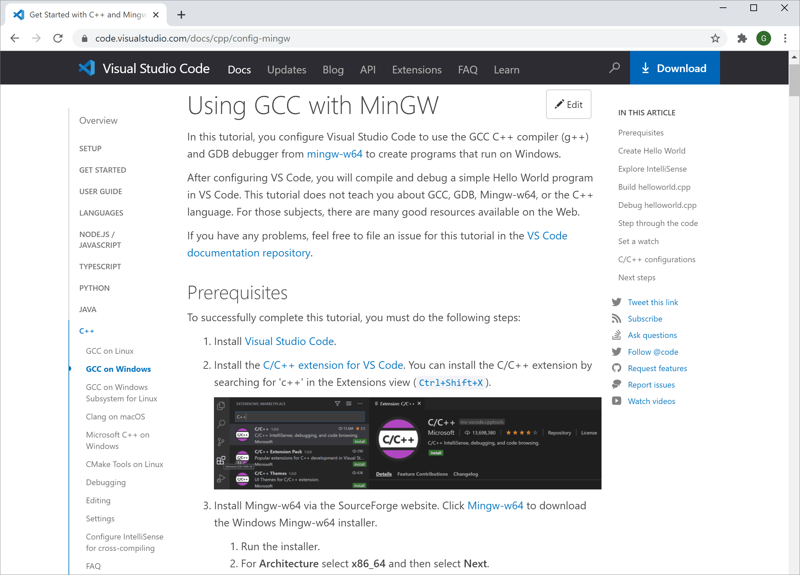

# C/C++ for Visual Studio Code {#cc-for-visual-studio-code}

Visual Studio Code에 대한 C/C++ 지원은 [Microsoft C/C++ 확장](https://marketplace.visualstudio.com/items?itemName=ms-vscode.cpptools)을 통해 제공되어 Windows, Linux 및 macOS에서 크로스 플랫폼 C 및 C++ 개발을 가능하게 합니다. `*.cpp` 파일을 생성하면, 이 확장은 구문 강조(색상화), 스마트 완성 및 호버(IntelliSense), 오류 검사와 같은 기능을 추가합니다.


## 확장 설치하기 {#install-the-extension}

1. VS Code를 엽니다.
1. 활동 표시줄에서 확장 보기 아이콘을 선택하거나 키보드 단축키(`kb(workbench.view.extensions)`)를 사용합니다.
1. `'C++'`를 검색합니다.
1. **설치**를 선택합니다.


## C++ 환경 설정하기 {#set-up-your-c-environment}

C++는 컴파일된 언어로, 프로그램의 소스 코드는 컴퓨터에서 실행되기 전에 번역(컴파일)되어야 합니다. C/C++ 확장에는 C++ 컴파일러나 디버거가 포함되어 있지 않으며, VS Code는 개발 워크플로우를 위해 명령줄 도구에 의존합니다. 이러한 도구를 설치하거나 이미 컴퓨터에 설치된 도구를 사용해야 합니다.

### 컴파일러가 설치되어 있는지 확인하기 {#check-if-you-have-a-compiler-installed}

> **참고**: 학술 또는 작업 개발 환경에서 이미 C++ 컴파일러와 디버거가 제공될 수 있습니다. 추천 C++ 도구 세트(컴파일러, 디버거, 프로젝트 시스템, 린터) 설치에 대한 안내는 강사나 동료에게 확인하세요.

일부 플랫폼에 미리 설치된 일반적인 컴파일러는 Linux의 [GNU Compiler Collection](https://wikipedia.org/wiki/GNU_Compiler_Collection) (GCC)와 macOS의 [Xcode](https://developer.apple.com/xcode/)와 함께 제공되는 [Clang](https://wikipedia.org/wiki/Clang) 도구입니다.

이미 설치되어 있는지 확인하려면:

1. (`kb(workbench.action.terminal.new)`)를 사용하여 새로운 VS Code 터미널 창을 엽니다.
2. 다음 명령어를 사용하여 GCC 컴파일러 `g++`를 확인합니다:

    ```bash
    g++ --version
    ```

    또는 Clang 컴파일러 `clang`에 대한 이 명령어를 사용합니다:

    ```bash
    clang --version
    ```

출력에는 컴파일러 버전 및 세부 정보가 표시되어야 합니다. 둘 다 발견되지 않는 경우, C/C++ 확장이 이를 찾을 수 있도록 컴파일러 실행 파일이 플랫폼 경로(`%PATH`는 Windows, `$PATH`는 Linux 및 macOS)에 있는지 확인하세요. 그렇지 않으면 아래 섹션의 지침을 사용하여 컴파일러를 설치하세요.

### 컴파일러 설치하기 {#install-a-compiler}

컴파일러가 설치되어 있지 않은 경우, 다음 설치 튜토리얼 중 하나를 따를 수 있습니다:

**Windows**:

<a class="next-topic-btn" href="/docs/cpp/config-msvc#_prerequisites">MSVC 튜토리얼로 이동</a>

<a class="next-topic-btn" href="/docs/cpp/config-mingw#_prerequisites">MinGW 튜토리얼로 이동</a>

**Linux**:

<a class="next-topic-btn" href="/docs/cpp/config-linux#_prerequisites">GCC 튜토리얼로 이동</a>

**macOS**:

<a class="next-topic-btn" href="/docs/cpp/config-clang-mac#_prerequisites">Clang 튜토리얼로 이동</a>

> **참고**: 내장된 컴파일, 디버깅 및 프로젝트 템플릿(파일 > 새 프로젝트)이 포함된 완전한 통합 개발 환경(IDE)을 선호하는 경우, [Visual Studio Community](https://visualstudio.microsoft.com/vs/community) 에디션과 같은 많은 옵션이 있습니다.

## 예제: Windows에 MinGW-x64 설치하기 {#example-install-mingw-x64-on-windows}

과정을 이해하기 위해 [MSYS2](https://www.msys2.org/)를 통해 Mingw-w64를 설치해 보겠습니다. Mingw-w64는 Windows에서 인기 있는 무료 도구 세트입니다. 최신 GCC, Mingw-w64 및 기타 유용한 C++ 도구와 라이브러리의 네이티브 빌드를 제공합니다.

1. [**이 MinGW 설치 프로그램의 직접 링크**](https://github.com/msys2/msys2-installer/releases/download/2024-12-08/msys2-x86_64-20241208.exe)를 사용하여 다운로드합니다.

1. 설치 프로그램을 실행하고 설치 마법사의 단계를 따릅니다. MSYS2는 64비트 Windows 8.1 이상이 필요합니다.

1. 마법사에서 원하는 설치 폴더를 선택합니다. 나중에 사용할 수 있도록 이 디렉토리를 기록해 두세요. 대부분의 경우 추천 디렉토리가 적합합니다. 시작 메뉴 바로 가기 설정 단계에서도 동일하게 적용됩니다. 완료되면 **지금 MSYS2 실행** 상자가 체크되어 있는지 확인하고 **마침**을 선택합니다. 그러면 MSYS2 터미널 창이 자동으로 열립니다.

1. 이 터미널에서 다음 명령어를 실행하여 MinGW-w64 도구 체인을 설치합니다:

    ```sh
    pacman -S --needed base-devel mingw-w64-ucrt-x86_64-toolchain
    ```

1. 사용 가능한 패키지 목록이 표시됩니다.

    

1. `toolchain` 그룹의 기본 패키지 수를 수락하려면 `kbstyle(Enter)`를 누릅니다.

1. 설치를 진행할 것인지 묻는 메시지가 표시되면 `Y`를 입력합니다.

1. Windows `PATH` 환경 변수에 MinGW-w64 `bin` 폴더의 경로를 추가하려면 다음 단계를 따릅니다:
   1. Windows 검색 창에 **설정**을 입력하여 Windows 설정을 엽니다.
   1. **계정에 대한 환경 변수 편집**을 검색합니다.
   1. **사용자 변수**에서 `Path` 변수를 선택한 후 **편집**을 선택합니다.
   1. **새로 만들기**를 선택하고 설치 과정에서 기록한 MinGW-w64 목적지 폴더를 목록에 추가합니다. 기본 설치 단계를 선택한 경우 경로는: `C:\msys64\ucrt64\bin`입니다.
   1. **확인**을 선택한 후 **환경 변수** 창에서 다시 **확인**을 선택하여 `PATH` 환경 변수를 업데이트합니다.
      업데이트된 `PATH` 환경 변수를 사용하려면 모든 콘솔 창을 다시 열어야 합니다.
1. MinGW-w64 도구가 올바르게 설치되어 사용 가능한지 확인하려면 **새로운** 명령 프롬프트를 열고 다음을 입력합니다:

```bash
gcc --version
g++ --version
gdb --version
```

설치된 GCC, g++ 및 GDB의 버전이 표시되어야 합니다. 그렇지 않은 경우, PATH 항목이 컴파일러 도구가 위치한 Mingw-w64 바이너리 경로와 일치하는지 확인하거나 [문제 해결 섹션](/docs/cpp/config-mingw.md#_check-your-mingw-installation)을 참조하세요.

## Hello World 앱 만들기 {#create-a-hello-world-app}

컴파일러가 올바르게 설치되고 구성되었는지 확인하기 위해 Hello World C++ 프로그램을 만들어 보겠습니다.

### C++ 파일 만들기 {#create-a-c-file}

1. Windows에서는 Windows 명령 프롬프트를 실행합니다(Windows 검색 창에 **Windows 명령 프롬프트** 입력). macOS 및 Linux에서는 터미널에서 이 명령을 입력할 수 있습니다.
1. 다음 명령을 실행합니다. 이 명령은 모든 VS Code 프로젝트를 배치할 수 있는 빈 폴더 `projects`를 생성합니다. 다음 명령은 `helloworld`라는 하위 폴더를 생성하고 해당 폴더로 이동합니다. 그 후 `code` 명령을 사용하여 VS Code에서 `helloworld`를 직접 엽니다.

```bat
mkdir projects
cd projects
mkdir helloworld
cd helloworld
code .
```

"code ." 명령은 현재 작업 폴더에서 VS Code를 열며, 이 폴더가 "작업 공간"이 됩니다. 이 폴더는 사용자가 생성한 폴더이므로 [작업 공간 신뢰](/docs/editor/workspaces/workspace-trust.md) 대화 상자를 열고 **예, 저자를 신뢰합니다**를 선택합니다.

이제 파일 탐색기에서 **새 파일** 버튼을 사용하거나 **파일** > **새 파일** 명령을 통해 `helloworld.cpp`라는 새 파일을 만듭니다.


### Hello World 소스 코드 추가하기 {#add-hello-world-source-code}

다음 소스 코드를 붙여넣습니다:

```cpp
#include <iostream>

int main()
{
    std::cout << "Hello World" << std::endl;
}
```

이제 `kb(workbench.action.files.save)`를 눌러 파일을 저장합니다. 또한 **파일** 메뉴에서 **자동 저장**을 체크하여 파일 변경 사항을 자동으로 저장하도록 설정할 수 있습니다.

## helloworld.cpp 실행하기 {#run-helloworldcpp}

1. `helloworld.cpp`가 열려 있어야 하며, 편집기에서 활성 파일이 되어 있어야 합니다.
2. 편집기 오른쪽 상단의 재생 버튼을 누릅니다.

   

3. 시스템에서 감지된 컴파일러 목록에서 **C/C++: g++.exe 빌드 및 활성 파일 디버그**를 선택합니다.

   

`helloworld.cpp`를 처음 실행할 때만 컴파일러를 선택하라는 메시지가 표시됩니다. 이 컴파일러는 `tasks.json` 파일에 설정된 "기본" 컴파일러가 됩니다.

4. 빌드가 성공하면 통합 **터미널**에 "Hello World"가 표시됩니다.

    

축하합니다! VS Code에서 첫 번째 C++ 프로그램을 실행했습니다! 다음 단계는 Microsoft C/C++ 확장의 언어 기능인 IntelliSense, 코드 탐색, 빌드 구성 및 디버깅에 대해 더 배우는 것입니다. 다음 섹션의 튜토리얼을 참조하세요.

## 튜토리얼 {#tutorials}

C++ 및 VS Code를 시작하는 환경에 맞는 튜토리얼:

- [Windows에서 MinGW를 통한 GCC](/docs/cpp/config-mingw.md)
- [Windows에서 Microsoft C++](/docs/cpp/config-msvc.md)
- [Linux에서 GCC](/docs/cpp/config-linux.md)
- [Windows Subsystem For Linux에서 GCC](/docs/cpp/config-wsl.md)
- [macOS에서 Clang/LLVM](/docs/cpp/config-clang-mac.md)
- [Linux에서 CMake 도구](/docs/cpp/cmake-linux.md)

## 문서 {#documentation}

Microsoft C/C++ 확장을 사용하는 방법에 대한 더 많은 문서는 VS Code 웹사이트의 [C++ 섹션](/docs/cpp)에서 찾을 수 있으며, 다음과 같은 기사들을 포함합니다:

- [디버깅](/docs/cpp/cpp-debug.md)
- [편집](/docs/cpp/cpp-ide.md)
- [설정](/docs/cpp/customize-default-settings-cpp.md)
- [자주 묻는 질문](/docs/cpp/faq-cpp.md)



## 원격 개발 {#remote-development}

VS Code와 C++ 확장은 [원격 개발](/docs/remote/remote-overview.md)을 지원하여 SSH를 통해 원격 머신이나 VM에서 작업하거나 Docker 컨테이너 내에서 작업하거나 [Windows Subsystem for Linux](https://learn.microsoft.com/windows/wsl) (WSL)에서 작업할 수 있습니다.

원격 개발 지원을 설치하려면:

1. VS Code [원격 개발 확장 팩](https://marketplace.visualstudio.com/items?itemName=ms-vscode-remote.vscode-remote-extensionpack)을 설치합니다.
1. 원격 소스 파일이 WSL에 호스팅되는 경우 **WSL** 확장을 사용합니다.
1. SSH로 원격 머신에 연결하는 경우 **원격 - SSH** 확장을 사용합니다.
1. 원격 소스 파일이 컨테이너(예: Docker)에 호스팅되는 경우 **Dev Containers** 확장을 사용합니다.

## AI로 완성도 향상하기 {#enhance-completions-with-ai}

[GitHub Copilot](https://copilot.github.com/)은 코드를 더 빠르고 스마트하게 작성할 수 있도록 도와주는 AI 기반 코드 완성 도구입니다. VS Code에서 [GitHub Copilot 확장](https://marketplace.visualstudio.com/items?itemName=GitHub.copilot)을 사용하여 코드를 생성하거나 생성된 코드에서 배울 수 있습니다.

[](https://marketplace.visualstudio.com/items?itemName=GitHub.copilot)

GitHub Copilot은 다양한 언어와 프레임워크에 대한 제안을 제공하며, 특히 Python, JavaScript, TypeScript, Ruby, Go, C# 및 C++에 잘 작동합니다.

Copilot을 시작하는 방법에 대한 자세한 내용은 [Copilot 문서](/docs/editor/github-copilot.md)를 참조하세요.

## 피드백 {#feedback}

Microsoft C/C++ 확장에서 문제가 발생하거나 제안이 있는 경우, [GitHub에 문제 및 제안 사항을 제출하세요](https://github.com/microsoft/vscode-cpptools/issues). 아직 피드백을 제공하지 않았다면, 이 [간단한 설문조사](https://www.research.net/r/VBVV6C6)를 참여해 주세요.