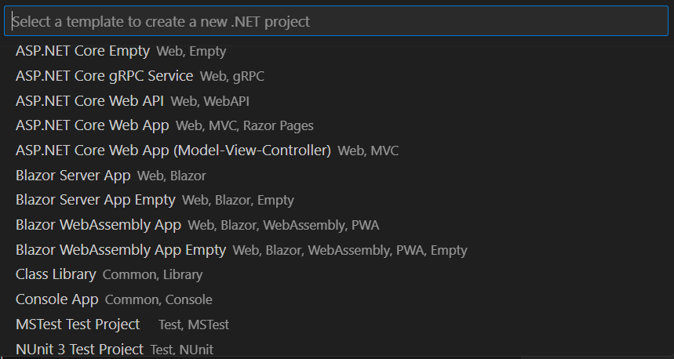
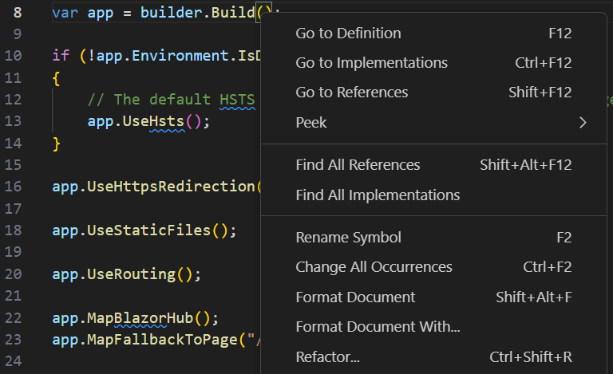
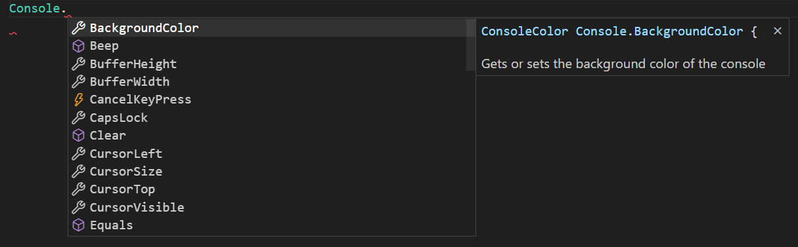
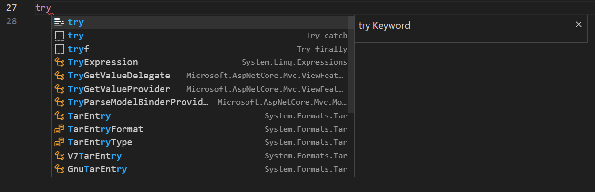
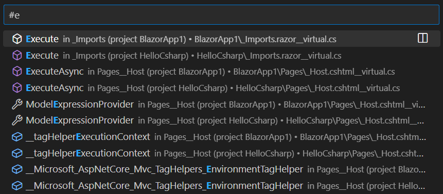
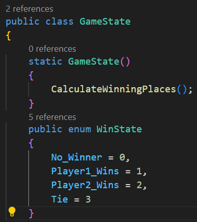
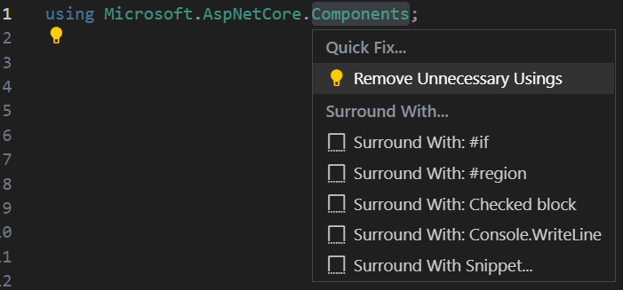

# C&#35; 작업하기 {#working-with-c35}

Visual Studio Code의 C# 지원은 크로스 플랫폼 .NET 개발을 위해 최적화되어 있습니다 (관련 기사인 [.NET 및 VS Code 작업하기](/docs/languages/dotnet.md)를 참조하세요). VS Code의 초점은 풍부한 C# 편집 경험, AI 기반 개발, 솔루션 관리 및 통합 테스트 경험을 제공하여 크로스 플랫폼 C# 개발을 위한 훌륭한 편집기가 되는 것입니다.

VS Code는 .NET 또는 Mono에서 실행되는 C# 애플리케이션의 디버깅을 지원합니다.

자세한 지침은 다음을 참조하세요:

* .NET 디버깅 - [C# Dev Kit 디버깅 문서](/docs/csharp/debugging.md)를 참조하세요.
* Mono 디버깅 - [Mono Debug 확장자의 README](https://marketplace.visualstudio.com/items?itemName=ms-vscode.mono-debug)를 참조하세요.

## C&#35; 지원 설치하기 {#installing-c35-support}

C# 언어 지원은 [C# Dev Kit 확장](https://marketplace.visualstudio.com/items?itemName=ms-dotnettools.csdevkit)을 통해 제공됩니다. VS Code 내에서 **확장** 뷰(`kb(workbench.view.extensions)`)에서 'C# Dev Kit'을 검색하여 설치할 수 있으며, 이미 C# 파일이 있는 프로젝트가 있다면 C# 파일을 열 때 확장 설치를 권장하는 메시지가 표시됩니다.

C# Dev Kit 확장에 대한 자세한 정보는 [C# 문서](/docs/csharp/get-started.md)를 참조하세요.

## C&#35; Dev Kit {#c35-dev-kit}

Visual Studio Code는 [Roslyn](https://github.com/dotnet/roslyn)과 [C# Dev Kit](https://marketplace.visualstudio.com/items?itemName=ms-dotnettools.csdevkit)의 힘을 활용하여 향상된 C# 경험을 제공합니다. 우리는 다음을 지원합니다:

* .NET 프로젝트
* MSBuild 프로젝트
* C# 스크립트 (CSX)

지원되는 .NET 프로젝트 유형은 다음과 같습니다:

* ASP.NET Core 앱
* ASP.NET Core 웹 API
* ASP.NET Core MVC 웹 앱
* Blazor 웹 앱
* Blazor 서버 앱
* Blazor 웹어셈블리 앱
* 콘솔 앱

기타 등등.

VS Code 내에서 지원되는 프로젝트 유형의 전체 목록을 찾으려면 **명령 팔레트**를 열고 **.NET: 새 프로젝트..**를 검색하세요. 그러면 지원되는 프로젝트 유형의 전체 목록이 표시됩니다.

.NET 솔루션 파일이나 프로젝트 파일이 포함된 작업 공간을 열면 솔루션 탐색기가 자동으로 나타납니다. 작업 공간에 단일 솔루션 파일(.sln 파일)이 있는 경우, 솔루션 탐색기는 해당 파일을 감지하고 작업 공간이 로드된 후 자동으로 로드합니다. VS Code에서 C# 프로젝트를 관리하는 방법에 대한 자세한 정보는 [프로젝트 관리 문서](/docs/csharp/project-management.md)를 참조하세요.

## 편집 진화하기 {#editing-evolved}

C#과 편집기에서 발견할 것이 많습니다. 예를 들어, 입력 시 포맷, IntelliSense, 이름 바꾸기-리팩토링 등이 있습니다.

C# Dev Kit 편집 기능에 대한 자세한 정보는 [탐색 및 편집 문서](/docs/csharp/navigate-edit.md)를 참조하세요. VS Code 편집 기능에 대한 전체 설명은 [기본 편집](/docs/editor/codebasics.md) 및 [코드 탐색](/docs/editor/editingevolved.md) 문서를 참조하세요.

여기 몇 가지 하이라이트가 있습니다...

## IntelliSense {#intellisense}

IntelliSense는 그냥 작동합니다: 언제든지 `kb(editor.action.triggerSuggest)`를 눌러 컨텍스트에 맞는 제안을 받을 수 있습니다.

## AI로 완성도 향상하기 {#enhance-completions-with-ai}

[GitHub Copilot](https://copilot.github.com/)은 코드를 더 빠르고 스마트하게 작성할 수 있도록 도와주는 AI 기반 코드 완성 도구입니다. VS Code에서 [GitHub Copilot 확장](https://marketplace.visualstudio.com/items?itemName=GitHub.copilot)을 사용하여 코드를 생성하거나 생성된 코드에서 학습할 수 있습니다.

GitHub Copilot은 여러 언어와 다양한 프레임워크에 대한 제안을 제공하며, Python, JavaScript, TypeScript, Ruby, Go, C# 및 C++에 특히 잘 작동합니다.

Copilot을 시작하는 방법에 대한 자세한 내용은 [Copilot 문서](/docs/editor/github-copilot.md)를 참조하세요.

## C&#35;를 위한 스니펫 {#snippets-for-c35}

C# Dev Kit의 스니펫에 대한 정보는 [탐색 및 편집 문서](/docs/csharp/navigate-edit.md)를 참조하세요. VS Code에는 입력할 때 나타나는 여러 내장 스니펫이 포함되어 있으며, `kb(editor.action.triggerSuggest)` (제안 트리거)를 눌러 컨텍스트에 맞는 제안 목록을 받을 수 있습니다.

>**팁:** C#에 대한 사용자 정의 스니펫을 추가할 수 있습니다. [사용자 정의 스니펫](/docs/editor/userdefinedsnippets.md)을 참조하여 방법을 알아보세요.

## 기호 검색하기 {#search-for-symbols}

편집기 외부에도 기능이 있습니다. 그 중 하나는 어디에서나 기호를 검색할 수 있는 기능입니다. `kb(workbench.action.showAllSymbols)`를 눌러 입력을 시작하면 일치하는 C# 기호 목록이 표시됩니다. 하나를 선택하면 해당 코드 위치로 바로 이동합니다.

## CodeLens {#codelens}

또 다른 멋진 기능은 메서드 바로 위에 메서드에 대한 참조 수를 볼 수 있는 기능입니다. 참조 정보를 클릭하면 Peek 보기에서 참조를 볼 수 있습니다. 이 참조 정보는 입력할 때마다 업데이트됩니다.

>**참고:** `object`에 정의된 메서드, 예를 들어 `equals` 및 `hashCode`는 성능상의 이유로 참조 정보를 제공하지 않습니다.

>**팁:** `setting(editor.codeLens)` [설정](/docs/editor/settings.md)을 사용하여 CodeLens에 표시되는 참조 정보를 끌 수 있습니다.

## 참조 찾기/정의 미리 보기 {#find-referencespeek-definition}

객체의 참조를 클릭하여 맥락을 잃지 않고 사용 위치를 찾을 수 있습니다. 동일한 경험이 반대로 작동하여 객체의 정의를 Peek하고 현재 위치를 떠나지 않고 인라인으로 볼 수 있습니다. C# Dev Kit의 Peek 정의에 대한 정보는 [탐색 및 편집 문서](/docs/csharp/navigate-edit.md)를 참조하세요.

## 빠른 수정 / 제안 {#quick-fixes-suggestions}

VS Code에서 지원되는 몇 가지 기본 빠른 수정 기능이 있습니다. 전구 아이콘이 표시되며, 이를 클릭하거나 `kb(editor.action.quickFix)`를 누르면 간단한 수정/제안 목록이 제공됩니다.

## 테스트 {#testing}

이 확장은 다음 테스트 프레임워크를 지원합니다:

* [XUnit](https://learn.microsoft.com/dotnet/core/testing/unit-testing-with-dotnet-test)
* [NUnit](https://learn.microsoft.com/dotnet/core/testing/unit-testing-with-nunit)
* [MSTest](https://learn.microsoft.com/dotnet/core/testing/unit-testing-with-mstest)

C# Dev Kit 확장은 다음 기능을 제공합니다:

* 테스트 케이스 실행/디버깅
* 테스트 보고서 보기
* 테스트 탐색기에서 테스트 보기

자세한 내용은 [C# Dev Kit 테스트 문서](/docs/csharp/testing.md)를 참조하세요.

## 다음 단계 {#next-steps}

다음에 대해 알아보세요:

* [C# Dev Kit 문서](/docs/csharp/get-started.md)
* [.NET 개발](/docs/languages/dotnet.md) - 크로스 플랫폼 .NET을 시작하세요.
* [기본 편집](/docs/editor/codebasics.md) - 강력한 VS Code 편집기에 대해 알아보세요.
* [작업](/docs/editor/tasks.md) - 작업을 사용하여 프로젝트를 빌드하고 더 많은 작업을 수행하세요.
* [디버깅](/docs/editor/debugging.md) - 프로젝트와 함께 디버거를 사용하는 방법을 알아보세요.
* [Unity 개발](/docs/other/unity.md) - Unity 프로젝트와 함께 VS Code를 사용하는 방법에 대해 알아보세요.