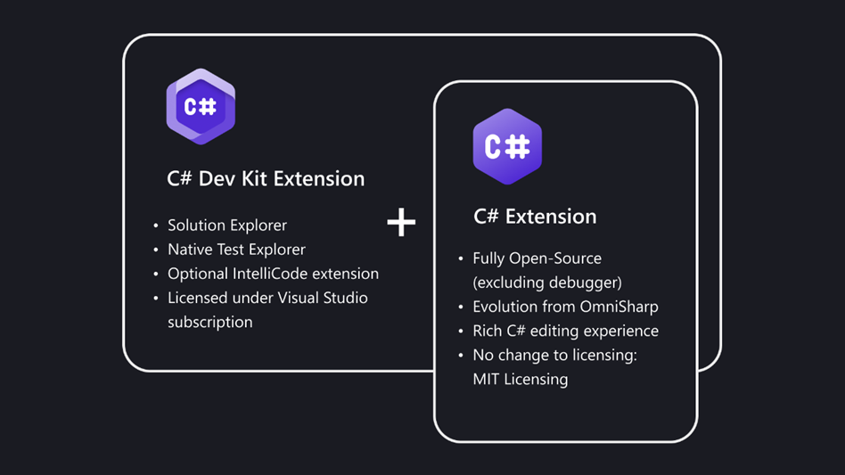

# Visual Studio Code에서 .NET 사용하기 {#using-net-in-visual-studio-code}

[.NET](https://dotnet.microsoft.com)은 Windows, Linux 및 macOS에서 실행되는 다양한 유형의 애플리케이션을 만들기 위한 빠르고 모듈화된 플랫폼을 제공합니다. C# 및 F# 확장과 함께 Visual Studio Code를 사용하여 [C# IntelliSense](https://learn.microsoft.com/visualstudio/ide/visual-csharp-intellisense), F# IntelliSense(스마트 코드 완성), 디버깅 기능을 갖춘 강력한 편집 경험을 얻을 수 있습니다.

## .NET 개발을 위한 VS Code 설정하기 {#setting-up-vs-code-for-net-development}

기존 VS Code 사용자라면 [C# Dev Kit](https://marketplace.visualstudio.com/items?itemName=ms-dotnettools.csdevkit) 확장을 설치하여 .NET 지원을 추가할 수 있습니다. C# Dev Kit는 VS Code에서 생산적이고 신뢰할 수 있는 C# 경험을 제공하여 C# 또는 다국어 개발을 용이하게 합니다. 이 확장 팩은 풍부한 C# 편집 경험, AI 기반 개발, 솔루션 관리 및 통합 테스트 경험을 제공하기 위해 함께 작동하는 일련의 VS Code 확장으로 구성되어 있습니다. 아래 그래픽에서 볼 수 있듯이, C# Dev Kit는 다음으로 구성됩니다:

* [C# 확장](https://marketplace.visualstudio.com/items?itemName=ms-dotnettools.csharp): 기본 언어 서비스 지원을 제공하며, 이 노력과는 독립적으로 계속 작업되고 유지됩니다.
* [C# Dev Kit 확장](https://marketplace.visualstudio.com/items?itemName=ms-dotnettools.csdevkit): Visual Studio와 동일한 기본 기반 위에 구축되어 솔루션 관리, 템플릿, 테스트 발견/디버깅을 제공합니다.
* IntelliCode for C# Dev Kit 확장(선택 사항): 편집기에 AI 기반 개발 경험을 제공합니다.



프로젝트에 F# 지원이 필요한 경우, 다음 확장을 포함하는 [.NET Extension Pack](https://marketplace.visualstudio.com/items?itemName=ms-dotnettools.vscode-dotnet-pack)을 다운로드할 수 있습니다:

* [Visual Studio Code용 C# Dev Kit](https://marketplace.visualstudio.com/items?itemName=ms-dotnettools.csdevkit)
* [F#용 Ionide](https://marketplace.visualstudio.com/items?itemName=Ionide.Ionide-fsharp)
* [Jupyter Notebooks](https://marketplace.visualstudio.com/items?itemName=ms-toolsai.jupyter)
* [Polyglot Notebooks](https://marketplace.visualstudio.com/items?itemName=ms-dotnettools.dotnet-interactive-vscode)

확장을 개별적으로 설치할 수도 있습니다.

## .NET 소프트웨어 개발 키트 설치하기 {#installing-the-net-software-development-kit}

확장을 개별적으로 다운로드하는 경우, 로컬 환경에 .NET SDK도 설치되어 있는지 확인하십시오. .NET SDK는 .NET 애플리케이션 개발에 사용되는 소프트웨어 개발 환경입니다.

<a class="install-extension-btn" href="https://aka.ms/vscDocs/dotnet/download">.NET SDK 설치하기</a>

## C# "Hello World" 앱 만들기 {#create-a-c-hello-world-app}

1. C# 프로젝트 초기화하기:

   * 터미널/명령 프롬프트를 열고 앱을 만들고 싶은 폴더로 이동합니다.
   * 명령 셸에 다음 명령을 입력합니다:

   ```bat
     dotnet new console
   ```

2. 프로젝트 폴더가 VS Code에서 처음 열리면:

   * "빌드 및 디버그에 필요한 자산이 누락되었습니다. 추가하시겠습니까?"라는 알림이 창의 오른쪽 하단에 나타납니다.
   * **예**를 선택합니다.

3. 명령 셸에 다음 명령을 입력하여 앱을 실행합니다:

   ```bat
   dotnet run
   ```

## F# "Hello World" 앱 만들기 {#create-an-f-hello-world-app}

1. F# 프로젝트 초기화하기:

   * 터미널/명령 프롬프트를 열고 앱을 만들고 싶은 폴더로 이동합니다.
   * 명령 셸에 다음 명령을 입력합니다:

   ```bat
   dotnet new console -lang "F#"
   ```

2. 완료되면 Visual Studio Code에서 프로젝트를 엽니다:

   ```bat
   code .
   ```

3. 명령 셸에 다음 명령을 입력하여 앱을 실행합니다:

   ```bat
    dotnet run
   ```

## 다음 단계 {#next-steps}

* [C# Dev Kit 문서](/docs/csharp/get-started.md)
* C# 개발 탐색 계속하기: [VS Code 및 .NET로 디버깅하기](https://learn.microsoft.com/dotnet/core/tutorials/debugging-with-visual-studio-code)
* [기본 편집](/docs/editor/codebasics.md) - 강력한 VS Code 편집기에 대해 알아보세요.
* [코드 탐색](/docs/editor/editingevolved.md) - 소스 코드를 빠르게 이동하세요.
* [C# 작업하기](/docs/languages/csharp.md) - .NET 애플리케이션 작업 시 훌륭한 C# 지원에 대해 알아보세요.
* [작업](/docs/editor/tasks.md) - Gulp, Grunt 및 Jake로 작업 실행하기. 오류 및 경고 표시
* [.NET 문서](https://learn.microsoft.com/dotnet) - 이 강력한 크로스 플랫폼 개발 솔루션에 대한 더 많은 정보를 위해 .NET 문서를 방문하세요.
* [Azure에 애플리케이션 배포하기](/docs/azure/deployment.md) - 앱을 [Azure](https://azure.microsoft.com)에 배포하세요.
* [Visual Studio Code에서 F# 시작하기](https://learn.microsoft.com/dotnet/fsharp/get-started/get-started-vscode)