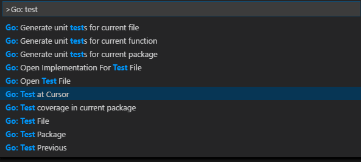

# Visual Studio Code에서 Go 사용하기 {#go-in-visual-studio-code}

Visual Studio Code의 Go 확장을 사용하면 IntelliSense, 코드 탐색, 심볼 검색, 테스트, 디버깅 등 [Go](https://go.dev/) 개발에 도움이 되는 다양한 기능을 이용할 수 있습니다.


VS Code [Marketplace](https://marketplace.visualstudio.com/items?itemName=golang.go)에서 Go 확장을 설치할 수 있습니다.

VS Code Go를 사용하여 첫 번째 Go 애플리케이션을 구축하는 방법에 대한 설명은 ["VS Code Go 시작하기"](https://youtu.be/1MXIGYrMk80) 영상을 시청하세요.

이 문서에서는 Go 확장이 제공하는 기능의 일부만 설명합니다. 전체 최신 지원 기능 목록은 확장의 [문서](https://github.com/golang/vscode-go/wiki/features)를 참조하세요.

## IntelliSense {#intellisense}


IntelliSense 기능은 Go 팀에서 유지 관리하는 Go 언어 서버인 [gopls](https://go.dev/s/gopls)에서 제공합니다. `gopls`의 동작은 [`gopls` 설정](https://github.com/golang/vscode-go/wiki/settings#settings-for-gopls)을 사용하여 구성할 수 있습니다.

### 의미론적 구문 강조 {#semantic-syntax-highlighting}

기본 TextMate 기반 구문 강조보다 더 나은 구문 강조를 위해 Gopls의 `ui.semanticTokens` 설정을 켜서 [의미론적 강조](https://api/language-extensions/semantic-highlight-guide.md)를 활성화하는 것을 권장합니다.

```json
"gopls": { "ui.semanticTokens": true }
```

### 자동 완성 {#auto-completions}

Go 파일에 입력하는 동안 IntelliSense가 제안하는 완성을 볼 수 있습니다. 이는 현재, 가져온, 아직 가져오지 않은 패키지의 멤버에 대해서도 작동합니다. 패키지 이름 뒤에 `.`를 입력하면 해당 패키지 멤버에 대한 제안을 받을 수 있습니다.

>**팁**: 제안을 수동으로 트리거하려면 `kb(editor.action.triggerSuggest)`를 사용하세요.

### 호버 정보 {#hover-information}

변수, 함수 또는 구조체 위에 마우스를 올리면 해당 항목에 대한 정보(문서, 서명 등)를 확인할 수 있습니다.

### 서명 도움말 {#signature-help}

함수를 호출할 때 `(`를 열면 팝업이 나타나 함수에 대한 서명 도움말을 제공합니다. 매개변수를 계속 입력하면 힌트(밑줄)가 다음 매개변수로 이동합니다.

>**팁**: 함수 호출의 `()` 안에 커서가 있을 때 서명 도움말을 수동으로 트리거하려면 `kb(editor.action.triggerParameterHints)`를 사용하세요.

## 코드 탐색 {#code-navigation}

코드 탐색 기능은 편집기의 컨텍스트 메뉴에서 사용할 수 있습니다.

* **정의로 이동** `kb(editor.action.revealDefinition)` - 타입 정의의 소스 코드로 이동합니다.
* **타입 정의로 이동** - 심볼을 정의하는 타입으로 이동합니다.
* **정의 미리 보기** `kb(editor.action.peekDefinition)` - 타입 정의가 있는 미리 보기 창을 엽니다.
* **참조로 이동** `kb(editor.action.goToReferences)` - 타입에 대한 모든 참조를 표시합니다.
* **호출 계층 표시** `kb(editor.showCallHierarchy)` - 함수에서의 모든 호출을 표시합니다.
* **구현으로 이동** `kb(editor.action.goToImplementation)` - 인터페이스의 모든 구현 목록이 있는 미리 보기 창을 엽니다(인터페이스 타입 심볼로 트리거된 경우) 또는 타입이 구현하는 인터페이스(구체적인 타입 심볼로 트리거된 경우).
* **모든 구현 찾기** - 인터페이스의 모든 구현을 표시합니다(인터페이스 타입 심볼로 트리거된 경우) 또는 타입이 구현하는 인터페이스(구체적인 타입 심볼로 트리거된 경우).

**Go to Symbol** 명령을 사용하여 심볼 검색을 통해 탐색할 수 있습니다. 명령 팔레트에서 (`kb(workbench.action.showCommands)`) 사용할 수 있습니다.

* **파일 내 심볼로 이동** - `kb(workbench.action.gotoSymbol)`
* **작업 공간 내 심볼로 이동** - `kb(workbench.action.showAllSymbols)`

또한 **Go: Toggle Test File** 명령을 사용하여 Go 파일과 해당 테스트 구현 간에 앞뒤로 탐색할 수 있습니다.

## 빌드 및 진단 {#build-and-diagnose}

Go 언어 서버(`gopls`)는 작업 공간에서 발견된 빌드 및 vet 오류를 감지합니다. 위의 모든 작업을 실행할 때 발생하는 오류와 경고는 편집기에서 빨간색/초록색 물결선으로 표시됩니다. 이러한 진단은 **문제** 패널에도 표시됩니다 (**보기** > **문제**).

`go.lintOnSave` 설정을 사용하여 추가 린트 검사를 추가하고, `go.lintTool` 설정을 사용하여 선택한 린팅 도구(`staticcheck`, `golangci-lint`, 또는 `revive`)를 구성할 수 있습니다.

## 포맷팅 {#formatting}

`kb(editor.action.formatDocument)`를 사용하거나 명령 팔레트 또는 편집기에서의 컨텍스트 메뉴에서 **문서 포맷** 명령을 실행하여 Go 파일을 포맷할 수 있습니다.

기본적으로 Go 파일을 저장할 때 포맷팅이 실행됩니다. 이 동작을 비활성화하려면 `[go]` 언어 식별자에 대해 `setting(editor.formatOnSave)`를 `false`로 설정하면 됩니다. JSON 설정 파일을 사용하여 이를 변경할 수 있습니다.

```json
"[go]": {
        "editor.formatOnSave": false
}
```

Go 파일에 대해 여러 포맷터가 활성화된 경우 Go 확장을 기본 포맷터로 선택할 수 있습니다.

```json
"[go]": {
    "editor.defaultFormatter": "golang.go"
}
```

포맷팅은 `gopls`에서 제공합니다. `gofumpt` 스타일의 포맷팅을 원하시면 `gopls`를 `gofumpt`를 사용하도록 구성할 수 있습니다.

```json
"gopls": {
    "formatting.gofumpt": true
}
```

## 테스트 {#test}

VS Code [테스트 UI](/api/extension-guides/testing.md) 및 편집기 [CodeLens](https://code.visualstudio.com/blogs/2017/02/12/code-lens-roundup) 요소를 사용하면 사용자가 특정 함수, 파일, 패키지 또는 작업 공간에 대한 테스트, 벤치마크, 프로파일을 쉽게 실행할 수 있습니다.

또한 동일한 기능은 다음 명령 세트를 통해 사용할 수 있습니다:

* [**Go: 커서에서 함수 테스트**](https://github.com/golang/vscode-go/wiki/commands#go-test-function-at-cursor)
* [**Go: 파일 테스트**](https://github.com/golang/vscode-go/wiki/commands#go-test-file)
* [**Go: 패키지 테스트**](https://github.com/golang/vscode-go/wiki/commands#go-test-package)
* [**Go: 작업 공간의 모든 패키지 테스트**](https://github.com/golang/vscode-go/wiki/commands#go-test-all-packages-in-workspace)

명령 팔레트에서 "Go: test"를 입력하여 탐색할 수 있는 많은 테스트 관련 명령이 있습니다.



위의 처음 세 가지는 현재 패키지, 파일 또는 커서에서 함수에 대한 테스트 스켈레톤을 생성하는 데 사용할 수 있으며, 마지막 몇 가지는 `go test`를 사용하여 현재 패키지, 파일 또는 커서에서 테스트를 실행하는 데 사용할 수 있습니다. 테스트 커버리지를 얻기 위한 명령도 있습니다.

테스트를 실행하고 테스트 커버리지를 계산하도록 확장을 구성할 수 있습니다:

* `go.testOnSave`
* `go.coverOnSave`
* `go.testFlags`

## 패키지 가져오기 {#import-packages}

확장은 기본적으로 가져오기를 정리하고 사용하지 않는 가져오기를 제거합니다. 다른 동작을 원하시면 [이 지침](https://github.com/golang/vscode-go/wiki/advanced#formatting-code-and-organizing-imports)에 따라 언어별 기본 설정을 재정의할 수 있습니다.

**Go: Add Import** 명령을 실행하여 Go 파일에 가져올 수 있는 패키지 목록을 가져옵니다. 하나를 선택하면 Go 파일의 가져오기 블록에 추가됩니다.

## 리팩토링 {#refactoring}

리팩토링할 영역(예: 변수, 함수 본체 등)을 선택합니다. 선택한 영역에 나타나는 코드 작업 전구 아이콘을 클릭하거나 VS Code 컨텍스트 메뉴에서 **리팩토링...** 또는 **심볼 이름 바꾸기**(`kb(editor.action.rename)`)를 선택합니다.

## 디버깅 {#debugging}

Go 확장은 [Delve](https://github.com/go-delve/delve) 디버거를 활용하여 Go 코드를 디버깅할 수 있게 해줍니다.

설정 단계, 지원되는 기능, 구성, 원격 디버깅 정보 및 문제 해결 가이드는 [VS Code에서 Go 프로그램 디버깅](https://github.com/golang/vscode-go/wiki/debugging)을 참조하세요. 변수 검사, 중단점 설정 및 언어에 의존하지 않는 기타 활동과 같은 일반 디버깅 기능에 대해서는 [VS Code 디버깅](/docs/editor/debugging.md)을 검토하세요.

Go에 고유한 몇 가지 기능은 다음과 같습니다:

* 로컬 및 원격 디버깅
* [Delve의 표현식 구문](https://github.com/go-delve/delve/blob/master/Documentation/cli/expr.md)을 사용한 데이터 검사
* DEBUG CONSOLE에서 [`dlv` 명령](https://github.com/golang/vscode-go/wiki/debugging#dlv-command-from-debug-console)을 사용한 동적 구성 변경 및 검사 옵션
* 시스템 고루틴 숨기기/보이기 기능(구성 `hideSystemGoroutines` 사용)
* 분해 조립 보기 지원(소스 코드에서 마우스 오른쪽 버튼 클릭 후 **분해 조립 보기 열기** 선택)
* 실험적 함수 호출, 코어 검사, Mozilla `rr` 지원

## 다음 단계 {#next-steps}

이 문서는 VS Code 내에서 Go 확장 기능을 간략하게 소개한 것입니다. 더 많은 정보는 Go 확장 [README](https://github.com/golang/vscode-go/blob/master/README.md)에 제공된 세부 정보를 참조하세요.

Go 확장의 최신 기능 및 버그 수정에 대한 정보를 얻으려면 [CHANGELOG](https://github.com/golang/vscode-go/blob/master/CHANGELOG.md)를 확인하세요.

문제나 기능 요청이 있는 경우 Go 확장 [vscode-go 저장소](https://github.com/golang/vscode-go/issues)에 자유롭게 기록하세요.

VS Code에 대해 더 배우고 싶다면 다음 주제를 시도해 보세요:

* [기본 편집](/docs/editor/codebasics.md) - VS Code 편집기의 기본 사항에 대한 간단한 소개입니다.
* [확장 설치](/docs/editor/extension-marketplace.md) - [Marketplace](https://marketplace.visualstudio.com/vscode)에서 사용할 수 있는 다른 확장에 대해 알아보세요.
* [코드 탐색](/docs/editor/editingevolved.md) - 소스 코드를 빠르게 탐색하세요.