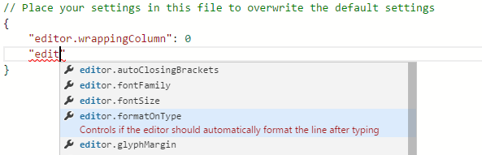
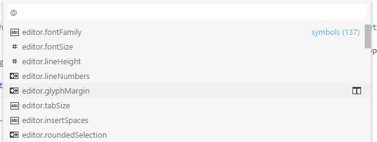
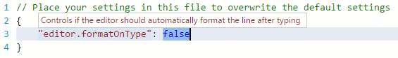
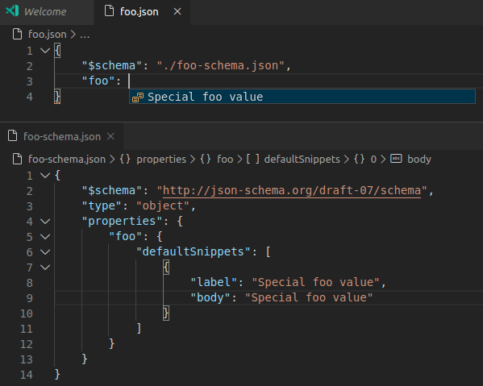

# Visual Studio Code로 JSON 편집하기 {#editing-json-with-visual-studio-code}

JSON은 `package.json` 또는 `project.json`과 같은 구성 파일에서 일반적으로 사용되는 데이터 형식입니다. 우리는 Visual Studio Code에서 구성 파일을 위해 이를 광범위하게 사용합니다. `.json`으로 끝나는 파일을 열면 VS Code는 파일의 내용을 작성하거나 수정하는 것을 더 쉽게 만들어주는 기능을 제공합니다.


## IntelliSense 및 검증 {#intellisense-and-validation}

스키마가 있는 JSON 데이터와 없는 JSON 데이터 모두에 대해 속성과 값에 대한 제안을 입력하는 동안 IntelliSense를 통해 제공합니다. 또한 **Trigger Suggestions** 명령(`kb(editor.action.triggerSuggest)`)을 사용하여 수동으로 제안을 볼 수 있습니다.

우리는 또한 관련 JSON 스키마를 기반으로 구조 및 값 검증을 수행하여 빨간 물결선을 표시합니다. 검증을 비활성화하려면 `setting(json.validate.enable)` [설정](/docs/editor/settings.md)을 사용하세요.



### 패키지 및 프로젝트 종속성 {#package-and-project-dependencies}

우리는 또한 `package.json`, `project.json`, `bower.json`에서 패키지 및 프로젝트 종속성과 같은 특정 값 집합에 대한 IntelliSense를 제공합니다.

## 빠른 탐색 {#quick-navigation}

JSON 파일은 커질 수 있으며, **Go to Symbol** 명령(`kb(workbench.action.gotoSymbol)`)을 사용하여 속성으로 빠르게 탐색할 수 있습니다.



## 호버 {#hovers}

스키마 여부와 관계없이, JSON 데이터의 속성이나 값 위에 마우스를 올리면 추가적인 정보를 확인할 수 있습니다.



## 정렬 {#formatting}

`kb(editor.action.formatDocument)` 또는 컨텍스트 메뉴에서 **Format Document**을 사용하여 JSON 문서를 정렬할 수 있습니다.

## 접기 {#folding}

라인 번호와 라인 시작 사이의 접기 아이콘을 사용하여 소스 코드의 영역을 접을 수 있습니다. 모든 객체 및 배열 요소에 대해 접기 영역을 사용할 수 있습니다.

## 주석이 있는 JSON {#json-with-comments}

[JSON 사양](https://www.json.org/)을 따르는 기본 JSON 모드 외에도, VS Code에는 **JSON with Comments**(jsonc) 모드가 있습니다. 이 모드는 `settings.json`, `tasks.json`, 또는 `launch.json`과 같은 VS Code 구성 파일에 사용됩니다. **JSON with Comments** 모드에서는 JavaScript에서 사용되는 단일 행(`//`) 및 블록 주석(`/* */`)을 사용할 수 있습니다. 이 모드는 후행 쉼표도 허용하지만, 권장되지 않으며 편집기에서 경고를 표시합니다.

현재 편집기 모드는 편집기의 상태 표시줄에 표시됩니다. 모드 표시기를 선택하여 모드를 변경하고 파일 확장이 모드에 어떻게 연결되는지 구성할 수 있습니다. 또한 `setting(files.associations)` [설정](/docs/languages/overview.md#add-a-file-extension-to-a-language)을 직접 수정하여 파일 이름 또는 파일 이름 패턴을 `jsonc`에 연결할 수 있습니다.

## JSON 스키마 및 설정 {#json-schemas-and-settings}

JSON 파일의 구조를 이해하기 위해 [JSON 스키마](https://json-schema.org/)를 사용합니다. JSON 스키마는 JSON 파일의 형태와 값 집합, 기본값 및 설명을 설명합니다. VS Code에 포함된 JSON 지원은 초안 4부터 초안 7까지의 모든 초안 버전을 지원하며, 초안 2019-09 및 2020-12에 대해서는 제한된 지원을 제공합니다.

[JSON Schema Store](https://www.schemastore.org)와 같은 서버는 대부분의 일반적인 JSON 기반 구성 파일에 대한 스키마를 제공합니다. 그러나 스키마는 VS Code 작업 공간의 파일이나 VS Code 설정 파일에서도 정의할 수 있습니다.

JSON 파일을 스키마에 연결하는 것은 JSON 파일 자체에서 `$schema` 속성을 사용하거나 사용자 또는 작업 공간 [설정](/docs/editor/settings.md) (**File** > **Preferences** > **Settings**)에서 `setting(json.schemas)` 속성 아래에서 수행할 수 있습니다.

VS Code 확장 프로그램도 스키마 및 스키마 매핑을 정의할 수 있습니다. 그래서 VS Code는 이미 `package.json`, `bower.json`, 및 `tsconfig.json`과 같은 잘 알려진 JSON 파일의 스키마를 알고 있습니다.

### JSON에서의 매핑 {#mapping-in-the-json}

다음 예제에서 JSON 파일은 그 내용이 [CoffeeLint](https://coffeelint.github.io/) 스키마를 따름을 지정합니다.

```json
{
   "$schema": "https://json.schemastore.org/coffeelint",
   "line_endings": "unix"
}
```

이 구문은 VS Code 전용이며 [JSON 스키마 사양](https://json-schema.org/specification)의 일부가 아닙니다. `$schema` 키를 추가하면 JSON 자체가 변경되며, JSON을 소비하는 시스템은 이를 예상하지 못할 수 있습니다. 예를 들어, 스키마 검증이 실패할 수 있습니다. 이 경우 다른 매핑 방법 중 하나를 사용할 수 있습니다.

### 사용자 설정에서의 매핑 {#mapping-in-the-user-settings}

다음은 사용자 [설정](/docs/editor/settings.md)에서 `.babelrc` 파일이 [babelrc](https://babeljs.io/docs/usage/babelrc) 스키마에 매핑되는 방법을 보여주는 발췌입니다. 이 스키마는 [https://json.schemastore.org/babelrc](https://json.schemastore.org/babelrc)에 위치합니다.

```json
"json.schemas": [
    {
        "fileMatch": [
            "/.babelrc"
        ],
        "url": "https://json.schemastore.org/babelrc"
    }
]
```

:::tip
`.babelrc`에 대한 스키마를 정의하는 것 외에도, `.babelrc`가 JSON 언어 모드에 연결되어 있는지 확인하세요. 이는 `files.association` 배열 설정을 사용하여 설정에서 수행됩니다.
:::

### 작업 공간에서 스키마에 매핑 {#mapping-to-a-schema-in-the-workspace}

작업 공간에 위치한 스키마에 매핑하려면 상대 경로를 사용합니다. 이 예제에서는 작업 공간 루트에 있는 `myschema.json` 파일이 `.foo.json`으로 끝나는 모든 파일의 스키마로 사용됩니다.

```json
"json.schemas": [
    {
        "fileMatch": [
            "**/*.foo.json"
        ],
        "url": "./myschema.json"
    }
]
```

### 설정에서 정의된 스키마에 매핑 {#mapping-to-a-schema-defined-in-settings}

사용자 또는 작업 공간 설정에서 정의된 스키마에 매핑하려면 `schema` 속성을 사용합니다. 이 예제에서는 `.myconfig`라는 이름의 모든 파일에 사용될 스키마가 정의됩니다.

```json
"json.schemas": [
    {
        "fileMatch": [
            "/.myconfig"
        ],
        "schema": {
            "type": "object",
            "properties": {
                "name" : {
                    "type": "string",
                    "description": "The name of the entry"
                }
            }
        }
    }
]
```

### 확장에서 스키마 매핑 {#mapping-a-schema-in-an-extension}

스키마 및 스키마 연결은 확장 프로그램에 의해 정의될 수도 있습니다. [jsonValidation 기여 지점](/api/references/contribution-points.md#contributesjsonvalidation)을 확인하세요.

### 파일 매치 구문 {#file-match-syntax}

파일 매치 구문은 '*' 와일드카드를 지원합니다. 또한 '!'로 시작하는 제외 패턴을 정의할 수 있습니다. 연결이 일치하려면 최소한 하나의 패턴이 일치해야 하며, 마지막으로 일치하는 패턴은 제외 패턴이 아니어야 합니다.

```json
  "json.schemas": [
    {
      "fileMatch": [
        "/receipts/*.json",
        "!/receipts/*.excluded.json"
      ],
      "url": "./receipts.schema.json"
    }
  ]
```

### JSON 스키마에서 스니펫 정의 {#define-snippets-in-json-schemas}

JSON 스키마는 JSON 파일의 형태와 값 집합 및 기본값을 설명하며, 이는 JSON 언어 지원이 완성 제안을 제공하는 데 사용됩니다. 스키마 작성자라면 더 맞춤화된 완성 제안을 제공하기 위해 스키마에 스니펫을 지정할 수도 있습니다.

다음 예제는 스니펫을 정의하는 키보드 단축키 설정 파일에 대한 스키마를 보여줍니다:

```json
{
    "type": "array",
    "title": "Keyboard shortcuts configuration",
    "items": {
        "type": "object",
        "required": ["key"],
        "defaultSnippets": [
            {
                "label": "New keyboard shortcut",
                "description": "Binds a key to a command for a given state",
                "body": { "key": "$1", "command": "$2", "when": "$3" }
            }
        ],
        "properties": {
            "key": {
                "type": "string"
            }
            ...
        }
    }
}
```

이것은 JSON 스키마의 예입니다:



`defaultSnippets` 속성을 사용하여 주어진 JSON 객체에 대해 원하는 만큼의 스니펫을 지정할 수 있습니다.

- `label`과 `description`은 완성 선택 대화 상자에 표시됩니다. 레이블이 제공되지 않으면 스니펫의 문자열화된 객체 표현이 대신 레이블로 표시됩니다.
- `body`는 사용자가 완성을 선택할 때 문자열화되어 삽입되는 JSON 객체입니다. 문자열 리터럴 내에서 탭 정지, 자리 표시자 및 변수를 정의하기 위해 [스니펫 구문](/docs/editor/userdefinedsnippets.md#snippet-syntax)을 사용할 수 있습니다. 문자열이 `^`로 시작하면 문자열 내용이 그대로 삽입되며, 문자열화되지 않습니다. 이를 사용하여 숫자 및 불리언에 대한 스니펫을 지정할 수 있습니다.

`defaultSnippets`는 JSON 스키마 사양의 일부가 아니라 VS Code 전용 스키마 확장입니다.

### 호버에서 풍부한 포맷팅 사용 {#use-rich-formatting-in-hovers}

VS Code는 속성에 대한 정보를 제공하기 위해 [JSON 스키마 사양](https://json-schema.org/specification)의 표준 `description` 필드를 사용하여 호버 및 자동 완성 중에 정보를 제공합니다.

설명이 링크와 같은 포맷팅을 지원하도록 하려면, `markdownDescription` 속성을 사용하여 포맷팅에 [Markdown](/docs/languages/markdown.md)을 사용할 수 있습니다.

```json
{
   "$schema": "http://json-schema.org/draft-07/schema#",
   "type": "object",
   "properties": {
       "name" : {
           "type": "string",
           "description": "항목의 이름",
           "markdownDescription": "항목의 이름입니다. [문서 보기](https://example.com)"
       }
   }
}
```

`markdownDescription`은 JSON 스키마 사양의 일부가 아니라 VS Code 전용 스키마 확장입니다.

### 오프라인 모드 {#offline-mode}

`setting(json.schemaDownload.enable)`는 JSON 확장이 `http` 및 `https`에서 JSON 스키마를 가져오는지 여부를 제어합니다.

현재 편집기가 다운로드할 수 없는 스키마를 사용하려고 할 때 상태 표시줄에 경고 삼각형이 표시됩니다.