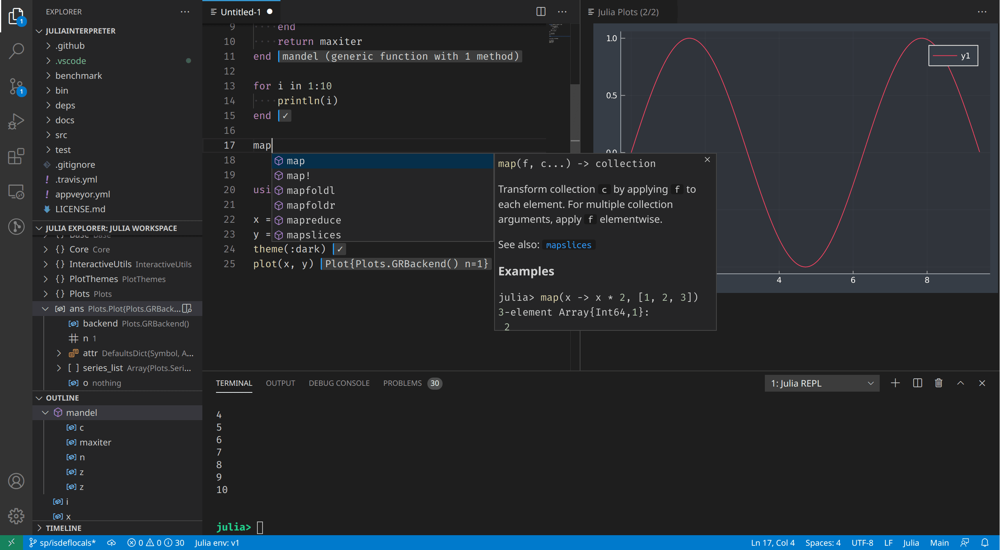
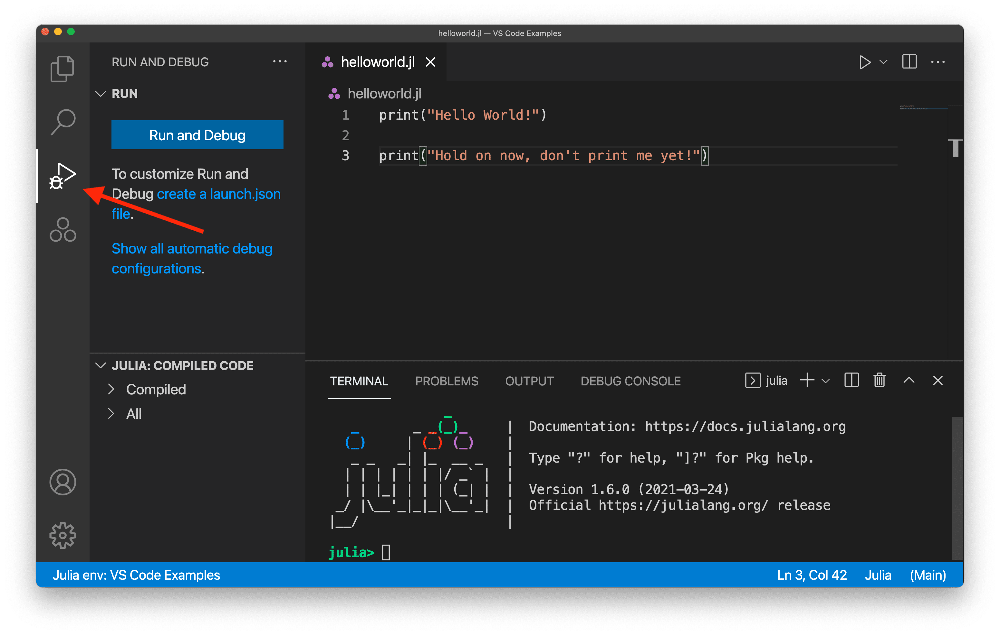
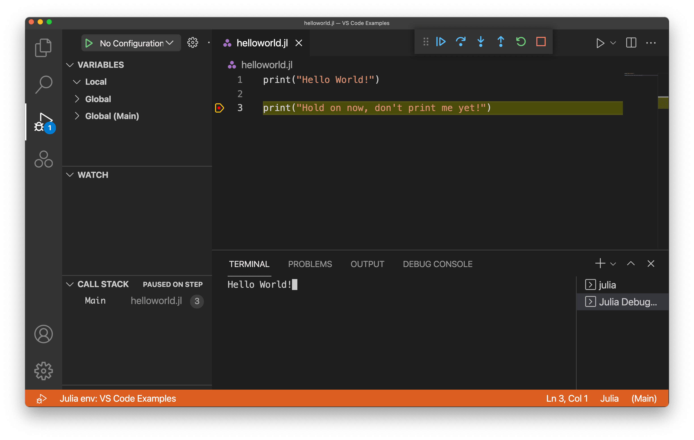
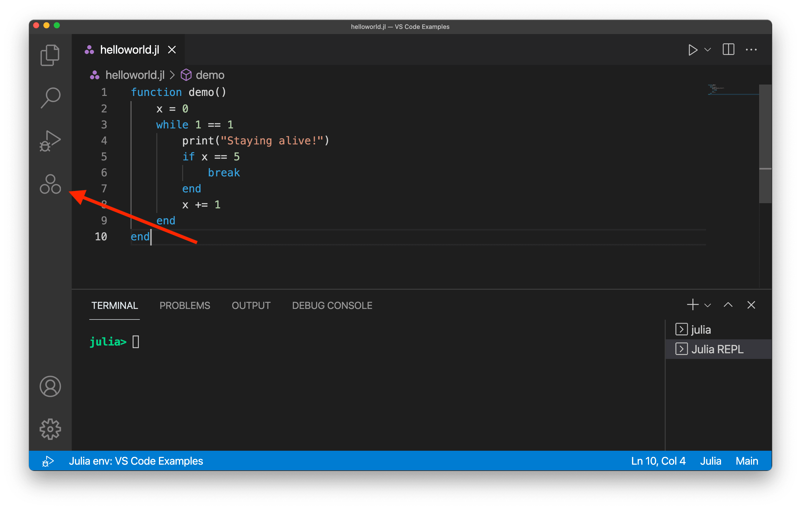
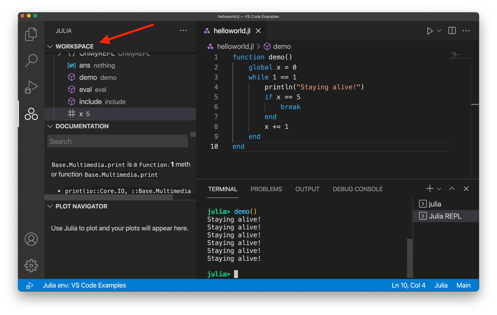
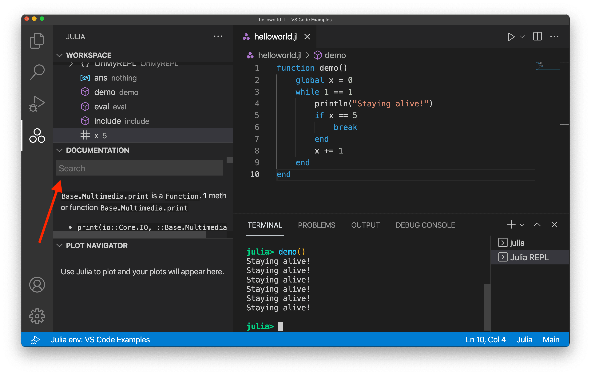

# Visual Studio Code에서의 Julia {#julia-in-visual-studio-code}

[Julia 프로그래밍 언어](https://julialang.org)는 속도와 단순성을 위해 설계된 고급 동적 언어입니다. Julia는 데이터 과학, 머신 러닝, 과학 컴퓨팅과 같은 분야에서 일반적으로 사용되지만, 대부분의 프로그래밍 사용 사례를 처리할 수 있는 범용 언어입니다.

Visual Studio Code용 [Julia 확장](https://marketplace.visualstudio.com/items?itemName=julialang.language-julia)에는 내장된 동적 자동 완성, 인라인 결과, 플롯 창, 통합 REPL, 변수 보기, 코드 탐색 및 기타 많은 고급 언어 기능이 포함되어 있습니다.

이 기능들 중 대부분은 기본 설정으로 바로 사용할 수 있지만, 최상의 경험을 위해서는 일부 기본 구성이 필요할 수 있습니다. 이 페이지에서는 Julia VS Code 확장에 포함된 Julia 기능을 요약합니다. 이러한 기능이 어떻게 작동하고 구성할 수 있는지에 대한 더 자세한 가이드는 [VS Code에서의 Julia](https://www.julia-vscode.org/docs/stable/) 문서를 참조하세요.

## 시작하기 {#getting-started}

1. 플랫폼에 맞는 Julia를 설치하세요: [https://julialang.org/downloads](https://julialang.org/downloads).
2. 플랫폼에 맞는 VS Code를 설치하세요: [https://code.visualstudio.com/download](https://code.visualstudio.com/download).
3. [VS Code Marketplace](https://marketplace.visualstudio.com/items?itemName=julialang.language-julia)에서 Julia 확장을 열고 **설치**를 누르세요. 또는 다음 단계를 통해 수동으로 설치할 수 있습니다:
    1. VS Code를 시작하세요.
    2. VS Code 내에서 상단 메뉴 바에서 **보기**를 클릭한 후 **확장**을 선택하여 확장 보기로 이동하세요.
    3. 확장 보기에서 Marketplace 검색 상자에 "julia"라는 용어를 검색한 후, Julia 확장(julialang.language-julia)을 선택하고 **설치** 버튼을 클릭하세요.
    4. VS Code를 재시작하세요.

Julia VS Code 확장을 설치하는 데 문제가 발생하면 [확장 설치하기](/docs/editor/extension-marketplace.md#install-an-extension)를 확인하세요. 이 문서가 문제를 해결하는 데 도움이 될 것입니다.

## 코드 실행하기 {#running-code}

VS Code 내에서 Julia 코드를 실행하는 방법은 여러 가지가 있습니다. Julia 파일을 실행할 수 있으며(`kb(workbench.action.debug.run)`를 통해 현재 열려 있는 Julia 파일을 실행), REPL을 통해 Julia 명령을 실행하거나, 열려 있는 파일에서 특정 코드 블록을 실행할 수도 있습니다. 이러한 옵션에 대해 더 알고 싶다면 [VS Code에서의 Julia - 코드 실행하기](https://www.julia-vscode.org/docs/stable/userguide/runningcode/)를 참조하세요.

## 디버깅 {#debugging}

디버깅을 시작하려면 디버깅할 Julia 파일을 열어야 합니다. 그런 다음, 활동 바에서 **실행 및 디버그** 보기를 선택하세요(아래와 같이):

다음으로, 줄 번호의 왼쪽을 클릭하여 중단점을 추가할 수 있습니다:

빨간 점은 줄 번호 옆의 영역을 선택한 후에야 나타납니다.

중단점을 추가한 후(또는 다른 유형의 디버그 구성을 추가한 후), 왼쪽의 **실행 및 디버그** 버튼을 선택하세요. 초기 실행이 시작되기까지 몇 초가 걸릴 수 있습니다. 그런 다음 디버그 구성으로 코드를 실행한 결과를 볼 수 있습니다. 이 예에서는 중단점을 추가했기 때문에 다음과 같은 결과를 볼 수 있습니다:

두 번째 print 명령은 아직 실행되지 않았으며, 터미널에는 첫 번째 print 명령의 텍스트만 표시됩니다. **계속** 버튼을 선택하여 프로그램 실행을 마칠 수 있습니다:

VS Code에서 Julia 코드를 디버깅하는 방법에 대해 더 알고 싶다면 [VS Code에서의 Julia - 디버깅](https://www.julia-vscode.org/docs/stable/userguide/debugging/)을 읽어보세요.

## 코드 완성 (IntelliSense) {#code-completion-intellisense}

Julia VS Code 확장에는 IntelliSense 덕분에 코드 완성 기능이 포함되어 있습니다. 이 기능은 기본적으로 작동하며, 경험이 많은 개발자와 초보 Julia 개발자 모두에게 유용합니다.

자세한 내용은 [VS Code IntelliSense](/docs/editor/intellisense.md) 주제를 참조하세요.

## Julia 보기 {#julia-view}

기본적으로 활동 바의 왼쪽에 Julia의 세 점 로고가 표시됩니다(아래와 같이):

Julia 아이콘을 선택하면 **작업 공간**, **문서**, **플롯 탐색기** 섹션이 표시되는 Julia 보기가 열립니다. **작업 공간** 섹션은 활성 Julia 세션에 로드된 소스 코드 모음을 표시합니다. 기본적으로 코드를 실행하지 않았기 때문에 비어 있지만, 무언가를 실행한 후에는 작업 공간의 상태를 볼 수 있습니다.

**문서** 섹션에서는 별도의 브라우저 창을 열지 않고도 특정 Julia 함수에 대한 세부 정보를 검토할 수 있습니다. 활성 세션에 로드된 모든 Julia 패키지의 문서를 검색할 수 있지만(`using some_package`를 통해), 기본적으로 검색창은 핵심 Julia 문서의 결과만 표시합니다.

또한 내장된 **플롯 탐색기**가 있어 시각화 요소가 포함된 프로젝트 작업 시 매우 유용합니다. 기본적으로 VS Code에서 플롯을 렌더링하도록 설정하고, 이를 통해 편리하게 탐색할 수 있습니다.

## 다음 단계 {#next-steps}

이 문서는 VS Code 내에서 Julia 확장의 기능을 간략하게 소개한 것입니다. 더 많은 정보는 Julia 확장 [README](https://github.com/julia-vscode/julia-vscode#julia)에서 확인하세요.

Julia 확장의 최신 기능 및 버그 수정 사항을 확인하려면 [CHANGELOG](https://github.com/julia-vscode/julia-vscode/blob/master/CHANGELOG.md)를 참조하세요.

문제나 기능 요청이 있는 경우, Julia 확장 [GitHub 저장소](https://github.com/julia-vscode/julia-vscode/issues)에 기록해 주세요.

VS Code에 대해 더 알고 싶다면 다음 주제를 시도해 보세요:

* [기본 편집](/docs/editor/codebasics.md) - VS Code 편집기의 기본 사항에 대한 간단한 소개입니다.
* [확장 설치하기](/docs/editor/extension-marketplace.md) - [Marketplace](https://marketplace.visualstudio.com/vscode)에서 사용할 수 있는 다른 확장에 대해 알아보세요.
* [코드 탐색](/docs/editor/editingevolved.md) - 소스 코드를 빠르게 탐색하세요.
---