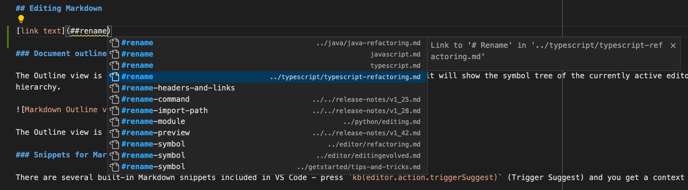
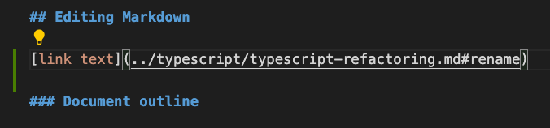
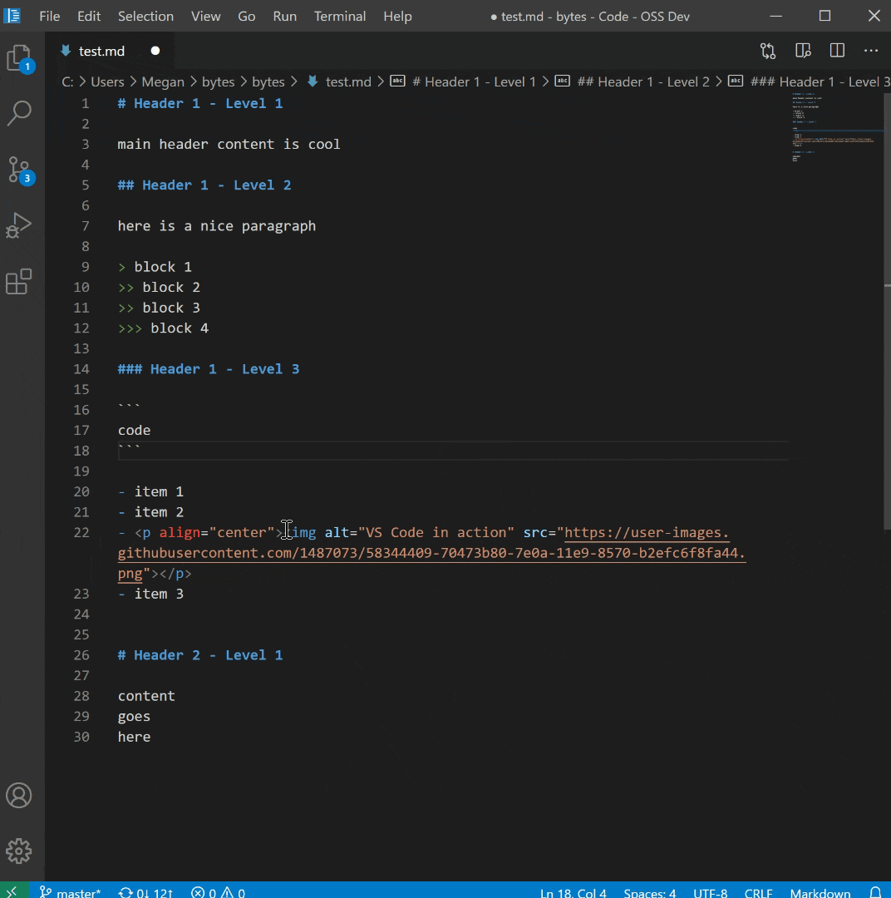
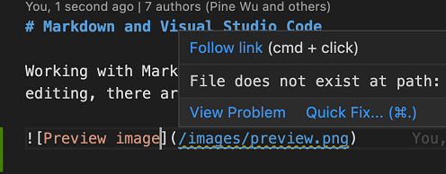

# Markdown과 Visual Studio Code {#markdown-and-visual-studio-code}

Visual Studio Code에서 Markdown 파일을 다루는 것은 간단하고 직관적이며 재미있습니다. VS Code의 기본 편집 기능 외에도 생산성을 높이는 데 도움이 되는 여러 Markdown 전용 기능이 있습니다.

> **참고**: Markdown 파일 편집을 시작하는 데 도움이 되도록 [Doc Writer 프로필 템플릿](/docs/editor/profiles.md#doc-writer-profile-template)을 사용하여 유용한 확장 프로그램(맞춤법 검사기, Markdown 린터)을 설치하고 적절한 설정 값을 구성할 수 있습니다.

## Markdown 편집하기 {#editing-markdown}

### 문서 개요 {#document-outline}

개요 뷰는 파일 탐색기 하단의 별도 섹션입니다. 확장하면 현재 활성화된 편집기의 기호 트리를 보여줍니다. Markdown 파일의 경우 기호 트리는 Markdown 파일의 헤더 계층 구조입니다.


개요 뷰는 문서의 헤더 구조와 개요를 검토하는 데 유용합니다.

### Markdown을 위한 스니펫 {#snippets-for-markdown}

VS Code는 Markdown 작성을 빠르게 할 수 있는 유용한 스니펫을 포함하고 있습니다. 여기에는 코드 블록, 이미지 등을 위한 스니펫이 포함됩니다. 편집 중에 `kb(editor.action.triggerSuggest)` (제안 트리거)를 눌러 제안된 Markdown 스니펫 목록을 확인할 수 있습니다. 명령 팔레트에서 **스니펫 삽입**을 선택하여 전용 스니펫 선택기를 사용할 수도 있습니다.

> **팁:** Markdown을 위한 사용자 정의 스니펫을 추가할 수 있습니다. [사용자 정의 스니펫](/docs/editor/userdefinedsnippets.md)을 확인하여 방법을 알아보세요.

### 파일 내 헤더로 이동 {#go-to-header-in-file}

현재 파일의 헤더로 빠르게 이동하려면 `kb(workbench.action.gotoSymbol)`를 사용하세요.


파일 내 모든 헤더를 탐색하거나 헤더 이름을 입력하여 원하는 헤더를 찾을 수 있습니다. 원하는 헤더를 찾으면 `kbstyle(Enter)`를 눌러 커서를 해당 위치로 이동시킵니다. 헤더로 점프하는 것을 취소하려면 `kbstyle(Esc)`를 누르세요.

### 작업 공간 내 헤더로 이동 {#go-to-header-in-workspace}

현재 작업 공간의 모든 Markdown 파일에서 헤더를 검색하려면 `kb(workbench.action.showAllSymbols)`를 사용하세요.


헤더 이름을 입력하여 목록을 필터링하고 원하는 헤더를 찾을 수 있습니다.

### 경로 완성 {#path-completions}

경로 완성은 파일 및 이미지에 대한 링크를 만드는 데 도움을 줍니다. 이러한 경로는 이미지 또는 링크의 경로를 입력할 때 [IntelliSense](/docs/editor/intellisense.md)에 의해 자동으로 표시되며, `kb(editor.action.triggerSuggest)`를 사용하여 수동으로 요청할 수도 있습니다.


`/`로 시작하는 경로는 현재 작업 공간의 루트를 기준으로 해결되며, `./`로 시작하거나 접두사가 없는 경로는 현재 파일을 기준으로 해결됩니다. `/`를 입력하면 경로 제안이 자동으로 표시되며, `kb(editor.action.triggerSuggest)`를 사용하여 수동으로 호출할 수도 있습니다.

경로 IntelliSense는 현재 파일 내 또는 다른 Markdown 파일 내의 헤더에 링크하는 데도 도움을 줄 수 있습니다. 경로를 `#`로 시작하여 파일 내 모든 헤더에 대한 완성을 확인할 수 있습니다(설정에 따라 이러한 내용을 보려면 `kb(editor.action.triggerSuggest)`를 사용해야 할 수도 있습니다):


경로 IntelliSense는 `"markdown.suggest.paths.enabled": false`로 비활성화할 수 있습니다.

### 다른 파일의 헤더에 링크 만들기 {#creating-links-to-a-header-in-another-file}

다른 Markdown 문서의 헤더에 링크를 만들어야 하지만 전체 파일 경로를 기억하지 못하거나 입력하고 싶지 않으신가요? 작업 공간 헤더 완성을 사용해 보세요! 시작하려면 Markdown 링크에 `##`를 입력하여 현재 작업 공간의 모든 Markdown 헤더 목록을 확인하세요:



이러한 완성 중 하나를 수락하여 해당 헤더에 대한 전체 링크를 삽입할 수 있습니다. 다른 파일에 있는 경우에도 가능합니다:



작업 공간 헤더 완성이 표시되는 조건은 `setting(markdown.suggest.paths.includeWorkspaceHeaderCompletions)` 설정으로 구성할 수 있습니다. 유효한 설정 값은 다음과 같습니다:

- `onDoubleHash` (기본값) — `##`를 입력한 후에만 작업 공간 헤더 완성을 표시합니다.
- `onSingleOrDoubleHash` — `#` 또는 `##`를 입력한 후에 작업 공간 헤더 완성을 표시합니다.
- `never` — 작업 공간 헤더 완성을 절대 표시하지 않습니다.

현재 작업 공간의 모든 헤더를 찾는 것은 비용이 많이 들 수 있으므로, 특히 Markdown 파일이 많은 작업 공간에서는 처음 요청할 때 약간의 지연이 있을 수 있습니다.

### 이미지 및 파일 링크 삽입하기 {#inserting-images-and-links-to-files}

[경로 완성](#path-completions) 외에도 VS Code는 Markdown 문서에 이미지 및 파일 링크를 삽입하는 몇 가지 다른 방법을 지원합니다:

VS Code의 탐색기 또는 운영 체제에서 Markdown 편집기로 파일을 **드래그 앤 드롭**할 수 있습니다. VS Code의 탐색기에서 Markdown 코드 위로 파일을 드래그한 후 `kbstyle(Shift)`를 눌러 파일에 드롭할 수 있습니다. 미리보기 커서는 드롭할 때 삽입될 위치를 보여줍니다.


키보드를 사용하는 것을 선호한다면, 파일이나 이미지 데이터를 Markdown 편집기로 **복사 및 붙여넣기**할 수도 있습니다. 파일, 링크 또는 URL을 붙여넣을 때 Markdown 링크로 삽입하거나 일반 텍스트로 링크를 포함할 수 있습니다.


또는 **Markdown: 작업 공간에서 이미지 삽입** 명령을 사용하여 이미지를 삽입하고, **Markdown: 작업 공간에서 파일 링크 삽입** 명령을 사용하여 파일 링크를 삽입할 수 있습니다.

삽입된 이미지는 Markdown 이미지 구문 ``을 사용합니다. 링크는 일반 Markdown 링크 `[](path/to/file.md)`로 삽입됩니다.

기본적으로 VS Code는 작업 공간 외부에서 드롭되거나 붙여넣기된 이미지를 자동으로 작업 공간으로 복사합니다. `setting(markdown.copyFiles.destination)` 설정은 새 이미지 파일이 생성될 위치를 제어합니다. 이 설정은 현재 Markdown 문서와 일치하는 [globs](/docs/editor/glob-patterns.md)를 이미지 대상에 매핑합니다. 이미지 대상은 일부 간단한 변수를 사용할 수도 있습니다. 사용 가능한 변수에 대한 정보는 `setting(markdown.copyFiles.destination)` 설정 설명을 참조하세요.

예를 들어, 작업 공간의 `/docs` 아래의 모든 Markdown 파일이 현재 파일에 특정한 `images` 디렉토리에 새 미디어 파일을 넣도록 하려면 다음과 같이 작성할 수 있습니다:

```jsonc
"markdown.copyFiles.destination": {
  "/docs/**/*": "images/$\{documentBaseName\}/"
}
```

이제 `/docs/api/readme.md`에 새 파일이 붙여넣어지면 이미지 파일은 `/docs/api/images/readme/image.png`에 생성됩니다.

변수를 변환하는 데 [스니펫](/docs/editor/userdefinedsnippets.md#variable-transforms)과 유사한 방식으로 간단한 정규 표현식을 사용할 수도 있습니다. 예를 들어, 이 변환은 미디어 파일을 생성할 때 문서 파일 이름의 첫 글자만 사용합니다:

```jsonc
"markdown.copyFiles.destination": {
  "/docs/**/*": "images/$\{documentBaseName/(.).*/$1/\}/"
}
```

이제 `/docs/api/readme.md`에 새 파일이 붙여넣어지면 이미지는 `/docs/api/images/r/image.png` 아래에 생성됩니다.

### 스마트 선택 {#smart-selection}

스마트 선택을 사용하면 Markdown 문서에서 선택 영역을 빠르게 확장하고 축소할 수 있습니다. 이를 통해 전체 블록 요소(예: 코드 블록 또는 표)를 빠르게 선택하고 Markdown 파일의 헤더 섹션의 전체 내용을 선택할 수 있습니다.

스마트 선택은 다음 명령을 사용합니다:

- 확장: `kb(editor.action.smartSelect.expand)`
- 축소: `kb(editor.action.smartSelect.shrink)`

선택은 다음에 적용되며 전통적인 계층 구조 패턴을 따릅니다:

- 헤더
- 목록
- 블록 인용
- 차단 코드 블록
- HTML 코드 블록
- 단락



### 링크 검증 {#link-validation}

링크 검증은 Markdown 코드 내의 로컬 링크가 유효한지 확인합니다. 이는 이름이 변경된 헤더나 더 이상 디스크에 존재하지 않는 파일에 링크하는 것과 같은 일반적인 실수를 잡을 수 있습니다.



링크 검증은 기본적으로 비활성화되어 있습니다. 이를 활성화하려면 `"markdown.validate.enabled": true`로 설정하세요. 그러면 VS Code는 헤더, 이미지 및 기타 로컬 파일에 대한 Markdown 링크를 분석합니다. 유효하지 않은 링크는 경고 또는 오류로 보고됩니다. 모든 링크 검증은 로컬에서 이루어지며 외부 http(s) 링크에 대한 검사는 없습니다.

링크 검증을 사용자 정의하는 데 사용할 수 있는 몇 가지 설정이 있습니다:

- `setting(markdown.validate.fileLinks.enabled)` - 로컬 파일에 대한 링크 검증 활성화/비활성화: `[link](/path/to/file.md)`
- `setting(markdown.validate.fragmentLinks.enabled)` - 현재 파일의 헤더에 대한 링크 검증 활성화/비활성화: `[link](#some-header)`
- `setting(markdown.validate.fileLinks.markdownFragmentLinks)` - 다른 Markdown 파일의 헤더에 대한 링크 검증 활성화/비활성화: `[link](other-file.md#some-header)`
- `setting(markdown.validate.referenceLinks.enabled)` - 참조 링크 검증 활성화/비활성화: `[link][ref]`.
- `setting(markdown.validate.ignoredLinks)` - 검증을 건너뛰는 링크 glob 목록. 이는 디스크에 존재하지 않지만 Markdown이 게시되면 존재하는 파일에 링크할 때 유용합니다.

### 헤더 및 링크에 대한 모든 참조 찾기 {#find-all-references-to-headers-and-links}

**모든 참조 찾기** (`kb(references-view.findReferences)`) 명령을 사용하여 현재 작업 공간에서 Markdown 헤더 또는 링크가 참조되는 모든 위치를 찾으세요:


**모든 참조 찾기**는 다음을 지원합니다:

- 헤더: `# My Header`. `#my-header`에 대한 모든 링크를 보여줍니다.
- 외부 링크: `[text](http://example.com)`. `http://example.com`에 대한 모든 링크를 보여줍니다.
- 내부 링크: `[text](./path/to/file.md)`. `./path/to/file.md`에 대한 모든 링크를 보여줍니다.
- 링크의 조각: `[text](./path/to/file.md#my-header)`. `./path/to/file.md`에서 `#my-header`에 대한 모든 링크를 보여줍니다.

### 헤더 및 링크 이름 바꾸기 {#rename-headers-and-links}

Markdown 헤더를 변경할 때 링크가 우연히 끊어지는 것이 지겹나요? 대신 **기호 이름 바꾸기** (`kb(editor.action.rename)`)를 사용해 보세요. 새 헤더 이름을 입력하고 `kbstyle(Enter)`를 누르면 VS Code가 헤더를 업데이트하고 해당 헤더에 대한 모든 링크를 자동으로 업데이트합니다:


다음에서도 `kb(editor.action.rename)`를 사용할 수 있습니다:

- 헤더: `# My Header`. 이는 `#my-header`에 대한 모든 링크를 업데이트합니다.
- 외부 링크: `[text](http://example.com/page)`. 이는 `http://example.com/page`에 링크된 모든 위치를 업데이트합니다.
- 내부 링크: `[text](./path/to/file.md)`. 이는 `./path/to/file.md` 파일의 이름을 바꾸고 모든 링크를 업데이트합니다.
- 링크의 조각: `[text](./path/to/file.md#my-header)`. 이는 `./path/to/file.md`에서 헤더의 이름을 바꾸고 모든 링크를 업데이트합니다.

### 파일 이동 또는 이름 변경 시 자동 링크 업데이트 {#automatic-link-updates-on-file-move-or-rename}

자동 Markdown 링크 업데이트를 사용하면 VS Code가 링크된 파일이 이동되거나 이름이 변경될 때마다 Markdown 링크를 자동으로 업데이트합니다. 이 기능은 `setting(markdown.updateLinksOnFileMove.enabled)` 설정으로 활성화할 수 있습니다. 유효한 설정 값은 다음과 같습니다:

- `never` (기본값) — 링크를 자동으로 업데이트하지 않습니다.
- `prompt` — 링크를 업데이트하기 전에 확인합니다.
- `always` — 확인 없이 링크를 자동으로 업데이트합니다.

자동 링크 업데이트는 Markdown 파일, 이미지 및 디렉토리의 이름 변경을 감지합니다. `setting(markdown.updateLinksOnFileMove.include)`를 사용하여 추가 파일 유형에 대해 활성화할 수 있습니다.

## Markdown 미리보기 {#markdown-preview}

VS Code는 기본적으로 Markdown 파일을 지원합니다. Markdown 텍스트 작성을 시작하고 파일을 `.md` 확장자로 저장한 후, 코드와 Markdown 파일의 미리보기 간에 편집기의 시각화를 전환할 수 있습니다. 물론 기존 Markdown 파일을 열고 작업을 시작할 수도 있습니다. 뷰 간 전환은 편집기에서 `kb(markdown.showPreview)`를 눌러 수행할 수 있습니다. 편집 중인 파일과 나란히 미리보기를(`kb(markdown.showPreviewToSide)`) 볼 수 있으며, 편집할 때 실시간으로 변경 사항이 반영됩니다.

간단한 파일의 예는 다음과 같습니다.


> **팁:** 편집기 탭에서 마우스 오른쪽 버튼을 클릭하고 **미리보기 열기** (`kb(markdown.showPreview)`)를 선택하거나 **명령 팔레트** (`kb(workbench.action.showCommands)`)를 사용하여 **Markdown: 나란히 미리보기 열기** 명령 (`kb(markdown.showPreviewToSide)`)을 실행할 수 있습니다.

### 동적 미리보기 및 미리보기 잠금 {#dynamic-previews-and-preview-locking}

기본적으로 Markdown 미리보기는 현재 활성화된 Markdown 파일을 미리보기로 자동 업데이트합니다:


**Markdown: 미리보기 잠금 전환** 명령을 사용하여 Markdown 미리보기를 현재 Markdown 문서에 잠글 수 있습니다. 잠긴 미리보기는 제목에 **\[Preview]**로 표시됩니다:


> **참고:** **Markdown: 미리보기 잠금 전환** 명령은 Markdown 미리보기가 활성 탭일 때만 사용할 수 있습니다.

### 편집기와 미리보기 동기화 {#editor-and-preview-synchronization}

VS Code는 Markdown 편집기와 미리보기 창을 자동으로 동기화합니다. Markdown 미리보기를 스크롤하면 편집기도 미리보기의 뷰포트에 맞게 스크롤됩니다. Markdown 편집기를 스크롤하면 미리보기가 해당 뷰포트에 맞게 스크롤됩니다:


스크롤 동기화를 비활성화하려면 `setting(markdown.preview.scrollPreviewWithEditor)` 및 `setting(markdown.preview.scrollEditorWithPreview)` [설정](/docs/editor/settings.md)을 사용할 수 있습니다.

편집기에서 현재 선택된 줄은 Markdown 미리보기의 왼쪽 여백에 연한 회색 막대로 표시됩니다:


또한 Markdown 미리보기에서 요소를 더블 클릭하면 해당 파일의 편집기가 자동으로 열리고 클릭한 요소에 가장 가까운 줄로 스크롤됩니다.


### 수학 공식 렌더링 {#math-formula-rendering}

VS Code의 내장 Markdown 미리보기는 [KaTeX](https://katex.org/)를 사용하여 수학 방정식을 렌더링합니다.


인라인 수학 방정식은 단일 달러 기호로 감싸집니다:

```markdown
인라인 수학: $x^2$
```

두 개의 달러 기호로 수학 방정식 블록을 만들 수 있습니다:

```markdown
수학 블록:

$$
\displaystyle
\left( \sum_{k=1}^n a_k b_k \right)^2
\leq
\left( \sum_{k=1}^n a_k^2 \right)
\left( \sum_{k=1}^n b_k^2 \right)
$$
```

Markdown 파일에서 수학 공식을 렌더링하지 않으려면 `"markdown.math.enabled": false`로 설정할 수 있습니다.

## Markdown 미리보기 확장하기 {#extending-the-markdown-preview}

확장 프로그램은 Markdown 미리보기의 모양을 변경하고 새로운 기능을 추가하기 위해 사용자 정의 스타일과 스크립트를 기여할 수 있습니다. 다음은 미리보기를 사용자 정의하는 예제 확장 프로그램 세트입니다:

<div class="marketplace-extensions-markdown-preview-curated"></div>

### 사용자 CSS 사용하기 {#using-your-own-css}

Markdown 미리보기에서 `"markdown.styles": []` [설정](/docs/editor/settings.md)을 사용하여 사용자 CSS를 사용할 수 있습니다. 이는 Markdown 미리보기에서 로드할 스타일 시트의 URL 목록입니다. 이 스타일 시트는 `https` URL이거나 현재 작업 공간의 로컬 파일에 대한 상대 경로일 수 있습니다.

예를 들어, 현재 작업 공간의 루트에 있는 `Style.css`라는 스타일 시트를 로드하려면 **파일** > **환경 설정** > **설정**을 사용하여 작업 공간 `settings.json` 파일을 열고 다음과 같이 업데이트하세요:

```json
// 기본 및 사용자 설정을 덮어쓰려면 이 파일에 설정을 배치하세요.
{
  "markdown.styles": ["Style.css"]
}
```

### 줄 바꿈을 생성하기 위해 후행 공백 유지하기 {#keep-trailing-whitespace-in-order-to-create-line-breaks}

[하드 줄 바꿈](https://spec.commonmark.org/0.29/#hard-line-breaks)을 생성하기 위해 Markdown은 줄 끝에 두 개 이상의 공백이 필요합니다. 사용자 또는 작업 공간 설정에 따라 VS Code는 후행 공백을 제거하도록 구성될 수 있습니다. Markdown 파일에서만 후행 공백을 유지하려면 `settings.json`에 다음 줄을 추가할 수 있습니다:

```json
{
  "[markdown]": {
    "files.trimTrailingWhitespace": false
  }
}
```

## Markdown 미리보기 보안 {#markdown-preview-security}

보안상의 이유로 VS Code는 Markdown 미리보기에서 표시되는 콘텐츠를 제한합니다. 여기에는 스크립트 실행 비활성화 및 `https`를 통해서만 리소스를 로드할 수 있도록 하는 것이 포함됩니다.

Markdown 미리보기가 페이지의 콘텐츠를 차단할 때, 미리보기 창의 오른쪽 상단에 경고 팝업이 표시됩니다:


이 팝업을 클릭하거나 Markdown 파일에서 **Markdown: 미리보기 보안 설정 변경** 명령을 실행하여 Markdown 미리보기에서 허용되는 콘텐츠를 변경할 수 있습니다:


Markdown 미리보기 보안 설정은 작업 공간의 모든 파일에 적용됩니다.

다음은 각 보안 수준에 대한 세부 정보입니다:

### 엄격 {#strict}

기본 설정입니다. 신뢰할 수 있는 콘텐츠만 로드하고 스크립트 실행을 비활성화합니다. `http` 이미지를 차단합니다.

변경할 매우 좋은 이유가 없고 작업 공간의 모든 Markdown 파일을 신뢰하지 않는 한 `엄격` 보안을 유지하는 것이 좋습니다.

### 불안전한 콘텐츠 허용 {#allow-insecure-content}

스크립트를 비활성화하지만 `http`를 통해 콘텐츠를 로드할 수 있도록 허용합니다.

### 비활성화 {#disable}

미리보기 창에서 추가 보안을 비활성화합니다. 이는 스크립트 실행을 허용하고 `http`를 통해 콘텐츠를 로드할 수 있도록 허용합니다.

## Doc Writer 프로필 템플릿 {#doc-writer-profile-template}

[프로필](https://code.visualstudio.com/docs/editor/profiles)을 사용하면 현재 프로젝트나 작업에 따라 확장 프로그램, 설정 및 UI 레이아웃을 빠르게 전환할 수 있습니다. Markdown 편집을 시작하는 데 도움이 되도록 유용한 확장 프로그램과 설정이 포함된 [Doc Writer 프로필 템플릿](/docs/editor/profiles.md#doc-writer-profile-template)을 사용할 수 있습니다. 프로필 템플릿을 그대로 사용하거나 자신의 워크플로우에 맞게 추가로 사용자 정의하는 출발점으로 사용할 수 있습니다.

**프로필** > **프로필 만들기...** 드롭다운을 통해 프로필 템플릿을 선택할 수 있습니다:


프로필 템플릿을 선택하면 설정 및 확장을 검토하고 새 프로필에 포함하고 싶지 않은 항목을 제거할 수 있습니다. 템플릿을 기반으로 새 프로필을 만든 후에는 설정, 확장 또는 UI에 대한 변경 사항이 프로필에 유지됩니다.

## Markdown 확장 프로그램 {#markdown-extensions}

VS Code가 기본적으로 제공하는 기능 외에도 더 많은 기능을 위해 확장 프로그램을 설치할 수 있습니다.

<div class="marketplace-extensions-markdown-curated"></div>

> 팁: 확장 프로그램 타일을 선택하여 설명 및 리뷰를 읽고 어떤 확장 프로그램이 가장 적합한지 결정하세요. [마켓플레이스](https://marketplace.visualstudio.com)에서 더 많은 정보를 확인하세요.

## 다음 단계 {#next-steps}

다음에 대해 알아보세요:

- [CSS, SCSS 및 Less](/docs/languages/css.md) - CSS를 편집하고 싶으신가요? VS Code는 CSS, SCSS 및 Less 편집을 위한 훌륭한 지원을 제공합니다.

## 자주 묻는 질문 {#common-questions}

### 맞춤법 검사 기능이 있나요? {#is-there-spell-checking}

VS Code에 기본적으로 설치되어 있지 않지만 맞춤법 검사 확장 프로그램이 있습니다. 유용한 확장 프로그램을 찾으려면 [VS Code 마켓플레이스](https://marketplace.visualstudio.com/vscode)를 확인하세요.

### VS Code는 GitHub Flavored Markdown을 지원하나요? {#does-vs-code-support-github-flavored-markdown}

아니요, VS Code는 [CommonMark](https://commonmark.org) Markdown 사양을 목표로 하며 [markdown-it](https://github.com/markdown-it/markdown-it) 라이브러리를 사용합니다. GitHub는 CommonMark 사양으로 이동하고 있으며, 이에 대한 내용은 이 [업데이트](https://github.blog/2017-03-14-a-formal-spec-for-github-markdown/)에서 확인할 수 있습니다.