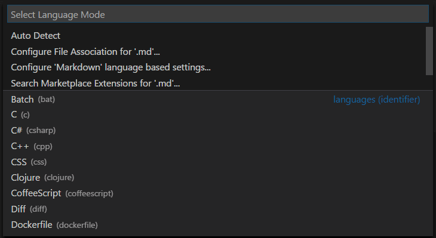

# 프로그래밍 언어 {#programming-languages}

## 수백 개의 프로그래밍 언어 지원 {#hundreds-of-programming-languages-supported}

Visual Studio Code에서는 거의 모든 주요 프로그래밍 언어를 지원합니다. JavaScript, TypeScript, CSS 및 HTML과 같은 여러 언어가 기본으로 제공되지만, 더 풍부한 언어 확장 프로그램은 [VS Code Marketplace](https://marketplace.visualstudio.com/vscode/Languages)에서 찾을 수 있습니다.

가장 인기 있는 언어 확장 프로그램 8가지는 다음과 같습니다:

<div class="marketplace-extensions-languages-curated"></div>

원하는 프로그래밍 언어에 대한 스니펫, 코드 완성/IntelliSense 제공자, 린터, 디버거 등을 찾으려면 [Marketplace](https://marketplace.visualstudio.com/vscode)로 이동하거나 통합된 [Extensions view](/docs/editor/extension-marketplace.md)를 사용하여 검색하세요.

:::note
VS Code의 표시 언어를 변경하려면 (예: 중국어로) [표시 언어](/docs/editor/locales.md) 주제를 참조하세요.
:::

## 언어별 문서 {#language-specific-documentation}

VS Code에서 지원하는 프로그래밍 언어에 대해 알아보세요. 여기에는 다음이 포함됩니다:

- [C++](/docs/languages/cpp.md)
- [C#](/docs/languages/csharp.md)
- [CSS](/docs/languages/css.md)
- [Dart](https://dart.dev/tools/vs-code)
- [Dockerfile](/docs/azure/docker.md)
- [F#](/docs/languages/dotnet.md#create-an-f-hello-world-app)
- [Go](/docs/languages/go.md)
- [HTML](/docs/languages/html.md)
- [Java](/docs/languages/java.md)
- [JavaScript](/docs/languages/javascript.md)
- [JSON](/docs/languages/json.md)
- [Julia](/docs/languages/julia.md)
- [Less](/docs/languages/css.md)
- [Markdown](/docs/languages/markdown.md)
- [PHP](/docs/languages/php.md)
- [PowerShell](/docs/languages/powershell.md)
- [Python](/docs/languages/python.md)
- [R](/docs/languages/r.md)
- [Ruby](/docs/languages/ruby.md)
- [Rust](/docs/languages/rust.md)
- [SCSS](/docs/languages/css.md)
- [T-SQL](/docs/languages/tsql.md)
- [TypeScript](/docs/languages/typescript.md).

링크된 항목을 클릭하면 각 프로그래밍 언어에서 VS Code를 활용하는 방법을 한눈에 볼 수 있습니다. 또한, 대부분의 언어 확장 프로그램은 README에 핵심 기능을 요약해 제공합니다.

## VS Code의 언어 기능 {#language-features-in-vs-code}

지원의 풍부함은 다양한 언어와 그 확장 프로그램에 따라 다릅니다:

- 구문 강조 및 괄호 일치
- 스마트 완성 (IntelliSense, [GitHub Copilot](/docs/editor/github-copilot.md)와 함께하는 인공지능)
- 린팅 및 수정
- 코드 탐색 (정의로 이동, 모든 참조 찾기)
- 디버깅
- 리팩토링

## AI로 완성도 향상시키기 {#enhance-completions-with-ai}

VS Code에서는 인공지능(AI)을 활용하여 코드 작성 경험을 더욱 향상할 수 있습니다.
AI는 코드 한 줄 또는 전체 함수에 대한 제안, 빠른 문서 작성, 테스트 코드 생성 등 다양한 코드 작업을 지원합니다.
[GitHub Copilot](https://copilot.github.com/)은 코드를 더 빠르고 스마트하게 작성할 수 있도록 도와주는 AI 기반 코드 완성 도구입니다. VS Code에서 [GitHub Copilot 확장 프로그램](https://marketplace.visualstudio.com/items?itemName=GitHub.copilot)을 사용하여 코드를 생성하거나 생성된 코드에서 배우는 데 활용할 수 있습니다.

[](https://marketplace.visualstudio.com/items?itemName=GitHub.copilot)

Copilot을 시작하는 방법에 대한 자세한 내용은 [Copilot 문서](/docs/editor/github-copilot.md)를 참조하세요.

## 선택한 파일의 언어 변경 {#change-the-language-for-the-selected-file}

VS Code에서는 파일의 파일 이름 확장 프로그램자에 따라 기본적으로 언어 지원을 설정합니다. 그러나 때때로 언어 모드를 변경하고 싶을 수 있습니다. 이를 위해 상태 표시줄 오른쪽에 있는 언어 표시기를 클릭하세요. 그러면 현재 파일에 대한 다른 언어를 선택할 수 있는 **Select Language Mode** 드롭다운이 표시됩니다.


:::tip
**Change Language Mode** 명령(`kb(workbench.action.editor.changeLanguageMode)`)을 실행하여 동일한 드롭다운을 얻을 수 있습니다.
:::

## 언어 식별자 {#language-identifier}

VS Code는 특정 언어 식별자와 언어 모드를 연결하여 현재 언어 모드에 따라 다양한 VS Code 기능을 활성화할 수 있도록 합니다.

항상 그런 건 아니지만, 언어 식별자는, 소문자로 된 프로그래밍 언어 이름입니다. 정확한 식별자 일치를 위해 대소문자가 중요합니다 ('Markdown' != 'markdown'). 알 수 없는 언어 파일은 언어 식별자 `plaintext`를 가집니다.

현재 설치된 언어와 그 식별자의 목록은 **Change Language Mode** (`kb(workbench.action.editor.changeLanguageMode)`) 드롭다운에서 확인할 수 있습니다.



알려진 식별자의 목록은 [언어 식별자 참조](/docs/languages/identifiers.md)에서 확인할 수 있습니다.

## 언어에 파일 확장자 추가 {#add-a-file-extension-to-a-language}

기존 언어에 새로운 파일 확장자를 추가하려면 `setting(files.associations)` [설정](/docs/editor/settings.md)을 사용할 수 있습니다.

예를 들어, 아래 설정은 `.myphp` 파일 확장 프로그램자를 `php` 언어 식별자에 추가합니다:

```json
    "files.associations": {
        "*.myphp": "php"
    }
```

IntelliSense (`kb(editor.action.triggerSuggest)`)는 사용 가능한 언어 식별자를 보여줍니다.


## 다음 단계 {#next-steps}

이제 VS Code가 당신이 관심 있는 언어를 지원한다는 것을 알게 되었습니다. 계속 읽어보세요.

- [코드 탐색](/docs/editor/editingevolved.md) - Peek 및 정의로 이동 등
- [디버깅](/docs/editor/debugging.md) - VS Code가 정말 빛나는 곳입니다.

## 자주 묻는 질문 {#common-questions}

### 내가 직접 언어 서비스를 기여할 수 있나요? {#can-i-contribute-my-own-language-service}

네, 가능합니다! [VS Code 확장 프로그램 API](/api) 문서에서 [예제 언어 서버](/api/language-extensions/language-server-extension-guide.md)를 확인하세요.

### 전체 언어 서비스를 만들고 싶지 않은데, 기존 TextMate 번들을 재사용할 수 있나요? {#what-if-i-dont-want-to-create-a-full-language-service-can-i-reuse-existing-textmate-bundles}

네, TextMate 색상 변환기를 통해 좋아하는 언어에 대한 지원을 추가할 수 있습니다. Extension API 섹션의 [구문 강조 가이드](/api/language-extensions/syntax-highlight-guide.md)를 참조하여 TextMate `.tmLanguage` 구문 파일을 VS Code에 통합하는 방법을 알아보세요.

### 추가 파일 확장 프로그램자를 언어에 매핑할 수 있나요? {#can-i-map-additional-file-extensions-to-a-language}

네, `setting(files.associations)` [설정](/docs/editor/settings.md)을 사용하여 파일 확장 프로그램자를 기존 언어에 전역적으로 또는 작업 공간별로 매핑할 수 있습니다.

다음은 PHP 언어에 더 많은 파일 확장 프로그램자를 연결하는 예입니다:

```json
"files.associations": {
    "*.php4": "php",
    "*.php5": "php"
}
```

필요한 경우 언어에 전체 파일 경로를 구성할 수도 있습니다. 다음 예는 `somefolder` 폴더의 모든 파일을 PHP에 연결합니다:

```json
"files.associations": {
    "**/somefolder/*.*": "php"
}
```

패턴은 [글로브 패턴](/docs/editor/glob-patterns.md)으로, 파일에 `/`가 포함된 경우 전체 경로에서 일치하고, 그렇지 않으면 파일 이름에서 일치합니다.

### 새 파일의 기본 언어를 어떻게 설정하나요? {#how-do-i-set-the-default-language-for-new-files}

`setting(files.defaultLanguage)` [설정](/docs/editor/settings.md)을 사용하여 모든 새 파일을 기본 언어에 매핑할 수 있습니다. 새 빈 파일이 열릴 때마다 편집기는 해당 언어 모드로 구성됩니다.

다음 예는 새 파일을 HTML 언어에 연결합니다:

```json
  // 새 파일에 할당되는 기본 언어 모드입니다.
  "files.defaultLanguage": "html"
```
