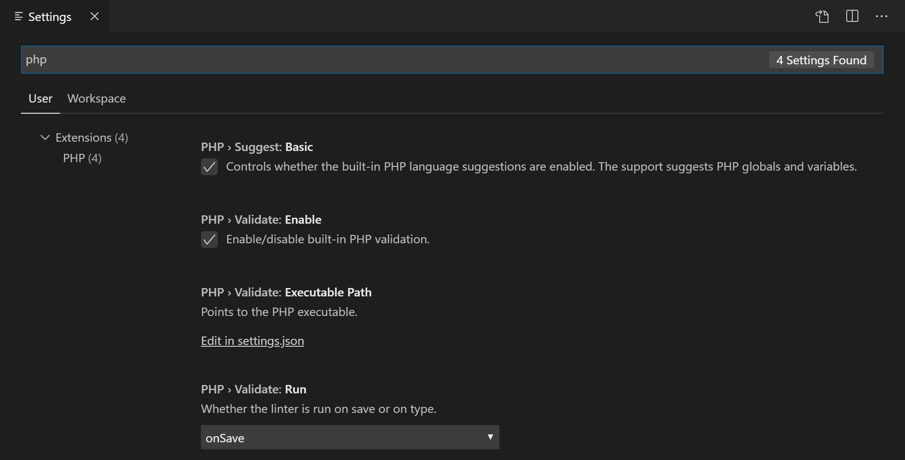

# Visual Studio Code에서의 PHP {#php-in-visual-studio-code}

Visual Studio Code는 PHP 개발에 적합한 훌륭한 편집기입니다. 기본적으로 구문 강조, 괄호 일치, IntelliSense(코드 완성), 코드 조각과 같은 기능을 제공하며, 커뮤니티에서 만든 VS Code [확장](/docs/editor/extension-marketplace.md)을 통해 더 많은 기능을 추가할 수 있습니다.

## 린팅 {#linting}

VS Code는 PHP 언어 진단을 위해 공식 PHP 린터(`php -l`)를 사용합니다. 이를 통해 VS Code는 PHP 린터의 개선 사항을 최신 상태로 유지할 수 있습니다.

> 팁: XAMPP를 사용하고 있나요? 개발 라이브러리를 얻기 위해 PHP의 전체 버전을 설치하세요.

PHP 린터를 제어하는 세 가지 [설정](/docs/editor/settings.md)이 있습니다:

* `setting(php.validate.enable)`: PHP 린팅을 활성화할지 여부를 제어합니다. 기본적으로 활성화되어 있습니다.
* `setting(php.validate.executablePath)`: 디스크의 PHP 실행 파일을 가리킵니다. PHP 실행 파일이 시스템 경로에 없으면 이 값을 설정하세요.
* `setting(php.validate.run)`: 저장 시(값: `"onSave"`) 또는 입력 시(값: `"onType"`) 유효성 검사가 트리거되는지 제어합니다. 기본값은 저장 시입니다.

PHP 설정을 변경하려면 **사용자 또는 작업 공간 설정**(`kb(workbench.action.openSettings)`)을 열고 'php'를 입력하여 사용 가능한 설정 목록을 필터링하세요.



PHP 실행 파일 경로를 설정하려면 **PHP > Validate: Executable Path** 아래의 **settings.json에서 편집** 링크를 선택하세요. 그러면 사용자 `settings.json` 파일이 열립니다. PHP 설치 경로와 함께 `setting(php.validate.executablePath)` 설정을 추가하세요:

### Windows {#windows}

```json
{
    "php.validate.executablePath": "c:/php/php.exe"
}
```

### Linux 및 macOS {#linux-and-macos}

```json
{
    "php.validate.executablePath": "/usr/bin/php"
}

또는

{
    "php.validate.executablePath": "/usr/local/bin/php"
}
```

## 코드 조각 {#snippets}

Visual Studio Code는 PHP를 위한 일반적인 코드 조각 세트를 포함하고 있습니다. 이를 사용하려면 `kb(editor.action.triggerSuggest)`를 눌러 컨텍스트에 맞는 목록을 가져오세요.


## PHP 확장 {#php-extensions}

[VS Code 마켓플레이스](https://marketplace.visualstudio.com/VSCode)에는 많은 PHP 언어 확장이 있으며, 더 많은 확장이 생성되고 있습니다. VS Code 내에서 **확장** 뷰(`kb(workbench.view.extensions)`)를 통해 PHP 확장을 검색한 다음, 'php'를 입력하여 확장 드롭다운 목록을 필터링할 수 있습니다.


### 내장 PHP 지원 비활성화 {#disable-built-in-php-support}

설치된 PHP 확장에서 제안된 내용을 우선시하기 위해 내장 PHP 스마트 완성을 비활성화하려면 **PHP > Suggest: Basic**의 체크를 해제하세요. 이는 `settings.json` 파일에서 `setting(php.suggest.basic)`을 false로 설정합니다.

## 디버깅 {#debugging}

**XDebug**를 통한 PHP 디버깅은 [PHP Debug 확장](https://marketplace.visualstudio.com/items?itemName=xdebug.php-debug)을 통해 지원됩니다. VS Code와 함께 작동하도록 **XDebug**를 구성하는 방법에 대한 확장 지침을 따르세요.

## 다음 단계 {#next-steps}

다음에 대해 알아보세요:

* [확장 마켓플레이스](/docs/editor/extension-marketplace.md) - 다른 사람들이 공유한 확장을 탐색하세요.
* [디버깅](/docs/editor/debugging.md) - VS Code 디버깅에 대해 더 알아보세요.
---