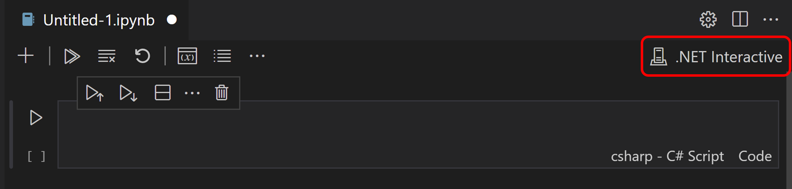
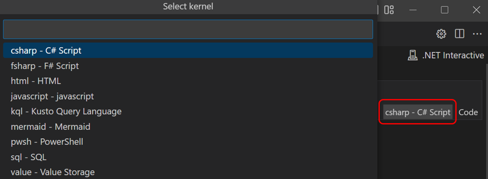
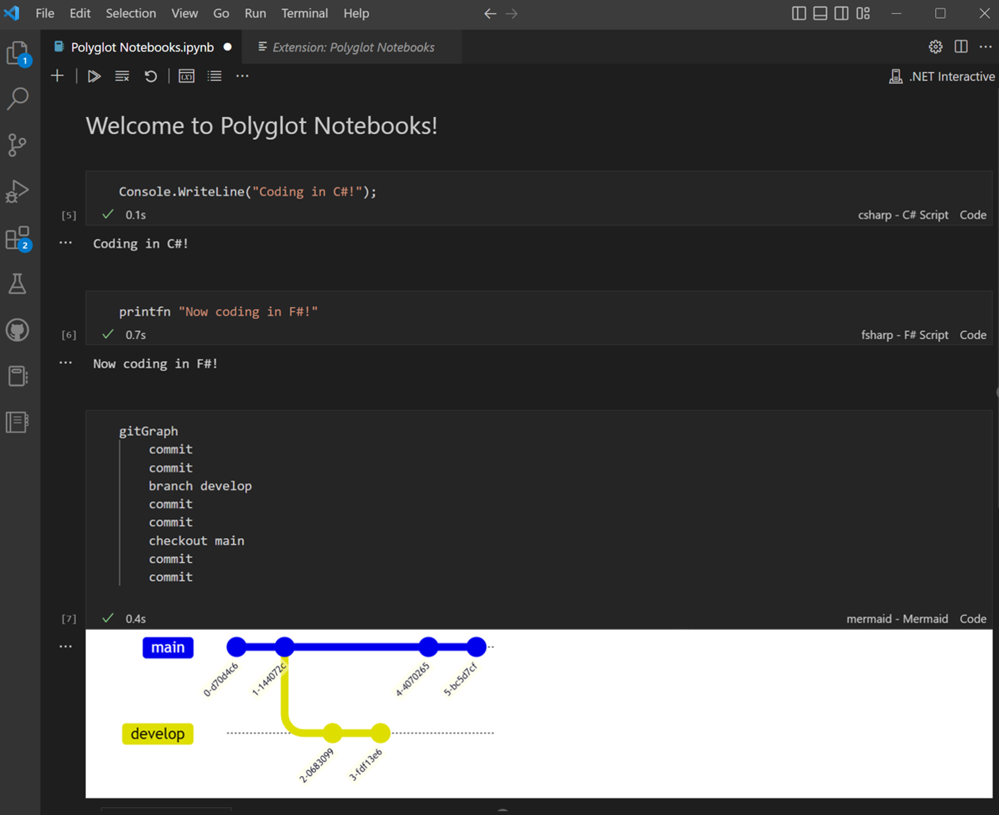
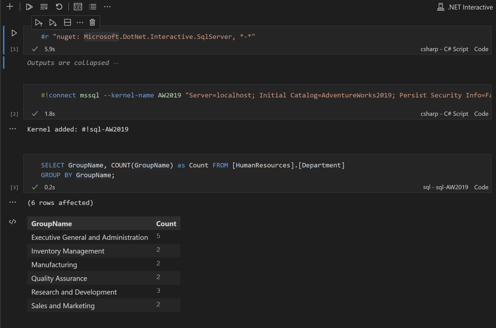

# VS Code의 다국어 노트북 {#polyglot-notebooks-in-vs-code}

**다국어 프로그래밍이란 무엇인가요?**

다국어 프로그래밍은 여러 프로그래밍 언어를 사용하여 각 언어의 강점을 다양한 작업에 활용하는 방법입니다.

**노트북이란 무엇인가요?**

노트북은 실행 가능한 코드, 시각화, 방정식 및 서술 텍스트를 혼합할 수 있는 인터랙티브 파일입니다. 노트북은 코드 셀로 구성되어 있어 코드를 빠르게 반복할 수 있습니다. 오픈 소스 프로젝트 [Jupyter](https://jupyter.org/)에 의해 대중화되었으며, [Python 데이터 과학](/docs/datascience/overview.md)에서 사실상 표준 도구가 되었고, 새로운 프로그래밍 언어를 가르치거나 배우고 빠른 프로토타입을 만드는 데 훌륭한 자원입니다.

## 다국어 노트북 {#polyglot-notebooks}

다국어 프로그래밍과 노트북이 만나면 다국어 노트북이 탄생합니다! 전통적으로 Python과 함께 사용되는 노트북과는 달리, [다국어 노트북](https://marketplace.visualstudio.com/items?itemName=ms-dotnettools.dotnet-interactive-vscode) 확장 기능은 Visual Studio Code에서 동일한 노트북 내에서 여러 프로그래밍 언어를 네이티브로 사용할 수 있게 해줍니다! 이제 좋아하는 언어로 작업하기 위해 래퍼 라이브러리나 마법 명령이 필요하지 않습니다!

### 지원되는 언어 {#languages-supported}

- C#
- F#
- PowerShell
- JavaScript
- HTML
- Mermaid
- SQL
- KQL (Kusto Query Language)

## 기능 {#features}

위의 언어에 대한 코드를 실행하는 것 외에도 다음과 같은 기능을 활용할 수 있습니다:

- **Microsoft SQL Server 데이터베이스 및 Kusto 클러스터에 연결하고 쿼리하기**.

- **각 언어에 대한 IntelliSense, 자동 완성 및 구문 강조**와 같은 **언어 서버 지원**.

- **노트북 내에서 지속적인 워크플로우우를 보장하는 언어 간의 **변수 공유**. (HTML 및 Mermaid에 대한 변수 공유는 제공되지 않음)

- **변수 상태 및 해당 변수가 존재하는 서브커널을 확인할 수 있는 **변수 탐색기**.

- **Jupyter/JupyterLab 간의 완전한 이식성**.

모든 기능에 대해 알아보려면 VS Code Marketplace의 [다국어 노트북](https://marketplace.visualstudio.com/items?itemName=ms-dotnettools.dotnet-interactive-vscode) 확장을 방문하세요.

## 필수 조건 {#prerequisites}

VS Code에서 다국어 노트북을 사용하려면 다음이 필요합니다:

- [다국어 노트북](https://marketplace.visualstudio.com/items?itemName=ms-dotnettools.dotnet-interactive-vscode) 확장
- [.NET 7 SDK](https://dotnet.microsoft.com/en-us/download/dotnet/7.0)

### .NET SDK가 필요한 이유는 무엇인가요? {#why-do-i-need-the-net-sdk}

다국어 노트북 확장은 여러 언어를 실행하고 변수 간에 공유할 수 있는 .NET 기술 기반의 최첨단 혁신 엔진인 .NET Interactive에 의해 구동됩니다. 다국어 노트북에서 이 엔진은 노트북의 커널처럼 작동하며, 이 때문에 .NET 7 SDK가 필요합니다.

## 시작하기 {#getting-started}

1. 첫 번째 다국어 노트북을 만들려면 명령 팔레트(`kb(workbench.action.showCommands)`)를 열고 **다국어 노트북: 새 빈 노트북 만들기**를 선택한 후, `.ipynb`를 선택하고 시작할 언어를 선택하세요.

   새 파일을 만들고 확장자를 `.ipynb`로 지정하여 노트북을 만들 수도 있습니다. 이 경우, 오른쪽 상단에서 **.NET Interactive**가 노트북의 커널로 선택되어 있는지 확인하세요.

   

2. 기본적으로 추가된 셀은 위의 셀과 동일한 언어가 됩니다. 언어를 변경하려면 셀의 오른쪽 하단에 있는 언어 선택기를 선택하세요.

   

3. 코딩을 시작하세요!

   

## 데이터 작업하기 {#working-with-data}

Microsoft SQL Server 데이터베이스 및 Kusto 클러스터에 연결하고 쿼리하세요.

데이터 소스에 연결하고 작업하는 방법에 대한 자세한 지침은 [데이터 작업하기](https://github.com/dotnet/interactive/blob/main/docs/working-with-data.md) 문서를 방문하세요.

## 언어 서버 지원 {#language-server-support}

다국어 노트북의 각 언어는 자동 완성, 구문 강조 및 서명 도움말과 같은 언어 서버 지원을 통해 일류 편집 경험을 제공합니다.

## 변수 공유 및 변수 탐색기 {#variable-sharing-and-variable-explorer}

`#!set` 명령을 사용하여 언어 간에 변수를 공유하고 변수 탐색기를 사용하여 각 언어의 변수 값을 확인하세요. 이전에 `#!share` 명령을 사용하고 있었다면 계속 작동합니다. 전역 도구 모음에서 **변수** 아이콘을 선택하여 변수 탐색기를 엽니다.

<video src="images/polyglot/SQLJavaScript.mp4" placeholder="images/polyglot/SQLJavaScript.mp4" autoplay loop controls muted title="SQL과 JavaScript 간에 변수를 공유하는 사용자 비디오">
    죄송합니다. 귀하의 브라우저는 HTML 5 비디오를 지원하지 않습니다.
</video>

변수 공유에 대해 더 알아보려면 [변수 공유](https://github.com/dotnet/interactive/blob/main/docs/variable-sharing.md) 문서를 방문하세요.

## 기능 요청 및 피드백 {#feature-requests-and-feedback}

다국어 노트북 확장은 .NET Interactive에 의해 구동되며, [.NET Interactive GitHub 리포지토리](https://github.com/dotnet/interactive/issues)에서 피드백을 제공하고 문제를 제출할 수 있습니다.