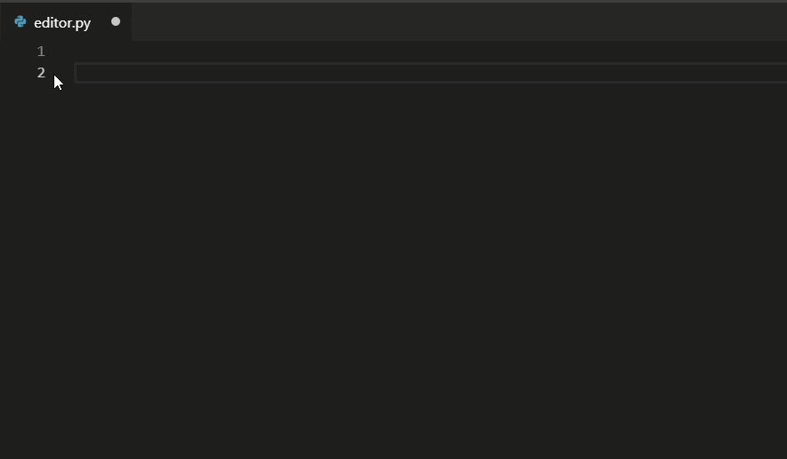
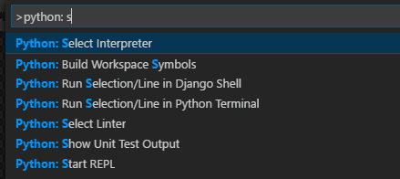
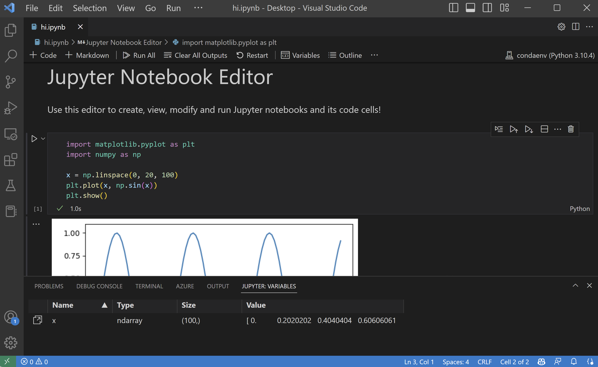

# Visual Studio Code에서의 Python {#python-in-visual-studio-code}

Visual Studio Code에서 [Microsoft Python 확장](https://marketplace.visualstudio.com/items?itemName=ms-python.python)을 사용하여 Python 작업을 하는 것은 간단하고 재미있으며 생산적입니다. 이 확장은 VS Code를 훌륭한 Python 편집기로 만들어 주며, 다양한 Python 인터프리터와 함께 모든 운영 체제에서 작동합니다. VS Code의 모든 기능을 활용하여 자동 완성 및 IntelliSense, 린팅, 디버깅, 단위 테스트를 제공하며, 가상 환경 및 conda 환경을 포함한 Python 환경 간에 쉽게 전환할 수 있는 기능을 제공합니다.

이 문서는 VS Code용 Python 확장의 다양한 기능에 대한 개요만 제공합니다. 코드 편집, 실행 및 디버깅에 대한 자세한 내용은 아래 버튼을 사용하세요.

<a class="next-topic-btn" href="/docs/python/python-tutorial">Python 튜토리얼</a>

## Python 및 Python 확장 설치 {#install-python-and-the-python-extension}

[튜토리얼](/docs/python/python-tutorial.md)은 Python 설치 및 확장 사용 방법을 안내합니다. 확장에서 Python 인터프리터를 별도로 설치해야 합니다. 빠른 설치를 위해 [python.org에서 Python을 다운로드](https://www.python.org/downloads/)하고 [VS Code Marketplace에서 확장을 설치](https://marketplace.visualstudio.com/items?itemName=ms-python.python)하세요.

> **참고**: Python 개발을 시작하는 데 도움이 되는 [Python 프로필 템플릿](/docs/editor/profiles.md#python-profile-template)을 사용할 수 있으며, 유용한 확장, 설정 및 Python 코드 스니펫이 포함되어 있습니다.

Python 버전을 설치한 후, **Python: Select Interpreter** 명령을 사용하여 선택합니다. VS Code가 찾고 있는 인터프리터를 자동으로 찾지 못하는 경우, [환경 - 인터프리터 수동 지정](/docs/python/environments.md#manually-specify-an-interpreter)을 참조하세요.

설정을 통해 Python 확장을 구성할 수 있습니다. 자세한 내용은 [Python 설정 참조](/docs/python/settings-reference.md)를 확인하세요.

> **Windows Subsystem for Linux**: Windows를 사용하는 경우, WSL은 Python 개발을 위한 훌륭한 방법입니다. Windows에서 Linux 배포판을 실행할 수 있으며, Python이 이미 설치되어 있는 경우가 많습니다. [WSL](https://marketplace.visualstudio.com/items?itemName=ms-vscode-remote.remote-wsl) 확장과 함께 사용하면 WSL의 컨텍스트에서 전체 VS Code 편집 및 디버깅 지원을 받을 수 있습니다. 자세한 내용은 [WSL에서 개발하기](/docs/remote/wsl.md) 또는 [WSL에서 작업하기](/docs/remote/wsl-tutorial.md) 튜토리얼을 참조하세요.

## Python 코드 실행 {#run-python-code}

Python을 경험하기 위해, `hello.py`라는 이름의 파일을 생성하고 다음 코드를 붙여넣으세요:

```python
print("Hello World")
```

Python 확장은 현재 선택된 인터프리터를 사용하여 Python 코드를 실행하는 단축키를 제공합니다 (**Command Palette에서 Python: Select Interpreter**). 활성 Python 파일을 실행하려면, 편집기 오른쪽 상단에 있는 **Run Python File** 재생 버튼을 클릭하세요.


개별 줄이나 코드 선택을 실행하려면 **Python: Run Selection/Line in Python Terminal** 명령을 사용할 수 있습니다 (`kbstyle(Shift+Enter)`). 선택이 없으면 Smart Send는 커서가 위치한 줄 주위의 가장 작은 실행 가능한 코드 블록을 Python 터미널로 전송합니다 (`kbstyle(Shift+Enter)`). 편집기에서 선택한 항목에 대한 컨텍스트 메뉴에서도 동일한 **Run Python > Run Selection/Line in Python Terminal** 명령을 사용할 수 있습니다. 선택하거나 줄을 터미널/REPL에서 실행할 때마다 동일한 터미널이 사용되며, 해당 터미널이 닫힐 때까지 유지됩니다. **Run Python File in Terminal**에도 동일한 터미널이 사용됩니다. 해당 터미널이 여전히 REPL을 실행 중이라면, REPL을 종료(`exit()`)하거나 Python 파일을 실행하기 전에 다른 터미널로 전환해야 합니다.

Python 확장은 선택의 첫 번째 비어 있지 않은 줄을 기준으로 들여쓰기를 자동으로 제거하며, 필요에 따라 다른 모든 줄을 왼쪽으로 이동시킵니다.

필요한 경우 명령은 Python 터미널을 열며, 현재 선택된 인터프리터로 활성화된 터미널을 사용하여 Python REPL을 실행하는 **Python: Start Terminal REPL** 명령을 통해 직접 인터랙티브 REPL 환경을 열 수도 있습니다.

더 구체적인 안내와 코드를 실행하는 다른 방법에 대해서는 [코드 실행 튜토리얼](/docs/python/python-tutorial.md)을 참조하세요.

## 자동 완성과 IntelliSense {#autocomplete-and-intellisense}

Python 확장은 현재 선택된 인터프리터를 사용하여 코드 완성과 IntelliSense를 지원합니다. [IntelliSense](/docs/editor/intellisense.md)는 모든 파일과 내장 및 서드파티 모듈에 대한 지능형 코드 완성(문맥 내 메서드 및 변수 제안)을 포함한 여러 기능을 위한 일반 용어입니다.

IntelliSense는 입력하는 동안 메서드, 클래스 멤버 및 문서를 빠르게 보여줍니다. `kb(editor.action.triggerSuggest)`를 사용하여 언제든지 완성을 트리거할 수 있습니다. 식별자 위에 마우스를 올리면 더 많은 정보를 볼 수 있습니다.



## AI로 완성 향상하기 {#enhance-completions-with-ai}

[GitHub Copilot](https://copilot.github.com/)은 코드를 더 빠르고 스마트하게 작성할 수 있도록 도와주는 AI 기반 코드 완성 도구입니다. VS Code에서 [GitHub Copilot 확장](https://marketplace.visualstudio.com/items?itemName=GitHub.copilot)을 사용하여 코드를 생성하거나 생성된 코드에서 학습할 수 있습니다.

[](https://marketplace.visualstudio.com/items?itemName=GitHub.copilot)

GitHub Copilot은 Python을 넘어 다양한 언어와 JavaScript, TypeScript, Ruby, Go, C#, C++와 같은 다양한 프레임워크에 대한 제안을 제공합니다.

Copilot을 시작하는 방법에 대한 자세한 내용은 [Copilot 문서](/docs/editor/github-copilot.md)를 참조하세요.

## 린팅 {#linting}

린팅은 잠재적인 오류에 대해 Python 코드를 분석하여 다양한 문제를 쉽게 탐색하고 수정할 수 있도록 합니다.

Python 확장은 Pylint, pycodestyle, Flake8, mypy, pydocstyle, prospector 및 pylama와 같은 여러 린터를 적용할 수 있습니다. 자세한 내용은 [린팅](/docs/python/linting.md)을 참조하세요.

<video autoplay loop muted playsinline controls title="Python 린팅 비디오">
  <source src="/docs/languages/python/python-linting.mp4" type="video/mp4" />
</video>

## 디버깅 {#debugging}

더 이상 `print` 문 디버깅은 필요 없습니다! VS Code는 [Python Debugger 확장](https://marketplace.visualstudio.com/items?itemName=ms-python.debugpy)을 통해 Python에 대한 훌륭한 디버깅 지원을 제공하며, 중단점을 설정하고 변수를 검사하며 디버그 콘솔을 사용하여 프로그램이 단계별로 실행되는 방식을 깊이 있게 살펴볼 수 있습니다. 다중 스레드, 웹 및 원격 애플리케이션을 포함한 다양한 유형의 Python 애플리케이션을 디버깅할 수 있습니다.

Python에서 디버깅에 대한 더 구체적인 정보, `launch.json` 설정 구성 및 원격 디버깅 구현에 대한 내용은 [디버깅](/docs/python/debugging.md)을 참조하세요. 일반 VS Code 디버깅 정보는 [디버깅 문서](/docs/editor/debugging.md)에서 확인할 수 있습니다.

또한, [Django](/docs/python/tutorial-django.md) 및 [Flask](/docs/python/tutorial-flask.md) 튜토리얼은 웹 애플리케이션의 컨텍스트에서 디버깅을 구현하는 방법에 대한 예제를 제공합니다. Django 템플릿 디버깅도 포함되어 있습니다.

<video autoplay loop muted playsinline controls title="Python 디버깅 비디오">
  <source src="/docs/languages/python/python-debugging.mp4" type="video/mp4" />
</video>

## 환경 {#environments}

Python 확장은 표준 위치에 설치된 Python 인터프리터를 자동으로 감지합니다. 또한 작업 공간 폴더에서 conda 환경 및 가상 환경도 감지합니다. [Python 환경 구성](/docs/python/environments.md)을 참조하세요.

현재 환경은 VS Code 상태 표시줄의 오른쪽에 표시됩니다:


상태 표시줄은 선택된 인터프리터가 없음을 나타내기도 합니다:


선택된 환경은 IntelliSense, 자동 완성, 린팅, 포맷팅 및 기타 언어 관련 기능에 사용됩니다. Python을 터미널에서 실행하거나 디버깅할 때, 또는 **Terminal: Create New Terminal** 명령으로 새 터미널을 생성할 때 활성화됩니다.

현재 인터프리터를 변경하려면, 상태 표시줄에서 인터프리터 이름을 선택하거나 **Python: Select Interpreter** 명령을 사용하세요.



VS Code는 감지된 환경 목록과 사용자 설정에 수동으로 추가한 환경 목록을 표시합니다 (자세한 내용은 [Python 환경 구성](/docs/python/environments.md)을 참조하세요).

## Jupyter 노트북 {#jupyter-notebooks}

VS Code에서 [Jupyter 노트북](https://jupyter.org/) 파일(`.ipynb`)에 대한 Python 지원을 활성화하려면, [Jupyter 확장](https://marketplace.visualstudio.com/items?itemName=ms-toolsai.jupyter)을 설치할 수 있습니다. Python 및 Jupyter 확장은 함께 작동하여 VS Code에서 훌륭한 노트북 경험을 제공하며, IntelliSense 지원을 통해 코드 셀을 직접 보고 수정할 수 있으며, 이를 실행하고 디버깅할 수 있습니다.



또한 **Jupyter: Export to Python Script** 명령을 통해 노트북을 Python 코드 파일로 변환하고 열 수 있습니다. 노트북의 셀은 Python 파일에서 `#%%` 주석으로 구분되며, Jupyter 확장은 **Run Cell** 또는 **Run Below** CodeLens를 표시합니다. CodeLens 중 하나를 선택하면 Jupyter 서버가 시작되고 Python 인터랙티브 창에서 셀을 실행합니다:


원격 Jupyter 서버에 연결하여 노트북을 실행할 수도 있습니다. 자세한 내용은 [Jupyter 지원](/docs/datascience/jupyter-notebooks.md)을 참조하세요.

## 테스트 {#testing}

Python 확장은 Python의 내장 unittest 프레임워크 및 pytest를 사용하여 [테스트](/docs/python/testing.md)를 지원합니다.

테스트를 실행하려면 프로젝트 설정에서 지원되는 테스트 프레임워크 중 하나를 활성화해야 합니다. 각 프레임워크는 테스트 발견을 위한 경로 및 패턴 식별과 같은 고유한 설정을 가지고 있습니다.

테스트가 발견되면, VS Code는 상태 표시줄, 명령 팔레트 및 기타 위치에서 테스트를 실행하고 디버깅할 수 있는 다양한 명령을 제공합니다. 이러한 명령은 개별 테스트 파일 및 메서드를 실행할 수 있도록 해줍니다.

## 구성 {#configuration}

Python 확장은 다양한 기능을 위한 다양한 설정을 제공합니다. 이러한 설정은 [코드 편집](/docs/python/editing.md), [린팅](/docs/python/linting.md), [디버깅](/docs/python/debugging.md) 및 [테스트](/docs/python/testing.md)와 같은 관련 주제에서 설명됩니다. 전체 목록은 [설정 참조](/docs/python/settings-reference.md)에서 확인할 수 있습니다.

## Python 프로필 템플릿 {#python-profile-template}

[프로필](https://code.visualstudio.com/docs/editor/profiles)은 현재 프로젝트나 작업에 따라 확장, 설정 및 UI 레이아웃을 빠르게 전환할 수 있게 해줍니다. Python 개발을 시작하는 데 도움이 되는 [Python 프로필 템플릿](/docs/editor/profiles.md#python-profile-template)을 사용할 수 있으며, 유용한 확장, 설정 및 스니펫이 포함된 큐레이션된 프로필입니다. 이 프로필 템플릿을 그대로 사용하거나 자신의 워크플로우에 맞게 추가로 사용자화할 수 있는 출발점으로 사용할 수 있습니다.

**Profiles** > **Create Profile...** 드롭다운을 통해 프로필 템플릿을 선택합니다:


프로필 템플릿을 선택하면 설정 및 확장을 검토하고, 새 프로필에 포함하고 싶지 않은 개별 항목을 제거할 수 있습니다. 템플릿을 기반으로 새 프로필을 생성한 후, 설정, 확장 또는 UI에 대한 변경 사항은 프로필에 지속됩니다.

## 기타 인기 Python 확장 {#other-popular-python-extensions}

[Microsoft Python 확장](https://marketplace.visualstudio.com/items?itemName=ms-python.python)은 이 문서에서 설명한 모든 기능을 제공합니다. VS Code에 추가적인 Python 언어 지원을 추가하려면 다른 인기 Python 확장을 설치할 수 있습니다.

1. **Extensions** 뷰를 엽니다 (`kb(workbench.view.extensions)`).
1. 'python'을 입력하여 확장 목록을 필터링합니다.

<div class="marketplace-extensions-python"></div>

위에 표시된 확장은 동적으로 쿼리됩니다. 위의 확장 타일을 클릭하여 설명 및 리뷰를 읽고 어떤 확장이 가장 적합한지 결정하세요. [Marketplace](https://marketplace.visualstudio.com/vscode)에서 더 많은 정보를 확인하세요.

## 다음 단계 {#next-steps}

- [Python Hello World 튜토리얼](/docs/python/python-tutorial.md) - VS Code에서 Python을 시작하세요.
- [Python 편집](/docs/python/editing.md) - Python에 대한 자동 완성, 포맷팅 및 리팩토링에 대해 알아보세요.
- [기본 편집](/docs/editor/codebasics.md) - 강력한 VS Code 편집기에 대해 알아보세요.
- [코드 탐색](/docs/editor/editingevolved.md) - 소스 코드를 빠르게 탐색하세요.
- [Django 튜토리얼](/docs/python/tutorial-django.md)
- [Flask 튜토리얼](/docs/python/tutorial-flask.md)