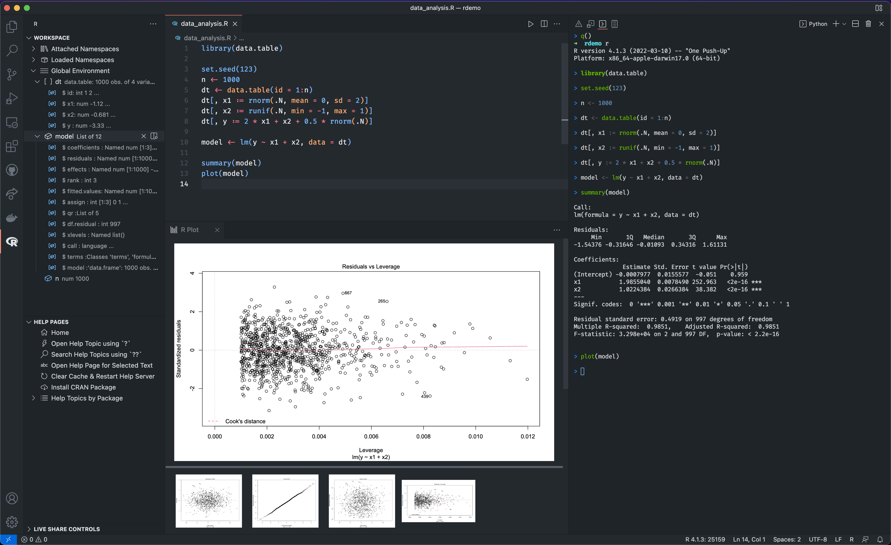

# Visual Studio Code에서의 R {#r-in-visual-studio-code}

[R 프로그래밍 언어](https://www.r-project.org/)는 통계 계산 및 그래픽을 위해 구축된 동적 언어입니다. R은 통계 분석, 과학적 계산, 머신 러닝 및 데이터 시각화에 일반적으로 사용됩니다.

Visual Studio Code용 [R 확장](https://marketplace.visualstudio.com/items?itemName=REditorSupport.r)은 확장된 구문 강조, 코드 완성, 린팅, 포맷팅, R 터미널과의 상호작용, 데이터 보기, 플롯, 작업 공간 변수, 도움말 페이지, 패키지 관리 및 [R Markdown](https://github.com/REditorSupport/vscode-R/wiki/R-Markdown) 문서 작업을 지원합니다.

[](/assets/docs/languages/r/overview.png)

## 시작하기 {#getting-started}

1. [R 설치](https://cloud.r-project.org/) (>= 3.4.0) 귀하의 플랫폼에 맞게 설치합니다. Windows 사용자의 경우, 설치 중 **레지스트리에 버전 번호 저장**을 체크하는 것이 좋습니다. 이렇게 하면 R 확장이 R 실행 파일을 자동으로 찾을 수 있습니다.

2. R에서 [`languageserver`](https://github.com/REditorSupport/languageserver)를 설치합니다.

    ```r
    install.packages("languageserver")
    ```

3. [Visual Studio Code용 R 확장](https://marketplace.visualstudio.com/items?itemName=REditorSupport.r)을 설치합니다.

4. R 파일을 생성하고 코딩을 시작합니다.

VS Code에서 R을 사용할 때의 경험을 향상시키기 위해 다음 소프트웨어 및 패키지를 추천합니다:

* [radian](https://github.com/randy3k/radian): 공식 R 터미널의 많은 한계를 수정하고 구문 강조 및 자동 완성과 같은 많은 기능을 지원하는 현대적인 R 콘솔입니다.

* [httpgd](https://github.com/nx10/httpgd): HTTP 및 WebSockets를 통해 SVG 그래픽을 비동기적으로 제공하는 그래픽 장치를 제공하는 R 패키지입니다. 이 패키지는 VS Code의 R 확장에 있는 대화형 플롯 뷰어에 필요합니다.

R 패키지나 VS Code용 R 확장 설치 중 문제가 발생하면 설치 위키 페이지([Windows](https://github.com/REditorSupport/vscode-R/wiki/Installation:-Windows) | [macOS](https://github.com/REditorSupport/vscode-R/wiki/Installation:-macOS) | [Linux](https://github.com/REditorSupport/vscode-R/wiki/Installation:-Linux))에서 더 많은 세부정보를 확인하세요.

## R 코드 실행하기 {#running-r-code}

R 코드를 실행하는 것은 단순히 R 터미널에 코드를 전송하는 것입니다. R 코드를 실행하기 전에 명령 팔레트에서 **R: Create R terminal** 명령을 통해 R 터미널을 생성할 수 있습니다.

R 터미널이 준비되면, 코드를 선택하거나 실행하려는 코드의 시작 또는 끝에 커서를 두고 `(Ctrl+Enter)`를 눌러 활성 R 터미널로 코드를 전송할 수 있습니다.

전체 R 파일을 실행하려면, 편집기에서 파일을 열고 `Ctrl+Shift+S`를 눌러 활성 R 터미널에서 파일을 소스합니다.

여러 R 터미널을 실행하거나 자가 관리 R 터미널과 같은 고급 사용법에 대해서는 [R 터미널과의 상호작용](https://github.com/REditorSupport/vscode-R/wiki/Interacting-with-R-terminals)을 읽어보세요.

## 코드 완성 (IntelliSense) {#code-completion-intellisense}

R 확장은 R 언어 서버 덕분에 코드 완성과 많은 다른 코드 편집 기능을 지원합니다. 완성 기능은 범위 내에서 사용 가능한 함수와 변수를 보여주며, 패키지에서 제공된 문서나 주석으로 제공된 문서도 함께 표시됩니다.


## 린팅 {#linting}

린팅은 코드의 경고 및 잠재적 오류를 확인하는 기능입니다. R 코드 린팅은 [lintr](https://github.com/r-lib/lintr) 패키지에서 제공합니다. [구성 파일](https://lintr.r-lib.org/articles/lintr.html#configuring-linters)을 통해 [사용 가능한 린터 목록](https://lintr.r-lib.org/reference/index.html#individual-linters)에서 선택하여 사용자 정의할 수 있습니다.


코드 완성과 린팅 외에도 R 확장은 코드 포맷팅, 정의로 이동, 기호 이름 바꾸기, 참조 찾기와 같은 다른 기능도 지원합니다. 더 많은 세부정보는 [R 언어 서비스](https://github.com/REditorSupport/vscode-R/wiki/R-Language-Service)를 읽어보세요.

## 작업 공간 뷰어 {#workspace-viewer}

작업 공간 뷰어는 VS Code의 사이드 바에 위치하며, 활성 R 세션에서 사용 중인 패키지와 전역 변수를 포함합니다. 활동 표시줄에서 R 아이콘을 선택하면 작업 공간 뷰어와 도움말 페이지 뷰어가 표시됩니다. 이는 R 작업 공간을 보고, 기존 R 객체를 미리 보고, 도움말 주제를 찾고, 도움말 페이지를 대화식으로 읽는 편리한 방법입니다.


작업 공간 뷰어 외에도 데이터 뷰어, 플롯 뷰어 및 위젯 뷰어도 있습니다. 더 많은 세부정보는 [대화형 뷰어](https://github.com/REditorSupport/vscode-R/wiki/Interactive-viewers)를 읽어보세요.

## 디버깅 {#debugging}

R 디버깅 기능은 [R Debugger](https://marketplace.visualstudio.com/items?itemName=RDebugger.r-debugger) 확장에서 제공합니다. 새로운 R 프로세스를 시작하거나 실행 중인 프로세스에 연결하여 R 코드 또는 R 프로젝트를 디버깅할 수 있습니다.

중단점에 도달하면 현재 선택된 스택 프레임의 변수를 보거나 변경할 수 있으며, 스택 프레임의 디버그 콘솔에서 표현식을 평가할 수 있습니다.

더 많은 세부정보는 프로젝트 [README](https://github.com/ManuelHentschel/VSCode-R-Debugger)를 읽어보세요.

## 다음 단계 {#next-steps}

이 개요는 VS Code용 R 확장에 대한 간단한 소개입니다. 기능에 대한 자세한 목록은 확장 [README](https://github.com/REditorSupport/vscode-R#features)를 읽어보세요.

문제, 제안 또는 기능 요청이 있는 경우, [GitHub 리포지토리](https://github.com/REditorSupport/vscode-R/issues)에서 문제를 열어 주시기 바랍니다.

VS Code에 대해 더 알고 싶다면 다음 주제를 시도해 보세요:

* [기본 편집](/docs/editor/codebasics.md) - VS Code 편집기의 기본 사항에 대한 간단한 소개입니다.
* [확장 설치](/docs/editor/extension-marketplace.md) - [Marketplace](https://marketplace.visualstudio.com/vscode)에서 사용할 수 있는 다른 확장에 대해 알아보세요.
* [코드 탐색](/docs/editor/editingevolved.md) - 소스 코드를 빠르게 탐색합니다.
---