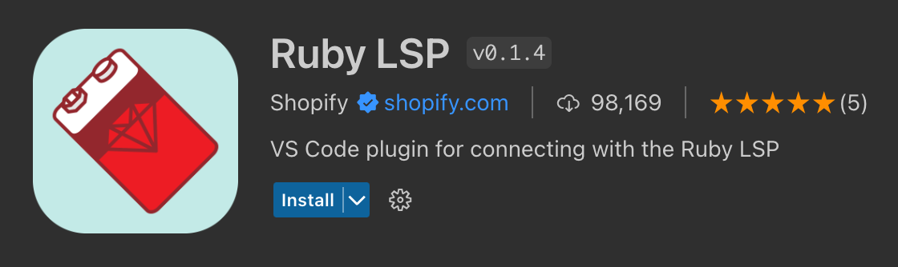
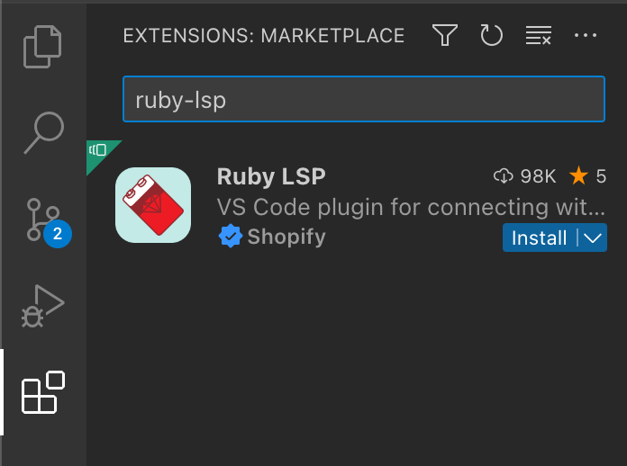
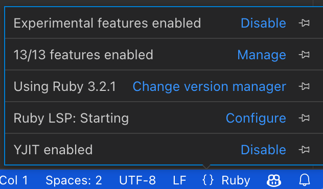
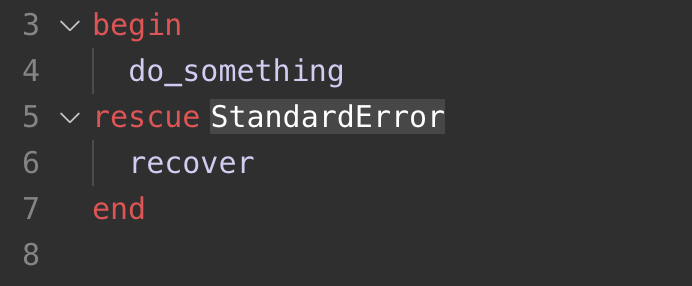
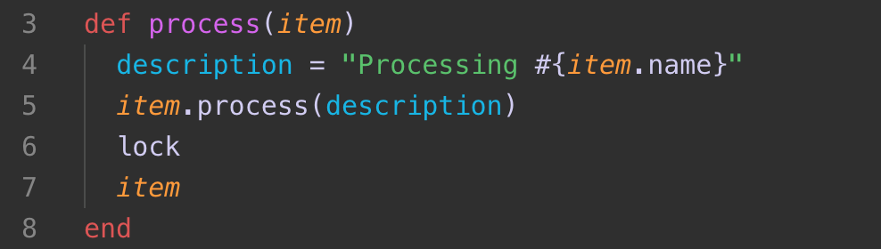
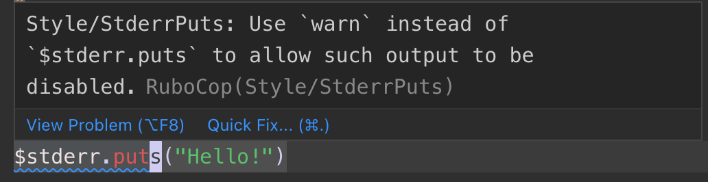
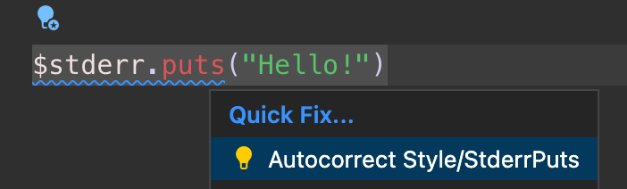
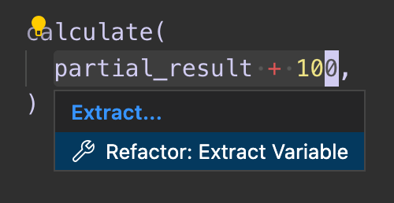
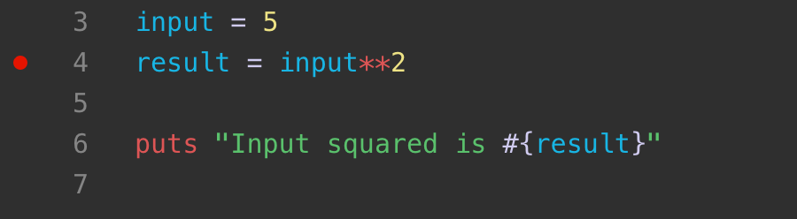
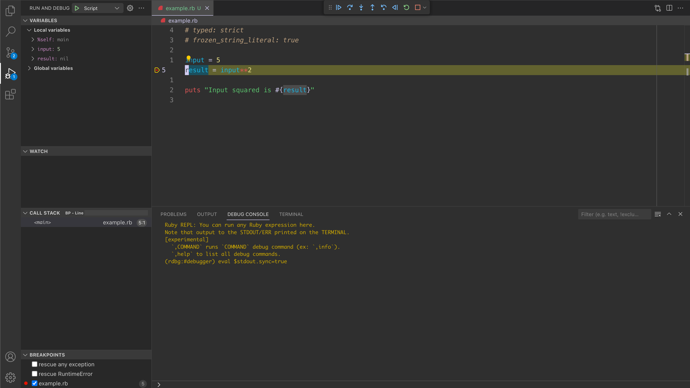

# Visual Studio Code에서 루비 사용하기 {#ruby-in-visual-studio-code}

[루비](https://www.ruby-lang.org)는 단순성과 생산성으로 잘 알려진 동적 오픈 소스 프로그래밍 언어입니다. 표현력이 풍부하고 우아한 문법을 가진 루비의 철학 중 하나는 개발자를 행복하게 만드는 것입니다. 다양한 프레임워크와 함께 웹 개발에 자주 사용되며, 프로토타입을 구축할 때 빠른 반복을 가능하게 하는 스크립팅에도 사용됩니다.

이 주제에서는 Visual Studio Code 내에서 루비를 설정하고 사용하는 방법에 대해 자세히 설명하며, 
[Ruby LSP](https://marketplace.visualstudio.com/items?itemName=Shopify.ruby-lsp) 확장에 대해 다룹니다.



## 설치 {#installation}

### 버전 관리자를 통해 루비 설치하기 {#install-ruby-through-a-version-manager}

루비는 일부 운영 체제(예: macOS 및 일부 리눅스 배포판)에 기본적으로 설치되어 있지만, Windows, macOS 및 리눅스에서 최신 버전의 루비에 접근할 수 있도록 [rbenv](https://github.com/rbenv/rbenv)와 같은 버전 관리자를 사용하는 것을 권장합니다. 플랫폼에 맞는 [설치 안내](https://github.com/rbenv/rbenv#installation)를 따르세요.

> **참고**: 새로운 도구 세트를 설치할 때와 마찬가지로, 업데이트된 도구 세트 위치를 사용하기 위해 터미널/명령 프롬프트 및 VS Code 인스턴스를 재시작해야 합니다.

### VS Code에서 Ruby LSP 확장 설치하기 {#install-the-ruby-lsp-extension-in-vs-code}

VS Code 내의 확장 보기(`kb(workbench.view.extensions)`)에서 'Ruby LSP'를 검색하여 Ruby LSP 확장을 찾고 설치할 수 있습니다.



이 주제에서는 Ruby LSP의 여러 기능에 대해 논의하겠지만, 확장의 [문서](https://shopify.github.io/ruby-lsp)와 [저장소](https://github.com/Shopify/ruby-lsp)를 참조할 수도 있습니다.

### 설치 확인하기 {#check-your-installation}

설치 후, 언어 상태 항목을 확인하여 Ruby LSP 서버의 상태를 확인하세요. 버전 관리자가 구성되었다면, 프로젝트에 맞는 올바른 루비 버전이 표시되어야 합니다. 서버 상태는 시작 중이거나 실행 중으로 표시되어야 하며, 오류는 표시되지 않아야 합니다.



확장은 언어 서버 젬 `ruby-lsp`를 포함하는 사용자 정의 번들과 함께 `.ruby-lsp` 폴더를 자동으로 생성합니다. 별도의 구성은 필요하지 않습니다.

기본적으로 확장은 사용 중인 루비 버전 관리자를 자동으로 감지하고, 그에 맞는 버전과 경로를 사용하려고 합니다. 이 동작을 사용자 정의하려면 사용자 [설정](/docs/editor/settings.md)에서 다음 구성을 설정하세요:

```json
{
  "rubyLsp.rubyVersionManager": {
    "identifier": "rbenv"
  }
}
```

확장은 주기적으로 `ruby-lsp` 언어 서버 젬을 자동으로 업데이트하려고 합니다. 이를 강제로 실행하려면 명령 팔레트(`kb(workbench.action.showCommands)`)를 사용하여 **Ruby LSP: 언어 서버 젬 업데이트**를 실행하세요.

문제가 발생하면 [문제 해결](https://shopify.github.io/ruby-lsp/troubleshooting.html) 섹션을 참조하여 다음 단계를 확인하세요.

## 주요 기능 {#main-features}

### 탐색 및 IntelliSense {#navigation-and-intellisense}

Ruby LSP는 정의로 이동, 호버, 작업 공간 기호, 문서 기호, 완성 및 서명 도움말과 같은 여러 탐색 및 IntelliSense 관련 기능을 제공합니다.

<video src="images/ruby/navigation.mp4" placeholder="images/ruby/navigation-placeholder.png" autoplay loop controls
    muted title="탐색 및 IntelliSense 기능 데모">
죄송합니다. 귀하의 브라우저는 HTML 5 비디오를 지원하지 않습니다.
</video>

VS Code를 사용하여 소스 코드를 빠르게 탐색하는 방법에 대해 더 알아보려면 [코드 탐색](/docs/editor/editingevolved.md)을 확인하세요.

### 인레이 힌트 {#inlay-hints}

Ruby LSP는 코드에서 추론된 값이나 암시적 값에 대한 유용한 정보를 표시할 수 있습니다. 아래 예제에서는 빈 `rescue` 호출에서 구출되는 암시적 예외 클래스인 `StandardError`가 표시됩니다.



인레이 힌트는 코드 이해에 도움이 될 수 있지만, **편집기 > 인레이 힌트: 활성화됨** 설정(`setting(editor.inlayHints.enabled)`)을 통해 이 기능을 비활성화할 수도 있으며, Ruby LSP에 대해서만 이 기능을 비활성화하려면 다음을 사용할 수 있습니다:

```json
"rubyLsp.enabledFeatures": {
    "inlayHint": false,
}
```

### 의미론적 구문 강조 {#semantic-syntax-highlighting}

Ruby LSP는 프로젝트 소스 코드에 대한 풍부한 이해 덕분에 [의미론적 구문 강조](https://github.com/microsoft/vscode/wiki/Semantic-Highlighting-Overview) 및 스타일링을 사용할 수 있습니다.

예를 들어, 다음과 같은 강조가 가능합니다:

- 메서드 호출을 일관되게 강조하며, 로컬 변수와 혼동되지 않도록 합니다.
- 로컬 인수(메서드, 블록 또는 람다 인수 등)를 존재하는 범위 내에서 일관되게 강조합니다.



> **참고**: 이 스크린샷은 [루비 확장 팩](https://marketplace.visualstudio.com/items?itemName=Shopify.ruby-extensions-pack)에 포함된 Spinel 테마를 사용하고 있습니다. 테마는 루비 파일에 대한 풍부한 강조를 제공하기 위해 Ruby LSP에서 제공하는 정보를 사용해야 합니다.

이 기능을 사용하려면 편집기에서 의미론적 강조가 활성화되어 있어야 합니다.

```json
"editor.semanticHighlighting.enabled": true,
```

### 린팅 및 포맷팅 {#linting-and-formatting}

기본적으로 Ruby LSP는 [RuboCop](https://github.com/rubocop/rubocop)와의 통합을 통해 린팅 및 포맷팅을 제공합니다. `kb(editor.action.formatDocument)`를 사용하거나 명령 팔레트(`kb(workbench.action.showCommands)`) 또는 편집기에서의 컨텍스트 메뉴를 통해 **문서 포맷** 명령을 실행하여 루비 파일을 포맷할 수 있습니다.

프로젝트에서 RuboCop을 사용하지 않는 경우, Ruby LSP는 [SyntaxTree](https://ruby-syntax-tree.github.io/syntax_tree)를 사용하여 파일을 포맷합니다.



작업 중에 루비 코드가 자동으로 올바르게 포맷되도록 하려면 각 저장 시 포맷터를 실행할 수 있습니다(**편집기: 저장 시 포맷**). 이를 위해 저장 시 포맷을 활성화해야 합니다.

```json
"editor.formatOnSave": true
```

Ruby LSP 확장은 타입에 따른 포맷팅을 사용하여 몇 가지 편리한 완성을 제공합니다. 예를 들어, 주석 줄을 자동으로 계속 작성하고 `end` 토큰, 파이프 또는 문자열 보간 중괄호를 자동으로 닫습니다. 타입에 따른 포맷팅을 사용하려면 편집기에서 활성화되어 있어야 합니다:

```json
"editor.formatOnType": true
```

### 빠른 수정 {#quick-fixes}

린터가 소스 코드에서 오류와 경고를 발견하면, Ruby LSP는 종종 제안된 빠른 수정(코드 작업이라고도 함)을 제공할 수 있으며, 이는 편집기에서 전구 호버를 통해 사용할 수 있습니다. 사용 가능한 빠른 수정을 빠르게 열려면 `kb(editor.action.quickFix)`를 사용하세요.



또한, **코드 작업 위젯: 인근 빠른 수정 포함**(`setting(editor.codeActionWidget.includeNearbyQuickFixes)`) 설정은 기본적으로 활성화되어 있으며, 이는 `kb(editor.action.quickFix)`(명령 ID `editor.action.quickFix`)에서 가장 가까운 빠른 수정을 활성화합니다. 커서가 해당 줄의 어디에 있든 상관없이 적용됩니다.

이 명령은 빠른 수정으로 리팩토링되거나 수정될 소스 코드를 강조합니다. 일반 코드 작업 및 비수정 리팩토링은 여전히 커서 위치에서 활성화할 수 있습니다.

### 리팩토링 {#refactoring}

빠른 수정 외에도 Ruby LSP는 코드 작업을 통해 리팩토링 옵션을 제공합니다. 예를 들어, 클릭 한 번으로 루비 표현식을 로컬 변수로 추출할 수 있습니다.



## 디버깅 {#debugging}

Ruby LSP 확장은 디버그 젬(루비의 공식 디버거)을 사용하여 디버깅을 지원합니다. 또는 개발자는 [VS Code RDBG](https://marketplace.visualstudio.com/items?itemName=KoichiSasada.vscode-rdbg) 확장을 설치하여 디버깅 기능을 얻을 수도 있습니다.

다음 문서는 Ruby LSP의 디버거 클라이언트에 대한 것입니다. 구성 방법에 대한 지침은 [RDBG의 README](https://github.com/ruby/vscode-rdbg)를 참조하세요.

### 테스트 디버깅 {#debugging-tests}

Ruby LSP는 테스트 탐색기에서 예제를 실행하거나 새 터미널에서 실행하거나 디버거를 시작할 수 있는 단위 테스트 위에 CodeLens 버튼을 추가합니다. 이러한 용도에는 구성할 필요가 없습니다.


### 시작 작업을 통한 디버깅 {#debugging-through-launch-tasks}

시작 작업을 통해 디버거를 사용하려면 `launch.json` 파일에 [디버깅 구성](/docs/editor/debugging-configuration.md#launch-configurations)을 생성해야 합니다. 이 구성은 실행할 프로그램을 구성할 수 있게 해줍니다.

루비 프로그램을 위한 `launch.json`을 생성하려면:

1. 디버그 보기(`kb(workbench.view.debug)`)에서 **launch.json 파일 생성** 링크를 선택합니다.
2. 여러 기본 시작 구성 유형이 포함된 드롭다운이 표시됩니다. 첫 번째 옵션을 선택할 수 있지만, 더 많은 구성을 추가할 것입니다.
3. 이제 생성된 `.vscode/launch.json` 파일을 편집하여 디버깅을 위한 루비 프로그램을 시작하는 방법을 추가할 수 있습니다.

예시:

```json
{
    "version": "0.2.0",
    "configurations": [
        // 주어진 프로그램에 대한 디버거를 시작합니다. 이 경우 현재 파일을 루비로 실행합니다.
        {
            "type": "ruby_lsp",
            "name": "디버그",
            "request": "launch",
            "program": "ruby $\{file\}
",
        },
        // 현재 테스트 파일에 대한 디버거를 시작합니다.
        {
            "type": "ruby_lsp",
            "request": "launch",
            "name": "테스트 파일 디버그",
            "program": "ruby -Itest $\{relativeFile\}
"
        },
        // 이미 디버거 서버로 시작된 기존 루비 프로세스에 디버거 클라이언트를 연결합니다.
        {
            "type": "ruby_lsp",
            "request": "attach",
            "name": "기존 서버에 연결",
        }
    ]
}
```

시작 구성을 추가한 후, 중단점을 추가하고 시작 작업을 실행하여 루비 프로그램을 디버깅할 수 있습니다.

1. 루비 파일을 열고 편집기에서 왼쪽 여백을 클릭하여 중단점을 설정합니다. 빨간 점으로 표시되어야 합니다.

   

2. **실행 및 디버그**에서 원하는 작업을 선택하고 디버깅 시작 버튼(기본 키보드 단축키 `kb(workbench.action.debug.start)`)을 클릭하여 디버깅을 시작합니다.

   

## 다음 단계 {#next-steps}

이 문서는 Visual Studio Code 내에서 Ruby LSP 확장 기능을 간략하게 소개했습니다. 더 많은 정보는 Ruby LSP [문서](https://shopify.github.io/ruby-lsp)에서 제공되는 세부 정보를 참조하세요. 여기에는 특정 [VS Code 편집기](https://github.com/Shopify/ruby-lsp/blob/main/vscode/README.md) 구성을 조정하는 방법도 포함되어 있습니다.

Ruby LSP 확장의 최신 기능 및 버그 수정에 대한 정보를 얻으려면 서버 및 VS Code 확장 구현을 포함하는 [모노레포](https://github.com/Shopify/ruby-lsp/releases)의 릴리스 페이지를 확인하세요.

문제나 기능 요청이 있는 경우, Ruby LSP의 [GitHub 저장소](https://github.com/Shopify/ruby-lsp/issues)에 자유롭게 기록하세요.

VS Code에 대해 더 배우고 싶다면 다음 주제를 시도해 보세요:

- [기본 편집](/docs/editor/codebasics.md) - VS Code 편집기의 기본 사항에 대한 간단한 소개입니다.
- [확장 설치하기](/docs/editor/extension-marketplace.md) - [마켓플레이스](https://marketplace.visualstudio.com/vscode)에서 사용할 수 있는 다른 확장에 대해 알아보세요.
- [코드 탐색](/docs/editor/editingevolved.md) - 소스 코드를 빠르게 탐색하세요.
---