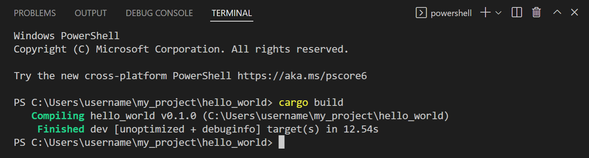
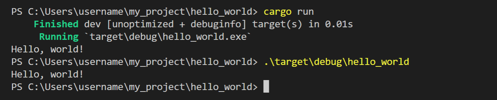
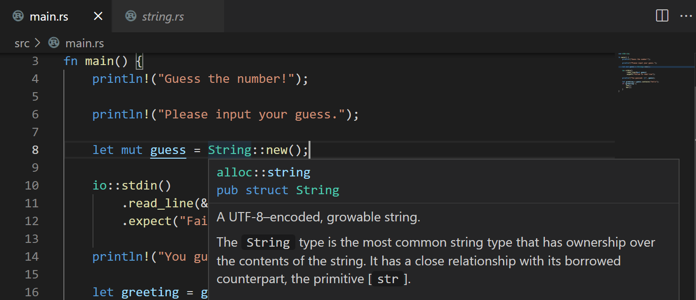
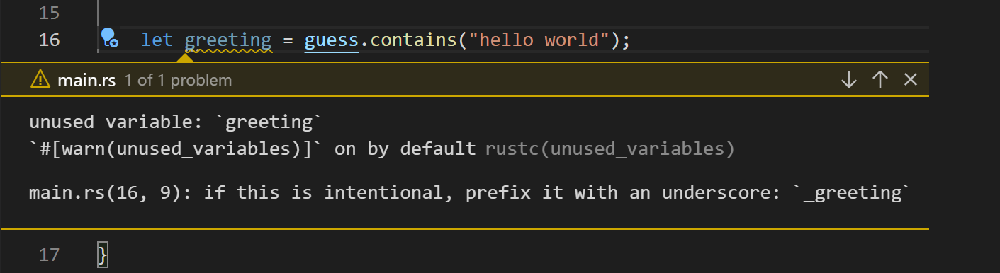
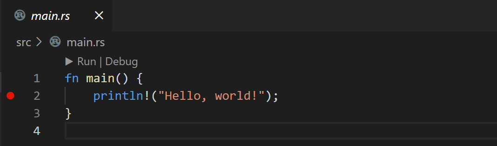
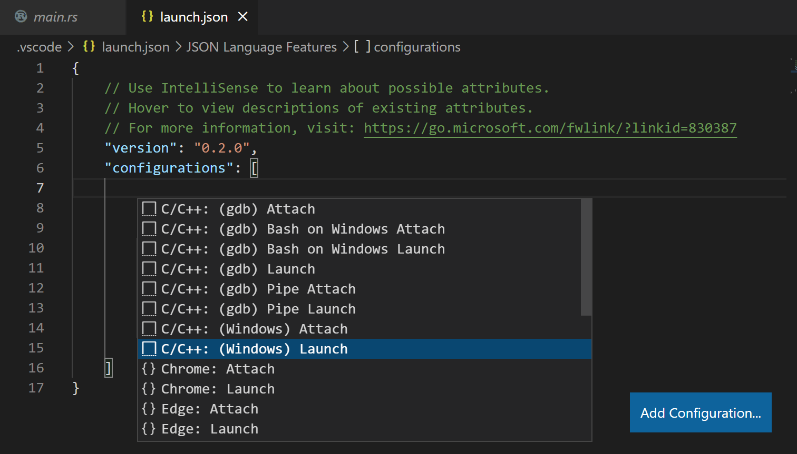

# Visual Studio Code에서 Rust 사용하기 {#rust-in-visual-studio-code}

[Rust](https://www.rust-lang.org)는 성능과 정확성이 중요한 시스템 프로그래밍에 자주 사용되는 강력한 프로그래밍 언어입니다. Rust에 처음 접하고 더 배우고 싶다면, [The Rust Programming Language](https://doc.rust-lang.org/book) 온라인 책이 좋은 출발점입니다. 이 주제에서는 Visual Studio Code 내에서 Rust를 설정하고 사용하는 방법에 대해 자세히 설명하며, [rust-analyzer](https://marketplace.visualstudio.com/items?itemName=rust-lang.rust-analyzer) 확장 프로그램을 다룹니다.


>**참고**: VS Code Marketplace에는 또 다른 인기 있는 Rust 확장 프로그램(확장 ID: rust-lang.rust)이 있지만, 이 확장 프로그램은 더 이상 지원되지 않으며 rust-analyzer가 rust-lang.org에서 추천하는 VS Code Rust 확장 프로그램입니다.

## 설치 {#installation}

### 1. Rust 설치하기 {#1-install-rust}

먼저, 머신에 Rust 도구 세트를 설치해야 합니다. Rust는 [rustup](https://rustup.rs) 설치 프로그램을 통해 설치되며, Windows, macOS 및 Linux에서 설치를 지원합니다. 플랫폼에 맞는 rustup 설치 지침을 따라 Rust 프로그램을 빌드하고 실행하는 데 필요한 추가 도구를 설치해야 합니다.

>**참고**: 머신에 새로운 도구 세트를 설치할 때와 마찬가지로, 업데이트된 도구 세트 위치를 사용하기 위해 터미널/명령 프롬프트 및 VS Code 인스턴스를 다시 시작해야 합니다.

### 2. rust-analyzer 확장 설치하기 {#2-install-the-rust-analyzer-extension}

VS Code 내에서 확장 보기(`kb(workbench.view.extensions)`)를 통해 rust-analyzer 확장을 찾아 설치할 수 있으며, 'rust-analyzer'를 검색하면 됩니다. **릴리스 버전**을 설치해야 합니다.


이 주제에서는 rust-analyzer의 많은 기능을 논의할 것이지만, 확장 프로그램의 문서는 [https://rust-analyzer.github.io](https://rust-analyzer.github.io)에서 참조할 수 있습니다.

### 설치 확인하기 {#check-your-installation}

Rust를 설치한 후, 새로운 터미널/명령 프롬프트를 열고 다음을 입력하여 모든 것이 올바르게 설치되었는지 확인할 수 있습니다:

```bash
rustc --version
```

이 명령은 Rust 컴파일러의 버전을 출력합니다. 더 많은 세부정보가 필요하면 `--verbose` 인수를 추가할 수 있습니다. 문제가 발생하면 Rust [설치 가이드](https://doc.rust-lang.org/book/ch01-01-installation.html)를 참조하세요.

최신 버전으로 Rust 설치를 유지하려면 다음을 실행하세요:

```bash
rustup update
```

Rust의 새로운 안정 버전은 매 6주마다 발표되므로, 이는 좋은 습관입니다.

### 로컬 Rust 문서 {#local-rust-documentation}

Rust를 설치하면 머신에 로컬로 설치된 전체 Rust 문서 세트를 얻을 수 있으며, `rustup doc`을 입력하여 검토할 수 있습니다. Rust 문서에는 [The Rust Programming Language](https://doc.rust-lang.org/book/title-page.html) 및 [The Cargo Book](https://doc.rust-lang.org/stable/cargo/)가 포함되어 있으며, 로컬 브라우저에서 열려 오프라인 상태에서도 Rust 여정을 계속할 수 있습니다.

## Hello World {#hello-world}

### Cargo {#cargo}

rustup으로 Rust를 설치하면 도구 세트에는 rustc 컴파일러, rustfmt 소스 코드 포매터 및 clippy Rust 린터가 포함됩니다. 또한 Rust 패키지 관리자 [Cargo](https://doc.rust-lang.org/cargo)를 사용하여 Rust 종속성을 다운로드하고 Rust 프로그램을 빌드 및 실행할 수 있습니다. Rust 작업 시 거의 모든 작업에 `cargo`를 사용하게 될 것입니다.

### Cargo new {#cargo-new}

첫 번째 Rust 프로그램을 만드는 좋은 방법은 Cargo를 사용하여 새 프로젝트를 스캐폴딩하는 것입니다. `cargo new`를 입력하면 간단한 Hello World 프로그램과 기본 `Cargo.toml` 종속성 파일이 생성됩니다. `cargo new`에 프로젝트를 생성할 폴더를 전달합니다.

Hello World를 만들어 보겠습니다. 프로젝트를 생성할 폴더로 이동하여 다음을 입력하세요:

```bash
cargo new hello_world
```

새 프로젝트를 VS Code에서 열려면 새 폴더로 이동한 후 `code .`를 실행하세요:

```bash
cd hello_world
code .
```

>**참고**: 새 폴더에 대해 [Workspace Trust](/docs/editor/workspaces/workspace-trust.md)를 활성화하세요. 새 프로젝트를 생성할 때 프롬프트를 피하기 위해 전체 프로젝트 폴더 부모에 대해 Workspace Trust를 활성화할 수 있으며, **부모 폴더 'my_projects'의 모든 파일 작성자를 신뢰합니다** 옵션을 선택하면 됩니다.

`cargo new`는 `main.rs` 소스 코드 파일과 `Cargo.toml` [Cargo 매니페스트](https://doc.rust-lang.org/cargo/reference/manifest.html) 파일이 포함된 간단한 Hello World 프로젝트를 생성합니다.

```
src\
    main.rs
.gitignore
Cargo.toml
```

`main.rs`에는 프로그램의 진입 함수 `main()`이 있으며, `println!`을 사용하여 "Hello, world!"를 콘솔에 출력합니다.

```rust
fn main() {
    println!("Hello, world!");
}
```

이 간단한 Hello World 프로그램은 종속성이 없지만, Rust 패키지(크레이트) 참조는 `[dependencies]` 아래에 추가할 수 있습니다.

### Cargo build {#cargo-build}

Cargo는 Rust 프로젝트를 빌드하는 데 사용할 수 있습니다. 새로운 VS Code [통합 터미널](/docs/terminal/basics.md) (`kb(workbench.action.terminal.new)`)을 열고 `cargo build`를 입력하세요.

```bash
cargo build
```



이제 `target\debug` 폴더에 빌드 출력이 포함된 `hello_world.exe`라는 실행 파일이 생성됩니다.

### Hello World 실행하기 {#running-hello-world}

Cargo는 `cargo run`을 통해 Rust 프로젝트를 실행하는 데에도 사용할 수 있습니다.

```bash
cargo run
```

또한 터미널에서 `hello_world.exe`를 수동으로 실행하려면 `.\target\debug\hello_world`를 입력할 수 있습니다.



## IntelliSense {#intellisense}

IntelliSense 기능은 Rust 언어 서버인 [rust-analyzer](https://github.com/rust-lang/rust-analyzer/releases)에 의해 제공되며, 이는 상세한 코드 정보와 스마트 제안을 제공합니다.

Rust 프로젝트를 처음 열면 상태 표시줄의 왼쪽 하단에서 rust-analyzer의 진행 상황을 확인할 수 있습니다. 언어 서버의 모든 기능을 활용하려면 rust-analyzer가 프로젝트를 완전히 검토할 때까지 기다려야 합니다.


### 인레이 힌트 {#inlay-hints}

가장 먼저 눈에 띄는 것 중 하나는 rust-analyzer가 추론된 타입, 반환 값, 명명된 매개변수를 편집기에서 연한 텍스트로 표시하는 [인레이 힌트](/docs/editor/editingevolved.md#inlay-hints)를 제공한다는 것입니다.


인레이 힌트는 코드 이해에 도움이 될 수 있지만, **Editor > Inlay Hints: Enabled** 설정(`setting(editor.inlayHints.enabled)`)을 통해 이 기능을 구성할 수도 있습니다.

### 호버 정보 {#hover-information}

변수, 함수, 타입 또는 키워드 위에 마우스를 올리면 해당 항목에 대한 정보(문서, 서명 등)를 얻을 수 있습니다. 또한 자신의 코드나 표준 Rust 라이브러리에서 타입 정의로 점프할 수 있습니다.



### 자동 완성 {#auto-completions}

Rust 파일에 입력할 때 IntelliSense는 제안된 완성과 매개변수 힌트를 제공합니다.


>**팁**: `kb(editor.action.triggerSuggest)`를 사용하여 수동으로 제안을 트리거할 수 있습니다.

## 의미론적 구문 강조 {#semantic-syntax-highlighting}

rust-analyzer는 프로젝트 소스 코드에 대한 풍부한 이해 덕분에 [의미론적 구문 강조](https://github.com/microsoft/vscode/wiki/Semantic-Highlighting-Overview) 및 스타일링을 사용할 수 있습니다. 예를 들어, 편집기에서 가변 변수가 밑줄로 표시되는 것을 보았을 것입니다.


어떤 Rust 변수가 가변인지 아닌지를 빠르게 파악할 수 있는 것은 소스 코드 이해에 도움이 될 수 있지만, VS Code의 `setting(editor.semanticTokenColorCustomizations)` 설정을 통해 스타일을 변경할 수도 있습니다.

`settings.json`에 다음을 추가합니다:

```jsonc
{
  "editor.semanticTokenColorCustomizations": {
    "rules": {
      "*.mutable": {
        "fontStyle": "", // 기본값인 밑줄을 비활성화하려면 빈 문자열로 설정합니다.
      },
    }
  },
}
```

rust-analyzer의 의미론적 구문 사용자 정의에 대해 더 알아보려면 rust-analyzer 문서의 [Editor features](https://rust-analyzer.github.io/manual.html#editor-features) 섹션을 참조하세요.

## 코드 탐색 {#code-navigation}

코드 탐색 기능은 편집기에서 컨텍스트 메뉴에 있습니다.

* **정의로 이동** `kb(editor.action.revealDefinition)` - 타입 정의의 소스 코드로 이동합니다.
* **정의 미리 보기** `kb(editor.action.peekDefinition)` - 타입 정의가 있는 미리 보기 창을 엽니다.
* **참조로 이동** `kb(editor.action.goToReferences)` - 타입에 대한 모든 참조를 표시합니다.
* **호출 계층 표시** `kb(editor.showCallHierarchy)` - 함수로부터 또는 함수로의 모든 호출을 표시합니다.

**명령 팔레트**(`kb(workbench.action.showCommands)`)에서 **기호로 이동** 명령을 사용하여 기호 검색을 통해 탐색할 수 있습니다.

* 파일 내 기호로 이동 - `kb(workbench.action.gotoSymbol)`
* 작업 공간 내 기호로 이동 - `kb(workbench.action.showAllSymbols)`

## 린팅 {#linting}

Rust 도구 세트에는 소스 코드의 문제를 감지하기 위해 rustc와 clippy가 제공하는 린팅 기능이 포함되어 있습니다.



기본적으로 활성화된 rustc 린터는 기본 Rust 오류를 감지하지만, [clippy](https://github.com/rust-lang/rust-clippy)를 사용하여 더 많은 린트를 받을 수 있습니다. rust-analyzer에서 clippy 통합을 활성화하려면 **Rust-analyzer > Check: Command** (`rust-analyzer.check.command`) 설정을 기본값인 `check` 대신 `clippy`로 변경합니다. 이제 rust-analyzer 확장은 파일을 저장할 때 `cargo clippy`를 실행하고 편집기 및 문제 보기에서 clippy 경고와 오류를 직접 표시합니다.

## 빠른 수정 {#quick-fixes}

린터가 소스 코드에서 오류와 경고를 발견하면 rust-analyzer는 종종 제안된 빠른 수정(코드 작업이라고도 함)을 제공할 수 있으며, 이는 편집기에서 전구 위에 마우스를 올리면 사용할 수 있습니다. 사용 가능한 빠른 수정을 빠르게 열려면 `kb(editor.action.quickFix)`를 사용할 수 있습니다.

또한 **코드 작업 위젯: 인근 빠른 수정 포함**(`setting(editor.codeActionWidget.includeNearbyQuickFixes)`) 설정은 기본적으로 활성화되어 있으며, 이는 `kb(editor.action.quickFix)`(명령 ID `editor.action.quickFix`)에서 인근 줄의 가장 가까운 빠른 수정을 활성화합니다. 커서가 해당 줄의 어디에 있든 상관없이 가능합니다.

이 명령은 빠른 수정으로 리팩토링되거나 수정될 소스 코드를 강조 표시합니다. 일반 코드 작업 및 비수정 리팩토링은 여전히 커서 위치에서 활성화할 수 있습니다.


## 리팩토링 {#refactoring}

rust-analyzer가 소스 코드에 대한 의미론적 이해를 가지고 있기 때문에, Rust 파일 전반에 걸쳐 스마트 이름 바꾸기를 제공할 수 있습니다. 변수 위에 커서를 두고 컨텍스트 메뉴, 명령 팔레트 또는 `kb(editor.action.rename)`를 통해 **기호 이름 바꾸기**를 선택하세요.

rust-analyzer 확장은 다른 코드 리팩토링 및 코드 생성을 지원하며, 이를 [Assists](https://rust-analyzer.github.io/manual.html#assists-code-actions)라고 부릅니다.

다음은 사용 가능한 리팩토링의 몇 가지 예입니다:

* if 문을 보호된 반환으로 변환
* 변수를 인라인으로 만들기
* 함수 추출
* 반환 타입 추가
* 가져오기 추가

## 포매팅 {#formatting}

Rust 도구 세트에는 소스 코드를 Rust 규칙에 맞게 포매팅할 수 있는 포매터인 [rustfmt](https://github.com/rust-lang/rustfmt)가 포함되어 있습니다. `kb(editor.action.formatDocument)`를 사용하거나 편집기에서 **명령 팔레트** 또는 컨텍스트 메뉴에서 **문서 포매팅** 명령을 실행하여 Rust 파일을 포매팅할 수 있습니다.

작업 중에 Rust 코드가 자동으로 올바르게 포매팅되도록 **Editor: Format On Save** 또는 **Format On Paste**를 사용하여 각 저장 시 포매터를 실행할 수도 있습니다.

## 디버깅 {#debugging}

rust-analyzer 확장은 VS Code 내에서 Rust 디버깅을 지원합니다.

### 디버깅 지원 설치하기 {#install-debugging-support}

디버깅을 시작하려면 먼저 디버깅 지원이 있는 두 가지 언어 확장 중 하나를 설치해야 합니다:

* [Microsoft C++](https://marketplace.visualstudio.com/items?itemName=ms-vscode.cpptools) (ms-vscode.cpptools) – *Windows에서*
* [CodeLLDB](https://marketplace.visualstudio.com/items?itemName=vadimcn.vscode-lldb) (vadimcn.vscode-lldb) – *macOS/Linux에서*

이러한 확장 중 하나를 설치하는 것을 잊으면, 디버그 세션을 시작하려고 할 때 rust-analyzer가 VS Code Marketplace에 대한 링크와 함께 알림을 제공합니다.


### Rust Analyzer 사용하기: 디버그 {#using-rust-analyzer-debug}

rust-analyzer 확장은 명령 팔레트(`kb(workbench.action.showCommands)`)에서 사용할 수 있는 **Rust Analyzer: Debug** 명령과 편집기에서 **Run|Debug** CodeLens를 통해 기본적인 디버깅 지원을 제공합니다.

이전에 만든 Hello World 프로그램을 디버깅해 보겠습니다. 먼저 `main.rs`에서 중단점을 설정합니다.

1. **Debug: Allow Breakpoints Everywhere** 설정을 활성화해야 하며, 이는 설정 편집기(`kb(workbench.action.openSettings)`)에서 'everywhere'를 검색하여 찾을 수 있습니다.

   

2. `main.rs`를 열고 편집기에서 왼쪽 여백을 클릭하여 `println!` 줄에 중단점을 설정합니다. 빨간 점으로 표시되어야 합니다.

   

3. 디버깅을 시작하려면 **Rust Analyzer: Debug** 명령을 사용하거나 `main()`에 대한 **Debug** CodeLens를 선택하세요.

   

<!--
### launch.json 사용하기 {#using-launchjson}

더 복잡한 디버깅 시나리오를 위해 `launch.json` [디버깅 구성](/docs/editor/debugging.md/#launch-configurations) 파일을 생성할 수 있습니다. `launch.json` 파일을 사용하면 프로그램에 인수를 전달하고, 사전 실행 작업을 실행하고, 환경 변수를 설정하는 등 다양한 작업을 수행할 수 있습니다.

Rust 프로그램을 위한 `launch.json`을 생성하려면:

1. 디버그 보기(`kb(workbench.view.debug)`)에서 **launch.json 파일 생성** 링크를 선택합니다.
2. 여러 기본 런치 구성 유형이 표시되는 드롭다운이 나타납니다. Rust에 대한 다른 구성을 추가할 것이므로 첫 번째 옵션을 선택할 수 있습니다.
3. 이제 편집기에서 `launch.json` 파일이 생성되며, 이는 프로젝트의 새 `.vscode` 폴더에 위치합니다.
4. 오른쪽 하단의 **구성 추가** 버튼을 선택하고 **C/C++: (Windows) Launch** 구성을 선택합니다.
  
-->

## 다음 단계 {#next-steps}

이 문서는 VS Code 내에서 rust-analyzer 확장 기능의 기능을 간략하게 소개했습니다. 더 많은 정보는 Rust Analyzer 확장 [사용자 매뉴얼](https://rust-analyzer.github.io/manual.html)에서 제공되는 세부정보를 참조하세요. 여기에는 특정 [VS Code 편집기](https://rust-analyzer.github.io/manual.html#vs-code-2) 구성 조정 방법이 포함되어 있습니다.

rust-analyzer 확장의 최신 기능/버그 수정에 대한 정보를 얻으려면 [CHANGELOG](https://rust-analyzer.github.io/thisweek)를 확인하세요. 또한 확장 보기 **설치** 드롭다운에서 사용할 수 있는 rust-analyzer **사전 릴리스 버전**을 설치하여 새로운 기능과 수정 사항을 시도해 볼 수 있습니다.

문제나 기능 요청이 있는 경우 rust-analyzer 확장의 [GitHub 저장소](https://github.com/rust-lang/rust-analyzer/issues)에 자유롭게 기록해 주세요.

VS Code에 대해 더 배우고 싶다면 다음 주제를 시도해 보세요:

* [기본 편집](/docs/editor/codebasics.md) - VS Code 편집기의 기본 사항에 대한 간단한 소개입니다.
* [확장 설치하기](/docs/editor/extension-marketplace.md) - [Marketplace](https://marketplace.visualstudio.com/vscode)에서 사용할 수 있는 다른 확장에 대해 알아보세요.
* [코드 탐색](/docs/editor/editingevolved.md) - 소스 코드를 빠르게 이동하는 방법입니다.

## 자주 묻는 질문 {#common-questions}

### 링커 오류 {#linker-errors}

Rust 프로그램을 빌드하려고 할 때 **"error: linker `link.exe` not found"**와 같은 링커 오류가 발생하면 필요한 C/C++ 도구 세트가 누락되었을 수 있습니다. 플랫폼에 따라 Rust 컴파일러 출력을 결합하기 위해 C/C++ 링커가 포함된 도구 세트를 설치해야 합니다.

**Windows**

Windows에서는 C/C++ 링커 `link.exe`를 얻기 위해 [Microsoft C++ Build Tools](https://visualstudio.microsoft.com/visual-cpp-build-tools/)를 설치해야 합니다. Visual Studio 설치 프로그램을 실행할 때 **C++로 데스크톱 개발**을 선택해야 합니다.

>**참고**: Visual Studio Build Tools의 C++ 도구 세트를 Visual Studio Code와 함께 사용하여 유효한 Visual Studio 라이센스(Community, Pro 또는 Enterprise)가 있는 한 모든 코드베이스를 컴파일, 빌드 및 검증할 수 있습니다.

**macOS**

터미널에서 `xcode-select --install`을 실행하여 XCode 도구 세트를 설치해야 할 수 있습니다.

**Linux**

터미널에서 `sudo apt-get install build-essential`을 실행하여 `build-essential` 패키지를 통해 GCC 도구 세트를 설치해야 할 수 있습니다.

추가 문제 해결 조언은 [Rust 설치](https://doc.rust-lang.org/book/ch01-01-installation.html) 가이드를 참조하세요.
---