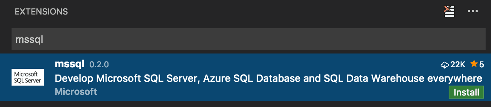
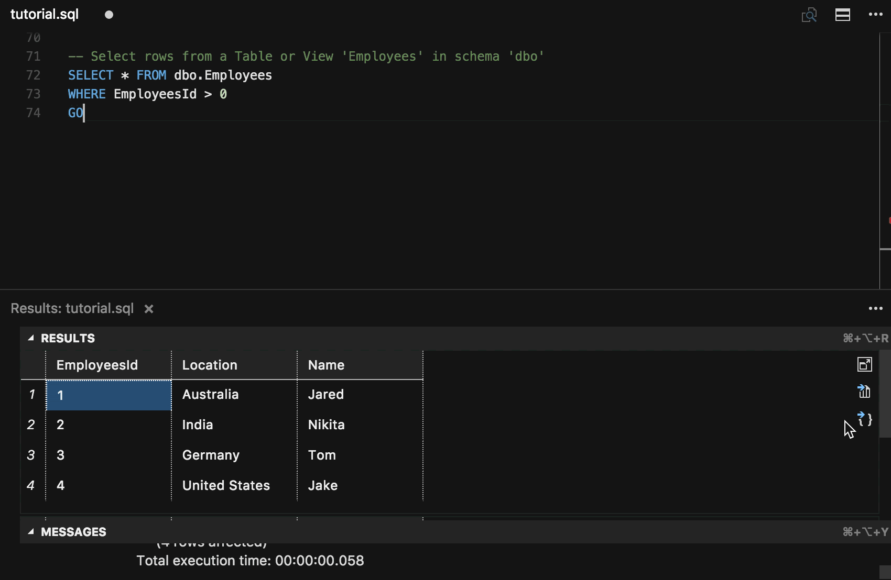

# Transact-SQL in Visual Studio Code {#transact-sql-in-visual-studio-code}

Visual Studio Code를 [Transact-SQL] (T-SQL) 개발을 위한 강력한 편집기로 변환하세요. VS Code Marketplace에서 사용할 수 있는 [mssql] 확장 프로그램을 통해 가능합니다. [mssql] 확장 프로그램은 온프레미스, 클라우드, Azure SQL Database 및 Azure SQL Data Warehouse에서 실행되는 SQL Server와 함께 작동하도록 최적화되어 있습니다.

SQL 데이터베이스에 연결하고, T-SQL 코드를 입력하고, T-SQL 코드를 실행하고, 결과를 보고, 결과를 JSON 또는 CSV 파일로 저장하세요. T-SQL 코드를 입력하는 동안 T-SQL IntelliSense(코드 완성), 구문 강조, 린팅, 코드 탐색 및 코드 스니펫과 같은 풍부한 T-SQL 언어 기능을 제공합니다.

> [VS Code 다운로드] - 아직 VS Code를 다운로드하지 않았다면, 귀하의 플랫폼(리눅스, macOS 또는 윈도우)에 맞게 빠르게 설치하세요.

## Install T-SQL support {#install-t-sql-support}

VS Code에 T-SQL 언어 지원을 추가하려면 다음과 같이 VS Code 마켓플레이스에서 [mssql] 확장 프로그램을 설치하세요:

1. VS Code 사이드 바에서 **Extensions** 뷰를 엽니다 (`kb(workbench.view.extensions)`).
2. 검색창에 "mssql"을 입력하고 **Install**을 클릭한 후, 프롬프트가 나타나면 VS Code를 다시 로드합니다.

## Connect and Execute T-SQL {#connect-and-execute-t-sql}

온프레미스, 클라우드, Azure SQL Database 및 Azure SQL Data Warehouse에서 실행되는 SQL Server에 쉽게 연결하세요. 그런 다음 T-SQL 문과 배치를 실행하여 결과와 메시지를 확인하세요 - 모두 VS Code 내에서 가능합니다. 최근 연결은 세션 간에 저장되므로 데이터베이스에 빠르게 다시 연결할 수 있습니다.

## View and Save Results {#view-and-save-results}

T-SQL 코드를 실행할 때 결과와 메시지를 확인하세요. 결과를 JSON 또는 CSV 파일로 저장하여 애플리케이션에서 데이터를 몇 번의 클릭으로 사용할 수 있습니다.

## T-SQL IntelliSense {#t-sql-intellisense}

편집기에서 T-SQL 코드를 입력할 때, VS Code는 데이터베이스에 연결되어 있을 때 T-SQL 키워드에 대한 지능형 코드 완성, 스키마 객체 이름(테이블, 열, 뷰)에 대한 제안 및 함수와 프로시저에 대한 매개변수 도움말을 제공합니다.

## Linting {#linting}

린팅은 잠재적인 구문 오류에 대한 T-SQL 코드 분석입니다. Visual Studio Code를 사용하여 T-SQL 코드를 입력하는 동안 오류 및 경고로 빠르게 탐색할 수 있습니다.

## Peek Definition/Go to Definition {#peek-definitiongo-to-definition}

**Peek Definition** 또는 **Go to Definition**을 사용하여 T-SQL 코드를 입력하는 동안 데이터베이스의 스키마 객체(테이블, 함수, 프로시저 등)의 정의를 빠르게 탐색하세요.

## Snippets {#snippets}

T-SQL 스니펫은 일반적으로 사용되는 T-SQL 문에 대한 코드 템플릿을 제공합니다. "sql"을 입력하여 T-SQL 스니펫 목록을 확인하세요.

## Next steps {#next-steps}

* 무료 [SQL Server 2017 Developer Edition]을 다운로드하세요.
* Visual Studio Code Marketplace에서 [mssql] 확장 프로그램을 설치하세요.
* [앱 만들기] - macOS, 리눅스 및 윈도우에서 좋아하는 프로그래밍 언어를 사용하여 SQL Server를 시작하세요.
* [GitHub]에서 mssql 확장 프로그램에 기여하세요. [GitHub Issue Tracker]에 버그 보고서나 기능 제안을 제출하세요.

## Further Reading {#further-reading}

* [SQL Server documentation]
* [SQL Server on Linux documentation]
* [SQL Server Blog]

[앱 만들기]: https://aka.ms/sqldev
[VS Code 다운로드]: https://code.visualstudio.com/download
[GitHub]: https://github.com/microsoft/vscode-mssql
[GitHub Issue Tracker]: https://github.com/microsoft/vscode-mssql/issues
[mssql]: https://aka.ms/mssql-marketplace
[SQL Server 2017 Developer Edition]: https://www.microsoft.com/sql-server/sql-server-downloads
[SQL Server Blog]: https://blogs.technet.microsoft.com/dataplatforminsider/
[SQL Server documentation]: https://learn.microsoft.com/sql/sql-server
[SQL Server on Linux documentation]: https://learn.microsoft.com/sql/linux/sql-server-linux-overview/
[Transact-SQL]: https://learn.microsoft.com/sql/t-sql/language-reference